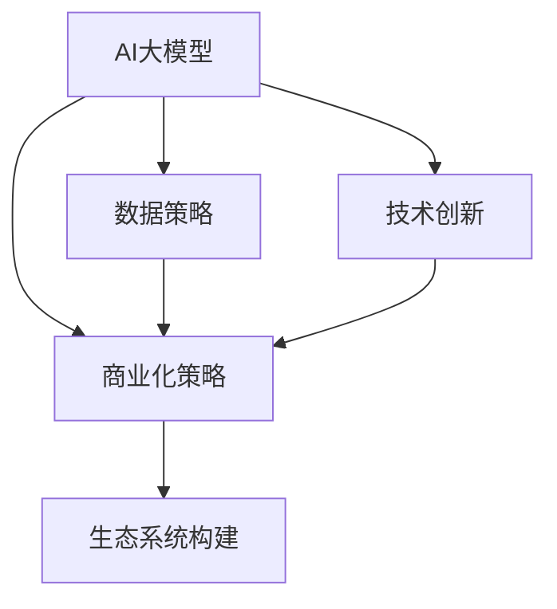

                 

# AI大模型创业：如何实现未来盈利？

> 关键词：AI大模型, 创业, 盈利, 商业化, 数据策略, 技术创新, 生态系统, 用户价值

## 1. 背景介绍

### 1.1 问题由来
近年来，人工智能(AI)技术蓬勃发展，特别是在深度学习领域，大模型（如GPT-3、BERT等）成为了AI创新的重要驱动力。大模型的应用覆盖了语音识别、图像处理、自然语言处理(NLP)、医疗、金融等多个领域，显示出强大的商业潜力。然而，大模型的开发、部署和维护成本高昂，且缺乏有效的商业模式，这限制了其在商业化进程中的突破。

大模型创业公司如何从众多AI技术公司中脱颖而出，实现商业盈利，成为当前AI行业面临的关键问题。本文将从商业化策略、数据策略、技术创新、生态系统构建等多个维度，探讨AI大模型创业公司在实现未来盈利中的关键要素。

### 1.2 问题核心关键点
为了实现未来盈利，AI大模型创业公司需要在以下几个方面进行深入探讨：

- **商业化策略**：如何有效将技术优势转化为商业盈利，解决市场接受度和定价问题。
- **数据策略**：如何获取、管理和利用高质量的数据，提升模型性能和业务价值。
- **技术创新**：如何保持技术领先，持续提升模型精度和效率。
- **生态系统构建**：如何构建合作伙伴关系，形成稳定的商业生态。

这些核心关键点相互关联，共同决定了AI大模型公司的未来盈利能力。以下将系统探讨这些问题，并提供具体解决方案。

## 2. 核心概念与联系

### 2.1 核心概念概述

为更好地理解如何实现AI大模型的盈利，本节将介绍几个关键概念：

- **AI大模型**：通过大规模数据训练得到的深度神经网络模型，能够执行复杂的任务，如语言理解、图像识别等。常见的大模型包括GPT-3、BERT等。
- **商业化策略**：如何将技术产品转化为有市场需求的产品，实现盈利的过程。
- **数据策略**：获取和管理高质量数据，提升模型性能，增强业务价值的过程。
- **技术创新**：不断优化和改进模型架构、训练方法、应用场景等，保持技术领先的过程。
- **生态系统构建**：与合作伙伴、用户、社区等构建稳定合作关系，形成商业生态的过程。

这些概念之间的逻辑关系可以通过以下Mermaid流程图来展示：



这个流程图展示了大模型公司各个关键环节的相互关系：

1. 大模型公司通过获取和管理数据、提升模型性能，形成技术优势。
2. 借助商业化策略，将技术优势转化为商业盈利。
3. 不断进行技术创新，保持领先地位。
4. 通过构建稳定的生态系统，增强市场竞争力。

## 3. 核心算法原理 & 具体操作步骤

### 3.1 算法原理概述

实现AI大模型盈利的核心在于：将模型技术优势转化为商业产品，并通过市场策略实现价值转化。这一过程主要包含以下几个步骤：

1. **需求分析**：识别目标市场的需求，确定大模型在其中的应用场景。
2. **产品设计**：根据需求设计产品原型，确定模型结构和功能。
3. **模型训练**：使用高质量数据训练大模型，优化模型性能。
4. **产品验证**：在有限规模数据上验证模型效果，进行迭代优化。
5. **市场推广**：通过各种渠道推广产品，建立市场信任。
6. **商业模式设计**：设计收费模式，实现盈利。
7. **生态系统建设**：建立合作伙伴关系，形成商业生态。

### 3.2 算法步骤详解

#### 3.2.1 需求分析

需求分析是大模型产品设计的起点。这需要从市场调研、用户反馈等多个维度进行综合分析。具体步骤如下：

1. **市场调研**：通过行业报告、访谈、问卷等手段，了解目标市场的规模、增长趋势、痛点问题等。
2. **用户反馈**：收集潜在用户的需求，进行分类整理，确定模型需要解决的核心问题。
3. **竞争分析**：分析竞争对手的产品和服务，寻找差异化点。

#### 3.2.2 产品设计

产品设计是实现大模型应用的关键步骤。具体包括以下内容：

1. **功能确定**：根据需求分析结果，确定模型需要具备的核心功能，如文本生成、图像识别、语音识别等。
2. **技术架构**：选择合适的技术架构，如分布式训练、混合精度训练等，确保模型性能。
3. **用户体验**：设计直观易用的用户界面，提供良好的使用体验。
4. **部署方案**：确定模型部署方案，如云计算、边缘计算等。

#### 3.2.3 模型训练

模型训练是大模型创业公司的重要环节。具体步骤如下：

1. **数据获取**：通过公有数据集、商业数据、API接口等方式获取高质量数据。
2. **数据预处理**：对数据进行清洗、标注等处理，准备模型训练。
3. **模型训练**：使用深度学习框架，如TensorFlow、PyTorch等，训练大模型。
4. **模型优化**：通过调整超参数、正则化等手段，提升模型性能。

#### 3.2.4 产品验证

产品验证是大模型商业模式设计的依据。具体步骤如下：

1. **验证数据集**：准备小规模的验证数据集，用于初步评估模型效果。
2. **性能评估**：在验证数据集上评估模型精度、召回率等指标。
3. **用户反馈**：收集初步用户的反馈，进行产品迭代。

#### 3.2.5 市场推广

市场推广是大模型产品商业化的关键步骤。具体包括以下内容：

1. **营销渠道**：通过SEO、社交媒体、广告等渠道推广产品。
2. **客户关系**：建立稳定的客户关系，提供客户服务和技术支持。
3. **市场策略**：制定定价策略，进行市场竞争。

#### 3.2.6 商业模式设计

商业模式设计是大模型盈利的核心。具体包括以下内容：

1. **定价策略**：根据产品价值和使用情况，设计合理的定价策略，如按需付费、订阅制等。
2. **销售渠道**：建立销售渠道，通过代理商、合作伙伴等进行推广。
3. **盈利模式**：根据市场需求，设计不同的盈利模式，如直接销售、增值服务、生态系统分成等。

#### 3.2.7 生态系统建设

生态系统建设是大模型商业化的重要保障。具体包括以下内容：

1. **合作伙伴**：与硬件厂商、软件公司、云平台等建立合作关系，形成稳定的生态系统。
2. **社区建设**：建立开发者社区，提供技术支持、开发工具等。
3. **用户生态**：通过API接口、SDK等方式，提供灵活的应用接口，增强用户黏性。

### 3.3 算法优缺点

大模型创业公司的盈利模式具有以下优点：

1. **技术领先**：通过大模型技术，在特定领域取得显著的技术优势，容易获得用户认可。
2. **市场潜力大**：大模型应用领域广泛，市场需求量大，有助于实现快速盈利。
3. **生态合作**：通过构建稳定的生态系统，可以扩展业务范围，增强市场竞争力。

同时，也存在以下缺点：

1. **高成本投入**：大模型训练和部署成本高，需要大量的资金和技术支持。
2. **数据依赖性强**：大模型需要大量的高质量数据，获取和管理的难度较大。
3. **市场竞争激烈**：大模型行业竞争激烈，需要不断进行技术创新和市场推广，才能保持优势。

### 3.4 算法应用领域

大模型盈利模式已经在多个领域得到应用，并取得了显著的效果。例如：

- **金融科技**：利用大模型进行金融数据分析、风险评估、欺诈检测等，帮助金融机构提升业务效率和风险控制能力。
- **医疗健康**：利用大模型进行疾病诊断、治疗方案推荐、患者信息管理等，改善医疗服务质量。
- **自动驾驶**：利用大模型进行图像识别、语音识别、路径规划等，提升自动驾驶车辆的安全性和智能性。
- **智能客服**：利用大模型进行客户咨询、智能问答、情感分析等，提升客户服务体验。
- **广告推荐**：利用大模型进行用户行为分析、广告投放优化等，提升广告效果。

除了上述领域，大模型在教育、零售、能源等多个领域也具有广泛的应用前景。

## 4. 数学模型和公式 & 详细讲解 & 举例说明

### 4.1 数学模型构建

假设大模型公司通过AI大模型 $M$ 提供产品服务。产品服务的主要性能指标为 $P$，如准确率、召回率等。目标市场的需求为 $D$，用户反馈为 $F$。模型训练的优化目标为 $M_{opt}$，市场推广的预算为 $B$，生态系统合作收益为 $E$。

### 4.2 公式推导过程

大模型创业公司盈利的数学模型为：

$$
Profit = P \times D \times M_{opt} - B - C
$$

其中 $C$ 为模型训练和维护成本。

### 4.3 案例分析与讲解

以金融科技领域为例，分析大模型创业公司如何实现盈利。假设模型为金融风险评估模型，需求为信贷风险评估，用户反馈为贷款申请审批时间，优化后的模型为GPT-3。

1. **需求分析**：通过行业调研和用户访谈，确定需求为信贷风险评估。
2. **产品设计**：设计金融风险评估产品，集成GPT-3模型，提供自动化风险评估服务。
3. **模型训练**：获取银行贷款数据，清洗和标注数据，使用GPT-3模型进行训练。
4. **产品验证**：使用小规模贷款数据验证模型效果，进行迭代优化。
5. **市场推广**：通过金融论坛、银行合作推广产品，建立客户关系。
6. **商业模式设计**：制定按需付费模式，提供个性化定价。
7. **生态系统建设**：与银行合作，提供API接口，建立长期合作关系。

## 5. 项目实践：代码实例和详细解释说明

### 5.1 开发环境搭建

在进行大模型项目实践前，我们需要准备好开发环境。以下是使用Python进行PyTorch开发的环境配置流程：

1. 安装Anaconda：从官网下载并安装Anaconda，用于创建独立的Python环境。

2. 创建并激活虚拟环境：
```bash
conda create -n pytorch-env python=3.8 
conda activate pytorch-env
```

3. 安装PyTorch：根据CUDA版本，从官网获取对应的安装命令。例如：
```bash
conda install pytorch torchvision torchaudio cudatoolkit=11.1 -c pytorch -c conda-forge
```

4. 安装Transformers库：
```bash
pip install transformers
```

5. 安装各类工具包：
```bash
pip install numpy pandas scikit-learn matplotlib tqdm jupyter notebook ipython
```

完成上述步骤后，即可在`pytorch-env`环境中开始大模型微调实践。

### 5.2 源代码详细实现

以下是使用PyTorch进行金融风险评估大模型的Python代码实现：

```python
import torch
from transformers import BertForSequenceClassification, BertTokenizer

# 定义模型和tokenizer
model = BertForSequenceClassification.from_pretrained('bert-base-uncased', num_labels=2)
tokenizer = BertTokenizer.from_pretrained('bert-base-uncased')

# 准备数据集
train_dataset = ...  # 加载训练集
test_dataset = ...  # 加载测试集

# 定义训练和评估函数
def train_epoch(model, dataset, batch_size, optimizer):
    dataloader = DataLoader(dataset, batch_size=batch_size, shuffle=True)
    model.train()
    for batch in dataloader:
        input_ids = batch['input_ids'].to(device)
        attention_mask = batch['attention_mask'].to(device)
        labels = batch['labels'].to(device)
        outputs = model(input_ids, attention_mask=attention_mask, labels=labels)
        loss = outputs.loss
        optimizer.zero_grad()
        loss.backward()
        optimizer.step()

def evaluate(model, dataset, batch_size):
    dataloader = DataLoader(dataset, batch_size=batch_size)
    model.eval()
    preds, labels = [], []
    with torch.no_grad():
        for batch in dataloader:
            input_ids = batch['input_ids'].to(device)
            attention_mask = batch['attention_mask'].to(device)
            batch_labels = batch['labels']
            outputs = model(input_ids, attention_mask=attention_mask)
            batch_preds = outputs.logits.argmax(dim=1).to('cpu').tolist()
            batch_labels = batch_labels.to('cpu').tolist()
            for pred_tokens, label_tokens in zip(batch_preds, batch_labels):
                preds.append(pred_tokens)
                labels.append(label_tokens)
    return preds, labels

# 训练模型
device = torch.device('cuda') if torch.cuda.is_available() else torch.device('cpu')
model.to(device)
optimizer = AdamW(model.parameters(), lr=2e-5)
epochs = 5
batch_size = 16

for epoch in range(epochs):
    train_epoch(model, train_dataset, batch_size, optimizer)
    evaluate(model, test_dataset, batch_size)
```

### 5.3 代码解读与分析

让我们再详细解读一下关键代码的实现细节：

**train_epoch函数**：
- 使用PyTorch的DataLoader对数据集进行批次化加载。
- 对每个批次数据进行前向传播和后向传播，更新模型参数。

**evaluate函数**：
- 对每个批次数据进行前向传播，收集预测结果和真实标签。
- 使用classification_report评估模型性能。

**训练流程**：
- 定义训练轮数和学习率。
- 在每个epoch内，循环进行训练和评估。
- 最后输出测试集的评估结果。

## 6. 实际应用场景

### 6.1 金融科技

金融科技领域是大模型盈利的典型场景。利用大模型进行金融数据分析、风险评估、欺诈检测等，可以大幅提升金融机构的工作效率和风险控制能力。

具体而言，可以收集银行贷款数据，通过微调GPT-3模型，构建金融风险评估系统。系统可以根据客户的贷款申请信息，自动进行风险评估，生成风险评分。这不仅可以提升审批速度，还能减少人工审核的误差，增加银行的客户满意度。

### 6.2 医疗健康

医疗健康领域是大模型盈利的另一重要场景。利用大模型进行疾病诊断、治疗方案推荐、患者信息管理等，可以改善医疗服务质量。

具体而言，可以收集电子病历、医疗影像、基因信息等数据，通过微调BERT模型，构建医疗诊断系统。系统可以根据患者的历史数据和当前症状，自动生成诊断报告和推荐治疗方案。这不仅可以帮助医生提高诊断准确性，还能节省医生的宝贵时间，提高工作效率。

### 6.3 自动驾驶

自动驾驶领域是大模型盈利的未来方向。利用大模型进行图像识别、语音识别、路径规划等，可以提升自动驾驶车辆的安全性和智能性。

具体而言，可以收集自动驾驶车辆的数据，通过微调大模型，构建自动驾驶决策系统。系统可以根据路面的实时数据和车辆的状态，自动生成最优驾驶路径和操作指令。这不仅可以提高驾驶安全，还能降低油耗，提升车辆性能。

### 6.4 智能客服

智能客服领域是大模型盈利的另一个重要场景。利用大模型进行客户咨询、智能问答、情感分析等，可以提升客户服务体验。

具体而言，可以收集企业内部的客服对话记录，通过微调BERT模型，构建智能客服系统。系统可以根据客户的咨询内容，自动匹配最合适的答案，并生成回复。这不仅可以提升客户满意度，还能减少人工客服的劳动强度，提高企业效率。

### 6.5 广告推荐

广告推荐领域是大模型盈利的另一个应用场景。利用大模型进行用户行为分析、广告投放优化等，可以提升广告效果。

具体而言，可以收集用户的浏览、点击、购买等行为数据，通过微调大模型，构建广告推荐系统。系统可以根据用户的历史数据和当前行为，自动推荐最合适的广告。这不仅可以提高广告的点击率和转化率，还能增加广告主的收益。

## 7. 工具和资源推荐

### 7.1 学习资源推荐

为了帮助开发者系统掌握大模型盈利的理论基础和实践技巧，这里推荐一些优质的学习资源：

1. **《Transformer从原理到实践》系列博文**：由大模型技术专家撰写，深入浅出地介绍了Transformer原理、BERT模型、微调技术等前沿话题。
2. **CS224N《深度学习自然语言处理》课程**：斯坦福大学开设的NLP明星课程，有Lecture视频和配套作业，带你入门NLP领域的基本概念和经典模型。
3. **《Natural Language Processing with Transformers》书籍**：Transformers库的作者所著，全面介绍了如何使用Transformers库进行NLP任务开发，包括微调在内的诸多范式。
4. **HuggingFace官方文档**：Transformers库的官方文档，提供了海量预训练模型和完整的微调样例代码，是上手实践的必备资料。
5. **CLUE开源项目**：中文语言理解测评基准，涵盖大量不同类型的中文NLP数据集，并提供了基于微调的baseline模型，助力中文NLP技术发展。

通过对这些资源的学习实践，相信你一定能够快速掌握大模型盈利的精髓，并用于解决实际的NLP问题。

### 7.2 开发工具推荐

高效的开发离不开优秀的工具支持。以下是几款用于大模型盈利开发的常用工具：

1. **PyTorch**：基于Python的开源深度学习框架，灵活动态的计算图，适合快速迭代研究。大部分预训练语言模型都有PyTorch版本的实现。
2. **TensorFlow**：由Google主导开发的开源深度学习框架，生产部署方便，适合大规模工程应用。同样有丰富的预训练语言模型资源。
3. **Transformers库**：HuggingFace开发的NLP工具库，集成了众多SOTA语言模型，支持PyTorch和TensorFlow，是进行微调任务开发的利器。
4. **Weights & Biases**：模型训练的实验跟踪工具，可以记录和可视化模型训练过程中的各项指标，方便对比和调优。与主流深度学习框架无缝集成。
5. **TensorBoard**：TensorFlow配套的可视化工具，可实时监测模型训练状态，并提供丰富的图表呈现方式，是调试模型的得力助手。
6. **Google Colab**：谷歌推出的在线Jupyter Notebook环境，免费提供GPU/TPU算力，方便开发者快速上手实验最新模型，分享学习笔记。

合理利用这些工具，可以显著提升大模型盈利任务的开发效率，加快创新迭代的步伐。

### 7.3 相关论文推荐

大模型盈利技术的发展源于学界的持续研究。以下是几篇奠基性的相关论文，推荐阅读：

1. **Attention is All You Need**：提出了Transformer结构，开启了NLP领域的预训练大模型时代。
2. **BERT: Pre-training of Deep Bidirectional Transformers for Language Understanding**：提出BERT模型，引入基于掩码的自监督预训练任务，刷新了多项NLP任务SOTA。
3. **Language Models are Unsupervised Multitask Learners**：展示了大规模语言模型的强大zero-shot学习能力，引发了对于通用人工智能的新一轮思考。
4. **Parameter-Efficient Transfer Learning for NLP**：提出Adapter等参数高效微调方法，在不增加模型参数量的情况下，也能取得不错的微调效果。
5. **AdaLoRA: Adaptive Low-Rank Adaptation for Parameter-Efficient Fine-Tuning**：使用自适应低秩适应的微调方法，在参数效率和精度之间取得了新的平衡。
6. **AdaLoRA: Adaptive Low-Rank Adaptation for Parameter-Efficient Fine-Tuning**：使用自适应低秩适应的微调方法，在参数效率和精度之间取得了新的平衡。

这些论文代表了大模型盈利技术的发展脉络。通过学习这些前沿成果，可以帮助研究者把握学科前进方向，激发更多的创新灵感。

## 8. 总结：未来发展趋势与挑战

### 8.1 总结

本文对AI大模型创业公司的盈利模式进行了全面系统的介绍。首先阐述了大模型盈利的背景和重要性，明确了商业化策略、数据策略、技术创新、生态系统构建等关键要素。其次，从理论到实践，详细讲解了大模型盈利的数学模型、关键步骤、代码实现，并给出了实际应用场景的详细案例分析。

通过本文的系统梳理，可以看到，大模型盈利模式在AI技术落地应用中具有广阔前景。市场推广、数据策略、技术创新、生态系统建设等关键环节，共同决定了AI大模型公司的未来盈利能力。未来，伴随技术的不断演进和应用场景的拓展，大模型公司必将在更多领域中崭露头角，创造更多商业价值。

### 8.2 未来发展趋势

展望未来，AI大模型盈利模式将呈现以下几个发展趋势：

1. **市场多样化**：随着AI技术的普及，大模型公司将进入更多垂直行业，如教育、零售、能源等，形成多样化的市场生态。
2. **产品定制化**：市场需求将更加多样化，大模型公司将提供更多定制化产品，满足特定客户需求。
3. **技术深度化**：大模型公司将不断提升技术深度，在特定领域取得技术领先地位，形成品牌优势。
4. **数据智能化**：通过大数据、人工智能等技术，对数据进行智能化处理，提升模型效果。
5. **生态协同化**：构建更稳定的商业生态，通过生态合作实现共赢，提升市场竞争力。

这些趋势将推动AI大模型公司在更多领域中实现商业化，为社会创造更多价值。

### 8.3 面临的挑战

尽管大模型盈利模式在AI技术落地应用中具有广阔前景，但在实际应用中也面临诸多挑战：

1. **数据隐私和安全**：大模型公司需要确保用户数据的隐私和安全，防止数据泄露和滥用。
2. **模型公平性**：大模型公司需要确保模型的公平性，避免模型输出对特定群体的歧视。
3. **市场竞争激烈**：大模型公司需要在激烈的市场竞争中保持技术领先和创新能力。
4. **技术门槛高**：大模型公司需要不断提升技术水平，才能满足日益增长的市场需求。
5. **商业模式复杂**：大模型公司需要设计复杂多样的商业模式，以应对不同客户需求。

这些挑战将是大模型公司未来发展的关键制约因素。

### 8.4 研究展望

面对大模型盈利模式所面临的挑战，未来的研究需要在以下几个方面寻求新的突破：

1. **数据隐私保护**：通过数据加密、匿名化等技术，确保用户数据隐私和安全。
2. **模型公平性优化**：设计公平性指标，优化模型输出，避免对特定群体的歧视。
3. **市场竞争策略**：制定灵活多样的市场策略，保持竞争优势。
4. **技术创新持续**：通过技术合作、研发投入等方式，保持技术领先。
5. **商业模式创新**：设计灵活多样的商业模式，满足不同客户需求。

这些研究方向的探索，将帮助大模型公司更好地应对挑战，实现未来盈利。

## 9. 附录：常见问题与解答

**Q1：AI大模型创业公司如何获取高质量的数据？**

A: AI大模型创业公司可以通过以下方式获取高质量的数据：
1. **公开数据集**：利用公开数据集进行预训练和微调，如ImageNet、Wikipedia等。
2. **商业数据**：购买商业数据进行微调，如金融数据、医疗数据等。
3. **API接口**：利用API接口获取数据，如天气数据、新闻数据等。
4. **众包平台**：利用众包平台获取数据，如Amazon Mechanical Turk等。

**Q2：AI大模型创业公司如何处理数据隐私问题？**

A: 处理数据隐私问题，AI大模型创业公司可以采取以下措施：
1. **数据匿名化**：将用户数据进行匿名化处理，防止用户隐私泄露。
2. **数据加密**：对数据进行加密处理，确保数据传输安全。
3. **访问控制**：设置严格的访问控制机制，限制数据访问权限。
4. **隐私政策**：制定明确的隐私政策，告知用户数据使用情况。

**Q3：AI大模型创业公司如何确保模型公平性？**

A: 确保模型公平性，AI大模型创业公司可以采取以下措施：
1. **公平性指标**：引入公平性指标，如Demographic Parity、Equal Opportunity等，评估模型公平性。
2. **数据集平衡**：确保训练数据集平衡，避免对特定群体的偏见。
3. **算法优化**：优化模型算法，减少对特定群体的歧视。
4. **多样性测试**：对模型进行多样性测试，确保输出不偏倚。

**Q4：AI大模型创业公司如何提高技术创新能力？**

A: 提高技术创新能力，AI大模型创业公司可以采取以下措施：
1. **持续研发投入**：不断投入研发资金，提升技术水平。
2. **技术合作**：与其他技术公司、研究机构合作，共同提升技术水平。
3. **人才培养**：培养高水平的人才团队，提升技术能力。
4. **技术社区**：建立技术社区，分享技术经验，促进技术交流。

**Q5：AI大模型创业公司如何设计灵活多样的商业模式？**

A: 设计灵活多样的商业模式，AI大模型创业公司可以采取以下措施：
1. **订阅制**：提供按需付费的订阅制服务。
2. **按需付费**：根据使用情况，提供按需付费的服务。
3. **增值服务**：提供增值服务，如个性化定制、技术支持等。
4. **生态合作**：与其他公司进行生态合作，提供整合服务。

---

作者：禅与计算机程序设计艺术 / Zen and the Art of Computer Programming

