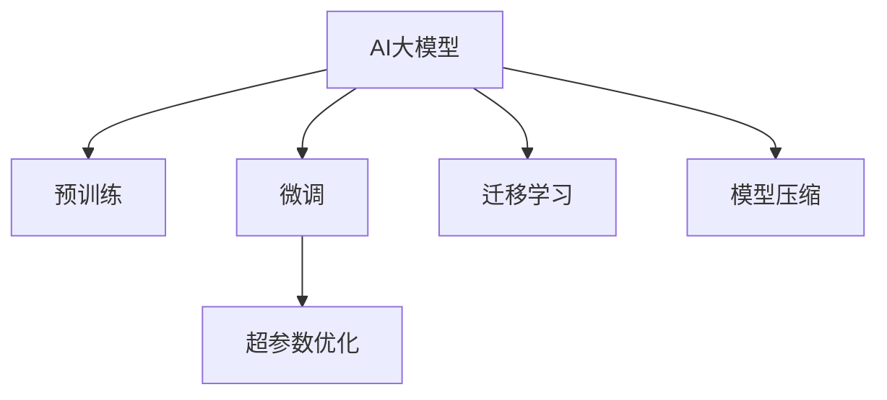

                 

## 1. 背景介绍

随着人工智能技术的飞速发展，AI大模型（AI Large Models）在各个行业中的应用越来越广泛。无论是图像识别、语音识别，还是自然语言处理（NLP），AI大模型都表现出了强大的能力和潜力。然而，随着市场的逐步成熟，AI大模型行业的竞争也日趋激烈，价格战已经悄然打响。

价格战不仅会导致市场份额的重新分配，也会影响到企业的生存和发展。在激烈的市场竞争中，企业如何通过技术创新和运营策略应对未来价格战，成为每个AI大模型创业者的重要课题。

## 2. 核心概念与联系

### 2.1 核心概念概述

要应对未来AI大模型行业的价格战，首先需要理解一些核心概念，包括AI大模型、预训练、微调、迁移学习、超参数优化、模型压缩等。

- **AI大模型**：指使用深度学习技术训练的、参数量巨大的模型，如BERT、GPT-3等。这些模型在各种NLP任务上表现优异。
- **预训练**：指在大规模无标签数据上训练模型，学习通用的语言表示。预训练的模型可以作为初始化参数进行微调，提升特定任务的性能。
- **微调**：指在预训练模型的基础上，使用少量有标签数据进行任务特定的优化。微调可以显著提升模型在特定任务上的性能。
- **迁移学习**：指将一个领域学习到的知识，迁移到另一个领域进行学习。AI大模型可以通过迁移学习，在不同领域应用。
- **超参数优化**：指通过调整模型参数之外的其他参数，如学习率、批大小等，以优化模型的性能。
- **模型压缩**：指在不显著降低模型性能的前提下，通过量化、剪枝等方法减小模型的参数和存储需求。

这些概念之间存在着紧密的联系。预训练是AI大模型的基础，微调和迁移学习是在预训练基础上进行的任务优化，超参数优化和模型压缩则是为了提升模型的效率和适应性。

### 2.2 核心概念原理和架构的 Mermaid 流程图(Mermaid 流程节点中不要有括号、逗号等特殊字符)



这个流程图展示了AI大模型从预训练到微调和迁移学习，再到超参数优化和模型压缩的整个流程。

## 3. 核心算法原理 & 具体操作步骤

### 3.1 算法原理概述

AI大模型的核心算法原理基于深度学习技术，尤其是神经网络。通过在大规模数据集上进行预训练，模型能够学习到通用的语言表示。在此基础上，通过微调和迁移学习，模型可以适应特定任务，并在不同领域中迁移应用。

预训练通常使用自监督学习任务，如掩码语言模型（Masked Language Model, MLM）、自回归语言模型（Autoregressive Language Model, ARLM）等。这些任务不需要人工标注，可以大规模训练，获得高质量的通用语言表示。

微调则是在预训练模型基础上，使用少量有标签数据进行优化。通过微调，模型可以针对特定任务进行细粒度的调整，提升性能。

### 3.2 算法步骤详解

AI大模型的预训练步骤通常包括以下几个关键步骤：

1. **数据准备**：选择适合大规模预训练的数据集，通常使用无标签文本数据，如维基百科、新闻等。
2. **模型选择**：选择适合的神经网络结构，如Transformer、BERT等。
3. **训练**：在GPU或TPU等高性能设备上进行预训练，通常需要大规模的计算资源。
4. **验证**：在验证集上评估预训练模型的性能，调整超参数和模型结构。
5. **保存模型**：保存预训练模型，供后续微调和迁移学习使用。

微调步骤通常包括以下几个关键步骤：

1. **任务定义**：选择适合的NLP任务，如分类、匹配、生成等。
2. **数据准备**：准备少量有标签数据，供模型进行微调。
3. **模型选择**：选择适合的预训练模型，如BERT、GPT等。
4. **微调**：使用微调数据对预训练模型进行优化，提升在特定任务上的性能。
5. **评估**：在测试集上评估微调模型的性能，确保模型效果。
6. **部署**：将微调模型部署到实际应用中。

迁移学习的步骤通常包括以下几个关键步骤：

1. **任务定义**：选择适合的迁移学习任务，如跨领域、跨语言等。
2. **数据准备**：准备少量有标签数据，供模型进行迁移学习。
3. **模型选择**：选择适合的预训练模型，如BERT、GPT等。
4. **迁移学习**：使用迁移学习数据对预训练模型进行优化，提升在特定领域或语言的性能。
5. **评估**：在测试集上评估迁移学习模型的性能，确保模型效果。
6. **部署**：将迁移学习模型部署到实际应用中。

### 3.3 算法优缺点

AI大模型具有以下优点：

- **性能优越**：通过预训练和微调，AI大模型在各种NLP任务上表现优异。
- **泛化能力强**：AI大模型具有较强的泛化能力，可以在不同领域和任务中迁移应用。
- **训练效率高**：预训练模型可以作为初始化参数，加快微调和迁移学习过程。

同时，AI大模型也存在一些缺点：

- **计算资源消耗大**：预训练和微调需要大量的计算资源，如GPU或TPU。
- **存储需求高**：预训练和微调模型参数量巨大，存储需求较高。
- **过拟合风险高**：在微调和迁移学习过程中，容易发生过拟合，需要适当的正则化技术。
- **模型复杂度高**：AI大模型的结构复杂，调试和优化难度较大。

### 3.4 算法应用领域

AI大模型在以下几个领域中得到了广泛应用：

- **自然语言处理（NLP）**：如语言理解、生成、翻译、摘要等。
- **计算机视觉**：如图像分类、目标检测、图像生成等。
- **语音识别**：如语音转文本、语音合成等。
- **推荐系统**：如电商推荐、内容推荐等。
- **医疗健康**：如疾病诊断、治疗方案推荐等。

## 4. 数学模型和公式 & 详细讲解 & 举例说明

### 4.1 数学模型构建

AI大模型的数学模型通常基于深度学习框架，如PyTorch、TensorFlow等。这里以BERT为例，介绍其数学模型构建。

BERT的数学模型构建包括以下几个关键步骤：

1. **输入嵌入**：将输入文本转换为向量表示。
2. **掩码语言模型（MLM）**：使用随机掩码对文本进行掩码，训练模型预测被掩码的单词。
3. **下一句预测（NSP）**：随机选择两个句子，训练模型预测第二个句子是否紧跟在第一个句子之后。
4. **输出嵌入**：将模型输出转换为预测结果。

### 4.2 公式推导过程

BERT的掩码语言模型（MLM）公式如下：

$$
\ell(\theta) = -\frac{1}{N}\sum_{i=1}^N \sum_{j=1}^N [y_{i,j}\log p_{i,j} + (1-y_{i,j})\log(1-p_{i,j})]
$$

其中，$N$ 为训练样本数，$y_{i,j}$ 为掩码位置 $j$ 的真实单词，$p_{i,j}$ 为模型在位置 $j$ 预测的单词概率。

### 4.3 案例分析与讲解

以BERT为例，分析其掩码语言模型（MLM）的优化过程。

BERT的掩码语言模型（MLM）目标函数为：

$$
\min_{\theta} \ell(\theta) = -\frac{1}{N}\sum_{i=1}^N \sum_{j=1}^N [y_{i,j}\log p_{i,j} + (1-y_{i,j})\log(1-p_{i,j})]
$$

其中，$\theta$ 为模型参数，$y_{i,j}$ 为掩码位置 $j$ 的真实单词，$p_{i,j}$ 为模型在位置 $j$ 预测的单词概率。

在训练过程中，通过反向传播算法更新模型参数 $\theta$，最小化损失函数 $\ell(\theta)$。优化算法通常使用Adam或SGD等，学习率需要进行调整。

## 5. 项目实践：代码实例和详细解释说明

### 5.1 开发环境搭建

在开发AI大模型时，需要搭建良好的开发环境。以下是一个典型的开发环境搭建流程：

1. **安装Python**：选择合适版本的Python，并配置好环境。
2. **安装深度学习框架**：安装PyTorch或TensorFlow等深度学习框架。
3. **安装数据处理工具**：安装Pandas、Numpy等数据处理工具。
4. **安装数据集**：下载适合的大规模数据集，如维基百科、新闻等。
5. **安装GPU加速**：安装适合GPU加速的驱动程序，如NVIDIA CUDA等。

### 5.2 源代码详细实现

以下是一个简单的AI大模型训练代码示例：

```python
import torch
import torch.nn as nn
import torch.optim as optim
from transformers import BertTokenizer, BertModel, BertForMaskedLM

# 加载数据集
tokenizer = BertTokenizer.from_pretrained('bert-base-uncased')
train_data = 'train_data.txt'
val_data = 'val_data.txt'
test_data = 'test_data.txt'

# 加载预训练模型
model = BertModel.from_pretrained('bert-base-uncased')

# 定义损失函数和优化器
criterion = nn.CrossEntropyLoss()
optimizer = optim.Adam(model.parameters(), lr=1e-5)

# 训练过程
for epoch in range(10):
    train_loss = 0
    train_acc = 0
    val_loss = 0
    val_acc = 0
    
    for i in range(len(train_data)):
        # 获取训练样本
        inputs = tokenizer(train_data[i], return_tensors='pt')
        labels = torch.tensor(inputs['input_ids'][:, :len(inputs['input_ids'])], dtype=torch.long)
        
        # 前向传播和反向传播
        outputs = model(**inputs)
        loss = criterion(outputs, labels)
        optimizer.zero_grad()
        loss.backward()
        optimizer.step()
        
        # 计算训练和验证损失
        train_loss += loss.item()
        val_loss += loss.item()
        
        # 计算训练和验证准确率
        if i % 100 == 0:
            val_pred = torch.argmax(outputs, dim=2)
            val_labels = tokenizer(val_data[i], return_tensors='pt')['input_ids'][:, :len(tokenizer(val_data[i]))]
            val_acc += (val_pred == val_labels).float().sum().item() / len(val_pred)
    
    # 输出训练和验证结果
    train_loss /= len(train_data)
    val_loss /= len(train_data)
    print(f'Epoch {epoch+1}, train loss: {train_loss:.3f}, val loss: {val_loss:.3f}, val acc: {val_acc:.3f}')
```

### 5.3 代码解读与分析

以上代码实现了使用Bert模型进行掩码语言模型（MLM）训练的过程。关键步骤如下：

1. **数据加载**：使用BertTokenizer加载数据集，将文本转换为向量表示。
2. **模型选择**：选择Bert模型作为初始化参数。
3. **损失函数和优化器**：定义损失函数和优化器，用于模型训练。
4. **训练过程**：循环迭代训练样本，前向传播计算损失，反向传播更新模型参数，输出训练和验证结果。

## 6. 实际应用场景

### 6.1 智能客服系统

AI大模型在智能客服系统中的应用非常广泛。传统的客服系统需要大量人力，高峰期响应速度慢，无法满足客户需求。通过使用AI大模型，可以24小时不间断服务，快速响应客户咨询，提高服务质量。

在实现智能客服系统时，通常需要将客户咨询的文本进行预处理，然后使用预训练的AI大模型进行微调，使其能够理解客户意图，自动回复相关问题。

### 6.2 金融舆情监测

金融市场需要实时监测舆情动向，以规避金融风险。传统的舆情监测方式成本高、效率低，难以应对网络时代的信息爆发。通过使用AI大模型，可以实时监测金融舆情，快速发现负面信息，及时采取措施。

在实现金融舆情监测系统时，需要收集金融领域相关的新闻、报道、评论等文本数据，并对其进行主题标注和情感标注。然后使用预训练的AI大模型进行微调，使其能够自动识别文本情感和主题。

### 6.3 个性化推荐系统

个性化推荐系统通常需要用户的历史行为数据进行推荐，无法深入理解用户的真实兴趣偏好。通过使用AI大模型，可以更好地挖掘用户行为背后的语义信息，从而提供更精准、多样的推荐内容。

在实现个性化推荐系统时，需要收集用户浏览、点击、评论、分享等行为数据，并提取和用户交互的物品标题、描述、标签等文本内容。然后使用预训练的AI大模型进行微调，使其能够从文本内容中准确把握用户的兴趣点，并生成推荐列表。

### 6.4 未来应用展望

随着AI大模型的不断演进，其在各领域的应用前景更加广阔。未来的AI大模型有望实现以下突破：

1. **跨领域迁移能力**：AI大模型将具备更强的跨领域迁移能力，能够在不同领域和任务中迁移应用。
2. **多模态融合**：AI大模型将能够整合视觉、语音、文本等多模态数据，提高其对现实世界的理解和建模能力。
3. **实时计算能力**：AI大模型将具备更强的实时计算能力，能够快速处理大规模数据。
4. **可解释性增强**：AI大模型将具备更强的可解释性，能够更好地解释其决策过程。
5. **安全性保障**：AI大模型将具备更强的安全性保障，能够避免模型偏见和有害信息。

## 7. 工具和资源推荐

### 7.1 学习资源推荐

为了帮助开发者系统掌握AI大模型的知识，以下是一些优质的学习资源：

1. **《深度学习》课程**：由斯坦福大学开设的深度学习课程，涵盖了深度学习的基本概念和算法。
2. **《NLP with Transformers》书籍**：Hugging Face开发的NLP书籍，介绍了如何使用Transformer进行NLP任务开发。
3. **GitHub代码库**：GitHub上有很多开源的AI大模型项目，可以帮助开发者快速上手实践。
4. **Kaggle竞赛**：Kaggle上有大量NLP竞赛，可以锻炼开发者的实际应用能力。
5. **博客和论坛**：如博客园、知乎等平台，有大量AI大模型的实战经验和案例分享。

### 7.2 开发工具推荐

为了提高AI大模型的开发效率，以下是一些推荐的开发工具：

1. **PyTorch**：基于Python的开源深度学习框架，灵活动态的计算图，适合快速迭代研究。
2. **TensorFlow**：由Google主导开发的开源深度学习框架，生产部署方便，适合大规模工程应用。
3. **Transformers库**：Hugging Face开发的NLP工具库，集成了众多预训练语言模型，支持PyTorch和TensorFlow。
4. **Jupyter Notebook**：支持Python的交互式开发环境，方便进行模型训练和调试。
5. **Weights & Biases**：模型训练的实验跟踪工具，可以记录和可视化模型训练过程中的各项指标。

### 7.3 相关论文推荐

为了深入了解AI大模型的最新研究进展，以下是几篇值得阅读的论文：

1. **BERT: Pre-training of Deep Bidirectional Transformers for Language Understanding**：BERT的原始论文，介绍了BERT模型的预训练和微调过程。
2. **GPT-3: Language Models are Unsupervised Multitask Learners**：GPT-3的原始论文，介绍了GPT-3模型的自监督预训练和微调过程。
3. **AdaLoRA: Adaptive Low-Rank Adaptation for Parameter-Efficient Fine-Tuning**：介绍了AdaLoRA模型，一种参数高效的微调方法。
4. **Prefix-Tuning: Optimizing Continuous Prompts for Generation**：介绍了Prefix-Tuning模型，一种基于连续型Prompt的微调范式。
5. **AdaBert: Fine-tuning BERT with Adaptive Embedding Search**：介绍了AdaBert模型，一种基于自适应嵌入搜索的微调方法。

## 8. 总结：未来发展趋势与挑战

### 8.1 研究成果总结

本文从AI大模型的预训练、微调和迁移学习等关键环节，介绍了AI大模型的核心算法原理和操作步骤。通过多个实际应用场景，展示了AI大模型的广泛应用前景。最后推荐了一些学习资源和开发工具，帮助开发者更好地掌握AI大模型技术。

### 8.2 未来发展趋势

未来AI大模型将呈现以下发展趋势：

1. **模型规模不断扩大**：AI大模型的参数量将不断增加，模型规模将越来越大。
2. **跨领域迁移能力提升**：AI大模型将具备更强的跨领域迁移能力，能够在不同领域和任务中迁移应用。
3. **多模态融合技术突破**：AI大模型将能够整合视觉、语音、文本等多模态数据，提高其对现实世界的理解和建模能力。
4. **实时计算能力增强**：AI大模型将具备更强的实时计算能力，能够快速处理大规模数据。
5. **可解释性增强**：AI大模型将具备更强的可解释性，能够更好地解释其决策过程。
6. **安全性保障**：AI大模型将具备更强的安全性保障，能够避免模型偏见和有害信息。

### 8.3 面临的挑战

尽管AI大模型在各领域得到了广泛应用，但在迈向更加智能化、普适化应用的过程中，仍然面临诸多挑战：

1. **计算资源瓶颈**：AI大模型的训练和推理需要大量的计算资源，如何高效利用资源，是一个重要挑战。
2. **数据隐私和安全**：AI大模型需要大量数据进行训练，如何保障数据隐私和安全，是一个重要挑战。
3. **模型复杂性**：AI大模型的结构复杂，调试和优化难度较大。
4. **模型泛化能力**：AI大模型在特定领域和任务上的泛化能力，还需要进一步提升。
5. **算法公平性**：AI大模型在处理偏见和有害信息方面，还需要进一步提升。
6. **伦理道德问题**：AI大模型在应用过程中，需要考虑伦理道德问题，避免对社会造成负面影响。

### 8.4 研究展望

未来AI大模型的研究需要从多个方面进行探索：

1. **模型压缩和优化**：如何通过模型压缩和优化，减小模型规模，提高模型效率。
2. **跨领域迁移学习**：如何提高AI大模型的跨领域迁移能力，增强其在不同领域和任务中的适用性。
3. **多模态数据融合**：如何整合视觉、语音、文本等多模态数据，提升AI大模型对现实世界的理解和建模能力。
4. **可解释性增强**：如何增强AI大模型的可解释性，更好地解释其决策过程。
5. **安全性保障**：如何保障AI大模型的安全性，避免模型偏见和有害信息。
6. **伦理道德研究**：如何研究AI大模型的伦理道德问题，避免对社会造成负面影响。

总之，AI大模型的未来发展充满挑战，同时也充满机遇。只有不断突破技术瓶颈，才能让AI大模型在各个领域中发挥更大的作用，推动社会的进步和发展。

## 9. 附录：常见问题与解答

**Q1：什么是AI大模型？**

A: AI大模型指使用深度学习技术训练的、参数量巨大的模型，如BERT、GPT-3等。这些模型在各种NLP任务上表现优异。

**Q2：AI大模型的预训练和微调有什么区别？**

A: AI大模型的预训练是指在大规模无标签数据上训练模型，学习通用的语言表示。预训练模型可以作为初始化参数进行微调，提升特定任务的性能。微调是指在预训练模型的基础上，使用少量有标签数据进行优化，使其能够适应特定任务。

**Q3：AI大模型的训练需要哪些步骤？**

A: AI大模型的训练需要以下关键步骤：

1. **数据准备**：选择适合大规模预训练的数据集。
2. **模型选择**：选择适合的神经网络结构。
3. **训练**：在GPU或TPU等高性能设备上进行预训练。
4. **验证**：在验证集上评估预训练模型的性能。
5. **保存模型**：保存预训练模型，供后续微调和迁移学习使用。

**Q4：AI大模型的应用场景有哪些？**

A: AI大模型在以下几个领域中得到了广泛应用：

1. **自然语言处理（NLP）**：如语言理解、生成、翻译、摘要等。
2. **计算机视觉**：如图像分类、目标检测、图像生成等。
3. **语音识别**：如语音转文本、语音合成等。
4. **推荐系统**：如电商推荐、内容推荐等。
5. **医疗健康**：如疾病诊断、治疗方案推荐等。

**Q5：如何应对未来AI大模型的价格战？**

A: 为了应对未来AI大模型的价格战，可以从以下几个方面入手：

1. **优化模型结构**：通过模型压缩和优化，减小模型规模，提高模型效率。
2. **改进训练算法**：使用更高效的训练算法，如自适应学习率、正则化等。
3. **提升模型性能**：通过超参数优化和模型优化，提升模型性能。
4. **降低计算成本**：使用更高效的计算资源，如GPU、TPU等。
5. **加强数据采集**：通过数据采集和标注，提高数据质量。
6. **提高服务质量**：优化模型部署和应用，提高服务质量。

总之，应对未来AI大模型的价格战，需要从技术、资源、服务等多个方面进行全面优化，才能在激烈的市场竞争中取得优势。

---

作者：禅与计算机程序设计艺术 / Zen and the Art of Computer Programming

