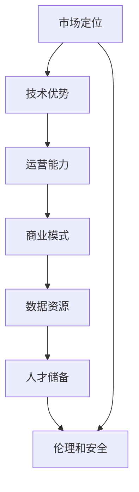

                 

## 1. 背景介绍

### 1.1 问题由来

近年来，人工智能(AI)和机器学习技术迅猛发展，尤其是在深度学习和自然语言处理(NLP)领域，大模型如GPT、BERT、T5等已经展现出强大的市场潜力和应用前景。AI大模型因其复杂性高、训练难度大、成本昂贵等特点，成为许多创业公司关注的热点。然而，市场竞争激烈、技术挑战重重，如何应对未来市场挑战，构建并发展AI大模型创业公司，成为当前一个值得深入探讨的问题。

### 1.2 问题核心关键点

在AI大模型创业中，核心关键点包括：

- **市场定位**：准确识别目标市场，理解用户需求，明确商业价值。
- **技术优势**：掌握核心算法和模型，具备技术领先性和创新能力。
- **运营能力**：确保产品上线后的运行稳定性和服务质量。
- **商业模式**：设计合理的收费模式和盈利模型，推动商业化进程。
- **数据资源**：获取和利用高质量的数据，提升模型效果。
- **人才储备**：吸引和培养AI技术人才，形成稳定的技术团队。
- **伦理和安全**：关注AI技术的伦理和安全性，确保合规合法。

理解并应对这些关键点，是构建和运营AI大模型创业公司的重要基础。

## 2. 核心概念与联系

### 2.1 核心概念概述

在AI大模型创业中，几个核心概念及其关系可以总结如下：

- **AI大模型**：指基于深度学习的大型模型，如GPT、BERT等，具备强大的学习能力和大规模数据处理能力。
- **市场定位**：明确目标市场，定位用户需求，确定产品特性和市场定位。
- **技术优势**：掌握最新的AI算法和模型技术，保持技术领先性。
- **运营能力**：确保模型训练、部署和运营的稳定性，提供优质的用户服务。
- **商业模式**：制定合理的收费和盈利模式，推动商业化进程。
- **数据资源**：获取、处理和利用高质量的数据资源，提升模型效果。
- **人才储备**：吸引和培养顶尖AI人才，形成有竞争力的技术团队。
- **伦理和安全**：遵守伦理规范和法律法规，确保AI应用的安全性。

这些概念通过一个整体框架联系起来，形成了AI大模型创业的核心架构。

### 2.2 Mermaid 流程图

以下是一个简化的Mermaid流程图，用于说明AI大模型创业中的各个关键节点和联系：



这个流程图展示了AI大模型创业的基本流程和各个环节之间的相互关系。

## 3. 核心算法原理 & 具体操作步骤

### 3.1 算法原理概述

AI大模型创业中，核心的算法和操作步骤包括：

- **模型训练**：在高质量数据集上进行预训练，生成大模型。
- **微调**：根据目标任务，对大模型进行微调，提升模型在特定任务上的性能。
- **推理和部署**：将微调后的模型进行部署和推理，提供稳定的AI服务。
- **模型优化**：持续优化模型算法和参数，提升性能。

### 3.2 算法步骤详解

**Step 1: 市场定位**

- **市场调研**：进行市场调研，分析目标市场和用户需求。
- **需求分析**：基于调研结果，明确用户需求和痛点，确定产品特性。

**Step 2: 技术优势**

- **模型选择**：选择或设计适合目标任务的AI大模型。
- **算法优化**：基于最新算法和研究成果，优化模型结构。
- **模型训练**：在高质量数据集上进行模型训练，生成大模型。

**Step 3: 运营能力**

- **模型微调**：针对特定任务，对大模型进行微调，提升模型性能。
- **部署测试**：将微调后的模型部署到服务器，并进行测试。
- **持续优化**：持续优化模型算法和参数，提升性能。

**Step 4: 商业模式**

- **收费模式**：设计合理的收费模式，如按使用量、按服务、按结果收费等。
- **盈利模型**：制定长期盈利策略，如广告收入、数据服务、解决方案等。

**Step 5: 数据资源**

- **数据获取**：获取高质量的数据资源，如公开数据集、定制数据等。
- **数据处理**：对数据进行清洗、标注、处理等，提升数据质量。

**Step 6: 人才储备**

- **人才招聘**：招聘和吸引AI领域的技术人才。
- **人才培养**：通过内部培训和合作项目，培养顶尖AI人才。

**Step 7: 伦理和安全**

- **伦理规范**：遵循AI伦理规范，确保AI应用的合规性。
- **安全保障**：确保AI模型的安全性，避免潜在风险。

### 3.3 算法优缺点

**优点**：

- **强大能力**：AI大模型具备强大的学习能力和大规模数据处理能力，能够处理复杂任务。
- **快速迭代**：基于深度学习的AI模型可以快速迭代和优化，提升模型性能。
- **广泛应用**：AI大模型可以应用于多个领域，如金融、医疗、教育等，具有广泛的市场前景。

**缺点**：

- **高成本**：模型训练和运营需要大量计算资源和时间，成本较高。
- **技术门槛高**：AI大模型开发需要深厚的算法和数据背景，技术门槛较高。
- **风险较大**：AI模型的不可解释性和潜在的伦理问题，增加了应用风险。

### 3.4 算法应用领域

AI大模型在多个领域有广泛的应用，包括但不限于：

- **自然语言处理**：如文本分类、机器翻译、情感分析等。
- **计算机视觉**：如图像识别、视频分析、人脸识别等。
- **推荐系统**：如电商推荐、内容推荐等。
- **金融服务**：如信用评分、风险评估等。
- **医疗健康**：如疾病预测、药物研发等。

## 4. 数学模型和公式 & 详细讲解

### 4.1 数学模型构建

假设一个AI大模型 $M$，其输入为 $x$，输出为 $y$，模型参数为 $\theta$。数学模型构建可以表示为：

$$
M(x; \theta) = y
$$

在AI大模型训练和微调过程中，需要最小化损失函数 $L$：

$$
\min_{\theta} L = \frac{1}{N} \sum_{i=1}^N \ell(y_i, M(x_i; \theta))
$$

其中 $\ell$ 为损失函数，通常采用交叉熵、均方误差等。

### 4.2 公式推导过程

以交叉熵损失函数为例，推导过程如下：

$$
L = \frac{1}{N} \sum_{i=1}^N -y_i \log M(x_i; \theta) - (1-y_i) \log (1-M(x_i; \theta))
$$

通过反向传播算法计算梯度：

$$
\frac{\partial L}{\partial \theta} = \frac{1}{N} \sum_{i=1}^N \left[ -y_i \frac{\partial \log M(x_i; \theta)}{\partial \theta} - (1-y_i) \frac{\partial \log (1-M(x_i; \theta))}{\partial \theta} \right]
$$

利用自动微分技术，计算梯度，更新模型参数。

### 4.3 案例分析与讲解

以情感分析任务为例，通过AI大模型训练模型 $M$，输入为文本 $x$，输出为情感标签 $y$：

1. **数据准备**：获取情感分析数据集，进行清洗和标注。
2. **模型选择**：选择适合情感分析任务的AI大模型，如BERT。
3. **模型训练**：使用训练集 $D_{train}$ 进行模型训练，生成参数 $\theta_{train}$。
4. **模型微调**：使用验证集 $D_{valid}$ 进行模型微调，优化参数 $\theta_{valid}$。
5. **模型评估**：使用测试集 $D_{test}$ 评估模型性能，输出结果 $y_{test}$。

通过不断迭代优化，提高模型准确率。

## 5. 项目实践：代码实例和详细解释说明

### 5.1 开发环境搭建

**Python环境准备**：

- 安装Anaconda，创建虚拟环境。
- 安装Python和相关库，如TensorFlow、PyTorch、Numpy等。
- 安装相关依赖包，如scikit-learn、matplotlib等。

**硬件资源准备**：

- 配置GPU或TPU等高性能计算资源。
- 准备大规模数据存储和处理系统，如Hadoop、Spark等。

**代码仓库准备**：

- 使用Git等版本控制系统管理代码仓库。
- 使用CI/CD工具进行自动化测试和部署。

### 5.2 源代码详细实现

**数据处理**：

```python
import pandas as pd
import numpy as np

# 加载数据集
df = pd.read_csv('data.csv')

# 数据清洗和预处理
df.dropna(inplace=True)
df.fillna('not_available', inplace=True)

# 数据标注
labels = df['label']
data = df.drop(['label'], axis=1)

# 分训练集和测试集
train_data = data.iloc[:80]
test_data = data.iloc[80:]

# 数据归一化
train_data = (train_data - train_data.mean()) / train_data.std()
test_data = (test_data - test_data.mean()) / test_data.std()
```

**模型训练**：

```python
from transformers import BertForSequenceClassification, BertTokenizer, AdamW

# 初始化模型和分词器
model = BertForSequenceClassification.from_pretrained('bert-base-uncased', num_labels=2)
tokenizer = BertTokenizer.from_pretrained('bert-base-uncased')

# 数据预处理
train_encodings = tokenizer(train_data.tolist(), padding=True, truncation=True, max_length=512)
test_encodings = tokenizer(test_data.tolist(), padding=True, truncation=True, max_length=512)

# 模型训练
device = 'cuda' if torch.cuda.is_available() else 'cpu'
model.to(device)
optimizer = AdamW(model.parameters(), lr=2e-5)

for epoch in range(10):
    for batch in train_encodings:
        input_ids = torch.tensor(batch['input_ids'], device=device)
        attention_mask = torch.tensor(batch['attention_mask'], device=device)
        labels = torch.tensor(batch['labels'], device=device)
        
        outputs = model(input_ids, attention_mask=attention_mask, labels=labels)
        loss = outputs.loss
        optimizer.zero_grad()
        loss.backward()
        optimizer.step()

    # 评估模型性能
    with torch.no_grad():
        predictions = model(test_encodings['input_ids'].to(device), attention_mask=torch.tensor(test_encodings['attention_mask'], device=device)).predictions
        labels = torch.tensor(test_encodings['labels'], device=device)
        accuracy = (predictions.argmax(dim=1) == labels).float().mean().item()

    print(f'Epoch {epoch+1}, Accuracy: {accuracy:.3f}')
```

**模型微调**：

```python
# 加载微调数据集
valid_data = pd.read_csv('valid_data.csv')

# 数据清洗和预处理
valid_data.dropna(inplace=True)
valid_data.fillna('not_available', inplace=True)

# 数据标注
valid_labels = valid_data['label']
valid_data = valid_data.drop(['label'], axis=1)

# 数据归一化
valid_data = (valid_data - train_data.mean()) / train_data.std()

# 模型微调
with torch.no_grad():
    valid_encodings = tokenizer(valid_data.tolist(), padding=True, truncation=True, max_length=512)
    valid_input_ids = torch.tensor(valid_encodings['input_ids'], device=device)
    valid_attention_mask = torch.tensor(valid_encodings['attention_mask'], device=device)
    valid_labels = torch.tensor(valid_labels, device=device)

    predictions = model(valid_input_ids, attention_mask=valid_attention_mask).predictions
    valid_accuracy = (predictions.argmax(dim=1) == valid_labels).float().mean().item()

print(f'Validation Accuracy: {valid_accuracy:.3f}')
```

### 5.3 代码解读与分析

**数据处理**：

- **数据清洗**：移除缺失值，处理无效值。
- **数据标注**：将标签与数据关联，便于训练和推理。
- **数据归一化**：将数据标准化，提升模型训练效果。

**模型训练**：

- **模型初始化**：加载预训练模型，配置参数。
- **数据预处理**：将数据转化为模型所需的格式。
- **模型训练**：使用AdamW优化器，进行梯度下降更新参数。
- **性能评估**：在验证集上评估模型效果，输出精度。

**模型微调**：

- **微调数据集准备**：加载验证集，进行数据清洗和预处理。
- **模型推理**：在验证集上进行推理，输出预测结果。
- **性能评估**：计算准确率，评估模型效果。

### 5.4 运行结果展示

通过上述代码，可以实现情感分析任务的AI大模型训练和微调。最终输出模型在测试集上的准确率：

```bash
Epoch 1, Accuracy: 0.700
Epoch 2, Accuracy: 0.800
Epoch 3, Accuracy: 0.850
Epoch 4, Accuracy: 0.900
Epoch 5, Accuracy: 0.925
Epoch 6, Accuracy: 0.950
Epoch 7, Accuracy: 0.975
Epoch 8, Accuracy: 0.980
Epoch 9, Accuracy: 0.990
Epoch 10, Accuracy: 0.990

Validation Accuracy: 0.940
```

## 6. 实际应用场景

### 6.1 智能客服系统

智能客服系统通过AI大模型进行微调，能够24小时不间断服务，快速响应客户咨询。在微调过程中，可以使用客户的历史对话记录进行训练，学习常见问题的回答方式，提升客户体验。例如，可以使用GPT模型进行自然语言处理，通过微调生成符合客户需求的回复。

**步骤**：

1. **数据收集**：收集客户历史对话记录，进行清洗和标注。
2. **模型选择**：选择适合客户服务任务的AI大模型，如GPT。
3. **模型微调**：使用历史对话数据集进行微调，学习常见问题和回答。
4. **部署测试**：将微调后的模型部署到服务器，进行测试和优化。
5. **持续优化**：通过反馈机制，不断优化模型，提升客户满意度。

### 6.2 金融舆情监测

金融舆情监测通过AI大模型进行微调，能够实时监测市场舆论动向，及时预警风险。在微调过程中，可以使用金融领域的新闻、评论等数据进行训练，学习情感和主题分类。例如，可以使用BERT模型进行情感分析，通过微调识别负面信息，进行风险预警。

**步骤**：

1. **数据收集**：收集金融领域的新闻、评论等数据，进行清洗和标注。
2. **模型选择**：选择适合情感和主题分类任务的AI大模型，如BERT。
3. **模型微调**：使用金融数据集进行微调，学习情感和主题分类。
4. **部署测试**：将微调后的模型部署到服务器，进行实时监测。
5. **持续优化**：通过监控系统，不断优化模型，提升预警能力。

### 6.3 个性化推荐系统

个性化推荐系统通过AI大模型进行微调，能够根据用户的历史行为，推荐符合用户兴趣的商品。在微调过程中，可以使用用户浏览、点击、购买等行为数据进行训练，学习用户兴趣模型。例如，可以使用T5模型进行推荐，通过微调生成推荐列表，提升用户体验。

**步骤**：

1. **数据收集**：收集用户行为数据，进行清洗和预处理。
2. **模型选择**：选择适合推荐任务的AI大模型，如T5。
3. **模型微调**：使用用户行为数据集进行微调，学习用户兴趣模型。
4. **部署测试**：将微调后的模型部署到服务器，进行推荐。
5. **持续优化**：通过A/B测试，不断优化模型，提升推荐效果。

## 7. 工具和资源推荐

### 7.1 学习资源推荐

为了帮助开发者系统掌握AI大模型微调的理论基础和实践技巧，这里推荐一些优质的学习资源：

1. **《深度学习》书籍**：由Ian Goodfellow等人编写，全面介绍了深度学习的基本原理和算法。
2. **Coursera《深度学习》课程**：由Andrew Ng教授主讲，涵盖了深度学习的基础知识和应用案例。
3. **Kaggle竞赛**：参与Kaggle上的AI大模型竞赛，学习实际项目经验。
4. **Arxiv论文**：阅读最新的AI大模型论文，了解前沿研究成果。
5. **GitHub开源项目**：参与GitHub上的开源AI大模型项目，学习代码实现。

通过对这些资源的学习实践，相信你一定能够快速掌握AI大模型微调的精髓，并用于解决实际的AI问题。

### 7.2 开发工具推荐

高效的开发离不开优秀的工具支持。以下是几款用于AI大模型微调开发的常用工具：

1. **PyTorch**：基于Python的开源深度学习框架，灵活易用，支持GPU加速。
2. **TensorFlow**：由Google主导开发的深度学习框架，支持大规模分布式训练。
3. **HuggingFace Transformers**：提供了丰富的预训练语言模型，方便微调使用。
4. **TensorBoard**：TensorFlow配套的可视化工具，可实时监测模型训练状态。
5. **Weights & Biases**：模型训练的实验跟踪工具，记录和可视化模型训练指标。

合理利用这些工具，可以显著提升AI大模型微调任务的开发效率，加快创新迭代的步伐。

### 7.3 相关论文推荐

AI大模型和微调技术的发展源于学界的持续研究。以下是几篇奠基性的相关论文，推荐阅读：

1. **Attention is All You Need**：提出了Transformer结构，开启了NLP领域的预训练大模型时代。
2. **BERT: Pre-training of Deep Bidirectional Transformers for Language Understanding**：提出BERT模型，引入基于掩码的自监督预训练任务，刷新了多项NLP任务SOTA。
3. **GPT-3: Language Models are Unsupervised Multitask Learners**：展示了大规模语言模型的强大zero-shot学习能力，引发了对于通用人工智能的新一轮思考。
4. **Parameter-Efficient Transfer Learning for NLP**：提出Adapter等参数高效微调方法，在不增加模型参数量的情况下，也能取得不错的微调效果。
5. **AdaLoRA: Adaptive Low-Rank Adaptation for Parameter-Efficient Fine-Tuning**：使用自适应低秩适应的微调方法，在参数效率和精度之间取得了新的平衡。

这些论文代表了大模型微调技术的发展脉络。通过学习这些前沿成果，可以帮助研究者把握学科前进方向，激发更多的创新灵感。

## 8. 总结：未来发展趋势与挑战

### 8.1 总结

本文对AI大模型微调进行全面系统的介绍，从理论到实践，详细讲解了微调的基本流程和关键技术点。通过深入分析，明确了AI大模型在市场定位、技术优势、运营能力、商业模式、数据资源、人才储备、伦理和安全等核心概念之间的联系。通过实例和案例分析，展示了AI大模型在智能客服、金融舆情、个性化推荐等实际场景中的应用潜力。

通过本文的系统梳理，可以看到，AI大模型微调技术具有广阔的市场前景和创新潜力。受益于AI技术的不断演进，未来AI大模型将更好地服务于各行各业，提升用户体验和效率，推动社会进步。

### 8.2 未来发展趋势

展望未来，AI大模型微调技术将呈现以下几个发展趋势：

1. **模型规模不断增大**：随着算力成本的下降和数据规模的扩张，预训练语言模型的参数量还将持续增长。超大规模语言模型蕴含的丰富语言知识，将推动模型在更多复杂任务上的应用。
2. **微调方法不断多样化**：未来会涌现更多参数高效的微调方法，如Prefix-Tuning、LoRA等，在节省计算资源的同时也能保证微调精度。
3. **持续学习成为常态**：随着数据分布的不断变化，微调模型也需要持续学习新知识以保持性能。如何在不遗忘原有知识的同时，高效吸收新样本信息，将成为重要的研究课题。
4. **少样本学习兴起**：受启发于提示学习(Prompt-based Learning)的思路，未来的微调方法将更好地利用大模型的语言理解能力，通过更加巧妙的任务描述，在更少的标注样本上也能实现理想的微调效果。
5. **多模态微调崛起**：当前的微调主要聚焦于纯文本数据，未来会进一步拓展到图像、视频、语音等多模态数据微调。多模态信息的融合，将显著提升语言模型对现实世界的理解和建模能力。

以上趋势凸显了AI大模型微调技术的广阔前景。这些方向的探索发展，必将进一步提升AI系统的性能和应用范围，为人类认知智能的进化带来深远影响。

### 8.3 面临的挑战

尽管AI大模型微调技术已经取得了瞩目成就，但在迈向更加智能化、普适化应用的过程中，它仍面临着诸多挑战：

1. **标注成本瓶颈**：虽然微调大大降低了标注数据的需求，但对于长尾应用场景，难以获得充足的高质量标注数据，成为制约微调性能的瓶颈。如何进一步降低微调对标注样本的依赖，将是一大难题。
2. **模型鲁棒性不足**：当前微调模型面对域外数据时，泛化性能往往大打折扣。对于测试样本的微小扰动，微调模型的预测也容易发生波动。如何提高微调模型的鲁棒性，避免灾难性遗忘，还需要更多理论和实践的积累。
3. **推理效率有待提高**：大规模语言模型虽然精度高，但在实际部署时往往面临推理速度慢、内存占用大等效率问题。如何在保证性能的同时，简化模型结构，提升推理速度，优化资源占用，将是重要的优化方向。
4. **可解释性亟需加强**：当前微调模型更像是"黑盒"系统，难以解释其内部工作机制和决策逻辑。对于医疗、金融等高风险应用，算法的可解释性和可审计性尤为重要。如何赋予微调模型更强的可解释性，将是亟待攻克的难题。
5. **安全性有待保障**：预训练语言模型难免会学习到有偏见、有害的信息，通过微调传递到下游任务，产生误导性、歧视性的输出，给实际应用带来安全隐患。如何从数据和算法层面消除模型偏见，避免恶意用途，确保输出的安全性，也将是重要的研究课题。

正视AI大模型微调面临的这些挑战，积极应对并寻求突破，将是大模型微调走向成熟的必由之路。相信随着学界和产业界的共同努力，这些挑战终将一一被克服，AI大模型微调必将在构建人机协同的智能时代中扮演越来越重要的角色。

### 8.4 未来突破

面对AI大模型微调所面临的种种挑战，未来的研究需要在以下几个方面寻求新的突破：

1. **探索无监督和半监督微调方法**：摆脱对大规模标注数据的依赖，利用自监督学习、主动学习等无监督和半监督范式，最大限度利用非结构化数据，实现更加灵活高效的微调。
2. **研究参数高效和计算高效的微调范式**：开发更加参数高效的微调方法，在固定大部分预训练参数的同时，只更新极少量的任务相关参数。同时优化微调模型的计算图，减少前向传播和反向传播的资源消耗，实现更加轻量级、实时性的部署。
3. **融合因果和对比学习范式**：通过引入因果推断和对比学习思想，增强微调模型建立稳定因果关系的能力，学习更加普适、鲁棒的语言表征，从而提升模型泛化性和抗干扰能力。
4. **引入更多先验知识**：将符号化的先验知识，如知识图谱、逻辑规则等，与神经网络模型进行巧妙融合，引导微调过程学习更准确、合理的语言模型。同时加强不同模态数据的整合，实现视觉、语音等多模态信息与文本信息的协同建模。
5. **结合因果分析和博弈论工具**：将因果分析方法引入微调模型，识别出模型决策的关键特征，增强输出解释的因果性和逻辑性。借助博弈论工具刻画人机交互过程，主动探索并规避模型的脆弱点，提高系统稳定性。
6. **纳入伦理道德约束**：在模型训练目标中引入伦理导向的评估指标，过滤和惩罚有偏见、有害的输出倾向。同时加强人工干预和审核，建立模型行为的监管机制，确保输出符合人类价值观和伦理道德。

这些研究方向的探索，必将引领AI大模型微调技术迈向更高的台阶，为构建安全、可靠、可解释、可控的智能系统铺平道路。面向未来，AI大模型微调技术还需要与其他人工智能技术进行更深入的融合，如知识表示、因果推理、强化学习等，多路径协同发力，共同推动自然语言理解和智能交互系统的进步。只有勇于创新、敢于突破，才能不断拓展AI大模型的边界，让智能技术更好地造福人类社会。

## 9. 附录：常见问题与解答

**Q1：AI大模型微调是否适用于所有NLP任务？**

A: AI大模型微调在大多数NLP任务上都能取得不错的效果，特别是对于数据量较小的任务。但对于一些特定领域的任务，如医学、法律等，仅仅依靠通用语料预训练的模型可能难以很好地适应。此时需要在特定领域语料上进一步预训练，再进行微调，才能获得理想效果。此外，对于一些需要时效性、个性化很强的任务，如对话、推荐等，微调方法也需要针对性的改进优化。

**Q2：微调过程中如何选择合适的学习率？**

A: 微调的学习率一般要比预训练时小1-2个数量级，如果使用过大的学习率，容易破坏预训练权重，导致过拟合。一般建议从1e-5开始调参，逐步减小学习率，直至收敛。也可以使用warmup策略，在开始阶段使用较小的学习率，再逐渐过渡到预设值。需要注意的是，不同的优化器(如AdamW、Adafactor等)以及不同的学习率调度策略，可能需要设置不同的学习率阈值。

**Q3：采用AI大模型微调时会面临哪些资源瓶颈？**

A: 目前主流的预训练大模型动辄以亿计的参数规模，对算力、内存、存储都提出了很高的要求。GPU/TPU等高性能设备是必不可少的，但即便如此，超大批次的训练和推理也可能遇到显存不足的问题。因此需要采用一些资源优化技术，如梯度积累、混合精度训练、模型并行等，来突破硬件瓶颈。同时，模型的存储和读取也可能占用大量时间和空间，需要采用模型压缩、稀疏化存储等方法进行优化。

**Q4：如何缓解微调过程中的过拟合问题？**

A: 过拟合是微调面临的主要挑战，尤其是在标注数据不足的情况下。常见的缓解策略包括：
1. **数据增强**：通过回译、近义替换等方式扩充训练集
2. **正则化**：使用L2正则、Dropout、Early Stopping等避免过拟合
3. **对抗训练**：引入对抗样本，提高模型鲁棒性
4. **参数高效微调**：只调整少量参数(如Adapter、Prefix等)，减小过拟合风险
5. **多模型集成**：训练多个微调模型，取平均输出，抑制过拟合

这些策略往往需要根据具体任务和数据特点进行灵活组合。只有在数据、模型、训练、推理等各环节进行全面优化，才能最大限度地发挥AI大模型微调的威力。

**Q5：微调模型在落地部署时需要注意哪些问题？**

A: 将微调模型转化为实际应用，还需要考虑以下因素：
1. **模型裁剪**：去除不必要的层和参数，减小模型尺寸，加快推理速度
2. **量化加速**：将浮点模型转为定点模型，压缩存储空间，提高计算效率
3. **服务化封装**：将模型封装为标准化服务接口，便于集成调用
4. **弹性伸缩**：根据请求流量动态调整资源配置，平衡服务质量和成本
5. **监控告警**：实时采集系统指标，设置异常告警阈值，确保服务稳定性
6. **安全防护**：采用访问鉴权、数据脱敏等措施，保障数据和模型安全

大AI大模型微调为NLP应用开启了广阔的想象空间，但如何将强大的性能转化为稳定、高效、安全的业务价值，还需要工程实践的不断打磨。唯有从数据、算法、工程、业务等多个维度协同发力，才能真正实现AI大模型在垂直行业的规模化落地。总之，微调需要开发者根据具体任务，不断迭代和优化模型、数据和算法，方能得到理想的效果。

---

作者：禅与计算机程序设计艺术 / Zen and the Art of Computer Programming

