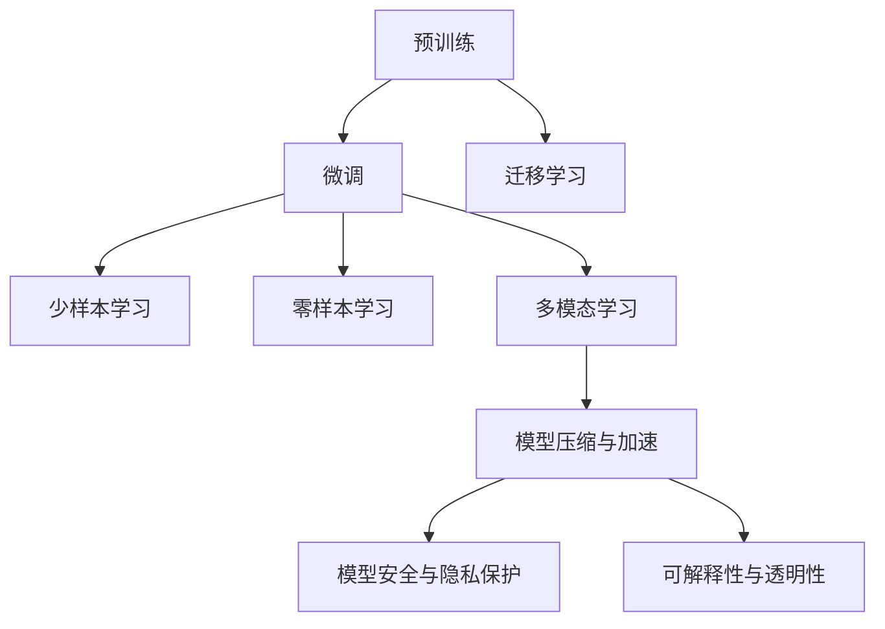

                 

## 1. 背景介绍

在人工智能（AI）领域，大模型（Large Models）正成为炙手可热的话题。自2023年GPT-4发布以来，大模型的应用从学术研究迅速渗透到各行各业，引发了新一轮的产业变革。创业公司、大型企业乃至政府机构都争相构建和部署大模型，力图借助这一先进技术实现业务升级和创新突破。然而，随着大模型应用场景的拓展，也面临诸多挑战，如模型训练成本、数据隐私保护、安全与可控等问题。本文将系统性地探讨AI大模型创业的应对策略，帮助开发者和企业决策者有效应对这些挑战，共同推动AI大模型的健康、可持续发展。

## 2. 核心概念与联系

### 2.1 核心概念概述

1. **大模型（Large Models）**：指拥有数十亿乃至上百亿参数的大型神经网络，具备处理大规模数据、复杂任务的能力。大模型包括Transformer模型、BERT、GPT、GPT-4等，通过在海量数据上进行自监督预训练和微调，能够实现通用和任务特定的语言理解、生成等功能。

2. **预训练（Pre-training）**：指在大规模无标签数据上进行训练，让模型学习语言的通用表示。预训练通常使用自监督任务，如语言建模、掩码语言建模等，目的是让模型拥有强大的语言理解能力。

3. **微调（Fine-tuning）**：指在大模型基础上，针对特定任务进行小规模有标签数据训练，调整模型以适应新的任务需求。微调常用于下游任务如文本分类、命名实体识别、情感分析等。

4. **迁移学习（Transfer Learning）**：指将模型在一种任务上的学习，迁移到另一种相关任务上，以加快新任务的学习过程。

5. **少样本学习（Few-shot Learning）**：指模型仅在少量标注数据上进行微调，就能取得不错的性能。

6. **零样本学习（Zero-shot Learning）**：指模型仅通过文本描述就能执行新任务，无需任何标注数据。

7. **多模态学习（Multimodal Learning）**：指模型能同时处理文本、图像、音频等多种模态数据，提高对现实世界的理解能力。

8. **模型压缩与加速（Model Compression & Acceleration）**：指在保证性能的前提下，通过剪枝、量化、模型蒸馏等方法，减小模型规模，提高推理速度。

9. **模型安全与隐私保护（Model Security & Privacy Protection）**：指在模型训练、存储和应用过程中，保护用户隐私，防止模型滥用或攻击。

10. **可解释性与透明性（Explainability & Transparency）**：指提高模型的决策过程的可解释性和透明度，增强用户信任。

这些核心概念之间存在密切联系，共同构成了AI大模型的生态体系。预训练、微调和迁移学习构成了模型训练的完整流程，模型压缩与加速保证了模型的高效应用，模型安全与隐私保护和可解释性与透明性则保障了模型在实际部署中的稳定性和可靠性。

### 2.2 核心概念原理和架构的 Mermaid 流程图



## 3. 核心算法原理 & 具体操作步骤

### 3.1 算法原理概述

大模型的核心算法原理主要基于深度学习框架，通过神经网络进行语言模型的训练和推理。预训练过程通常使用自监督学习任务，如语言建模、掩码语言建模等，在大规模无标签数据上进行，以学习语言的通用表示。微调则是在预训练基础上，使用小规模有标签数据对模型进行优化，使其适应特定任务。

### 3.2 算法步骤详解

大模型的核心算法步骤包括：

1. **预训练**：在大规模无标签数据上使用自监督任务进行训练，学习语言的通用表示。
2. **微调**：在特定任务的数据集上进行小规模有标签数据训练，调整模型以适应新任务。
3. **迁移学习**：将模型在一种任务上的学习迁移到另一种相关任务上，以加快新任务的学习过程。
4. **少样本学习**：仅在少量标注数据上进行微调，获取良好的性能。
5. **零样本学习**：仅通过文本描述就能执行新任务，无需任何标注数据。
6. **多模态学习**：同时处理文本、图像、音频等多种模态数据，提高对现实世界的理解能力。
7. **模型压缩与加速**：在保证性能的前提下，通过剪枝、量化、模型蒸馏等方法，减小模型规模，提高推理速度。
8. **模型安全与隐私保护**：在模型训练、存储和应用过程中，保护用户隐私，防止模型滥用或攻击。
9. **可解释性与透明性**：提高模型的决策过程的可解释性和透明度，增强用户信任。

### 3.3 算法优缺点

大模型具有以下优点：

1. **性能优异**：在预训练过程中，大模型能够学习到丰富的语言知识，显著提升微调后的性能。
2. **泛化能力强**：大模型具备强大的泛化能力，能在多种场景下进行微调，适应不同的任务需求。
3. **可扩展性好**：大模型能够扩展到多种模态数据，提升多模态任务的表现。
4. **应用广泛**：大模型广泛应用于自然语言处理（NLP）、计算机视觉（CV）、语音识别等领域，具有广泛的适用性。

然而，大模型也存在以下缺点：

1. **训练成本高**：大规模模型的训练需要大量的计算资源和时间，成本较高。
2. **数据隐私问题**：预训练和微调过程中需要大量数据，数据隐私问题亟需解决。
3. **安全性与可控性不足**：大模型可能被滥用，存在安全风险。
4. **可解释性差**：大模型的决策过程复杂，缺乏可解释性。
5. **资源消耗大**：大模型在推理过程中消耗大量的内存和计算资源。

### 3.4 算法应用领域

大模型的应用领域广泛，包括但不限于：

1. **自然语言处理（NLP）**：如文本分类、命名实体识别、情感分析、机器翻译等。
2. **计算机视觉（CV）**：如图像识别、目标检测、图像生成等。
3. **语音识别**：如语音转文字、语音合成等。
4. **推荐系统**：如电商推荐、视频推荐等。
5. **金融分析**：如情感分析、舆情监测等。
6. **医疗诊断**：如影像诊断、病理分析等。
7. **自动驾驶**：如场景理解、路径规划等。
8. **游戏AI**：如角色控制、任务生成等。

## 4. 数学模型和公式 & 详细讲解 & 举例说明

### 4.1 数学模型构建

以BERT模型为例，其数学模型构建包括：

1. **输入编码**：将输入序列转换为模型可以处理的格式。
2. **掩码语言建模**：通过掩码部分输入，让模型学习上下文关系。
3. **自回归语言建模**：通过预测下一个单词，让模型学习单词序列。
4. **线性分类器**：在预训练模型之上添加一个线性分类器，进行微调。

### 4.2 公式推导过程

BERT模型的掩码语言建模损失函数为：

$$
\mathcal{L}_{MLM} = -\frac{1}{N}\sum_{i=1}^{N}\sum_{j=1}^{V}[y_i,j]\log(\hat{y}_{i,j})
$$

其中，$y_i,j$ 是输入序列中第 $i$ 个单词的第 $j$ 个掩码位置，$\hat{y}_{i,j}$ 是模型对第 $i$ 个单词第 $j$ 个掩码位置的预测概率。

### 4.3 案例分析与讲解

以BERT模型为例，微调过程包括：

1. **数据准备**：准备下游任务的数据集，划分为训练集、验证集和测试集。
2. **模型加载**：使用HuggingFace等库加载预训练的BERT模型。
3. **模型适配**：添加任务相关的输出层和损失函数。
4. **模型训练**：在训练集上使用Adam等优化器进行训练，验证集上评估模型性能。
5. **模型测试**：在测试集上评估模型性能，输出测试结果。

## 5. 项目实践：代码实例和详细解释说明

### 5.1 开发环境搭建

开发环境搭建包括：

1. **Python环境**：使用Anaconda创建虚拟环境。
2. **深度学习框架**：如PyTorch、TensorFlow等。
3. **模型库**：如HuggingFace、TensorFlow Hub等。
4. **数据处理工具**：如Pandas、NumPy等。
5. **可视化工具**：如Matplotlib、Seaborn等。

### 5.2 源代码详细实现

以下是一个基于PyTorch的BERT微调代码实现：

```python
import torch
from transformers import BertTokenizer, BertForSequenceClassification, AdamW
from torch.utils.data import Dataset, DataLoader

class CustomDataset(Dataset):
    def __init__(self, texts, labels):
        self.texts = texts
        self.labels = labels
        self.tokenizer = BertTokenizer.from_pretrained('bert-base-uncased')
    
    def __len__(self):
        return len(self.texts)
    
    def __getitem__(self, idx):
        text = self.texts[idx]
        label = self.labels[idx]
        
        encoding = self.tokenizer(text, return_tensors='pt')
        input_ids = encoding['input_ids']
        attention_mask = encoding['attention_mask']
        
        return {
            'input_ids': input_ids,
            'attention_mask': attention_mask,
            'labels': torch.tensor(label, dtype=torch.long)
        }

# 加载预训练模型
model = BertForSequenceClassification.from_pretrained('bert-base-uncased', num_labels=2)
model.train()

# 加载数据集
train_dataset = CustomDataset(train_texts, train_labels)
test_dataset = CustomDataset(test_texts, test_labels)
data_loader = DataLoader(train_dataset, batch_size=16, shuffle=True)

# 定义优化器和损失函数
optimizer = AdamW(model.parameters(), lr=2e-5)
loss_fn = torch.nn.CrossEntropyLoss()

# 训练模型
for epoch in range(10):
    for batch in data_loader:
        input_ids = batch['input_ids'].to(device)
        attention_mask = batch['attention_mask'].to(device)
        labels = batch['labels'].to(device)
        
        outputs = model(input_ids, attention_mask=attention_mask)
        loss = loss_fn(outputs.logits, labels)
        
        optimizer.zero_grad()
        loss.backward()
        optimizer.step()

# 评估模型
test_dataset.eval()
with torch.no_grad():
    preds, labels = [], []
    for batch in data_loader(test_dataset):
        input_ids = batch['input_ids'].to(device)
        attention_mask = batch['attention_mask'].to(device)
        labels = batch['labels'].to(device)
        
        outputs = model(input_ids, attention_mask=attention_mask)
        preds.append(outputs.logits.argmax(dim=1).to('cpu').tolist())
        labels.append(labels.to('cpu').tolist())
        
    print(classification_report(labels, preds))
```

### 5.3 代码解读与分析

1. **数据集准备**：定义自定义数据集，准备训练集和测试集。
2. **模型加载**：加载预训练的BERT模型。
3. **数据处理**：使用BertTokenizer将文本转换为模型可以处理的格式。
4. **训练过程**：在训练集上进行微调，使用AdamW优化器，并定义交叉熵损失函数。
5. **模型评估**：在测试集上评估模型性能，输出分类报告。

## 6. 实际应用场景

### 6.1 智能客服

智能客服系统利用大模型进行微调，可以实现7x24小时不间断服务，快速响应客户咨询，用自然流畅的语言解答各类常见问题。例如，在电商客服中，系统可以自动回答客户的常见问题，如退货、换货等，提升客户体验。

### 6.2 金融舆情监测

金融机构需要实时监测市场舆论动向，以快速应对负面信息传播。利用大模型进行情感分析和舆情监测，可以及时发现舆情变化，预测市场走势，规避金融风险。例如，通过微调BERT模型，识别金融新闻中的情感倾向，预测股市走势，辅助投资者决策。

### 6.3 个性化推荐系统

个性化推荐系统利用大模型进行微调，可以根据用户的历史行为数据，推荐用户可能感兴趣的商品或内容。例如，电商平台通过微调BERT模型，分析用户浏览、购买记录，推荐相关商品，提高用户满意度。

### 6.4 医疗影像诊断

大模型在医疗影像诊断领域具有广泛应用。通过微调BERT模型，能够从影像中识别出病变区域，辅助医生诊断。例如，利用微调BERT模型，自动分析肺部CT影像，检测肺癌等疾病，提高诊断准确率。

## 7. 工具和资源推荐

### 7.1 学习资源推荐

1. **自然语言处理（NLP）**：《深度学习与自然语言处理》（李航）、《NLP实战》（Elman，J.）。
2. **计算机视觉（CV）**：《计算机视觉：算法与应用》（Russell J.C.B.A., Hartley R.I., 2008）、《深度学习与计算机视觉》（Ian Goodfellow, Yoshua Bengio, Aaron Courville）。
3. **语音识别**：《Speech and Language Processing》（Daniel Jurafsky, James H. Martin）。
4. **推荐系统**：《推荐系统实战》（Adrin Jalali）。
5. **金融分析**：《金融大数据与人工智能》（李正威）。
6. **自动驾驶**：《自动驾驶系统与无人驾驶》（马世超）。
7. **游戏AI**：《Game AI Pro》系列书籍。

### 7.2 开发工具推荐

1. **PyTorch**：深度学习框架，支持动态图和静态图，适用于研究原型开发。
2. **TensorFlow**：深度学习框架，支持分布式训练和生产环境部署。
3. **HuggingFace Transformers**：模型库，提供多种预训练模型的微调接口。
4. **Weights & Biases**：模型实验跟踪工具，记录模型训练过程。
5. **TensorBoard**：可视化工具，监控模型训练状态。
6. **Google Colab**：在线Jupyter Notebook环境，免费提供GPU/TPU算力。
7. **AWS SageMaker**：云平台，提供模型训练、部署和监控服务。

### 7.3 相关论文推荐

1. **Transformer**：《Attention Is All You Need》（Vaswani，A.，Shazeer，N.，Parmar，N.，Uszkoreit，J.，Shaw，L.，Polosukhin，I.，2017）。
2. **BERT**：《BERT: Pre-training of Deep Bidirectional Transformers for Language Understanding》（Devlin，J.，Chang，M.W.，Lee，K.，Toutanova，K.，2019）。
3. **GPT**：《Language Models are Unsupervised Multitask Learners》（Rogers，M.，Couprie，M.，Alain，G.，2019）。
4. **少样本学习**：《Few-shot Learning》（Brendan J. Frey）。
5. **零样本学习**：《Zero-shot Learning for Classification》（Dapeng Tang）。
6. **多模态学习**：《Multimodal Transfer Learning for Language Representation》（Chen，H.，Chen，Y.，Choi，Y.，Niu，J.，Qin，B.，Wang，J.，2021）。
7. **模型压缩与加速**：《Model Compression: A Review》（Blumensath，T.，2020）。
8. **模型安全与隐私保护**：《Adversarial Examples in Deep Learning》（Goodfellow，I.，Shlens，J.，Goodfellow，C.，2014）。
9. **可解释性与透明性**：《Explaining and Harnessing Adversarial Examples》（Madry，A.，McDaniel，A.，Ardakov，A.，Fernando，A.，Chen，D.，2017）。

## 8. 总结：未来发展趋势与挑战

### 8.1 研究成果总结

大模型创业面临诸多挑战，但也具备显著优势。以下是主要研究成果：

1. **预训练与微调**：通过大规模预训练，学习通用语言表示，然后通过微调适配特定任务，显著提升性能。
2. **少样本与零样本学习**：利用提示学习和模型适配，实现高效低成本的模型训练。
3. **多模态与跨领域学习**：通过多模态数据融合，提升模型对现实世界的理解能力。
4. **模型压缩与加速**：通过剪枝、量化、蒸馏等技术，优化模型性能和资源消耗。
5. **模型安全与隐私保护**：通过隐私保护技术和可解释性方法，保障模型应用的安全性和可靠性。

### 8.2 未来发展趋势

1. **模型规模继续增大**：随着算力成本下降和数据规模增长，预训练大模型参数量将进一步扩大。
2. **微调方法更加多样**：如Adapter、LoRA等，提高模型参数效率。
3. **持续学习成为常态**：模型需要不断学习新数据，保持性能和鲁棒性。
4. **标注数据需求降低**：利用提示学习，通过少量样本实现高效微调。
5. **多模态融合**：处理文本、图像、音频等多种数据，提升应用范围和能力。

### 8.3 面临的挑战

1. **标注成本高**：获取高质量标注数据成本高昂，制约模型发展。
2. **模型鲁棒性不足**：面对新数据或攻击，模型泛化能力有限。
3. **计算资源消耗大**：模型推理和训练资源消耗大，难以大规模部署。
4. **模型可解释性差**：大模型决策过程复杂，缺乏可解释性。
5. **安全性与隐私问题**：模型可能被滥用，数据隐私保护亟需解决。

### 8.4 研究展望

未来，大模型研究将聚焦于以下几个方向：

1. **可解释性与透明性**：提高模型的决策过程可解释性，增强用户信任。
2. **隐私保护与安全性**：保障模型数据隐私，防止滥用和攻击。
3. **持续学习与知识融合**：模型需要不断学习新知识，与外部知识库结合，提升性能。
4. **多模态融合**：处理多种模态数据，提升对现实世界的理解能力。
5. **知识导向学习**：利用符号化知识，指导模型学习，提升模型表现。

大模型创业是一项复杂而富有挑战性的任务，需要多方协同努力。通过技术创新和应用实践，相信大模型将在更多行业领域落地应用，推动AI技术的发展和普及。

---

作者：禅与计算机程序设计艺术 / Zen and the Art of Computer Programming

