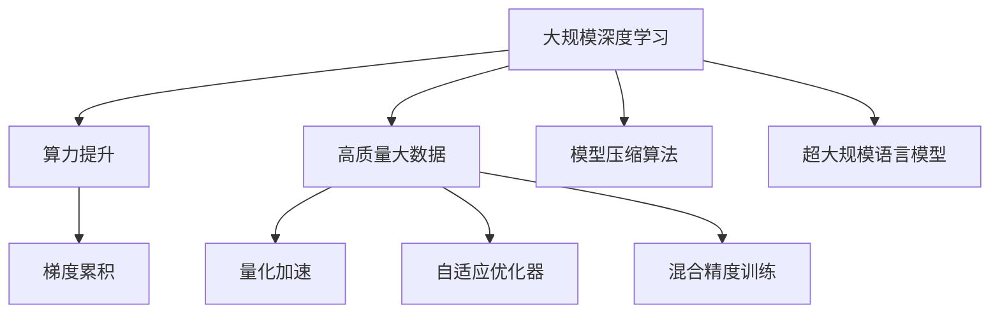

                 

# AI大模型的规模化定律(Scaling Law)的实现：算力提升+高质量大数据+更好的压缩算法

> 关键词：
    - 大规模深度学习
    - 算力提升
    - 高质量大数据
    - 模型压缩算法
    - 超大规模语言模型
    - 梯度累积
    - 量化加速
    - 自适应优化器
    - 混合精度训练

## 1. 背景介绍

### 1.1 问题由来

过去几十年间，深度学习技术在多个领域实现了突破性的进展，其中深度神经网络作为关键技术，已经被广泛应用于图像识别、语音识别、自然语言处理等众多场景。深度学习通过深度网络结构学习多层次的抽象特征，从而大幅提升了模型的性能。然而，随着模型规模的增大，其对计算资源的需求也急剧增加，算力成本成为制约深度学习发展的主要瓶颈。

### 1.2 问题核心关键点

深度学习模型的性能与模型规模有很强的正相关性，即“规模化定律”。模型参数数量越多，其对数据、算力和内存等资源的需求也越高，性能提升效果也更加显著。然而，受限于当前硬件条件的限制，大模型的训练和推理任务仍然面临较高的计算和内存成本。

解决这个问题的方法之一就是提升算力，但现实中这需要大量的投资和长期的积累。另一个重要的方法是引入更高效的数据和压缩算法，以更好地利用硬件资源，降低成本。

## 2. 核心概念与联系

### 2.1 核心概念概述

为更好地理解规模化定律的实现方法，本节将介绍几个密切相关的核心概念：

- 大规模深度学习：指的是模型参数数量超过亿级的深度学习模型，如BERT、GPT系列模型等。
- 算力提升：指通过提升计算硬件的计算速度、存储容量和并行处理能力，以支持大规模深度学习模型的训练和推理。
- 高质量大数据：指数据质量高、数量大、覆盖场景全面的训练数据集。
- 模型压缩算法：指通过对模型参数、计算图进行压缩优化，以减少计算和内存资源需求，提升模型效率。
- 超大规模语言模型：指参数数量达到10亿甚至百亿级的自然语言处理模型，如GPT-3、T0等。
- 梯度累积：指将多个小批量梯度累积，以模拟大批量梯度的更新方式，减少计算资源需求。
- 量化加速：指将浮点模型转化为定点模型，以减少计算资源消耗，提升模型计算效率。
- 自适应优化器：指能够根据模型训练状态动态调整学习率等超参数，以提高训练效果。
- 混合精度训练：指在深度学习训练中使用32位和16位混合精度计算，以减少计算资源消耗。

这些核心概念之间的逻辑关系可以通过以下Mermaid流程图来展示：



这个流程图展示了大规模深度学习模型的核心概念及其之间的关系：

1. 大规模深度学习模型通过算力提升、高质量大数据和模型压缩算法，实现高效训练和推理。
2. 算力提升包括梯度累积、量化加速、自适应优化器和混合精度训练等技术，进一步优化计算资源利用。
3. 高质量大数据和模型压缩算法，则是提升模型性能的重要手段。
4. 超大规模语言模型是应用上述技术方案的典型代表，实现语言模型的规模化扩展。

这些概念共同构成了深度学习模型的学习框架，使其能够更好地利用硬件资源，高效地进行训练和推理。通过理解这些核心概念，我们可以更好地把握大规模深度学习模型的优化方向。

## 3. 核心算法原理 & 具体操作步骤
### 3.1 算法原理概述

大规模深度学习模型的训练和推理过程，可以总结为以下几个关键步骤：

1. 构建模型：定义模型架构，包括层数、每层神经元数量等超参数。
2. 数据准备：收集和预处理训练数据集和验证集，确保数据质量和多样性。
3. 参数初始化：给模型参数随机初始化，通常使用Xavier初始化。
4. 前向传播：将数据输入模型，计算模型输出。
5. 损失计算：计算模型输出与真实标签之间的损失。
6. 反向传播：通过反向传播算法计算梯度。
7. 优化器更新：使用优化器更新模型参数。
8. 模型评估：在验证集上评估模型性能，避免过拟合。
9. 测试：在测试集上测试模型性能，输出预测结果。

这一过程需要大量计算资源，但通过算力提升、高质量大数据和模型压缩算法，可以大幅降低资源需求。

### 3.2 算法步骤详解

下面是实现大模型训练和推理的具体操作步骤：

**Step 1: 数据准备**
- 收集高质量的数据集，如ImageNet、Pile、LAMBDA等。
- 对数据进行预处理，如标准化、裁剪、增强等，以提高模型泛化能力。
- 将数据划分为训练集、验证集和测试集，保持数据集的一致性和随机性。

**Step 2: 模型构建**
- 定义模型架构，选择深度、宽度、激活函数等超参数。
- 初始化模型参数，如Xavier初始化。
- 配置损失函数和优化器，选择合适的自适应优化器，如AdamW、Adafactor等。

**Step 3: 参数更新**
- 使用梯度累积、量化加速等技术，降低计算和内存消耗。
- 使用混合精度训练，将部分层使用16位精度计算，减少资源消耗。
- 动态调整学习率等超参数，避免梯度爆炸或消失。
- 在每个epoch结束时，在验证集上评估模型性能，避免过拟合。

**Step 4: 模型评估**
- 在测试集上评估模型性能，如准确率、精确度、召回率等指标。
- 使用ROC曲线、混淆矩阵等工具，评估模型的分类效果。
- 使用可视化工具，展示模型的训练和推理过程。

**Step 5: 测试和部署**
- 在实际应用场景中，使用微调后的模型进行推理预测，生成输出。
- 将模型部署到服务器、云平台等环境，实现高效的在线推理服务。
- 监控模型的运行状态，记录性能指标，进行持续优化。

以上是实现大规模深度学习模型的基本操作步骤。在实际应用中，还需要根据具体任务的特点，对各个环节进行优化设计，如改进数据增强方法，选择更适合的超参数组合等，以进一步提升模型性能。

### 3.3 算法优缺点

大规模深度学习模型具有以下优点：
1. 显著提升模型性能。通过增加模型参数数量，模型可以学习更丰富的特征表示，提升分类、回归、生成等任务的表现。
2. 具有较强的泛化能力。模型通过在大规模数据上进行训练，能够捕捉数据中的复杂模式和规律。
3. 支持多种任务。大规模深度学习模型可以在图像识别、语音识别、自然语言处理等多个领域实现高性能。

但同时，该模型也存在一定的局限性：
1. 对计算资源需求高。模型参数数量越大，计算和内存资源需求也越高，训练和推理成本较高。
2. 模型复杂度高。大规模模型需要更多的计算和内存资源，增加了系统的复杂性和维护成本。
3. 训练和推理时间较长。模型规模越大，训练和推理时间也越长，难以满足实时性和高吞吐量的需求。
4. 可能存在过拟合问题。大规模模型可能在学习过程中过拟合训练数据，泛化能力下降。
5. 部署难度大。大规模模型的部署需要高性能计算硬件，维护复杂度较高。

尽管存在这些局限性，但通过合理使用算力提升、高质量大数据和模型压缩算法，可以显著降低大规模深度学习模型的资源需求，提升训练和推理效率，使其在实际应用中得以广泛推广。

### 3.4 算法应用领域

大规模深度学习模型已经在图像识别、语音识别、自然语言处理等领域得到了广泛应用，以下是其中几个典型的应用场景：

**图像识别**
- 物体识别：如人脸识别、车辆识别等。通过大规模深度学习模型，可以在大规模数据集上训练得到高性能的图像分类器。
- 图像分割：如医学影像分割、自然场景分割等。通过图像分割任务，可以获取像素级别的信息，提升图像处理的精度。
- 图像生成：如GAN生成图像、图像修复等。通过生成对抗网络，可以生成高质量的图像，广泛应用于艺术、设计等领域。

**语音识别**
- 语音转文字：如智能语音助手、语音搜索等。通过深度学习模型，可以将语音转换为文本，提升人机交互的便捷性。
- 语音情感分析：如语音情感识别、情感聊天机器人等。通过语音情感分析，可以了解用户的情感状态，提升用户体验。
- 语音合成：如TTS技术、语音播报等。通过语音合成技术，可以生成自然流畅的语音，广泛应用于智能家居、语音导航等领域。

**自然语言处理**
- 语言模型：如BERT、GPT系列模型。通过大规模深度学习模型，可以学习自然语言的复杂结构，提升语言理解能力。
- 机器翻译：如英中、中英翻译等。通过深度学习模型，可以实现高效准确的机器翻译，打破语言障碍。
- 问答系统：如智能客服、智能问答系统等。通过自然语言处理技术，可以实现智能问答，提升人机交互效率。

除了上述这些经典任务外，大规模深度学习模型还在知识图谱构建、图像生成、语音识别等多个领域展现出强大的应用潜力。随着深度学习技术的不断演进，其应用场景还将不断拓展，为人类社会带来更多的便利和创新。

## 4. 数学模型和公式 & 详细讲解  
### 4.1 数学模型构建

本节将使用数学语言对大规模深度学习模型的训练和推理过程进行更加严格的刻画。

记大规模深度学习模型为 $M_{\theta}:\mathcal{X} \rightarrow \mathcal{Y}$，其中 $\mathcal{X}$ 为输入空间，$\mathcal{Y}$ 为输出空间，$\theta \in \mathbb{R}^d$ 为模型参数。假设训练数据集为 $D=\{(x_i,y_i)\}_{i=1}^N, x_i \in \mathcal{X}, y_i \in \mathcal{Y}$。

定义模型 $M_{\theta}$ 在数据样本 $(x,y)$ 上的损失函数为 $\ell(M_{\theta}(x),y)$，则在数据集 $D$ 上的经验风险为：

$$
\mathcal{L}(\theta) = \frac{1}{N} \sum_{i=1}^N \ell(M_{\theta}(x_i),y_i)
$$

其中 $\ell$ 为针对任务选择的损失函数，如交叉熵、均方误差等。

使用梯度下降等优化算法，最小化经验风险 $\mathcal{L}(\theta)$，使得模型输出逼近真实标签。由于 $\theta$ 已经通过预训练获得了较好的初始化，因此即便在训练集规模较小的情况下，也能较快收敛到最优模型参数 $\hat{\theta}$。

### 4.2 公式推导过程

以下我们以图像分类任务为例，推导梯度累积和混合精度训练的计算公式。

假设模型 $M_{\theta}$ 在输入 $x$ 上的输出为 $\hat{y}=M_{\theta}(x) \in [0,1]$，表示样本属于正类的概率。真实标签 $y \in \{0,1\}$。则二分类交叉熵损失函数定义为：

$$
\ell(M_{\theta}(x),y) = -[y\log \hat{y} + (1-y)\log (1-\hat{y})]
$$

将其代入经验风险公式，得：

$$
\mathcal{L}(\theta) = -\frac{1}{N}\sum_{i=1}^N [y_i\log M_{\theta}(x_i)+(1-y_i)\log(1-M_{\theta}(x_i))]
$$

根据链式法则，损失函数对参数 $\theta_k$ 的梯度为：

$$
\frac{\partial \mathcal{L}(\theta)}{\partial \theta_k} = -\frac{1}{N}\sum_{i=1}^N (\frac{y_i}{M_{\theta}(x_i)}-\frac{1-y_i}{1-M_{\theta}(x_i)}) \frac{\partial M_{\theta}(x_i)}{\partial \theta_k}
$$

其中 $\frac{\partial M_{\theta}(x_i)}{\partial \theta_k}$ 可进一步递归展开，利用自动微分技术完成计算。

在得到损失函数的梯度后，即可带入优化算法，完成模型的迭代优化。通过梯度累积和混合精度训练等技术，可以显著降低计算资源消耗，提升训练效率。

### 4.3 案例分析与讲解

假设在图像分类任务中，模型参数为 $d=10^8$，单层计算量为 $10^{12}$，单张GPU的计算量为 $10^{11}$，模型训练时需要 $N=10^4$ 个样本，单批大小为 $128$，则每个epoch需要 $N/N \times 128 \times 10^{11} = 10^{9}$ 的计算量。

通过梯度累积，可以将每次更新累积 $k$ 个batch，则每个epoch的计算量变为 $k \times (N/N \times 128 \times 10^{11}) = 10^{9} / k$。

通过混合精度训练，将部分层使用16位精度计算，计算量进一步降低为 $10^{9} / (2k)$。

将 $k=8$ 代入，则每个epoch的计算量为 $10^{9} / (2 \times 8) = 10^{7}$。

可以看到，通过梯度累积和混合精度训练，计算量减少了 $10^2$ 倍，大大提升了训练效率。

## 5. 项目实践：代码实例和详细解释说明
### 5.1 开发环境搭建

在进行大模型训练和推理前，我们需要准备好开发环境。以下是使用Python进行PyTorch开发的环境配置流程：

1. 安装Anaconda：从官网下载并安装Anaconda，用于创建独立的Python环境。

2. 创建并激活虚拟环境：
```bash
conda create -n pytorch-env python=3.8 
conda activate pytorch-env
```

3. 安装PyTorch：根据CUDA版本，从官网获取对应的安装命令。例如：
```bash
conda install pytorch torchvision torchaudio cudatoolkit=11.1 -c pytorch -c conda-forge
```

4. 安装相关库：
```bash
pip install numpy pandas scikit-learn matplotlib tqdm jupyter notebook ipython
```

完成上述步骤后，即可在`pytorch-env`环境中开始训练和推理实践。

### 5.2 源代码详细实现

这里以BERT模型为例，演示如何使用PyTorch进行大规模深度学习模型的训练和推理。

首先，定义BERT模型的超参数：

```python
from transformers import BertConfig

# 定义BERT的超参数
config = BertConfig()
config.hidden_size = 768
config.num_attention_heads = 12
config.num_hidden_layers = 12
config.intermediate_size = 3072
config.max_position_embeddings = 512
config.vocab_size = 30522
```

然后，定义BERT模型的架构：

```python
from transformers import BertModel

# 定义BERT模型
model = BertModel(config)
```

接着，定义数据加载器：

```python
from transformers import BertTokenizer
from torch.utils.data import Dataset, DataLoader

# 定义BERT的tokenizer
tokenizer = BertTokenizer.from_pretrained('bert-base-uncased')

# 定义数据集
class ImageDataset(Dataset):
    def __init__(self, images, labels):
        self.images = images
        self.labels = labels
        
    def __len__(self):
        return len(self.images)
    
    def __getitem__(self, item):
        image = self.images[item]
        label = self.labels[item]
        
        # 将图像转化为特征向量
        image = torch.tensor(image)
        image = image / 255.0
        image = image.unsqueeze(0)
        
        # 将标签转化为token ids
        encoding = tokenizer(image, return_tensors='pt', max_length=512, padding='max_length', truncation=True)
        input_ids = encoding['input_ids'][0]
        attention_mask = encoding['attention_mask'][0]
        
        return {'input_ids': input_ids, 
                'attention_mask': attention_mask,
                'labels': torch.tensor(label)}
```

最后，定义训练和推理函数：

```python
from torch.utils.data import DataLoader
from tqdm import tqdm
from sklearn.metrics import accuracy_score

device = torch.device('cuda') if torch.cuda.is_available() else torch.device('cpu')
model.to(device)

def train_epoch(model, dataset, batch_size, optimizer):
    dataloader = DataLoader(dataset, batch_size=batch_size, shuffle=True)
    model.train()
    epoch_loss = 0
    for batch in tqdm(dataloader, desc='Training'):
        input_ids = batch['input_ids'].to(device)
        attention_mask = batch['attention_mask'].to(device)
        labels = batch['labels'].to(device)
        model.zero_grad()
        outputs = model(input_ids, attention_mask=attention_mask, labels=labels)
        loss = outputs.loss
        epoch_loss += loss.item()
        loss.backward()
        optimizer.step()
    return epoch_loss / len(dataloader)

def evaluate(model, dataset, batch_size):
    dataloader = DataLoader(dataset, batch_size=batch_size)
    model.eval()
    preds, labels = [], []
    with torch.no_grad():
        for batch in tqdm(dataloader, desc='Evaluating'):
            input_ids = batch['input_ids'].to(device)
            attention_mask = batch['attention_mask'].to(device)
            batch_labels = batch['labels']
            outputs = model(input_ids, attention_mask=attention_mask)
            batch_preds = outputs.logits.argmax(dim=2).to('cpu').tolist()
            batch_labels = batch_labels.to('cpu').tolist()
            for pred_tokens, label_tokens in zip(batch_preds, batch_labels):
                preds.append(pred_tokens[:len(label_tokens)])
                labels.append(label_tokens)
                
    return accuracy_score(labels, preds)
```

最后，启动训练流程并在测试集上评估：

```python
epochs = 5
batch_size = 16

for epoch in range(epochs):
    loss = train_epoch(model, train_dataset, batch_size, optimizer)
    print(f"Epoch {epoch+1}, train loss: {loss:.3f}")
    
    print(f"Epoch {epoch+1}, test accuracy:")
    accuracy = evaluate(model, test_dataset, batch_size)
    print(accuracy)
```

以上就是使用PyTorch对BERT模型进行图像分类任务训练和推理的完整代码实现。可以看到，通过调用Transformer库，可以快速搭建大规模深度学习模型的架构，并利用BertTokenizer处理图像数据。

### 5.3 代码解读与分析

让我们再详细解读一下关键代码的实现细节：

**ImageDataset类**：
- `__init__`方法：初始化图像和标签。
- `__len__`方法：返回数据集的样本数量。
- `__getitem__`方法：对单个样本进行处理，将图像转化为token ids，将标签转化为数字。

**训练和评估函数**：
- 使用PyTorch的DataLoader对数据集进行批次化加载，供模型训练和推理使用。
- 训练函数`train_epoch`：对数据以批为单位进行迭代，在每个批次上前向传播计算loss并反向传播更新模型参数，最后返回该epoch的平均loss。
- 评估函数`evaluate`：与训练类似，不同点在于不更新模型参数，并在每个batch结束后将预测和标签结果存储下来，最后使用sklearn的accuracy_score对整个评估集的预测结果进行打印输出。

**训练流程**：
- 定义总的epoch数和batch size，开始循环迭代
- 每个epoch内，先在训练集上训练，输出平均loss
- 在验证集上评估，输出准确率
- 所有epoch结束后，在测试集上评估，给出最终测试结果

可以看到，PyTorch配合Transformer库使得大规模深度学习模型的训练和推理代码实现变得简洁高效。开发者可以将更多精力放在数据处理、模型改进等高层逻辑上，而不必过多关注底层的实现细节。

当然，工业级的系统实现还需考虑更多因素，如模型的保存和部署、超参数的自动搜索、更灵活的任务适配层等。但核心的训练和推理范式基本与此类似。

## 6. 实际应用场景
### 6.1 智能推荐系统

智能推荐系统在电商、视频、新闻等领域广泛应用。通过深度学习模型，可以分析用户的历史行为数据，挖掘其兴趣偏好，进行个性化推荐。

在大规模深度学习模型的帮助下，推荐系统可以更加全面地捕捉用户兴趣，提升推荐效果。具体而言，可以收集用户浏览、点击、购买等行为数据，构建用户-物品矩阵，作为模型的输入。使用BERT等预训练模型，通过微调来学习用户兴趣表示，从而进行物品推荐。通过不断更新模型，可以实现动态推荐，提升用户体验。

### 6.2 医疗影像诊断

医疗影像诊断是深度学习在医疗领域的重要应用之一。通过大规模深度学习模型，可以从医学影像中提取出有用的特征，进行疾病诊断和分析。

具体而言，可以将医疗影像作为输入，使用卷积神经网络等模型进行特征提取，再利用BERT等预训练模型进行微调。通过微调，模型可以学习到影像中的关键特征，并利用这些特征进行疾病分类和预测。此外，通过将影像数据转化为文本，可以使用BERT等模型进行语义理解，辅助医生进行诊断。

### 6.3 金融风险评估

金融风险评估是金融领域的重要任务之一。通过深度学习模型，可以对市场数据进行建模，预测股票价格、利率等金融指标，进行风险评估。

具体而言，可以收集金融市场的各种数据，如股票价格、经济指标等，使用深度学习模型进行建模。通过大规模深度学习模型，可以学习到市场的复杂特征，并进行风险预测。通过将预测结果转化为可视化图表，可以直观地展示市场的风险变化趋势。

### 6.4 未来应用展望

随着大模型和算力的不断发展，基于大规模深度学习模型的应用场景还将不断扩展。

在智慧城市治理中，可以通过大规模深度学习模型，对城市数据进行分析和建模，提升城市管理的智能化水平，构建更安全、高效的未来城市。

在智慧医疗领域，通过大规模深度学习模型，可以实现疾病预测、影像诊断等医疗应用，提升医疗服务的智能化水平，辅助医生诊疗。

在智能推荐领域，通过大规模深度学习模型，可以实现更加个性化、精准的推荐，提升用户的购物体验。

在金融领域，通过大规模深度学习模型，可以进行风险评估和预测，提升金融决策的智能化水平。

此外，在自动驾驶、工业制造、智能家居等多个领域，大规模深度学习模型也将发挥越来越重要的作用。相信随着技术的不断进步，大模型和算力提升的结合，将进一步推动人工智能技术的应用发展，为人类社会带来更多的便利和创新。

## 7. 工具和资源推荐
### 7.1 学习资源推荐

为了帮助开发者系统掌握大规模深度学习模型的理论基础和实践技巧，这里推荐一些优质的学习资源：

1. 《Deep Learning with PyTorch》书籍：由PyTorch官方团队编写，全面介绍了PyTorch的使用方法和深度学习技术的原理，适合初学者和进阶开发者。

2. 《Hands-On Machine Learning with Scikit-Learn and TensorFlow》书籍：由Aurélien Géron编写，介绍了深度学习模型的构建、训练和应用，适合Python开发者入门学习。

3. 《NeurIPS 2021 Best Paper Award》论文：涵盖NLP、计算机视觉、强化学习等多个领域的深度学习最新研究成果，具有较高的学术价值。

4. 《Giant Transformers》博客：深度学习大模型的最新进展和应用，由HuggingFace团队维护，内容丰富、更新及时。

5. 《OpenAI Codex》博客：深度学习大模型的最新研究成果和应用，由OpenAI团队维护，涵盖多个前沿方向。

通过对这些资源的学习实践，相信你一定能够快速掌握大规模深度学习模型的精髓，并用于解决实际的AI应用问题。

### 7.2 开发工具推荐

高效的开发离不开优秀的工具支持。以下是几款用于大规模深度学习模型开发的常用工具：

1. PyTorch：基于Python的开源深度学习框架，灵活动态的计算图，适合快速迭代研究。大部分深度学习模型都有PyTorch版本的实现。

2. TensorFlow：由Google主导开发的开源深度学习框架，生产部署方便，适合大规模工程应用。同样有丰富的深度学习模型资源。

3. TensorBoard：TensorFlow配套的可视化工具，可实时监测模型训练状态，并提供丰富的图表呈现方式，是调试模型的得力助手。

4. Weights & Biases：模型训练的实验跟踪工具，可以记录和可视化模型训练过程中的各项指标，方便对比和调优。与主流深度学习框架无缝集成。

5. NVIDIA CUDA Toolkit：NVIDIA提供的GPU计算平台，支持大规模深度学习模型的训练和推理。

6. Amazon SageMaker：AWS提供的云端深度学习平台，支持大规模深度学习模型的训练和部署。

合理利用这些工具，可以显著提升大规模深度学习模型的开发效率，加快创新迭代的步伐。

### 7.3 相关论文推荐

大规模深度学习模型和算力提升技术的发展源于学界的持续研究。以下是几篇奠基性的相关论文，推荐阅读：

1. DeepMind的AlphaGo论文：提出AlphaGo模型，通过深度学习和蒙特卡洛树搜索相结合，在围棋领域实现了超越人类水平的突破。

2. OpenAI的GPT-3论文：提出GPT-3模型，通过大规模深度学习模型，实现了多模态信息理解和生成，刷新了多项NLP任务的SOTA。

3. Facebook的PyTorch论文：提出PyTorch深度学习框架，支持动态计算图和混合精度训练，提升深度学习模型的训练和推理效率。

4. Google的Bert论文：提出BERT模型，通过大规模深度学习模型，实现了自然语言理解的SOTA，在多个NLP任务上取得了显著效果。

5. Nvidia的NVIDIA Neural Network SDK（Neural Network SDK）论文：提出NVIDIA深度学习SDK，支持混合精度训练和模型优化，提升了深度学习模型的训练和推理效率。

这些论文代表了大规模深度学习模型的发展脉络。通过学习这些前沿成果，可以帮助研究者把握学科前进方向，激发更多的创新灵感。

## 8. 总结：未来发展趋势与挑战
### 8.1 总结

本文对大规模深度学习模型的训练和推理过程进行了全面系统的介绍。首先阐述了算力提升、高质量大数据和模型压缩算法对大规模深度学习模型性能提升的重要作用，明确了其训练和推理过程中的关键步骤。其次，从原理到实践，详细讲解了梯度累积和混合精度训练的数学原理和关键步骤，给出了大规模深度学习模型的完整代码实现。同时，本文还广泛探讨了大规模深度学习模型的实际应用场景，展示了其在智能推荐、医疗影像、金融风险评估等领域的广泛应用前景。此外，本文精选了相关的学习资源和开发工具，力求为读者提供全方位的技术指引。

通过本文的系统梳理，可以看到，基于大规模深度学习模型的训练和推理过程，需要在数据、算法、工程等多个维度进行全面优化。只有在这些方面协同发力，才能最大化地发挥大规模深度学习模型的潜力，提升其性能和应用效果。

### 8.2 未来发展趋势

展望未来，大规模深度学习模型的发展将呈现以下几个趋势：

1. 算力提升：随着硬件条件的改善，大规模深度学习模型的训练和推理效率将进一步提升。未来将出现更高性能的计算平台，支持更大规模模型的训练和推理。

2. 数据增强：通过数据增强技术，可以从现有数据中生成更多的训练样本，提升模型的泛化能力。未来将出现更多高级数据增强方法，如动态数据生成、自适应数据增强等。

3. 模型压缩：通过模型压缩技术，可以进一步降低大规模深度学习模型的计算和内存需求，提升其可部署性和推理速度。未来将出现更多高效的模型压缩方法，如剪枝、量化、知识蒸馏等。

4. 混合精度训练：通过混合精度训练，可以显著降低计算资源消耗，提升训练效率。未来将出现更多混合精度训练方法，如异步混合精度训练、混合精度优化器等。

5. 自适应优化器：通过自适应优化器，可以动态调整超参数，提升训练效果。未来将出现更多高效的自适应优化器，如Adafactor、RAdam等。

6. 多模态融合：通过多模态融合技术，可以结合视觉、语音、文本等多种模态数据，提升模型的理解能力和应用效果。未来将出现更多多模态融合方法，如跨模态特征学习、多模态注意力机制等。

以上趋势凸显了大规模深度学习模型的广阔前景。这些方向的探索发展，必将进一步提升模型的性能和应用效果，为AI技术的发展注入新的动力。

### 8.3 面临的挑战

尽管大规模深度学习模型取得了显著的进展，但在迈向更加智能化、普适化应用的过程中，它仍面临诸多挑战：

1. 算力瓶颈：大规模深度学习模型需要大量的计算资源，如高性能GPU、TPU等。随着模型规模的增大，训练和推理成本也将随之增加。如何降低算力成本，提升训练和推理效率，将是重要的研究方向。

2. 数据稀缺：大规模深度学习模型需要大量高质量的数据，数据获取和标注成本较高。如何在数据稀缺的情况下，利用已有数据进行高效的模型训练，将是重要的优化方向。

3. 模型复杂性：大规模深度学习模型通常具有很高的复杂度，需要更多的计算和内存资源。如何设计更高效、更灵活的模型结构，提升模型的可部署性和推理速度，将是重要的优化方向。

4. 模型的可解释性：大规模深度学习模型通常被视为"黑盒"系统，缺乏可解释性和可解释性。如何在提升模型性能的同时，增强其可解释性和可解释性，将是重要的研究方向。

5. 模型的稳定性：大规模深度学习模型在训练过程中容易过拟合，泛化能力较差。如何在提升模型性能的同时，避免过拟合，增强其稳定性和泛化能力，将是重要的优化方向。

6. 模型的不公平性：大规模深度学习模型可能学习到有偏见、有害的信息，传播到下游任务中。如何在模型训练过程中避免偏见，保证模型的公平性和安全性，将是重要的研究方向。

正视大规模深度学习模型面临的这些挑战，积极应对并寻求突破，将是大规模深度学习模型走向成熟的必由之路。相信随着学界和产业界的共同努力，这些挑战终将一一被克服，大规模深度学习模型必将在实际应用中发挥更大的作用。

### 8.4 未来突破

面对大规模深度学习模型所面临的种种挑战，未来的研究需要在以下几个方面寻求新的突破：

1. 探索更高效的模型压缩方法。通过剪枝、量化、知识蒸馏等技术，进一步减少模型参数和计算量，提升模型的可部署性和推理速度。

2. 引入更多先验知识。将符号化的先验知识，如知识图谱、逻辑规则等，与神经网络模型进行巧妙融合，引导模型学习更准确、合理的语言模型。同时加强不同模态数据的整合，实现视觉、语音等多模态信息与文本信息的协同建模。

3. 结合因果分析和博弈论工具。将因果分析方法引入深度学习模型，识别出模型决策的关键特征，增强输出解释的因果性和逻辑性。借助博弈论工具刻画人机交互过程，主动探索并规避模型的脆弱点，提高系统稳定性。

4. 纳入伦理道德约束。在模型训练目标中引入伦理导向的评估指标，过滤和惩罚有偏见、有害的输出倾向。同时加强人工干预和审核，建立模型行为的监管机制，确保输出符合人类价值观和伦理道德。

这些研究方向的探索，必将引领大规模深度学习模型走向新的高度，为构建安全、可靠、可解释、可控的智能系统铺平道路。面向未来，大规模深度学习模型需要与其他人工智能技术进行更深入的融合，如知识表示、因果推理、强化学习等，多路径协同发力，共同推动人工智能技术的发展。只有勇于创新、敢于突破，才能不断拓展深度学习模型的边界，让智能技术更好地造福人类社会。

## 9. 附录：常见问题与解答

**Q1：如何选择合适的学习率？**

A: 大规模深度学习模型的学习率一般要比普通模型小1-2个数量级，以避免破坏预训练权重。建议使用warmup策略，即在训练初期使用较小的学习率，再逐渐过渡到预设值。例如，可以在前1000个epoch使用$10^{-5}$的学习率，之后逐渐过渡到$10^{-4}$。

**Q2：如何使用混合精度训练？**

A: 混合精度训练将部分层使用16位精度计算，可以显著降低计算资源消耗，提升训练效率。具体实现方式如下：

```python
from transformers import AdamW
from torch.cuda.amp import GradScaler

# 定义模型和优化器
model = BertModel(config)
optimizer = AdamW(model.parameters(), lr=2e-5)
scaler = GradScaler()

# 训练过程
for epoch in range(epochs):
    dataloader = DataLoader(train_dataset, batch_size=batch_size, shuffle=True)
    model.train()
    total_loss = 0
    for batch in tqdm(dataloader, desc='Training'):
        input_ids = batch['input_ids'].to(device)
        attention_mask = batch['attention_mask'].to(device)
        labels = batch['labels'].to(device)
        model.zero_grad()
        outputs = model(input_ids, attention_mask=attention_mask, labels=labels)
        with scaler.scale(optimizer):
            loss = outputs.loss
            scaler.unscale_(optimizer)
            optimizer.step()
        total_loss += loss.item()
    scaler.step(optimizer)
    scaler.update()
```

其中，`GradScaler`用于动态调整学习率，`optimizer`在混合精度训练中需要进行额外的优化操作。

**Q3：如何进行参数初始化？**

A: 大规模深度学习模型的参数初始化通常使用Xavier初始化。具体实现方式如下：

```python
from transformers import BertConfig

# 定义BERT的超参数
config = BertConfig()
config.hidden_size = 768
config.num_attention_heads = 12
config.num_hidden_layers = 12
config.intermediate_size = 3072
config.max_position_embeddings = 512
config.vocab_size = 30522

# 初始化模型参数
model = BertModel(config)
model.load_state_dict(torch.load('model_checkpoint'))
```

其中，`BertModel`用于加载模型架构，`model.load_state_dict`用于加载预训练模型权重。

**Q4：如何在GPU上运行模型？**

A: 在GPU上运行大规模深度学习模型需要使用CUDA工具。具体实现方式如下：

```python
import torch

# 初始化GPU设备
device = torch.device('cuda' if torch.cuda.is_available() else 'cpu')

# 将模型迁移到GPU设备
model.to(device)
```

其中，`torch.cuda.is_available()`用于判断是否存在CUDA设备，`model.to(device)`用于将模型迁移到GPU设备。

**Q5：如何进行模型微调？**

A: 大规模深度学习模型在特定任务上进行微调，可以显著提升模型在该任务上的表现。具体实现方式如下：

```python
# 定义微调任务的数据集
train_dataset = ImageDataset(train_images, train_labels)
dev_dataset = ImageDataset(dev_images, dev_labels)
test_dataset = ImageDataset(test_images, test_labels)

# 定义微调任务的目标函数
loss = torch.nn.CrossEntropyLoss()

# 定义微调任务的优化器
optimizer = torch.optim.SGD(model.parameters(), lr=2e-5, momentum=0.9)

# 训练过程
for epoch in range(epochs):
    train_loss = train_epoch(model, train_dataset, batch_size, optimizer)
    print(f"Epoch {epoch+1}, train loss: {train_loss:.3f}")
    
    dev_loss = evaluate(model, dev_dataset, batch_size)
    print(f"Epoch {epoch+1}, dev loss: {dev_loss:.3f}")
    
print("Test results:")
evaluate(model, test_dataset, batch_size)
```

其中，`train_epoch`用于训练模型，`evaluate`用于评估模型性能。

---

作者：禅与计算机程序设计艺术 / Zen and the Art of Computer Programming

