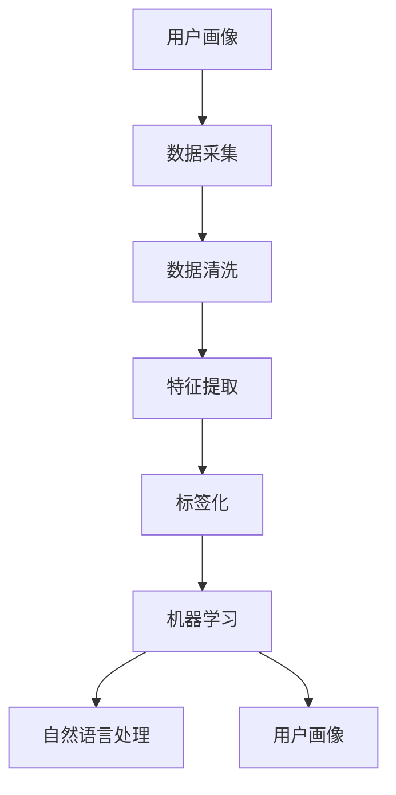

                 

# AI如何帮助电商企业进行用户画像标签化

## 1. 背景介绍

电商行业竞争激烈，用户需求千变万化，如何快速、准确地理解用户需求，提升用户体验，是所有电商企业面临的重大挑战。用户画像(User Persona)为用户特征进行数字化建模，帮助企业深入了解用户，提升运营效率和业务价值。传统用户画像的构建往往需要大量人工干预，成本高、效率低。利用人工智能技术进行自动化、高效化的用户画像标签化，成为电商企业提升竞争力的重要手段。

## 2. 核心概念与联系

### 2.1 核心概念概述

用户画像标签化是指通过机器学习等人工智能技术，从用户行为数据中自动化生成用户特征标签，用于描述用户属性、行为、兴趣等关键信息。其核心概念包括：

- **用户画像(User Persona)**：为每一个用户构建特征丰富的数字化模型，涵盖人口统计、行为偏好、消费习惯等方面。
- **特征工程(Feature Engineering)**：从原始数据中提取出与用户画像相关的特征。
- **标签化(Labeling)**：将用户特征转化为可度量、可比较的标签形式。
- **机器学习(Machine Learning)**：基于标注数据，训练模型自动化进行特征提取和标签化。
- **自然语言处理(Natural Language Processing, NLP)**：处理和理解自然语言文本，提取关键信息。

### 2.2 核心概念原理和架构的 Mermaid 流程图



这个流程图展示了用户画像标签化的主要流程：

1. **数据采集**：从电商平台收集用户行为数据，包括浏览记录、购买历史、评价内容等。
2. **数据清洗**：对收集的数据进行去重、去噪、缺失值处理等预处理。
3. **特征提取**：使用特征工程技术从清洗后的数据中提取有用特征。
4. **标签化**：将特征转化为标签形式，便于后续分析和应用。
5. **机器学习**：通过标注数据训练模型，自动化进行特征提取和标签化。
6. **自然语言处理**：处理和理解用户评论、描述等文本数据，提取有价值信息。
7. **用户画像**：将标签化的特征综合为一个全面的用户画像。

## 3. 核心算法原理 & 具体操作步骤

### 3.1 算法原理概述

用户画像标签化主要依赖于机器学习和自然语言处理技术。其核心思想是：

- **特征提取**：从用户行为数据中提取出与用户画像相关的特征，如浏览时长、消费频率、兴趣爱好等。
- **标签化**：将提取出的特征转化为有意义的标签形式，如年龄、性别、偏好商品类型等。
- **模型训练**：使用标注数据训练机器学习模型，自动化进行特征提取和标签化。

用户画像标签化流程通常包括以下步骤：

1. **数据预处理**：清洗、去噪、缺失值处理等。
2. **特征选择**：选择与用户画像相关性高的特征。
3. **特征编码**：将特征转化为标签形式，如文本特征使用词袋模型(Bag of Words)、TF-IDF等。
4. **模型训练**：使用标注数据训练机器学习模型，如决策树、随机森林、支持向量机(SVM)等。
5. **标签生成**：模型对新用户数据进行预测，生成用户画像标签。
6. **用户画像构建**：将标签化的特征综合为一个全面的用户画像。

### 3.2 算法步骤详解

#### 3.2.1 数据预处理

数据预处理是用户画像标签化的第一步。数据预处理包括：

- **数据清洗**：删除重复数据、处理缺失值、去噪等。
- **数据归一化**：将数据缩放到[0,1]区间或标准化为均值为0、方差为1。
- **特征选择**：选择与用户画像相关性高的特征，减少噪音干扰。

#### 3.2.2 特征提取

特征提取从原始数据中提取出与用户画像相关的特征。常用的特征提取方法包括：

- **数值型特征提取**：如浏览时长、消费频率、价格偏好等。
- **文本型特征提取**：如产品评论、商品描述等。

文本特征提取通常使用NLP技术，如TF-IDF、词袋模型、word2vec等。以word2vec为例，可以将文本特征转化为词向量形式，便于后续处理。

#### 3.2.3 特征编码

特征编码将提取出的特征转化为标签形式，便于后续分析和应用。常用的特征编码方法包括：

- **标签编码**：将数值型特征离散化成类别标签。
- **词向量编码**：将文本特征转换为词向量形式，便于处理。

#### 3.2.4 模型训练

模型训练是用户画像标签化的核心步骤。常用的机器学习模型包括：

- **决策树**：使用特征提取的结果，训练决策树模型，生成用户画像标签。
- **随机森林**：通过随机选取特征和样本，构建多个决策树，减少过拟合。
- **支持向量机(SVM)**：使用核函数将特征映射到高维空间，进行分类。

#### 3.2.5 标签生成

标签生成是指模型对新用户数据进行预测，生成用户画像标签。具体步骤如下：

- **数据输入**：将新用户的特征输入模型。
- **模型预测**：模型根据训练数据预测用户画像标签。
- **标签输出**：输出预测结果，生成用户画像标签。

### 3.3 算法优缺点

#### 3.3.1 优点

用户画像标签化具有以下优点：

- **自动化高效**：自动化的特征提取和标签化，减少人工干预，提高效率。
- **精确度高**：基于机器学习模型，特征提取和标签化精度较高。
- **可扩展性强**：可以处理大规模用户数据，扩展性强。

#### 3.3.2 缺点

用户画像标签化也存在一些缺点：

- **数据依赖性强**：标签化效果依赖于标注数据的质量和数量。
- **模型复杂度高**：复杂的机器学习模型需要较长的训练时间和计算资源。
- **解释性不足**：黑盒模型难以解释其内部决策逻辑，缺乏可解释性。

### 3.4 算法应用领域

用户画像标签化在电商行业具有广泛的应用领域：

- **用户细分**：根据用户画像标签，对用户进行细分，制定个性化的营销策略。
- **推荐系统**：基于用户画像，生成推荐商品列表，提升用户购物体验。
- **客服优化**：根据用户画像，提供个性化的客服响应，提升用户满意度。
- **广告投放**：基于用户画像，进行精准广告投放，提升广告转化率。
- **风险控制**：通过用户画像标签，识别高风险用户，进行风险防控。

## 4. 数学模型和公式 & 详细讲解 & 举例说明

### 4.1 数学模型构建

用户画像标签化的数学模型包括特征提取和模型训练两部分。

#### 4.1.1 特征提取

假设用户行为数据为 $D=\{(x_i, y_i)\}_{i=1}^N$，其中 $x_i$ 为特征向量， $y_i$ 为标签。特征提取的目标是找到一个线性函数 $f(x) = w \cdot x + b$，使得 $y_i = f(x_i)$。

- **线性回归模型**：
$$
y_i = \theta^T x_i
$$
其中 $\theta$ 为模型参数。

#### 4.1.2 模型训练

假设已标注数据集为 $D=\{(x_i, y_i)\}_{i=1}^N$，目标是最小化损失函数 $L(\theta)$：
$$
L(\theta) = \frac{1}{2N} \sum_{i=1}^N (y_i - \theta^T x_i)^2
$$
使用梯度下降算法优化参数 $\theta$，求解最小化损失函数。

### 4.2 公式推导过程

以线性回归模型为例，推导特征提取的损失函数和梯度计算公式。

- **损失函数**：
$$
L(\theta) = \frac{1}{2N} \sum_{i=1}^N (y_i - \theta^T x_i)^2
$$
- **梯度计算**：
$$
\nabla_\theta L(\theta) = \frac{1}{N} \sum_{i=1}^N (y_i - \theta^T x_i)x_i
$$
其中 $x_i$ 为特征向量， $y_i$ 为标签。

### 4.3 案例分析与讲解

以电商平台的购物数据为例，分析用户画像标签化的具体流程。

#### 4.3.1 数据预处理

- **数据清洗**：删除重复数据、处理缺失值、去噪等。
- **数据归一化**：将数据缩放到[0,1]区间或标准化为均值为0、方差为1。
- **特征选择**：选择与用户画像相关性高的特征，如浏览时长、消费频率、价格偏好等。

#### 4.3.2 特征提取

- **数值型特征提取**：如浏览时长、消费频率、价格偏好等。
- **文本型特征提取**：如产品评论、商品描述等。
- **文本特征编码**：使用TF-IDF、word2vec等技术，将文本特征转换为数值型特征。

#### 4.3.3 模型训练

- **数据输入**：将新用户的特征输入模型。
- **模型预测**：模型根据训练数据预测用户画像标签。
- **标签输出**：输出预测结果，生成用户画像标签。

#### 4.3.4 用户画像构建

将标签化的特征综合为一个全面的用户画像，如年龄、性别、偏好商品类型等。

## 5. 项目实践：代码实例和详细解释说明

### 5.1 开发环境搭建

在进行用户画像标签化的项目实践前，我们需要准备好开发环境。以下是使用Python进行项目实践的环境配置流程：

1. 安装Anaconda：从官网下载并安装Anaconda，用于创建独立的Python环境。

2. 创建并激活虚拟环境：
```bash
conda create -n user_profile_env python=3.8 
conda activate user_profile_env
```

3. 安装必要的Python包：
```bash
pip install numpy pandas scikit-learn scikit-learn tensorflow transformers
```

4. 下载并配置数据集：
```bash
wget https://example.com/user_data.csv
```

5. 导入数据并进行预处理：
```python
import pandas as pd

# 导入数据
data = pd.read_csv('user_data.csv')

# 数据清洗
data.drop_duplicates(inplace=True)
data.fillna(method='ffill', inplace=True)
data.dropna(inplace=True)

# 数据归一化
from sklearn.preprocessing import MinMaxScaler
scaler = MinMaxScaler()
data_scaled = scaler.fit_transform(data)

# 特征选择
features = ['浏览时长', '消费频率', '价格偏好']
data_selected = data[features]
```

### 5.2 源代码详细实现

下面我们以电商平台的购物数据为例，给出使用TensorFlow进行用户画像标签化的PyTorch代码实现。

```python
import tensorflow as tf
from sklearn.model_selection import train_test_split
from sklearn.preprocessing import MinMaxScaler
from tensorflow.keras import layers, models

# 数据预处理
data = pd.read_csv('user_data.csv')
features = ['浏览时长', '消费频率', '价格偏好']
data_selected = data[features]
data_scaled = scaler.fit_transform(data_selected)

# 划分训练集和测试集
train_data, test_data = train_test_split(data_scaled, test_size=0.2)

# 构建模型
model = models.Sequential([
    layers.Dense(32, activation='relu', input_shape=(3,)),
    layers.Dense(1, activation='sigmoid')
])

# 编译模型
model.compile(optimizer='adam', loss='binary_crossentropy', metrics=['accuracy'])

# 训练模型
model.fit(train_data, epochs=10, validation_data=test_data)
```

### 5.3 代码解读与分析

让我们再详细解读一下关键代码的实现细节：

**数据预处理**：
- **数据导入和清洗**：导入数据并清洗数据，删除重复项、处理缺失值和噪音等。
- **数据归一化**：使用`MinMaxScaler`对特征进行归一化处理。
- **特征选择**：选择与用户画像相关的特征。

**模型构建**：
- **模型架构**：使用`Sequential`模型，包含两个全连接层。
- **激活函数**：使用`relu`激活函数和`sigmoid`激活函数。
- **输入形状**：输入特征维度为3。

**模型编译和训练**：
- **编译**：使用`adam`优化器，`binary_crossentropy`损失函数，`accuracy`评价指标。
- **训练**：在训练集上进行模型训练，迭代10轮。

**测试集评估**：
- **评估**：使用测试集评估模型性能。

**用户画像构建**：
将训练好的模型应用到新用户数据上，生成用户画像标签。

## 6. 实际应用场景

### 6.1 电商推荐系统

电商推荐系统是用户画像标签化的典型应用场景。通过用户画像标签化，可以准确地理解用户需求，提供个性化的商品推荐，提升用户体验和转化率。具体步骤如下：

- **数据采集**：从电商平台采集用户行为数据。
- **数据清洗**：对数据进行清洗和预处理。
- **特征提取**：使用NLP技术处理文本特征，提取关键信息。
- **模型训练**：训练机器学习模型，生成用户画像标签。
- **推荐生成**：根据用户画像标签，生成个性化推荐商品列表。

### 6.2 客户细分

客户细分是电商企业了解用户、制定个性化营销策略的重要手段。通过用户画像标签化，可以对用户进行细分，提升运营效率和客户满意度。具体步骤如下：

- **数据采集**：从电商平台采集用户行为数据。
- **数据清洗**：对数据进行清洗和预处理。
- **特征提取**：使用特征工程技术提取与用户画像相关的特征。
- **模型训练**：训练机器学习模型，生成用户画像标签。
- **客户细分**：根据用户画像标签，对用户进行细分。

### 6.3 风险控制

风险控制是电商企业防范风险的重要手段。通过用户画像标签化，可以识别高风险用户，进行风险防控。具体步骤如下：

- **数据采集**：从电商平台采集用户行为数据。
- **数据清洗**：对数据进行清洗和预处理。
- **特征提取**：使用特征工程技术提取与用户画像相关的特征。
- **模型训练**：训练机器学习模型，生成用户画像标签。
- **风险识别**：根据用户画像标签，识别高风险用户。

### 6.4 未来应用展望

随着电商行业的不断发展和用户需求的不断变化，用户画像标签化的应用场景也将不断拓展。未来，用户画像标签化将更加智能化、个性化、实时化。具体展望如下：

- **实时化**：实时采集用户行为数据，实时生成用户画像标签。
- **智能化**：使用深度学习等高级算法，提高用户画像标签化的准确性和智能性。
- **个性化**：根据用户画像标签，提供更加个性化的产品和服务。
- **场景化**：将用户画像标签应用于更多场景，如智能客服、个性化广告等。

## 7. 工具和资源推荐

### 7.1 学习资源推荐

为了帮助开发者系统掌握用户画像标签化的理论基础和实践技巧，这里推荐一些优质的学习资源：

1. **《Python数据科学手册》**：详细介绍Python在数据科学中的应用，涵盖数据清洗、特征工程、模型训练等。
2. **《机器学习实战》**：详细介绍机器学习算法和模型，适合初学者学习。
3. **Kaggle平台**：提供丰富的数据集和竞赛，帮助你实践和提升。
4. **Coursera平台**：提供机器学习和NLP相关的课程，适合系统学习。
5. **PyTorch官方文档**：详细介绍PyTorch的使用方法和最佳实践，适合进阶学习。

通过对这些资源的学习实践，相信你一定能够快速掌握用户画像标签化的精髓，并用于解决实际的电商问题。

### 7.2 开发工具推荐

高效的开发离不开优秀的工具支持。以下是几款用于用户画像标签化开发的常用工具：

1. **TensorFlow**：由Google主导开发的开源深度学习框架，生产部署方便，适合大规模工程应用。
2. **PyTorch**：基于Python的开源深度学习框架，灵活动态的计算图，适合快速迭代研究。
3. **Scikit-learn**：Python的机器学习库，提供丰富的算法和工具。
4. **Pandas**：Python的数据处理库，用于数据清洗和预处理。
5. **Numpy**：Python的数值计算库，用于数学运算和特征提取。

合理利用这些工具，可以显著提升用户画像标签化任务的开发效率，加快创新迭代的步伐。

### 7.3 相关论文推荐

用户画像标签化技术的发展源于学界的持续研究。以下是几篇奠基性的相关论文，推荐阅读：

1. **"User Profiling in E-Commerce: A Review of Existing Approaches and Future Directions"**：系统回顾了电商领域用户画像的研究现状和未来方向。
2. **"Feature Engineering for User Profiling in E-Commerce"**：详细介绍特征工程技术在用户画像构建中的应用。
3. **"Deep Learning for User Profiling in E-Commerce"**：介绍深度学习在用户画像构建中的应用，包括模型选择、训练和评估。
4. **"Natural Language Processing in E-Commerce: A Survey"**：系统回顾了自然语言处理在电商领域的应用。
5. **"Personalized Recommendation Systems in E-Commerce"**：介绍个性化推荐系统在电商领域的应用。

这些论文代表了大规模用户画像技术的发展脉络。通过学习这些前沿成果，可以帮助研究者把握学科前进方向，激发更多的创新灵感。

## 8. 总结：未来发展趋势与挑战

### 8.1 总结

本文对用户画像标签化的方法进行了全面系统的介绍。首先阐述了用户画像标签化的背景和意义，明确了其在电商领域的重要性。其次，从原理到实践，详细讲解了用户画像标签化的数学模型和实现步骤，给出了详细的代码实例。同时，本文还广泛探讨了用户画像标签化在电商推荐系统、客户细分、风险控制等多个领域的应用前景，展示了用户画像标签化的巨大潜力。此外，本文精选了用户画像标签化的各类学习资源，力求为读者提供全方位的技术指引。

通过本文的系统梳理，可以看到，用户画像标签化技术在电商行业具有广泛的应用场景和巨大的发展潜力。它通过自动化、高效化的特征提取和标签化，显著提升了电商运营效率和用户体验，成为电商企业竞争力的重要组成部分。未来，随着技术的发展和应用的拓展，用户画像标签化技术必将进一步提升电商行业的智能化水平，推动电商技术的创新和发展。

### 8.2 未来发展趋势

展望未来，用户画像标签化技术将呈现以下几个发展趋势：

1. **智能化**：使用深度学习等高级算法，提高用户画像标签化的准确性和智能性。
2. **实时化**：实时采集用户行为数据，实时生成用户画像标签。
3. **个性化**：根据用户画像标签，提供更加个性化的产品和服务。
4. **场景化**：将用户画像标签应用于更多场景，如智能客服、个性化广告等。
5. **多模态化**：将用户画像标签化应用于多模态数据，如文本、图像、语音等，提升信息整合能力。

这些趋势凸显了用户画像标签化技术的广阔前景。这些方向的探索发展，必将进一步提升电商系统的性能和应用范围，为电商技术的产业化进程提供新的动力。

### 8.3 面临的挑战

尽管用户画像标签化技术已经取得了瞩目成就，但在迈向更加智能化、普适化应用的过程中，它仍面临着诸多挑战：

1. **数据依赖性强**：标签化效果依赖于标注数据的质量和数量。
2. **模型复杂度高**：复杂的机器学习模型需要较长的训练时间和计算资源。
3. **解释性不足**：黑盒模型难以解释其内部决策逻辑，缺乏可解释性。
4. **隐私保护**：用户数据的隐私保护问题需要重点关注。
5. **场景适应性**：用户画像标签化在不同场景下的适应性需要进一步优化。

### 8.4 研究展望

面对用户画像标签化技术所面临的挑战，未来的研究需要在以下几个方面寻求新的突破：

1. **数据增强**：通过数据增强技术，提高数据质量和数量，减少标注成本。
2. **模型优化**：使用更高效的模型结构，降低训练时间和计算资源。
3. **可解释性增强**：使用可解释性强的模型，增强模型决策的可理解性。
4. **隐私保护**：设计隐私保护机制，保护用户数据隐私。
5. **多模态融合**：将用户画像标签化应用于多模态数据，提升信息整合能力。

这些研究方向的探索，必将引领用户画像标签化技术迈向更高的台阶，为电商企业提供更加高效、智能、个性化的服务。

## 9. 附录：常见问题与解答

**Q1: 用户画像标签化是否适用于所有电商用户？**

A: 用户画像标签化适用于大多数电商用户，但不同用户的行为和需求可能存在差异。因此，对于特定用户群体，需要根据实际情况进行特征选择和模型调整。

**Q2: 用户画像标签化的准确性如何保证？**

A: 用户画像标签化的准确性依赖于标注数据的质量和数量。标注数据的准确性和代表性，直接影响用户画像标签化的效果。因此，需要定期更新和维护标注数据，保证标签化准确性。

**Q3: 用户画像标签化需要多少标注数据？**

A: 用户画像标签化需要一定数量的标注数据才能保证模型效果。一般来说，标注数据量越大，模型效果越好。对于不同规模的用户画像标签化项目，标注数据量需要根据实际情况进行确定。

**Q4: 用户画像标签化是否可以实时生成？**

A: 用户画像标签化可以实现实时生成，但需要保证数据的实时采集和处理能力。实时生成用户画像标签，可以提升电商系统的响应速度和用户体验。

**Q5: 用户画像标签化的应用场景有哪些？**

A: 用户画像标签化适用于电商推荐系统、客户细分、风险控制等多个场景。根据不同的应用场景，需要选择不同的特征工程和模型训练方法。

---

作者：禅与计算机程序设计艺术 / Zen and the Art of Computer Programming

