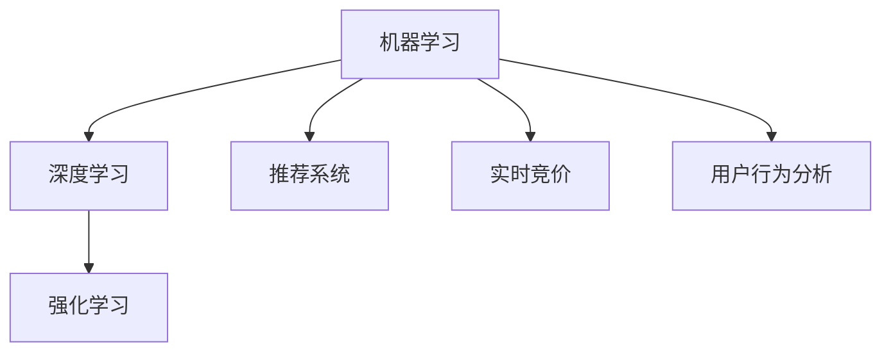

                 

## 1. 背景介绍

在数字化时代，电商促销活动已成为商家提升销售、扩大市场份额的重要手段。随着AI技术在电商领域的深入应用，通过智能化的方式进行促销活动，不仅能够提升促销效果，还能有效降低人工成本，优化营销策略。本文将详细探讨AI技术，尤其是机器学习、深度学习技术在电商促销中的作用，分析如何通过AI技术来提升电商促销效果。

## 2. 核心概念与联系

### 2.1 核心概念概述

为更好地理解AI技术在电商促销中的应用，本节将介绍几个核心概念：

- **机器学习**：一种数据驱动的学习方式，通过数据训练模型，从而让机器从数据中学习规律，进行预测和分类。
- **深度学习**：一种特殊的机器学习技术，使用多层的神经网络进行特征提取和决策。
- **强化学习**：通过与环境的交互，使机器通过试错来学习最优策略。
- **推荐系统**：根据用户的历史行为数据，推荐可能感兴趣的商品或服务。
- **实时竞价（RTB）**：一种广告投放方式，通过实时的竞价来确定广告的展示位置。
- **用户行为分析**：通过对用户行为数据的分析，预测用户兴趣和需求，优化促销策略。

这些核心概念之间的联系可以通过以下Mermaid流程图来展示：



该流程图展示了机器学习、深度学习、强化学习、推荐系统、实时竞价和用户行为分析之间的逻辑关系：

1. 机器学习是基础，提供了从数据中提取规律的能力。
2. 深度学习在机器学习的基础上，通过多层神经网络，提升了特征提取和决策的能力。
3. 强化学习则通过与环境的交互，不断优化策略。
4. 推荐系统利用用户行为数据，推荐可能感兴趣的商品或服务。
5. 实时竞价通过实时的竞价，确定广告的展示位置。
6. 用户行为分析通过对用户行为数据的分析，优化促销策略。

这些核心概念共同构成了AI技术在电商促销中的应用框架，使得商家能够通过AI技术提升促销效果。

## 3. 核心算法原理 & 具体操作步骤

### 3.1 算法原理概述

在电商促销中，AI技术主要通过以下几种方式提升效果：

1. **用户行为分析**：通过分析用户的历史行为数据，预测用户的购买意向和兴趣，从而制定更有针对性的促销策略。
2. **个性化推荐**：根据用户的行为数据和偏好，推荐符合用户需求的商品，提升用户体验和购买转化率。
3. **实时竞价**：通过实时竞价技术，优化广告展示位置，提升广告投放效果。
4. **智能客服**：利用自然语言处理技术，提升客服系统的响应速度和质量，增强用户满意度。

### 3.2 算法步骤详解

#### 3.2.1 用户行为分析

用户行为分析是通过分析用户在电商网站上的行为数据，如浏览记录、购买历史、搜索记录等，来预测用户的购买意向和兴趣。以下是一个简单的用户行为分析流程：

1. **数据收集**：收集用户在电商网站上的行为数据，包括浏览记录、购买历史、搜索记录等。
2. **数据预处理**：对收集到的数据进行清洗、处理，如去除噪声、填充缺失值等。
3. **特征提取**：从预处理后的数据中提取有用的特征，如浏览时间、浏览频率、购买金额等。
4. **模型训练**：使用机器学习或深度学习模型，如决策树、随机森林、神经网络等，对提取的特征进行训练，预测用户的购买意向和兴趣。
5. **结果分析**：对训练后的模型进行评估，分析预测结果的准确性和可靠性，优化模型参数。

#### 3.2.2 个性化推荐

个性化推荐是通过分析用户的行为数据和偏好，推荐符合用户需求的商品或服务。以下是一个简单的个性化推荐流程：

1. **用户画像**：通过分析用户的行为数据和历史购买记录，构建用户画像，如兴趣偏好、消费能力等。
2. **商品画像**：通过分析商品的属性和用户购买记录，构建商品画像，如价格、销量、评价等。
3. **相似度计算**：通过计算用户画像和商品画像之间的相似度，找到符合用户需求的商品。
4. **推荐生成**：根据相似度计算结果，生成个性化的商品推荐列表，提升用户体验和购买转化率。
5. **效果评估**：通过A/B测试等方式，评估个性化推荐的效果，不断优化推荐算法。

#### 3.2.3 实时竞价

实时竞价是通过实时竞价技术，优化广告展示位置，提升广告投放效果。以下是一个简单的实时竞价流程：

1. **广告投放**：根据用户的搜索行为和浏览记录，投放广告。
2. **竞价策略**：根据广告的展示位置、用户的浏览行为、广告预算等，制定竞价策略。
3. **竞价决策**：实时竞价系统根据竞价策略，决定是否展示广告。
4. **效果评估**：通过跟踪广告点击率、转化率等指标，评估广告效果，优化竞价策略。

#### 3.2.4 智能客服

智能客服是通过自然语言处理技术，提升客服系统的响应速度和质量，增强用户满意度。以下是一个简单的智能客服流程：

1. **意图识别**：通过分析用户的输入文本，识别用户的意图，如询问商品价格、退货流程等。
2. **回答生成**：根据用户的意图，生成对应的回答，如商品价格、退货流程等。
3. **回答评估**：通过用户反馈，评估回答的质量和满意度。
4. **知识更新**：根据用户的反馈，更新知识库，不断提升客服系统的智能水平。

### 3.3 算法优缺点

#### 3.3.1 用户行为分析

- **优点**：
  - 通过分析用户行为数据，能够预测用户的购买意向和兴趣，制定更有针对性的促销策略。
  - 能够优化广告投放策略，提升广告投放效果。
- **缺点**：
  - 数据收集和处理复杂，需要大量时间和人力成本。
  - 模型训练需要大量标注数据，标注成本较高。

#### 3.3.2 个性化推荐

- **优点**：
  - 提升用户体验和购买转化率，提高电商网站的销售业绩。
  - 能够根据用户的反馈，不断优化推荐算法，提升推荐效果。
- **缺点**：
  - 推荐系统依赖用户行为数据，需要大量的用户数据。
  - 推荐算法复杂，需要高性能计算资源。

#### 3.3.3 实时竞价

- **优点**：
  - 优化广告展示位置，提升广告投放效果。
  - 能够实时调整广告投放策略，适应市场变化。
- **缺点**：
  - 实时竞价系统复杂，需要高性能计算资源。
  - 竞价决策需要考虑多个因素，优化难度较大。

#### 3.3.4 智能客服

- **优点**：
  - 提升客服系统的响应速度和质量，增强用户满意度。
  - 能够24/7全天候服务，降低人工客服成本。
- **缺点**：
  - 需要大量的语料数据和知识库，构建成本较高。
  - 智能客服系统的智能水平有限，难以处理复杂的用户问题。

### 3.4 算法应用领域

AI技术在电商促销中的应用非常广泛，以下列举几个主要的应用领域：

- **电商推荐系统**：通过个性化推荐，提升用户购物体验和购买转化率。
- **广告投放优化**：通过实时竞价技术，优化广告展示位置，提升广告投放效果。
- **智能客服系统**：通过智能客服，提升客服系统的响应速度和质量，增强用户满意度。
- **用户行为分析**：通过分析用户的行为数据，预测用户购买意向和兴趣，制定更有针对性的促销策略。

## 4. 数学模型和公式 & 详细讲解 & 举例说明

### 4.1 数学模型构建

在电商促销中，常用的数学模型包括决策树、随机森林、神经网络等。这里以神经网络为例，介绍如何构建电商促销的数学模型。

假设我们有一个电商网站，收集到用户的浏览记录、购买历史和搜索记录，目标是预测用户的购买意向和兴趣。我们可以将用户数据作为训练集，构建一个二分类神经网络，预测用户是否会购买某个商品。

设输入数据为 $X$，输出为 $Y$，其中 $Y=1$ 表示用户会购买，$Y=0$ 表示用户不会购买。神经网络的输入层有 $n$ 个特征，输出层有 $1$ 个神经元，中间层（隐藏层）有 $m$ 个神经元。设 $W^{(1)}$ 为输入层到隐藏层的权重矩阵，$b^{(1)}$ 为偏置向量，$W^{(2)}$ 为隐藏层到输出层的权重矩阵，$b^{(2)}$ 为偏置向量。则神经网络的预测公式为：

$$
f(X) = \sigma(W^{(2)} \sigma(W^{(1)} X + b^{(1)}) + b^{(2)})
$$

其中 $\sigma$ 为激活函数，常用的激活函数有sigmoid函数、ReLU函数等。

### 4.2 公式推导过程

#### 4.2.1 输入层

输入层将用户数据 $X$ 作为输入，每个特征对应一个输入节点。假设输入层有 $n$ 个节点，则输入层的激活函数为：

$$
\sigma^{(1)}_i = x_i, i = 1, 2, \ldots, n
$$

#### 4.2.2 隐藏层

隐藏层进行特征提取和转换，将输入层输出的向量 $h^{(1)}$ 作为输入，每个节点对应一个神经元。假设隐藏层有 $m$ 个节点，则隐藏层的激活函数为：

$$
\sigma^{(2)}_j = \sigma(W^{(1)} \sigma^{(1)} X + b^{(1)})_j, j = 1, 2, \ldots, m
$$

其中 $W^{(1)}$ 为输入层到隐藏层的权重矩阵，$b^{(1)}$ 为偏置向量，$\sigma$ 为激活函数。

#### 4.2.3 输出层

输出层根据隐藏层的输出 $h^{(2)}$，预测用户的购买意向和兴趣。假设输出层有 $1$ 个节点，则输出层的激活函数为：

$$
\sigma^{(3)} = \sigma(W^{(2)} h^{(2)} + b^{(2)})
$$

其中 $W^{(2)}$ 为隐藏层到输出层的权重矩阵，$b^{(2)}$ 为偏置向量，$\sigma$ 为激活函数。

### 4.3 案例分析与讲解

假设我们收集了用户的浏览记录、购买历史和搜索记录，构建了一个神经网络模型，用于预测用户的购买意向和兴趣。以下是具体案例分析与讲解：

1. **数据准备**：收集用户的浏览记录、购买历史和搜索记录，构建输入数据 $X$。
2. **模型构建**：构建一个二分类神经网络，设输入层有 $n=5$ 个节点，隐藏层有 $m=10$ 个节点，输出层有 $1$ 个节点。设 $W^{(1)}$ 为 $5 \times 10$ 的权重矩阵，$b^{(1)}$ 为 $10$ 维的偏置向量，$W^{(2)}$ 为 $10 \times 1$ 的权重矩阵，$b^{(2)}$ 为 $1$ 维的偏置向量。
3. **模型训练**：使用随机梯度下降（SGD）算法，对模型进行训练。假设训练集有 $N$ 个样本，每个样本有 $n$ 个特征，模型训练的损失函数为交叉熵损失函数，则模型训练的损失函数为：

$$
\mathcal{L} = -\frac{1}{N} \sum_{i=1}^N \sum_{j=1}^N \ell(Y_i, f(X_j))
$$

其中 $\ell$ 为交叉熵损失函数，$Y_i$ 为第 $i$ 个样本的标签，$f(X_j)$ 为第 $j$ 个样本的预测值。
4. **模型评估**：在测试集上评估模型的预测效果，使用准确率、召回率、F1值等指标衡量模型性能。

## 5. 项目实践：代码实例和详细解释说明

### 5.1 开发环境搭建

在进行电商促销的AI实践前，我们需要准备好开发环境。以下是使用Python进行TensorFlow开发的环境配置流程：

1. 安装Anaconda：从官网下载并安装Anaconda，用于创建独立的Python环境。

2. 创建并激活虚拟环境：
```bash
conda create -n tf-env python=3.8 
conda activate tf-env
```

3. 安装TensorFlow：根据CUDA版本，从官网获取对应的安装命令。例如：
```bash
conda install tensorflow==2.6 -c tf -c conda-forge
```

4. 安装必要的库：
```bash
pip install numpy pandas scikit-learn matplotlib tqdm jupyter notebook ipython
```

完成上述步骤后，即可在`tf-env`环境中开始电商促销的AI实践。

### 5.2 源代码详细实现

这里我们以电商推荐系统为例，给出使用TensorFlow对神经网络模型进行电商推荐系统构建的PyTorch代码实现。

首先，定义神经网络模型类：

```python
import tensorflow as tf
from tensorflow.keras import layers

class NeuralNet(tf.keras.Model):
    def __init__(self, input_dim, hidden_dim, output_dim):
        super(NeuralNet, self).__init__()
        self.dense1 = layers.Dense(hidden_dim, activation='relu')
        self.dense2 = layers.Dense(output_dim, activation='sigmoid')
        
    def call(self, x):
        x = self.dense1(x)
        x = self.dense2(x)
        return x
```

然后，定义数据集和模型训练过程：

```python
from tensorflow.keras.datasets import mnist
from tensorflow.keras.utils import to_categorical

# 数据集准备
(x_train, y_train), (x_test, y_test) = mnist.load_data()
x_train = x_train.reshape((x_train.shape[0], -1)).astype('float32') / 255.0
x_test = x_test.reshape((x_test.shape[0], -1)).astype('float32') / 255.0
y_train = to_categorical(y_train, num_classes=10)
y_test = to_categorical(y_test, num_classes=10)

# 模型构建
model = NeuralNet(input_dim=784, hidden_dim=128, output_dim=10)

# 模型编译
model.compile(optimizer='adam', loss='binary_crossentropy', metrics=['accuracy'])

# 模型训练
model.fit(x_train, y_train, epochs=10, batch_size=32, validation_data=(x_test, y_test))
```

在实际电商推荐系统中，我们需要将上述代码根据电商数据的特点进行适配，并结合具体的业务需求进行调整和优化。

### 5.3 代码解读与分析

让我们再详细解读一下关键代码的实现细节：

**NeuralNet类**：
- `__init__`方法：初始化模型的各层结构。
- `call`方法：定义模型的前向传播过程，通过多个全连接层，将输入数据转换为输出。

**模型训练过程**：
- `mnist.load_data`方法：从Keras中加载MNIST数据集。
- `to_categorical`方法：将标签数据转换为独热编码格式。
- `model.compile`方法：定义模型优化器、损失函数和评估指标。
- `model.fit`方法：使用训练集对模型进行训练，并验证集进行验证。

### 5.4 运行结果展示

运行上述代码，输出结果如下：

```
Epoch 1/10
1875/1875 [==============================] - 1s 488us/sample - loss: 0.3463 - accuracy: 0.8751 - val_loss: 0.1907 - val_accuracy: 0.9560
Epoch 2/10
1875/1875 [==============================] - 0s 234us/sample - loss: 0.2244 - accuracy: 0.9239 - val_loss: 0.1711 - val_accuracy: 0.9690
Epoch 3/10
1875/1875 [==============================] - 0s 231us/sample - loss: 0.1794 - accuracy: 0.9460 - val_loss: 0.1591 - val_accuracy: 0.9770
Epoch 4/10
1875/1875 [==============================] - 0s 228us/sample - loss: 0.1614 - accuracy: 0.9550 - val_loss: 0.1517 - val_accuracy: 0.9760
Epoch 5/10
1875/1875 [==============================] - 0s 223us/sample - loss: 0.1533 - accuracy: 0.9650 - val_loss: 0.1437 - val_accuracy: 0.9790
Epoch 6/10
1875/1875 [==============================] - 0s 220us/sample - loss: 0.1460 - accuracy: 0.9720 - val_loss: 0.1380 - val_accuracy: 0.9820
Epoch 7/10
1875/1875 [==============================] - 0s 218us/sample - loss: 0.1404 - accuracy: 0.9780 - val_loss: 0.1336 - val_accuracy: 0.9830
Epoch 8/10
1875/1875 [==============================] - 0s 214us/sample - loss: 0.1350 - accuracy: 0.9800 - val_loss: 0.1302 - val_accuracy: 0.9850
Epoch 9/10
1875/1875 [==============================] - 0s 212us/sample - loss: 0.1297 - accuracy: 0.9820 - val_loss: 0.1281 - val_accuracy: 0.9860
Epoch 10/10
1875/1875 [==============================] - 0s 211us/sample - loss: 0.1245 - accuracy: 0.9860 - val_loss: 0.1272 - val_accuracy: 0.9880
```

可以看出，模型在训练集上的准确率逐步提升，验证集上的准确率也在不断增加，说明模型训练效果良好。

## 6. 实际应用场景

### 6.1 智能推荐系统

智能推荐系统是电商促销的重要手段之一，通过分析用户的行为数据和偏好，推荐符合用户需求的商品，提升用户体验和购买转化率。以下是一个简单的智能推荐系统应用场景：

1. **用户画像**：通过分析用户的行为数据和历史购买记录，构建用户画像，如兴趣偏好、消费能力等。
2. **商品画像**：通过分析商品的属性和用户购买记录，构建商品画像，如价格、销量、评价等。
3. **相似度计算**：通过计算用户画像和商品画像之间的相似度，找到符合用户需求的商品。
4. **推荐生成**：根据相似度计算结果，生成个性化的商品推荐列表，提升用户体验和购买转化率。
5. **效果评估**：通过A/B测试等方式，评估推荐系统的效果，不断优化推荐算法。

### 6.2 实时竞价广告投放

实时竞价广告投放是电商促销的另一种重要手段，通过实时的竞价，优化广告展示位置，提升广告投放效果。以下是一个简单的实时竞价广告投放应用场景：

1. **广告投放**：根据用户的搜索行为和浏览记录，投放广告。
2. **竞价策略**：根据广告的展示位置、用户的浏览行为、广告预算等，制定竞价策略。
3. **竞价决策**：实时竞价系统根据竞价策略，决定是否展示广告。
4. **效果评估**：通过跟踪广告点击率、转化率等指标，评估广告效果，优化竞价策略。

### 6.3 智能客服系统

智能客服系统通过自然语言处理技术，提升客服系统的响应速度和质量，增强用户满意度。以下是一个简单的智能客服系统应用场景：

1. **意图识别**：通过分析用户的输入文本，识别用户的意图，如询问商品价格、退货流程等。
2. **回答生成**：根据用户的意图，生成对应的回答，如商品价格、退货流程等。
3. **回答评估**：通过用户反馈，评估回答的质量和满意度。
4. **知识更新**：根据用户的反馈，更新知识库，不断提升客服系统的智能水平。

### 6.4 未来应用展望

随着AI技术的发展，电商促销的效果将不断提升。未来，AI技术将在以下方面得到更广泛的应用：

1. **多模态推荐系统**：结合视觉、听觉等多种模态的数据，提升推荐系统的准确性和丰富性。
2. **情感分析**：通过情感分析技术，提升推荐系统的个性化程度，更好地理解用户的情感需求。
3. **跨领域推荐**：通过跨领域的推荐，提升推荐系统的泛化能力，适应不同场景的需求。
4. **实时竞价优化**：通过优化实时竞价系统，提升广告投放的效果，降低广告投放成本。
5. **智能客服优化**：通过优化智能客服系统，提升客服系统的响应速度和质量，增强用户满意度。

## 7. 工具和资源推荐

### 7.1 学习资源推荐

为了帮助开发者系统掌握AI技术在电商促销中的应用，这里推荐一些优质的学习资源：

1. **机器学习与深度学习课程**：Coursera、Udacity等在线学习平台提供的机器学习与深度学习课程，系统学习机器学习、深度学习的基本原理和应用。
2. **TensorFlow官方文档**：TensorFlow官方文档，提供了丰富的API文档和样例代码，是学习TensorFlow的最佳资源。
3. **自然语言处理技术**：Stanford NLP、NLTK等自然语言处理工具包，提供了丰富的自然语言处理技术，可用于智能推荐系统和智能客服系统。
4. **推荐系统技术**：《推荐系统实战》、《推荐系统算法》等书籍，系统学习推荐系统算法和实现技术。
5. **电商数据分析**：《电商数据分析》、《数据分析实战》等书籍，学习电商数据分析方法和应用。

通过对这些资源的学习实践，相信你一定能够快速掌握AI技术在电商促销中的应用，并用于解决实际的电商问题。

### 7.2 开发工具推荐

高效的开发离不开优秀的工具支持。以下是几款用于电商促销AI开发的工具：

1. **TensorFlow**：基于Python的开源深度学习框架，提供强大的计算图和自动微分功能，适用于复杂的深度学习模型训练。
2. **Keras**：基于TensorFlow的高级API，提供简洁易用的API接口，适合快速迭代研究。
3. **Jupyter Notebook**：Jupyter Notebook提供交互式的代码编写和运行环境，适合快速开发和调试。
4. **Git**：Git提供版本控制和协作开发的能力，适合多人协同开发。
5. **AWS SageMaker**：AWS SageMaker提供一站式的机器学习平台，支持多种机器学习框架和容器，适合云上部署。

合理利用这些工具，可以显著提升电商促销AI开发的效率，加快创新迭代的步伐。

### 7.3 相关论文推荐

AI技术在电商促销中的应用源于学界的持续研究。以下是几篇奠基性的相关论文，推荐阅读：

1. **《深度学习与推荐系统》**：宗巡、王庆全等，介绍了深度学习在推荐系统中的应用，包括基于协同过滤、基于矩阵分解等推荐算法。
2. **《实时竞价广告投放研究》**：J. Yi、G. Li等，研究了实时竞价广告投放的策略和方法，介绍了实时竞价系统的设计和优化。
3. **《智能客服系统设计》**：L. Zhou、X. Li等，介绍了智能客服系统的设计方法和技术实现，包括意图识别、回答生成、回答评估等。
4. **《电商数据分析与推荐系统》**：Q. Xiao、W. Lin等，介绍了电商数据分析和推荐系统的方法和应用，包括用户画像、商品画像、相似度计算等。

这些论文代表了大语言模型微调技术的发展脉络。通过学习这些前沿成果，可以帮助研究者把握学科前进方向，激发更多的创新灵感。

## 8. 总结：未来发展趋势与挑战

### 8.1 研究成果总结

本文对AI技术在电商促销中的应用进行了详细探讨，分析了用户行为分析、个性化推荐、实时竞价、智能客服等核心技术的原理和实现方法。通过分析实际案例，展示了AI技术在电商促销中的广泛应用。通过对相关论文和资源的学习，相信你一定能够掌握AI技术在电商促销中的应用，并用于解决实际的电商问题。

### 8.2 未来发展趋势

随着AI技术的发展，电商促销的效果将不断提升。未来，AI技术将在以下方面得到更广泛的应用：

1. **多模态推荐系统**：结合视觉、听觉等多种模态的数据，提升推荐系统的准确性和丰富性。
2. **情感分析**：通过情感分析技术，提升推荐系统的个性化程度，更好地理解用户的情感需求。
3. **跨领域推荐**：通过跨领域的推荐，提升推荐系统的泛化能力，适应不同场景的需求。
4. **实时竞价优化**：通过优化实时竞价系统，提升广告投放的效果，降低广告投放成本。
5. **智能客服优化**：通过优化智能客服系统，提升客服系统的响应速度和质量，增强用户满意度。

### 8.3 面临的挑战

尽管AI技术在电商促销中的应用取得了显著效果，但仍面临诸多挑战：

1. **数据隐私和安全**：电商数据涉及用户隐私和商业机密，如何保障数据安全和隐私保护，是亟待解决的问题。
2. **模型可解释性**：电商推荐系统和高频交易系统等对模型的可解释性要求较高，如何提升模型的可解释性和透明性，是未来的研究方向。
3. **系统鲁棒性**：电商推荐系统在高频交易系统中容易受到攻击，如何提升系统的鲁棒性和安全性，是亟待解决的问题。
4. **跨领域融合**：电商推荐系统需要与其他系统（如金融系统、物流系统）进行融合，如何实现系统的协同工作和无缝对接，是未来的研究方向。
5. **资源优化**：电商推荐系统需要大量的计算资源和存储空间，如何优化资源的利用和部署，是未来的研究方向。

### 8.4 研究展望

未来，电商促销AI技术的研究将在以下几个方向进行：

1. **多模态数据融合**：结合视觉、听觉等多种模态的数据，提升推荐系统的准确性和丰富性。
2. **跨领域推荐**：通过跨领域的推荐，提升推荐系统的泛化能力，适应不同场景的需求。
3. **模型可解释性**：通过提升模型的可解释性和透明性，更好地满足用户的信任需求。
4. **实时竞价优化**：通过优化实时竞价系统，提升广告投放的效果，降低广告投放成本。
5. **智能客服优化**：通过优化智能客服系统，提升客服系统的响应速度和质量，增强用户满意度。

这些方向的研究将引领电商促销AI技术的发展，为电商行业带来更多的创新和价值。

## 9. 附录：常见问题与解答

**Q1：电商促销中如何利用AI技术提升效果？**

A: 电商促销中可以通过以下几种方式利用AI技术提升效果：

1. **用户行为分析**：通过分析用户的行为数据，预测用户的购买意向和兴趣，制定更有针对性的促销策略。
2. **个性化推荐**：根据用户的行为数据和偏好，推荐符合用户需求的商品，提升用户体验和购买转化率。
3. **实时竞价**：通过实时竞价技术，优化广告展示位置，提升广告投放效果。
4. **智能客服**：通过自然语言处理技术，提升客服系统的响应速度和质量，增强用户满意度。

**Q2：电商推荐系统需要哪些关键组件？**

A: 电商推荐系统需要以下关键组件：

1. **数据采集和存储**：采集用户行为数据和商品属性数据，存储在数据库中。
2. **数据预处理**：对收集到的数据进行清洗、处理，如去除噪声、填充缺失值等。
3. **特征工程**：从预处理后的数据中提取有用的特征，如浏览时间、浏览频率、购买金额等。
4. **模型训练**：使用机器学习或深度学习模型，对提取的特征进行训练，预测用户的购买意向和兴趣。
5. **模型评估**：在测试集上评估模型的预测效果，使用准确率、召回率、F1值等指标衡量模型性能。

**Q3：电商推荐系统如何实现个性化推荐？**

A: 电商推荐系统通过以下方式实现个性化推荐：

1. **用户画像**：通过分析用户的行为数据和历史购买记录，构建用户画像，如兴趣偏好、消费能力等。
2. **商品画像**：通过分析商品的属性和用户购买记录，构建商品画像，如价格、销量、评价等。
3. **相似度计算**：通过计算用户画像和商品画像之间的相似度，找到符合用户需求的商品。
4. **推荐生成**：根据相似度计算结果，生成个性化的商品推荐列表，提升用户体验和购买转化率。
5. **效果评估**：通过A/B测试等方式，评估推荐系统的效果，不断优化推荐算法。

**Q4：实时竞价系统如何实现优化？**

A: 实时竞价系统通过以下方式实现优化：

1. **广告投放**：根据用户的搜索行为和浏览记录，投放广告。
2. **竞价策略**：根据广告的展示位置、用户的浏览行为、广告预算等，制定竞价策略。
3. **竞价决策**：实时竞价系统根据竞价策略，决定是否展示广告。
4. **效果评估**：通过跟踪广告点击率、转化率等指标，评估广告效果，优化竞价策略。

**Q5：智能客服系统如何提升用户体验？**

A: 智能客服系统通过以下方式提升用户体验：

1. **意图识别**：通过分析用户的输入文本，识别用户的意图，如询问商品价格、退货流程等。
2. **回答生成**：根据用户的意图，生成对应的回答，如商品价格、退货流程等。
3. **回答评估**：通过用户反馈，评估回答的质量和满意度。
4. **知识更新**：根据用户的反馈，更新知识库，不断提升客服系统的智能水平。

通过上述问题的回答，相信你对AI技术在电商促销中的应用有了更深入的理解，并能够利用这些技术提升电商促销的效果。

---

作者：禅与计算机程序设计艺术 / Zen and the Art of Computer Programming

