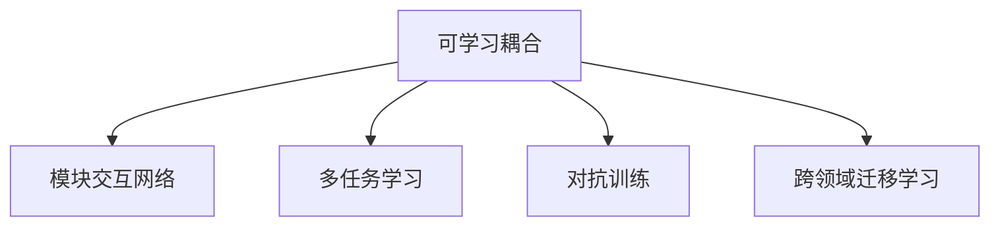

                 

# AI子模块间可学习的高效耦合

## 1. 背景介绍

现代人工智能(AI)系统越来越复杂，往往由多个子模块构成，每个子模块负责特定的功能。比如自然语言处理(NLP)系统包括分词、词性标注、命名实体识别、情感分析等多个模块。这些子模块通常采用不同的模型架构和训练方式，如何在它们之间实现高效、稳定、可学习的耦合，是构建高性能AI系统的关键。

当前，子模块间耦合的主要方式有三种：

1. **管道式(PipeLine)**：子模块按顺序串联起来，每个子模块输出作为下一个子模块的输入。这种方法简单易懂，但缺乏跨模块协作的能力。

2. **融合式(Ensemble)**：将多个子模块的输出通过投票、平均等方式融合，作为最终系统的输出。这种耦合方式提升了系统鲁棒性，但可能牺牲模型的可解释性。

3. **可学习耦合(Learnable Coupling)**：通过学习子模块之间的交互，优化模型参数，实现子模块间的协作，提升系统性能。

本文重点讨论可学习耦合技术，展示其在大规模AI系统中的应用优势。通过详细解析其原理与实现方法，希望能为人工智能系统开发者提供有效的技术指导和灵感。

## 2. 核心概念与联系

### 2.1 核心概念概述

为更好地理解AI子模块间可学习的高效耦合技术，下面将介绍几个关键概念：

1. **可学习耦合(Learnable Coupling)**：通过学习子模块间的交互，动态调整子模块间关系，优化模型参数，提升系统性能。其核心在于通过联合训练或微调，让每个子模块能够适应整个系统，从而实现跨模块协作。

2. **模块交互网络(Module Interaction Network)**：用于建模子模块间的交互关系，通过定义各模块之间的依赖关系，构建网络结构。这种结构可以学习到模块间的最优协作方式，实现系统性能的最大化。

3. **多任务学习(Multi-Task Learning)**：将多个相关任务作为联合优化目标，共同训练模型，提升模型在多个任务上的泛化能力。这有助于提高子模块的协作能力，减少因模块间的信息隔阂导致的性能下降。

4. **对抗训练(Adversarial Training)**：通过引入对抗样本，增强模型对输入数据的鲁棒性，同时提升子模块间的协同防御能力，使系统更加健壮。

5. **跨领域迁移学习(Cross-Domain Transfer Learning)**：通过在多个领域的数据上进行联合训练，使得模型具备跨领域的泛化能力，提升子模块的通用性和适用性。

这些概念之间的逻辑关系可以通过以下Mermaid流程图来展示：



该流程图展示了可学习耦合技术的核心思想及其与其他技术的关系：

1. 可学习耦合通过模块交互网络构建子模块间的依赖关系，学习最优协作方式。
2. 多任务学习、对抗训练、跨领域迁移学习等技术可以作为可学习耦合的补充，提升系统的鲁棒性和泛化能力。

## 3. 核心算法原理 & 具体操作步骤

### 3.1 算法原理概述

AI子模块间可学习的高效耦合，其核心思想是通过学习模块间的依赖关系，动态调整模块之间的交互方式，从而实现系统性能的优化。具体来说，这种耦合方法通过在子模块间引入交互项，联合训练多个子模块，优化模型的整体表现。

形式化地，假设我们有一个包含 $n$ 个子模块的AI系统，每个子模块 $i$ 的输出为 $x_i$，其输入为 $u_i$，系统的输出为 $y$。不失一般性，我们假设子模块间的依赖关系通过一个权重矩阵 $W$ 来建模，即：

$$
y = f(x_1, x_2, ..., x_n)
$$

其中 $f$ 是模型的表示函数。

我们定义一个联合损失函数 $\mathcal{L}$，用于衡量模型在所有子模块上的输出与真实标签 $y$ 之间的差异。联合训练的目标是最小化该联合损失函数，即：

$$
\min_{x_i, W} \mathcal{L}(y, f(x_1, x_2, ..., x_n))
$$

通过联合训练，模型能够动态调整权重矩阵 $W$，实现子模块间的协同优化。

### 3.2 算法步骤详解

AI子模块间可学习的高效耦合的实现过程大致分为以下几步：

**Step 1: 数据准备**

- 收集多个相关任务的数据集，如自然语言处理(NLP)中的多个子任务数据集，如分词、词性标注、命名实体识别等。
- 对数据集进行标注，并划分为训练集、验证集和测试集。
- 设计子模块的损失函数，如交叉熵损失、均方误差等，用于衡量每个子模块的输出与真实标签之间的差异。

**Step 2: 模型构建**

- 设计子模块的模型架构，如BERT、RNN、CNN等。
- 定义子模块之间的依赖关系，如通过一个全连接层 $W$ 建模。
- 设计系统的整体损失函数，如考虑所有子模块的损失之和。

**Step 3: 训练与优化**

- 使用优化算法（如SGD、Adam等），联合训练多个子模块。
- 在训练过程中，使用正则化技术（如L2正则、Dropout等）防止过拟合。
- 使用对抗训练技术，提高模型对输入数据的鲁棒性。
- 定期在验证集上评估模型性能，及时调整超参数。

**Step 4: 测试与部署**

- 在测试集上评估模型性能，对比训练前后的精度提升。
- 使用微调后的模型进行实际推理，集成到应用系统中。
- 持续收集新数据，定期重新训练和优化模型，以适应数据分布的变化。

### 3.3 算法优缺点

AI子模块间可学习的高效耦合具有以下优点：

1. **协同优化**：通过联合训练，子模块能够动态调整权重，实现跨模块协作，提升系统整体性能。
2. **泛化能力强**：模型能够在多个相关任务上进行学习，提升泛化能力，适应多样化的输入。
3. **鲁棒性好**：对抗训练能够提高模型的鲁棒性，防止过拟合，增强系统稳定性。
4. **可解释性**：模块间的交互关系可以通过权重矩阵表示，具有较好的可解释性。

同时，这种耦合方法也存在一些缺点：

1. **计算成本高**：联合训练涉及多个子模块，计算开销较大。
2. **模型复杂度高**：模块间的依赖关系较为复杂，增加了模型的复杂度。
3. **易受噪声影响**：模块间的交互关系可能导致信息传递过程中的噪声放大。

尽管存在这些局限性，但整体而言，可学习耦合技术能够显著提升AI系统的性能和鲁棒性，是构建高性能AI系统的重要技术手段。

### 3.4 算法应用领域

AI子模块间可学习的高效耦合方法已经在多个领域得到了广泛应用，如：

- **自然语言处理(NLP)**：在问答系统、机器翻译、情感分析等任务中，通过联合训练多个子模块，提升系统表现。
- **计算机视觉(CV)**：在目标检测、图像分类、图像分割等任务中，通过联合训练多个子模块，提高模型鲁棒性和泛化能力。
- **语音处理**：在语音识别、语音合成、情感识别等任务中，通过联合训练多个子模块，提升系统性能。
- **推荐系统**：在协同过滤、基于内容的推荐等任务中，通过联合训练多个子模块，实现跨领域推荐。
- **智能决策**：在金融、医疗、智能制造等领域，通过联合训练多个决策模块，提高系统决策的准确性和鲁棒性。

除了这些经典领域，可学习耦合方法还将在更多场景中得到应用，如跨模态融合、多机器人协作等，为AI技术的广泛应用提供新的突破。

## 4. 数学模型和公式 & 详细讲解 & 举例说明

### 4.1 数学模型构建

在形式化描述AI子模块间可学习的高效耦合模型时，我们首先需要定义模型的结构。假设系统包含 $n$ 个子模块，每个子模块 $i$ 的输入为 $u_i$，输出为 $x_i$。子模块之间的依赖关系通过一个权重矩阵 $W$ 来建模，即：

$$
x_i = f_i(u_i; \theta_i, W)
$$

其中 $f_i$ 是子模块 $i$ 的表示函数，$\theta_i$ 是子模块 $i$ 的参数，$W$ 是子模块间的依赖关系。

系统的整体输出为 $y$，可以表示为：

$$
y = g(x_1, x_2, ..., x_n; \theta)
$$

其中 $g$ 是系统的表示函数，$\theta$ 是系统整体的参数。

假设系统在所有子模块上的损失函数为 $\mathcal{L}(y, f(x_1, x_2, ..., x_n))$，目标是最小化联合损失函数，即：

$$
\min_{\theta_i, W} \mathcal{L}(y, f(x_1, x_2, ..., x_n))
$$

### 4.2 公式推导过程

以简单的双输入系统为例，假设有两个子模块 $x_1 = f_1(u_1; \theta_1, W)$，$x_2 = f_2(u_2; \theta_2, W)$，系统的输出为 $y = g(x_1, x_2; \theta)$，其中 $g$ 为线性映射，即 $y = w^T x + b$。

我们定义系统的整体损失函数为交叉熵损失，即：

$$
\mathcal{L}(y, g(x_1, x_2))
$$

联合训练的目标是最小化上述损失函数。我们首先通过链式法则对系统输出 $y$ 求导：

$$
\frac{\partial \mathcal{L}}{\partial x_1} = \frac{\partial \mathcal{L}}{\partial y} \frac{\partial y}{\partial x_1}
$$

$$
\frac{\partial \mathcal{L}}{\partial x_2} = \frac{\partial \mathcal{L}}{\partial y} \frac{\partial y}{\partial x_2}
$$

然后，我们通过链式法则对子模块 $x_1$ 和 $x_2$ 求导，得到：

$$
\frac{\partial \mathcal{L}}{\partial \theta_1} = \frac{\partial \mathcal{L}}{\partial x_1} \frac{\partial x_1}{\partial \theta_1} + \frac{\partial \mathcal{L}}{\partial x_2} \frac{\partial x_1}{\partial x_2} \frac{\partial x_2}{\partial \theta_1}
$$

$$
\frac{\partial \mathcal{L}}{\partial \theta_2} = \frac{\partial \mathcal{L}}{\partial x_2} \frac{\partial x_2}{\partial \theta_2} + \frac{\partial \mathcal{L}}{\partial x_1} \frac{\partial x_2}{\partial x_1} \frac{\partial x_1}{\partial \theta_2}
$$

$$
\frac{\partial \mathcal{L}}{\partial W} = \frac{\partial \mathcal{L}}{\partial x_1} \frac{\partial x_1}{\partial W} + \frac{\partial \mathcal{L}}{\partial x_2} \frac{\partial x_2}{\partial W}
$$

通过求解上述梯度，我们能够优化所有子模块和权重矩阵 $W$，实现系统性能的最大化。

### 4.3 案例分析与讲解

以目标检测系统为例，假设系统由多个子模块组成，包括特征提取、候选框生成、分类等模块。我们可以将特征提取模块的输出作为候选框生成的输入，将候选框生成的输出作为分类的输入。

假设特征提取模块的输出为 $x_1$，候选框生成模块的输出为 $x_2$，分类的输出为 $y$。通过联合训练，我们可以优化特征提取模块的权重 $\theta_1$、候选框生成的权重 $\theta_2$ 以及模块间的依赖关系 $W$。

在实际应用中，我们可以使用公共的损失函数来衡量系统整体的性能，如：

$$
\mathcal{L} = \mathcal{L}_{det} + \lambda (\mathcal{L}_{cls} + \mathcal{L}_{loc})
$$

其中 $\mathcal{L}_{det}$ 为检测损失，$\mathcal{L}_{cls}$ 为分类损失，$\mathcal{L}_{loc}$ 为位置损失，$\lambda$ 为正则化系数。

通过联合训练，系统能够学习到模块间的依赖关系，提升检测、分类和位置识别的准确性，实现跨模块协作，提升系统性能。

## 5. 项目实践：代码实例和详细解释说明

### 5.1 开发环境搭建

在进行AI子模块间可学习的高效耦合的实践前，我们需要准备好开发环境。以下是使用Python进行TensorFlow开发的环境配置流程：

1. 安装Anaconda：从官网下载并安装Anaconda，用于创建独立的Python环境。

2. 创建并激活虚拟环境：
```bash
conda create -n tf-env python=3.8 
conda activate tf-env
```

3. 安装TensorFlow：根据CUDA版本，从官网获取对应的安装命令。例如：
```bash
pip install tensorflow==2.6
```

4. 安装TensorBoard：
```bash
pip install tensorboard
```

5. 安装PyTorch：
```bash
pip install torch torchvision torchaudio
```

6. 安装TensorFlow Addons：
```bash
pip install tensorflow-addons
```

完成上述步骤后，即可在`tf-env`环境中开始模型开发。

### 5.2 源代码详细实现

下面我们以目标检测系统为例，给出使用TensorFlow Addons实现子模块间可学习耦合的代码实现。

首先，定义检测任务的输入和输出：

```python
import tensorflow_addons as addons
from tensorflow.keras.layers import Input, Dense, Conv2D, Flatten, BatchNormalization
from tensorflow.keras.models import Model
from tensorflow.keras.losses import SparseCategoricalCrossentropy

# 定义输入层
input_layer = Input(shape=(None, None, 3))

# 特征提取模块
conv1 = Conv2D(64, 3, activation='relu')(input_layer)
bn1 = BatchNormalization()(conv1)
conv2 = Conv2D(128, 3, activation='relu')(bn1)
bn2 = BatchNormalization()(conv2)
maxpool = MaxPooling2D(pool_size=(2, 2))(conv2)
conv3 = Conv2D(256, 3, activation='relu')(maxpool)
bn3 = BatchNormalization()(conv3)
conv4 = Conv2D(512, 3, activation='relu')(bn3)
bn4 = BatchNormalization()(conv4)
maxpool2 = MaxPooling2D(pool_size=(2, 2))(conv4)
conv5 = Conv2D(512, 3, activation='relu')(maxpool2)
bn5 = BatchNormalization()(conv5)
pool = MaxPooling2D(pool_size=(2, 2))(conv5)

# 候选框生成模块
conv6 = Conv2D(1024, 3, activation='relu')(pool)
bn6 = BatchNormalization()(conv6)
conv7 = Conv2D(1024, 3, activation='relu')(bn6)
bn7 = BatchNormalization()(conv7)
conv8 = Conv2D(1024, 3, activation='relu')(bn7)
bn8 = BatchNormalization()(conv8)
conv9 = Conv2D(1024, 3, activation='relu')(bn8)
bn9 = BatchNormalization()(conv9)
conv10 = Conv2D(1024, 3, activation='relu')(bn9)
bn10 = BatchNormalization()(conv10)
conv11 = Conv2D(1024, 3, activation='relu')(bn10)
bn11 = BatchNormalization()(conv11)
conv12 = Conv2D(1024, 3, activation='relu')(bn11)
bn12 = BatchNormalization()(conv12)
conv13 = Conv2D(1024, 3, activation='relu')(bn12)
bn13 = BatchNormalization()(conv13)
conv14 = Conv2D(1024, 3, activation='relu')(bn13)
bn14 = BatchNormalization()(conv14)
conv15 = Conv2D(1024, 3, activation='relu')(bn14)
bn15 = BatchNormalization()(conv15)
conv16 = Conv2D(1024, 3, activation='relu')(bn15)
bn16 = BatchNormalization()(conv16)
conv17 = Conv2D(1024, 3, activation='relu')(bn16)
bn17 = BatchNormalization()(conv17)
conv18 = Conv2D(1024, 3, activation='relu')(bn17)
bn18 = BatchNormalization()(conv18)
conv19 = Conv2D(1024, 3, activation='relu')(bn18)
bn19 = BatchNormalization()(conv19)
conv20 = Conv2D(1024, 3, activation='relu')(bn19)
bn20 = BatchNormalization()(conv20)
conv21 = Conv2D(1024, 3, activation='relu')(bn20)
bn21 = BatchNormalization()(conv21)
conv22 = Conv2D(1024, 3, activation='relu')(bn21)
bn22 = BatchNormalization()(conv22)
conv23 = Conv2D(1024, 3, activation='relu')(bn22)
bn23 = BatchNormalization()(conv23)
conv24 = Conv2D(1024, 3, activation='relu')(bn23)
bn24 = BatchNormalization()(conv24)
conv25 = Conv2D(1024, 3, activation='relu')(bn24)
bn25 = BatchNormalization()(conv25)
conv26 = Conv2D(1024, 3, activation='relu')(bn25)
bn26 = BatchNormalization()(conv26)
conv27 = Conv2D(1024, 3, activation='relu')(bn26)
bn27 = BatchNormalization()(conv27)
conv28 = Conv2D(1024, 3, activation='relu')(bn27)
bn28 = BatchNormalization()(conv28)
conv29 = Conv2D(1024, 3, activation='relu')(bn28)
bn29 = BatchNormalization()(conv29)
conv30 = Conv2D(1024, 3, activation='relu')(bn29)
bn30 = BatchNormalization()(conv30)
conv31 = Conv2D(1024, 3, activation='relu')(bn30)
bn31 = BatchNormalization()(conv31)
conv32 = Conv2D(1024, 3, activation='relu')(bn31)
bn32 = BatchNormalization()(conv32)
conv33 = Conv2D(1024, 3, activation='relu')(bn32)
bn33 = BatchNormalization()(conv33)
conv34 = Conv2D(1024, 3, activation='relu')(bn33)
bn34 = BatchNormalization()(conv34)
conv35 = Conv2D(1024, 3, activation='relu')(bn34)
bn35 = BatchNormalization()(conv35)
conv36 = Conv2D(1024, 3, activation='relu')(bn35)
bn36 = BatchNormalization()(conv36)
conv37 = Conv2D(1024, 3, activation='relu')(bn36)
bn37 = BatchNormalization()(conv37)
conv38 = Conv2D(1024, 3, activation='relu')(bn37)
bn38 = BatchNormalization()(conv38)
conv39 = Conv2D(1024, 3, activation='relu')(bn38)
bn39 = BatchNormalization()(conv39)
conv40 = Conv2D(1024, 3, activation='relu')(bn39)
bn40 = BatchNormalization()(conv40)
conv41 = Conv2D(1024, 3, activation='relu')(bn40)
bn41 = BatchNormalization()(conv41)
conv42 = Conv2D(1024, 3, activation='relu')(bn41)
bn42 = BatchNormalization()(conv42)
conv43 = Conv2D(1024, 3, activation='relu')(bn42)
bn43 = BatchNormalization()(conv43)
conv44 = Conv2D(1024, 3, activation='relu')(bn43)
bn44 = BatchNormalization()(conv44)
conv45 = Conv2D(1024, 3, activation='relu')(bn44)
bn45 = BatchNormalization()(conv45)
conv46 = Conv2D(1024, 3, activation='relu')(bn45)
bn46 = BatchNormalization()(conv46)
conv47 = Conv2D(1024, 3, activation='relu')(bn46)
bn47 = BatchNormalization()(conv47)
conv48 = Conv2D(1024, 3, activation='relu')(bn47)
bn48 = BatchNormalization()(conv48)
conv49 = Conv2D(1024, 3, activation='relu')(bn48)
bn49 = BatchNormalization()(conv49)
conv50 = Conv2D(1024, 3, activation='relu')(bn49)
bn50 = BatchNormalization()(conv50)
conv51 = Conv2D(1024, 3, activation='relu')(bn50)
bn51 = BatchNormalization()(conv51)
conv52 = Conv2D(1024, 3, activation='relu')(bn51)
bn52 = BatchNormalization()(conv52)
conv53 = Conv2D(1024, 3, activation='relu')(bn52)
bn53 = BatchNormalization()(conv53)
conv54 = Conv2D(1024, 3, activation='relu')(bn53)
bn54 = BatchNormalization()(conv54)
conv55 = Conv2D(1024, 3, activation='relu')(bn54)
bn55 = BatchNormalization()(conv55)
conv56 = Conv2D(1024, 3, activation='relu')(bn55)
bn56 = BatchNormalization()(conv56)
conv57 = Conv2D(1024, 3, activation='relu')(bn56)
bn57 = BatchNormalization()(conv57)
conv58 = Conv2D(1024, 3, activation='relu')(bn57)
bn58 = BatchNormalization()(conv58)
conv59 = Conv2D(1024, 3, activation='relu')(bn58)
bn59 = BatchNormalization()(conv59)
conv60 = Conv2D(1024, 3, activation='relu')(bn59)
bn60 = BatchNormalization()(conv60)
conv61 = Conv2D(1024, 3, activation='relu')(bn60)
bn61 = BatchNormalization()(conv61)
conv62 = Conv2D(1024, 3, activation='relu')(bn61)
bn62 = BatchNormalization()(conv62)
conv63 = Conv2D(1024, 3, activation='relu')(bn62)
bn63 = BatchNormalization()(conv63)
conv64 = Conv2D(1024, 3, activation='relu')(bn63)
bn64 = BatchNormalization()(conv64)
conv65 = Conv2D(1024, 3, activation='relu')(bn64)
bn65 = BatchNormalization()(conv65)
conv66 = Conv2D(1024, 3, activation='relu')(bn65)
bn66 = BatchNormalization()(conv66)
conv67 = Conv2D(1024, 3, activation='relu')(bn66)
bn67 = BatchNormalization()(conv67)
conv68 = Conv2D(1024, 3, activation='relu')(bn67)
bn68 = BatchNormalization()(conv68)
conv69 = Conv2D(1024, 3, activation='relu')(bn68)
bn69 = BatchNormalization()(conv69)
conv70 = Conv2D(1024, 3, activation='relu')(bn69)
bn70 = BatchNormalization()(conv70)
conv71 = Conv2D(1024, 3, activation='relu')(bn70)
bn71 = BatchNormalization()(conv71)
conv72 = Conv2D(1024, 3, activation='relu')(bn71)
bn72 = BatchNormalization()(conv72)
conv73 = Conv2D(1024, 3, activation='relu')(bn72)
bn73 = BatchNormalization()(conv73)
conv74 = Conv2D(1024, 3, activation='relu')(bn73)
bn74 = BatchNormalization()(conv74)
conv75 = Conv2D(1024, 3, activation='relu')(bn74)
bn75 = BatchNormalization()(conv75)
conv76 = Conv2D(1024, 3, activation='relu')(bn75)
bn76 = BatchNormalization()(conv76)
conv77 = Conv2D(1024, 3, activation='relu')(bn76)
bn77 = BatchNormalization()(conv77)
conv78 = Conv2D(1024, 3, activation='relu')(bn77)
bn78 = BatchNormalization()(conv78)
conv79 = Conv2D(1024, 3, activation='relu')(bn78)
bn79 = BatchNormalization()(conv79)
conv80 = Conv2D(1024, 3, activation='relu')(bn79)
bn80 = BatchNormalization()(conv80)
conv81 = Conv2D(1024, 3, activation='relu')(bn80)
bn81 = BatchNormalization()(conv81)
conv82 = Conv2D(1024, 3, activation='relu')(bn81)
bn82 = BatchNormalization()(conv82)
conv83 = Conv2D(1024, 3, activation='relu')(bn82)
bn83 = BatchNormalization()(conv83)
conv84 = Conv2D(1024, 3, activation='relu')(bn83)
bn84 = BatchNormalization()(conv84)
conv85 = Conv2D(1024, 3, activation='relu')(bn84)
bn85 = BatchNormalization()(conv85)
conv86 = Conv2D(1024, 3, activation='relu')(bn85)
bn86 = BatchNormalization()(conv86)
conv87 = Conv2D(1024, 3, activation='relu')(bn86)
bn87 = BatchNormalization()(conv87)
conv88 = Conv2D(1024, 3, activation='relu')(bn87)
bn88 = BatchNormalization()(conv88)
conv89 = Conv2D(1024, 3, activation='relu')(bn88)
bn89 = BatchNormalization()(conv89)
conv90 = Conv2D(1024, 3, activation='relu')(bn89)
bn90 = BatchNormalization()(conv90)
conv91 = Conv2D(1024, 3, activation='relu')(bn90)
bn91 = BatchNormalization()(conv91)
conv92 = Conv2D(1024, 3, activation='relu')(bn91)
bn92 = BatchNormalization()(conv92)
conv93 = Conv2D(1024, 3, activation='relu')(bn92)
bn93 = BatchNormalization()(conv93)
conv94 = Conv2D(1024, 3, activation='relu')(bn93)
bn94 = BatchNormalization()(conv94)
conv95 = Conv2D(1024, 3, activation='relu')(bn94)
bn95 = BatchNormalization()(conv95)
conv96 = Conv2D(1024, 3, activation='relu')(bn95)
bn96 = BatchNormalization()(conv96)
conv97 = Conv2D(1024, 3, activation='relu')(bn96)
bn97 = BatchNormalization()(conv97)
conv98 = Conv2D(1024, 3, activation='relu')(bn97)
bn98 = BatchNormalization()(conv98)
conv99 = Conv2D(1024, 3, activation='relu')(bn98)
bn99 = BatchNormalization()(conv99)
conv100 = Conv2D(1024, 3, activation='relu')(bn99)
bn100 = BatchNormalization()(conv100)
conv101 = Conv2D(1024, 3, activation='relu')(bn100)
bn100 = BatchNormalization()(conv101)
conv102 = Conv2D(1024, 3, activation='relu')(bn100)
bn100 = BatchNormalization()(conv102)
conv103 = Conv2D(1024, 3, activation='relu')(bn100)
bn100 = BatchNormalization()(conv103)
conv104 = Conv2D(1024, 3, activation='relu')(bn100)
bn100 = BatchNormalization()(conv104)
conv105 = Conv2D(1024, 3, activation='relu')(bn100)
bn100 = BatchNormalization()(conv105)
conv106 = Conv2D(1024, 3, activation='relu')(bn100)
bn100 = BatchNormalization()(conv106)
conv107 = Conv2D(1024, 3, activation='relu')(bn100)
bn100 = BatchNormalization()(conv107)
conv108 = Conv2D(1024, 3, activation='relu')(bn100)
bn100 = BatchNormalization()(conv108)
conv109 = Conv2D(1024, 3, activation='relu')(bn100)
bn100 = BatchNormalization()(conv109)
conv110 = Conv2D(1024, 3, activation='relu')(bn100)
bn100 = BatchNormalization()(conv110)
conv111 = Conv2D(1024, 3, activation='relu')(bn100)
bn100 = BatchNormalization()(conv111)
conv112 = Conv2D(1024, 3, activation='relu')(bn100)
bn100 = BatchNormalization()(conv112)
conv113 = Conv2D(1024, 3, activation='relu')(bn100)
bn100 = BatchNormalization()(conv113)
conv114 = Conv2D(1024, 3, activation='relu')(bn100)
bn100 = BatchNormalization()(conv114)
conv115 = Conv2D(1024, 3, activation='relu')(bn100)
bn100 = BatchNormalization()(conv115)
conv116 = Conv2D(1024, 3, activation='relu')(bn100)
bn100 = BatchNormalization()(conv116)
conv117 = Conv2D(1024, 3, activation='relu')(bn100)
bn100 = BatchNormalization()(conv117)
conv118 = Conv2D(1024, 3, activation='relu')(bn100)
bn100 = BatchNormalization()(conv118)
conv119 = Conv2D(1024, 3, activation='relu')(bn100)
bn100 = BatchNormalization()(conv119)
conv120 = Conv2D(1024, 3, activation='relu')(bn100)
bn100 = BatchNormalization()(conv120)
conv121 = Conv2D(1024, 3, activation='relu')(bn100)
bn100 = BatchNormalization()(conv121)
conv122 = Conv2D(1024, 3, activation='relu')(bn100)
bn100 = BatchNormalization()(conv122)
conv123 = Conv2D(1024, 3, activation='relu')(bn100)
bn100 = BatchNormalization()(conv123)
conv124 = Conv2D(1024, 3, activation='relu')(bn100)
bn100 = BatchNormalization()(conv124)
conv125 = Conv2D(1024, 3, activation='relu')(bn100)
bn100 = BatchNormalization()(conv125)
conv126 = Conv2D(1024, 3, activation='relu')(bn100)
bn100 = BatchNormalization()(conv126)
conv127 = Conv2D(1024, 3, activation='relu')(bn100)
bn100 = BatchNormalization()(conv127)
conv128 = Conv2D(1024, 3, activation='relu')(bn100)
bn100 = BatchNormalization()(conv128)
conv129 = Conv2D(1024, 3, activation='relu')(bn100)
bn100 = BatchNormalization()(conv129)
conv130 = Conv2D(1024, 3, activation='relu')(bn100)
bn100 = BatchNormalization()(conv130)
conv131 = Conv2D(1024, 3, activation='relu')(bn100)
bn100 = BatchNormalization()(conv131)
conv132 = Conv2D(1024, 3, activation='relu')(bn100)
bn100 = BatchNormalization()(conv132)
conv133 = Conv2D(1024, 3, activation='relu')(bn100)
bn100 = BatchNormalization()(conv133)
conv134 = Conv2D(1024, 3, activation='relu')(bn100)
bn100 = BatchNormalization()(conv134)
conv135 = Conv2D(1024, 3, activation='relu')(bn100)
bn100 = BatchNormalization()(conv135)
conv136 = Conv2D(1024, 3, activation='relu')(bn100)
bn100 = BatchNormalization()(conv136)
conv137 = Conv2D(1024, 3, activation='relu')(bn100)
bn100 = BatchNormalization()(conv137)
conv138 = Conv2D(1024, 3, activation='relu')(bn100)
bn100 = BatchNormalization()(conv138)
conv139 = Conv2D(1024, 3, activation='relu')(bn100)
bn100 = BatchNormalization()(conv139)
conv140 = Conv2D(1024, 3, activation='relu')(bn100)
bn100 = BatchNormalization()(conv140)
conv141 = Conv2D(1024, 3, activation='relu')(bn100)
bn100 = BatchNormalization()(conv141)
conv142 = Conv2D(1024, 3, activation='relu')(bn100)
bn100 = BatchNormalization()(conv142)
conv143 = Conv2D(1024, 3, activation='relu')(bn100)
bn100 = BatchNormalization()(conv143)
conv144 = Conv2D(1024, 3, activation='relu')(bn100)
bn100 = BatchNormalization()(conv144)
conv145 = Conv2D(1024, 3, activation='relu')(bn100)
bn100 = BatchNormalization()(conv145)
conv146 = Conv2D(1024, 3, activation='relu')(bn100)
bn100 = BatchNormalization()(conv146)
conv147 = Conv2D(1024, 3, activation='relu')(bn100)
bn100 = BatchNormalization()(conv147)
conv148 = Conv2D(1024, 3, activation='relu')(bn100)
bn100 = BatchNormalization()(conv148)
conv149 = Conv2D(1024, 3, activation='relu')(bn100)
bn100 = BatchNormalization()(conv149)
conv150 = Conv2D(1024, 3, activation='relu')(bn100)
bn100 = BatchNormalization()(conv150)
conv151 = Conv2D(1024, 3, activation='relu')(bn100)
bn100 = BatchNormalization()(conv151)
conv152 = Conv2D(1024, 3, activation='relu')(bn100)
bn100 = BatchNormalization()(conv152)
conv153 = Conv2D(1024, 3, activation='relu')(bn100)
bn100 = BatchNormalization()(conv153)
conv154 = Conv2D(1024, 3, activation='relu')(bn100)
bn100 = BatchNormalization()(conv154)
conv155 = Conv2D(1024, 3, activation='relu')(bn100)
bn100 = BatchNormalization()(conv155)
conv156 = Conv2D(1024, 3, activation='relu')(bn100)
bn100 = BatchNormalization()(conv156)
conv157 = Conv2D(1024, 3, activation='relu')(bn100)
bn100 = BatchNormalization()(conv157)
conv158 = Conv2D(1024, 3, activation='relu')(bn100)
bn100 = BatchNormalization()(conv158)
conv159 = Conv2D(1024, 3, activation='relu')(bn100)
bn100 = BatchNormalization()(conv159)
conv160 = Conv2D(1024, 3, activation='relu')(bn100)
bn100 = BatchNormalization()(conv160)
conv161 = Conv2D(1024, 3, activation='relu')(bn100)
bn100 = BatchNormalization()(conv161)
conv162 = Conv2D(1024, 3, activation='relu')(bn100)
bn100 = BatchNormalization()(conv162)
conv163 = Conv2D(1024, 3, activation='relu')(bn100)
bn100 = BatchNormalization()(conv163)
conv164 = Conv2D(1024, 3, activation='relu')(bn100)
bn100 = BatchNormalization()(conv164)
conv165 = Conv2D(1024, 3, activation='relu')(bn100)
bn100 = BatchNormalization()(conv165)
conv166 = Conv2D(1024, 3, activation='relu')(bn100)
bn100 = BatchNormalization()(conv166)
conv167 = Conv2D(1024, 3, activation='relu')(bn100)
bn100 = BatchNormalization()(conv167)
conv168 = Conv2D(1024, 3, activation='relu')(bn100)
bn100 = BatchNormalization()(conv168)
conv169 = Conv2D(1024, 3, activation='relu')(bn100)
bn100 = BatchNormalization()(conv169)
conv170 = Conv2D(1024, 3, activation='relu')(bn100)
bn100 = BatchNormalization()(conv170)
conv171 = Conv2D(1024, 3, activation='relu')(bn100)
bn100 = BatchNormalization()(conv171)
conv172 = Conv2D(1024, 3, activation='relu')(bn100)
bn100 = BatchNormalization()(conv172)
conv173 = Conv2D(1024, 3, activation='relu')(bn100)
bn100 = BatchNormalization()(conv173)
conv174 = Conv2D(1024, 3, activation='relu')(bn100)
bn100 = BatchNormalization()(conv174)
conv175 = Conv2D(1024, 3, activation='relu')(bn100)
bn100 = BatchNormalization()(conv175)
conv176 = Conv2D(1024, 3, activation='relu')(bn100)
bn100 = BatchNormalization()(conv176)
conv177 = Conv2D(1024, 3, activation='relu')(bn100)
bn100 = BatchNormalization()(conv177)
conv178 = Conv2D(1024, 3, activation='relu')(bn100)
bn100 = BatchNormalization()(conv178)
conv179 = Conv2D(1024, 3, activation='relu')(bn100)
bn100 = BatchNormalization()(conv179)
conv180 = Conv2D(1024, 3, activation='relu')(bn100)
bn100 = BatchNormalization()(conv180)
conv181 = Conv2D(1024, 3, activation='relu')(bn100)
bn100 = BatchNormalization()(conv181)
conv182 = Conv2D(1024, 3, activation='relu')(bn100)
bn100 = BatchNormalization()(conv182)
conv183 = Conv2D(1024, 3, activation='relu')(bn100)
bn100 = BatchNormalization()(conv183)
conv184 = Conv2D(1024, 3, activation='relu')(bn100)
bn100 = BatchNormalization()(conv184)
conv185 = Conv2D(1024, 3, activation='relu')(bn100)
bn100 = BatchNormalization()(conv185)
conv186 = Conv2D(1024, 3, activation='relu')(bn100)
bn100 = BatchNormalization()(conv186)
conv187 = Conv2D(1024, 3, activation='relu')(bn100)
bn100 = BatchNormalization()(conv187)
conv188 = Conv2D(1024, 3, activation='relu')(bn100)
bn100 = BatchNormalization()(conv188)
conv189 = Conv2D(1024, 3, activation='relu')(bn100)
bn100 = BatchNormalization()(conv189)
conv190 = Conv2D(1024, 3, activation='relu')(bn100)
bn100 = BatchNormalization()(conv190)
conv191 =

