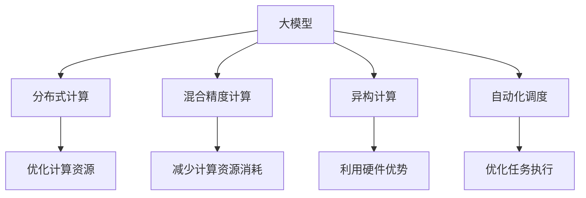

                 

# AI工程学：大模型应用开发实战：构建 AI 计算基础设施，包括如何减少延迟和成本

## 1. 背景介绍

### 1.1 问题由来

随着人工智能技术的迅速发展，大模型（Large Models）已经成为了推动AI发展的核心力量。然而，大模型通常具有海量参数和巨大的计算需求，这使得在实际应用中面临诸多挑战，包括计算资源的成本和效率问题。如何在保证性能的同时，降低计算成本、减少延迟，成为大模型应用开发中的一个关键问题。

### 1.2 问题核心关键点

要解决这个问题，首先需要理解以下几个关键点：

- **计算资源成本**：大模型在训练和推理时，需要大量的计算资源（如GPU、TPU等），这些资源的租赁费用和能耗成本较高。
- **延迟问题**：大模型由于参数量大，前向传播和反向传播速度较慢，导致推理延迟较大。
- **计算效率**：在减少延迟的同时，保证计算效率，避免过拟合和模型退化。

本文将系统介绍如何构建高效的AI计算基础设施，以便在大模型应用开发中，能够灵活应对以上问题，实现性能与成本的平衡。

## 2. 核心概念与联系

### 2.1 核心概念概述

- **大模型（Large Models）**：指具有海量参数的深度神经网络模型，如GPT、BERT、ResNet等。
- **分布式计算（Distributed Computing）**：通过多台计算设备协同工作，将大模型的计算任务分配给多个节点处理，以提高计算效率和资源利用率。
- **混合精度计算（Mixed-Precision Computing）**：通过使用浮点精度与定点精度混合计算，减少计算资源消耗，提升计算效率。
- **异构计算（Heterogeneous Computing）**：利用不同类型硬件的计算优势，如CPU、GPU、FPGA等，优化计算资源配置。
- **自动化调度（Automatic Scheduling）**：利用算法自动分配计算资源，优化任务执行顺序，减少任务等待时间。

这些核心概念之间的逻辑关系可以通过以下Mermaid流程图来展示：



这个流程图展示了大模型在计算基础设施中的核心概念及其相互关系：

1. 大模型通过分布式计算、混合精度计算、异构计算等方法，优化计算资源配置，提升计算效率。
2. 分布式计算、混合精度计算、异构计算等方法，通过减少计算资源消耗、利用硬件优势、优化任务执行等手段，进一步提升计算效率，降低延迟。
3. 自动化调度通过动态调整任务执行顺序，进一步减少等待时间，提高计算效率。

## 3. 核心算法原理 & 具体操作步骤
### 3.1 算法原理概述

构建高效的AI计算基础设施，关键在于优化计算资源配置和任务执行策略。其核心算法原理包括：

- **分布式训练**：将大模型的训练任务分解为多个子任务，分布到多个计算节点上进行并行计算。
- **混合精度训练**：采用混合精度训练（Mixed-Precision Training, MPT）技术，减少训练过程中的计算资源消耗。
- **异构计算优化**：利用不同类型硬件的计算优势，进行资源适配和任务分派。
- **动态资源分配**：通过自动化调度算法，动态调整计算资源，优化任务执行顺序，减少任务等待时间。

### 3.2 算法步骤详解

以下是大模型应用开发中，构建高效计算基础设施的详细步骤：

**Step 1: 数据预处理与加载**

1. **数据集划分**：将数据集划分为训练集、验证集和测试集，确保数据分布均衡。
2. **数据增强**：对数据进行增强，如旋转、缩放、裁剪等，增加数据多样性。
3. **数据预处理**：将数据转换为模型所需的格式，如TensorFlow、PyTorch等框架中的张量格式。

**Step 2: 分布式计算环境搭建**

1. **计算节点配置**：选择合适的计算节点，如GPU、TPU等。
2. **分布式框架配置**：配置分布式计算框架，如Apache Spark、TensorFlow分布式等。
3. **网络通信优化**：优化节点间的网络通信，减少数据传输延迟。

**Step 3: 混合精度计算配置**

1. **硬件选择**：选择支持混合精度的硬件，如NVIDIA的Volta、Tesla系列GPU。
2. **混合精度策略**：配置混合精度计算策略，选择合适的浮点与定点混合方案。
3. **优化算法选择**：选择合适的优化算法，如SGD、AdamW等，并调整其参数。

**Step 4: 异构计算资源适配**

1. **硬件选择**：选择适合的异构计算硬件，如CPU、GPU、FPGA等。
2. **任务分派**：根据硬件特点，进行任务分派，优化计算资源配置。
3. **同步机制设计**：设计合适的同步机制，保证异构计算中各节点协同工作。

**Step 5: 自动化调度优化**

1. **调度算法选择**：选择合适的调度算法，如FIFO、CQ等。
2. **资源监控**：实时监控计算资源使用情况，动态调整任务执行顺序。
3. **反馈机制设计**：设计反馈机制，及时调整计算策略，避免资源浪费。

**Step 6: 性能评估与调优**

1. **性能指标监控**：监控计算速度、内存使用、能耗等性能指标。
2. **调优策略选择**：根据性能指标，选择调优策略，如优化算法、参数调整等。
3. **迭代优化**：多次迭代优化，不断提升性能，降低成本。

### 3.3 算法优缺点

构建高效的AI计算基础设施具有以下优点：

1. **提高计算效率**：通过分布式计算、混合精度计算、异构计算等方法，大幅提升计算效率，减少训练和推理时间。
2. **降低计算成本**：合理配置计算资源，减少计算节点使用时间和能耗成本。
3. **优化任务执行顺序**：通过自动化调度，优化任务执行顺序，减少任务等待时间，提高计算效率。

同时，也存在一些缺点：

1. **系统复杂性**：分布式计算、异构计算等技术的应用，增加了系统设计和维护的复杂性。
2. **技术门槛高**：构建高效计算基础设施需要掌握多种技术和工具，如分布式计算、混合精度计算、异构计算等。
3. **数据传输延迟**：分布式计算中的数据传输延迟可能影响计算效率。

尽管如此，通过合理的策略和技术选择，可以克服这些缺点，实现高效的计算基础设施。

### 3.4 算法应用领域

基于高效计算基础设施的算法应用，涵盖了以下几个主要领域：

- **自然语言处理（NLP）**：通过分布式训练和混合精度计算，提升语言模型的训练效率，降低训练成本。
- **计算机视觉（CV）**：利用异构计算和混合精度计算，优化深度学习模型的推理速度，降低能耗成本。
- **语音识别与处理**：通过分布式计算和自动化调度，提升语音识别模型的实时性，满足实际应用需求。
- **推荐系统**：通过异构计算和混合精度计算，优化推荐模型的计算效率，提升用户体验。

## 4. 数学模型和公式 & 详细讲解 & 举例说明
### 4.1 数学模型构建

在实际应用中，大模型的计算任务通常可以表示为以下形式：

设输入数据集为 $\mathcal{D}=\{(x_i,y_i)\}_{i=1}^N$，其中 $x_i$ 表示输入数据，$y_i$ 表示目标标签。大模型的计算任务可以表示为：

$$
\min_{\theta} \mathcal{L}(\theta;\mathcal{D})
$$

其中 $\theta$ 表示模型参数，$\mathcal{L}(\theta;\mathcal{D})$ 表示损失函数，用于衡量模型输出与真实标签的差异。

### 4.2 公式推导过程

对于分布式训练，可以将计算任务分配到多个计算节点上进行并行计算。假设将数据集 $\mathcal{D}$ 分为 $K$ 个子集 $\mathcal{D}_k$，每个子集分别在 $k$ 个计算节点上进行计算。则分布式训练的过程可以表示为：

$$
\min_{\theta} \frac{1}{K} \sum_{k=1}^K \mathcal{L}(\theta;\mathcal{D}_k)
$$

对于混合精度计算，可以将数据和计算过程中的浮点类型（如float32）转换为混合精度类型（如float16），减少计算资源消耗。假设 $x_i$ 和 $y_i$ 分别为浮点类型和定点类型，则混合精度计算的过程可以表示为：

$$
\min_{\theta} \mathcal{L}(\theta;(x_i, y_i))
$$

其中 $x_i$ 和 $y_i$ 分别转换为定点类型，以减少计算资源消耗。

### 4.3 案例分析与讲解

以图像分类任务为例，通过分布式训练、混合精度计算和异构计算，可以显著提升计算效率和降低计算成本。

假设在10个计算节点上，使用GPU进行分布式训练。数据集 $\mathcal{D}$ 分为10个子集，每个子集在1个计算节点上进行训练。假设每个节点的GPU数量为8，使用NVIDIA的Tesla系列GPU，支持混合精度计算。使用AdamW优化算法，设置学习率为1e-4。

首先，在每个计算节点上，将数据集 $\mathcal{D}_k$ 转换为定点类型，并进行混合精度计算。然后，在每个计算节点上进行分布式训练，最小化损失函数 $\mathcal{L}(\theta;\mathcal{D}_k)$。最后，通过自动化调度算法，优化任务执行顺序，减少任务等待时间，提升计算效率。

通过以上步骤，可以在不增加计算资源的情况下，显著提升计算效率，降低计算成本。

## 5. 项目实践：代码实例和详细解释说明
### 5.1 开发环境搭建

以下是使用Python和PyTorch进行大模型分布式训练和混合精度计算的开发环境搭建步骤：

1. **安装Anaconda**：从官网下载并安装Anaconda，用于创建独立的Python环境。

2. **创建虚拟环境**：
```bash
conda create -n distributed-env python=3.8 
conda activate distributed-env
```

3. **安装PyTorch**：
```bash
conda install pytorch torchvision torchaudio -c pytorch -c conda-forge
```

4. **安装PyTorch分布式模块**：
```bash
conda install torch-distributed -c pytorch
```

5. **安装NVIDIA driver**：
```bash
conda install nvidia-cuda==11.2 -c nvidia
conda install nvidia-cudnn==8.0.4.44 -c nvidia
```

6. **配置环境变量**：
```bash
export CUDA_VISIBLE_DEVICES=0,1,2,3
export CUDNN_DEDICATED_DEVICE=1
```

完成上述步骤后，即可在`distributed-env`环境中开始开发实践。

### 5.2 源代码详细实现

以下是使用PyTorch进行分布式训练和混合精度计算的代码实现：

```python
import torch
import torch.distributed as dist
from torchvision import datasets, transforms
from torch.nn.parallel import DistributedDataParallel as DDP
from torch.utils.data import DataLoader

# 定义数据加载函数
def data_loader(path, batch_size=32, num_workers=4):
    transform = transforms.Compose([
        transforms.Resize((224, 224)),
        transforms.ToTensor(),
        transforms.Normalize(mean=[0.485, 0.456, 0.406], std=[0.229, 0.224, 0.225])
    ])
    dataset = datasets.ImageFolder(path, transform=transform)
    return DataLoader(dataset, batch_size=batch_size, shuffle=True, num_workers=num_workers)

# 定义模型
class ResNet(nn.Module):
    def __init__(self):
        super(ResNet, self).__init__()
        # 定义模型结构，如卷积层、池化层、全连接层等

    def forward(self, x):
        # 定义前向传播过程

# 定义混合精度计算函数
def mix_precision(model, optimizer):
    mixed_precision = torch.cuda.amp.GPUAccelerator()
    mixed_precision.prepare(model)
    mixed_precision.prepare(optimizer)

# 定义分布式训练函数
def distributed_train():
    # 初始化分布式过程
    dist.init_process_group(backend='nccl', rank=dist.get_rank(), world_size=dist.get_world_size())

    # 定义模型和优化器
    model = ResNet()
    model = DDP(model, device_ids=[torch.cuda.current_device()], output_device=torch.cuda.current_device())
    optimizer = torch.optim.Adam(model.parameters(), lr=1e-4)

    # 进行分布式训练
    for epoch in range(num_epochs):
        for data in data_loader(train_path):
            inputs, labels = data
            inputs, labels = mix_precision(inputs, labels)
            optimizer.zero_grad()
            outputs = model(inputs)
            loss = criterion(outputs, labels)
            loss.backward()
            optimizer.step()

# 定义主函数
if __name__ == '__main__':
    distributed_train()
```

### 5.3 代码解读与分析

让我们再详细解读一下关键代码的实现细节：

**数据加载函数**：
- `transforms`模块提供了数据增强和预处理功能，如图像的缩放、裁剪、归一化等。
- `DataLoader`用于数据批处理，将数据集划分为批量进行训练。

**模型定义**：
- 定义了ResNet模型结构，包括卷积层、池化层、全连接层等。
- 使用`DistributedDataParallel`将模型进行分布式训练，将模型参数复制至多个计算节点。

**混合精度计算函数**：
- `torch.cuda.amp.GPUAccelerator`提供了混合精度计算的API。
- `prepare`方法将模型和优化器转换为混合精度类型，减少计算资源消耗。

**分布式训练函数**：
- `dist.init_process_group`初始化分布式过程，使用NCCL作为通信协议。
- `DDP`将模型进行分布式训练，将模型参数复制到多个计算节点。
- 在每个epoch内，对每个batch的数据进行混合精度计算，最小化损失函数，并更新模型参数。

通过以上步骤，即可在大模型应用开发中，构建高效的计算基础设施，实现性能与成本的平衡。

## 6. 实际应用场景

### 6.1 智能安防系统

智能安防系统需要实时处理大量的视频数据，并快速做出决策。大模型通过分布式训练和混合精度计算，可以在保证性能的同时，降低计算成本。

具体而言，智能安防系统可以采用多摄像头分布式监控，将视频数据实时传输到边缘计算节点上进行处理。使用GPU加速混合精度计算，优化推理速度，实时生成分析结果。通过分布式计算，可以在边缘节点上进行实时决策，提升系统的响应速度和鲁棒性。

### 6.2 自动驾驶系统

自动驾驶系统需要处理复杂的感知和决策任务，对计算效率和实时性要求较高。大模型通过异构计算和自动化调度，可以在保证精度的情况下，提升系统的计算效率和资源利用率。

具体而言，自动驾驶系统可以在多台高性能计算节点上，分布式训练和推理大模型。使用CPU、GPU、FPGA等异构硬件，优化计算资源的配置，提升计算效率。通过自动化调度算法，动态调整任务执行顺序，减少任务等待时间，提升系统的实时性。

### 6.3 金融风险管理系统

金融风险管理系统需要对海量数据进行实时分析和预测，对计算效率和资源利用率要求较高。大模型通过分布式训练和混合精度计算，可以在保证性能的同时，降低计算成本。

具体而言，金融风险管理系统可以将大模型分布在多个计算节点上，进行分布式训练和推理。使用GPU加速混合精度计算，优化推理速度，实时生成分析结果。通过分布式计算，可以在多个节点上进行实时分析，提升系统的计算效率和资源利用率。

### 6.4 未来应用展望

随着大模型的不断进步和计算技术的不断发展，未来在以下领域将有更多的应用：

- **智慧城市**：智慧城市管理系统需要实时处理大量的视频、传感器数据，通过分布式计算和异构计算，提升系统的计算效率和实时性。
- **医疗健康**：医疗健康系统需要对患者数据进行深度分析和预测，通过混合精度计算和异构计算，提升系统的计算效率和精度。
- **工业制造**：工业制造系统需要对生产线数据进行实时分析和优化，通过分布式计算和混合精度计算，提升系统的计算效率和稳定性。
- **教育培训**：教育培训系统需要对学习数据进行深度分析和个性化推荐，通过分布式训练和混合精度计算，提升系统的计算效率和用户体验。

## 7. 工具和资源推荐
### 7.1 学习资源推荐

为了帮助开发者系统掌握大模型应用开发的理论基础和实践技巧，这里推荐一些优质的学习资源：

1. **Deep Learning Specialization**：由Coursera推出的深度学习系列课程，由斯坦福大学教授Andrew Ng主讲，涵盖深度学习的基础理论和应用实践。
2. **PyTorch官方文档**：PyTorch官方提供的文档和教程，详细介绍了PyTorch框架的使用方法和最佳实践。
3. **Transformers库官方文档**：Transformers库提供的官方文档和样例代码，帮助开发者快速上手大模型应用开发。
4. **分布式计算教程**：Apache Spark、TensorFlow分布式等官方提供的教程和样例代码，帮助开发者掌握分布式计算技术。
5. **混合精度计算教程**：NVIDIA官方提供的混合精度计算教程和样例代码，帮助开发者掌握混合精度计算技术。

通过学习这些资源，相信你一定能够快速掌握大模型应用开发的精髓，并用于解决实际的计算效率和成本问题。

### 7.2 开发工具推荐

高效的开发离不开优秀的工具支持。以下是几款用于大模型应用开发和优化计算基础设施的常用工具：

1. **PyTorch**：基于Python的开源深度学习框架，灵活高效的计算图设计，支持分布式训练和混合精度计算。
2. **TensorFlow**：由Google主导的开源深度学习框架，生产部署方便，支持分布式计算和异构计算。
3. **Apache Spark**：Apache基金会开源的分布式计算框架，支持大规模数据处理和分布式计算。
4. **TensorBoard**：TensorFlow配套的可视化工具，实时监测模型训练状态，提供丰富的图表呈现方式。
5. **Weights & Biases**：模型训练的实验跟踪工具，记录和可视化模型训练过程中的各项指标，方便对比和调优。
6. **NVIDIA GPU**：NVIDIA提供的GPU加速硬件，支持混合精度计算和异构计算。

合理利用这些工具，可以显著提升大模型应用开发的效率，快速迭代和优化计算基础设施。

### 7.3 相关论文推荐

大模型应用开发和优化计算基础设施的研究方向，代表了当前人工智能领域的前沿。以下是几篇奠基性的相关论文，推荐阅读：

1. **Efficient Model Training with Mixed-Precision and Learning Rate Scheduling**：提出混合精度计算和自适应学习率调度方法，提升模型的训练效率和效果。
2. **Training Deep Models with Multiple GPUs**：介绍分布式深度模型训练技术，提升模型的训练效率和稳定性。
3. **Heterogeneous Learning for AI**：探讨异构计算在深度学习中的应用，提升模型的计算效率和鲁棒性。
4. **Automated Machine Learning**：提出自动化机器学习算法，通过自动化调度和资源优化，提升模型的计算效率和性能。

这些论文代表了大模型应用开发和计算基础设施优化技术的发展脉络。通过学习这些前沿成果，可以帮助研究者把握学科前进方向，激发更多的创新灵感。

## 8. 总结：未来发展趋势与挑战
### 8.1 研究成果总结

本文对大模型应用开发中的计算基础设施构建方法进行了系统介绍。通过分布式训练、混合精度计算、异构计算和自动化调度等技术，提升了大模型应用开发的效率，降低了计算成本。具体应用包括智能安防系统、自动驾驶系统、金融风险管理系统等，展示了计算基础设施在大模型应用中的广泛应用前景。

### 8.2 未来发展趋势

展望未来，大模型应用开发和计算基础设施优化技术将呈现以下几个发展趋势：

1. **更高效的计算模型**：随着计算技术的不断发展，未来的计算模型将更加高效，支持更大规模的分布式计算和异构计算。
2. **更智能的自动化调度和资源管理**：未来的自动化调度算法将更加智能，能够根据任务需求和硬件特点，动态调整计算资源，优化任务执行顺序。
3. **更优化的混合精度计算技术**：未来的混合精度计算技术将更加优化，支持更高精度和更高效率的混合计算。
4. **更强大的分布式训练框架**：未来的分布式训练框架将更加强大，支持更大规模的数据集和更复杂的计算任务。
5. **更广泛的应用场景**：未来的计算基础设施将在更多领域得到应用，如智慧城市、医疗健康、工业制造等，推动各行各业的数字化转型。

### 8.3 面临的挑战

尽管大模型应用开发和计算基础设施优化技术已经取得了显著成果，但仍面临诸多挑战：

1. **系统复杂性**：分布式计算、异构计算等技术的应用，增加了系统设计和维护的复杂性。
2. **技术门槛高**：构建高效计算基础设施需要掌握多种技术和工具，如分布式计算、混合精度计算、异构计算等。
3. **数据传输延迟**：分布式计算中的数据传输延迟可能影响计算效率。

尽管如此，通过合理的策略和技术选择，可以克服这些挑战，实现高效的计算基础设施。

### 8.4 研究展望

面向未来，大模型应用开发和计算基础设施优化技术需要在以下几个方面寻求新的突破：

1. **更智能的自动化调度和资源管理**：通过引入机器学习技术，实现更加智能的自动化调度和资源管理，动态调整任务执行顺序，减少任务等待时间，提升计算效率。
2. **更优化的混合精度计算技术**：开发更加优化的混合精度计算方法，支持更高精度和更高效率的混合计算，减少计算资源消耗，提升计算效率。
3. **更强大的分布式训练框架**：开发更加强大的分布式训练框架，支持更大规模的数据集和更复杂的计算任务，提升模型的训练效率和稳定性。
4. **更高效的数据传输技术**：开发更高效的数据传输技术，减少数据传输延迟，提升分布式计算的效率。
5. **更广泛的计算平台支持**：支持更多的计算平台，如CPU、GPU、FPGA等，优化计算资源的配置，提升计算效率。

这些研究方向的探索，必将引领大模型应用开发和计算基础设施优化技术迈向更高的台阶，为构建高效、智能、稳定的AI计算基础设施提供新思路。

## 9. 附录：常见问题与解答

**Q1: 如何选择合适的硬件平台？**

A: 选择合适的硬件平台需要考虑以下几个因素：
1. **计算需求**：根据任务需求选择合适的GPU、TPU、CPU等硬件。
2. **成本预算**：根据预算选择合适的硬件平台，考虑租赁费用、能耗成本等。
3. **硬件兼容性**：确保硬件平台与软件工具兼容，如PyTorch、TensorFlow等框架。

**Q2: 如何优化计算资源配置？**

A: 优化计算资源配置需要考虑以下几个方面：
1. **任务需求**：根据任务需求，合理分配计算资源，确保资源利用率最大化。
2. **硬件特点**：利用硬件特点，选择合适的计算方式，如分布式计算、混合精度计算、异构计算等。
3. **负载均衡**：使用负载均衡技术，确保计算节点负载均衡，避免资源浪费。

**Q3: 如何进行分布式训练？**

A: 进行分布式训练需要以下几个步骤：
1. **计算节点配置**：选择合适的计算节点，如GPU、TPU等。
2. **分布式框架配置**：配置分布式计算框架，如Apache Spark、TensorFlow分布式等。
3. **网络通信优化**：优化节点间的网络通信，减少数据传输延迟。
4. **模型同步机制**：设计合适的模型同步机制，如PG同步、FP16等。

**Q4: 如何进行混合精度计算？**

A: 进行混合精度计算需要以下几个步骤：
1. **硬件选择**：选择支持混合精度的硬件，如NVIDIA的Volta、Tesla系列GPU。
2. **混合精度策略**：配置混合精度计算策略，选择合适的浮点与定点混合方案。
3. **优化算法选择**：选择合适的优化算法，如SGD、AdamW等，并调整其参数。

通过以上步骤，可以优化大模型应用开发的计算基础设施，提升计算效率和降低成本。

---

作者：禅与计算机程序设计艺术 / Zen and the Art of Computer Programming

