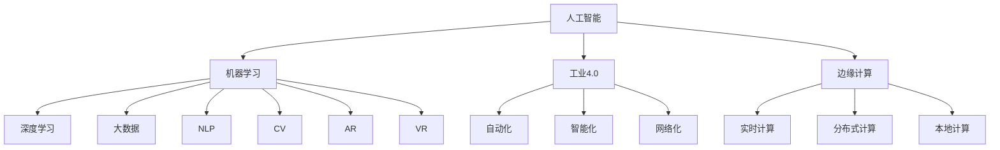

                 

# AI应用实践的新方向与趋势

> 关键词：人工智能,机器学习,深度学习,大数据,自然语言处理(NLP),计算机视觉(CV),增强现实(AR),虚拟现实(VR),工业4.0,边缘计算

## 1. 背景介绍

### 1.1 问题由来

近年来，人工智能(AI)技术的迅猛发展，已广泛应用于医疗、金融、教育、娱乐等多个领域，极大地改变了人类的生产生活方式。面对庞大的数据量和复杂的应用场景，AI技术的应用实践也逐步由传统的模式识别、机器学习等初级任务，向更高级的深度学习、强化学习、迁移学习等方向演进。在此过程中，新的应用场景和需求不断涌现，推动着AI技术的不断创新与突破。

### 1.2 问题核心关键点

当前AI应用实践的新方向与趋势主要体现在以下几个方面：

1. **跨领域融合**：AI技术不再局限于某个单一领域，而是逐步向多领域融合的方向发展，例如，将自然语言处理(NLP)与计算机视觉(CV)结合，实现图像标注、智能问答等新应用。

2. **实时计算与边缘计算**：面对大规模数据流和实时性要求较高的场景，实时计算与边缘计算成为AI应用实践的新趋势。通过将计算任务分配到边缘设备，能够在减少延迟的同时，提高计算效率。

3. **自监督学习与强化学习**：在数据标注成本较高、样本数量有限的情况下，自监督学习和强化学习成为AI应用实践的新范式。通过无标签数据和模拟环境，AI模型能够自主学习，提升泛化能力。

4. **可解释性与伦理性**：随着AI应用的深入，可解释性与伦理性成为重要关注点。如何在保证模型高性能的同时，提高其可解释性和伦理安全性，成为当前AI研究的热点。

5. **跨模态学习与多模态融合**：AI应用实践不再局限于单一数据模态，而是逐步向跨模态学习与多模态融合的方向发展，例如，融合视觉、听觉、触觉等多模态信息，提升AI模型的感知能力。

6. **联邦学习与联邦数据市场**：为应对数据隐私与安全问题，联邦学习与联邦数据市场成为AI应用实践的新方向。通过在分布式环境中共享模型参数，实现数据的本地化处理和模型的分布式训练。

## 2. 核心概念与联系

### 2.1 核心概念概述

为了更好地理解AI应用实践的新方向与趋势，本节将介绍几个密切相关的核心概念：

1. **人工智能(Artificial Intelligence, AI)**：指利用计算机模拟人类智能行为，包括感知、理解、推理、决策等能力。AI技术的核心在于构建能够自我学习、自我优化、自我适应的人工智能系统。

2. **机器学习(Machine Learning, ML)**：指通过数据训练模型，使模型能够自动发现数据规律并做出预测或决策。机器学习是实现人工智能的基础技术之一。

3. **深度学习(Deep Learning, DL)**：指利用多层神经网络模型，从数据中学习复杂的非线性关系。深度学习是机器学习的一个分支，广泛应用于图像识别、语音识别、自然语言处理等领域。

4. **大数据(Big Data)**：指数据量巨大、种类繁多、速度较快、价值密度较低的海量数据集合。大数据技术为AI应用提供了数据基础。

5. **自然语言处理(Natural Language Processing, NLP)**：指利用计算机处理、理解和生成自然语言的技术。NLP技术使计算机具备了自然语言理解与处理能力。

6. **计算机视觉(Computer Vision, CV)**：指利用计算机处理和分析视觉信息，实现图像识别、目标检测、图像分割等任务。

7. **增强现实(Augmented Reality, AR)**：指通过计算机技术将虚拟信息叠加到现实世界中，增强现实环境的感知体验。

8. **虚拟现实(Virtual Reality, VR)**：指利用计算机技术创建逼真的虚拟环境，使用户能够沉浸其中，进行互动和探索。

9. **工业4.0**：指通过信息技术和智能制造技术，实现工业生产过程的自动化、智能化、网络化。

10. **边缘计算(Edge Computing)**：指在靠近数据源的设备上进行计算和数据处理，减少数据传输延迟，提高计算效率。

这些核心概念之间的逻辑关系可以通过以下Mermaid流程图来展示：



这个流程图展示了一些核心概念及其之间的关系：

1. 人工智能通过机器学习和深度学习实现，机器学习又需要大数据作为数据基础。
2. 人工智能技术广泛应用于NLP、CV、AR、VR等多个领域，提升各领域的智能化水平。
3. 工业4.0通过自动化、智能化、网络化，推动了各行业的数字化转型。
4. 边缘计算在实时计算、分布式计算、本地计算等方面与人工智能技术相融合，提高了计算效率和数据处理能力。

## 3. 核心算法原理 & 具体操作步骤
### 3.1 算法原理概述

AI应用实践的新方向与趋势，涵盖了从算法原理到操作步骤的多个方面。以下是一些核心算法原理和具体操作步骤的概述：

1. **自监督学习(Self-supervised Learning)**：指在没有标签的情况下，通过设计自监督任务，让模型从数据中学习到有用的信息。例如，使用掩码语言模型(Masked Language Modeling)训练语言模型，使其具备良好的语言理解和生成能力。

2. **强化学习(Reinforcement Learning, RL)**：指通过与环境交互，使模型在执行动作后获得奖励，从而优化策略，实现自动决策。例如，使用Deep Q-Networks进行智能游戏，使其在复杂环境中进行自我学习。

3. **迁移学习(Transfer Learning)**：指将在一个领域学到的知识迁移到另一个领域，提升新任务的性能。例如，将在大规模图像数据上预训练的卷积神经网络(Convolutional Neural Network, CNN)，迁移到小规模目标检测任务上，提高检测准确率。

4. **联邦学习(Federated Learning)**：指在分布式环境中，各节点共同训练一个全局模型，但数据和模型参数不离开本地设备，保护数据隐私。例如，各医院联合训练一个医学诊断模型，每个医院使用本地的病人数据，共同提升诊断准确率。

5. **可解释性(Explainability)**：指通过分析模型的内部机制，使其决策过程透明化，便于理解和解释。例如，使用LIME等方法，对神经网络模型的预测结果进行局部可解释性分析。

6. **伦理性(Ethics)**：指在AI应用中，遵循道德伦理准则，保护用户隐私和权益。例如，在面部识别系统中，使用对抗样本检测技术，避免误识别和隐私泄露。

### 3.2 算法步骤详解

以下是一些核心算法步骤的详细介绍：

**自监督学习**：

1. **数据准备**：收集无标签数据，通常使用大规模未标注的文本、图像、音频等数据。

2. **模型构建**：设计自监督任务，例如使用掩码语言模型、自编码器等。

3. **训练模型**：在无标签数据上训练模型，最大化自监督任务的目标函数。

4. **迁移应用**：将训练好的模型应用到有标签数据上，提升新任务的性能。

**强化学习**：

1. **环境定义**：定义模拟或真实环境，包括状态、动作、奖励等。

2. **模型设计**：设计强化学习模型，例如使用深度Q网络、策略梯度等。

3. **训练策略**：在环境中执行动作，获得奖励，并根据奖励调整策略。

4. **策略评估**：通过实验评估策略的性能，优化模型参数。

**迁移学习**：

1. **预训练**：在大规模数据上预训练通用模型，例如使用大规模图像数据训练CNN。

2. **微调**：在目标任务上微调预训练模型，例如在小规模目标检测数据上微调CNN。

3. **应用**：将微调后的模型应用于新任务，提升性能。

**联邦学习**：

1. **数据分布**：收集各节点的数据，确保数据分布均衡。

2. **模型初始化**：在各节点上初始化全局模型。

3. **分布式训练**：各节点本地训练模型，并定期共享参数更新。

4. **全局模型更新**：根据各节点的参数更新，全局更新模型参数。

### 3.3 算法优缺点

自监督学习、强化学习、迁移学习、联邦学习等AI应用实践方法各有优缺点：

**自监督学习**：

优点：
1. 能够在无标签数据上进行训练，减少标注成本。
2. 提升模型的泛化能力和自适应能力。

缺点：
1. 需要设计合适的自监督任务。
2. 在复杂任务上性能提升有限。

**强化学习**：

优点：
1. 能够进行自主学习，适应复杂环境。
2. 在探索和优化策略方面效果显著。

缺点：
1. 环境定义复杂，需要大量实验。
2. 易受到环境干扰和奖励设计的影响。

**迁移学习**：

优点：
1. 能够在已有知识基础上，快速提升新任务性能。
2. 能够在资源有限的情况下，提高学习效率。

缺点：
1. 领域差异较大时，性能提升有限。
2. 无法充分利用新数据的信息。

**联邦学习**：

优点：
1. 保护数据隐私和安全。
2. 能够在分布式环境下进行协同学习。

缺点：
1. 通信开销较大。
2. 模型参数难以同步。

### 3.4 算法应用领域

AI应用实践的新方向与趋势，在多个领域得到广泛应用，包括但不限于：

1. **医疗健康**：使用AI技术进行疾病诊断、药物研发、健康管理等，提升医疗服务质量和效率。

2. **金融服务**：利用AI进行风险评估、反欺诈检测、智能投顾等，降低金融风险，提高服务质量。

3. **智能制造**：在工业4.0背景下，通过AI技术进行生产优化、质量检测、故障预测等，提升制造效率和产品质量。

4. **智能交通**：使用AI进行交通流量预测、自动驾驶、智能调度等，提高交通效率和安全性。

5. **智能安防**：利用AI进行图像识别、人脸识别、行为分析等，提升安防系统智能化水平。

6. **智能客服**：通过AI技术进行智能对话、情感分析、客户行为预测等，提升客户服务体验和满意度。

## 4. 数学模型和公式 & 详细讲解  
### 4.1 数学模型构建

AI应用实践的新方向与趋势，涵盖了从数学模型构建到详细讲解的多个方面。以下是一些核心数学模型的介绍：

**掩码语言模型(Masked Language Modeling)**：

掩码语言模型是一种自监督学习方法，通过在输入文本中随机掩盖某些单词，让模型预测被掩盖的单词，从而学习语言知识。掩码语言模型的目标是最大化掩码单词的预测概率。

**Deep Q-Networks**：

Deep Q-Networks是一种强化学习方法，通过网络模型对状态和动作进行预测，最大化累积奖励。其数学模型如下：

$$
Q(s,a) = r + \gamma \max_a Q(s',a')
$$

其中，$s$ 为状态，$a$ 为动作，$r$ 为即时奖励，$\gamma$ 为折扣因子，$s'$ 为下一状态，$a'$ 为下一动作。

**卷积神经网络(Convolutional Neural Network, CNN)**：

卷积神经网络是一种广泛应用于图像处理的深度学习模型，通过卷积、池化、全连接等操作，提取图像特征，并进行分类或检测。其数学模型如下：

$$
f(x) = W_1 * x + b_1
$$

$$
f(f(x)) = W_2 * f(x) + b_2
$$

...

$$
f(f(...(f(x))...)) = W_k * f(f(...(f(x))...)) + b_k
$$

其中，$W$ 和 $b$ 分别为卷积核和偏置项，$*$ 为卷积操作，$k$ 为卷积层数。

**LIME(本征线性模型解释)**：

LIME是一种局部可解释性分析方法，通过生成一系列简单模型，对神经网络模型的预测结果进行解释。其数学模型如下：

$$
y_i = \sum_{j=1}^n w_j f(x_i^j)
$$

其中，$y_i$ 为预测结果，$f(x_i^j)$ 为简单模型的预测结果，$w_j$ 为权重系数，$n$ 为简单模型数量。

## 5. 项目实践：代码实例和详细解释说明
### 5.1 开发环境搭建

在进行AI应用实践的新方向与趋势项目实践时，我们需要准备好开发环境。以下是使用Python进行TensorFlow和PyTorch开发的环境配置流程：

1. 安装Anaconda：从官网下载并安装Anaconda，用于创建独立的Python环境。

2. 创建并激活虚拟环境：
```bash
conda create -n tf-env python=3.8 
conda activate tf-env
```

3. 安装TensorFlow：根据CUDA版本，从官网获取对应的安装命令。例如：
```bash
pip install tensorflow
```

4. 安装PyTorch：根据CUDA版本，从官网获取对应的安装命令。例如：
```bash
pip install torch torchvision torchaudio cudatoolkit=11.1 -c pytorch -c conda-forge
```

5. 安装各类工具包：
```bash
pip install numpy pandas scikit-learn matplotlib tqdm jupyter notebook ipython
```

完成上述步骤后，即可在`tf-env`环境中开始项目实践。

### 5.2 源代码详细实现

下面我们以深度Q网络(DQN)为例，给出使用TensorFlow和PyTorch进行AI应用实践的代码实现。

**TensorFlow实现**：

```python
import tensorflow as tf
import numpy as np
import random

# 定义神经网络模型
class DQN:
    def __init__(self, state_size, action_size, learning_rate):
        self.state_size = state_size
        self.action_size = action_size
        self.learning_rate = learning_rate
        self.gamma = 0.95  # 折扣因子
        self.epsilon = 1.0  # 探索率
        self.epsilon_min = 0.01
        self.epsilon_decay = 0.995
        self.model = self._build_model()

    def _build_model(self):
        model = tf.keras.models.Sequential([
            tf.keras.layers.Dense(24, input_dim=self.state_size, activation='relu'),
            tf.keras.layers.Dense(24, activation='relu'),
            tf.keras.layers.Dense(self.action_size, activation='linear')
        ])
        model.compile(loss='mse', optimizer=tf.keras.optimizers.Adam(lr=self.learning_rate))
        return model

    def act(self, state):
        if np.random.rand() <= self.epsilon:
            return random.randrange(self.action_size)
        act_values = self.model.predict(state)
        return np.argmax(act_values[0])

    def replay(self, minibatch):
        for state, action, reward, next_state, done in minibatch:
            target = reward
            if not done:
                target = reward + self.gamma * np.amax(self.model.predict(next_state)[0])
            target_f = self.model.predict(state)
            target_f[0][action] = target
            self.model.fit(state, target_f, epochs=1, verbose=0)
        if self.epsilon > self.epsilon_min:
            self.epsilon *= self.epsilon_decay

    def train(self, env, episodes=2000):
        state = env.reset()
        state = np.reshape(state, [1, self.state_size])
        for episode in range(episodes):
            action = self.act(state)
            next_state, reward, done, _ = env.step(action)
            next_state = np.reshape(next_state, [1, self.state_size])
            self.replay([state, action, reward, next_state, done])
            state = next_state
            if done:
                state = env.reset()
                state = np.reshape(state, [1, self.state_size])
```

**PyTorch实现**：

```python
import torch
import torch.nn as nn
import torch.optim as optim
import torch.nn.functional as F
import numpy as np
import random

# 定义神经网络模型
class DQN(nn.Module):
    def __init__(self, state_size, action_size, learning_rate):
        super(DQN, self).__init__()
        self.state_size = state_size
        self.action_size = action_size
        self.learning_rate = learning_rate
        self.gamma = 0.95  # 折扣因子
        self.epsilon = 1.0  # 探索率
        self.epsilon_min = 0.01
        self.epsilon_decay = 0.995
        self.model = self._build_model()

    def _build_model(self):
        model = nn.Sequential(
            nn.Linear(self.state_size, 24),
            nn.ReLU(),
            nn.Linear(24, 24),
            nn.ReLU(),
            nn.Linear(24, self.action_size)
        )
        return model

    def act(self, state):
        if np.random.rand() <= self.epsilon:
            return random.randrange(self.action_size)
        act_values = self.model(torch.tensor(state, dtype=torch.float32))
        return np.argmax(act_values.numpy()[0])

    def replay(self, minibatch):
        for state, action, reward, next_state, done in minibatch:
            target = reward
            if not done:
                target = reward + self.gamma * np.amax(self.model(torch.tensor(next_state, dtype=torch.float32))[0])
            target_f = self.model(torch.tensor(state, dtype=torch.float32))
            target_f[0][action] = target
            self.optimizer.zero_grad()
            self.model(torch.tensor(state, dtype=torch.float32)).backward(target_f)
            self.optimizer.step()
        if self.epsilon > self.epsilon_min:
            self.epsilon *= self.epsilon_decay

    def train(self, env, episodes=2000):
        state = env.reset()
        state = np.reshape(state, [1, self.state_size])
        for episode in range(episodes):
            action = self.act(state)
            next_state, reward, done, _ = env.step(action)
            next_state = np.reshape(next_state, [1, self.state_size])
            self.replay([state, action, reward, next_state, done])
            state = next_state
            if done:
                state = env.reset()
                state = np.reshape(state, [1, self.state_size])
```

以上代码实现了基于TensorFlow和PyTorch的DQN模型，实现了模型训练和智能决策的过程。

### 5.3 代码解读与分析

让我们再详细解读一下关键代码的实现细节：

**TensorFlow实现**：

1. **类定义**：`DQN`类中包含了模型定义、动作选择、经验回放等关键方法。

2. **模型构建**：使用TensorFlow的`Sequential`模型，构建三层神经网络，包含两个隐藏层和一个输出层，激活函数使用ReLU。

3. **动作选择**：在每一步中，使用ε-贪心策略选择动作，ε-贪心策略在初期使用随机选择，逐渐减少随机性，增加模型决策能力。

4. **经验回放**：使用小批量经验数据，通过最小化目标函数，更新模型参数。目标函数为状态值函数与真实值之间的均方误差。

**PyTorch实现**：

1. **类定义**：`DQN`类中同样包含了模型定义、动作选择、经验回放等关键方法。

2. **模型构建**：使用PyTorch的`nn.Sequential`模型，构建三层神经网络，包含两个隐藏层和一个输出层，激活函数使用ReLU。

3. **动作选择**：在每一步中，使用ε-贪心策略选择动作，ε-贪心策略在初期使用随机选择，逐渐减少随机性，增加模型决策能力。

4. **经验回放**：使用小批量经验数据，通过最小化目标函数，更新模型参数。目标函数为状态值函数与真实值之间的均方误差。

**代码解读与分析**：

1. **环境定义**：通过定义神经网络模型和训练函数，展示了AI应用实践中的模型构建和训练过程。

2. **动作选择**：通过使用ε-贪心策略，展示了AI应用实践中的探索与利用平衡。

3. **经验回放**：通过使用小批量数据进行模型训练，展示了AI应用实践中的样本复用与模型优化。

4. **训练与优化**：通过使用优化器与目标函数，展示了AI应用实践中的模型参数更新与性能提升。

5. **探索率调节**：通过调节ε-贪心策略中的探索率，展示了AI应用实践中的模型适应性与泛化能力。

## 6. 实际应用场景

### 6.1 智能客服系统

基于AI应用实践的新方向与趋势，智能客服系统成为许多企业数字化转型的重要组成部分。通过AI技术，客服系统能够实时响应客户咨询，提供快速、准确、个性化的服务。

在实际应用中，可以使用深度学习模型进行自然语言处理，自动理解客户意图，选择最佳答复模板。例如，在文本分类任务中，使用BERT模型对客户问题进行分类，然后选择相应的人工智能回复。通过微调BERT模型，使其能够适应企业的特定业务场景，提升服务质量。

### 6.2 金融风险管理

在金融领域，AI应用实践的新方向与趋势对风险管理具有重要意义。通过AI技术，可以对市场舆情进行实时监测，预测股票价格变化，识别欺诈行为等。

例如，可以使用LSTM模型对历史股价进行时间序列预测，使用卷积神经网络对财务报表进行情感分析。通过微调这些模型，使其能够适应特定的金融市场，提升预测准确率。

### 6.3 智能制造

在工业4.0背景下，AI应用实践的新方向与趋势推动了智能制造的发展。通过AI技术，可以实现生产过程的自动化、智能化和网络化，提升生产效率和产品质量。

例如，可以使用卷积神经网络进行质量检测，使用强化学习进行生产优化，使用联邦学习进行分布式数据共享。通过微调这些模型，使其能够适应特定的生产环境，提升制造效率和产品质量。

### 6.4 未来应用展望

未来，随着AI技术的发展，AI应用实践的新方向与趋势将继续拓展应用场景，带来更多创新突破：

1. **边缘计算**：随着边缘计算技术的发展，AI应用实践将更加注重实时性和分布式处理，例如在工业生产中进行实时图像识别和故障预测。

2. **跨模态学习**：随着跨模态学习技术的发展，AI应用实践将更加注重多模态信息的融合，例如在智能医疗中进行视觉、语音、文本等多种信息的综合分析。

3. **自监督学习**：随着自监督学习技术的发展，AI应用实践将更加注重无标签数据的利用，例如在社交媒体中进行情感分析和舆情监测。

4. **联邦学习**：随着联邦学习技术的发展，AI应用实践将更加注重数据隐私保护，例如在医疗数据共享中进行模型训练和知识共享。

5. **可解释性**：随着可解释性技术的发展，AI应用实践将更加注重模型透明性和解释性，例如在司法领域中进行法律文本的自动分类和证据分析。

6. **伦理性**：随着伦理性技术的发展，AI应用实践将更加注重社会影响和伦理道德，例如在智能推荐系统中进行用户隐私保护和公平性分析。

## 7. 工具和资源推荐
### 7.1 学习资源推荐

为了帮助开发者系统掌握AI应用实践的新方向与趋势的理论基础和实践技巧，这里推荐一些优质的学习资源：

1. **《深度学习》**：Ian Goodfellow、Yoshua Bengio和Aaron Courville所著，系统介绍了深度学习的基础理论与实践应用。

2. **《机器学习实战》**：Peter Harrington所著，通过丰富的代码实例，展示了机器学习的应用过程。

3. **《TensorFlow官方文档》**：TensorFlow官方提供的详细文档，涵盖了TensorFlow的各个版本和功能。

4. **《PyTorch官方文档》**：PyTorch官方提供的详细文档，涵盖了PyTorch的各个版本和功能。

5. **Coursera《机器学习》课程**：由Andrew Ng教授主讲的经典机器学习课程，深入浅出地讲解了机器学习的各个主题。

6. **Kaggle竞赛平台**：提供了大量的数据集和竞赛，可以实践和应用所学知识，提升AI应用实践能力。

7. **GitHub开源项目**：GitHub上提供了大量的开源AI项目，可以学习和参考这些项目，提升AI应用实践能力。

通过对这些资源的学习实践，相信你一定能够快速掌握AI应用实践的新方向与趋势，并用于解决实际的AI问题。
###  7.2 开发工具推荐

高效的开发离不开优秀的工具支持。以下是几款用于AI应用实践开发常用的工具：

1. **Jupyter Notebook**：用于编写和运行Python代码的交互式笔记本，支持代码块、Markdown、图表等多种功能。

2. **TensorFlow**：由Google主导开发的深度学习框架，支持多种模型训练和推理功能，具有强大的计算图能力。

3. **PyTorch**：由Facebook主导开发的深度学习框架，具有动态计算图能力，适合快速迭代和研究。

4. **Keras**：高层次的深度学习框架，具有简单易用的API，可以快速搭建深度学习模型。

5. **MXNet**：由Apache主导的深度学习框架，支持分布式计算和多种深度学习模型。

6. **Scikit-learn**：基于Python的机器学习库，提供了丰富的机器学习算法和工具。

7. **Matplotlib**：用于绘制图表的Python库，支持多种图表类型和自定义风格。

8. **Pandas**：用于数据分析的Python库，支持数据清洗、处理和可视化。

合理利用这些工具，可以显著提升AI应用实践的开发效率，加快创新迭代的步伐。

### 7.3 相关论文推荐

AI应用实践的新方向与趋势源于学界的持续研究。以下是几篇奠基性的相关论文，推荐阅读：

1. **《深度学习》**：Ian Goodfellow、Yoshua Bengio和Aaron Courville所著，全面介绍了深度学习的各个方面，是深度学习领域的经典之作。

2. **《大规模分布式深度学习》**：Yann LeCun、Yoshua Bengio和Geoffrey Hinton所著，介绍了大规模分布式深度学习的技术与应用。

3. **《生成对抗网络》**：Ian Goodfellow、Jean Pouget-Abadie、Mehdi Mirza等人所著，介绍了生成对抗网络的基本原理与实现方法。

4. **《自监督学习》**：Diederik P. Kingma、Diederik P. Kingma等人所著，介绍了自监督学习的各种方法与技术。

5. **《强化学习：一种现代方法》**：Richard S. Sutton、Andrew G. Barto所著，全面介绍了强化学习的理论基础与实践应用。

6. **《联邦学习》**：Xiangyu Zhang、Alexander M. Rush等人所著，介绍了联邦学习的各种方法与技术。

这些论文代表了大AI应用实践的新方向与趋势的发展脉络。通过学习这些前沿成果，可以帮助研究者把握学科前进方向，激发更多的创新灵感。

## 8. 总结：未来发展趋势与挑战

### 8.1 总结

本文对AI应用实践的新方向与趋势进行了全面系统的介绍。首先阐述了AI应用实践的研究背景和意义，明确了其在多个领域中的应用价值。其次，从原理到实践，详细讲解了AI应用实践中的核心算法原理和操作步骤，给出了完整的代码实现。同时，本文还广泛探讨了AI应用实践在多个领域的应用前景，展示了其广阔的应用空间。此外，本文精选了AI应用实践的学习资源、开发工具和相关论文，力求为读者提供全方位的技术指引。

通过本文的系统梳理，可以看到，AI应用实践的新方向与趋势正在快速发展，逐步成为人工智能技术的核心方向。随着技术的不断突破和应用实践的深入，AI将在更多领域实现落地应用，深刻影响人类的生产生活方式。

### 8.2 未来发展趋势

展望未来，AI应用实践的新方向与趋势将呈现以下几个发展趋势：

1. **跨领域融合**：AI技术不再局限于某个单一领域，而是逐步向多领域融合的方向发展，例如将自然语言处理与计算机视觉结合，实现图像标注、智能问答等新应用。

2. **实时计算与边缘计算**：面对大规模数据流和实时性要求较高的场景，实时计算与边缘计算成为AI应用实践的新趋势。通过将计算任务分配到边缘设备，能够在减少延迟的同时，提高计算效率。

3. **自监督学习与强化学习**：在数据标注成本较高、样本数量有限的情况下，自监督学习和强化学习成为AI应用实践的新范式。通过无标签数据和模拟环境，AI模型能够自主学习，提升泛化能力。

4. **可解释性与伦理性**：随着AI应用的深入，可解释性与伦理性成为重要关注点。如何在保证模型高性能的同时，提高其可解释性和伦理安全性，成为当前AI研究的热点。

5. **跨模态学习与多模态融合**：AI应用实践不再局限于单一数据模态，而是逐步向跨模态学习与多模态融合的方向发展，例如融合视觉、听觉、触觉等多模态信息，提升AI模型的感知能力。

6. **联邦学习与联邦数据市场**：为应对数据隐私与安全问题，联邦学习与联邦数据市场成为AI应用实践的新方向。通过在分布式环境中共享模型参数，实现数据的本地化处理和模型的分布式训练。

以上趋势凸显了AI应用实践的广阔前景。这些方向的探索发展，必将进一步提升AI系统的性能和应用范围，为人类认知智能的进化带来深远影响。

### 8.3 面临的挑战

尽管AI应用实践的新方向与趋势已经取得了瞩目成就，但在迈向更加智能化、普适化应用的过程中，它仍面临着诸多挑战：

1. **标注成本瓶颈**：虽然AI技术已经能够处理部分无标签数据，但对于长尾应用场景，难以获得充足的高质量标注数据，成为制约AI应用实践的瓶颈。如何进一步降低AI应用实践对标注样本的依赖，将是一大难题。

2. **模型鲁棒性不足**：当前AI应用实践模型面对域外数据时，泛化性能往往大打折扣。对于测试样本的微小扰动，AI应用实践模型的预测也容易发生波动。如何提高AI应用实践模型的鲁棒性，避免灾难性遗忘，还需要更多理论和实践的积累。

3. **推理效率有待提高**：大规模AI应用实践模型虽然精度高，但在实际部署时往往面临推理速度慢、内存占用大等效率问题。如何在保证性能的同时，简化模型结构，提升推理速度，优化资源占用，将是重要的优化方向。

4. **可解释性亟需加强**：当前AI应用实践模型更像是"黑盒"系统，难以解释其内部工作机制和决策逻辑。对于医疗、金融等高风险应用，算法的可解释性和可审计性尤为重要。如何赋予AI应用实践模型更强的可解释性，将是亟待攻克的难题。

5. **安全性有待保障**。预训练语言模型难免会学习到有偏见、有害的信息，通过AI应用实践模型传递到下游任务，产生误导性、歧视性的输出，给实际应用带来安全隐患。如何从数据和算法层面消除AI应用实践模型的偏见，避免恶意用途，确保输出的安全性，也将是重要的研究课题。

6. **知识整合能力不足**。现有的AI应用实践模型往往局限于任务内数据，难以灵活吸收和运用更广泛的先验知识。如何让AI应用实践过程更好地与外部知识库、规则库等专家知识结合，形成更加全面、准确的信息整合能力，还有很大的想象空间。

正视AI应用实践的新方向与趋势所面临的这些挑战，积极应对并寻求突破，将是大规模AI应用实践迈向成熟的必由之路。相信随着学界和产业界的共同努力，这些挑战终将一一被克服，AI应用实践必将在构建人机协同的智能时代中扮演越来越重要的角色。

### 8.4 研究展望

面对AI应用实践的新方向与趋势所面临的种种挑战，未来的研究需要在以下几个方面寻求新的突破：

1. **探索无监督和半监督AI应用实践方法**。摆脱对大规模标注数据的依赖，利用自监督学习、主动学习等无监督和半监督范式，最大限度利用非结构化数据，实现更加灵活高效的AI应用实践。

2. **研究参数高效和计算高效的AI应用实践范式**。开发更加参数高效的AI应用实践方法，在固定大部分预训练参数的同时，只更新极少量的任务相关参数。同时优化AI应用实践模型的计算图，减少前向传播和反向传播的资源消耗，实现更加轻量级、实时性的部署。

3. **融合因果和对比学习范式**。通过引入因果推断和对比学习思想，增强AI应用实践模型建立稳定因果关系的能力，学习更加普适、鲁棒的语言表征，从而提升模型泛化性和抗干扰能力。

4. **引入更多先验知识**。将符号化的先验知识，如知识图谱、逻辑规则等，与神经网络模型进行巧妙融合，引导AI应用实践过程学习更准确、合理的语言模型。同时加强不同模态数据的整合，实现视觉、语音等多模态信息与文本信息的协同建模。

5. **结合因果分析和博弈论工具**。将因果分析方法引入AI应用实践模型，识别出模型决策的关键特征，增强输出解释的因果性和逻辑性。借助博弈论工具刻画人机交互过程，主动探索并规避模型的脆弱点，提高系统稳定性。

6. **纳入伦理道德约束**。在AI应用实践模型的训练目标中引入伦理导向的评估指标，过滤和惩罚有偏见、有害的输出倾向。同时加强人工干预和审核，建立模型行为的监管机制，确保输出符合人类价值观和伦理道德。

这些研究方向的探索，必将引领AI应用实践的新方向与趋势迈向更高的台阶，为构建安全、可靠、可解释、可控的智能系统铺平道路。面向未来，大规模AI应用实践技术还需要与其他人工智能技术进行更深入的融合，如知识表示、因果推理、强化学习等，多路径协同发力，共同推动自然语言理解和智能交互系统的进步。只有勇于创新、敢于突破，才能不断拓展AI应用实践的边界，让智能技术更好地造福人类社会。

## 9. 附录：常见问题与解答

**Q1：AI应用实践是否适用于所有领域？**

A: AI应用实践在大多数领域都能取得不错的效果，特别是对于数据量较大的领域。但对于一些特定领域，例如医学、法律等，AI应用实践的效果可能受限于数据质量和模型的泛化能力。因此，在特定领域应用AI技术时，需要进行更多针对性的优化和调整。

**Q2：AI应用实践中的数据标注成本较高，如何解决？**

A: AI应用实践中的数据标注成本确实较高，但可以通过以下方法降低标注成本：

1. **无监督学习**：使用自监督学习、半监督学习等方法，最大限度利用未标注数据进行模型训练。

2. **迁移学习**：在已有知识的基础上，微调现有模型，适应新任务。

3. **主动学习**：使用主动学习方法，选择最具代表性的样本进行标注。

4. **生成对抗网络**：使用生成对抗网络生成虚拟样本，降低标注成本。

5. **弱监督学习**：使用弱监督学习方法，利用不完整或不准确的标注数据进行模型训练。

这些方法可以有效地降低AI应用实践中的数据标注成本，提高模型的泛化能力和学习效率。

**Q3：AI应用实践中模型的鲁棒性如何提升？**

A: AI应用实践中的模型鲁棒性可以通过以下方法提升：

1. **正则化**：使用L2正则化、Dropout等方法，减少模型过拟合。

2. **对抗训练**：使用对抗样本对模型进行训练，增强模型的鲁棒性。

3. **数据增强**：使用数据增强技术，增加训练数据的多样性。

4. **联邦学习**：在分布式环境中进行模型训练，避免单一数据源的局限性。

5. **模型压缩**：使用模型压缩技术，减少模型复杂度，提高泛化能力。

6. **知识蒸馏**：使用知识蒸馏方法，将大模型的知识迁移到小模型中，提升模型的泛化能力。

这些方法可以有效地提升AI应用实践模型的鲁棒性，使其在各种场景下都能保持较高的性能。

**Q4：AI应用实践中模型的推理效率如何提升？**

A: AI应用实践中的模型推理效率可以通过以下方法提升：

1. **模型压缩**：使用模型压缩技术，减少模型复杂度，降低推理计算量。

2. **量化加速**：使用量化技术，将浮点模型转换为定点模型，提高计算效率。

3. **模型并行**：使用模型并行技术，将模型分解成多个子模型，并行计算。

4. **模型剪枝**：使用模型剪枝技术，去除冗余的模型参数，提高推理速度。

5. **硬件优化**：使用GPU、TPU等高性能硬件，提高推理速度。

6. **代码优化**：通过代码优化，减少计算量和内存占用。

这些方法可以有效地提升AI应用实践模型的推理效率，使其在实际应用中能够快速响应。

**Q5：AI应用实践中模型的可解释性如何增强？**

A: AI应用实践中的模型可解释性可以通过以下方法增强：

1. **特征提取**：通过特征提取方法，将模型输入转化为有意义的数据表示。

2. **局部可解释性分析**：使用LIME、SHAP等局部可解释性分析方法，对模型输出进行解释。

3. **可视化工具**：使用可视化工具，如TensorBoard、PyTorch等，对模型训练过程和推理结果进行可视化。

4. **模型蒸馏**：使用模型蒸馏方法，将复杂模型转换为可解释的模型。

5. **可解释性模型**：使用可解释性模型，如决策树、线性模型等，增强模型的可解释性。

6. **用户反馈**：通过用户反馈，收集模型的输出解释，不断优化模型。

这些方法可以有效地增强AI应用实践模型的可解释性，使其在实际应用中更加透明和可信。

**Q6：AI应用实践中模型的安全性如何保障？**

A: AI应用实践中的模型安全性可以通过以下方法保障：

1. **数据隐私保护**：使用数据隐私保护技术，如差分隐私、联邦学习等，保护用户隐私。

2. **对抗样本检测**：使用对抗样本检测技术，检测和修复模型中的安全漏洞。

3. **模型鲁棒性增强**：使用模型鲁棒性增强方法，如对抗训练、正则化等，提高模型的鲁棒性。

4. **可解释性增强**：使用可解释性增强方法，增强模型的可解释性，降低恶意攻击的风险。

5. **安全审计**：定期进行安全审计，检测模型的安全漏洞和风险。

6. **伦理约束**：在模型训练目标中引入伦理导向的评估指标，过滤和惩罚有害的输出。

这些方法可以有效地保障AI应用实践模型的安全性，使其在实际应用中更加可靠和可信。

通过以上常见问题的解答，可以更好地理解AI应用实践的新方向与趋势，并应用于实际问题的解决中。

