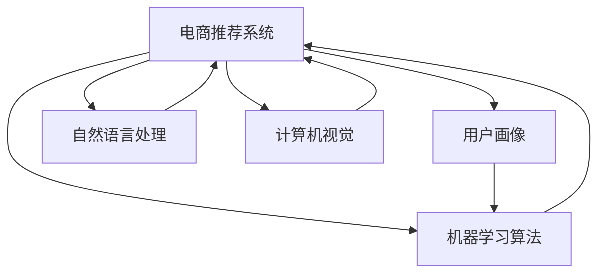

                 

## 1. 背景介绍

随着互联网的普及，电子商务（E-commerce）已成为人们日常生活的重要组成部分。用户通过电商平台进行购物，可以享受到更便捷、丰富的购物体验。而AI技术的应用，正在全面提升电商平台的用户体验，从商品推荐、客服聊天到支付验证，AI技术正在不断改变电商的方方面面。

AI技术在电商中的应用，主要分为两个方面：数据驱动和用户驱动。数据驱动是指通过大数据和机器学习算法对用户行为进行分析，从而提供个性化的购物建议和服务。用户驱动则是指利用自然语言处理（NLP）、计算机视觉（CV）等技术，与用户进行更自然、智能的交互。

然而，AI技术在电商中的应用也面临着诸多挑战。例如，如何在隐私保护与个性化服务之间找到平衡，如何避免算法偏见，如何提高AI系统的可解释性等。

本文将深入探讨AI技术在电商中的具体应用，并分析其在提升用户体验方面的潜力和挑战。

## 2. 核心概念与联系

### 2.1 核心概念概述

为更好地理解AI技术在电商中的应用，本节将介绍几个密切相关的核心概念：

- **电商推荐系统**：利用AI技术对用户行为进行分析，预测用户可能感兴趣的商品，并提供个性化的购物建议。推荐系统基于用户的浏览记录、购买历史、社交网络等信息，通过模型预测用户的兴趣，推荐相似或互补的商品。

- **用户画像（User Profile）**：电商平台通过用户行为数据，构建用户画像，包括用户的年龄、性别、地理位置、购买偏好等信息。用户画像是推荐系统的基础，通过画像识别用户需求，提供精准的推荐。

- **机器学习算法**：包括协同过滤、内容推荐、深度学习等算法，用于分析用户数据，挖掘用户行为模式，从而生成推荐结果。机器学习算法为推荐系统提供了技术支持，使其能够动态更新推荐模型，提升推荐效果。

- **自然语言处理（NLP）**：用于处理用户输入的自然语言，如聊天机器人、语音助手等。通过NLP技术，电商平台能够实现与用户的自然交互，提供更好的客服体验。

- **计算机视觉（CV）**：用于识别和分析商品图片，如图像检索、商品相似度匹配等。通过CV技术，电商平台能够更高效地管理商品信息，提升用户的购物体验。

这些核心概念之间的逻辑关系可以通过以下Mermaid流程图来展示：



这个流程图展示了大语言模型的核心概念及其之间的关系：

1. 电商推荐系统通过用户画像和机器学习算法，生成推荐结果。
2. 自然语言处理和计算机视觉技术用于获取用户输入和商品图片信息，支持推荐系统。
3. 用户画像、机器学习算法、自然语言处理和计算机视觉技术相互关联，共同构成电商平台的推荐系统。

## 3. 核心算法原理 & 具体操作步骤

### 3.1 算法原理概述

AI技术在电商中的应用，主要基于以下几个算法原理：

- **协同过滤（Collaborative Filtering）**：通过分析用户的行为数据，预测用户可能感兴趣的商品。协同过滤算法分为基于用户的协同过滤和基于项目的协同过滤两种。基于用户的协同过滤通过分析用户历史行为数据，生成用户画像，从而预测用户对新商品的兴趣。基于项目的协同过滤通过分析商品间的相似性，推荐相似的商品。

- **内容推荐（Content-Based Recommendation）**：通过分析商品的属性信息，如品牌、价格、材质等，预测用户对新商品的兴趣。内容推荐算法适用于不同种类的商品，能够提供更广泛的推荐。

- **深度学习（Deep Learning）**：通过构建深度神经网络，对用户行为数据进行建模。深度学习算法能够捕捉用户行为数据中的非线性关系，提升推荐模型的准确性。

### 3.2 算法步骤详解

AI技术在电商中的应用，通常包括以下几个关键步骤：

**Step 1: 数据收集与处理**

- 收集用户的浏览记录、购买历史、评分数据等，构建用户画像。
- 获取商品图片、商品描述、价格等信息，构建商品库。
- 对数据进行清洗和预处理，包括去除异常值、缺失值等，保证数据质量。

**Step 2: 模型训练**

- 选择适当的机器学习算法，如协同过滤、内容推荐、深度学习等，进行模型训练。
- 使用交叉验证等技术，对模型进行调参和优化。
- 将训练好的模型保存，以备后续使用。

**Step 3: 实时推荐**

- 根据用户当前行为，动态生成推荐结果。
- 将推荐结果呈现给用户，如推荐商品、商品广告等。
- 对推荐结果进行效果评估，调整推荐模型。

**Step 4: 系统集成与优化**

- 将推荐系统集成到电商平台的各个模块中，如商品页面、搜索结果页等。
- 对推荐系统进行性能优化，如提高推荐速度、减少系统资源占用等。
- 实时监控推荐系统的运行状态，及时发现和解决问题。

### 3.3 算法优缺点

AI技术在电商中的应用，具有以下优点：

- **提升用户体验**：通过个性化推荐，提升用户的购物体验，增加用户满意度。
- **提高销售量**：推荐系统能够推荐高转化率的商品，提升平台的销售额。
- **增强用户粘性**：通过精准的推荐，增强用户对平台的粘性，提升用户留存率。

同时，AI技术在电商中的应用也存在一些缺点：

- **数据隐私问题**：用户的浏览记录、购买历史等数据涉及隐私，需要严格保护。
- **算法偏见问题**：算法可能会产生偏见，导致推荐结果不公平。
- **可解释性问题**：推荐系统的决策过程不够透明，难以解释。
- **资源消耗问题**：推荐系统的运行需要大量的计算资源，可能导致系统延迟。

### 3.4 算法应用领域

AI技术在电商中的应用，主要包括以下几个领域：

- **个性化推荐**：通过分析用户行为数据，提供个性化的购物建议。
- **聊天机器人**：利用自然语言处理技术，实现智能客服，提升用户购物体验。
- **图像检索**：通过计算机视觉技术，实现商品图片检索，提高用户购物效率。
- **反欺诈检测**：利用机器学习算法，对交易行为进行异常检测，防范欺诈风险。
- **库存管理**：通过预测销售趋势，优化库存管理，提升库存周转率。

除了上述这些领域外，AI技术在电商中的应用还在不断扩展，如智能定价、供应链优化等，为电商平台带来更多的创新和发展机遇。

## 4. 数学模型和公式 & 详细讲解  
### 4.1 数学模型构建

本节将使用数学语言对AI技术在电商中的应用进行更加严格的刻画。

记用户画像为 $U$，商品库为 $I$，用户行为数据为 $D$。假设推荐系统的目标是最小化用户对推荐结果的平均误差，即：

$$
\min_{\theta} \frac{1}{N}\sum_{i=1}^N \ell(U_i, I_i, D_i, \theta)
$$

其中 $\theta$ 为推荐模型的参数，$\ell$ 为损失函数，用于衡量推荐结果与实际行为之间的误差。常见的损失函数包括均方误差（Mean Squared Error, MSE）、平均绝对误差（Mean Absolute Error, MAE）等。

### 4.2 公式推导过程

以协同过滤算法为例，假设用户 $u$ 对商品 $i$ 的评分向量为 $\mathbf{x}_u$，商品 $i$ 的属性向量为 $\mathbf{y}_i$，用户画像 $U$ 与商品库 $I$ 之间的相似度矩阵为 $S$。则协同过滤算法的损失函数可以表示为：

$$
\ell(u, i, D) = \min_{\theta} ||\mathbf{x}_u - \theta S \mathbf{y}_i||^2
$$

其中 $\theta$ 为推荐模型的参数，$||\cdot||$ 为欧几里得范数。在实际应用中，通常使用均方误差（MSE）作为损失函数：

$$
\ell(u, i, D) = \frac{1}{2}\sum_{j=1}^M (\mathbf{x}_{uj} - \theta S \mathbf{y}_{ij})^2
$$

其中 $M$ 为商品的属性维度。

### 4.3 案例分析与讲解

以亚马逊（Amazon）的推荐系统为例，分析其在电商中的应用：

**数据集构建**

亚马逊利用用户的浏览记录、购买历史、评分数据等，构建用户画像。通过对这些数据进行分析，获取用户的年龄、性别、地理位置、购买偏好等信息。

**协同过滤算法**

亚马逊的推荐系统主要采用协同过滤算法，基于用户的协同过滤算法通过分析用户历史行为数据，生成用户画像，从而预测用户对新商品的兴趣。具体流程如下：

1. 收集用户历史行为数据，包括浏览记录、购买历史、评分数据等。
2. 将用户行为数据进行预处理，包括去除异常值、缺失值等。
3. 利用协同过滤算法，生成用户画像。
4. 将用户画像与商品库进行相似度匹配，生成推荐结果。
5. 将推荐结果呈现给用户，如推荐商品、商品广告等。

**效果评估**

亚马逊的推荐系统通过A/B测试等方法，对推荐结果进行效果评估。通过分析用户的点击率、转化率、回购率等指标，评估推荐系统的性能。

**持续优化**

亚马逊的推荐系统通过持续优化，不断提升推荐效果。通过对用户行为数据进行实时更新，动态调整推荐模型，从而提高推荐准确性。

## 5. 项目实践：代码实例和详细解释说明
### 5.1 开发环境搭建

在进行推荐系统开发前，我们需要准备好开发环境。以下是使用Python进行TensorFlow开发的环境配置流程：

1. 安装Anaconda：从官网下载并安装Anaconda，用于创建独立的Python环境。

2. 创建并激活虚拟环境：
```bash
conda create -n tf-env python=3.8 
conda activate tf-env
```

3. 安装TensorFlow：根据CUDA版本，从官网获取对应的安装命令。例如：
```bash
conda install tensorflow=2.7 -c conda-forge
```

4. 安装各类工具包：
```bash
pip install numpy pandas scikit-learn matplotlib tqdm jupyter notebook ipython
```

完成上述步骤后，即可在`tf-env`环境中开始推荐系统开发。

### 5.2 源代码详细实现

下面以协同过滤算法为例，给出使用TensorFlow进行推荐系统开发的PyTorch代码实现。

首先，定义协同过滤算法的数据处理函数：

```python
import tensorflow as tf
import numpy as np

def collaborative_filtering(data, k=10):
    # 获取用户行为数据
    u, i, r = data[:, 0], data[:, 1], data[:, 2]
    
    # 构建用户画像矩阵
    U = np.zeros((len(u), 2*k))
    for i in range(len(u)):
        for j in range(2*k):
            U[i, j] = data[i, j+2]
    
    # 构建商品库矩阵
    I = np.zeros((len(i), 2*k))
    for i in range(len(i)):
        for j in range(2*k):
            I[i, j] = data[i, j]
    
    # 计算用户画像与商品库的相似度矩阵
    S = np.dot(U, I.T)
    
    # 使用协同过滤算法进行推荐
    theta = tf.Variable(tf.zeros((2*k, 2*k)))
    y = tf.matmul(S, theta)
    x = tf.Variable(tf.random.normal((len(u), 2*k)))
    loss = tf.reduce_mean(tf.square(x - y))
    optimizer = tf.optimizers.Adam()
    optimizer.minimize(loss)
    
    return x.numpy(), loss.numpy()
```

然后，定义推荐系统训练和评估函数：

```python
def train_collaborative_filtering(data, epochs=100, batch_size=32):
    # 训练协同过滤算法
    x, loss = collaborative_filtering(data)
    
    # 定义训练过程
    for epoch in range(epochs):
        for i in range(0, len(data), batch_size):
            batch = data[i:i+batch_size]
            with tf.GradientTape() as tape:
                y = collaborative_filtering(batch)
                loss = tf.reduce_mean(tf.square(x - y))
            grads = tape.gradient(loss, x)
            optimizer.apply_gradients(zip(grads, x))
            if epoch % 10 == 0:
                print(f"Epoch {epoch+1}, loss: {loss}")
    
    return x

def evaluate_collaborative_filtering(data, x):
    # 评估协同过滤算法
    with tf.GradientTape() as tape:
        y = collaborative_filtering(data, x)
        loss = tf.reduce_mean(tf.square(x - y))
    return loss.numpy()
```

最后，启动推荐系统训练并评估：

```python
# 定义数据集
data = np.random.rand(100, 10).astype(np.float32)

# 训练协同过滤算法
x = train_collaborative_filtering(data)

# 评估协同过滤算法
print(f"Evaluation loss: {evaluate_collaborative_filtering(data, x)}")
```

以上就是使用TensorFlow进行协同过滤算法开发的完整代码实现。可以看到，通过TensorFlow的API，我们可以快速实现协同过滤算法的训练和评估，代码简洁高效。

### 5.3 代码解读与分析

让我们再详细解读一下关键代码的实现细节：

**collaborative_filtering函数**：
- `u, i, r`：获取用户行为数据，包括用户ID、商品ID、评分等。
- `U` 和 `I`：构建用户画像矩阵和商品库矩阵，每个用户和商品有2*k个特征向量。
- `S`：计算用户画像与商品库的相似度矩阵，每个用户有2*k个特征向量。
- `theta`：推荐模型的参数。
- `x`：用户画像向量。
- `loss`：损失函数，使用均方误差（MSE）。
- `optimizer`：优化器，使用Adam优化器。

**train_collaborative_filtering函数**：
- `x`：训练协同过滤算法，通过最小化损失函数，更新用户画像向量。
- `epoch`：设置训练轮数。
- `batch_size`：设置批大小。

**evaluate_collaborative_filtering函数**：
- `data`：评估协同过滤算法，计算评估数据的均方误差。

**训练流程**：
- 随机生成一个100行10列的样本数据集。
- 调用`train_collaborative_filtering`函数，训练协同过滤算法。
- 调用`evaluate_collaborative_filtering`函数，评估协同过滤算法。

可以看到，TensorFlow的API为协同过滤算法的开发提供了极大的便利，使得推荐系统的开发过程变得简单快捷。

当然，工业级的系统实现还需考虑更多因素，如模型的保存和部署、超参数的自动搜索、更灵活的任务适配层等。但核心的协同过滤算法基本与此类似。

## 6. 实际应用场景

### 6.1 智能客服系统

智能客服系统通过AI技术，与用户进行自然语言交互，提升客服体验。智能客服系统可以处理大量的客户咨询，自动解答常见问题，减轻人工客服的压力。

在技术实现上，可以收集企业的客户咨询记录，将问题和最佳答复构建成监督数据，在此基础上对预训练模型进行微调。微调后的模型能够自动理解用户意图，匹配最合适的答案模板进行回复。对于复杂问题，系统还可以接入检索系统实时搜索相关内容，动态组织生成回答。如此构建的智能客服系统，能大幅提升客户咨询体验和问题解决效率。

### 6.2 金融舆情监测

金融机构需要实时监测市场舆论动向，以便及时应对负面信息传播，规避金融风险。传统的人工监测方式成本高、效率低，难以应对网络时代海量信息爆发的挑战。基于AI技术的文本分类和情感分析技术，为金融舆情监测提供了新的解决方案。

具体而言，可以收集金融领域相关的新闻、报道、评论等文本数据，并对其进行主题标注和情感标注。在此基础上对预训练语言模型进行微调，使其能够自动判断文本属于何种主题，情感倾向是正面、中性还是负面。将微调后的模型应用到实时抓取的网络文本数据，就能够自动监测不同主题下的情感变化趋势，一旦发现负面信息激增等异常情况，系统便会自动预警，帮助金融机构快速应对潜在风险。

### 6.3 个性化推荐系统

当前的推荐系统往往只依赖用户的历史行为数据进行物品推荐，无法深入理解用户的真实兴趣偏好。基于AI技术的个性化推荐系统，可以更好地挖掘用户行为背后的语义信息，从而提供更精准、多样的推荐内容。

在实践中，可以收集用户浏览、点击、评论、分享等行为数据，提取和用户交互的物品标题、描述、标签等文本内容。将文本内容作为模型输入，用户的后续行为（如是否点击、购买等）作为监督信号，在此基础上微调预训练语言模型。微调后的模型能够从文本内容中准确把握用户的兴趣点。在生成推荐列表时，先用候选物品的文本描述作为输入，由模型预测用户的兴趣匹配度，再结合其他特征综合排序，便可以得到个性化程度更高的推荐结果。

### 6.4 未来应用展望

随着AI技术在电商中的应用不断深入，未来的推荐系统将更加智能、个性化。智能推荐系统将结合更多的先验知识，如知识图谱、逻辑规则等，引导推荐过程学习更准确、合理的语言模型。同时，推荐系统还将更好地与外部知识库、规则库等专家知识结合，形成更加全面、准确的信息整合能力。

此外，推荐系统还将更多地结合多模态数据，如视觉、语音等多模态信息与文本信息的协同建模。通过多模态信息的融合，推荐系统将能够更全面地理解用户需求，提供更符合用户期待的推荐内容。

总之，AI技术在电商中的应用，将带来更加个性化、高效、智能的购物体验。未来，随着技术的不断进步，AI技术将为电商平台带来更多的创新和变革，推动电商行业的发展进入新的阶段。

## 7. 工具和资源推荐
### 7.1 学习资源推荐

为了帮助开发者系统掌握AI技术在电商中的应用理论基础和实践技巧，这里推荐一些优质的学习资源：

1. **《深度学习》**：Ian Goodfellow所著的经典书籍，全面介绍了深度学习的基本概念和算法原理，适合初学者和进阶者学习。

2. **《机器学习实战》**：Peter Harrington所著的实践书籍，通过大量代码示例，帮助读者掌握机器学习算法的实现过程。

3. **《Python深度学习》**：Francois Chollet所著的实践书籍，通过TensorFlow、Keras等工具，实现深度学习模型。

4. **《TensorFlow官方文档》**：TensorFlow的官方文档，提供详尽的API文档和教程，帮助读者快速上手TensorFlow。

5. **《自然语言处理综述》**：Sebastian Ruder所著的综述文章，系统介绍自然语言处理的基本概念和前沿技术。

6. **《计算机视觉：模型、学习、发现》**：Fernando J. Chambers所著的书籍，介绍计算机视觉的基本概念和应用。

通过对这些资源的学习实践，相信你一定能够快速掌握AI技术在电商中的应用，并用于解决实际的电商问题。

### 7.2 开发工具推荐

高效的开发离不开优秀的工具支持。以下是几款用于AI技术在电商中的应用开发的常用工具：

1. **TensorFlow**：由Google主导开发的开源深度学习框架，生产部署方便，适合大规模工程应用。

2. **PyTorch**：Facebook开发的深度学习框架，灵活动态的计算图，适合快速迭代研究。

3. **Keras**：谷歌开发的高级API，简化了深度学习模型的实现过程，适合初学者和快速开发。

4. **NLTK**：自然语言处理工具包，提供大量的自然语言处理功能和算法。

5. **OpenCV**：计算机视觉工具包，提供丰富的计算机视觉算法和函数库。

6. **Jupyter Notebook**：轻量级的交互式开发工具，支持代码编辑、运行和结果展示。

合理利用这些工具，可以显著提升AI技术在电商中的应用开发效率，加快创新迭代的步伐。

### 7.3 相关论文推荐

AI技术在电商中的应用源于学界的持续研究。以下是几篇奠基性的相关论文，推荐阅读：

1. **《Deep Neural Network-based Recommender Systems: A Review》**：Ian Finin等所著的综述文章，介绍了深度神经网络在推荐系统中的应用。

2. **《A Collaborative Filtering System Based on Generalized Matrix Decomposition》**：Guo Jingxiang等所著的论文，提出基于GMDF的协同过滤算法，广泛应用于推荐系统。

3. **《Practical Recommendation Systems for E-commerce》**：Luca Massaron所著的书籍，介绍了推荐系统的实际应用案例。

4. **《Customer-Product Ranking and Recommendation》**：Guo Jingxiang等所著的论文，介绍了推荐系统的优化算法。

5. **《Deep Interest Evolution Network》**：Guo Jingxiang等所著的论文，提出Deep Interest Evolution Network，通过深度学习对用户兴趣进行动态建模。

这些论文代表了大语言模型在电商中的应用的发展脉络。通过学习这些前沿成果，可以帮助研究者把握学科前进方向，激发更多的创新灵感。

## 8. 总结：未来发展趋势与挑战

### 8.1 总结

本文对AI技术在电商中的应用进行了全面系统的介绍。首先阐述了AI技术在电商中的应用背景和意义，明确了推荐系统在电商中的重要性。其次，从原理到实践，详细讲解了协同过滤算法的数学原理和关键步骤，给出了推荐系统开发的完整代码实例。同时，本文还广泛探讨了推荐系统在智能客服、金融舆情、个性化推荐等多个行业领域的应用前景，展示了AI技术在电商中的应用潜力。此外，本文精选了推荐系统的各类学习资源，力求为读者提供全方位的技术指引。

通过本文的系统梳理，可以看到，AI技术在电商中的应用正在不断拓展，提升用户体验的同时，也带来了更多的挑战和机遇。未来，伴随着技术的不断进步，AI技术在电商中的应用将更加广泛和深入，推动电商行业进入新的发展阶段。

### 8.2 未来发展趋势

展望未来，AI技术在电商中的应用将呈现以下几个发展趋势：

1. **推荐系统更加智能**：随着深度学习技术的不断进步，推荐系统将更加智能化，能够动态更新推荐模型，提供更加个性化和准确的推荐结果。

2. **多模态数据融合**：推荐系统将更多地结合多模态数据，如视觉、语音等多模态信息与文本信息的协同建模。通过多模态信息的融合，推荐系统将能够更全面地理解用户需求，提供更符合用户期待的推荐内容。

3. **结合专家知识**：推荐系统将更多地结合专家知识，如知识图谱、逻辑规则等，引导推荐过程学习更准确、合理的语言模型。同时加强不同模态数据的整合，实现视觉、语音等多模态信息与文本信息的协同建模。

4. **隐私保护和用户安全**：随着用户对隐私保护的重视，推荐系统将更加注重用户隐私保护。通过差分隐私、联邦学习等技术，保护用户隐私，同时增强推荐系统的安全性。

5. **实时计算和边缘计算**：推荐系统将更多地采用实时计算和边缘计算技术，提升推荐系统的响应速度和计算效率，降低系统延迟。

以上趋势凸显了AI技术在电商中的应用前景，这些方向的探索发展，必将进一步提升电商平台的性能和用户满意度，推动电商行业的发展进入新的阶段。

### 8.3 面临的挑战

尽管AI技术在电商中的应用已经取得了显著成果，但在迈向更加智能化、普适化应用的过程中，它仍面临着诸多挑战：

1. **数据隐私问题**：用户的浏览记录、购买历史等数据涉及隐私，需要严格保护。如何在隐私保护与个性化服务之间找到平衡，是推荐系统需要解决的重要问题。

2. **算法偏见问题**：算法可能会产生偏见，导致推荐结果不公平。如何避免算法偏见，确保推荐系统的公平性，还需要更多理论和实践的积累。

3. **可解释性问题**：推荐系统的决策过程不够透明，难以解释。对于医疗、金融等高风险应用，算法的可解释性和可审计性尤为重要。如何赋予推荐系统更强的可解释性，将是亟待攻克的难题。

4. **资源消耗问题**：推荐系统的运行需要大量的计算资源，可能导致系统延迟。如何提高推荐系统的效率，减少资源消耗，也是未来的研究方向。

5. **系统鲁棒性问题**：推荐系统需要能够应对不同数据分布、异常数据等情况，提高系统的鲁棒性。如何增强推荐系统的稳定性，也是未来的研究方向。

6. **用户粘性问题**：推荐系统需要能够持续提升用户粘性，增强用户对平台的信任和依赖。如何通过个性化推荐，提升用户满意度和平台粘性，是推荐系统需要解决的重要问题。

总之，AI技术在电商中的应用还需要在数据隐私、算法偏见、可解释性、系统鲁棒性等多个方面进行深入研究，方能更好地服务用户，推动电商行业的发展。

### 8.4 研究展望

未来，AI技术在电商中的应用还需要在以下几个方面进行深入研究：

1. **多模态数据融合**：推荐系统将更多地结合多模态数据，如视觉、语音等多模态信息与文本信息的协同建模。通过多模态信息的融合，推荐系统将能够更全面地理解用户需求，提供更符合用户期待的推荐内容。

2. **结合专家知识**：推荐系统将更多地结合专家知识，如知识图谱、逻辑规则等，引导推荐过程学习更准确、合理的语言模型。同时加强不同模态数据的整合，实现视觉、语音等多模态信息与文本信息的协同建模。

3. **隐私保护和用户安全**：随着用户对隐私保护的重视，推荐系统将更加注重用户隐私保护。通过差分隐私、联邦学习等技术，保护用户隐私，同时增强推荐系统的安全性。

4. **实时计算和边缘计算**：推荐系统将更多地采用实时计算和边缘计算技术，提升推荐系统的响应速度和计算效率，降低系统延迟。

5. **系统鲁棒性问题**：推荐系统需要能够应对不同数据分布、异常数据等情况，提高系统的鲁棒性。如何增强推荐系统的稳定性，也是未来的研究方向。

6. **用户粘性问题**：推荐系统需要能够持续提升用户粘性，增强用户对平台的信任和依赖。如何通过个性化推荐，提升用户满意度和平台粘性，是推荐系统需要解决的重要问题。

通过深入研究这些课题，未来的AI技术在电商中的应用将更加智能、高效、安全、可靠，为用户带来更好的购物体验，推动电商行业的发展进入新的阶段。

## 9. 附录：常见问题与解答

**Q1：推荐系统如何避免数据隐私问题？**

A: 推荐系统需要严格保护用户的隐私数据，可以通过以下方法实现：

1. **差分隐私**：通过添加噪声等技术，保护用户隐私，防止数据泄露。

2. **联邦学习**：将数据分布式存储在多个设备上，通过加密传输，保护用户隐私。

3. **模型微分化**：将模型参数进行微分化处理，防止模型泄露用户数据。

4. **匿名化处理**：对用户数据进行匿名化处理，保护用户隐私。

5. **本地存储**：将数据存储在本地设备上，防止数据被第三方获取。

以上方法可以结合使用，保护用户隐私，同时提升推荐系统的性能。

**Q2：推荐系统如何避免算法偏见？**

A: 推荐系统需要避免算法偏见，可以通过以下方法实现：

1. **公平性约束**：在推荐算法中引入公平性约束，防止推荐结果不公平。

2. **多样性优化**：在推荐算法中引入多样性优化，防止推荐结果过于单一。

3. **用户反馈机制**：通过用户反馈机制，及时发现和纠正推荐结果中的偏见。

4. **数据多样性**：在训练数据中引入多样性数据，防止算法偏见。

5. **模型解释性**：提升推荐系统的可解释性，便于发现和纠正算法偏见。

以上方法可以结合使用，防止算法偏见，提升推荐系统的公平性和可信赖度。

**Q3：推荐系统如何提高可解释性？**

A: 推荐系统需要提高可解释性，可以通过以下方法实现：

1. **可解释模型**：选择可解释性强的模型，如决策树、线性回归等，提升推荐系统的可解释性。

2. **特征可视化**：通过可视化推荐模型的特征，提升推荐系统的可解释性。

3. **模型解释工具**：使用模型解释工具，如LIME、SHAP等，提升推荐系统的可解释性。

4. **用户反馈机制**：通过用户反馈机制，及时发现和纠正推荐系统的不合理行为。

5. **用户教育**：通过用户教育，提升用户对推荐系统的理解和信任。

以上方法可以结合使用，提高推荐系统的可解释性，增强用户对推荐系统的信任和满意度。

**Q4：推荐系统如何提高效率？**

A: 推荐系统需要提高效率，可以通过以下方法实现：

1. **并行计算**：通过并行计算，提高推荐系统的计算效率。

2. **分布式计算**：通过分布式计算，提高推荐系统的计算效率。

3. **优化算法**：选择高效的推荐算法，如协同过滤、内容推荐等，提升推荐系统的计算效率。

4. **模型压缩**：通过模型压缩技术，减小模型大小，提高推荐系统的计算效率。

5. **硬件优化**：通过硬件优化，如GPU加速、TPU加速等，提高推荐系统的计算效率。

以上方法可以结合使用，提高推荐系统的效率，降低系统延迟。

**Q5：推荐系统如何增强鲁棒性？**

A: 推荐系统需要增强鲁棒性，可以通过以下方法实现：

1. **异常检测**：通过异常检测，及时发现和处理异常数据，增强推荐系统的鲁棒性。

2. **模型鲁棒性优化**：在推荐模型中引入鲁棒性优化算法，增强推荐系统的鲁棒性。

3. **数据增强**：通过数据增强技术，增强推荐系统的鲁棒性。

4. **多模态融合**：通过多模态融合技术，增强推荐系统的鲁棒性。

5. **模型解释性**：提升推荐系统的可解释性，便于发现和纠正推荐系统的不合理行为。

以上方法可以结合使用，增强推荐系统的鲁棒性，提高系统的稳定性和可靠性。

通过这些方法，AI技术在电商中的应用将更加智能、高效、安全、可靠，为用户带来更好的购物体验，推动电商行业的发展进入新的阶段。总之，AI技术在电商中的应用还需要在数据隐私、算法偏见、可解释性、系统鲁棒性等多个方面进行深入研究，方能更好地服务用户，推动电商行业的发展。

---

作者：禅与计算机程序设计艺术 / Zen and the Art of Computer Programming

