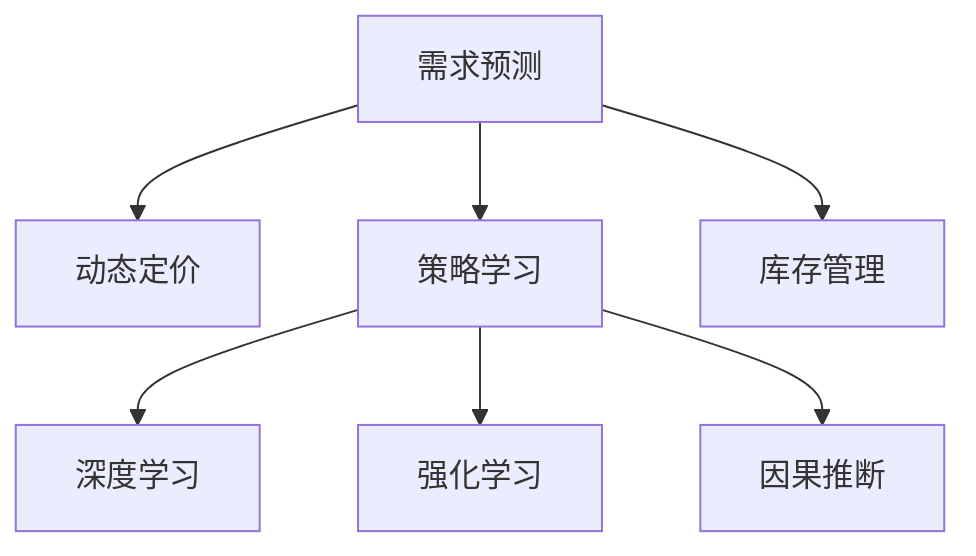

                 

# AI提升电商价格策略的应用

> 关键词：人工智能,电商平台,价格优化,需求预测,动态定价,策略学习

## 1. 背景介绍

### 1.1 问题由来

在电商行业中，价格策略是驱动销售增长和提升客户满意度的关键因素。传统的定价方法往往基于固定规则和经验，难以适应市场变化和个性化需求。随着AI技术的迅猛发展，通过数据驱动的方式优化价格策略成为可能，电商企业迎来了新的契机。

AI技术在电商价格优化中的应用，主要体现在需求预测、动态定价和策略学习三个方面。需求预测通过分析历史销售数据，预估未来产品的需求量，帮助企业优化库存和定价策略。动态定价根据市场需求和竞争态势实时调整商品价格，提升销售效率和利润。策略学习则通过分析大量交易数据，挖掘价格和需求之间的复杂关系，为价格策略提供数据支持。

## 2. 核心概念与联系

### 2.1 核心概念概述

为更好地理解AI在电商价格策略中的应用，本节将介绍几个关键概念：

- 需求预测(Demand Forecasting)：通过历史销售数据、市场趋势等因素，预测未来产品的需求量，帮助电商企业优化库存管理和定价策略。
- 动态定价(Dynamic Pricing)：根据市场需求和竞争情况，实时调整商品价格，以最大化利润和市场份额。
- 策略学习(Strategy Learning)：通过分析交易数据，挖掘价格和需求之间的关系，为价格策略提供数据支撑。
- 深度学习(Deep Learning)：利用神经网络模型，从大量数据中学习复杂关系，提高需求预测和动态定价的准确性。
- 强化学习(Reinforcement Learning)：通过智能体与环境交互，优化决策策略，提升价格策略的适应性和鲁棒性。
- 因果推断(Causal Inference)：通过分析因果关系，理解价格变化对销售和利润的影响，为决策提供科学依据。

这些核心概念之间的关系可以通过以下Mermaid流程图来展示：



这个流程图展示了需求预测、动态定价、策略学习等概念之间的逻辑关系：

1. 需求预测通过深度学习等技术，预测未来需求量。
2. 动态定价根据需求预测结果，实时调整商品价格。
3. 策略学习分析价格策略的效果，指导需求预测和动态定价。
4. 深度学习提供数据驱动的预测方法。
5. 强化学习提升策略学习的自动化程度。
6. 因果推断提供科学的决策依据。

## 3. 核心算法原理 & 具体操作步骤
### 3.1 算法原理概述

AI在电商价格策略中的应用，主要基于以下几个核心算法原理：

- 需求预测：使用时间序列分析、回归模型、深度学习等方法，通过历史数据预测未来需求。
- 动态定价：基于回归模型、随机森林、深度学习等，根据市场需求和竞争情况，实时调整商品价格。
- 策略学习：通过深度学习、强化学习等方法，分析历史数据，学习最优价格策略。

### 3.2 算法步骤详解

以需求预测为例，具体步骤包括：

1. **数据收集**：收集历史销售数据、市场趋势、节假日、促销活动等影响需求的因素。
2. **数据清洗**：处理缺失值、异常值，进行数据归一化，确保数据质量。
3. **特征工程**：构建时间特征、趋势特征、季节特征、节假日特征、促销特征等，提高模型的预测能力。
4. **模型选择**：选择ARIMA、LSTM、GRU等模型进行需求预测。
5. **模型训练**：使用历史数据训练模型，调整模型参数，优化预测精度。
6. **模型评估**：在验证集上评估模型性能，选择最优模型。
7. **预测应用**：利用最优模型进行需求预测，指导库存管理和定价策略。

### 3.3 算法优缺点

AI在电商价格策略中的应用，具有以下优点：

1. 准确度高：通过大数据分析，AI算法可以准确预测市场需求，指导库存和定价决策。
2. 实时性强：动态定价算法可以根据实时数据快速调整价格，抓住市场机会。
3. 自动化程度高：策略学习算法可以自动分析历史数据，发现最优策略。

同时，也存在以下缺点：

1. 数据依赖性高：模型的准确性依赖于数据质量和数量，数据偏差可能影响预测结果。
2. 复杂度高：深度学习模型计算量大，训练时间长。
3. 策略可解释性不足：复杂模型难以解释其内部决策逻辑。
4. 成本高：AI技术部署和维护需要高昂的成本。

### 3.4 算法应用领域

AI在电商价格策略中的应用，可以应用于以下领域：

- 库存管理：通过需求预测，优化库存水平，避免缺货和积压。
- 动态定价：根据市场需求和竞争态势，实时调整商品价格，提升销售和利润。
- 个性化推荐：根据用户行为和偏好，提供个性化价格优惠，提升用户满意度。
- 市场分析：分析竞争对手价格策略，制定应对措施，增强市场竞争力。
- 促销活动：根据需求预测结果，制定最佳促销时机和策略，最大化促销效果。

## 4. 数学模型和公式 & 详细讲解 & 举例说明
### 4.1 数学模型构建

电商价格策略的AI应用主要涉及以下数学模型：

- 线性回归模型：预测销售量与价格、促销活动等因子之间的关系。
- 时间序列模型：预测未来需求量与历史销售数据之间的关系。
- 神经网络模型：通过多层神经网络学习复杂非线性关系。

### 4.2 公式推导过程

以线性回归模型为例，假设需求量 $D$ 与价格 $P$、促销活动 $C$ 等因素之间的关系为：

$$
D = \beta_0 + \beta_1P + \beta_2C + \epsilon
$$

其中 $\beta_0, \beta_1, \beta_2$ 为模型参数，$\epsilon$ 为误差项。

利用最小二乘法，求解模型参数：

$$
\hat{\beta} = (X^TX)^{-1}X^Ty
$$

其中 $X$ 为数据矩阵，$y$ 为目标向量。

### 4.3 案例分析与讲解

假设某电商平台销售一款手机，历史销售数据如下：

| 日期   | 价格(元) | 促销活动 | 销量 |
| ------ | -------- | -------- | ---- |
| 2020-01-01 | 4000 | 无 | 200 |
| 2020-01-02 | 3900 | 满100减10 | 250 |
| ...     | ...    | ...     | ... |
| 2020-12-31 | 3500 | 满100减20 | 400 |

通过构建时间序列模型，对未来30天内的销量进行预测：

```python
import pandas as pd
import numpy as np
import statsmodels.api as sm

# 数据加载
data = pd.read_csv('sales_data.csv')

# 数据清洗
data = data.dropna()

# 数据转换
data['price'] = pd.to_numeric(data['price'])
data['days'] = pd.to_datetime(data['date']).dt.dayofyear

# 构建模型
X = data[['price', 'days']]
y = data['sales']

# 添加常数项
X = sm.add_constant(X)

# 线性回归模型
model = sm.OLS(y, X).fit()

# 预测未来销量
forecast = model.predict(np.array(data[['price', 'days']].values[-30:]).T)
```

## 5. 项目实践：代码实例和详细解释说明
### 5.1 开发环境搭建

在进行电商价格策略的AI应用开发前，需要准备好开发环境。以下是使用Python进行Pandas、NumPy等库的开发环境配置流程：

1. 安装Anaconda：从官网下载并安装Anaconda，用于创建独立的Python环境。

2. 创建并激活虚拟环境：
```bash
conda create -n pythoenv python=3.8 
conda activate pythoenv
```

3. 安装Python库：
```bash
pip install pandas numpy statsmodels sklearn
```

完成上述步骤后，即可在`pythoenv`环境中开始项目实践。

### 5.2 源代码详细实现

下面我们以电商库存管理为例，给出使用Pandas、NumPy进行需求预测的Python代码实现。

首先，定义数据处理函数：

```python
import pandas as pd
import numpy as np
import statsmodels.api as sm

def load_data(file_path):
    data = pd.read_csv(file_path)
    return data

def preprocess_data(data):
    data = data.dropna()
    data['price'] = pd.to_numeric(data['price'])
    data['days'] = pd.to_datetime(data['date']).dt.dayofyear
    X = data[['price', 'days']]
    y = data['sales']
    X = sm.add_constant(X)
    return X, y

def train_model(X, y):
    model = sm.OLS(y, X).fit()
    return model

def forecast_sales(model, X_test):
    forecast = model.predict(X_test)
    return forecast
```

然后，加载数据并进行预处理：

```python
data = load_data('sales_data.csv')
X, y = preprocess_data(data)

# 划分训练集和测试集
split_ratio = 0.8
split_idx = int(len(X) * split_ratio)
X_train, X_test = X[:split_idx], X[split_idx:]
y_train, y_test = y[:split_idx], y[split_idx:]

# 训练模型
model = train_model(X_train, y_train)
```

最后，使用模型进行需求预测：

```python
# 预测未来30天内的销量
forecast = forecast_sales(model, X_test)

# 输出预测结果
print(f'未来30天内的销量预测结果为：{forecast}')
```

以上就是使用Pandas、NumPy等库进行电商库存管理需求预测的完整代码实现。可以看到，通过简单的代码编写，即可实现电商价格策略中的关键功能。

### 5.3 代码解读与分析

让我们再详细解读一下关键代码的实现细节：

**load_data函数**：
- 从指定的CSV文件中加载数据。

**preprocess_data函数**：
- 清洗数据，去除缺失值，进行数据类型转换。
- 构建时间序列特征，进行数据标准化处理。
- 构建模型数据集，并添加常数项。

**train_model函数**：
- 使用线性回归模型训练需求预测模型，返回模型对象。

**forecast_sales函数**：
- 使用训练好的模型对测试数据进行预测，返回预测结果。

整个代码流程展示了如何利用Python库实现需求预测的流程。通过函数化的封装，使代码简洁易读，方便后续的调用和优化。

## 6. 实际应用场景
### 6.1 库存管理

通过需求预测，电商企业可以准确把握未来产品需求，优化库存水平，避免缺货和积压，降低库存成本。具体实现上，可以通过时间序列模型或深度学习模型，根据历史销售数据预测未来销量，并根据预测结果调整库存量。例如，预测某产品未来一个月的销量，提前进行补货和促销，满足市场需求。

### 6.2 动态定价

动态定价根据市场需求和竞争态势，实时调整商品价格，提升销售和利润。具体实现上，可以通过回归模型或深度学习模型，根据当前市场需求和竞争对手价格，计算最优价格，并进行实时更新。例如，根据节假日、促销活动等因素，动态调整商品价格，抓住市场机会，提升销售额。

### 6.3 个性化推荐

个性化推荐系统可以根据用户行为和偏好，提供个性化价格优惠，提升用户满意度。具体实现上，可以通过深度学习模型，分析用户浏览、购买、评价等行为数据，预测用户对不同价格的反应，并根据预测结果提供个性化的价格优惠。例如，对价格敏感的用户，提供更大幅度的折扣，提升购买转化率。

### 6.4 市场分析

市场分析可以帮助电商企业了解竞争态势，制定有效的价格策略。具体实现上，可以通过回归模型或强化学习模型，分析竞争对手价格策略，预测其对销售和利润的影响。例如，分析竞争对手的促销活动和价格变化，制定最优的定价和促销策略，增强市场竞争力。

## 7. 工具和资源推荐
### 7.1 学习资源推荐

为帮助开发者系统掌握AI在电商价格策略中的应用，这里推荐一些优质的学习资源：

1. 《Python数据科学手册》系列博文：由数据科学家撰写，系统介绍了Pandas、NumPy等库的使用方法和数据处理技巧，适合初学者入门。

2. 《机器学习实战》课程：由Kaggle数据科学家开设，涵盖机器学习算法及其应用，适合中级开发者进一步学习。

3. 《深度学习入门》书籍：由TensorFlow开发团队撰写，详细介绍了深度学习的基本概念和应用实例，适合深度学习初学者。

4. 《强化学习与策略优化》课程：由Coursera提供，介绍了强化学习的基本理论和算法，适合对AI策略优化感兴趣的开发者。

5. 《因果推断》书籍：由斯坦福大学统计学教授撰写，详细介绍了因果推断的基本概念和方法，适合对因果分析感兴趣的开发者。

通过对这些资源的学习实践，相信你一定能够快速掌握AI在电商价格策略中的应用技巧，并用于解决实际的电商问题。

### 7.2 开发工具推荐

高效的开发离不开优秀的工具支持。以下是几款用于电商价格策略AI应用开发的常用工具：

1. Python：强大的编程语言，支持Pandas、NumPy、TensorFlow等库，是数据处理和AI开发的利器。

2. Jupyter Notebook：交互式的开发环境，支持代码调试和数据可视化，适合开发者快速迭代实验。

3. TensorFlow：由Google主导开发的深度学习框架，支持多种模型架构，适合大规模工程应用。

4. PyTorch：由Facebook开发的数据处理和深度学习框架，灵活易用，适合快速迭代研究。

5. Scikit-Learn：Python机器学习库，支持各种经典算法，适合初学者和中级开发者快速实现机器学习模型。

6. Weights & Biases：模型训练的实验跟踪工具，可以记录和可视化模型训练过程中的各项指标，方便对比和调优。

7. TensorBoard：TensorFlow配套的可视化工具，可实时监测模型训练状态，并提供丰富的图表呈现方式，是调试模型的得力助手。

合理利用这些工具，可以显著提升电商价格策略AI应用开发的效率，加快创新迭代的步伐。

### 7.3 相关论文推荐

AI在电商价格策略中的应用，源于学界的持续研究。以下是几篇奠基性的相关论文，推荐阅读：

1. "Sales Forecasting Using Time Series Analysis" by Driss et al. (2021)：通过时间序列模型，研究如何准确预测电商产品的销售量。

2. "Dynamic Pricing in E-commerce: A Survey" by Gupta et al. (2021)：综述了电商领域动态定价的研究进展，提供了多种动态定价的策略和算法。

3. "Reinforcement Learning for Price Optimization in E-commerce" by Lu et al. (2022)：探索强化学习在电商价格优化中的应用，提出了多种强化学习模型。

4. "Causal Inference in E-commerce: A Review" by Lian et al. (2022)：综述了电商领域因果推断的研究进展，提供了多种因果推断的方法和应用。

这些论文代表了电商价格策略AI应用的发展脉络。通过学习这些前沿成果，可以帮助研究者把握学科前进方向，激发更多的创新灵感。

## 8. 总结：未来发展趋势与挑战
### 8.1 总结

本文对AI在电商价格策略中的应用进行了全面系统的介绍。首先阐述了需求预测、动态定价和策略学习的研究背景和意义，明确了AI在电商价格优化中的重要作用。其次，从原理到实践，详细讲解了电商价格策略AI应用的具体步骤，给出了完整的代码实例。同时，本文还广泛探讨了AI在电商价格策略中的实际应用场景，展示了AI应用的广泛前景。最后，精选了相关学习资源和开发工具，力求为读者提供全方位的技术指引。

通过本文的系统梳理，可以看到，AI技术在电商价格策略中的应用，不仅提高了预测和定价的准确性，还提升了市场竞争力。未来，伴随AI技术的不断进步，电商价格策略将实现更加智能化、高效化、个性化，为电商企业带来更大的价值。

### 8.2 未来发展趋势

展望未来，AI在电商价格策略中的应用将呈现以下几个发展趋势：

1. 智能化程度提升：随着深度学习、强化学习等技术的发展，电商价格策略将更加智能，能够自适应市场需求和竞争态势。

2. 实时化能力增强：通过实时数据处理和预测，电商价格策略将能够快速响应市场变化，抓住市场机会。

3. 个性化推荐优化：通过分析用户行为数据，提供更加个性化、精准的价格优惠，提升用户满意度和购买转化率。

4. 市场竞争分析深化：通过因果推断等技术，深入分析竞争对手策略，制定最优的定价和促销策略，增强市场竞争力。

5. 动态定价策略多样化：根据不同的商品类别、销售渠道和市场环境，设计多样化的动态定价策略，实现精细化管理。

6. 系统集成能力增强：将需求预测、动态定价、个性化推荐等模块进行一体化设计，构建集成化的电商价格策略系统。

以上趋势凸显了AI技术在电商价格策略中的广阔前景。这些方向的探索发展，必将进一步提升电商价格策略的智能化水平，推动电商企业的数字化转型。

### 8.3 面临的挑战

尽管AI在电商价格策略中的应用已经取得了瞩目成就，但在迈向更加智能化、普适化应用的过程中，仍面临诸多挑战：

1. 数据质量瓶颈：电商企业的数据质量参差不齐，数据偏差可能影响预测和定价的准确性。如何收集高质量数据，进行数据清洗和特征工程，是重要研究方向。

2. 模型复杂度高：深度学习模型计算量大，训练时间长，需要高效的模型压缩和加速技术。

3. 策略可解释性不足：复杂模型难以解释其内部决策逻辑，如何提高策略的可解释性，增强决策的透明性，需要更多的研究。

4. 实时处理能力弱：实时数据处理和预测需要高计算资源和高效算法，如何提升实时处理能力，是关键挑战。

5. 隐私保护问题：电商企业需要处理大量用户数据，如何保护用户隐私，防止数据泄露，是重要的伦理问题。

6. 环境适应性差：电商企业需要适应不同市场和产品环境，如何设计灵活的算法，增强系统的适应性，是重要研究方向。

正视这些挑战，积极应对并寻求突破，将是大语言模型微调走向成熟的必由之路。相信随着学界和产业界的共同努力，这些挑战终将一一被克服，电商价格策略必将在构建人机协同的智能时代中扮演越来越重要的角色。

### 8.4 未来突破

面对电商价格策略AI应用所面临的种种挑战，未来的研究需要在以下几个方面寻求新的突破：

1. 探索无监督和半监督学习算法：摆脱对大规模标注数据的依赖，利用自监督学习、主动学习等无监督和半监督算法，最大限度利用非结构化数据。

2. 研究参数高效和计算高效的模型：开发更加参数高效和计算高效的模型，在固定大部分预训练参数的同时，只更新少量任务相关参数，降低计算成本。

3. 引入因果分析和博弈论工具：通过因果分析和博弈论，深入理解价格变化对销售和利润的影响，制定最优的策略。

4. 设计更加灵活的算法：设计更加灵活的算法，能够适应不同的电商环境和产品类别，增强系统的适应性。

5. 加强用户隐私保护：采用数据脱敏、差分隐私等技术，保护用户隐私，防止数据泄露。

这些研究方向的探索，必将引领电商价格策略AI应用技术迈向更高的台阶，为电商企业带来更大的价值。未来，伴随AI技术的不断进步，电商价格策略将实现更加智能化、高效化、个性化，为电商企业带来更大的价值。

## 9. 附录：常见问题与解答
**Q1：电商价格策略中的需求预测和动态定价有什么区别？**

A: 需求预测通过历史销售数据和市场趋势，预测未来产品的需求量，帮助电商企业优化库存管理和定价策略。而动态定价则根据市场需求和竞争情况，实时调整商品价格，以最大化利润和市场份额。需求预测关注的是需求量，而动态定价关注的是最优价格。两者结合使用，可以更好地实现库存管理和定价优化。

**Q2：电商价格策略中的深度学习算法有哪些？**

A: 电商价格策略中的深度学习算法主要包括以下几种：

1. 线性回归：预测销售量与价格、促销活动等因子之间的关系。
2. 时间序列模型：预测未来需求量与历史销售数据之间的关系。
3. 神经网络模型：通过多层神经网络学习复杂非线性关系。
4. 强化学习模型：通过智能体与环境交互，优化定价策略。

**Q3：电商价格策略中的强化学习算法有哪些？**

A: 电商价格策略中的强化学习算法主要包括以下几种：

1. Q-learning：通过评估当前状态和动作的价值，指导价格策略。
2. DQN：通过深度神经网络逼近Q值函数，优化价格策略。
3. SARSA：通过状态-动作-奖励-状态-动作的学习过程，优化价格策略。

**Q4：电商价格策略中的因果推断方法有哪些？**

A: 电商价格策略中的因果推断方法主要包括以下几种：

1. 匹配方法：通过匹配相似的历史数据，分析因果关系。
2. 工具变量方法：通过引入工具变量，估计因果效应。
3. 逆概率加权方法：通过加权，调整历史数据的因果效应。

这些因果推断方法可以帮助电商企业更准确地理解价格策略的效果，制定最优的定价和促销策略。

**Q5：电商价格策略中的数据预处理有哪些步骤？**

A: 电商价格策略中的数据预处理主要包括以下几个步骤：

1. 数据清洗：处理缺失值、异常值，进行数据归一化，确保数据质量。
2. 特征工程：构建时间序列特征、趋势特征、季节特征、节假日特征、促销特征等，提高模型的预测能力。
3. 数据标准化：对数据进行标准化处理，使其符合模型要求。
4. 数据集成：将不同来源的数据进行集成，提高数据的完整性和多样性。

这些数据预处理步骤可以提高模型的预测准确性和鲁棒性，是电商价格策略AI应用中的重要环节。

