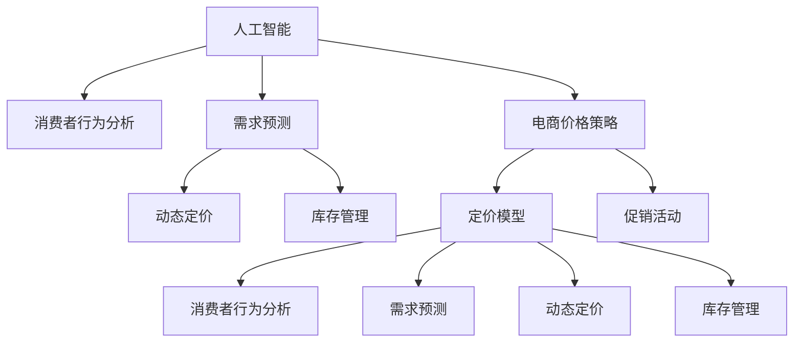

                 

# AI提升电商价格策略的技术

> 关键词：人工智能(AI),电商价格策略,算法优化,成本控制,消费者行为分析

## 1. 背景介绍

### 1.1 问题由来
在现代电商市场中，价格策略一直是商家竞争的重要手段。定价过高可能导致销量下降，定价过低可能无法覆盖成本，因此如何制定既吸引消费者又能盈利的合理价格，成为了一个复杂而重要的决策问题。随着人工智能技术的迅猛发展，AI在电商价格策略中的应用变得日益广泛，提供了强大的决策支持。

### 1.2 问题核心关键点
电商价格策略的AI应用主要集中在消费者行为分析、需求预测、动态定价和库存管理等方面。通过大数据和机器学习模型，AI能够实时分析市场变化和消费者行为，为商家提供精准的定价建议。

## 2. 核心概念与联系

### 2.1 核心概念概述

为了更好地理解AI如何提升电商价格策略，本节将介绍几个关键概念：

- **人工智能(AI)**：通过模拟人类智能过程的计算机系统，能够进行自主学习、推理和决策，以执行复杂任务。
- **电商价格策略**：电商平台为提升销售和利润，采用的一系列定价方法和策略，包括定价模型、促销活动等。
- **消费者行为分析**：通过数据分析技术，挖掘消费者购买行为背后的模式和规律，指导商品定价和营销策略。
- **需求预测**：利用历史销售数据和市场趋势，预测未来产品的需求量，辅助商家进行库存管理和价格调整。
- **动态定价**：根据市场需求、竞争环境和消费者行为，动态调整商品价格，优化销售效果。
- **库存管理**：通过AI优化库存水平，减少过度库存和缺货情况，降低成本，提高运营效率。

这些概念之间的逻辑关系可以通过以下Mermaid流程图来展示：



这个流程图展示了AI技术在电商价格策略中的主要应用环节：

1. AI技术用于消费者行为分析和需求预测，为动态定价和库存管理提供数据支撑。
2. 动态定价和库存管理策略，进一步辅助电商平台制定精准的价格策略。
3. 定价模型和促销活动是价格策略的具体实施工具，旨在提升销售和利润。

## 3. 核心算法原理 & 具体操作步骤
### 3.1 算法原理概述

AI在电商价格策略中的应用，主要基于数据驱动的机器学习模型。这些模型通过分析历史数据和市场动态，学习消费者的行为模式和价格敏感度，从而为电商平台提供最优的价格建议。核心算法原理包括：

- **回归模型**：用于预测商品的销量与价格之间的关系，帮助商家确定最优价格点。
- **聚类分析**：将消费者分为不同的群体，分析每个群体的购买行为和价格敏感度，指导精细化定价。
- **时序预测**：利用时间序列数据，预测未来商品的需求量，为库存管理和动态定价提供参考。
- **集成学习**：将多种模型进行集成，提高价格预测的准确性和鲁棒性。

### 3.2 算法步骤详解

基于AI的电商价格策略，一般包括以下几个关键步骤：

**Step 1: 数据收集与预处理**
- 收集电商平台的销售数据、市场价格、竞争对手信息、消费者反馈等，作为AI模型的输入。
- 对数据进行清洗、归一化和特征工程，去除噪音和冗余信息，提取有用的特征。

**Step 2: 构建机器学习模型**
- 选择合适的算法模型，如回归模型、聚类模型、时序模型等，对数据进行训练和验证。
- 利用交叉验证、网格搜索等技术，优化模型参数，提高预测精度。

**Step 3: 模型评估与调优**
- 在测试集上对模型进行评估，使用准确率、召回率、F1值等指标衡量模型性能。
- 根据评估结果，调整模型结构或参数，进一步提高模型泛化能力。

**Step 4: 部署与监控**
- 将训练好的模型部署到电商平台的定价系统中，实时接收市场数据输入，输出价格建议。
- 定期监控模型性能，根据市场变化进行模型更新和优化。

**Step 5: 反馈与迭代**
- 收集用户反馈和销售数据，对模型进行反馈和迭代优化。
- 定期回顾和评估价格策略的效果，调整策略以适应市场变化。

### 3.3 算法优缺点

基于AI的电商价格策略具有以下优点：
1. 精确预测：通过分析大量历史数据和市场动态，AI能够提供精准的销量和需求预测，帮助商家制定合理的定价策略。
2. 实时响应：AI系统能够实时接收市场数据，迅速调整价格，提高响应速度。
3. 动态优化：AI能够根据消费者行为和市场变化，动态调整价格，优化销售效果。
4. 成本控制：通过优化库存管理和销售策略，AI可以有效降低成本，提升利润。

同时，该方法也存在一些局限性：
1. 数据依赖：AI模型的性能高度依赖于输入数据的质量和数量，数据偏差可能导致预测错误。
2. 模型复杂性：构建和优化AI模型需要较高的技术门槛，普通商家难以自主实现。
3. 动态变化：市场环境瞬息万变，AI模型需要不断更新和迭代，才能保持准确性。
4. 隐私问题：电商平台需处理大量消费者个人信息，存在隐私泄露风险。
5. 公平性问题：AI模型可能学习到数据中的偏见，导致价格歧视或不公平定价。

尽管存在这些局限性，AI在电商价格策略中的应用已显示出巨大的潜力，尤其是在提升销售效率和利润方面表现突出。未来，相关研究将继续探索如何在保持模型高效性的同时，解决上述问题，使AI更好地服务于电商平台。

### 3.4 算法应用领域

基于AI的电商价格策略，已经广泛应用于各大电商平台的定价决策中。以下是几个典型的应用场景：

- **亚马逊**：利用AI进行动态定价和库存管理，优化销售效果，提高用户体验。
- **阿里巴巴**：通过AI分析消费者行为，调整商品价格和促销策略，提升整体销售业绩。
- **京东**：采用AI进行需求预测和价格优化，减少库存积压，提高供应链效率。
- **拼多多**：利用AI分析市场趋势和竞争对手价格，实时调整商品定价，提高市场竞争力。

这些电商巨头通过AI技术，实现了从数据收集到价格决策的全流程自动化，显著提升了运营效率和盈利能力。未来，随着AI技术的不断进步，电商价格策略将更加精准、灵活，为消费者和商家带来更多价值。

## 4. 数学模型和公式 & 详细讲解 & 举例说明

### 4.1 数学模型构建

本节将使用数学语言对AI在电商价格策略中的应用进行更加严格的刻画。

设电商平台销售的商品集合为 $S=\{s_1, s_2, \ldots, s_n\}$，每个商品的销量与价格之间的关系可以用回归模型 $Y=f(X)$ 来表示，其中 $X$ 为价格向量，$Y$ 为销量向量。

为了进行需求预测，可以利用时间序列数据 $D=\{(X_t, Y_t)\}_{t=1}^T$ 训练 ARIMA 模型：

$$
Y_t = \phi(B)X_t + \theta(B)\epsilon_t
$$

其中 $\phi(B)$ 和 $\theta(B)$ 为转移函数，$\epsilon_t$ 为白噪声序列。

为了进行聚类分析，可以利用 k-means 算法将消费者分为 $K$ 个群体，每个群体的消费行为可以用 $C_k$ 表示。

为了进行动态定价，可以利用线性回归模型 $P_t = \alpha X_t + \beta Y_{t-1}$ 预测价格 $P_t$，其中 $Y_{t-1}$ 为前一时刻的销量，$\alpha$ 和 $\beta$ 为回归系数。

### 4.2 公式推导过程

以下我们以需求预测为例，推导 ARIMA 模型的具体实现。

假设电商平台有 $N$ 种商品，每种商品的历史销售数据 $D=\{(X_t, Y_t)\}_{t=1}^T$，其中 $X_t$ 为价格向量，$Y_t$ 为销量向量。目标是通过这些数据构建 ARIMA 模型，预测未来的销量 $Y_{t+1}$。

利用 ARIMA 模型的定义，可以得到如下递归公式：

$$
Y_t = \phi(B)X_t + \theta(B)\epsilon_t
$$

将公式展开，得到：

$$
Y_t = \phi_1X_{t-1} + \phi_2X_{t-2} + \ldots + \phi_dX_{t-d} + \theta_1\epsilon_{t-1} + \theta_2\epsilon_{t-2} + \ldots + \theta_p\epsilon_{t-p}
$$

其中 $\phi_i$ 和 $\theta_i$ 为模型的参数，$\epsilon_t$ 为白噪声序列。

将上式进一步展开，得到：

$$
Y_t = \sum_{i=1}^d \phi_iX_{t-i} + \sum_{i=1}^p \theta_i\epsilon_{t-i}
$$

为了简化计算，可以将模型参数合并，得到：

$$
Y_t = \alpha_1X_{t-1} + \alpha_2X_{t-2} + \ldots + \alpha_dX_{t-d} + \epsilon_t
$$

其中 $\alpha_i = \phi_i + \theta_i$，$i=1,2,\ldots,d+p$。

将上式表示为矩阵形式，得到：

$$
\begin{bmatrix}
Y_t \\
Y_{t-1} \\
\vdots \\
Y_{t-d} \\
\end{bmatrix}
=
\begin{bmatrix}
1 & \alpha_1 & \alpha_2 & \ldots & \alpha_d \\
0 & 1 & \alpha_1 & \alpha_2 & \ldots \\
\vdots & \vdots & \vdots & \vdots & \vdots \\
0 & 0 & 0 & 0 & \alpha_1 \\
\end{bmatrix}
\begin{bmatrix}
X_t \\
X_{t-1} \\
\vdots \\
X_{t-d} \\
\end{bmatrix}
+
\begin{bmatrix}
\epsilon_t \\
\epsilon_{t-1} \\
\vdots \\
\epsilon_{t-d} \\
\end{bmatrix}
$$

通过求解上述线性方程，可以得到 $\alpha_i$ 和 $\epsilon_t$，进而得到未来销量 $Y_{t+1}$ 的预测值。

## 5. 项目实践：代码实例和详细解释说明
### 5.1 开发环境搭建

在进行AI电商价格策略的实践前，我们需要准备好开发环境。以下是使用Python进行Pandas和Scikit-learn开发的环境配置流程：

1. 安装Anaconda：从官网下载并安装Anaconda，用于创建独立的Python环境。

2. 创建并激活虚拟环境：
```bash
conda create -n ai-pricing python=3.8 
conda activate ai-pricing
```

3. 安装Pandas和Scikit-learn：
```bash
pip install pandas scikit-learn
```

4. 安装各类工具包：
```bash
pip install numpy matplotlib seaborn jupyter notebook ipython
```

完成上述步骤后，即可在`ai-pricing`环境中开始AI电商价格策略的开发。

### 5.2 源代码详细实现

下面我们以需求预测为例，给出使用Pandas和Scikit-learn进行需求预测的Python代码实现。

首先，定义数据处理函数：

```python
import pandas as pd
from sklearn.metrics import mean_squared_error

def load_data(filename):
    data = pd.read_csv(filename)
    data['date'] = pd.to_datetime(data['date'])
    data.set_index('date', inplace=True)
    return data

def split_train_test(data, train_ratio=0.8):
    train = data[:int(train_ratio*len(data))]
    test = data[int(train_ratio*len(data)):]
    return train, test

def normalize_data(data):
    data = (data - data.mean()) / data.std()
    return data

def predict(test_data, train_data, model):
    test_pred = model.predict(test_data)
    mse = mean_squared_error(test_data['Y'], test_pred)
    print(f"MSE: {mse}")
    return test_pred
```

然后，加载数据并训练ARIMA模型：

```python
from statsmodels.tsa.arima_model import ARIMA

# 加载数据
data = load_data('sales_data.csv')

# 将数据按月划分
data = data.resample('M').sum()

# 数据归一化
data = normalize_data(data)

# 划分训练集和测试集
train, test = split_train_test(data, train_ratio=0.8)

# 构建ARIMA模型
model = ARIMA(train['X'], order=(1, 1, 1))
model_fit = model.fit()

# 预测测试集
pred = predict(test, train, model_fit)
```

最后，评估模型性能：

```python
import matplotlib.pyplot as plt

# 绘制实际与预测销量对比图
plt.figure(figsize=(10, 6))
plt.plot(test['Y'], label='Actual')
plt.plot(pred, label='Predicted')
plt.legend()
plt.show()
```

以上就是使用Pandas和Scikit-learn进行需求预测的完整代码实现。可以看到，借助这两个强大的Python库，我们可以高效地完成数据预处理、模型构建和评估。

### 5.3 代码解读与分析

让我们再详细解读一下关键代码的实现细节：

**load_data函数**：
- 定义了数据加载函数，用于读取CSV文件并转换为Pandas DataFrame格式。
- 将日期列转换为Pandas的DateTime格式，并设置为其作为DataFrame的索引。

**split_train_test函数**：
- 定义了数据划分函数，将数据集按照给定的比例划分为训练集和测试集。

**normalize_data函数**：
- 定义了数据归一化函数，对数据进行零均值和单位方差标准化，以便更好地训练模型。

**predict函数**：
- 定义了预测函数，接收测试集数据、训练集数据和已训练模型，预测测试集的结果并计算均方误差。

**ARIMA模型**：
- 通过statsmodels库中的ARIMA类，构建ARIMA模型并进行拟合。
- 在模型构建时，需要指定模型的阶数(order)，这里选择(1, 1, 1)。

**predict函数**：
- 调用训练好的模型对测试集进行预测。
- 打印预测的均方误差，评估模型性能。

**绘制对比图**：
- 使用Matplotlib绘制实际销量和预测销量的对比图，直观展示模型预测效果。

可以看到，Pandas和Scikit-learn使得数据处理和模型训练变得异常简单，开发者可以更专注于算法优化和业务逻辑实现。

## 6. 实际应用场景
### 6.1 智能库存管理

AI在电商库存管理中的应用，主要通过需求预测和动态定价实现。通过精准的需求预测，商家可以避免过度库存和缺货情况，提高库存周转率，减少资金占用和存储成本。

在技术实现上，可以收集历史销售数据和市场趋势，利用ARIMA等时间序列模型进行需求预测，并结合动态定价模型，实时调整商品价格，优化库存水平。AI系统能够动态监测市场变化，自动进行库存管理，减少人工干预和误差。

### 6.2 个性化推荐

个性化推荐系统通过AI分析消费者行为和购买历史，为每位用户提供量身定制的推荐商品。AI模型能够学习用户的兴趣偏好，在销量预测的基础上，动态调整推荐策略，提升用户体验和满意度。

在技术实现上，可以利用协同过滤、内容推荐、混合推荐等算法，对用户行为数据进行建模和预测。通过实时调整推荐策略，优化推荐效果，提高转化率和销售额。

### 6.3 市场竞争分析

AI可以实时监测竞争对手的商品价格和市场策略，帮助商家制定有效的价格竞争策略。通过对比分析，AI系统能够识别出价格优势和劣势，指导商家进行价格调整，提高市场竞争力。

在技术实现上，可以收集竞争对手的商品信息、销量数据和价格变化，利用机器学习模型进行分析和预测。通过动态定价和促销策略，优化商品定价和销售效果。

### 6.4 未来应用展望

随着AI技术的不断进步，基于AI的电商价格策略将呈现以下几个发展趋势：

1. 多模态数据融合：未来电商价格策略将更多地利用多模态数据（如图像、视频、音频等），综合分析消费者的全方位信息，提高定价准确性。
2. 联邦学习：利用联邦学习技术，保护用户隐私的同时，实现多平台数据共享和模型协同优化。
3. 实时优化：未来的AI系统将实现实时优化，动态调整价格策略，及时响应市场变化，提升销售效果。
4. 自适应模型：根据不同市场环境和用户群体，AI系统能够自适应调整模型参数，提高模型泛化能力。
5. 个性化服务：未来的AI系统将能够更深入地理解消费者需求，提供更加个性化和精准的服务。

## 7. 工具和资源推荐
### 7.1 学习资源推荐

为了帮助开发者系统掌握AI电商价格策略的理论基础和实践技巧，这里推荐一些优质的学习资源：

1. 《Python数据分析与机器学习》系列博文：介绍如何使用Python进行数据处理和机器学习建模，适合初学者入门。
2. 《机器学习实战》书籍：介绍机器学习的基本概念和经典算法，涵盖回归、分类、聚类等，适合进阶学习。
3. 《深度学习》课程：斯坦福大学开设的深度学习课程，有Lecture视频和配套作业，适合系统学习深度学习理论。
4. Kaggle竞赛平台：通过参与实际数据分析和建模竞赛，积累实战经验，提升解决实际问题的能力。
5. PyTorch官方文档：PyTorch深度学习框架的官方文档，提供了详细的API和模型实现示例。

通过对这些资源的学习实践，相信你一定能够快速掌握AI电商价格策略的精髓，并用于解决实际的电商问题。

### 7.2 开发工具推荐

高效的开发离不开优秀的工具支持。以下是几款用于AI电商价格策略开发的常用工具：

1. Python：开源的高级编程语言，支持科学计算和数据分析，适合AI模型开发。
2. Pandas：数据分析工具库，提供了高效的数据处理和分析功能。
3. Scikit-learn：机器学习库，提供了丰富的算法模型和评估工具，适合数据建模和预测。
4. TensorFlow：深度学习框架，支持分布式计算和自动微分，适合复杂模型训练。
5. Jupyter Notebook：交互式编程环境，支持代码块、公式和图形的混合展示，适合模型开发和调试。
6. Google Colab：谷歌提供的免费云服务，支持GPU计算和自动化测试，适合快速实验和分享。

合理利用这些工具，可以显著提升AI电商价格策略的开发效率，加快创新迭代的步伐。

### 7.3 相关论文推荐

AI在电商价格策略中的应用研究，主要集中在以下几个方面：

1. "Using Deep Learning to Optimize Price Prediction and Inventory Management in Retailing"（使用深度学习优化零售业的定价和库存管理）：介绍如何使用深度学习模型进行需求预测和库存管理。
2. "Price Optimization in Retailing: An Overview"（零售业价格优化综述）：总结了不同零售商在价格优化方面的实践经验和理论方法。
3. "Marketplace Pricing Strategies: A Multi-Objective Approach"（电商平台定价策略：多目标方法）：探讨了电商平台定价策略的多目标优化方法，包括动态定价和库存管理。
4. "Consumer Behavior Analysis in E-Commerce"（电子商务中消费者行为分析）：介绍了消费者行为分析在电商价格策略中的应用，包括聚类分析和个性化推荐。
5. "Predicting Product Demand Using Time Series Analysis"（使用时间序列分析预测产品需求）：详细介绍了利用时间序列模型进行需求预测的方法。

这些论文代表了AI在电商价格策略研究的前沿进展，通过学习这些成果，可以帮助研究者把握学科进展，激发更多的创新灵感。

## 8. 总结：未来发展趋势与挑战

### 8.1 总结

本文对AI在电商价格策略中的应用进行了全面系统的介绍。首先阐述了AI技术在电商定价、库存管理、消费者行为分析等方面的应用价值，明确了AI电商价格策略在提升销售效率和盈利能力方面的重要意义。其次，从原理到实践，详细讲解了回归模型、聚类分析、时间序列预测等核心算法原理和操作步骤，给出了完整的代码实现示例。同时，本文还探讨了AI在电商价格策略中的广泛应用场景，展示了AI技术的巨大潜力。

通过本文的系统梳理，可以看到，AI电商价格策略已经广泛应用于各大电商平台的决策中，显著提升了运营效率和盈利能力。未来，随着AI技术的不断进步，电商价格策略将更加精准、灵活，为消费者和商家带来更多价值。

### 8.2 未来发展趋势

展望未来，AI电商价格策略将呈现以下几个发展趋势：

1. 模型集成：未来的AI系统将集成多种算法和模型，实现多模态数据的融合，提供更加全面和精准的定价建议。
2. 实时响应：AI系统将实现实时定价和库存管理，动态调整策略，适应市场变化。
3. 用户个性化：AI系统将更深入地理解用户需求和行为，提供个性化的定价和推荐服务。
4. 隐私保护：未来AI系统将加强对用户隐私的保护，确保数据安全和个人隐私。
5. 可持续发展：AI系统将更加注重可持续性，减少对环境的负面影响，推动绿色电商的发展。

这些趋势凸显了AI在电商价格策略中的广阔前景。这些方向的探索发展，必将进一步提升电商平台的运营效率和用户满意度，推动人工智能技术的深入应用。

### 8.3 面临的挑战

尽管AI在电商价格策略中已经取得了显著成果，但在迈向更加智能化、普适化应用的过程中，仍面临诸多挑战：

1. 数据质量和多样性：AI系统的性能高度依赖于输入数据的质量和多样性，数据的偏差和缺失可能导致预测错误。
2. 模型复杂度：构建和优化AI模型需要较高的技术门槛，普通商家难以自主实现。
3. 实时性要求：电商市场瞬息万变，AI系统需要具备实时计算和动态调整的能力，才能满足实际需求。
4. 用户隐私保护：AI系统需要处理大量消费者个人信息，存在隐私泄露风险。
5. 公平性问题：AI模型可能学习到数据中的偏见，导致价格歧视或不公平定价。

尽管存在这些挑战，AI在电商价格策略中的应用已经展现出巨大的潜力，未来相关研究将继续探索如何在保持模型高效性的同时，解决上述问题，使AI更好地服务于电商平台。

### 8.4 研究展望

面对AI电商价格策略所面临的种种挑战，未来的研究需要在以下几个方面寻求新的突破：

1. 无监督学习：探索无监督学习技术，从非结构化数据中挖掘有价值的信息，提高模型的泛化能力和鲁棒性。
2. 自适应算法：开发自适应算法，根据市场环境和用户行为动态调整模型参数，提高模型的适应性和预测精度。
3. 实时计算框架：构建实时计算框架，支持AI系统的高效计算和动态调整，满足电商市场的实时性要求。
4. 隐私保护技术：研发隐私保护技术，保护用户数据隐私，确保数据安全和个人隐私。
5. 公平性分析：引入公平性分析方法，评估和改进AI系统的公平性，避免偏见和歧视。

这些研究方向的研究成果，将进一步提升AI电商价格策略的性能和应用范围，为电商平台提供更加精准、可靠的定价建议，提升运营效率和用户满意度。面向未来，AI电商价格策略需要与其他AI技术进行更深入的融合，如知识表示、因果推理、强化学习等，多路径协同发力，共同推动电商市场的发展。只有勇于创新、敢于突破，才能不断拓展AI电商价格策略的边界，让智能技术更好地服务于电商市场。

## 9. 附录：常见问题与解答

**Q1：AI电商价格策略是否适用于所有电商类型？**

A: AI电商价格策略主要适用于拥有大量历史数据和复杂电商业务的电商平台。对于小型电商或新创企业，由于数据量有限，可能难以直接应用。此时可以通过数据增强、迁移学习等方法，提高数据质量和模型泛化能力，逐步引入AI技术。

**Q2：AI模型在电商价格策略中如何应对市场变化？**

A: AI模型通过实时监测市场数据，动态调整价格策略。具体来说，可以定期或实时收集市场价格、竞争对手信息、消费者反馈等，利用回归模型、聚类分析等方法进行预测和分析，实时调整价格和库存策略。通过不断迭代和优化，AI系统能够快速响应市场变化，提升定价准确性和响应速度。

**Q3：AI模型在电商价格策略中如何保护用户隐私？**

A: 在数据收集和处理过程中，AI模型需要遵循隐私保护原则，如数据匿名化、差分隐私等。具体来说，可以采用数据脱敏技术，去除或模糊化敏感信息，保护用户隐私。同时，在使用用户数据时，应获得用户明确同意，并遵守相关法律法规，确保数据使用合规性。

**Q4：AI模型在电商价格策略中如何确保公平性？**

A: AI模型可能学习到数据中的偏见和歧视，导致不公平定价。为避免这种情况，需要引入公平性评估指标，如公平误差、组内公平等，评估模型的公平性。同时，可以使用公平性纠正技术，如重新加权、调整模型参数等，纠正模型偏见，确保定价公平。此外，应定期回顾和评估模型的公平性，确保其符合用户期望和伦理道德。

通过这些措施，AI电商价格策略可以在保证模型高效性的同时，确保用户隐私和公平性，提升电商平台的商业价值和社会效益。

