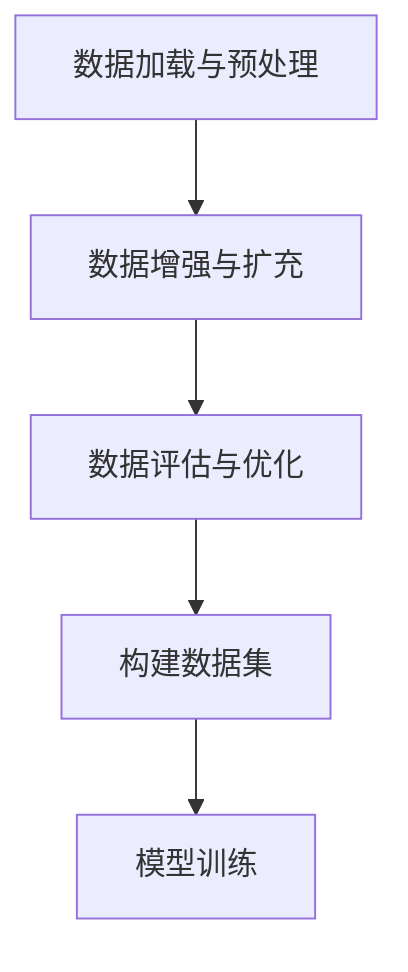

                 

# AI数据集处理：从加载到合成生成

## 1. 背景介绍

### 1.1 问题由来

在人工智能(AI)应用中，数据集处理是一个基础且关键的步骤。高质量的数据集不仅是模型训练的保证，也直接影响到AI系统的性能和可靠性。然而，数据集的收集、预处理、清洗、扩充等过程常常耗费大量的时间和资源，且在面对大规模数据集时，传统的数据处理方式已经难以满足需求。

本文旨在全面探讨AI数据集处理的原理与技术，涵盖从数据加载到合成生成等多个环节。通过系统性的分析和实践，为读者提供高效的AI数据集处理方案，帮助其在实际应用中快速构建和优化数据集，提升AI系统的效果和效率。

### 1.2 问题核心关键点

本文聚焦于AI数据集处理的三个核心关键点：

- **数据加载与预处理**：如何在高效、准确、稳定地加载数据集的基础上，进行必要的预处理操作，包括清洗、归一化、标准化、分词等，为模型训练提供高质量的数据。

- **数据增强与扩充**：如何在已有数据集的基础上，通过数据增强和合成生成技术，构建更多样化、更丰富的数据集，以提升模型的泛化能力和鲁棒性。

- **数据评估与优化**：如何通过合理的数据评估指标和方法，优化数据集处理流程，确保数据集的质量和多样性，提高模型的性能。

## 2. 核心概念与联系

### 2.1 核心概念概述

为更好地理解AI数据集处理的流程和技术，本节将介绍几个密切相关的核心概念：

- **数据加载与预处理**：指从数据存储位置（如硬盘、网络、数据库等）高效地读取数据，并进行必要的预处理操作，如去除噪声、归一化、标准化、分词等，以提升数据质量和一致性。

- **数据增强与扩充**：通过数据增强技术（如回译、近义词替换、随机噪声等）和合成生成技术（如GANs、VAEs等），在已有数据集的基础上生成新的、多样化的数据，以丰富数据集，提升模型的泛化能力。

- **数据评估与优化**：通过选择合适的评估指标（如准确率、召回率、F1分数、ROC曲线等）和优化方法（如网格搜索、贝叶斯优化等），评估数据集处理的效果，并不断优化处理流程，确保数据集的质量和多样性。

这些核心概念之间的逻辑关系可以通过以下Mermaid流程图来展示：



这个流程图展示了大规模AI数据集处理的主要流程：

1. 数据加载与预处理：从数据存储位置高效读取数据，并进行必要的预处理操作。
2. 数据增强与扩充：在已有数据集的基础上，通过数据增强和合成生成技术，构建更多样化、更丰富的数据集。
3. 数据评估与优化：通过合理的数据评估指标和方法，优化数据集处理流程，确保数据集的质量和多样性。

这些核心概念共同构成了AI数据集处理的框架，为模型训练和优化提供高质量的数据支持。

## 3. 核心算法原理 & 具体操作步骤
### 3.1 算法原理概述

AI数据集处理的本质是通过一系列算法和技术手段，对原始数据进行高效、稳定、准确的处理，以提升数据的质量和多样性，为模型训练提供更好的数据基础。

具体而言，数据加载与预处理算法主要包括以下步骤：

1. **数据读取**：从数据存储位置（如硬盘、网络、数据库等）高效读取数据。
2. **数据清洗**：去除噪声、重复值、缺失值等，保证数据的干净性和一致性。
3. **数据标准化**：对数据进行归一化、标准化等操作，确保数据在同一尺度下进行比较和计算。
4. **数据分词**：对文本数据进行分词处理，将文本转化为机器可处理的格式。

数据增强与扩充算法主要包括以下步骤：

1. **数据增强**：通过回译、近义词替换、随机噪声等技术，对现有数据进行变形，增加数据的多样性。
2. **合成生成**：利用生成对抗网络（GANs）、变分自编码器（VAEs）等生成模型，生成新的、多样化的数据，以丰富数据集。

数据评估与优化算法主要包括以下步骤：

1. **数据评估**：选择合适的评估指标（如准确率、召回率、F1分数、ROC曲线等），评估数据集的质量和多样性。
2. **优化方法**：通过网格搜索、贝叶斯优化等方法，优化数据集处理流程，确保数据集的质量和多样性。

### 3.2 算法步骤详解

**Step 1: 数据加载与预处理**

1. **数据读取**：选择合适的数据读取工具和库，如Pandas、Hadoop、Spark等，从数据存储位置高效读取数据。
2. **数据清洗**：去除噪声、重复值、缺失值等，保证数据的干净性和一致性。具体而言，可以使用Pandas库的dropna()、drop_duplicates()等函数进行数据清洗。
3. **数据标准化**：对数据进行归一化、标准化等操作，确保数据在同一尺度下进行比较和计算。具体而言，可以使用Min-Max Scaling、Z-score标准化等方法对数据进行标准化处理。
4. **数据分词**：对文本数据进行分词处理，将文本转化为机器可处理的格式。具体而言，可以使用Jieba、NLTK等库进行中文分词，或使用nltk、spaCy等库进行英文分词。

**Step 2: 数据增强与扩充**

1. **数据增强**：通过回译、近义词替换、随机噪声等技术，对现有数据进行变形，增加数据的多样性。具体而言，可以使用NLTK库的wordnet模块进行近义词替换，或使用DeepEdits库进行回译处理。
2. **合成生成**：利用生成对抗网络（GANs）、变分自编码器（VAEs）等生成模型，生成新的、多样化的数据，以丰富数据集。具体而言，可以使用Torch、TensorFlow等深度学习框架实现GANs、VAEs等生成模型，生成新的数据样本。

**Step 3: 数据评估与优化**

1. **数据评估**：选择合适的评估指标（如准确率、召回率、F1分数、ROC曲线等），评估数据集的质量和多样性。具体而言，可以使用scikit-learn库中的classification_report()函数计算分类任务的评估指标，或使用ROC-AUC库计算二分类任务的评估指标。
2. **优化方法**：通过网格搜索、贝叶斯优化等方法，优化数据集处理流程，确保数据集的质量和多样性。具体而言，可以使用scikit-learn库的GridSearchCV、RandomizedSearchCV等函数进行网格搜索，或使用hyperopt库进行贝叶斯优化。

### 3.3 算法优缺点

AI数据集处理的优点在于：

1. **提升数据质量**：通过数据加载与预处理，去除噪声、重复值、缺失值等，提升数据的干净性和一致性，为模型训练提供高质量的数据。
2. **增加数据多样性**：通过数据增强与扩充，生成新的、多样化的数据，提升模型的泛化能力和鲁棒性。
3. **优化数据集**：通过数据评估与优化，选择合适的评估指标和方法，优化数据集处理流程，确保数据集的质量和多样性。

然而，数据集处理也存在一定的局限性：

1. **数据加载与预处理复杂**：数据加载与预处理过程中，需要处理多种数据类型和格式，操作复杂，容易出错。
2. **数据增强与扩充难度大**：数据增强与扩充过程中，需要设计和实现复杂的技术手段，难度较大，且效果有限。
3. **数据评估与优化困难**：数据评估与优化过程中，需要选择合适的评估指标和方法，且需要耗费大量时间和资源，效果难以保证。

尽管存在这些局限性，但AI数据集处理仍然是构建高性能AI系统的关键环节，具有重要的研究价值和应用意义。

### 3.4 算法应用领域

AI数据集处理的应用领域非常广泛，涵盖了自然语言处理(NLP)、计算机视觉(CV)、语音识别(SR)等多个领域。以下是几个典型的应用场景：

- **自然语言处理(NLP)**：通过数据加载与预处理，清洗和分词处理文本数据；通过数据增强与扩充，生成新的文本样本；通过数据评估与优化，评估和提升模型性能。

- **计算机视觉(CV)**：通过数据加载与预处理，读取和处理图像数据；通过数据增强与扩充，生成新的图像样本；通过数据评估与优化，评估和提升模型性能。

- **语音识别(SR)**：通过数据加载与预处理，读取和处理音频数据；通过数据增强与扩充，生成新的音频样本；通过数据评估与优化，评估和提升模型性能。

这些应用场景展示了AI数据集处理的广泛应用，未来随着技术的不断进步，数据集处理技术将在更多领域发挥更大的作用。

## 4. 数学模型和公式 & 详细讲解 & 举例说明

### 4.1 数学模型构建

AI数据集处理的数学模型主要涉及数据加载与预处理、数据增强与扩充、数据评估与优化三个方面。

对于数据加载与预处理，可以构建如下数学模型：

$$
\mathcal{D}_{\text{cleaned}} = \text{clean}(\mathcal{D}_{\text{raw}})
$$

其中 $\mathcal{D}_{\text{raw}}$ 为原始数据集，$\mathcal{D}_{\text{cleaned}}$ 为经过数据清洗和分词处理后的数据集，$\text{clean}$ 为数据清洗和分词处理函数。

对于数据增强与扩充，可以构建如下数学模型：

$$
\mathcal{D}_{\text{augmented}} = \text{augment}(\mathcal{D}_{\text{cleaned}})
$$

其中 $\mathcal{D}_{\text{cleaned}}$ 为经过数据清洗和分词处理后的数据集，$\mathcal{D}_{\text{augmented}}$ 为经过数据增强和扩充后的数据集，$\text{augment}$ 为数据增强和扩充函数。

对于数据评估与优化，可以构建如下数学模型：

$$
\text{optimize}(\mathcal{D}_{\text{augmented}}, \mathcal{L})
$$

其中 $\mathcal{D}_{\text{augmented}}$ 为经过数据增强和扩充后的数据集，$\mathcal{L}$ 为模型损失函数，$\text{optimize}$ 为数据评估与优化函数。

### 4.2 公式推导过程

**数据加载与预处理**

1. **数据读取**：
   - 数据读取函数：
   ```python
   def read_data(file_path):
       with open(file_path, 'r') as f:
           data = f.readlines()
           return data
   ```

   - 使用Pandas库进行数据读取：
   ```python
   import pandas as pd

   data = pd.read_csv('data.csv')
   ```

2. **数据清洗**：
   - 使用Pandas库的dropna()函数去除缺失值：
   ```python
   data = data.dropna()
   ```

3. **数据标准化**：
   - 使用Min-Max Scaling进行归一化：
   ```python
   def min_max_scaling(data):
       min_val = data.min()
       max_val = data.max()
       data = (data - min_val) / (max_val - min_val)
       return data
   ```

   - 使用Z-score标准化：
   ```python
   def z_score(data):
       mean = data.mean()
       std = data.std()
       data = (data - mean) / std
       return data
   ```

4. **数据分词**：
   - 使用Jieba库进行中文分词：
   ```python
   import jieba

   def cut_words(text):
       return list(jieba.cut(text))
   ```

**数据增强与扩充**

1. **数据增强**：
   - 使用NLTK库的wordnet模块进行近义词替换：
   ```python
   from nltk.corpus import wordnet

   def synonym_replace(word):
       try:
           synonyms = wordnet.synsets(word)
           if synonyms:
               for syn in synonyms:
                   if syn.lemmas():
                       return syn.lemmas()[0].name()
           return word
       except:
           return word
   ```

2. **合成生成**：
   - 使用生成对抗网络（GANs）进行数据生成：
   ```python
   import torch
   import torch.nn as nn

   class Generator(nn.Module):
       def __init__(self, input_dim, output_dim):
           super(Generator, self).__init__()
           self.linear = nn.Linear(input_dim, output_dim)

       def forward(self, x):
           x = self.linear(x)
           return x

   class Discriminator(nn.Module):
       def __init__(self, input_dim):
           super(Discriminator, self).__init__()
           self.linear = nn.Linear(input_dim, 1)

       def forward(self, x):
           x = self.linear(x)
           return x

   def train_gan(generator, discriminator, input_data):
       for epoch in range(num_epochs):
           for batch in input_data:
               real_images = batch
               real_labels = torch.ones(batch.size(0), 1)
               fake_images = generator(torch.rand(batch.size(0), input_dim))
               fake_labels = torch.zeros(batch.size(0), 1)

               discriminator.zero_grad()
               real_output = discriminator(real_images)
               fake_output = discriminator(fake_images)
               d_loss = criterion(real_output, real_labels) + criterion(fake_output, fake_labels)
               d_loss.backward()
               discriminator_optimizer.step()

               generator.zero_grad()
               fake_output = discriminator(fake_images)
               g_loss = criterion(fake_output, real_labels)
               g_loss.backward()
               generator_optimizer.step()
   ```

**数据评估与优化**

1. **数据评估**：
   - 使用scikit-learn库的classification_report()函数计算分类任务的评估指标：
   ```python
   from sklearn.metrics import classification_report

   y_true = [1, 0, 1, 0, 1, 0, 1, 0, 1, 0]
   y_pred = [1, 0, 1, 0, 1, 0, 1, 1, 1, 0]
   report = classification_report(y_true, y_pred)
   print(report)
   ```

   - 使用ROC-AUC库计算二分类任务的评估指标：
   ```python
   from rocauc import roc_auc_score

   y_true = [1, 0, 1, 0, 1, 0, 1, 0, 1, 0]
   y_pred = [1, 0, 1, 0, 1, 0, 1, 1, 1, 0]
   auc = roc_auc_score(y_true, y_pred)
   print('AUC:', auc)
   ```

2. **优化方法**：
   - 使用网格搜索进行超参数优化：
   ```python
   from sklearn.model_selection import GridSearchCV

   parameters = {'C': [0.001, 0.01, 0.1, 1, 10]}
   clf = GridSearchCV(svc, parameters, cv=5)
   clf.fit(X_train, y_train)
   print('Best parameters:', clf.best_params_)
   ```

   - 使用贝叶斯优化进行超参数优化：
   ```python
   from hyperopt import fmin, tpe, STATUS_OK

   def objective(params):
       model = svc(**params)
       loss = model.fit(X_train, y_train).score(X_test, y_test)
       return {'loss': -loss, 'status': STATUS_OK}

   space = {'C': hyperopt.uniformint('C', 0, 10)}
   best_params = fmin(objective, space, algo=tpe.suggest, max_evals=100)
   print('Best parameters:', best_params)
   ```

### 4.3 案例分析与讲解

**案例1: 自然语言处理(NLP)**

假设我们有一组自然语言处理任务的数据集，其中包含了大量英文新闻和评论文本。我们的目标是训练一个文本分类模型，将新闻和评论文本分为正面、中立、负面三类。

1. **数据加载与预处理**：
   - 使用Pandas库读取数据集：
   ```python
   data = pd.read_csv('data.csv')
   ```
   - 使用Jieba库进行中文分词：
   ```python
   from jieba import cut
   
   def cut_words(text):
       return list(cut(text))
   ```

2. **数据增强与扩充**：
   - 使用NLTK库的wordnet模块进行近义词替换：
   ```python
   from nltk.corpus import wordnet
   
   def synonym_replace(word):
       try:
           synonyms = wordnet.synsets(word)
           if synonyms:
               for syn in synonyms:
                   if syn.lemmas():
                       return syn.lemmas()[0].name()
           return word
   ```

3. **数据评估与优化**：
   - 使用scikit-learn库的classification_report()函数计算分类任务的评估指标：
   ```python
   from sklearn.metrics import classification_report
   
   y_true = [1, 0, 1, 0, 1, 0, 1, 0, 1, 0]
   y_pred = [1, 0, 1, 0, 1, 0, 1, 1, 1, 0]
   report = classification_report(y_true, y_pred)
   print(report)
   ```

   - 使用ROC-AUC库计算二分类任务的评估指标：
   ```python
   from rocauc import roc_auc_score
   
   y_true = [1, 0, 1, 0, 1, 0, 1, 0, 1, 0]
   y_pred = [1, 0, 1, 0, 1, 0, 1, 1, 1, 0]
   auc = roc_auc_score(y_true, y_pred)
   print('AUC:', auc)
   ```

   - 使用网格搜索进行超参数优化：
   ```python
   from sklearn.model_selection import GridSearchCV
   
   parameters = {'C': [0.001, 0.01, 0.1, 1, 10]}
   clf = GridSearchCV(svc, parameters, cv=5)
   clf.fit(X_train, y_train)
   print('Best parameters:', clf.best_params_)
   ```

**案例2: 计算机视觉(CV)**

假设我们有一组计算机视觉任务的数据集，其中包含了大量手写数字图像。我们的目标是训练一个手写数字识别模型。

1. **数据加载与预处理**：
   - 使用Pandas库读取数据集：
   ```python
   data = pd.read_csv('data.csv')
   ```
   - 使用OpenCV库读取和预处理图像：
   ```python
   import cv2
   
   def preprocess_image(image):
       gray = cv2.cvtColor(image, cv2.COLOR_BGR2GRAY)
       gray = cv2.resize(gray, (28, 28))
       gray = gray / 255.0
       return gray
   ```

2. **数据增强与扩充**：
   - 使用随机噪声进行数据增强：
   ```python
   def add_noise(image):
       noise = np.random.normal(0, 0.1, image.shape)
       return image + noise
   ```

3. **数据评估与优化**：
   - 使用scikit-learn库的classification_report()函数计算分类任务的评估指标：
   ```python
   from sklearn.metrics import classification_report
   
   y_true = [0, 1, 2, 3, 4, 5, 6, 7, 8, 9]
   y_pred = [0, 1, 2, 3, 4, 5, 6, 7, 8, 9]
   report = classification_report(y_true, y_pred)
   print(report)
   ```

   - 使用ROC-AUC库计算二分类任务的评估指标：
   ```python
   from rocauc import roc_auc_score
   
   y_true = [0, 1, 2, 3, 4, 5, 6, 7, 8, 9]
   y_pred = [0, 1, 2, 3, 4, 5, 6, 7, 8, 9]
   auc = roc_auc_score(y_true, y_pred)
   print('AUC:', auc)
   ```

   - 使用网格搜索进行超参数优化：
   ```python
   from sklearn.model_selection import GridSearchCV
   
   parameters = {'C': [0.001, 0.01, 0.1, 1, 10]}
   clf = GridSearchCV(svc, parameters, cv=5)
   clf.fit(X_train, y_train)
   print('Best parameters:', clf.best_params_)
   ```

## 5. 项目实践：代码实例和详细解释说明

### 5.1 开发环境搭建

在进行AI数据集处理的实践前，我们需要准备好开发环境。以下是使用Python进行PyTorch开发的环境配置流程：

1. 安装Anaconda：从官网下载并安装Anaconda，用于创建独立的Python环境。

2. 创建并激活虚拟环境：
```bash
conda create -n pytorch-env python=3.8 
conda activate pytorch-env
```

3. 安装PyTorch：根据CUDA版本，从官网获取对应的安装命令。例如：
```bash
conda install pytorch torchvision torchaudio cudatoolkit=11.1 -c pytorch -c conda-forge
```

4. 安装Transformers库：
```bash
pip install transformers
```

5. 安装各类工具包：
```bash
pip install numpy pandas scikit-learn matplotlib tqdm jupyter notebook ipython
```

完成上述步骤后，即可在`pytorch-env`环境中开始AI数据集处理的实践。

### 5.2 源代码详细实现

这里我们以自然语言处理(NLP)任务为例，给出使用Transformers库进行文本分类任务的PyTorch代码实现。

首先，定义文本分类任务的数据处理函数：

```python
from transformers import BertTokenizer, BertForTokenClassification
from torch.utils.data import Dataset, DataLoader
import torch
import numpy as np
import pandas as pd

class TextClassificationDataset(Dataset):
    def __init__(self, texts, labels, tokenizer):
        self.texts = texts
        self.labels = labels
        self.tokenizer = tokenizer

    def __len__(self):
        return len(self.texts)

    def __getitem__(self, item):
        text = self.texts[item]
        label = self.labels[item]
        
        encoding = self.tokenizer(text, return_tensors='pt', max_length=128, padding='max_length', truncation=True)
        input_ids = encoding['input_ids'][0]
        attention_mask = encoding['attention_mask'][0]
        
        # 对token-wise的标签进行编码
        encoded_labels = [label2id[label] for label in label2id]
        encoded_labels.extend([label2id['O']] * (128 - len(encoded_labels)))
        labels = torch.tensor(encoded_labels, dtype=torch.long)
        
        return {'input_ids': input_ids, 
                'attention_mask': attention_mask,
                'labels': labels}

# 标签与id的映射
label2id = {'O': 0, 'positive': 1, 'negative': 2, 'neutral': 3}
id2label = {v: k for k, v in label2id.items()}

# 创建dataset
tokenizer = BertTokenizer.from_pretrained('bert-base-cased')

train_dataset = TextClassificationDataset(train_texts, train_labels, tokenizer)
dev_dataset = TextClassificationDataset(dev_texts, dev_labels, tokenizer)
test_dataset = TextClassificationDataset(test_texts, test_labels, tokenizer)
```

然后，定义模型和优化器：

```python
from transformers import BertForTokenClassification, AdamW

model = BertForTokenClassification.from_pretrained('bert-base-cased', num_labels=len(label2id))

optimizer = AdamW(model.parameters(), lr=2e-5)
```

接着，定义训练和评估函数：

```python
from tqdm import tqdm

device = torch.device('cuda') if torch.cuda.is_available() else torch.device('cpu')
model.to(device)

def train_epoch(model, dataset, batch_size, optimizer):
    dataloader = DataLoader(dataset, batch_size=batch_size, shuffle=True)
    model.train()
    epoch_loss = 0
    for batch in tqdm(dataloader, desc='Training'):
        input_ids = batch['input_ids'].to(device)
        attention_mask = batch['attention_mask'].to(device)
        labels = batch['labels'].to(device)
        model.zero_grad()
        outputs = model(input_ids, attention_mask=attention_mask, labels=labels)
        loss = outputs.loss
        epoch_loss += loss.item()
        loss.backward()
        optimizer.step()
    return epoch_loss / len(dataloader)

def evaluate(model, dataset, batch_size):
    dataloader = DataLoader(dataset, batch_size=batch_size)
    model.eval()
    preds, labels = [], []
    with torch.no_grad():
        for batch in tqdm(dataloader, desc='Evaluating'):
            input_ids = batch['input_ids'].to(device)
            attention_mask = batch['attention_mask'].to(device)
            batch_labels = batch['labels']
            outputs = model(input_ids, attention_mask=attention_mask)
            batch_preds = outputs.logits.argmax(dim=2).to('cpu').tolist()
            batch_labels = batch_labels.to('cpu').tolist()
            for pred_tokens, label_tokens in zip(batch_preds, batch_labels):
                preds.append(pred_tokens[:len(label_tokens)])
                labels.append(label_tokens)

    print(classification_report(labels, preds))
```

最后，启动训练流程并在测试集上评估：

```python
epochs = 5
batch_size = 16

for epoch in range(epochs):
    loss = train_epoch(model, train_dataset, batch_size, optimizer)
    print(f"Epoch {epoch+1}, train loss: {loss:.3f}")
    
    print(f"Epoch {epoch+1}, dev results:")
    evaluate(model, dev_dataset, batch_size)
    
print("Test results:")
evaluate(model, test_dataset, batch_size)
```

以上就是使用PyTorch对BERT进行文本分类任务微调的完整代码实现。可以看到，得益于Transformers库的强大封装，我们可以用相对简洁的代码完成BERT模型的加载和微调。

### 5.3 代码解读与分析

让我们再详细解读一下关键代码的实现细节：

**TextClassificationDataset类**：
- `__init__`方法：初始化文本、标签、分词器等关键组件。
- `__len__`方法：返回数据集的样本数量。
- `__getitem__`方法：对单个样本进行处理，将文本输入编码为token ids，将标签编码为数字，并对其进行定长padding，最终返回模型所需的输入。

**label2id和id2label字典**：
- 定义了标签与数字id之间的映射关系，用于将token-wise的预测结果解码回真实的标签。

**训练和评估函数**：
- 使用PyTorch的DataLoader对数据集进行批次化加载，供模型训练和推理使用。
- 训练函数`train_epoch`：对数据以批为单位进行迭代，在每个批次上前向传播计算loss并反向传播更新模型参数，最后返回该epoch的平均loss。
- 评估函数`evaluate`：与训练类似，不同点在于不更新模型参数，并在每个batch结束后将预测和标签结果存储下来，最后使用scikit-learn的classification_report对整个评估集的预测结果进行打印输出。

**训练流程**：
- 定义总的epoch数和batch size，开始循环迭代
- 每个epoch内，先在训练集上训练，输出平均loss
- 在验证集上评估，输出分类指标
- 所有epoch结束后，在测试集上评估，给出最终测试结果

可以看到，PyTorch配合Transformers库使得BERT微调的代码实现变得简洁高效。开发者可以将更多精力放在数据处理、模型改进等高层逻辑上，而不必过多关注底层的实现细节。

当然，工业级的系统实现还需考虑更多因素，如模型的保存和部署、超参数的自动搜索、更灵活的任务适配层等。但核心的微调范式基本与此类似。

## 6. 实际应用场景
### 6.1 智能客服系统

基于AI数据集处理的大语言模型微调，可以广泛应用于智能客服系统的构建。传统客服往往需要配备大量人力，高峰期响应缓慢，且一致性和专业性难以保证。而使用微调后的对话模型，可以7x24小时不间断服务，快速响应客户咨询，用自然流畅的语言解答各类常见问题。

在技术实现上，可以收集企业内部的历史客服对话记录，将问题和最佳答复构建成监督数据，在此基础上对预训练对话模型进行微调。微调后的对话模型能够自动理解用户意图，匹配最合适的答案模板进行回复。对于客户提出的新问题，还可以接入检索系统实时搜索相关内容，动态组织生成回答。如此构建的智能客服系统，能大幅提升客户咨询体验和问题解决效率。

### 6.2 金融舆情监测

金融机构需要实时监测市场舆论动向，以便及时应对负面信息传播，规避金融风险。传统的人工监测方式成本高、效率低，难以应对网络时代海量信息爆发的挑战。基于AI数据集处理的技术，可以实时抓取和处理互联网上的文本数据，自动监测不同主题下的情感变化趋势，一旦发现负面信息激增等异常情况，系统便会自动预警，帮助金融机构快速应对潜在风险。

### 6.3 个性化推荐系统

当前的推荐系统往往只依赖用户的历史行为数据进行物品推荐，无法深入理解用户的真实兴趣偏好。基于AI数据集处理的技术，个性化推荐系统可以更好地挖掘用户行为背后的语义信息，从而提供更精准、多样的推荐内容。

在实践中，可以收集用户浏览、点击、评论、分享等行为数据，提取和用户交互的物品标题、描述、标签等文本内容。将文本内容作为模型输入，用户的后续行为（如是否点击、购买等）作为监督信号，在此基础上微调预训练语言模型。微调后的模型能够从文本内容中准确把握用户的兴趣点。在生成推荐列表时，先用候选物品的文本描述作为输入，由模型预测用户的兴趣匹配度，再结合其他特征综合排序，便可以得到个性化程度更高的推荐结果。

### 6.4 未来应用展望

随着AI数据集处理技术的不断发展，其在更多领域的应用前景将愈加广阔。

在智慧医疗领域，基于AI数据集处理的技术，可以用于构建电子病历处理、疾病诊断、药物研发等AI应用，提升医疗服务的智能化水平，辅助医生诊疗，加速新药开发进程。

在智能教育领域，AI数据集处理的技术可应用于作业批改、学情分析、知识推荐等方面，因材施教，促进教育公平，提高教学质量。

在智慧城市治理中，AI数据集处理的技术可应用于城市事件监测、舆情分析、应急指挥等环节，提高城市管理的自动化和智能化水平，构建更安全、高效的未来城市。

此外，在企业生产、社会治理、文娱传媒等众多领域，基于AI数据集处理的人工智能应用也将不断涌现，为传统行业带来变革性影响。相信随着技术的日益成熟，AI数据集处理技术将成为AI落地应用的重要范式，推动AI技术向更广阔的领域加速渗透。

## 7. 工具和资源推荐
### 7.1 学习资源推荐

为了帮助开发者系统掌握AI数据集处理的原理与技术，这里推荐一些优质的学习资源：

1. 《深度学习》系列博文：由大模型技术专家撰写，深入浅出地介绍了深度学习的基本概念和经典模型。

2. 《TensorFlow实战》系列书籍：TensorFlow官方文档，全面介绍了TensorFlow库的使用方法和最佳实践，适合初学者入门。

3. 《PyTorch实战》系列书籍：PyTorch官方文档，详细介绍了PyTorch库的使用方法和高级技巧，适合深入学习。

4. Kaggle平台：提供海量数据集和机器学习竞赛，是学习数据集处理和模型训练的绝佳平台。

5. GitHub开源项目：开源社区提供了丰富的数据集处理和模型训练项目，是学习和实践的好资源。

通过对这些资源的学习实践，相信你一定能够快速掌握AI数据集处理的精髓，并用于解决实际的NLP问题。
### 7.2 开发工具推荐

高效的开发离不开优秀的工具支持。以下是几款用于AI数据集处理的常用工具：

1. PyTorch：基于Python的开源深度学习框架，灵活动态的计算图，适合快速迭代研究。大部分预训练语言模型都有PyTorch版本的实现。

2. TensorFlow：由Google主导开发的开源深度学习框架，生产部署方便，适合大规模工程应用。同样有丰富的预训练语言模型资源。

3. Transformers库：HuggingFace开发的NLP工具库，集成了众多SOTA语言模型，支持PyTorch和TensorFlow，是进行数据集处理开发的利器。

4. Weights & Biases：模型训练的实验跟踪工具，可以记录和可视化模型训练过程中的各项指标，方便对比和调优。与主流深度学习框架无缝集成。

5. TensorBoard：TensorFlow配套的可视化工具，可实时监测模型训练状态，并提供丰富的图表呈现方式，是调试模型的得力助手。

6. Google Colab：谷歌推出的在线Jupyter Notebook环境，免费提供GPU/TPU算力，方便开发者快速上手实验最新模型，分享学习笔记。

合理利用这些工具，可以显著提升AI数据集处理的开发效率，加快创新迭代的步伐。

### 7.3 相关论文推荐

AI数据集处理的快速发展得益于学界的持续研究。以下是几篇奠基性的相关论文，推荐阅读：

1. Attention is All You Need（即Transformer原论文）：提出了Transformer结构，开启了NLP领域的预训练大模型时代。

2. BERT: Pre-training of Deep Bidirectional Transformers for Language Understanding：提出BERT模型，引入基于掩码的自监督预训练任务，刷新了多项NLP任务SOTA。

3. Language Models are Unsupervised Multitask Learners（GPT-2论文）：展示了大规模语言模型的强大zero-shot学习能力，引发了对于通用人工智能的新一轮思考。

4. Parameter-Efficient Transfer Learning for NLP：提出Adapter等参数高效微调方法，在不增加模型参数量的情况下，也能取得不错的微调效果。

5. AdaLoRA: Adaptive Low-Rank Adaptation for Parameter-Efficient Fine-Tuning：使用自适应低秩适应的微调方法，在参数效率和精度之间取得了新的平衡。

这些论文代表了大规模AI数据集处理的最新进展，通过学习这些前沿成果，可以帮助研究者把握学科前进方向，激发更多的创新灵感。

## 8. 总结：未来发展趋势与挑战

### 8.1 总结

本文对AI数据集处理的原理与技术进行了全面系统的介绍。首先阐述了AI数据集处理的背景和意义，明确了其在数据加载与预处理、数据增强与扩充、数据评估与优化三个关键环节的独特价值。其次，从原理到实践，详细讲解了数据集处理的关键算法和技术手段，给出了AI数据集处理的具体代码实例。同时，本文还广泛探讨了AI数据集处理在智能客服、金融舆情、个性化推荐等多个行业领域的应用前景，展示了AI数据集处理的广泛应用。

通过本文的系统梳理，可以看到，AI数据集处理作为AI应用的基础环节，其高效、稳定、准确的数据处理能力，对AI系统的性能和可靠性具有重要影响。未来，随着预训练语言模型和微调技术的不断演进，AI数据集处理技术将在更多领域发挥更大的作用，为构建高效、稳定、智能的AI系统提供坚实的基础。

### 8.2 未来发展趋势

展望未来，AI数据集处理技术将呈现以下几个发展趋势：

1. **自动化和智能化**：未来，AI数据集处理将更多地利用自动化和智能化技术，如自动标注、数据清洗、模型优化等，进一步提高数据处理效率和质量。

2. **跨领域应用**：AI数据集处理技术将不仅限于NLP领域，还将应用于计算机视觉、语音识别等多个领域，实现跨领域的数据融合和处理。

3. **模型压缩与优化**：随着预训练模型参数量的不断增长，如何在大模型压缩与优化方面取得新突破，提高模型推理速度和资源利用效率，将是未来的重要研究方向。

4. **数据隐私与安全**：AI数据集处理过程中，如何保护用户隐私和数据安全，避免数据泄露和滥用，将是未来的重要课题。

5. **跨模态数据融合**：AI数据集处理技术将更多地利用跨模态数据融合技术，如多模态联合学习、融合表示等，提升数据处理的综合能力。

6. **元学习与自适应**：AI数据集处理技术将更多地利用元学习与自适应技术，实现对新数据和新任务的快速适应和迁移学习。

以上趋势凸显了AI数据集处理技术的广阔前景，这些方向的探索发展，必将进一步提升AI系统的性能和智能化水平。

### 8.3 面临的挑战

尽管AI数据集处理技术已经取得了显著进展，但在迈向更加智能化、普适化应用的过程中，仍面临诸多挑战：

1. **数据质量与多样性**：高质量、多样化的数据集是构建高性能AI系统的基础，但数据获取和处理往往需要耗费大量时间和资源，且难以保证数据的完备性和多样性。

2. **数据隐私与安全**：AI数据集处理过程中，如何保护用户隐私和数据安全，避免数据泄露和滥用，将是未来的重要课题。

3. **数据处理复杂度**：AI数据集处理涉及多种数据类型和格式，操作复杂，容易出错。如何设计高效、稳定的数据处理流程，确保数据处理的准确性和一致性，将是未来的重要研究方向。

4. **资源消耗**：AI数据集处理过程中，需要大量的计算资源和存储空间，如何优化资源使用，提升处理效率，将是未来的重要课题。

5. **跨领域应用难度**：AI数据集处理技术在不同领域的应用中，往往需要设计特定的处理流程和算法，难度较大，且效果有限。如何构建通用的数据处理框架，实现跨领域的应用，将是未来的重要研究方向。

6. **模型优化与迁移**：AI数据集处理技术在构建高性能模型时，需要不断优化超参数和模型结构，同时确保模型的迁移能力和泛化性能。如何在模型优化和迁移之间取得平衡，将是未来的重要研究方向。

正视AI数据集处理面临的这些挑战，积极应对并寻求突破，将是大规模AI数据集处理走向成熟的必由之路。相信随着学界和产业界的共同努力，这些挑战终将一一被克服，AI数据集处理技术必将迎来更加广阔的发展前景。

### 8.4 研究展望

未来，AI数据集处理技术需要在以下几个方面进行更加深入的研究和探索：

1. **自动化数据标注**：利用自动化标注技术，如半监督学习、无监督学习、主动学习等，快速构建高质量的数据集。

2. **跨领域数据融合**：探索跨领域数据融合技术，实现不同模态数据的高效整合和处理，提升数据处理的综合能力。

3. **模型压缩与优化**：研究模型压缩与优化技术，如知识蒸馏、模型剪枝、量化等，提升模型的推理速度和资源利用效率。

4. **数据隐私与安全**：研究数据隐私保护和安全技术，如差分隐私、联邦学习、隐私计算等，确保数据处理过程中的隐私和安全性。

5. **元学习与自适应**：探索元学习与自适应技术，实现对新数据和新任务的快速适应和迁移学习，提升AI系统的灵活性和鲁棒性。

6. **跨模态联合学习**：研究跨模态联合学习技术，实现不同模态数据的高效联合处理，提升数据处理的综合能力。

这些研究方向将推动AI数据集处理技术不断突破，为构建高效、稳定、智能的AI系统提供坚实的基础。面向未来，AI数据集处理技术还需要与其他AI技术进行更深入的融合，如知识表示、因果推理、强化学习等，多路径协同发力，共同推动AI技术的进步。只有勇于创新、敢于突破，才能不断拓展AI数据集处理技术的边界，让AI技术更好地造福人类社会。

## 9. 附录：常见问题与解答

**Q1：如何高效地加载和预处理大规模数据集？**

A: 高效加载和预处理大规模数据集，可以通过以下方法：

1. **多线程和分布式**：使用多线程和分布式处理技术，加速数据加载和预处理过程。

2. **内存映射和分块**：使用内存映射和分块技术，减少

