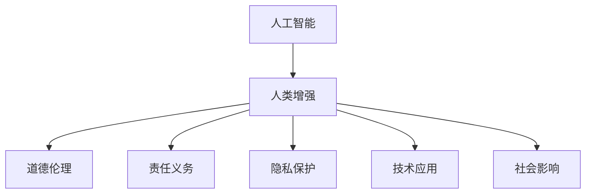

                 

# AI时代的人类增强：道德与责任

> 关键词：人工智能, 人类增强, 道德伦理, 责任义务, 隐私保护, 技术应用, 社会影响

## 1. 背景介绍

在人工智能(AI)飞速发展的当下，技术的进步不仅极大地提高了生产力和生活质量，也引发了关于技术伦理和责任的新一轮讨论。AI在带来巨大益处的同时，也伴随着潜在的风险和挑战，尤其是当AI开始深入人类的日常生活，甚至在医疗、教育、司法等高风险领域发挥作用时。本文将深入探讨AI时代下人类增强的道德与责任问题，分析技术应用中的关键挑战，并提出相应的应对策略。

## 2. 核心概念与联系

### 2.1 核心概念概述

为更好地理解AI技术在人类增强中的应用，本节将介绍几个关键概念：

- **人工智能(AI)**：利用算法和计算，使计算机系统能够模拟人类智能行为的技术，包括感知、学习、推理、规划等能力。
- **人类增强**：通过技术手段提升人类的认知、情感、体能等能力，增强人类在复杂环境中的生存和适应能力。
- **道德伦理**：涉及人类行为正确与否的价值观、规范和原则，AI伦理旨在确保AI系统的决策和行为符合人类社会的道德标准。
- **责任义务**：技术开发和使用过程中的行为责任，包括对用户、社会和环境的义务。
- **隐私保护**：确保个人信息不被未经授权地访问、使用或泄露，保护用户数据安全。
- **技术应用**：AI技术在医疗、教育、司法等领域的具体应用场景，提升这些领域的服务水平和工作效率。
- **社会影响**：AI技术对社会结构、就业、教育、文化等各方面产生的影响，包括正面和负面效应。

这些概念之间的逻辑关系可以通过以下Mermaid流程图来展示：



这个流程图展示了一些关键概念之间的联系，使得我们能够更清晰地理解AI时代人类增强的复杂性。

## 3. 核心算法原理 & 具体操作步骤

### 3.1 算法原理概述

AI时代的人类增强通常通过以下步骤实现：

1. **数据采集**：收集人类行为数据，包括生理信号、环境数据、行为日志等。
2. **数据分析**：使用机器学习、深度学习等技术对数据进行模式识别、特征提取、行为预测等分析。
3. **模型训练**：构建AI模型，如神经网络、强化学习模型等，训练模型以学习数据的特征和规律。
4. **模型应用**：将训练好的模型应用于实际场景，如健康监测、智能辅助、教育辅导等，提供增强服务。

### 3.2 算法步骤详解

#### 数据采集
- **传感器数据**：使用传感器收集生理数据，如心率、血压、脑电波等。
- **环境数据**：记录环境参数，如光照、温度、噪音等，影响人类行为和健康。
- **行为日志**：记录人类的行为轨迹，如位置、动作、活动时间等。

#### 数据分析
- **特征提取**：使用统计学、机器学习算法提取有用的特征，如心率变化、运动轨迹等。
- **模式识别**：利用机器学习模型识别行为模式，如运动习惯、情绪状态等。
- **行为预测**：使用预测模型，如时间序列分析、回归模型等，预测未来行为。

#### 模型训练
- **模型选择**：选择合适的模型架构和算法，如卷积神经网络(CNN)、循环神经网络(RNN)、深度强化学习(DRL)等。
- **数据预处理**：对数据进行归一化、标准化等预处理，提高模型训练效果。
- **模型训练**：在训练数据上训练模型，调整模型参数，优化损失函数。

#### 模型应用
- **实时监测**：将模型部署到实时监控系统中，如健康监测、安全监控等。
- **智能辅助**：利用模型提供智能建议和决策支持，如智能家居、自动驾驶等。
- **教育辅导**：通过分析学习数据，提供个性化的学习方案和反馈，提升教育效果。

### 3.3 算法优缺点

**优点**：
- **高效准确**：AI技术可以快速处理和分析大量数据，提供高效的决策支持。
- **个性化**：能够根据个体差异提供定制化服务，满足不同用户的需求。
- **实时性**：实时数据处理和决策，及时应对突发情况。

**缺点**：
- **数据隐私**：需要大量个人数据，存在数据泄露和滥用的风险。
- **伦理争议**：可能引发关于监控、决策、责任等方面的伦理问题。
- **依赖技术**：过度依赖技术，忽视了人类情感和道德判断。

### 3.4 算法应用领域

AI技术在多个领域得到了广泛应用，其中最具代表性的领域包括：

- **医疗健康**：通过数据分析和模型训练，提升疾病诊断、治疗和预防水平。
- **教育培训**：个性化学习方案和智能辅导，提升教育质量和效果。
- **智能家居**：实时监控和智能控制，提高生活质量和安全性。
- **交通运输**：自动驾驶和交通管理，提升交通效率和安全性。
- **司法执法**：智能监控和分析，辅助决策和取证。

## 4. 数学模型和公式 & 详细讲解 & 举例说明

### 4.1 数学模型构建

本节将使用数学语言对AI时代人类增强的算法进行更加严格的刻画。

设训练数据集为 $D = \{(x_i, y_i)\}_{i=1}^N$，其中 $x_i \in \mathcal{X}$ 为输入，$y_i \in \mathcal{Y}$ 为输出，$\mathcal{X}$ 为输入空间，$\mathcal{Y}$ 为输出空间。模型的参数为 $\theta$，目标函数为损失函数 $\mathcal{L}$，优化目标为：

$$
\theta^* = \mathop{\arg\min}_{\theta} \mathcal{L}(\theta, D)
$$

其中，$\mathcal{L}$ 可以采用各种损失函数，如均方误差、交叉熵等。

### 4.2 公式推导过程

以一个简单的分类任务为例，使用线性分类器。假设模型为 $h_{\theta}(x) = \theta^Tx$，其中 $\theta \in \mathbb{R}^d$，$d$ 为输入特征的维度。设训练数据集为 $D = \{(x_i, y_i)\}_{i=1}^N$，其中 $x_i \in \mathbb{R}^d$，$y_i \in \{0, 1\}$。损失函数采用交叉熵损失函数：

$$
\mathcal{L}(\theta, D) = -\frac{1}{N} \sum_{i=1}^N \left[y_i \log h_{\theta}(x_i) + (1-y_i) \log (1-h_{\theta}(x_i))\right]
$$

目标函数为：

$$
\theta^* = \mathop{\arg\min}_{\theta} \mathcal{L}(\theta, D)
$$

通过梯度下降算法，更新模型参数 $\theta$：

$$
\theta \leftarrow \theta - \eta \nabla_{\theta}\mathcal{L}(\theta, D)
$$

其中，$\eta$ 为学习率，$\nabla_{\theta}\mathcal{L}(\theta, D)$ 为损失函数对 $\theta$ 的梯度。

### 4.3 案例分析与讲解

考虑一个简单的健康监测场景，使用心率数据进行心血管疾病的预测。收集 $N$ 个患者的心率数据 $x_i$，以及是否患有心血管疾病的标签 $y_i$。构建线性分类器 $h_{\theta}(x) = \theta^Tx$，目标函数为交叉熵损失函数：

$$
\mathcal{L}(\theta, D) = -\frac{1}{N} \sum_{i=1}^N \left[y_i \log h_{\theta}(x_i) + (1-y_i) \log (1-h_{\theta}(x_i))\right]
$$

假设训练数据集 $D = \{(x_i, y_i)\}_{i=1}^N$，其中 $x_i \in \mathbb{R}^d$，$y_i \in \{0, 1\}$。使用梯度下降算法，更新模型参数 $\theta$：

$$
\theta \leftarrow \theta - \eta \nabla_{\theta}\mathcal{L}(\theta, D)
$$

通过不断迭代，训练出一个准确的心血管疾病预测模型。

## 5. 项目实践：代码实例和详细解释说明

### 5.1 开发环境搭建

在进行AI模型开发时，需要一个高效、灵活的开发环境。以下是一些推荐的开发环境配置步骤：

1. **安装Python**：选择最新版本的Python，如Python 3.9或以上。
2. **安装TensorFlow**：使用pip安装，或通过Anaconda管理。
3. **安装Keras**：使用pip安装，用于构建神经网络模型。
4. **安装TensorBoard**：使用pip安装，用于可视化模型训练过程。
5. **安装Jupyter Notebook**：用于编写和运行Python代码，支持交互式数据处理和模型调试。

### 5.2 源代码详细实现

以下是一个使用Keras实现的心脏病预测模型的代码示例：

```python
import tensorflow as tf
from tensorflow.keras import layers, models

# 构建模型
model = models.Sequential([
    layers.Dense(64, activation='relu', input_shape=(10,)),
    layers.Dense(64, activation='relu'),
    layers.Dense(1, activation='sigmoid')
])

# 编译模型
model.compile(optimizer='adam', loss='binary_crossentropy', metrics=['accuracy'])

# 训练模型
model.fit(X_train, y_train, epochs=10, batch_size=32, validation_data=(X_val, y_val))

# 评估模型
model.evaluate(X_test, y_test)
```

### 5.3 代码解读与分析

代码实现了一个人工神经网络模型，用于预测是否患有心血管疾病。模型包含三个全连接层，输出层使用 sigmoid 激活函数，输出一个概率值表示患病的可能性。模型编译时使用 Adam 优化器和二元交叉熵损失函数，训练时使用训练集 $X_{train}$ 和标签 $y_{train}$，验证时使用验证集 $X_{val}$ 和标签 $y_{val}$。

### 5.4 运行结果展示

```python
# 训练集和验证集的准确率变化
import matplotlib.pyplot as plt

plt.plot(history.history['accuracy'], label='accuracy')
plt.plot(history.history['val_accuracy'], label='val_accuracy')
plt.legend()
plt.show()

# 测试集的准确率
model.evaluate(X_test, y_test)
```

## 6. 实际应用场景

### 6.1 智能医疗健康

AI在医疗健康领域的应用已经初见成效。通过数据分析和模型训练，AI可以辅助医生进行疾病诊断、治疗方案优化、个性化医疗等。例如，使用AI进行影像分析，可以帮助医生快速识别病变区域，提供精准的诊断报告。

### 6.2 教育培训

AI在教育领域的应用主要集中在智能辅导和个性化学习方案上。通过分析学生的学习数据，AI可以为每个学生定制化学习计划，提供针对性的练习题和反馈，提升学习效果。

### 6.3 智能家居

AI技术在智能家居中的应用，可以提高生活质量和安全性。例如，智能音箱可以根据用户的语音指令进行设备控制，智能温控系统可以根据用户的习惯自动调整室内温度。

### 6.4 交通运输

自动驾驶技术是AI在交通运输领域的重要应用之一。通过感知、决策和控制技术，AI可以辅助或完全接管驾驶任务，提高交通安全和效率。

## 7. 工具和资源推荐

### 7.1 学习资源推荐

为了帮助开发者系统掌握AI技术的应用，这里推荐一些优质的学习资源：

1. **《Deep Learning》书籍**：Ian Goodfellow、Yoshua Bengio 和 Aaron Courville 的著作，深入介绍了深度学习的理论基础和实践技巧。
2. **Coursera《机器学习》课程**：Andrew Ng 的课程，涵盖机器学习的基本概念和算法。
3. **Kaggle**：数据科学竞赛平台，提供丰富的数据集和竞赛任务，提升实战经验。
4. **GitHub**：代码托管平台，可以浏览和下载开源项目，学习他人代码。

### 7.2 开发工具推荐

以下是几款用于AI开发和应用推荐的工具：

1. **PyTorch**：开源深度学习框架，支持动态计算图和灵活的模型构建。
2. **TensorFlow**：Google 开源的深度学习框架，支持分布式训练和模型部署。
3. **Keras**：高层次神经网络 API，便于快速构建和训练模型。
4. **TensorBoard**：可视化工具，用于监控和分析模型训练过程。
5. **Jupyter Notebook**：交互式编程环境，支持代码编写、数据处理和模型调试。

### 7.3 相关论文推荐

以下是几篇奠基性的相关论文，推荐阅读：

1. **《Deep Learning》书籍**：Ian Goodfellow、Yoshua Bengio 和 Aaron Courville 的著作，深入介绍了深度学习的理论基础和实践技巧。
2. **《Neural Networks and Deep Learning》书籍**：Michael Nielsen 的著作，讲解了神经网络的基本概念和训练算法。
3. **《Practical Deep Learning for Coders》书籍**：Andrej Karpathy 的著作，提供了实用的深度学习代码示例和技巧。

## 8. 总结：未来发展趋势与挑战

### 8.1 研究成果总结

AI技术在人类增强方面取得了显著进展，已经在医疗、教育、智能家居等多个领域得到广泛应用。然而，AI技术的应用也伴随着一系列的道德和伦理问题，需要社会各界的共同努力，确保技术的安全、公平和透明。

### 8.2 未来发展趋势

未来，AI技术在人类增强方面将继续快速发展，主要趋势包括：

- **技术进步**：模型架构和算法不断优化，模型精度和效率进一步提升。
- **多模态融合**：将语音、图像、文本等多模态数据进行融合，提升系统的智能水平。
- **跨领域应用**：AI技术在更多领域得到应用，如金融、法律、制造等，提供全方位的服务。
- **个性化定制**：根据用户需求和行为数据，提供定制化的解决方案，提升用户体验。

### 8.3 面临的挑战

尽管AI技术在人类增强方面取得了显著进展，但仍面临一些挑战：

- **数据隐私**：大量个人数据的收集和使用，存在数据泄露和滥用的风险。
- **伦理争议**：AI系统的决策过程可能引发关于监控、歧视、责任等方面的伦理问题。
- **技术依赖**：过度依赖技术，忽视了人类情感和道德判断。

### 8.4 研究展望

未来，需要从以下几个方面加强研究：

- **数据隐私保护**：开发隐私保护技术，确保数据安全。
- **伦理标准制定**：制定AI伦理标准，确保AI系统的公平性和透明性。
- **跨学科研究**：加强AI技术与心理学、伦理学等学科的融合，提升AI系统的道德水平。

## 9. 附录：常见问题与解答

**Q1：如何确保AI系统的公平性？**

A: 确保AI系统的公平性需要从数据、模型和算法等多个维度进行考量：

- **数据公平**：收集和处理数据时，避免数据偏差，确保数据集具有代表性。
- **模型公平**：选择公平的损失函数和评估指标，避免模型在训练过程中产生偏见。
- **算法公平**：设计公平的算法和决策规则，避免算法歧视和偏见。

**Q2：AI系统在医疗领域的应用有哪些？**

A: AI系统在医疗领域的应用广泛，包括：

- **疾病诊断**：通过图像分析和文本挖掘，辅助医生进行疾病诊断。
- **治疗方案优化**：分析患者数据，提出个性化的治疗方案。
- **健康监测**：实时监测生理指标，预警潜在健康问题。

**Q3：AI系统在教育领域的应用有哪些？**

A: AI系统在教育领域的应用包括：

- **个性化学习**：根据学生的学习数据，提供个性化的学习方案和反馈。
- **智能辅导**：通过自然语言处理技术，提供智能辅导和答疑服务。
- **作业批改**：自动批改作业，提高教师的工作效率。

**Q4：AI系统在智能家居领域的应用有哪些？**

A: AI系统在智能家居领域的应用包括：

- **智能控制**：通过语音和图像识别技术，控制家庭设备。
- **环境监测**：监测室内环境，如温度、湿度、光照等。
- **安全监控**：通过视频分析和异常检测技术，提供安全防护。

**Q5：AI系统在交通运输领域的应用有哪些？**

A: AI系统在交通运输领域的应用包括：

- **自动驾驶**：通过感知、决策和控制技术，辅助或完全接管驾驶任务。
- **交通管理**：优化交通流量，提高道路通行效率。
- **事故预测**：通过数据分析，预测潜在事故，提高安全性。

---

作者：禅与计算机程序设计艺术 / Zen and the Art of Computer Programming

