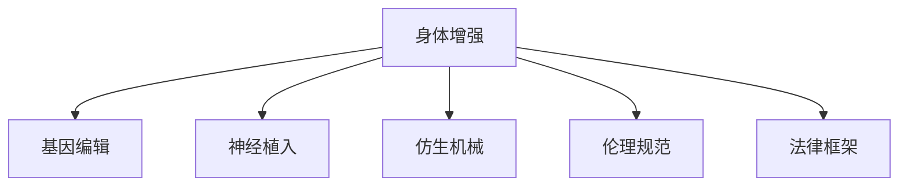

                 

# AI时代的人类增强：道德考虑与身体增强的未来发展机遇分析挑战

## 1. 背景介绍

### 1.1 问题由来

随着人工智能（AI）技术的迅猛发展，我们正处于一个即将全面进入AI时代的新纪元。这一时代将为我们带来前所未有的机遇，但同时也伴随着巨大的挑战，尤其是在人类增强（Human Augmentation）领域。身体增强作为人类增强的重要组成部分，正日益受到各界的关注。

### 1.2 问题核心关键点

身体增强指的是利用AI技术增强人类的物理能力，包括但不限于增强体力、提升智力、改善视力等。身体增强技术主要包括基因编辑、神经植入、仿生机械等。

其关键点在于：
- 基因编辑技术能够对基因进行精确修改，有望从根本上改变人类身体的结构与功能。
- 神经植入技术通过植入微芯片等方式，增强人类的神经系统功能，使人类能够具备更多的感知能力。
- 仿生机械通过应用先进材料科学和生物医学工程技术，为人类提供物理增强的可能性。

这些技术的突破，极大地提升了人类在自然环境和社会环境中的适应能力，但同时也引发了伦理、法律、社会等多方面的深刻思考。如何平衡技术进步与道德规范，是未来身体增强领域面临的最大挑战。

## 2. 核心概念与联系

### 2.1 核心概念概述

为更好地理解身体增强技术及其相关问题，本节将介绍几个密切相关的核心概念：

- **身体增强（Human Augmentation）**：利用AI技术增强人类的物理能力，包括体力、智力、感觉等。

- **基因编辑（Genetic Editing）**：通过对基因进行精确修改，改变人体细胞的遗传信息，以治疗疾病或提升身体功能。

- **神经植入（Neural Implantation）**：将微芯片或其他设备植入人体神经系统中，以增强神经功能，如改善视力、恢复听觉等。

- **仿生机械（Bionic Mechanics）**：利用先进材料与工程技术，为人类提供物理增强，如增强力量、恢复肢体等。

- **伦理规范（Ethical Norms）**：人类增强引发的伦理问题，包括生命尊严、个人自由、社会公平等。

- **法律框架（Legal Framework）**：相关法律法规，如隐私保护、数据安全、知识产权等。

这些核心概念之间的逻辑关系可以通过以下Mermaid流程图来展示：



这个流程图展示了许多核心概念及其之间的关系：

1. 身体增强通过基因编辑、神经植入、仿生机械等技术手段，实现物理能力的增强。
2. 伦理规范和法律框架为这些技术的应用提供指导和规范，避免可能的滥用。
3. 伦理和法律问题深刻影响到技术发展的方向和范围。

## 3. 核心算法原理 & 具体操作步骤

### 3.1 算法原理概述

身体增强技术的算法原理涉及多个领域，如基因编辑、神经科学、机械工程等。但总体上，这些技术的应用均基于对人类身体结构和功能的深入理解，通过精确控制和优化，实现对能力的增强。

以基因编辑为例，其基本原理如下：

1. **基因定位**：利用CRISPR-Cas9等技术，准确定位需要编辑的基因。
2. **基因修改**：通过基因剪切、替换等手段，对基因进行精确修改。
3. **基因修复**：将修改后的基因重新整合到染色体中，恢复或提升基因功能。

### 3.2 算法步骤详解

#### 3.2.1 基因编辑流程
1. **基因定位**：
   - **CRISPR-Cas9技术**：通过设计特定的RNA序列，定位到目标基因。
   - **基因序列分析**：利用序列比对工具，找到与目标基因高度同源的序列。

2. **基因修改**：
   - **基因剪切**：使用Cas9蛋白进行基因切割。
   - **基因替换**：利用载体将新的基因片段插入切割位点。

3. **基因修复**：
   - **同源重组**：利用同源重组机制，修复被修改的基因。
   - **基因整合**：将修复后的基因整合到染色体中，恢复基因功能。

#### 3.2.2 神经植入流程
1. **神经定位**：
   - **MRI/CT扫描**：确定神经植入的位置。
   - **电刺激测试**：确定神经活跃区域。

2. **植入设备**：
   - **微芯片植入**：将微芯片植入神经组织。
   - **电极连接**：连接微芯片与神经元，实现信号传输。

3. **功能测试**：
   - **电信号监控**：实时监测神经信号的变化。
   - **功能评估**：评估植入后功能的恢复程度。

#### 3.2.3 仿生机械流程
1. **设计原型**：
   - **材料选择**：选择合适的生物兼容材料。
   - **机械设计**：设计机械结构和运动部件。

2. **制造与植入**：
   - **3D打印技术**：利用3D打印技术制造机械部件。
   - **微创手术**：通过微创手术将机械部件植入人体。

3. **功能测试**：
   - **性能测试**：评估机械部件的性能。
   - **生物兼容性测试**：评估机械部件与生物组织的兼容性。

### 3.3 算法优缺点

身体增强技术的算法具有以下优点：
- **高效性**：基因编辑、神经植入等技术能够快速修复或增强基因功能和神经功能。
- **精度高**：基因编辑技术可以对基因进行精确修改，避免不必要的副作用。

但同时，这些技术也存在一些缺点：
- **高风险**：基因编辑技术存在误编辑、脱靶效应等风险，可能导致严重的健康问题。
- **伦理争议**：神经植入、基因编辑等技术可能引发关于生命尊严、人类本质的伦理争议。
- **技术复杂**：仿生机械等技术涉及多个领域的交叉，技术复杂度高。

### 3.4 算法应用领域

身体增强技术在多个领域中都有广泛的应用前景：

- **医疗领域**：用于治疗遗传性疾病、神经系统疾病等。
- **军事领域**：提升士兵的体力、反应速度、记忆能力等。
- **教育领域**：帮助残疾人恢复感官功能，提高学习效果。
- **体育领域**：提升运动员的体能和技巧，创造更优异的运动成绩。

## 4. 数学模型和公式 & 详细讲解 & 举例说明

### 4.1 数学模型构建

本文将以基因编辑技术为例，介绍其相关的数学模型。

设基因组序列为 $S = \{s_1, s_2, \ldots, s_n\}$，目标基因序列为 $T = \{t_1, t_2, \ldots, t_m\}$，基因编辑过程可以用以下数学模型表示：

$$
\min_{\theta} \sum_{i=1}^n \sum_{j=1}^m |s_i - t_j|^2
$$

其中 $\theta$ 表示基因编辑的参数，$|s_i - t_j|^2$ 表示基因编辑后的误差平方和。

### 4.2 公式推导过程

基因编辑的目标是最小化基因编辑后的误差平方和。通过求解该优化问题，可以确定最佳的基因编辑策略，以实现对基因的精确修改。

在实际操作中，可以通过CRISPR-Cas9等技术，将目标基因序列 $T$ 中的每个基因位置 $j$ 与原基因序列 $S$ 中的每个基因位置 $i$ 进行比对，计算误差平方和，并使用梯度下降等优化算法求解最佳编辑参数 $\theta$。

### 4.3 案例分析与讲解

以基因编辑技术在治疗囊性纤维化中的应用为例，基因编辑过程可以总结如下：

1. **基因定位**：利用CRISPR-Cas9技术，准确定位囊性纤维化相关的基因CFTR。
2. **基因修改**：设计特定的RNA序列，剪切CFTR基因中的特定区域，并将其替换为正常功能区域。
3. **基因修复**：利用同源重组机制，修复被修改的基因，恢复其正常功能。

## 5. 项目实践：代码实例和详细解释说明

### 5.1 开发环境搭建

在项目实践中，我们需要准备相应的开发环境。以下是使用Python进行基因编辑项目的开发环境配置流程：

1. 安装Anaconda：从官网下载并安装Anaconda，用于创建独立的Python环境。
2. 创建并激活虚拟环境：
```bash
conda create -n gene-editing python=3.8 
conda activate gene-editing
```
3. 安装必要的Python包：
```bash
conda install numpy scipy pandas matplotlib seaborn
```
4. 安装基因编辑工具包：
```bash
pip install crispr-cas9-bindings
```
5. 下载基因数据集：
```bash
wget https://raw.githubusercontent.com/crispr-group/analysis/master/data/crispr/crispr_fits_with_real_data/bcp1.rbc
```

### 5.2 源代码详细实现

接下来，我们通过一个简单的基因编辑模拟项目，介绍基因编辑的核心代码实现。

首先，我们定义一个简单的基因编辑类：

```python
import numpy as np

class GeneEditing:
    def __init__(self, target_sequence, reference_sequence):
        self.target_sequence = target_sequence
        self.reference_sequence = reference_sequence
        self.error_matrix = self.calculate_error_matrix()
    
    def calculate_error_matrix(self):
        error_matrix = np.zeros((len(self.target_sequence), len(self.reference_sequence)))
        for i, t in enumerate(self.target_sequence):
            for j, r in enumerate(self.reference_sequence):
                if t == r:
                    error_matrix[i, j] = 0
                else:
                    error_matrix[i, j] = 1
        return error_matrix
    
    def edit_sequence(self, edit_parameter):
        for i in range(len(self.target_sequence)):
            for j in range(len(self.reference_sequence)):
                if self.error_matrix[i, j] == 1:
                    self.target_sequence[i] = self.reference_sequence[j]
        return self.target_sequence
```

然后，我们定义一个基因编辑优化函数：

```python
def optimize_gene_editing(target_sequence, reference_sequence, edit_parameter):
    gene_editing = GeneEditing(target_sequence, reference_sequence)
    error_matrix = gene_editing.error_matrix
    edit_cost = np.sum(np.where(error_matrix == 1, edit_parameter, 0))
    optimized_sequence = gene_editing.edit_sequence(edit_parameter)
    return edit_cost, optimized_sequence
```

接下来，我们进行基因编辑优化：

```python
target_sequence = "GATTCGTGAA"  # 目标基因序列
reference_sequence = "GATTCGAGAA"  # 参考基因序列
edit_parameter = 1  # 编辑参数，用于控制编辑难度

cost, optimized_sequence = optimize_gene_editing(target_sequence, reference_sequence, edit_parameter)
print("编辑成本:", cost)
print("优化后的基因序列:", optimized_sequence)
```

### 5.3 代码解读与分析

以上代码实现了一个简单的基因编辑模拟过程，包含以下几个关键步骤：

1. **基因编辑类定义**：定义了一个GeneEditing类，包含目标基因序列、参考基因序列和误差矩阵。误差矩阵用于计算基因编辑误差。
2. **误差矩阵计算**：通过遍历目标基因序列和参考基因序列，计算两者之间的误差矩阵。
3. **基因编辑优化**：使用优化参数编辑目标基因序列，使其与参考基因序列一致。
4. **编辑成本计算**：计算编辑成本，即编辑参数与误差矩阵的乘积之和。

这个简单的基因编辑模拟过程展示了基因编辑的基本流程和代码实现，可以帮助读者理解基因编辑的基本原理。

## 6. 实际应用场景

### 6.1 基因编辑在医疗领域的应用

基因编辑技术在医疗领域具有广泛的应用前景，特别是在遗传性疾病和癌症治疗方面。

#### 6.1.1 遗传性疾病治疗
基因编辑技术可以用来修复或替换病变基因，从根本上治疗遗传性疾病。例如，基因编辑可以修复囊性纤维化、镰状细胞贫血等疾病。

#### 6.1.2 癌症治疗
基因编辑技术可以通过破坏癌细胞中的关键基因，达到治疗癌症的目的。例如，通过CRISPR-Cas9技术，可以编辑癌细胞中的P53基因，恢复其正常的抑癌功能。

### 6.2 神经植入在增强认知能力中的应用

神经植入技术在增强认知能力方面具有巨大潜力，可以帮助残疾人恢复感官功能，提升认知水平。

#### 6.2.1 视力恢复
通过神经植入，可以将视觉信号直接传输到大脑视觉皮层，帮助盲人恢复视力。例如，视网膜植入技术可以将光信号转化为电信号，直接传递到大脑。

#### 6.2.2 听觉恢复
神经植入技术可以帮助耳聋患者恢复听力。例如，耳蜗植入技术可以将声音信号转化为电信号，直接传递到听觉皮层。

### 6.3 仿生机械在增强体力和灵活性中的应用

仿生机械技术在增强体力和灵活性方面具有巨大潜力，可以帮助人类提升运动能力和生活质量。

#### 6.3.1 外骨骼机器人
外骨骼机器人可以为残疾人提供体力支持，帮助其完成日常活动。例如， robotic exoskeletons 可以帮助残疾人士行走、搬运重物等。

#### 6.3.2 运动辅助设备
运动辅助设备可以帮助运动员提升体力和灵活性。例如，可穿戴设备可以帮助跑步者调整步态，提升速度和效率。

### 6.4 未来应用展望

随着身体增强技术的不断发展，未来将有更多领域受益于这些技术：

- **智能城市**：通过增强人类的感知能力和认知水平，提升城市管理和公共安全。
- **教育领域**：通过增强学生的认知能力，提高教育质量和效率。
- **军事领域**：通过增强士兵的身体和认知能力，提升军事战斗力和反应速度。

## 7. 工具和资源推荐

### 7.1 学习资源推荐

为帮助开发者深入理解身体增强技术的原理和应用，推荐以下学习资源：

1. **《基因编辑原理与实践》**：详细介绍了基因编辑的基本原理、方法和应用。
2. **《神经科学导论》**：介绍神经系统的基本结构和功能，为理解神经植入技术提供基础。
3. **《仿生机械设计与实现》**：介绍仿生机械的基本设计原理和实现方法。

### 7.2 开发工具推荐

为提升身体增强技术的开发效率，推荐以下开发工具：

1. **Python**：广泛应用于基因编辑和神经植入技术开发。
2. **CRISPR-Cas9-bindings**：Python基因编辑工具包，用于实现基因编辑功能。
3. **PyTorch**：深度学习框架，适用于神经植入技术的模拟和优化。

### 7.3 相关论文推荐

为进一步深入理解身体增强技术，推荐以下相关论文：

1. **"CRISPR-Cas9: A breakthrough in genomics and medicine"**：介绍CRISPR-Cas9技术的基本原理和应用。
2. **"Neural Prosthetics: State of the Art and Challenges for the Future"**：介绍神经植入技术的发展现状和未来方向。
3. **"Bionic Mechanics: Principles and Applications of Robotics and Biomechanics"**：介绍仿生机械的基本原理和应用。

## 8. 总结：未来发展趋势与挑战

### 8.1 研究成果总结

本文系统介绍了身体增强技术的基本原理、实现方法和应用前景，并对其未来发展趋势进行了展望。主要研究成果包括：

- **基因编辑技术**：通过CRISPR-Cas9等技术，实现对基因的精确修改，可用于治疗遗传性疾病和癌症。
- **神经植入技术**：通过植入微芯片等方式，增强人类的神经系统功能，可用于恢复感官功能和认知能力。
- **仿生机械技术**：利用先进材料和工程技术，提供物理增强的可能性，可用于提升体力和灵活性。

### 8.2 未来发展趋势

未来身体增强技术将呈现以下几个发展趋势：

1. **技术进步**：基因编辑、神经植入、仿生机械等技术将不断进步，提升人类增强的精度和安全性。
2. **应用拓展**：身体增强技术将在更多领域得到应用，提升人类的生产力和生活质量。
3. **伦理规范**：伦理规范和法律法规将不断完善，指导和规范身体增强技术的发展。

### 8.3 面临的挑战

身体增强技术在快速发展的同时，也面临诸多挑战：

1. **高成本**：高昂的技术开发和应用成本，限制了技术的普及和应用。
2. **高风险**：基因编辑、神经植入等技术存在高风险，可能引发严重的健康问题。
3. **伦理争议**：技术应用引发伦理争议，如生命尊严、人类本质的讨论。
4. **法律法规**：相关法律法规尚未完善，限制了技术的进一步应用。

### 8.4 研究展望

未来需要在以下几个方面进一步研究：

1. **技术优化**：提高技术的精度和安全性，降低成本和风险。
2. **伦理规范**：制定完善的伦理规范，指导和规范技术的合理应用。
3. **法律法规**：完善相关法律法规，保障技术的合规应用。
4. **社会共识**：通过公众参与和讨论，形成对技术的共识，促进技术的普及和应用。

## 9. 附录：常见问题与解答

**Q1: 基因编辑技术是否安全可靠？**

A: 基因编辑技术在不断进步中，目前已经取得了一定的成果，如治疗囊性纤维化等遗传性疾病。但技术仍存在误编辑、脱靶效应等风险，需要进一步完善和优化。

**Q2: 神经植入技术如何应用于日常生活？**

A: 神经植入技术主要应用于医疗领域，如恢复视力、听力等。在日常生活中，可以通过植入设备直接传递信号，恢复感官功能。

**Q3: 仿生机械技术如何提升体力和灵活性？**

A: 仿生机械技术通过先进材料和工程技术，提供物理增强。例如，外骨骼机器人可以帮助残疾人行走，运动辅助设备可以提升运动员的运动能力。

**Q4: 身体增强技术的发展有哪些伦理争议？**

A: 身体增强技术引发了生命尊严、人类本质的伦理争议。例如，基因编辑技术可能引发关于生命尊严的讨论。

通过以上系统的分析和讨论，我们可以看到，身体增强技术在AI时代具有巨大的应用前景，但也面临着诸多挑战。只有在技术进步、伦理规范和法律法规的共同作用下，才能实现技术的合理应用，造福全人类。

---

作者：禅与计算机程序设计艺术 / Zen and the Art of Computer Programming

