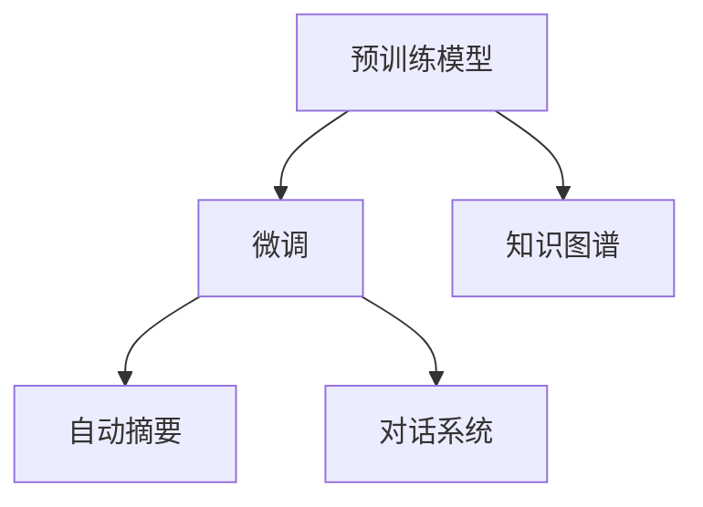

                 

# AI时代的自然语言处理：从研究到应用

> 关键词：
- 自然语言处理
- 深度学习
- 预训练模型
- 微调
- 知识图谱
- 自动摘要
- 对话系统

## 1. 背景介绍

### 1.1 问题由来
自然语言处理（NLP）作为人工智能（AI）的重要分支，研究如何让计算机理解、处理和生成自然语言。随着大数据和深度学习技术的迅猛发展，NLP研究迎来了新的历史机遇，各种基于深度学习的新型NLP技术，如序列到序列（Seq2Seq）模型、预训练语言模型（Pretrained Language Model, PLM）、序列到树（Seq2Tree）模型等，极大地提升了NLP系统在语言理解、翻译、问答、摘要等方面的能力。

当前，NLP应用已经广泛应用于搜索引擎、智能客服、机器翻译、语音识别、情感分析、社交媒体监测、医疗诊断等多个领域，且随着大数据和计算能力的持续提升，NLP技术的应用场景和深度也在不断拓展。AI时代，NLP正逐渐成为推动人工智能发展的重要引擎，其研究成果也越发紧密地与各行业实际应用结合，以解决实际问题。

### 1.2 问题核心关键点
当前，NLP领域研究与应用的重点主要集中在以下几个方面：
- **预训练模型**：利用大规模语料进行无监督学习，构建通用语言表示，如BERT、GPT等。
- **微调技术**：在特定领域数据上进行监督学习，对预训练模型进行微调，提升其针对特定任务的性能。
- **知识图谱**：通过结构化语义模型来表示实体、关系和知识，提升NLP模型的上下文理解能力。
- **自动摘要**：从长文本中提取关键信息，生成简洁摘要。
- **对话系统**：使计算机能够像人一样进行自然对话，解决问答、智能客服等问题。
- **情感分析**：判断文本情感倾向，辅助舆情分析、市场预测等。

这些关键技术相互结合，极大地提升了NLP系统的效果，使其更加智能、高效。同时，NLP技术也在不断演进中，其应用深度和广度也在不断扩展，对各行业带来深远的影响。

## 2. 核心概念与联系

### 2.1 核心概念概述

要深入理解NLP技术的进展，首先需要掌握其核心概念：

- **自然语言处理（NLP）**：研究如何让计算机处理和理解自然语言。
- **深度学习（DL）**：一种基于神经网络的机器学习范式，广泛应用于图像识别、自然语言处理等领域。
- **预训练模型（PLM）**：通过在大规模无标注数据上预训练的通用语言模型，如BERT、GPT等。
- **微调（Fine-Tuning）**：在预训练模型基础上，使用特定领域标注数据进行监督学习，提升模型在该任务上的性能。
- **知识图谱（KG）**：结构化语义模型，描述实体、属性、关系等，用于增强模型上下文理解。
- **自动摘要（Automatic Summarization）**：从长文本中提取关键信息，生成简洁摘要。
- **对话系统（Chatbot）**：使计算机能够像人一样进行自然对话，解决问答、智能客服等问题。

这些核心概念之间存在紧密的联系。预训练模型作为NLP的基础，在微调技术、知识图谱、自动摘要和对话系统的构建中，都起到了关键作用。而对话系统和自动摘要等任务，又进一步提升了NLP应用的效果。

### 2.2 核心概念原理和架构的 Mermaid 流程图(Mermaid 流程节点中不要有括号、逗号等特殊字符)


这个流程图展示了NLP核心概念之间的关系：预训练模型在微调、知识图谱、自动摘要、对话系统的构建中都扮演了重要角色。

## 3. 核心算法原理 & 具体操作步骤

### 3.1 算法原理概述
NLP中，预训练模型通过在大规模无标注数据上进行自监督学习，构建通用语言表示。微调则是在预训练模型的基础上，使用特定领域标注数据进行监督学习，提升模型在该任务上的性能。这与迁移学习（Transfer Learning）思想类似，即将预训练模型看作特征提取器，通过特定任务的数据对其进行微调，提升模型针对该任务的性能。

### 3.2 算法步骤详解

以下详细介绍NLP中预训练和微调模型的构建步骤：

1. **数据准备**：收集特定领域的数据，将其划分为训练集、验证集和测试集。训练集用于模型训练，验证集用于调整超参数，测试集用于评估模型性能。
   
2. **模型选择**：选择适合任务的预训练模型，如BERT、GPT等。这些模型通常在通用语料库上进行预训练，具备丰富的语言知识和常识。
   
3. **微调设置**：选择合适的微调算法（如AdamW），设置学习率、批大小、迭代轮数等超参数。确定是否固定预训练模型的某些层，以降低计算成本。
   
4. **模型训练**：
   - **前向传播**：将输入数据（文本）输入模型，计算损失函数。
   - **反向传播**：计算损失函数对模型参数的梯度，并更新参数。
   - **优化器**：使用优化器（如AdamW）更新模型参数。
   - **正则化**：应用正则化技术（如L2正则、Dropout）防止过拟合。
   - **Early Stopping**：当验证集损失不再下降时停止训练，防止过拟合。
   
5. **模型评估**：在测试集上评估模型性能，判断微调效果。

### 3.3 算法优缺点
- **优点**：
  - **效率高**：预训练模型在大规模数据上预训练，获取通用语言表示，微调过程中参数量较小。
  - **性能好**：微调模型针对特定任务进行优化，效果显著。
  - **通用性**：预训练模型和微调技术在多个NLP任务上都有应用。

- **缺点**：
  - **依赖数据**：微调效果依赖于特定领域标注数据的质量和数量。
  - **计算资源要求高**：预训练模型和微调过程需要大量计算资源。
  - **泛化能力有限**：微调模型面对新领域数据时，泛化性能可能不足。

### 3.4 算法应用领域
- **机器翻译**：将一种语言翻译成另一种语言，如Google翻译、DeepL等。
- **问答系统**：回答用户自然语言问题，如智能客服、虚拟助手等。
- **情感分析**：判断文本情感倾向，如社交媒体情感分析、用户评论情感分析等。
- **文本分类**：将文本归类到特定类别，如新闻分类、垃圾邮件分类等。
- **命名实体识别**：识别文本中的实体，如人名、地名、组织机构名等。
- **自动摘要**：从长文本中提取关键信息，生成简洁摘要。
- **对话系统**：使计算机能够像人一样进行自然对话，如智能客服、智能聊天机器人等。

## 4. 数学模型和公式 & 详细讲解 & 举例说明

### 4.1 数学模型构建
以机器翻译任务为例，常见的数学模型构建如下：

- **输入表示**：将源语言文本转换为模型可以处理的向量表示。
- **模型表示**：使用预训练模型（如Transformer）对输入进行编码，得到上下文表示。
- **输出表示**：对上下文表示进行处理，得到目标语言文本的向量表示。

### 4.2 公式推导过程
假设源语言文本为 $X$，目标语言文本为 $Y$，预训练模型为 $M$，微调后的模型为 $M_{\text{fine-tuned}}$。微调过程的目标是最大化输出和真实标签的交叉熵损失：

$$
\mathcal{L} = -\frac{1}{N}\sum_{i=1}^N \log \sigma (M_{\text{fine-tuned}}(X_i, Y_i))
$$

其中 $\sigma$ 为softmax函数，$M_{\text{fine-tuned}}(X_i, Y_i)$ 表示模型在输入 $X_i$ 和真实标签 $Y_i$ 下的输出。

### 4.3 案例分析与讲解
以情感分析任务为例，使用BERT模型进行微调：
- **数据准备**：收集标注有情感倾向的文本数据集。
- **模型选择**：选择BERT模型作为初始化模型。
- **微调设置**：设置学习率为 $2 \times 10^{-5}$，批大小为 $16$，迭代轮数为 $5$。
- **模型训练**：使用AdamW优化器进行反向传播和参数更新。
- **模型评估**：在测试集上计算模型准确率、召回率和F1值。

## 5. 项目实践：代码实例和详细解释说明

### 5.1 开发环境搭建

为了进行NLP模型开发，需要搭建Python开发环境：

1. **安装Python**：从官网下载并安装Python 3.8及以上版本。
2. **安装PyTorch**：从官网下载安装包，使用pip安装。
3. **安装Hugging Face Transformers库**：使用pip安装，用于加载预训练模型和微调。

### 5.2 源代码详细实现

以下是使用Transformers库进行BERT模型微调的Python代码：

```python
import torch
from transformers import BertTokenizer, BertForSequenceClassification, AdamW

# 加载预训练模型和分词器
tokenizer = BertTokenizer.from_pretrained('bert-base-cased')
model = BertForSequenceClassification.from_pretrained('bert-base-cased', num_labels=2)

# 数据准备
train_texts = ...
train_labels = ...
dev_texts = ...
dev_labels = ...
test_texts = ...
test_labels = ...

# 数据预处理
def preprocess(text, labels):
    encoding = tokenizer(text, truncation=True, padding='max_length', max_length=256)
    input_ids = encoding['input_ids']
    attention_mask = encoding['attention_mask']
    return input_ids, attention_mask, labels

# 数据集
train_dataset = [preprocess(text, label) for text, label in zip(train_texts, train_labels)]
dev_dataset = [preprocess(text, label) for text, label in zip(dev_texts, dev_labels)]
test_dataset = [preprocess(text, label) for text, label in zip(test_texts, test_labels)]

# 微调参数
learning_rate = 2e-5
epochs = 5
batch_size = 16

# 训练循环
for epoch in range(epochs):
    model.train()
    for input_ids, attention_mask, labels in train_dataset:
        optimizer.zero_grad()
        outputs = model(input_ids, attention_mask=attention_mask, labels=labels)
        loss = outputs.loss
        loss.backward()
        optimizer.step()

    # 验证集评估
    model.eval()
    acc, f1, _ = evaluate(dev_dataset)
    print(f"Epoch {epoch+1}, Dev Acc: {acc:.3f}, Dev F1: {f1:.3f}")

# 测试集评估
model.eval()
acc, f1, _ = evaluate(test_dataset)
print(f"Test Acc: {acc:.3f}, Test F1: {f1:.3f}")
```

### 5.3 代码解读与分析

以上代码实现了使用BERT模型进行情感分析任务的微调。其中，`preprocess`函数用于对输入文本进行分词和编码，`BertTokenizer`和`BertForSequenceClassification`分别用于加载分词器和序列分类模型。在训练循环中，首先设置模型为训练模式，然后对每个样本进行前向传播和反向传播，计算损失并更新参数。验证集评估和测试集评估部分，分别计算准确率和F1值。

## 6. 实际应用场景

### 6.1 智能客服系统
智能客服系统利用NLP技术，能够理解用户意图，生成智能回复，极大提升了客户咨询体验。例如，阿里巴巴、京东等电商平台使用智能客服系统，减少了人工客服成本，提高了服务效率。

### 6.2 金融舆情监测
金融市场瞬息万变，舆情监测至关重要。使用NLP技术，能够实时监测社交媒体、新闻等数据，快速判断市场舆情，辅助决策。例如，东方财富、雪球等金融网站使用NLP技术进行舆情监测，帮助投资者及时规避风险。

### 6.3 个性化推荐系统
个性化推荐系统通过分析用户行为数据，推荐符合用户兴趣的商品或服务。使用NLP技术，能够从文本中提取用户偏好，提升推荐效果。例如，Netflix、Amazon等网站使用个性化推荐系统，极大地提高了用户满意度。

### 6.4 未来应用展望
未来，NLP技术将在更多领域得到应用，带来深远影响：

- **智慧医疗**：NLP技术能够辅助医生诊断、分析病历、提供医疗建议，提升医疗服务水平。例如，IBM Watson Health使用NLP技术，辅助医生进行疾病诊断。
- **智能教育**：NLP技术能够分析学生学习行为，提供个性化学习建议，提升教学质量。例如，Coursera使用NLP技术，推荐适合学生的课程。
- **智慧城市**：NLP技术能够监测城市事件、分析舆情，提高城市管理效率。例如，上海市智慧城市平台使用NLP技术，监测城市运行状况。
- **智能交通**：NLP技术能够分析交通数据，提供出行建议，改善交通状况。例如，百度地图使用NLP技术，优化交通路线。

## 7. 工具和资源推荐

### 7.1 学习资源推荐

- **自然语言处理基础**：《自然语言处理综论》（Daniel Jurafsky & James H. Martin），介绍了NLP的基本概念和算法。
- **深度学习实践**：《深度学习》（Ian Goodfellow、Yoshua Bengio & Aaron Courville），介绍了深度学习的基本原理和应用。
- **Transformers库文档**：[https://huggingface.co/docs/transformers/main/en](https://huggingface.co/docs/transformers/main/en)，提供了丰富的预训练模型和微调样例代码。
- **Kaggle竞赛**：参加NLP领域的Kaggle竞赛，了解NLP前沿技术和应用。
- **Stanford NLP Group**：[https://nlp.stanford.edu/](https://nlp.stanford.edu/)，提供NLP领域的最新研究进展和数据集。

### 7.2 开发工具推荐

- **Python**：作为NLP主流开发语言，功能强大且社区活跃。
- **PyTorch**：深度学习领域的主流框架，灵活性高。
- **TensorFlow**：Google开发的深度学习框架，生产部署方便。
- **Jupyter Notebook**：用于数据分析、模型训练和结果展示，方便开发者共享和交流。
- **Google Colab**：免费的GPU/TPU资源，方便进行大模型训练。

### 7.3 相关论文推荐

- **BERT论文**：BERT: Pre-training of Deep Bidirectional Transformers for Language Understanding，提出了BERT模型，提升了NLP任务的性能。
- **GPT论文**：Attention is All You Need，提出了GPT模型，推动了NLP领域的预训练技术。
- **BERT应用**：BERT: Pre-training of Deep Bidirectional Transformers for Language Understanding，介绍BERT模型在不同NLP任务上的应用。
- **GPT应用**：Language Models are Unsupervised Multitask Learners，展示了GPT模型在zero-shot学习中的能力。

## 8. 总结：未来发展趋势与挑战

### 8.1 研究成果总结
NLP技术的快速发展，已经使得计算机在语言理解、生成等方面接近甚至超越人类。未来，NLP技术将在更多领域得到应用，带来深远影响。

### 8.2 未来发展趋势
- **模型规模**：大规模预训练模型将成为主流，提升模型语言表示能力。
- **多模态融合**：NLP与计算机视觉、语音识别等技术结合，提升模型全面理解能力。
- **跨领域迁移**：NLP模型将在更多领域应用，提升行业智能化水平。
- **知识图谱**：结构化语义模型将广泛应用于上下文理解中，提升模型推理能力。
- **自动摘要**：NLP技术将帮助人们从大量文本中快速获取关键信息。

### 8.3 面临的挑战
- **数据依赖**：NLP模型依赖大量标注数据，获取高质量标注数据成本高。
- **计算资源**：大规模预训练和微调需要大量计算资源，提升计算效率是重要挑战。
- **泛化能力**：NLP模型在特定领域数据上效果良好，但在新领域数据上泛化性能不足。
- **可解释性**：NLP模型“黑盒”特征，难以解释其内部工作机制。
- **安全性**：NLP模型可能产生误导性输出，需要保障数据和模型安全。

### 8.4 研究展望
未来，NLP技术将在以下几个方面取得突破：

- **无监督学习和半监督学习**：提升NLP模型泛化能力和数据依赖。
- **知识图谱与NLP结合**：提升NLP模型的上下文理解能力。
- **多模态融合**：提升NLP模型的全面理解能力。
- **可解释性**：提升NLP模型的可解释性和可解释性。
- **跨领域迁移**：提升NLP模型的跨领域迁移能力。

## 9. 附录：常见问题与解答

### Q1: 什么是自然语言处理？

**A**：自然语言处理（NLP）是计算机科学、人工智能和语言学的交叉领域，研究如何让计算机理解、处理和生成自然语言。

### Q2: 预训练模型和微调有什么区别？

**A**：预训练模型在大规模无标注数据上进行自监督学习，构建通用语言表示；微调是在预训练模型的基础上，使用特定领域标注数据进行监督学习，提升模型在该任务上的性能。

### Q3: 如何提高NLP模型的泛化能力？

**A**：可以通过数据增强、多模态融合、知识图谱等技术提升NLP模型的泛化能力。

### Q4: 如何构建智能客服系统？

**A**：使用NLP技术构建对话系统，理解用户意图，生成智能回复，构建智能客服系统。

### Q5: 未来NLP技术的发展方向是什么？

**A**：未来NLP技术将朝着大规模化、多模态化、可解释化、跨领域化等方向发展，提升NLP系统的全面理解和应用能力。

---

作者：禅与计算机程序设计艺术 / Zen and the Art of Computer Programming

