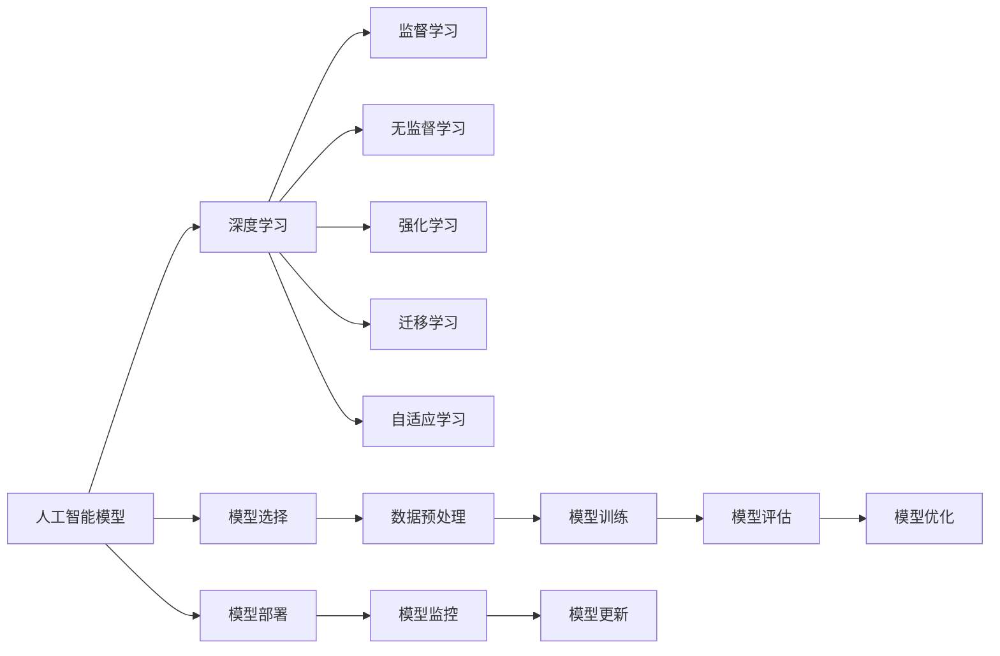

                 

## 1. 背景介绍

### 1.1 问题由来

人工智能模型，尤其是深度学习模型，已经在现实世界的各个领域中展示了其强大的能力。从医疗、金融到交通、教育，模型在处理大量问题、优化决策、提升效率等方面取得了显著成效。然而，尽管模型在技术上取得了巨大成功，其在实际应用中的效果、稳定性和可靠性仍面临诸多挑战。本文将全面探讨AI模型在现实世界中的表现、应用及优化策略，为读者提供深刻的洞察和实用的建议。

### 1.2 问题核心关键点

AI模型在现实世界中的应用，关键在于如何将理论转化为实际，有效解决具体问题。核心关键点包括：

1. **数据质量与数量**：模型的性能高度依赖于输入数据的质量和数量。
2. **模型选择与训练**：选择适合的模型架构和训练方法，是模型成功的关键。
3. **模型部署与优化**：将模型部署到实际环境中，并进行持续优化。
4. **模型伦理与安全**：确保模型行为的透明、公平和安全。

这些关键点相互交织，共同决定了AI模型在现实世界中的成功与否。

### 1.3 问题研究意义

AI模型的广泛应用，极大地提升了效率、优化了决策，并创新了商业模式。但同时，模型的应用也带来了数据隐私、伦理、安全等问题。通过深入探讨这些问题，并提出解决方案，将有助于推动AI技术向更加成熟、可靠的方向发展，更好地服务于人类社会。

## 2. 核心概念与联系

### 2.1 核心概念概述

为更好地理解AI模型在现实世界中的应用，本节将介绍几个密切相关的核心概念：

- **人工智能模型**：基于数据驱动的模型，通过学习数据特征，实现对复杂问题的自动推断和预测。
- **深度学习**：一种机器学习技术，使用多层神经网络进行特征提取和模式识别。
- **监督学习**：利用标注数据训练模型，使其能够在特定任务上进行预测。
- **无监督学习**：仅使用未标注数据进行训练，发现数据的内在结构。
- **强化学习**：通过与环境的交互，学习最优策略，最大化长期奖励。
- **迁移学习**：将一个领域的知识迁移到另一个领域，提升模型在新任务上的表现。
- **自适应学习**：模型能够在不断变化的环境中，通过在线学习更新自身知识。

这些概念构成了AI模型的工作框架，是理解其在现实世界应用的基础。

### 2.2 核心概念原理和架构的 Mermaid 流程图



这个流程图展示了AI模型从构建到部署的全流程：

1. 人工智能模型通过深度学习、监督学习、无监督学习等技术进行特征提取和模式识别。
2. 模型选择和数据预处理是模型训练的前提。
3. 模型训练和评估是模型构建的核心步骤。
4. 模型优化和部署是将模型转化为实际应用的关键。
5. 模型监控和更新保证了模型在实际环境中的持续优化。

## 3. 核心算法原理 & 具体操作步骤

### 3.1 算法原理概述

AI模型在现实世界中的应用，基于数据驱动的统计学习方法。其核心原理是通过学习数据样本中的特征和规律，构建出能够自动推断和预测的模型。该过程包括数据收集、预处理、特征提取、模型训练、评估和优化等多个步骤。

### 3.2 算法步骤详解

**Step 1: 数据收集与预处理**

- 收集与任务相关的数据，数据应具有代表性、多样性和真实性。
- 进行数据清洗和预处理，如去除噪声、处理缺失值、归一化等。

**Step 2: 特征提取**

- 选择合适的特征提取方法，如PCA、NLP中的词向量、图像中的卷积等。
- 特征提取过程中，应尽可能保留数据的原始信息，避免过度拟合。

**Step 3: 模型选择与训练**

- 根据任务特点选择合适的模型架构，如线性回归、支持向量机、深度神经网络等。
- 使用标注数据进行模型训练，选择合适的优化器和损失函数。

**Step 4: 模型评估与优化**

- 使用验证集评估模型性能，选择合适的评价指标如准确率、召回率、F1值等。
- 根据评估结果，调整模型参数或重新训练，以提升模型性能。

**Step 5: 模型部署与监控**

- 将训练好的模型部署到实际应用环境中。
- 实时监控模型表现，根据实际数据进行持续优化。

### 3.3 算法优缺点

AI模型在现实世界中的应用，具有以下优点：

1. **高效性**：通过自动化的特征提取和模式识别，模型能够快速处理大量数据。
2. **精确性**：在训练充分的情况下，模型的预测结果往往非常准确。
3. **可解释性**：通过特征提取和模型训练过程，模型能够揭示数据的内在规律。

同时，也存在一些局限：

1. **数据依赖性**：模型的性能高度依赖于数据的质量和数量。
2. **过度拟合**：模型可能过度拟合训练数据，导致泛化能力不足。
3. **复杂性**：模型的构建和训练过程较为复杂，需要专业的知识和技能。
4. **模型鲁棒性**：模型对输入数据的微小变化可能非常敏感。

### 3.4 算法应用领域

AI模型在现实世界中的应用领域非常广泛，包括但不限于：

- **医疗**：用于疾病预测、影像分析、个性化治疗等。
- **金融**：用于风险评估、投资预测、欺诈检测等。
- **交通**：用于交通流量预测、自动驾驶、路线优化等。
- **教育**：用于学习分析、个性化推荐、智能辅导等。
- **制造**：用于质量控制、设备维护、供应链管理等。
- **能源**：用于能源消耗预测、智能电网、可再生能源管理等。

## 4. 数学模型和公式 & 详细讲解 & 举例说明

### 4.1 数学模型构建

在AI模型的应用中，数学模型起着核心作用。本节将介绍几个常用的数学模型及其构建方法。

**线性回归模型**：

$$
y = \beta_0 + \sum_{i=1}^n \beta_i x_i + \epsilon
$$

其中，$y$ 为预测值，$x_i$ 为输入特征，$\beta_i$ 为权重参数，$\epsilon$ 为噪声。

**逻辑回归模型**：

$$
P(y=1 | x; \theta) = \sigma(\beta_0 + \sum_{i=1}^n \beta_i x_i)
$$

其中，$\sigma$ 为Sigmoid函数，$\theta$ 为模型参数。

**卷积神经网络模型**：

$$
\text{Conv}(x, w) = \text{ReLU}( \sum_{i=1}^k w_{ki} \ast x_{i,j} + b_k)
$$

其中，$x$ 为输入图像，$w$ 为卷积核，$b_k$ 为偏置项，$\text{ReLU}$ 为ReLU激活函数。

### 4.2 公式推导过程

**线性回归的梯度下降法**：

$$
\theta_j = \theta_j - \alpha \frac{1}{m} \sum_{i=1}^m (y_i - h_\theta(x_i))x_{ij}
$$

其中，$\alpha$ 为学习率，$m$ 为样本数量。

**逻辑回归的交叉熵损失函数**：

$$
J(\theta) = -\frac{1}{m} \sum_{i=1}^m [y_i \log h_\theta(x_i) + (1-y_i) \log (1-h_\theta(x_i))]
$$

### 4.3 案例分析与讲解

以图像识别为例，使用卷积神经网络模型对手写数字进行分类。具体步骤如下：

1. **数据准备**：收集并标注手写数字图像数据集。
2. **模型构建**：设计多层的卷积和池化层，以及全连接层。
3. **特征提取**：通过卷积和池化操作，提取图像的局部特征。
4. **模型训练**：使用交叉熵损失函数和随机梯度下降法，训练模型参数。
5. **模型评估**：在测试集上评估模型性能，计算准确率和混淆矩阵。

## 5. 项目实践：代码实例和详细解释说明

### 5.1 开发环境搭建

进行AI模型项目实践，首先需要搭建好开发环境。以下是使用Python进行TensorFlow和Keras开发的示例环境配置：

1. 安装Anaconda：从官网下载并安装Anaconda，用于创建独立的Python环境。

2. 创建并激活虚拟环境：
```bash
conda create -n tf_keras_env python=3.8 
conda activate tf_keras_env
```

3. 安装TensorFlow和Keras：
```bash
conda install tensorflow=2.6
conda install keras
```

4. 安装各类工具包：
```bash
pip install numpy pandas scikit-learn matplotlib tqdm jupyter notebook ipython
```

完成上述步骤后，即可在`tf_keras_env`环境中开始模型开发。

### 5.2 源代码详细实现

以下以手写数字识别为例，展示使用TensorFlow和Keras实现卷积神经网络的过程。

```python
import tensorflow as tf
from tensorflow.keras import datasets, layers, models

# 加载数据集
(train_images, train_labels), (test_images, test_labels) = datasets.mnist.load_data()

# 数据预处理
train_images = train_images / 255.0
test_images = test_images / 255.0

# 构建模型
model = models.Sequential()
model.add(layers.Conv2D(32, (3, 3), activation='relu', input_shape=(28, 28, 1)))
model.add(layers.MaxPooling2D((2, 2)))
model.add(layers.Conv2D(64, (3, 3), activation='relu'))
model.add(layers.MaxPooling2D((2, 2)))
model.add(layers.Conv2D(64, (3, 3), activation='relu'))
model.add(layers.Flatten())
model.add(layers.Dense(64, activation='relu'))
model.add(layers.Dense(10))

# 编译模型
model.compile(optimizer='adam',
              loss=tf.keras.losses.SparseCategoricalCrossentropy(from_logits=True),
              metrics=['accuracy'])

# 训练模型
model.fit(train_images, train_labels, epochs=10, validation_data=(test_images, test_labels))

# 评估模型
test_loss, test_acc = model.evaluate(test_images, test_labels, verbose=2)
print('Test accuracy:', test_acc)
```

### 5.3 代码解读与分析

以上代码展示了卷积神经网络的构建、编译、训练和评估过程。具体解读如下：

**数据加载与预处理**：使用`datasets.mnist.load_data()`加载手写数字数据集，并将图像像素值归一化到[0,1]区间。

**模型构建**：使用`Sequential`模型，依次添加卷积层、池化层、全连接层。

**模型编译**：选择`adam`优化器，交叉熵损失函数，并设置评估指标为准确率。

**模型训练**：使用`fit`方法训练模型，设置训练轮数为10。

**模型评估**：使用`evaluate`方法评估模型在测试集上的表现。

## 6. 实际应用场景

### 6.1 医疗影像分析

在医疗影像分析中，AI模型能够快速、准确地检测和诊断疾病。例如，通过训练模型对X光片进行肿瘤检测，或者对CT扫描进行肺癌诊断。

**算法流程**：
1. **数据准备**：收集并标注大量医疗影像数据。
2. **模型构建**：设计卷积神经网络，提取影像特征。
3. **模型训练**：使用交叉熵损失函数，训练模型参数。
4. **模型评估**：在测试集上评估模型性能。
5. **模型部署**：将模型部署到医疗影像系统中，实现自动诊断。

### 6.2 金融风险评估

在金融领域，AI模型可以用于评估借款人的信用风险、预测股票市场趋势等。通过训练模型，分析历史数据中的特征，预测未来行为。

**算法流程**：
1. **数据准备**：收集并标注金融数据，包括交易记录、财务报表等。
2. **模型构建**：使用神经网络，对数据特征进行建模。
3. **模型训练**：选择合适的损失函数，训练模型参数。
4. **模型评估**：在验证集上评估模型性能。
5. **模型部署**：将模型部署到金融系统中，实现实时风险评估。

### 6.3 交通流量预测

在交通领域，AI模型可以用于预测交通流量、优化交通信号灯等。通过训练模型，分析历史交通数据，预测未来的流量变化。

**算法流程**：
1. **数据准备**：收集并标注交通流量数据。
2. **模型构建**：使用时间序列分析，预测交通流量。
3. **模型训练**：选择合适的损失函数，训练模型参数。
4. **模型评估**：在测试集上评估模型性能。
5. **模型部署**：将模型部署到交通管理系统中，实现实时流量预测。

### 6.4 未来应用展望

未来，AI模型将在更多领域得到应用，为各行各业带来变革性影响：

1. **智慧城市**：用于交通管理、环境监测、公共安全等，提升城市治理的智能化水平。
2. **智能制造**：用于设备故障预测、生产过程优化、供应链管理等，提升制造业的自动化和智能化水平。
3. **教育**：用于个性化学习、智能辅导、考试评分等，提升教育质量和学习效率。
4. **农业**：用于作物生长监测、病虫害预测、精准农业等，提升农业生产的智能化水平。
5. **能源**：用于能源消耗预测、智能电网、可再生能源管理等，提升能源管理的效率和安全性。

## 7. 工具和资源推荐

### 7.1 学习资源推荐

为帮助开发者系统掌握AI模型的构建和优化方法，推荐以下学习资源：

1. **《深度学习》课程**：斯坦福大学李飞飞教授的深度学习课程，涵盖机器学习基础、深度学习框架、经典模型等。

2. **《TensorFlow实战》书籍**：TensorFlow官方文档，详细介绍了TensorFlow的使用方法，包括模型构建、训练、评估等。

3. **《Keras实战》书籍**：Keras官方文档，详细介绍了Keras的使用方法，包括模型构建、训练、评估等。

4. **Coursera、edX等在线学习平台**：提供大量深度学习相关的课程，覆盖从入门到高级的内容。

5. **arXiv预印本**：深度学习领域的最新研究成果，可以及时了解前沿进展。

### 7.2 开发工具推荐

高效的开发离不开优秀的工具支持。以下是几款常用的AI模型开发工具：

1. **TensorFlow**：由Google主导开发的开源深度学习框架，生产部署方便，适合大规模工程应用。

2. **Keras**：基于TensorFlow等框架开发的高级神经网络API，使用简单，易于上手。

3. **PyTorch**：由Facebook开发的深度学习框架，灵活性高，支持动态计算图。

4. **Jupyter Notebook**：交互式编程环境，支持Python、R等语言，适合快速迭代开发。

5. **Weights & Biases**：模型训练的实验跟踪工具，可以记录和可视化模型训练过程中的各项指标。

### 7.3 相关论文推荐

以下是几篇奠基性的AI模型论文，推荐阅读：

1. **ImageNet Large Scale Visual Recognition Challenge**：AlexNet模型，展示了深度卷积神经网络在图像识别任务中的强大能力。

2. **Google Brain's Deep Q-Learning on Atari 2600**：DQN模型，展示了深度强化学习在视频游戏中的高效应用。

3. **Deep Learning for Self-Driving Cars**：无人驾驶车辆中使用的深度学习模型，展示了AI在实际应用中的表现。

4. **AlphaGo Zero**：AlphaGo模型，展示了AI在棋类游戏中的自我学习和优化能力。

5. **Generative Adversarial Networks**：生成对抗网络，展示了深度学习在生成任务中的强大能力。

## 8. 总结：未来发展趋势与挑战

### 8.1 总结

本文全面探讨了AI模型在现实世界中的应用，从数据收集、模型构建、训练评估到部署优化，提供了系统性的指导。通过实例演示，展示了AI模型在不同领域的应用，强调了数据质量、模型选择、训练优化等关键因素。

### 8.2 未来发展趋势

未来，AI模型将在更多领域得到应用，推动技术向更加智能化、普适化的方向发展：

1. **多模态学习**：结合视觉、语音、文本等多种模态数据，提升模型的泛化能力和鲁棒性。
2. **自适应学习**：模型能够在不断变化的环境中，通过在线学习更新自身知识，提升适应性。
3. **联邦学习**：在分布式环境中，通过协同学习提升模型的泛化能力，保护数据隐私。
4. **神经架构搜索**：自动搜索最优的神经网络架构，提升模型的性能和效率。
5. **生成模型**：生成对抗网络、变分自编码器等生成模型，在生成任务中展示了强大的能力。

### 8.3 面临的挑战

尽管AI模型在现实世界中的应用取得了显著成效，但在技术演进和应用推广过程中，仍面临诸多挑战：

1. **数据隐私与安全**：AI模型对数据的依赖性强，如何保护数据隐私和安全，避免模型泄露敏感信息。
2. **模型鲁棒性**：AI模型对输入数据的微小变化可能非常敏感，如何提升模型的鲁棒性和泛化能力。
3. **模型可解释性**：AI模型的决策过程缺乏可解释性，如何赋予模型更强的可解释性和透明性。
4. **模型公平性**：AI模型可能学习到有偏见的数据，如何确保模型行为的公平性和公正性。
5. **模型优化**：AI模型的训练和优化过程复杂，如何提升模型的效率和性能。

### 8.4 研究展望

未来的研究将更多地关注以下方向：

1. **模型压缩与优化**：通过模型剪枝、量化等技术，提升模型的效率和性能。
2. **模型融合与集成**：通过模型融合、集成学习等技术，提升模型的泛化能力和鲁棒性。
3. **跨领域迁移学习**：探索跨领域知识迁移的方法，提升模型在多种任务上的表现。
4. **强化学习与决策优化**：结合强化学习与优化算法，提升模型的决策能力和应用效果。
5. **模型伦理与安全**：引入伦理导向的评估指标，确保模型行为的透明、公平和安全。

通过这些研究方向的研究突破，AI模型将在更多领域得到应用，推动技术向更加智能化、普适化的方向发展。

## 9. 附录：常见问题与解答

**Q1：AI模型在应用中是否存在数据隐私和安全问题？**

A: 是的，AI模型对数据的依赖性强，如果数据泄露，可能导致严重的隐私和安全问题。应采用数据加密、匿名化等技术，保护数据隐私和安全。

**Q2：AI模型如何避免过度拟合？**

A: 通过数据增强、正则化、早停等技术，避免模型过度拟合训练数据。同时，选择合适的模型架构和训练方法，保持模型泛化能力。

**Q3：AI模型如何提升模型鲁棒性？**

A: 通过对抗训练、多模型集成等技术，提升模型对输入数据的鲁棒性。同时，选择合适的损失函数和优化器，优化模型参数。

**Q4：AI模型如何提升模型可解释性？**

A: 通过可视化工具，如梯度热图、特征重要性等，提升模型决策的透明性和可解释性。同时，引入符号化知识，增强模型解释能力。

**Q5：AI模型如何确保模型公平性？**

A: 引入公平性导向的评估指标，如等代价曲线、差异性度量等，确保模型行为的公平性和公正性。同时，通过数据清洗和预处理，减少数据偏见的影响。

这些问题的答案，为我们进一步研究和优化AI模型提供了重要的参考和指导。通过这些措施，AI模型将在现实世界中的应用更加可靠和高效，为各行各业带来深远影响。

