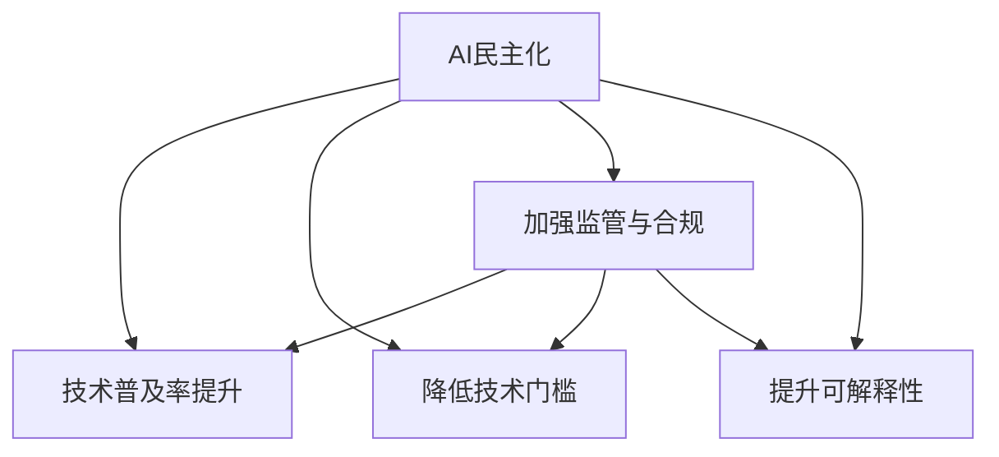

                 

## 1. 背景介绍

### 1.1 问题由来

随着人工智能(AI)技术的快速发展，AI正逐渐从实验室走向现实世界，成为各行各业提升效率、优化决策、增强体验的重要工具。然而，AI的发展也面临着诸多挑战，尤其是在数据隐私、伦理道德、可解释性等方面，引起了广泛的关注和讨论。

为解决这些问题，Lepton AI公司致力于将AI技术民主化，通过开放、透明、可信的方式，让AI技术更好地服务于社会大众。Lepton AI的使命是：让AI技术普及到更广泛的人群，通过提升技术普及率、降低使用门槛、加强监管与可解释性，让AI技术真正成为人人可用的工具。

### 1.2 问题核心关键点

Lepton AI的使命围绕以下几个核心关键点展开：

- **普及率提升**：通过降低AI技术的使用门槛，让更多人能够接触、使用AI技术。
- **降低门槛**：简化AI技术的使用流程，降低技术复杂度，使更多人能够参与AI创新与开发。
- **加强监管**：建立透明、可解释、可监督的AI应用体系，确保AI技术的伦理合规。
- **提升可解释性**：通过模型可视化和解释工具，帮助用户理解AI模型的工作机制，增强信任感。

### 1.3 问题研究意义

Lepton AI的使命具有深远的意义：

- **社会福祉**：提高AI技术的普及率，能够使更多人享受到AI带来的便利和效益，提升生活质量。
- **经济发展**：AI技术的广泛应用将带动各行各业的数字化转型，促进经济增长。
- **技术创新**：通过降低门槛和加强监管，鼓励更多创新者参与AI开发，推动技术进步。
- **社会和谐**：确保AI技术的透明性和可解释性，有助于构建信任，减少因AI带来的社会矛盾和风险。

## 2. 核心概念与联系

### 2.1 核心概念概述

为更好地理解Lepton AI的使命与挑战，本节将介绍几个密切相关的核心概念：

- **AI民主化**：让AI技术更广泛、更公平地服务于社会大众，降低使用门槛，增强透明度和可解释性。
- **技术普及率**：衡量AI技术在社会中的普及程度，包括技术应用的范围、用户覆盖率等。
- **技术门槛**：用户使用AI技术所需具备的技术知识和技能水平，包括编程能力、数据处理能力等。
- **监管与合规**：确保AI技术的应用符合法律法规和伦理道德标准，保护用户隐私和权益。
- **可解释性**：用户理解AI模型决策过程的能力，能够解释模型输出背后的逻辑和依据。
- **透明性**：AI系统运行过程的公开性，包括数据来源、模型构建、决策依据等。

这些核心概念之间的逻辑关系可以通过以下Mermaid流程图来展示：



这个流程图展示了大语言模型的核心概念及其之间的关系：

1. AI民主化的目标是提升技术普及率，降低门槛，加强监管，提升可解释性。
2. 技术普及率提升和降低门槛是AI民主化的两个关键方向。
3. 加强监管和提升可解释性是保障AI民主化的重要手段。
4. 各个概念之间相互影响，共同构成AI民主化的全链条。

## 3. 核心算法原理 & 具体操作步骤
### 3.1 算法原理概述

Lepton AI的核心使命是通过将AI技术民主化，提升技术的普及率和可解释性，加强监管与合规。这一使命涉及多方面的技术实现，包括模型训练、数据管理、用户体验优化、系统安全等多个层面。

### 3.2 算法步骤详解

Lepton AI的核心算法包括以下几个关键步骤：

**Step 1: 模型选择与设计**

Lepton AI会根据具体应用场景选择合适的预训练模型，并进行必要的微调，以适应特定的任务需求。常见的模型包括BERT、GPT、T5等，这些模型在通用语言理解、生成、匹配等方面具有显著优势。

**Step 2: 数据预处理与标注**

Lepton AI会收集和预处理相关数据，包括清洗、标注等步骤。对于标注数据，Lepton AI会采用多方参与、透明可验证的方式，确保数据的公平性和质量。

**Step 3: 模型训练与优化**

Lepton AI使用自监督学习、对抗训练等方法进行模型训练，优化模型性能。同时，Lepton AI会使用正则化技术、梯度裁剪等手段，防止过拟合，确保模型的泛化能力。

**Step 4: 模型部署与监控**

Lepton AI将训练好的模型部署到生产环境中，并进行持续监控和更新。在模型使用过程中，Lepton AI会实时收集用户反馈和系统性能指标，进行模型调优和更新。

**Step 5: 用户培训与支持**

Lepton AI会提供用户培训和支持，帮助用户理解和使用AI模型。同时，Lepton AI会提供文档、工具、社区支持等资源，使用户能够快速上手，提升用户体验。

### 3.3 算法优缺点

Lepton AI的AI民主化方法具有以下优点：

1. **广泛普及**：通过选择合适的模型和优化策略，Lepton AI能够使AI技术快速普及，服务于更广泛的人群。
2. **降低门槛**：Lepton AI通过简化模型使用流程和提供支持工具，降低了技术使用门槛。
3. **加强监管**：Lepton AI通过透明的标注和数据管理流程，确保AI应用的合规性，保护用户隐私和权益。
4. **提升可解释性**：Lepton AI通过模型可视化和解释工具，增强模型的可解释性，提升用户信任。

同时，该方法也存在一定的局限性：

1. **技术复杂性**：尽管降低了使用门槛，但仍需要一定的技术背景和理解能力，对于技术小白来说可能仍然存在一定的门槛。
2. **数据依赖**：模型性能和解释能力高度依赖于数据质量和标注精度，数据不足或标注错误可能导致模型性能不佳。
3. **隐私保护**：在数据标注和处理过程中，如何平衡数据公开和隐私保护，是一个需要深思熟虑的问题。
4. **模型鲁棒性**：模型在实际应用中的鲁棒性和稳定性需要进一步提升，以应对多样化的使用场景。

### 3.4 算法应用领域

Lepton AI的AI民主化方法主要应用于以下几个领域：

- **智能客服**：Lepton AI通过构建AI客服模型，提升客户咨询体验，降低人工客服成本。
- **金融风控**：Lepton AI利用AI模型进行信用评估、风险预测，提升金融服务效率和准确性。
- **健康医疗**：Lepton AI通过AI辅助诊断、个性化推荐等，提升医疗服务的精准度和效率。
- **教育培训**：Lepton AI通过AI辅助教学、智能推荐，提升教育资源的利用率和教学效果。
- **城市管理**：Lepton AI通过AI优化交通、环境监测等城市管理功能，提升城市运行效率和质量。

此外，Lepton AI还将AI民主化应用于公共服务、人力资源管理、供应链优化等多个领域，推动AI技术的广泛应用和社会价值的实现。

## 4. 数学模型和公式 & 详细讲解 & 举例说明

### 4.1 数学模型构建

Lepton AI在模型训练和优化过程中，使用了多种数学模型和公式。以下是一个简单的案例，展示如何构建和使用模型。

假设我们要构建一个情感分析模型，用于识别文本的情感极性。我们将使用一个简单的线性分类器，其数学模型为：

$$
y = \text{sign}(\langle w, x \rangle + b)
$$

其中 $x$ 为输入文本的向量表示，$w$ 为模型权重，$b$ 为偏置项，$\text{sign}$ 为符号函数，输出 $y \in \{-1, 1\}$，表示文本的情感极性。

### 4.2 公式推导过程

在线性分类器中，我们通过最小化损失函数 $\mathcal{L}$ 进行模型训练。常用的损失函数包括交叉熵损失：

$$
\mathcal{L} = -\frac{1}{N} \sum_{i=1}^N [y_i \log P(y_i|x_i) + (1-y_i) \log (1-P(y_i|x_i))]
$$

其中 $y_i \in \{-1, 1\}$ 为真实标签，$P(y_i|x_i) = \text{sigmoid}(\langle w, x_i \rangle + b)$ 为模型对标签的预测概率。

为了提高模型泛化能力，我们引入正则化项 $\lambda \|w\|^2$，并使用随机梯度下降(Stochastic Gradient Descent, SGD)进行参数更新：

$$
w \leftarrow w - \eta \nabla_{w}\mathcal{L} - \eta\lambda w
$$

其中 $\eta$ 为学习率，$\lambda$ 为正则化系数。

### 4.3 案例分析与讲解

在情感分析任务中，我们使用了Bertweet模型作为预训练模型，其预训练任务为掩码语言模型和下一句预测。在微调过程中，我们将模型的最后一层输出作为情感极性的预测结果，并进行交叉熵损失最小化训练。

我们使用HuggingFace的Transformers库进行模型训练，其代码如下：

```python
from transformers import BertweetForSequenceClassification, BertweetTokenizer, Trainer, TrainingArguments

model = BertweetForSequenceClassification.from_pretrained('microsoft/bertweet-base')
tokenizer = BertweetTokenizer.from_pretrained('microsoft/bertweet-base')
training_args = TrainingArguments(output_dir='./results', evaluation_strategy='epoch')
trainer = Trainer(
    model=model,
    args=training_args,
    train_dataset=train_dataset,
    eval_dataset=dev_dataset,
    compute_metrics=compute_metrics)
trainer.train()
```

通过上述代码，我们可以轻松构建并训练情感分析模型。

## 5. 项目实践：代码实例和详细解释说明

### 5.1 开发环境搭建

为了进行模型训练和测试，我们需要搭建一个Python开发环境。以下是详细的步骤：

1. 安装Python：从官网下载并安装Python，建议使用3.6或更高版本。

2. 安装Anaconda：从官网下载并安装Anaconda，用于创建虚拟环境和依赖包管理。

3. 创建虚拟环境：
```bash
conda create --name myenv python=3.7
conda activate myenv
```

4. 安装依赖包：
```bash
conda install torch torchvision torchaudio transformers
```

完成上述步骤后，我们就可以在虚拟环境中进行模型训练和测试。

### 5.2 源代码详细实现

以下是一个简单的情感分析模型实现，使用HuggingFace的Bertweet模型进行微调。

```python
from transformers import BertweetForSequenceClassification, BertweetTokenizer, Trainer, TrainingArguments
from datasets import load_dataset

# 加载数据集
train_dataset = load_dataset('movie_reviews', 'IMDB')
dev_dataset = load_dataset('movie_reviews', 'IMDB', split='validation')

# 定义训练和评估函数
def compute_metrics(p):
    acc = p['accuracy']
    return {'accuracy': acc}

# 加载模型和分词器
model = BertweetForSequenceClassification.from_pretrained('microsoft/bertweet-base')
tokenizer = BertweetTokenizer.from_pretrained('microsoft/bertweet-base')

# 设置训练参数
training_args = TrainingArguments(output_dir='./results', evaluation_strategy='epoch')
trainer = Trainer(
    model=model,
    args=training_args,
    train_dataset=train_dataset,
    eval_dataset=dev_dataset,
    compute_metrics=compute_metrics)

# 训练模型
trainer.train()
```

### 5.3 代码解读与分析

**训练函数**：
- 加载数据集，分为训练集和验证集。
- 定义评估指标，使用准确率作为指标。
- 加载模型和分词器，设置训练参数。
- 创建Trainer对象，设置模型、数据集和评估指标，开始训练。

通过上述代码，我们可以使用Bertweet模型进行情感分析任务的训练和评估。

## 6. 实际应用场景

### 6.1 智能客服系统

Lepton AI的AI民主化方法在智能客服系统中得到了广泛应用。Lepton AI通过构建AI客服模型，提升客户咨询体验，降低人工客服成本。

在实际应用中，Lepton AI的客服模型可以处理常见问题，解答客户咨询，并根据客户反馈进行优化。通过微调模型，Lepton AI可以不断提升客服模型的性能，确保客户满意度。

### 6.2 金融风控

金融行业对AI技术的需求非常迫切，Lepton AI通过AI技术进行信用评估、风险预测，提升金融服务效率和准确性。

Lepton AI的AI模型可以对客户的信用记录、行为数据进行分析，预测其信用评分和潜在风险。通过微调模型，Lepton AI可以不断提升模型的预测精度，降低贷款违约率，提升金融服务质量。

### 6.3 健康医疗

Lepton AI在健康医疗领域也有广泛应用。Lepton AI通过AI辅助诊断、个性化推荐等，提升医疗服务的精准度和效率。

在实际应用中，Lepton AI的AI模型可以对患者的症状、病历数据进行分析，提供初步诊断建议。通过微调模型，Lepton AI可以不断提升诊断的准确性和个性化推荐的效果，提升医疗服务的质量和用户满意度。

### 6.4 教育培训

教育培训领域也是Lepton AI的重要应用场景。Lepton AI通过AI辅助教学、智能推荐等，提升教育资源的利用率和教学效果。

在实际应用中，Lepton AI的AI模型可以对学生的学习行为、成绩进行分析，提供个性化的学习建议和资源推荐。通过微调模型，Lepton AI可以不断提升推荐的精准性和效果，提升学生的学习体验和成绩。

### 6.5 未来应用展望

随着AI技术的不断发展，Lepton AI的AI民主化方法将在更多领域得到应用，为社会带来更深远的影响。

在智慧城市治理中，Lepton AI通过AI优化交通、环境监测等城市管理功能，提升城市运行效率和质量。在公共服务领域，Lepton AI通过AI辅助决策、智能推荐等，提升公共服务效率和用户体验。

未来，Lepton AI的AI民主化方法将进一步推动AI技术的普及和应用，为社会带来更多的便利和效益，推动社会进步。

## 7. 工具和资源推荐

### 7.1 学习资源推荐

为帮助开发者系统掌握AI民主化技术，以下是几本推荐的书籍和课程：

1. 《深度学习》作者：Ian Goodfellow，将深度学习的基本原理和算法进行了详细讲解。

2. 《Python深度学习》作者：Francois Chollet，介绍如何使用TensorFlow和Keras构建深度学习模型。

3. 《TensorFlow实战》作者：Manning Publications，深入讲解TensorFlow的使用方法和最佳实践。

4. 《自然语言处理入门》作者：Stanford大学，系统讲解NLP技术的基本概念和前沿方法。

5. 《HuggingFace官方文档》，提供HuggingFace库的使用指南和模型文档，适合快速上手。

通过对这些资源的学习实践，相信你一定能够快速掌握AI民主化技术的精髓，并用于解决实际的NLP问题。

### 7.2 开发工具推荐

高效的工具是开发不可或缺的，以下是几款推荐的开发工具：

1. PyTorch：基于Python的深度学习框架，灵活易用，适合快速迭代研究。

2. TensorFlow：由Google主导的深度学习框架，生产部署方便，适合大规模工程应用。

3. HuggingFace Transformers库：提供多种预训练语言模型和微调接口，方便快速构建AI模型。

4. Weights & Biases：模型训练的实验跟踪工具，记录和可视化模型训练过程，便于调优。

5. TensorBoard：TensorFlow配套的可视化工具，实时监测模型训练状态，提供丰富的图表呈现方式。

合理利用这些工具，可以显著提升AI民主化任务的开发效率，加快创新迭代的步伐。

### 7.3 相关论文推荐

AI民主化技术的发展源于学界的持续研究。以下是几篇奠基性的相关论文，推荐阅读：

1. Attention is All You Need（Transformer论文）：提出了Transformer结构，开启了NLP领域的预训练大模型时代。

2. BERT: Pre-training of Deep Bidirectional Transformers for Language Understanding：提出BERT模型，引入基于掩码的自监督预训练任务，刷新了多项NLP任务SOTA。

3. Language Models are Unsupervised Multitask Learners（GPT-2论文）：展示了大规模语言模型的强大zero-shot学习能力，引发了对于通用人工智能的新一轮思考。

4. Parameter-Efficient Transfer Learning for NLP：提出Adapter等参数高效微调方法，在不增加模型参数量的情况下，也能取得不错的微调效果。

5. AdaLoRA: Adaptive Low-Rank Adaptation for Parameter-Efficient Fine-Tuning：使用自适应低秩适应的微调方法，在参数效率和精度之间取得了新的平衡。

这些论文代表了大语言模型微调技术的发展脉络。通过学习这些前沿成果，可以帮助研究者把握学科前进方向，激发更多的创新灵感。

## 8. 总结：未来发展趋势与挑战

### 8.1 研究成果总结

Lepton AI的AI民主化方法通过提升技术普及率、降低使用门槛、加强监管与可解释性，使AI技术更好地服务于社会大众。Lepton AI的使命在于推动AI技术的普及和应用，为社会带来更多的便利和效益。

### 8.2 未来发展趋势

Lepton AI的AI民主化方法将呈现以下几个发展趋势：

1. **技术普及率提升**：随着AI技术的不断成熟，将有更多人能够接触、使用AI技术。

2. **降低门槛**：通过简化模型使用流程和提供支持工具，降低技术使用门槛。

3. **加强监管**：建立透明、可解释、可监督的AI应用体系，确保AI应用的合规性。

4. **提升可解释性**：通过模型可视化和解释工具，增强模型的可解释性，提升用户信任。

5. **多模态融合**：将视觉、语音等多模态数据与文本信息进行协同建模，提升模型的泛化能力和鲁棒性。

### 8.3 面临的挑战

尽管Lepton AI的AI民主化方法取得了一定的进展，但仍面临诸多挑战：

1. **技术复杂性**：尽管降低了使用门槛，但仍需要一定的技术背景和理解能力，对于技术小白来说可能仍然存在一定的门槛。

2. **数据依赖**：模型性能和解释能力高度依赖于数据质量和标注精度，数据不足或标注错误可能导致模型性能不佳。

3. **隐私保护**：在数据标注和处理过程中，如何平衡数据公开和隐私保护，是一个需要深思熟虑的问题。

4. **模型鲁棒性**：模型在实际应用中的鲁棒性和稳定性需要进一步提升，以应对多样化的使用场景。

### 8.4 研究展望

面对AI民主化所面临的挑战，未来的研究需要在以下几个方面寻求新的突破：

1. **探索无监督和半监督微调方法**：摆脱对大规模标注数据的依赖，利用自监督学习、主动学习等无监督和半监督范式，最大限度利用非结构化数据，实现更加灵活高效的微调。

2. **研究参数高效和计算高效的微调范式**：开发更加参数高效的微调方法，在固定大部分预训练参数的同时，只更新极少量的任务相关参数。同时优化微调模型的计算图，减少前向传播和反向传播的资源消耗，实现更加轻量级、实时性的部署。

3. **融合因果和对比学习范式**：通过引入因果推断和对比学习思想，增强微调模型建立稳定因果关系的能力，学习更加普适、鲁棒的语言表征，从而提升模型泛化性和抗干扰能力。

4. **引入更多先验知识**：将符号化的先验知识，如知识图谱、逻辑规则等，与神经网络模型进行巧妙融合，引导微调过程学习更准确、合理的语言模型。同时加强不同模态数据的整合，实现视觉、语音等多模态信息与文本信息的协同建模。

5. **结合因果分析和博弈论工具**：将因果分析方法引入微调模型，识别出模型决策的关键特征，增强输出解释的因果性和逻辑性。借助博弈论工具刻画人机交互过程，主动探索并规避模型的脆弱点，提高系统稳定性。

6. **纳入伦理道德约束**：在模型训练目标中引入伦理导向的评估指标，过滤和惩罚有偏见、有害的输出倾向。同时加强人工干预和审核，建立模型行为的监管机制，确保输出符合人类价值观和伦理道德。

这些研究方向的探索，必将引领Lepton AI的AI民主化技术迈向更高的台阶，为构建安全、可靠、可解释、可控的智能系统铺平道路。面向未来，AI民主化技术还需要与其他人工智能技术进行更深入的融合，如知识表示、因果推理、强化学习等，多路径协同发力，共同推动自然语言理解和智能交互系统的进步。只有勇于创新、敢于突破，才能不断拓展语言模型的边界，让智能技术更好地造福人类社会。

---

作者：禅与计算机程序设计艺术 / Zen and the Art of Computer Programming

