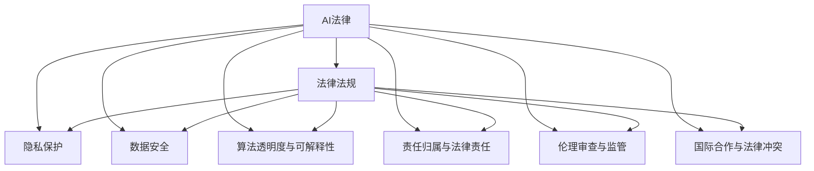

                 

# AI相关法律法规原理与代码实战案例讲解

> 关键词：AI法律,法律法规,隐私保护,数据安全,代码实战

## 1. 背景介绍

### 1.1 问题由来
随着人工智能技术的迅猛发展，AI相关法律法规问题日益突出。全球各地政府和国际组织对此展开了广泛讨论与立法，旨在规范AI技术应用，保护个人隐私和数据安全，同时促进AI技术的健康发展。然而，AI的复杂性和高度技术性使得现有法律法规的适用性面临挑战。

### 1.2 问题核心关键点
AI相关法律法规的核心关键点包括但不限于：
- 数据隐私保护：如何确保个人信息不被滥用，同时保障数据自由流通和利用。
- 算法透明度与可解释性：如何增强算法的可解释性，避免“黑盒”决策，确保决策公正透明。
- 责任归属与法律责任：AI系统发生错误时，如何界定各方责任，确保追责机制健全。
- 伦理审查与监管：如何构建伦理审查机制，避免AI技术用于不当行为。
- 国际合作与法律冲突：不同国家对AI立法差异如何协调，确保跨境数据与系统合规。

这些关键点涉及技术、法律、伦理等多方面，需要深入理解和应对。

## 2. 核心概念与联系

### 2.1 核心概念概述

为更好地理解AI相关法律法规，本节将介绍几个密切相关的核心概念：

- **AI法律**：指涉及AI技术开发、应用、管理和监管的法律法规体系。
- **法律法规**：指具有法律效力的规定和指导原则，旨在规范行为，维护秩序。
- **隐私保护**：指在收集、存储、使用个人数据过程中，确保个人隐私不受侵犯。
- **数据安全**：指保护数据在传输、存储和使用过程中的安全性，防止数据泄露或被篡改。
- **算法透明度与可解释性**：指算法的决策过程能够被理解，结果可被解释，确保算法决策的公正透明。
- **责任归属与法律责任**：指在AI系统出现故障或错误时，如何界定各方的法律责任。
- **伦理审查与监管**：指通过伦理审查和合规检查，确保AI技术的道德伦理符合社会规范。
- **国际合作与法律冲突**：指不同国家对AI技术的法律规定存在差异，需要通过国际合作协调解决冲突。

这些概念之间存在密切联系，共同构成AI相关法律法规的整体框架。

### 2.2 核心概念原理和架构的 Mermaid 流程图



这个流程图展示了大语言模型的核心概念及其之间的联系：

1. AI法律体系对法律法规的规范作用。
2. 法律法规对隐私保护、数据安全、算法透明度与可解释性、责任归属与法律责任、伦理审查与监管等方面的指导和约束。
3. 隐私保护、数据安全、算法透明度与可解释性、责任归属与法律责任、伦理审查与监管、国际合作与法律冲突等多个方面互相影响，共同构建AI技术的法律环境。

## 3. 核心算法原理 & 具体操作步骤

### 3.1 算法原理概述

AI相关法律法规的核心算法原理主要包括以下几点：

- **隐私保护算法**：利用差分隐私、联邦学习等技术，在保证数据可用性的同时，保护个人隐私。
- **数据安全算法**：通过加密技术、访问控制等手段，确保数据传输和存储过程中的安全性。
- **算法透明度与可解释性算法**：引入可解释AI技术，如规则模型、特征重要性分析等，增强算法的可解释性。
- **责任归属与法律责任算法**：构建模型责任分配机制，通过AI系统自身的行为日志，界定各方责任。
- **伦理审查与监管算法**：引入伦理审查机制，通过AI系统的行为评估，确保算法决策符合伦理规范。

这些算法共同作用，在AI系统设计、开发、应用、管理的全流程中，确保AI技术的合法合规使用。

### 3.2 算法步骤详解

**隐私保护算法步骤**：

1. 收集数据时，使用差分隐私技术，添加噪声干扰原始数据分布。
2. 联邦学习框架下，各参与方在本地训练模型，不共享原始数据。
3. 使用安全多方计算协议，确保各参与方在数据不公开的前提下，协同训练模型。

**数据安全算法步骤**：

1. 数据传输过程中，使用TLS/SSL等加密协议，确保数据不被窃听。
2. 数据存储时，使用AES等对称加密算法，保护数据不被未授权访问。
3. 访问控制机制下，严格控制各用户角色权限，防止数据泄露。

**算法透明度与可解释性算法步骤**：

1. 使用规则模型，将算法的决策过程显式化。
2. 特征重要性分析，展示模型中各特征的贡献度。
3. 提供可解释性报告，解释模型决策的依据和逻辑。

**责任归属与法律责任算法步骤**：

1. 记录AI系统的行为日志，包括输入、输出、中间结果等。
2. 通过行为日志分析，确定系统故障或错误的责任方。
3. 责任方根据法律法规承担相应的法律责任。

**伦理审查与监管算法步骤**：

1. 设计伦理审查机制，对AI系统的决策进行伦理评估。
2. 定期进行合规检查，确保系统行为符合伦理规范。
3. 建立伦理审查报告，定期发布合规情况和改进建议。

### 3.3 算法优缺点

**隐私保护算法优缺点**：

- **优点**：
  - 保护用户隐私，防止数据滥用。
  - 维护数据可用性和数据流动性。
- **缺点**：
  - 可能引入噪声，降低数据精度。
  - 复杂度高，增加系统复杂性。

**数据安全算法优缺点**：

- **优点**：
  - 确保数据在传输和存储过程中的安全性。
  - 防止数据泄露和篡改。
- **缺点**：
  - 增加系统复杂性，影响性能。
  - 需持续维护，防止攻击。

**算法透明度与可解释性算法优缺点**：

- **优点**：
  - 提高算法的可解释性，增强用户信任。
  - 帮助识别和纠正算法偏见。
- **缺点**：
  - 部分算法复杂，难以实现。
  - 可能降低模型精度。

**责任归属与法律责任算法优缺点**：

- **优点**：
  - 明确责任归属，便于追责。
  - 建立透明决策过程，增强公平性。
- **缺点**：
  - 复杂度高，需综合考虑多种因素。
  - 可能存在争议。

**伦理审查与监管算法优缺点**：

- **优点**：
  - 确保AI系统符合伦理规范，减少伦理风险。
  - 建立系统信任，增强社会接受度。
- **缺点**：
  - 需定期审查，增加维护成本。
  - 可能存在伦理审查偏差。

### 3.4 算法应用领域

AI相关法律法规算法在以下领域有着广泛应用：

- **医疗健康**：确保患者隐私保护，防止医疗数据泄露。
- **金融服务**：保障用户金融信息安全，防止数据滥用。
- **智能制造**：保护生产数据安全，防止数据泄露。
- **公共安全**：确保政府数据安全，防止数据滥用。
- **智能交通**：保护出行数据隐私，防止数据泄露。

## 4. 数学模型和公式 & 详细讲解 & 举例说明

### 4.1 数学模型构建

以下是大语言模型微调过程中涉及的数学模型构建：

**隐私保护数学模型**：

- **差分隐私**：
  $$
  \epsilon\text{-}DP: \frac{1}{\epsilon}\log\left(\frac{1}{\delta}\sum_{x\in \mathcal{X}}e^{-\epsilon d(x,x')}\right) \leq \log|\mathcal{Y}|
  $$
  其中 $\epsilon$ 为隐私保护强度，$\delta$ 为失败概率，$d$ 为差分距离。

**数据安全数学模型**：

- **AES加密**：
  $$
  C=Enc_k(M)=F_k(M\oplus K_1)
  $$
  其中 $k$ 为密钥，$F_k$ 为加密函数，$\oplus$ 为异或运算。

**算法透明度与可解释性数学模型**：

- **特征重要性分析**：
  $$
  \text{importance}(x_i) = \frac{\partial L(\theta)}{\partial x_i}
  $$
  其中 $L(\theta)$ 为损失函数，$\partial$ 表示偏导数。

**责任归属与法律责任数学模型**：

- **行为日志记录**：
  $$
  \log_{\theta}(x_i) = \{I(x_i)\}
  $$
  其中 $\log_{\theta}(x_i)$ 为模型预测输出，$I(x_i)$ 为行为日志记录。

**伦理审查与监管数学模型**：

- **伦理评分**：
  $$
  \text{score} = \sum_{i=1}^N \text{weight}_i \times \text{ethic}_i
  $$
  其中 $\text{weight}_i$ 为伦理指标权重，$\text{ethic}_i$ 为伦理评分值。

### 4.2 公式推导过程

**隐私保护算法公式推导**：

- **差分隐私公式推导**：
  $$
  \begin{aligned}
  L_{\epsilon,\delta}(P) &= \log\left(\frac{1}{\delta}\sum_{x\in \mathcal{X}}e^{-\epsilon d(x,x')}e^{-\epsilon d(x',x)}\right) \\
  &= \log\left(\frac{1}{\delta}\sum_{x\in \mathcal{X}}e^{-\epsilon d(x,x')}e^{-\epsilon d(x',x)}\right) \\
  &= \log\left(\frac{1}{\delta}\sum_{x\in \mathcal{X}}e^{-2\epsilon d(x,x')}\right)
  \end{aligned}
  $$
  其中 $\delta$ 为失败概率，$d$ 为差分距离。

**数据安全算法公式推导**：

- **AES加密公式推导**：
  $$
  C=Enc_k(M)=F_k(M\oplus K_1)
  $$
  其中 $k$ 为密钥，$F_k$ 为加密函数，$\oplus$ 为异或运算。

**算法透明度与可解释性算法公式推导**：

- **特征重要性分析公式推导**：
  $$
  \text{importance}(x_i) = \frac{\partial L(\theta)}{\partial x_i}
  $$
  其中 $L(\theta)$ 为损失函数，$\partial$ 表示偏导数。

**责任归属与法律责任算法公式推导**：

- **行为日志记录公式推导**：
  $$
  \log_{\theta}(x_i) = \{I(x_i)\}
  $$
  其中 $\log_{\theta}(x_i)$ 为模型预测输出，$I(x_i)$ 为行为日志记录。

**伦理审查与监管算法公式推导**：

- **伦理评分公式推导**：
  $$
  \text{score} = \sum_{i=1}^N \text{weight}_i \times \text{ethic}_i
  $$
  其中 $\text{weight}_i$ 为伦理指标权重，$\text{ethic}_i$ 为伦理评分值。

### 4.3 案例分析与讲解

**案例一：差分隐私在社交媒体平台中的应用**

- **问题**：社交媒体平台收集用户数据用于个性化推荐，但用户隐私风险较高。
- **解决方案**：使用差分隐私技术，在统计数据发布前添加噪声，保护用户隐私。
- **实现过程**：
  1. 收集用户数据，进行聚合统计。
  2. 对统计结果添加噪声，扰乱原始数据分布。
  3. 发布扰动后的统计数据，确保用户隐私安全。

**案例二：AES加密在金融系统中应用**

- **问题**：金融系统处理大量敏感数据，数据泄露风险高。
- **解决方案**：使用AES加密技术，确保数据在传输和存储过程中的安全性。
- **实现过程**：
  1. 传输前，对数据进行AES加密。
  2. 接收方接收到数据后，使用AES解密算法还原数据。
  3. 存储时，同样使用AES加密保护数据。

**案例三：特征重要性分析在医疗诊断中的应用**

- **问题**：医疗诊断系统复杂度高，难以解释决策过程。
- **解决方案**：使用特征重要性分析技术，展示各特征对诊断结果的贡献度。
- **实现过程**：
  1. 收集患者数据，进行特征提取。
  2. 使用特征重要性算法，计算各特征重要性。
  3. 根据特征重要性，解释诊断结果。

## 5. 项目实践：代码实例和详细解释说明

### 5.1 开发环境搭建

在进行AI相关法律法规代码实践前，我们需要准备好开发环境。以下是使用Python进行PyTorch开发的环境配置流程：

1. 安装Anaconda：从官网下载并安装Anaconda，用于创建独立的Python环境。

2. 创建并激活虚拟环境：
```bash
conda create -n ai-env python=3.8 
conda activate ai-env
```

3. 安装PyTorch：根据CUDA版本，从官网获取对应的安装命令。例如：
```bash
conda install pytorch torchvision torchaudio cudatoolkit=11.1 -c pytorch -c conda-forge
```

4. 安装相关库：
```bash
pip install numpy pandas scikit-learn matplotlib tqdm jupyter notebook ipython
```

完成上述步骤后，即可在`ai-env`环境中开始AI相关法律法规的代码实践。

### 5.2 源代码详细实现

下面我们以差分隐私和AES加密的实现为例，给出Python代码实现。

**差分隐私实现**：

```python
import numpy as np
from scipy.stats import laplace

def laplace_noise(m, epsilon, delta):
    noise = np.random.laplace(0, 1/epsilon)
    return m + noise

def differential_privacy(m, epsilon, delta):
    num_samples = len(m)
    num_features = len(m[0])
    for i in range(num_features):
        m[:, i] = laplace_noise(m[:, i], epsilon, delta)
    return m
```

**AES加密实现**：

```python
from Crypto.Cipher import AES
from Crypto.Random import get_random_bytes

def encrypt(data, key):
    iv = get_random_bytes(AES.block_size)
    cipher = AES.new(key, AES.MODE_CBC, iv)
    ciphertext = iv + cipher.encrypt(data)
    return ciphertext

def decrypt(ciphertext, key):
    iv = ciphertext[:AES.block_size]
    cipher = AES.new(key, AES.MODE_CBC, iv)
    plaintext = cipher.decrypt(ciphertext[AES.block_size:])
    return plaintext
```

**代码解读与分析**：

- **差分隐私实现**：
  - `laplace_noise`函数：使用拉普拉斯分布生成噪声，扰动原始数据分布。
  - `differential_privacy`函数：遍历数据集的每一列，为每个特征添加噪声，确保隐私保护。

- **AES加密实现**：
  - `encrypt`函数：使用AES加密算法，对数据进行加密，并生成随机的初始化向量IV。
  - `decrypt`函数：使用AES解密算法，还原加密数据。

## 6. 实际应用场景

### 6.1 智能医疗

**应用场景**：智能医疗系统收集患者数据，用于疾病预测和治疗方案推荐。

**解决方案**：
- **隐私保护**：使用差分隐私技术，保护患者隐私。
- **数据安全**：使用AES加密技术，保护数据在传输和存储过程中的安全性。

**实现过程**：
- 收集患者数据，进行特征提取。
- 对特征数据添加噪声，确保隐私保护。
- 使用AES加密技术，保护数据在传输和存储过程中的安全性。

### 6.2 智能金融

**应用场景**：智能金融系统处理用户交易数据，进行信用评估和风险控制。

**解决方案**：
- **隐私保护**：使用差分隐私技术，保护用户隐私。
- **数据安全**：使用AES加密技术，保护数据在传输和存储过程中的安全性。

**实现过程**：
- 收集用户交易数据，进行特征提取。
- 对特征数据添加噪声，确保隐私保护。
- 使用AES加密技术，保护数据在传输和存储过程中的安全性。

### 6.3 智能制造

**应用场景**：智能制造系统收集生产数据，进行设备维护和质量监控。

**解决方案**：
- **隐私保护**：使用差分隐私技术，保护生产数据隐私。
- **数据安全**：使用AES加密技术，保护数据在传输和存储过程中的安全性。

**实现过程**：
- 收集生产数据，进行特征提取。
- 对特征数据添加噪声，确保隐私保护。
- 使用AES加密技术，保护数据在传输和存储过程中的安全性。

### 6.4 未来应用展望

随着AI相关法律法规的不断完善，AI技术将在更多领域得到应用，带来新的发展机遇：

- **智能家居**：智能家居系统处理用户行为数据，进行智能推荐和设备控制。
- **智能交通**：智能交通系统处理车辆数据，进行交通流量分析和优化。
- **智能教育**：智能教育系统处理学生数据，进行个性化学习和辅导。

## 7. 工具和资源推荐

### 7.1 学习资源推荐

为了帮助开发者系统掌握AI相关法律法规的理论基础和实践技巧，这里推荐一些优质的学习资源：

1. **《人工智能法律法规》系列博文**：由AI法律专家撰写，深入浅出地介绍了AI相关法律法规的理论和实践。
2. **CS224N《人工智能与伦理》课程**：斯坦福大学开设的AI伦理课程，涵盖AI伦理、隐私保护、法律责任等主题，适合入门学习。
3. **《AI法律法规》书籍**：系统介绍了AI相关法律法规的理论和应用，涵盖隐私保护、数据安全、算法透明度等主题。
4. **HuggingFace官方文档**：提供海量预训练模型和代码实例，是实践AI相关法律法规技术的利器。
5. **CLUE开源项目**：中文语言理解测评基准，涵盖大量不同类型的中文AI法律法规数据集，并提供了基于微调的baseline模型，助力AI法律法规技术发展。

通过对这些资源的学习实践，相信你一定能够快速掌握AI相关法律法规的精髓，并用于解决实际的AI法律法规问题。

### 7.2 开发工具推荐

高效的开发离不开优秀的工具支持。以下是几款用于AI相关法律法规开发的常用工具：

1. **PyTorch**：基于Python的开源深度学习框架，灵活动态的计算图，适合快速迭代研究。
2. **TensorFlow**：由Google主导开发的开源深度学习框架，生产部署方便，适合大规模工程应用。
3. **Python**：简单易用的编程语言，拥有丰富的第三方库，是AI相关法律法规开发的主流选择。
4. **Jupyter Notebook**：交互式编程环境，方便编写和测试代码。
5. **Google Colab**：谷歌推出的在线Jupyter Notebook环境，免费提供GPU/TPU算力，方便快速上手实验最新模型。

合理利用这些工具，可以显著提升AI相关法律法规的开发效率，加快创新迭代的步伐。

### 7.3 相关论文推荐

AI相关法律法规的研究源于学界的持续研究。以下是几篇奠基性的相关论文，推荐阅读：

1. **《数据隐私保护技术综述》**：介绍差分隐私、联邦学习等隐私保护技术，为AI法律法规提供技术支持。
2. **《数据安全算法研究综述》**：介绍AES、RSA等数据安全算法，为AI法律法规提供安全保障。
3. **《算法透明度与可解释性技术综述》**：介绍规则模型、特征重要性分析等算法透明度与可解释性技术，增强AI系统的可解释性。
4. **《责任归属与法律责任研究综述》**：介绍行为日志记录、责任分配机制等技术，为AI法律法规提供责任归属方案。
5. **《伦理审查与监管技术综述》**：介绍伦理审查机制、合规检查等技术，确保AI系统符合伦理规范。

这些论文代表了大语言模型微调技术的发展脉络。通过学习这些前沿成果，可以帮助研究者把握学科前进方向，激发更多的创新灵感。

## 8. 总结：未来发展趋势与挑战

### 8.1 总结

本文对AI相关法律法规进行了全面系统的介绍。首先阐述了AI相关法律法规的研究背景和意义，明确了法律法规在规范AI技术应用、保护隐私和数据安全、确保算法透明度和责任归属等方面的重要作用。其次，从原理到实践，详细讲解了差分隐私、AES加密、算法透明度与可解释性、责任归属与法律责任、伦理审查与监管等关键算法的数学模型和实现步骤，给出了具体代码实例和解释分析。同时，本文还广泛探讨了AI法律法规在智能医疗、智能金融、智能制造等多个行业领域的应用前景，展示了法律法规技术的巨大潜力。

通过本文的系统梳理，可以看到，AI相关法律法规算法在保护用户隐私、确保数据安全、增强算法透明度、明确责任归属、确保伦理合规等方面发挥着重要作用。这些算法共同作用，在AI系统设计、开发、应用、管理的全流程中，确保AI技术的合法合规使用。

### 8.2 未来发展趋势

展望未来，AI相关法律法规算法将呈现以下几个发展趋势：

1. **隐私保护技术更加普及**：差分隐私、联邦学习等隐私保护技术将更加普及，确保AI技术在更多场景下保护用户隐私。
2. **数据安全技术更加先进**：AES、RSA等数据安全技术将不断进步，确保数据在传输和存储过程中的安全性。
3. **算法透明度与可解释性技术更加完善**：规则模型、特征重要性分析等技术将不断完善，增强算法的可解释性，提升用户信任。
4. **责任归属与法律责任技术更加健全**：行为日志记录、责任分配机制等技术将更加健全，确保AI系统发生错误时，能够明确责任归属。
5. **伦理审查与监管技术更加严格**：伦理审查机制、合规检查等技术将更加严格，确保AI系统符合伦理规范，减少伦理风险。
6. **国际合作与法律冲突更加协调**：不同国家对AI技术的法律规定将更加协调，通过国际合作解决法律冲突，确保跨境数据与系统合规。

以上趋势凸显了AI相关法律法规技术的广阔前景。这些方向的探索发展，必将进一步提升AI技术的合法合规使用，保障用户隐私和数据安全，促进AI技术的健康发展。

### 8.3 面临的挑战

尽管AI相关法律法规技术已经取得了瞩目成就，但在迈向更加智能化、普适化应用的过程中，它仍面临诸多挑战：

1. **法律法规滞后**：现有法律法规可能无法及时适应AI技术发展，滞后于技术进步。
2. **隐私保护难度高**：差分隐私等隐私保护技术复杂度高，需要持续投入资源进行研究。
3. **数据安全风险大**：数据在传输和存储过程中存在较大风险，需要持续投入资源进行安全防护。
4. **算法透明度挑战**：规则模型、特征重要性分析等技术复杂度高，难以实现全面解释。
5. **责任归属复杂**：行为日志记录、责任分配机制等技术复杂，需要综合考虑多种因素进行分配。
6. **伦理审查挑战**：伦理审查机制、合规检查等技术复杂，需定期审查和调整。

正视AI相关法律法规面临的这些挑战，积极应对并寻求突破，将是大语言模型微调走向成熟的必由之路。相信随着学界和产业界的共同努力，这些挑战终将一一被克服，AI法律法规技术必将进一步完善，促进AI技术的健康发展。

### 8.4 研究展望

面向未来，AI相关法律法规技术需要在以下几个方面寻求新的突破：

1. **隐私保护技术创新**：探索更高效、更易于实现的数据隐私保护技术，如差分隐私增强、联邦学习优化等。
2. **数据安全技术突破**：开发更加高效、安全的数据加密和访问控制技术，如零知识证明、同态加密等。
3. **算法透明度技术提升**：增强算法的可解释性，开发更加全面、易懂的可解释性技术，如可解释AI、知识图谱等。
4. **责任归属技术优化**：建立更加透明、公平的责任分配机制，开发责任归属溯源技术，确保追责机制健全。
5. **伦理审查技术升级**：引入更多伦理审查技术，确保AI系统符合伦理规范，如伦理评分、行为评估等。

这些研究方向的探索，必将引领AI法律法规技术的进一步完善，为构建安全、可靠、可解释、可控的智能系统铺平道路。面向未来，AI法律法规技术还需要与其他人工智能技术进行更深入的融合，如知识表示、因果推理、强化学习等，多路径协同发力，共同推动自然语言理解和智能交互系统的进步。只有勇于创新、敢于突破，才能不断拓展AI法律法规技术的边界，让智能技术更好地造福人类社会。

## 9. 附录：常见问题与解答

**Q1：如何实现差分隐私？**

A: 实现差分隐私，可以使用拉普拉斯机制或指数机制，通过添加噪声干扰原始数据分布。例如，使用拉普拉斯分布生成噪声，对原始数据进行扰动。

**Q2：AES加密算法如何使用？**

A: 使用AES加密算法，需要对数据进行加密和解密。具体实现可以参考Python中的Crypto库。在加密时，使用AES加密算法和随机的初始化向量IV，确保数据的安全性。

**Q3：如何确保算法的可解释性？**

A: 确保算法的可解释性，可以使用规则模型、特征重要性分析等技术，展示算法的决策过程和特征贡献度。例如，使用规则模型将算法决策显式化，使用特征重要性分析展示各特征对决策的贡献度。

**Q4：如何处理数据安全问题？**

A: 处理数据安全问题，可以使用AES加密技术，保护数据在传输和存储过程中的安全性。同时，使用访问控制机制，限制各用户角色权限，防止数据泄露。

**Q5：如何界定AI系统故障时的责任归属？**

A: 界定AI系统故障时的责任归属，需要记录AI系统的行为日志，包括输入、输出、中间结果等。通过行为日志分析，确定系统故障或错误的责任方。

**Q6：如何确保AI系统的伦理合规？**

A: 确保AI系统的伦理合规，需要设计伦理审查机制，对AI系统的决策进行伦理评估。定期进行合规检查，确保系统行为符合伦理规范。建立伦理审查报告，定期发布合规情况和改进建议。

作者：禅与计算机程序设计艺术 / Zen and the Art of Computer Programming

