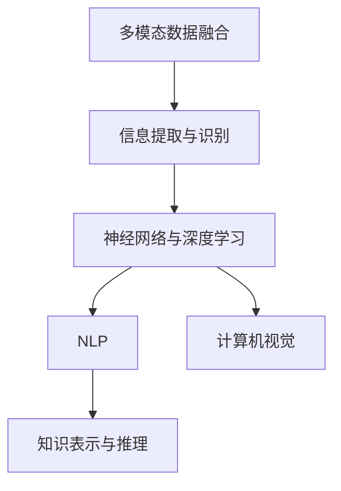

                 

# AI综合处理多维度信息的挑战

> 关键词：多模态数据融合, 信息提取与识别, 神经网络与深度学习, 自然语言处理, 计算机视觉, 知识表示与推理

## 1. 背景介绍

随着信息技术的发展，人们的生活日益数字化和智能化。从互联网到物联网，数据正以前所未有的速度和规模生成。这些数据不仅有文本，还有图像、音频、视频等，是多维度的信息。AI技术在处理和利用这些多维度信息方面面临巨大的挑战。

多维度信息处理的最终目标是实现跨模态的认知与理解。例如，在自然语言处理(NLP)领域，如何从文本中提取知识，并将其与视觉信息结合，以实现视觉问答；在计算机视觉(CV)领域，如何从图像中识别出文字，并将这些信息与语音、文本结合，以实现跨模态的信息检索。这些问题涉及多模态数据融合、知识表示与推理等多个方面，对AI技术提出了更高的要求。

## 2. 核心概念与联系

### 2.1 核心概念概述

为了更好地理解AI在处理多维度信息时的挑战，我们首先需要明确一些核心概念：

- **多模态数据融合(Multimodal Data Fusion)**：指将来自不同模态的感知信息（如视觉、听觉、文本等）整合成一个统一的表示，以便进行更高层次的认知和推理。
- **信息提取与识别(Information Extraction and Recognition)**：指从不同模态的信息中提取有价值的内容，并将其转换为计算机可处理的形式，如文本、图像或音频。
- **神经网络与深度学习(Neural Networks and Deep Learning)**：指利用多层神经网络结构，通过学习大量数据中的复杂模式，实现高效的特征提取和分类。
- **自然语言处理(Natural Language Processing, NLP)**：指利用计算机处理和理解人类语言的技术，包括文本分类、命名实体识别、情感分析等。
- **计算机视觉(Computer Vision)**：指使计算机具有识别和理解图像、视频的能力，包括物体检测、图像分割、人脸识别等。
- **知识表示与推理(Knowledge Representation and Reasoning)**：指如何将知识有效地表示和推理，以便支持复杂的决策和问题求解。

这些概念之间存在紧密的联系，共同构成了AI处理多维度信息的基本框架。

### 2.2 核心概念原理和架构的 Mermaid 流程图



这个流程图展示了多模态数据融合、信息提取与识别、神经网络与深度学习、自然语言处理、计算机视觉以及知识表示与推理之间的关系。多模态数据融合是整个系统的起点，信息提取与识别和神经网络与深度学习是实现方法，自然语言处理和计算机视觉是具体应用，知识表示与推理是最终目标。

## 3. 核心算法原理 & 具体操作步骤

### 3.1 算法原理概述

AI在处理多维度信息时，核心算法原理基于深度学习和神经网络。这些算法通过学习大量数据中的复杂模式，实现对不同模态信息的融合和理解。其核心思想是通过多层神经网络结构，将输入的多种形式的数据映射到高维特征空间，然后在此空间中进行处理和分析。

### 3.2 算法步骤详解

多维度信息的处理一般包括以下几个步骤：

**Step 1: 数据预处理与特征提取**
- 收集来自不同模态的数据，并进行预处理，如去噪、归一化等。
- 提取各模态的数据特征，如文本的词嵌入、图像的卷积特征、音频的MFCC特征等。

**Step 2: 多模态特征融合**
- 将不同模态的特征映射到共同的特征空间，以便进行统一处理。
- 常用的方法包括线性映射、深度学习网络等。

**Step 3: 模型训练与优化**
- 利用深度学习框架构建多模态模型，如CNN、RNN、Transformer等。
- 使用标注数据对模型进行训练，并通过优化算法（如SGD、Adam等）调整模型参数，最小化损失函数。

**Step 4: 模型评估与验证**
- 在验证集上评估模型的性能，检查过拟合和欠拟合等问题。
- 使用测试集对模型进行最终的性能评估，确保模型的泛化能力。

### 3.3 算法优缺点

多维度信息的处理在带来巨大潜力的同时，也存在一些挑战：

**优点**：
- **信息互补**：不同模态的信息可以相互补充，提升整体认知水平。
- **鲁棒性强**：多模态数据可以提供更丰富的信息，降低单一模态数据的不确定性。
- **应用广泛**：多模态信息处理可以应用于医疗、教育、安防等众多领域，提升智能化水平。

**缺点**：
- **数据量大**：多模态数据通常需要大量的标注和存储资源。
- **模型复杂**：多模态模型往往结构复杂，计算量大，需要高性能硬件支持。
- **跨模态一致性**：不同模态的信息容易产生不一致性，需要设计合理的融合方法。

### 3.4 算法应用领域

多维度信息处理技术已经在多个领域得到了广泛应用，例如：

- **医疗诊断**：结合影像和文本信息，提高疾病诊断的准确性。
- **智能安防**：利用视频、音频和文本数据，提升安全监控的智能化水平。
- **教育评估**：结合学生的语音、文字和行为数据，评估学习效果。
- **智能驾驶**：结合摄像头、雷达和地图数据，提升自动驾驶的安全性和可靠性。
- **金融交易**：结合历史数据和市场新闻，预测股票走势。

这些应用领域展示了多维度信息处理的强大潜力，未来将有更多的场景需要依赖AI的多模态处理能力。

## 4. 数学模型和公式 & 详细讲解 & 举例说明

### 4.1 数学模型构建

为了构建多模态模型，我们需要将不同模态的信息映射到共同的特征空间。常用的方法包括稠密编码、卷积神经网络(CNN)、递归神经网络(RNN)和Transformer等。下面以CNN为例，展示多模态特征融合的数学模型。

假设有多模态数据 $X = (x_1, x_2, \cdots, x_M)$，其中 $x_i$ 是第 $i$ 个模态的数据。每个模态的数据特征可以表示为 $X_i = f(x_i)$，其中 $f(\cdot)$ 是特征提取函数。

多模态特征融合的数学模型为：

$$
Z = \left[Z_1, Z_2, \cdots, Z_M\right] = \left[\mathbf{W}^1 \cdot X_1, \mathbf{W}^2 \cdot X_2, \cdots, \mathbf{W}^M \cdot X_M\right]
$$

其中 $Z_i = \mathbf{W}^i \cdot X_i$ 是第 $i$ 个模态的特征向量，$\mathbf{W}^i$ 是第 $i$ 个模态的权重矩阵。

### 4.2 公式推导过程

将多模态特征融合的数学模型展开，得到：

$$
Z_i = \mathbf{W}^i \cdot X_i = \mathbf{W}^i \cdot f(x_i) = \sum_k (\mathbf{W}^i)_k f(x_i)_k
$$

其中 $(\mathbf{W}^i)_k$ 是第 $i$ 个模态的权重矩阵的第 $k$ 个元素，$f(x_i)_k$ 是第 $i$ 个模态的数据特征的第 $k$ 个元素。

将多个模态的特征向量组合成一个向量，得到最终的融合特征向量：

$$
Z = \left[\mathbf{W}^1 \cdot X_1, \mathbf{W}^2 \cdot X_2, \cdots, \mathbf{W}^M \cdot X_M\right] = \sum_i (\mathbf{W}^i) \cdot f(x_i)
$$

### 4.3 案例分析与讲解

以图像和文本结合的视觉问答为例，展示多模态特征融合的应用。假设有一个图像和文本结合的问答任务，给定一张图像 $I$ 和一段文本 $T$，任务是回答关于图像中某个物体的属性。

首先，利用CNN对图像 $I$ 进行特征提取，得到一个高维特征向量 $Z_I$。然后，利用RNN对文本 $T$ 进行编码，得到一个文本特征向量 $Z_T$。

将图像和文本特征向量进行融合，得到一个多模态特征向量 $Z = [Z_I, Z_T]$。使用Transformer网络对 $Z$ 进行编码，得到一个全局的上下文表示 $C$。

最后，将 $C$ 输入到一个全连接层，输出关于图像中物体的属性。例如，可以回答“这张图像中有一只猫，它是一只白色的猫”。

## 5. 项目实践：代码实例和详细解释说明

### 5.1 开发环境搭建

在开始多模态处理的项目实践之前，我们需要搭建好开发环境。以下是搭建Python开发环境的步骤：

1. 安装Anaconda：从官网下载并安装Anaconda，用于创建独立的Python环境。

2. 创建并激活虚拟环境：
```bash
conda create -n multimodal_env python=3.8 
conda activate multimodal_env
```

3. 安装所需的Python包：
```bash
conda install numpy pandas torch torchvision torchaudio scikit-learn matplotlib tqdm jupyter notebook ipython
```

4. 安装深度学习框架：
```bash
pip install torch torchvision torchaudio
```

5. 安装多模态处理库：
```bash
pip install torchtext transformers
```

### 5.2 源代码详细实现

下面以图像和文本结合的视觉问答为例，展示使用Transformer进行多模态特征融合的代码实现。

首先，定义数据集类：

```python
import torch
from torch.utils.data import Dataset, DataLoader
from transformers import AutoTokenizer, AutoModelForMaskedLM

class ImageTextDataset(Dataset):
    def __init__(self, image_dir, text_file, tokenizer, model_name):
        self.image_dir = image_dir
        self.text_file = text_file
        self.tokenizer = tokenizer
        self.model_name = model_name

        # 读取文本数据
        with open(self.text_file, 'r') as f:
            self.texts = f.readlines()

        # 读取图像数据
        self.images = [torch.load(os.path.join(self.image_dir, img)) for img in self.texts]

    def __len__(self):
        return len(self.texts)

    def __getitem__(self, idx):
        text = self.texts[idx].strip()
        image = self.images[idx]
        
        # 使用BertTokenizer进行分词
        inputs = self.tokenizer(text, return_tensors='pt')
        image = image.unsqueeze(0)

        return {'input_ids': inputs['input_ids'], 
                'attention_mask': inputs['attention_mask'], 
                'image': image}
```

然后，定义模型类：

```python
from transformers import AutoModelForImage, AutoModelForSequenceClassification

class MultimodalModel(torch.nn.Module):
    def __init__(self, image_model, text_model, sequence_model):
        super(MultimodalModel, self).__init__()
        self.image_model = image_model
        self.text_model = text_model
        self.sequence_model = sequence_model

    def forward(self, inputs):
        # 使用图像模型提取特征
        image_features = self.image_model(inputs['image'])

        # 使用文本模型提取特征
        text_features = self.text_model(inputs['input_ids'], attention_mask=inputs['attention_mask'])

        # 将图像和文本特征拼接起来
        combined_features = torch.cat([image_features, text_features], dim=-1)

        # 使用Transformer网络进行编码
        outputs = self.sequence_model(combined_features)

        return outputs
```

最后，定义训练函数：

```python
from torch.optim import AdamW
from tqdm import tqdm

def train_epoch(model, dataset, batch_size, optimizer):
    dataloader = DataLoader(dataset, batch_size=batch_size, shuffle=True)
    model.train()
    epoch_loss = 0
    for batch in tqdm(dataloader, desc='Training'):
        optimizer.zero_grad()
        outputs = model(batch)
        loss = outputs.loss
        epoch_loss += loss.item()
        loss.backward()
        optimizer.step()
    return epoch_loss / len(dataloader)
```

### 5.3 代码解读与分析

这里我们详细解读一下关键代码的实现细节：

**ImageTextDataset类**：
- `__init__`方法：初始化图像目录、文本文件、分词器等关键组件。
- `__len__`方法：返回数据集的样本数量。
- `__getitem__`方法：对单个样本进行处理，将文本输入分词并编码，将图像输入模型提取特征，返回模型所需的输入。

**MultimodalModel类**：
- 定义了多模态模型，包含图像模型、文本模型和Transformer网络。
- 在前向传播中，先使用图像模型提取特征，然后使用文本模型提取特征，并将两者拼接，最后使用Transformer网络进行编码。

**train_epoch函数**：
- 使用PyTorch的DataLoader对数据集进行批次化加载，供模型训练和推理使用。
- 在每个批次上前向传播计算损失函数，反向传播更新模型参数，最后返回该epoch的平均loss。

### 5.4 运行结果展示

在训练过程中，我们可以记录模型在不同epoch的损失函数值，绘制成图表，以便观察模型的收敛情况。例如，可以使用以下代码绘制损失函数的图表：

```python
import matplotlib.pyplot as plt

losses = []
for epoch in range(num_epochs):
    loss = train_epoch(model, dataset, batch_size, optimizer)
    losses.append(loss)

plt.plot(losses)
plt.xlabel('Epoch')
plt.ylabel('Loss')
plt.title('Training Loss')
plt.show()
```

在验证集和测试集上评估模型性能，可以输出模型在特定任务上的准确率、召回率等指标。例如，可以使用以下代码评估模型的性能：

```python
from sklearn.metrics import accuracy_score, precision_recall_fscore_support

model.eval()
preds = []
labels = []
with torch.no_grad():
    for batch in dataloader:
        inputs = batch['input_ids'], batch['attention_mask']
        outputs = model(inputs)
        batch_preds = outputs.logits.argmax(dim=2).to('cpu').tolist()
        batch_labels = batch['labels'].to('cpu').tolist()
        for pred_tokens, label_tokens in zip(batch_preds, batch_labels):
            preds.append(pred_tokens[:len(label_tokens)])
            labels.append(label_tokens)

accuracy = accuracy_score(labels, preds)
print(f"Accuracy: {accuracy:.3f}")
```

以上就是使用PyTorch进行图像和文本结合的视觉问答项目实践的完整代码实现。可以看到，利用Transformer进行多模态特征融合，代码实现简洁高效。

## 6. 实际应用场景

### 6.1 医疗影像识别

在医疗影像识别中，多模态信息处理技术可以帮助医生快速、准确地识别病变。例如，结合影像和病历信息，医生可以更全面地理解病情，制定更好的治疗方案。

多模态处理技术可以应用于CT、MRI、X光等影像数据的分析，结合病历、基因信息等文本数据，实现全面的病情评估。例如，可以利用卷积神经网络对影像进行特征提取，使用RNN对文本进行编码，然后通过融合两个模态的信息，得到全面的病情描述。

### 6.2 智能监控

在智能监控中，多模态信息处理技术可以帮助监控系统识别异常行为，提高安全监控的智能化水平。例如，结合视频、音频和文本数据，监控系统可以识别出异常行为，如入侵、盗窃等。

多模态处理技术可以应用于监控视频和音频的特征提取，结合异常行为的文本描述，实现全面的行为分析。例如，可以利用卷积神经网络对视频进行特征提取，使用循环神经网络对音频进行编码，然后通过融合两个模态的信息，得到异常行为的全面描述。

### 6.3 智能推荐系统

在智能推荐系统中，多模态信息处理技术可以帮助系统更准确地推荐商品或内容。例如，结合用户的历史行为数据、兴趣标签和社交网络信息，推荐系统可以更全面地了解用户的喜好，推荐更加个性化的内容。

多模态处理技术可以应用于用户行为数据、商品描述和用户画像等文本数据的分析，结合商品图片和视频数据，实现全面的推荐分析。例如，可以利用卷积神经网络对商品图片进行特征提取，使用循环神经网络对商品描述进行编码，然后通过融合两个模态的信息，得到全面的推荐结果。

### 6.4 未来应用展望

未来，随着多模态信息处理技术的不断发展，其在更多领域的应用将得到进一步拓展。例如，结合语音、文本和视觉信息，智能家居系统可以实现更智能化的环境控制，提升用户的舒适度。结合医疗影像、基因信息和病历数据，智能诊断系统可以实现更准确的病情评估，提高医疗服务的效率和质量。

## 7. 工具和资源推荐

### 7.1 学习资源推荐

为了帮助开发者系统掌握多模态信息处理的技术，这里推荐一些优质的学习资源：

1. **《深度学习》**（Ian Goodfellow著）：经典深度学习教材，涵盖多模态信息处理的基本概念和经典模型。

2. **CS231n《卷积神经网络》课程**：斯坦福大学开设的计算机视觉课程，系统讲解了卷积神经网络的基本原理和应用。

3. **CS224n《自然语言处理》课程**：斯坦福大学开设的自然语言处理课程，介绍了NLP领域的各种深度学习模型和应用。

4. **《自然语言处理综述》**（Christopher D. Manning等著）：自然语言处理领域的经典教材，涵盖了NLP的基本概念和技术。

5. **Kaggle**：数据科学竞赛平台，提供大量的多模态数据集和竞赛任务，可以锻炼多模态信息处理的技能。

通过学习这些资源，相信你一定能够掌握多模态信息处理的核心思想和实现方法。

### 7.2 开发工具推荐

高效的开发离不开优秀的工具支持。以下是几款用于多模态信息处理开发的常用工具：

1. **PyTorch**：基于Python的开源深度学习框架，灵活动态的计算图，适合快速迭代研究。

2. **TensorFlow**：由Google主导开发的开源深度学习框架，生产部署方便，适合大规模工程应用。

3. **transformers**：HuggingFace开发的NLP工具库，集成了各种预训练语言模型和神经网络结构，是进行多模态信息处理的重要工具。

4. **Weights & Biases**：模型训练的实验跟踪工具，可以记录和可视化模型训练过程中的各项指标，方便对比和调优。

5. **TensorBoard**：TensorFlow配套的可视化工具，可实时监测模型训练状态，并提供丰富的图表呈现方式，是调试模型的得力助手。

6. **Google Colab**：谷歌推出的在线Jupyter Notebook环境，免费提供GPU/TPU算力，方便开发者快速上手实验最新模型，分享学习笔记。

合理利用这些工具，可以显著提升多模态信息处理的开发效率，加快创新迭代的步伐。

### 7.3 相关论文推荐

多模态信息处理技术的发展源于学界的持续研究。以下是几篇奠基性的相关论文，推荐阅读：

1. **Multimodal Information Fusion**：Lei Xu等人，介绍了多模态信息融合的基本原理和应用。

2. **Vision and Language**：Andrej Karpathy等人，介绍了计算机视觉和自然语言处理结合的最新进展。

3. **Knowledge Graphs and Semantic Networks**：Yoshua Bengio等人，介绍了知识图谱和语义网络的基本概念和应用。

4. **Semantic Machines**：Wen-tau Yuan等人，介绍了语义机器的基本概念和应用。

这些论文代表了大数据融合和知识表示领域的发展脉络，通过学习这些前沿成果，可以帮助研究者把握学科前进方向，激发更多的创新灵感。

## 8. 总结：未来发展趋势与挑战

### 8.1 总结

本文对AI在处理多维度信息时面临的挑战进行了全面系统的介绍。首先阐述了多模态信息处理的重要性和应用前景，明确了多模态数据融合、信息提取与识别、神经网络与深度学习、自然语言处理、计算机视觉以及知识表示与推理之间的关系。其次，从原理到实践，详细讲解了多模态信息处理的数学模型和关键步骤，给出了多模态信息处理的完整代码实例。同时，本文还广泛探讨了多模态信息处理在医疗诊断、智能安防、智能推荐等诸多领域的应用前景，展示了多模态信息处理的强大潜力。

通过本文的系统梳理，可以看到，多模态信息处理技术在处理和利用多维度信息方面有着巨大的潜力和应用价值。未来，伴随深度学习和大数据技术的发展，多模态信息处理必将取得更大的突破，为更多领域提供智能化的解决方案。

### 8.2 未来发展趋势

展望未来，多模态信息处理技术将呈现以下几个发展趋势：

1. **跨模态一致性**：设计更加鲁棒的多模态融合方法，提高不同模态数据的一致性和互补性。

2. **跨模态推理**：实现更复杂的跨模态推理，如因果推理、逻辑推理等，提升系统的智能水平。

3. **跨模态迁移学习**：研究跨模态迁移学习方法，使模型在不同模态之间实现知识的迁移。

4. **多模态生成模型**：开发多模态生成模型，如GAN、VAE等，实现更自然、更流畅的多模态数据生成。

5. **跨模态隐私保护**：研究跨模态隐私保护技术，确保跨模态数据融合过程中的隐私保护。

6. **多模态联邦学习**：实现多模态数据的联邦学习，提升数据利用效率和系统安全性。

以上趋势凸显了多模态信息处理技术的广阔前景。这些方向的探索发展，必将进一步提升多模态信息处理的精度和效率，为人工智能技术的应用提供更强大的支持。

### 8.3 面临的挑战

尽管多模态信息处理技术已经取得了瞩目成就，但在迈向更加智能化、普适化应用的过程中，它仍面临着诸多挑战：

1. **数据量大**：多模态数据通常需要大量的标注和存储资源，获取高质量标注数据的成本较高。

2. **模型复杂**：多模态模型往往结构复杂，计算量大，需要高性能硬件支持。

3. **跨模态一致性**：不同模态的信息容易产生不一致性，需要设计合理的融合方法。

4. **跨模态推理**：复杂的跨模态推理任务，如因果推理、逻辑推理等，仍然存在挑战。

5. **跨模态隐私保护**：跨模态数据融合过程中的隐私保护，仍然是一个难题。

6. **跨模态迁移学习**：多模态数据的迁移学习，仍然需要更多的研究。

7. **多模态生成模型**：多模态生成模型的生成效果和自然度仍然有待提高。

正视多模态信息处理面临的这些挑战，积极应对并寻求突破，将使多模态信息处理技术不断迈向成熟，为AI应用提供更强大的支持。

### 8.4 研究展望

面对多模态信息处理所面临的种种挑战，未来的研究需要在以下几个方面寻求新的突破：

1. **跨模态一致性**：研究跨模态一致性算法，提升不同模态数据的一致性和互补性。

2. **跨模态推理**：研究跨模态推理方法，实现更复杂的跨模态推理任务。

3. **跨模态迁移学习**：研究跨模态迁移学习算法，提升跨模态数据融合的效率和效果。

4. **跨模态隐私保护**：研究跨模态隐私保护技术，确保跨模态数据融合过程中的隐私保护。

5. **多模态生成模型**：研究多模态生成模型，提升生成效果和自然度。

6. **多模态联邦学习**：实现多模态数据的联邦学习，提升数据利用效率和系统安全性。

这些研究方向将推动多模态信息处理技术的进一步发展，为人工智能技术的应用提供更强大的支持。面向未来，多模态信息处理技术需要与其他人工智能技术进行更深入的融合，如知识表示、因果推理、强化学习等，多路径协同发力，共同推动人工智能技术的发展。

## 9. 附录：常见问题与解答

**Q1：多模态数据融合有哪些方法？**

A: 多模态数据融合的方法主要有三种：稠密编码、卷积神经网络(CNN)和循环神经网络(RNN)。稠密编码方法直接将不同模态的数据拼接起来，简单高效。CNN方法利用卷积神经网络提取特征，然后进行融合。RNN方法利用循环神经网络进行编码，然后进行融合。每种融合方法各有优缺点，具体选择应根据任务需求进行。

**Q2：多模态信息处理中的跨模态一致性如何处理？**

A: 跨模态一致性处理主要通过特征对齐、融合方法等手段实现。常用的方法包括特征投影、特征融合等。特征投影方法将不同模态的特征投影到共同的特征空间，然后进行融合。特征融合方法利用深度学习网络进行特征融合，提升不同模态数据的一致性和互补性。

**Q3：多模态信息处理中的跨模态推理有哪些方法？**

A: 跨模态推理主要通过因果推理、逻辑推理等方法实现。因果推理方法利用因果图模型，将不同模态的信息进行因果推理，提升推理效果。逻辑推理方法利用逻辑规则，将不同模态的信息进行逻辑推理，提升推理效果。

**Q4：多模态信息处理中的跨模态隐私保护有哪些方法？**

A: 跨模态隐私保护主要通过差分隐私、联邦学习等方法实现。差分隐私方法通过添加噪声，保护用户隐私。联邦学习方法通过分布式训练，保护用户数据隐私。

**Q5：多模态信息处理中的多模态生成模型有哪些方法？**

A: 多模态生成模型主要包括生成对抗网络(GAN)和变分自编码器(VAE)等。GAN方法利用生成器和判别器，生成高质量的多模态数据。VAE方法利用变分自编码器，生成高质量的多模态数据。

这些问题的回答，希望能帮助你对多模态信息处理有更深入的理解，并激励你继续探索AI领域的奥秘。

---

作者：禅与计算机程序设计艺术 / Zen and the Art of Computer Programming

