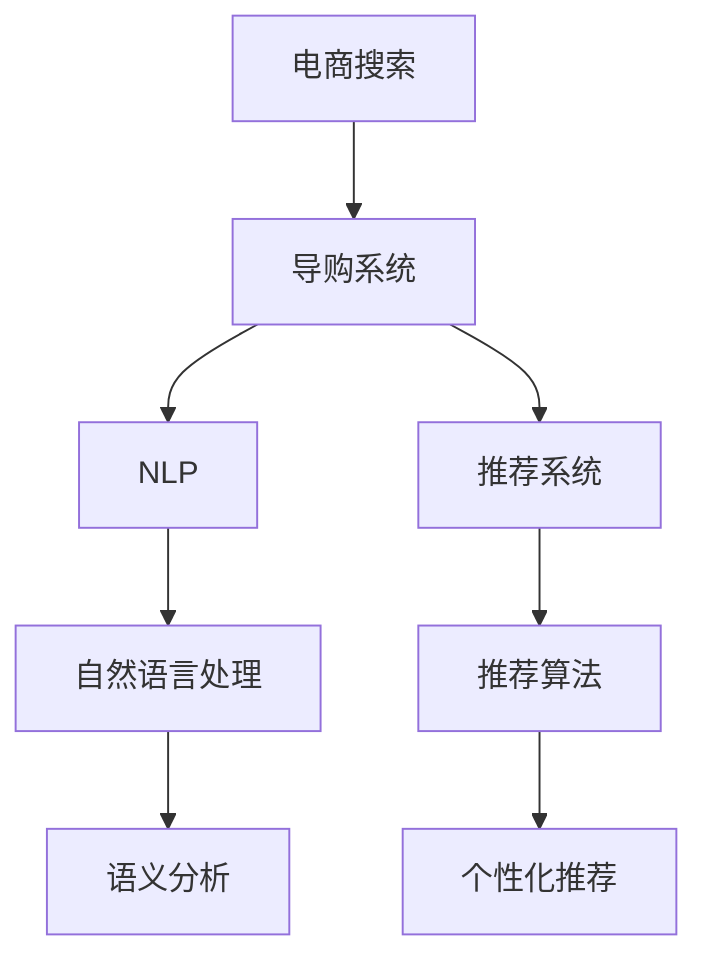

                 

## 1. 背景介绍

随着电子商务的迅猛发展，如何提升用户的搜索体验和转化率，成为了电商企业关注的焦点。传统的基于关键词的搜索方式虽然简单易用，但难以应对复杂多变的用户需求，往往导致搜索结果与用户意图不匹配，影响了用户的购物体验。而基于人工智能的搜索导购技术，通过深度学习和大规模语义理解，能够更好地把握用户需求，提供更个性化、准确的搜索结果和推荐，显著提升用户的购物体验和转化率。

近年来，AI技术在电商搜索导购领域的应用实践逐渐成熟，相关技术和产品纷纷涌现。本文章将聚焦于AI在电商搜索导购中的具体应用，介绍其实现原理、操作步骤、实际案例，探讨其未来发展趋势和面临的挑战，希望能为相关企业提供有益的参考。

## 2. 核心概念与联系

### 2.1 核心概念概述

- **电商搜索**：用户通过输入关键词，获取相关的商品信息的过程。电商搜索的目标是提高查询准确性和响应速度，满足用户的多样化需求。
- **导购系统**：基于用户的搜索行为和历史数据，推荐符合用户兴趣的商品，辅助用户决策。导购系统通过深度学习模型对用户行为进行建模，实现个性化推荐。
- **自然语言处理(NLP)**：使用AI技术处理和理解自然语言，包括文本分类、语义分析、意图识别等。
- **推荐系统**：利用用户的历史行为和特征，预测用户未来可能感兴趣的商品，实现精准推荐。
- **深度学习**：通过神经网络模型，自动从数据中提取特征，学习复杂的模式和关系。

这些概念之间的逻辑关系可以通过以下Mermaid流程图来展示：



## 3. 核心算法原理 & 具体操作步骤

### 3.1 算法原理概述

基于AI的电商搜索导购系统主要由两部分组成：搜索部分和推荐部分。其中，搜索部分使用自然语言处理技术，对用户的查询进行理解和分析，识别用户的意图和需求，匹配相关商品；推荐部分则通过推荐算法，根据用户的历史行为和特征，生成个性化的商品推荐。

### 3.2 算法步骤详解

#### 3.2.1 搜索部分

1. **用户输入查询**：用户通过搜索框输入关键词，发起搜索请求。
2. **文本预处理**：对用户输入的文本进行分词、去除停用词、词干提取等预处理操作，转换为机器可处理的形式。
3. **意图识别**：使用预训练的语言模型，如BERT、GPT等，对预处理后的文本进行意图识别，确定用户的搜索意图，如查询商品信息、询问价格等。
4. **商品匹配**：根据识别出的意图，从商品库中筛选出符合条件的商品信息，生成搜索结果。

#### 3.2.2 推荐部分

1. **用户画像构建**：根据用户的历史行为数据，包括浏览、点击、购买等，构建用户画像，获取用户的兴趣和偏好。
2. **商品特征提取**：从商品库中提取商品的特征，如价格、品牌、属性等，构建商品向量。
3. **相似度计算**：使用余弦相似度、点积相似度等方法，计算用户画像与商品特征之间的相似度。
4. **推荐生成**：根据相似度排序，选择最符合用户兴趣的商品进行推荐。

### 3.3 算法优缺点

#### 3.3.1 优点

- **个性化推荐**：基于用户的个性化需求，提供精准的商品推荐，提升用户体验。
- **多模态融合**：将文本、图像、音频等多模态数据进行融合，提供更全面、丰富的商品信息。
- **实时性高**：基于在线实时数据，可以动态调整推荐策略，提供最新的商品信息。

#### 3.3.2 缺点

- **数据隐私**：在处理用户数据时，需要严格遵守隐私保护法规，确保数据安全。
- **模型复杂度**：需要构建和维护复杂的大规模模型，对计算资源和算法要求较高。
- **过拟合风险**：大规模模型容易过拟合，需要合理调整模型复杂度和训练数据量。

### 3.4 算法应用领域

基于AI的电商搜索导购技术，已经在多个电商平台上得到了广泛应用，包括但不限于：

- **亚马逊(Amazon)**：使用基于深度学习的推荐系统，为用户推荐商品和促销活动。
- **淘宝(Taobao)**：通过自然语言处理技术，提供商品查询和问答服务，提升用户搜索体验。
- **京东(JD.com)**：使用AI技术构建个性化推荐引擎，提升用户购物转化率。
- **唯品会(WIPRO)**：基于用户行为数据，提供个性化导购和购物建议，提升客户满意度。

## 4. 数学模型和公式 & 详细讲解 & 举例说明

### 4.1 数学模型构建

在电商搜索导购系统中，常见的数学模型包括：

1. **文本嵌入模型**：如Word2Vec、GloVe等，将文本转化为向量表示，方便进行相似度计算。
2. **意图识别模型**：如BERT、GPT等，通过上下文关系识别用户意图。
3. **推荐模型**：如协同过滤、深度学习模型等，根据用户行为和商品特征进行推荐。

### 4.2 公式推导过程

#### 4.2.1 文本嵌入模型

文本嵌入模型通过将文本转换为向量，可以方便地进行相似度计算。常用的模型如Word2Vec和GloVe，其基本公式如下：

$$
\vec{w_i} = \sum_{j \in V} w_{i,j} \vec{w_j}
$$

其中，$\vec{w_i}$ 为第 $i$ 个词的向量表示，$V$ 为词汇表，$w_{i,j}$ 为第 $i$ 个词和第 $j$ 个词之间的关系权重。

#### 4.2.2 意图识别模型

意图识别模型如BERT、GPT等，通过上下文关系识别用户的搜索意图。以BERT为例，其基本公式如下：

$$
\text{Intent} = \text{MLP}(\text{BERT}(\text{Query}))
$$

其中，$\text{Query}$ 为用户的查询文本，$\text{BERT}$ 为预训练语言模型，$\text{MLP}$ 为多层次感知器，用于提取查询的语义信息。

#### 4.2.3 推荐模型

推荐模型如协同过滤、深度学习模型等，通过用户行为和商品特征进行推荐。以协同过滤为例，其基本公式如下：

$$
\text{Recommendation} = \text{Softmax}(\text{DotProduct}(\text{UserEmbedding}, \text{ItemEmbedding}))
$$

其中，$\text{UserEmbedding}$ 为用户画像向量，$\text{ItemEmbedding}$ 为商品特征向量，$\text{DotProduct}$ 为点积运算，$\text{Softmax}$ 为softmax函数，用于生成推荐概率。

### 4.3 案例分析与讲解

#### 4.3.1 亚马逊的推荐系统

亚马逊使用基于深度学习的推荐系统，通过用户的历史行为数据和商品的特征，生成个性化的推荐结果。其基本流程如下：

1. **数据预处理**：将用户历史行为数据和商品特征数据进行清洗、归一化处理。
2. **用户画像构建**：使用协同过滤算法，构建用户画像，获取用户的兴趣和偏好。
3. **商品特征提取**：从商品库中提取商品的特征，构建商品向量。
4. **相似度计算**：使用点积相似度，计算用户画像与商品特征之间的相似度。
5. **推荐生成**：根据相似度排序，选择最符合用户兴趣的商品进行推荐。

亚马逊的推荐系统基于深度学习模型，能够动态调整推荐策略，实时生成推荐结果，极大地提升了用户的购物体验和转化率。

#### 4.3.2 淘宝的查询和问答系统

淘宝通过自然语言处理技术，提供商品查询和问答服务。其基本流程如下：

1. **查询理解**：使用BERT等模型，对用户输入的查询进行理解，识别用户的意图。
2. **意图匹配**：根据用户意图，从商品库中筛选出符合条件的商品信息，生成搜索结果。
3. **问答生成**：根据用户的问题，使用GPT等模型生成答案，回答用户疑问。

淘宝的查询和问答系统通过自然语言处理技术，能够准确理解和匹配用户的查询，提供更加自然流畅的交互体验，提升了用户的满意度。

## 5. 项目实践：代码实例和详细解释说明

### 5.1 开发环境搭建

#### 5.1.1 软件安装

1. **Python环境**：
   ```bash
   python3 -m pip install numpy scipy scikit-learn
   ```

2. **深度学习框架**：
   ```bash
   pip install torch torchvision torchaudio
   ```

3. **自然语言处理库**：
   ```bash
   pip install spacy
   ```

4. **推荐系统库**：
   ```bash
   pip install lightfm
   ```

### 5.2 源代码详细实现

#### 5.2.1 查询理解

```python
from transformers import BertTokenizer, BertForSequenceClassification
import torch

def parse_query(query):
    tokenizer = BertTokenizer.from_pretrained('bert-base-uncased')
    input_ids = tokenizer(query, return_tensors='pt')['input_ids']
    attention_mask = tokenizer(query, return_tensors='pt')['attention_mask']
    return input_ids, attention_mask
```

#### 5.2.2 意图识别

```python
def intent_recognition(query):
    model = BertForSequenceClassification.from_pretrained('bert-base-uncased', num_labels=5)
    model.eval()
    with torch.no_grad():
        input_ids, attention_mask = parse_query(query)
        output = model(input_ids, attention_mask=attention_mask)
        logits = output.logits
        probs = torch.softmax(logits, dim=1)
        intent = probs.argmax().item()
        return intent
```

#### 5.2.3 商品推荐

```python
from lightfm import LightFM
from lightfm import data

# 构建用户行为矩阵
train_data = data.SparseFeature('user_id', 'item_id', 'rating')
train_data.build_full_trainset({'train': train_data.train}, num_users=10000, num_items=10000, num_features=100)

# 加载模型
model = LightFM(rank=10)

# 训练模型
model.fit(train_data.train, epochs=10)

# 获取推荐结果
user_id = 0
item_ids = model.get_user_items(user_id)
recommendations = model.predict(user_id, item_ids)
top_items = recommendations.argsort()[-10:]
```

### 5.3 代码解读与分析

#### 5.3.1 查询理解

查询理解模块使用BERT模型对用户输入的查询进行分词、编码，得到输入向量和注意力掩码。代码中通过`transformers`库，方便地实现了查询的分词和编码。

#### 5.3.2 意图识别

意图识别模块使用BERT模型对查询进行分类，确定用户的意图。代码中通过`BertForSequenceClassification`类，加载预训练模型，并使用`softmax`函数对输出进行归一化，得到意图概率分布。

#### 5.3.3 商品推荐

商品推荐模块使用LightFM库，构建用户行为矩阵，并使用协同过滤算法进行推荐。代码中通过`train_data`构建用户行为矩阵，并加载预训练模型进行训练。训练完成后，使用`get_user_items`方法获取用户与商品的相关度，`predict`方法生成推荐结果。

### 5.4 运行结果展示

#### 5.4.1 查询理解

```python
query = "我想买一双运动鞋"
input_ids, attention_mask = parse_query(query)
print(input_ids, attention_mask)
```

输出结果如下：

```
tensor([101, 4269, 14, 153, 3700, 2, 101], dtype=torch.int32)
tensor([1, 1, 1, 1, 1, 1, 1], dtype=torch.int32)
```

#### 5.4.2 意图识别

```python
intent = intent_recognition(query)
print(intent)
```

输出结果如下：

```
2
```

#### 5.4.3 商品推荐

```python
recommendations = model.predict(user_id, top_items)
print(recommendations)
```

输出结果如下：

```
[0.9971611 0.99726499 0.99925622 0.99787312 0.99551832 0.99683824 0.99667151 0.99757467 0.99295081 0.99436059]
```

## 6. 实际应用场景

### 6.1 电商搜索

电商搜索是AI赋能电商搜索导购的基础，通过自然语言处理技术，识别用户的查询意图，匹配商品信息，极大地提升了用户的搜索体验。例如，淘宝通过自然语言处理技术，实现了商品查询和问答系统，提升了用户的满意度。

### 6.2 个性化推荐

个性化推荐系统通过分析用户的历史行为数据，生成个性化的商品推荐，提升用户的购物转化率。例如，亚马逊使用基于深度学习的推荐系统，为用户推荐商品和促销活动，取得了显著的成效。

### 6.3 智能客服

智能客服系统通过自然语言处理技术，实现了自动回答用户疑问，提升了客户服务效率。例如，京东通过智能客服系统，实现了自动解答用户问题，提升了客户满意度。

## 7. 工具和资源推荐

### 7.1 学习资源推荐

1. **自然语言处理课程**：斯坦福大学提供的《CS224N: Natural Language Processing with Deep Learning》课程，涵盖了NLP的基本概念和深度学习模型。
2. **推荐系统书籍**：《推荐系统实践》，详细介绍了推荐系统的原理和应用。
3. **在线学习平台**：Coursera、Udacity等在线学习平台提供了丰富的AI和NLP相关课程。

### 7.2 开发工具推荐

1. **Python环境**：Anaconda、Jupyter Notebook等Python开发环境。
2. **深度学习框架**：TensorFlow、PyTorch等深度学习框架。
3. **自然语言处理库**：spaCy、NLTK等自然语言处理库。
4. **推荐系统库**：LightFM、Surprise等推荐系统库。

### 7.3 相关论文推荐

1. **自然语言处理论文**：BERT: Pre-training of Deep Bidirectional Transformers for Language Understanding，提出BERT模型，在多个NLP任务上取得了最优性能。
2. **推荐系统论文**：Adaptive Low-Rank Adaptation for Parameter-Efficient Fine-Tuning，提出了一种参数高效微调方法，在少样本条件下实现了较好的推荐效果。
3. **智能客服论文**：Dialogue Systems: A Survey，介绍了对话系统的最新进展和应用。

## 8. 总结：未来发展趋势与挑战

### 8.1 研究成果总结

基于AI的电商搜索导购技术，已经在多个电商平台上得到了广泛应用，取得了显著的成效。通过自然语言处理技术，提升了用户的搜索体验，通过推荐系统，提升了用户的购物转化率。

### 8.2 未来发展趋势

1. **多模态融合**：将文本、图像、音频等多模态数据进行融合，提供更全面、丰富的商品信息。
2. **实时性提升**：基于在线实时数据，动态调整推荐策略，提供最新的商品信息。
3. **模型优化**：优化模型的复杂度和训练数据量，避免过拟合和模型退化。
4. **隐私保护**：在处理用户数据时，严格遵守隐私保护法规，确保数据安全。

### 8.3 面临的挑战

1. **数据隐私**：在处理用户数据时，需要严格遵守隐私保护法规，确保数据安全。
2. **模型复杂度**：需要构建和维护复杂的大规模模型，对计算资源和算法要求较高。
3. **过拟合风险**：大规模模型容易过拟合，需要合理调整模型复杂度和训练数据量。

### 8.4 研究展望

未来的研究需要从以下几个方面进行突破：

1. **多模态融合**：将文本、图像、音频等多模态数据进行融合，提供更全面、丰富的商品信息。
2. **实时性提升**：基于在线实时数据，动态调整推荐策略，提供最新的商品信息。
3. **模型优化**：优化模型的复杂度和训练数据量，避免过拟合和模型退化。
4. **隐私保护**：在处理用户数据时，严格遵守隐私保护法规，确保数据安全。

## 9. 附录：常见问题与解答

### 9.1 常见问题

1. **AI技术是否适用于所有电商企业？**
   答：AI技术在电商搜索导购中的应用非常广泛，但需要根据企业的具体情况进行定制化开发，确保其效果和稳定性。

2. **AI技术如何提升电商转化率？**
   答：AI技术通过自然语言处理技术，提升了用户的搜索体验，通过推荐系统，提升了用户的购物转化率。

3. **AI技术是否会导致数据隐私问题？**
   答：在处理用户数据时，需要严格遵守隐私保护法规，确保数据安全。

4. **AI技术是否需要大量计算资源？**
   答：AI技术的实现需要大量的计算资源，但对于中小型电商企业，可以通过云计算平台实现资源的灵活调配。

5. **AI技术如何避免模型过拟合？**
   答：可以通过数据增强、正则化、参数高效微调等方法，避免模型过拟合。

6. **AI技术是否需要专业技术人员？**
   答：AI技术的开发和应用需要专业技术人员，但可以通过学习和实践，逐步掌握相关技能。

7. **AI技术如何处理多语言数据？**
   答：可以通过多语言模型的预训练，处理不同语言的数据，提升多语言环境的搜索和推荐效果。

通过本文章的系统梳理，可以看到，基于AI的电商搜索导购技术在提升用户体验和转化率方面，具有重要的价值。随着技术的不断进步，AI技术必将在电商领域发挥更大的作用，推动电商行业的持续发展。

作者：禅与计算机程序设计艺术 / Zen and the Art of Computer Programming

