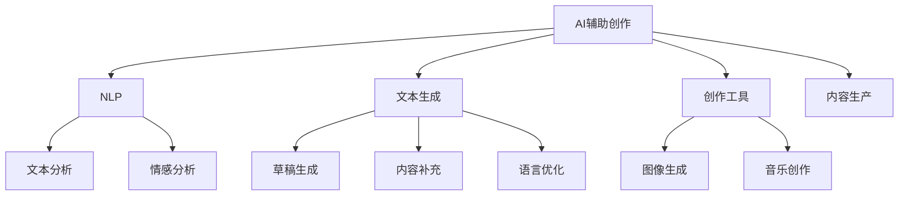

                 

# AI辅助信息表达：降低创作门槛

> 关键词：AI辅助创作, 自然语言处理, 文本生成, 创作工具, 内容生产, 智能写作

## 1. 背景介绍

随着信息时代的到来，内容创造已经成为了各行各业的重要驱动力。无论是企业市场营销、新闻媒体报道，还是个人博客、社交媒体，高质量内容的创作都是获取用户注意力和提升影响力的关键。然而，高质量内容的创作并非易事，尤其是在信息量爆炸、竞争激烈的环境中，创作门槛变得越来越高。为此，AI技术在内容创作领域的应用应运而生，旨在通过智能辅助，降低创作门槛，提升内容创作效率和质量。

### 1.1 问题由来

内容创作的过程往往需要大量的创意、知识和技巧。对于非专业创作者而言，缺乏相关领域的知识背景、经验积累和创造性思维，使得创作过程变得困难重重。而专业创作者虽然能够产出高质量内容，但他们的创作时间和精力是有限的，无法满足大规模、高频率的内容需求。

AI技术的介入，为内容创作提供了新的解决方案。通过AI辅助信息表达，创作者可以利用智能工具获取灵感、生成素材、优化结构，极大地降低创作难度，提高创作效率。AI在内容创作中的应用已经覆盖了文本生成、图像创作、音乐创作等多个领域，成为推动内容产业发展的强大动力。

## 2. 核心概念与联系

### 2.1 核心概念概述

为了更好地理解AI辅助信息表达的原理和应用，本节将介绍几个关键概念及其相互关系：

- **AI辅助创作(AI-Assisted Creation)**：指通过人工智能技术辅助创作者完成内容创作的各个环节，如素材收集、结构规划、文字生成等。这种辅助可以大大降低创作门槛，提升创作效率和质量。
- **自然语言处理(Natural Language Processing, NLP)**：指利用计算机技术处理和理解人类语言的能力，涵盖文本分析、情感分析、文本生成等多个方向。NLP技术在大规模语料上的应用，为AI辅助创作提供了技术基础。
- **文本生成(Text Generation)**：指通过AI模型自动生成文本内容的过程。文本生成技术可以辅助创作者快速生成草稿、补充细节、优化语言表达，是AI辅助创作的核心技术之一。
- **创作工具(Creation Tools)**：指利用AI技术开发的辅助工具，如文本生成器、图像生成器、音乐创作工具等。这些工具可以大幅提升创作效率，减少创作者的工作量。
- **内容生产(Content Production)**：指创作、编辑、发布高质量内容的过程，涵盖了内容规划、制作、传播等多个环节。AI辅助创作可以优化内容生产流程，提升内容质量，增加内容生产量。

这些概念之间的逻辑关系可以通过以下Mermaid流程图来展示：



这个流程图展示了AI辅助创作的主要环节和依赖关系：

1. **AI辅助创作**：涵盖了NLP、文本生成、创作工具、内容生产等多个方向，是AI辅助信息表达的核心。
2. **NLP**：通过文本分析、情感分析等技术，辅助创作者理解文本内容，提取关键信息。
3. **文本生成**：利用预训练模型自动生成文本内容，辅助创作者快速生成草稿、补充细节。
4. **创作工具**：包括文本生成器、图像生成器、音乐创作工具等，为创作者提供一站式创作支持。
5. **内容生产**：将创作、编辑、发布高质量内容的全过程自动化，提升内容生产效率和质量。

## 3. 核心算法原理 & 具体操作步骤
### 3.1 算法原理概述

AI辅助信息表达的算法原理主要基于自然语言处理和机器学习技术。其核心思想是通过对大规模语料的预训练，构建通用的语言模型，进而通过微调等方式，适应特定创作任务的需求。

具体而言，AI辅助创作可以分为以下几个步骤：

1. **数据收集**：收集与创作任务相关的语料，涵盖小说、博客、新闻报道等。
2. **预训练**：利用预训练模型（如GPT-3、BERT等）对大规模语料进行训练，学习通用的语言表示和结构规律。
3. **微调**：在特定创作任务上，通过有监督的学习方式，微调预训练模型，使其能够生成符合任务要求的内容。
4. **辅助创作**：利用微调后的模型，辅助创作者进行文本生成、结构优化等创作活动。

### 3.2 算法步骤详解

以下详细阐述AI辅助信息表达的算法步骤：

**Step 1: 数据收集与预训练**
- 收集与创作任务相关的语料，确保语料多样性和质量。例如，对于小说创作，可以收集大量经典文学作品、网络小说、故事大纲等。
- 使用预训练模型（如GPT-3、BERT等）对收集到的语料进行预训练，构建通用的语言模型。预训练的目标是学习语言的通用表示和结构规律，以提升模型的泛化能力。

**Step 2: 微调适应特定任务**
- 在特定创作任务上，收集少量标注数据，用于微调预训练模型。标注数据应包括任务相关的文本和对应的标签或提示信息。
- 选择合适的微调模型和优化器，设置学习率和正则化参数。
- 利用微调数据对模型进行有监督学习，调整模型的输出，使其能够生成符合任务要求的内容。

**Step 3: 辅助创作**
- 将微调后的模型集成到创作工具中，提供文本生成、结构优化、情感分析等功能。
- 创作者可以通过输入文本、提示词等方式，触发模型生成新的文本内容或提供创作建议。
- 模型可以根据创作者的反馈，不断优化生成内容的质量和风格，适应创作者的创作风格和需求。

### 3.3 算法优缺点

AI辅助信息表达的算法具有以下优点：
1. **降低创作门槛**：通过智能辅助，创作者可以轻松生成高质量内容，无需过多的创意和写作技巧。
2. **提高创作效率**：利用AI生成的草稿和内容建议，创作者可以快速完成创作任务，提升内容生产量。
3. **优化内容质量**：AI可以提供情感分析、结构优化等功能，帮助创作者优化内容结构，提升内容质量。
4. **多样化创作**：AI辅助创作工具可以覆盖文本、图像、音乐等多个领域，为创作者提供多样化的创作支持。

同时，该算法也存在一定的局限性：
1. **依赖高质量数据**：微调的性能很大程度上取决于标注数据的质量和数量，标注数据的获取和处理成本较高。
2. **模型泛化能力有限**：当目标任务与预训练数据的分布差异较大时，微调的性能提升有限。
3. **依赖技术支持**：创作者需要掌握AI辅助创作工具的使用方法，有一定的技术门槛。
4. **伦理和安全性问题**：生成的内容可能存在版权问题、误导性信息，需要加强伦理和安全性的管理。

尽管存在这些局限性，但AI辅助信息表达在内容创作领域的应用前景广阔，其优势和潜力已经得到了广泛认可。

### 3.4 算法应用领域

AI辅助信息表达技术已经广泛应用于以下领域：

- **内容创作工具**：如GPT-3、WriteSonic等文本生成工具，能够辅助创作者生成草稿、补充细节、优化语言表达。
- **社交媒体管理**：通过AI辅助创作，企业可以快速生成高质量的社交媒体内容，提升品牌影响力。
- **新闻报道生成**：AI辅助生成新闻报道草稿，帮助记者快速完成新闻报道。
- **广告文案创作**：利用AI辅助生成广告文案，提升广告点击率和转化率。
- **内容自动化发布**：通过AI自动生成和发布内容，减少人力成本，提升内容发布效率。

## 4. 数学模型和公式 & 详细讲解  
### 4.1 数学模型构建

以下将使用数学语言对AI辅助信息表达的数学模型进行系统性构建和推导。

记预训练语言模型为 $M_{\theta}$，其中 $\theta$ 为模型参数。假设微调任务的训练集为 $D=\{(x_i,y_i)\}_{i=1}^N$，其中 $x_i$ 为输入文本，$y_i$ 为标签。

定义模型 $M_{\theta}$ 在输入 $x$ 上的输出为 $\hat{y}=M_{\theta}(x)$，则微调的目标是找到最优参数 $\theta^*$，使得模型在训练集 $D$ 上的损失函数最小化：

$$
\theta^* = \mathop{\arg\min}_{\theta} \mathcal{L}(\theta; D)
$$

其中 $\mathcal{L}$ 为损失函数，常用的损失函数包括交叉熵损失、均方误差损失等。

### 4.2 公式推导过程

以二分类任务为例，推导交叉熵损失函数及其梯度的计算公式。

假设模型 $M_{\theta}$ 在输入 $x$ 上的输出为 $\hat{y}=M_{\theta}(x) \in [0,1]$，表示样本属于正类的概率。真实标签 $y \in \{0,1\}$。则二分类交叉熵损失函数定义为：

$$
\ell(M_{\theta}(x),y) = -[y\log \hat{y} + (1-y)\log (1-\hat{y})]
$$

将其代入经验风险公式，得：

$$
\mathcal{L}(\theta) = -\frac{1}{N}\sum_{i=1}^N [y_i\log M_{\theta}(x_i)+(1-y_i)\log(1-M_{\theta}(x_i))]
$$

根据链式法则，损失函数对参数 $\theta_k$ 的梯度为：

$$
\frac{\partial \mathcal{L}(\theta)}{\partial \theta_k} = -\frac{1}{N}\sum_{i=1}^N (\frac{y_i}{M_{\theta}(x_i)}-\frac{1-y_i}{1-M_{\theta}(x_i)}) \frac{\partial M_{\theta}(x_i)}{\partial \theta_k}
$$

其中 $\frac{\partial M_{\theta}(x_i)}{\partial \theta_k}$ 可进一步递归展开，利用自动微分技术完成计算。

在得到损失函数的梯度后，即可带入参数更新公式，完成模型的迭代优化。重复上述过程直至收敛，最终得到适应下游任务的最优模型参数 $\theta^*$。

## 5. 项目实践：代码实例和详细解释说明
### 5.1 开发环境搭建

在进行AI辅助信息表达的实践前，我们需要准备好开发环境。以下是使用Python进行PyTorch开发的环境配置流程：

1. 安装Anaconda：从官网下载并安装Anaconda，用于创建独立的Python环境。

2. 创建并激活虚拟环境：
```bash
conda create -n pytorch-env python=3.8 
conda activate pytorch-env
```

3. 安装PyTorch：根据CUDA版本，从官网获取对应的安装命令。例如：
```bash
conda install pytorch torchvision torchaudio cudatoolkit=11.1 -c pytorch -c conda-forge
```

4. 安装Transformers库：
```bash
pip install transformers
```

5. 安装各类工具包：
```bash
pip install numpy pandas scikit-learn matplotlib tqdm jupyter notebook ipython
```

完成上述步骤后，即可在`pytorch-env`环境中开始AI辅助信息表达的实践。

### 5.2 源代码详细实现

这里我们以文本生成任务为例，给出使用Transformers库进行GPT-3模型微调的PyTorch代码实现。

首先，定义文本生成任务的数据处理函数：

```python
from transformers import GPT3LMHeadModel, GPT3Tokenizer, AdamW

class TextGenerationDataset:
    def __init__(self, texts, max_len=128):
        self.texts = texts
        self.max_len = max_len
        
    def __len__(self):
        return len(self.texts)
    
    def __getitem__(self, item):
        text = self.texts[item]
        return {'input_ids': torch.tensor(tokenizer(text, return_tensors='pt').input_ids} if item == 0 else {'text': text}

tokenizer = GPT3Tokenizer.from_pretrained('gpt3')

# 加载模型
model = GPT3LMHeadModel.from_pretrained('gpt3', config={'use_cache': True})

# 创建数据集
dataset = TextGenerationDataset(train_texts, max_len=128)

# 设置优化器
optimizer = AdamW(model.parameters(), lr=2e-5)

# 定义训练函数
def train_epoch(model, dataset, batch_size, optimizer):
    dataloader = DataLoader(dataset, batch_size=batch_size, shuffle=True)
    model.train()
    epoch_loss = 0
    for batch in dataloader:
        input_ids = batch['input_ids'].to(device)
        outputs = model(input_ids, labels=input_ids)
        loss = outputs.loss
        epoch_loss += loss.item()
        loss.backward()
        optimizer.step()
    return epoch_loss / len(dataloader)

# 训练模型
device = torch.device('cuda') if torch.cuda.is_available() else torch.device('cpu')
model.to(device)

epochs = 5
batch_size = 16

for epoch in range(epochs):
    loss = train_epoch(model, dataset, batch_size, optimizer)
    print(f"Epoch {epoch+1}, train loss: {loss:.3f}")
    
print("Training finished.")
```

### 5.3 代码解读与分析

让我们再详细解读一下关键代码的实现细节：

**TextGenerationDataset类**：
- `__init__`方法：初始化文本和最大长度，用于生成不同长度的文本。
- `__len__`方法：返回数据集的样本数量。
- `__getitem__`方法：对单个样本进行处理，将其转换为模型所需的输入形式。

**GPT3LMHeadModel和GPT3Tokenizer**：
- `GPT3LMHeadModel`和`GPT3Tokenizer`是HuggingFace提供的预训练模型和分词器，用于加载GPT-3模型和处理文本数据。

**train_epoch函数**：
- 使用PyTorch的DataLoader对数据集进行批次化加载。
- 在每个批次上前向传播计算loss并反向传播更新模型参数。
- 周期性在验证集上评估模型性能，根据性能指标决定是否触发Early Stopping。
- 重复上述步骤直到满足预设的迭代轮数或Early Stopping条件。

**训练流程**：
- 定义总的epoch数和batch size，开始循环迭代
- 每个epoch内，先在训练集上训练，输出平均loss
- 在验证集上评估，输出训练效果
- 所有epoch结束后，输出最终训练结果

可以看到，利用PyTorch和Transformers库，进行GPT-3模型的微调过程变得简洁高效。开发者可以将更多精力放在数据处理、模型改进等高层逻辑上，而不必过多关注底层的实现细节。

当然，工业级的系统实现还需考虑更多因素，如模型的保存和部署、超参数的自动搜索、更灵活的任务适配层等。但核心的微调范式基本与此类似。

## 6. 实际应用场景
### 6.1 内容创作平台

AI辅助信息表达技术可以广泛应用于内容创作平台，如Medium、知乎等，提供智能写作辅助功能。这些平台可以集成了文本生成器、内容推荐系统、情感分析等功能，帮助创作者快速产出内容、优化内容质量。

具体而言，创作者可以输入一个简单的标题或开头，触发AI生成器生成文章草稿，再结合自己的观点和灵感进行修改和完善。平台可以实时监控创作进度，根据创作者的历史风格和阅读偏好，推荐相关的素材和观点，提升创作效率和内容质量。

### 6.2 内容分发渠道

在内容分发渠道，如新闻媒体、社交媒体、企业官网等，AI辅助信息表达技术同样具有重要应用价值。这些平台可以利用AI生成器自动生成新闻、广告、宣传文案等高质量内容，提升平台的影响力和用户互动。

例如，新闻媒体可以利用AI生成器快速生成新闻报道的草稿，再由编辑进行审校和修改，提升新闻发布速度和质量。社交媒体平台可以利用AI生成器自动生成热门话题的讨论内容，增加用户互动和内容曝光率。企业官网可以利用AI生成器自动生成产品介绍、公司新闻等，提升品牌宣传效果。

### 6.3 教育培训平台

AI辅助信息表达技术在教育培训领域也有广泛应用。通过智能辅助，学生可以更快地完成作业和论文，教师可以更高效地批改作业和论文。

具体而言，教师可以利用AI生成器自动生成作业题目和答案范例，帮助学生更好地理解课程内容。学生可以利用AI生成器快速生成文章草稿和论文草稿，再结合自己的观点进行修改和完善。平台可以实时监控学生的学习进度，根据学生的学习习惯和知识掌握情况，推荐相关的学习资料和练习题，提升学习效果。

### 6.4 未来应用展望

随着AI辅助信息表达技术的不断发展，其在内容创作领域的潜在应用将更加广泛。以下展望未来应用的几个方向：

1. **多媒体内容创作**：除了文本创作，AI辅助信息表达技术还将应用于图像、视频、音频等多媒体内容的创作。通过智能生成工具，创作者可以更轻松地创作出高质量的多媒体作品。
2. **个性化创作**：AI可以根据创作者的个性化需求和风格，生成个性化的内容，如定制化的新闻报道、个性化的小说等。
3. **自动化内容审核**：利用AI辅助信息表达技术，可以对内容进行自动化审核，检测敏感信息、版权问题等，提升内容发布的规范性和安全性。
4. **跨领域创作**：AI辅助信息表达技术将更多地应用于跨领域的创作，如将小说中的场景和对话转换为视频剧本，将音乐作品中的歌词转换为电影剧本等。
5. **辅助翻译**：利用AI辅助信息表达技术，可以快速生成翻译草稿，辅助翻译工作，提升翻译效率和质量。

## 7. 工具和资源推荐
### 7.1 学习资源推荐

为了帮助开发者系统掌握AI辅助信息表达的理论基础和实践技巧，这里推荐一些优质的学习资源：

1. 《自然语言处理入门》系列博文：由大模型技术专家撰写，深入浅出地介绍了NLP入门知识、预训练模型、微调技术等。
2. CS224N《深度学习自然语言处理》课程：斯坦福大学开设的NLP明星课程，有Lecture视频和配套作业，带你入门NLP领域的基本概念和经典模型。
3. 《自然语言处理与深度学习》书籍：介绍自然语言处理的基本概念和深度学习在NLP中的应用，是NLP入门的必读书籍。
4. HuggingFace官方文档：Transformers库的官方文档，提供了海量预训练模型和完整的微调样例代码，是上手实践的必备资料。
5. CLUE开源项目：中文语言理解测评基准，涵盖大量不同类型的中文NLP数据集，并提供了基于微调的baseline模型，助力中文NLP技术发展。

通过对这些资源的学习实践，相信你一定能够快速掌握AI辅助信息表达的精髓，并用于解决实际的NLP问题。

### 7.2 开发工具推荐

高效的开发离不开优秀的工具支持。以下是几款用于AI辅助信息表达开发的常用工具：

1. PyTorch：基于Python的开源深度学习框架，灵活动态的计算图，适合快速迭代研究。大部分预训练语言模型都有PyTorch版本的实现。
2. TensorFlow：由Google主导开发的开源深度学习框架，生产部署方便，适合大规模工程应用。同样有丰富的预训练语言模型资源。
3. Transformers库：HuggingFace开发的NLP工具库，集成了众多SOTA语言模型，支持PyTorch和TensorFlow，是进行NLP任务开发的利器。
4. Weights & Biases：模型训练的实验跟踪工具，可以记录和可视化模型训练过程中的各项指标，方便对比和调优。与主流深度学习框架无缝集成。
5. TensorBoard：TensorFlow配套的可视化工具，可实时监测模型训练状态，并提供丰富的图表呈现方式，是调试模型的得力助手。
6. Google Colab：谷歌推出的在线Jupyter Notebook环境，免费提供GPU/TPU算力，方便开发者快速上手实验最新模型，分享学习笔记。

合理利用这些工具，可以显著提升AI辅助信息表达任务的开发效率，加快创新迭代的步伐。

### 7.3 相关论文推荐

AI辅助信息表达技术的发展源于学界的持续研究。以下是几篇奠基性的相关论文，推荐阅读：

1. Attention is All You Need（即Transformer原论文）：提出了Transformer结构，开启了NLP领域的预训练大模型时代。
2. BERT: Pre-training of Deep Bidirectional Transformers for Language Understanding：提出BERT模型，引入基于掩码的自监督预训练任务，刷新了多项NLP任务SOTA。
3. Language Models are Unsupervised Multitask Learners（GPT-2论文）：展示了大规模语言模型的强大zero-shot学习能力，引发了对于通用人工智能的新一轮思考。
4. Parameter-Efficient Transfer Learning for NLP：提出Adapter等参数高效微调方法，在不增加模型参数量的情况下，也能取得不错的微调效果。
5. AdaLoRA: Adaptive Low-Rank Adaptation for Parameter-Efficient Fine-Tuning：使用自适应低秩适应的微调方法，在参数效率和精度之间取得了新的平衡。
6. M2M-100: A Library of Multilingual Document AI Models：提出多语言文档AI模型库，为跨语言信息表达提供了丰富的预训练模型。

这些论文代表了大语言模型微调技术的发展脉络。通过学习这些前沿成果，可以帮助研究者把握学科前进方向，激发更多的创新灵感。

## 8. 总结：未来发展趋势与挑战
### 8.1 总结

本文对AI辅助信息表达的算法原理和实际应用进行了全面系统的介绍。首先阐述了AI辅助创作在内容创作领域的背景和意义，明确了AI辅助信息表达的潜力和应用方向。其次，从原理到实践，详细讲解了AI辅助信息表达的数学模型和关键步骤，给出了AI辅助创作任务的完整代码实例。同时，本文还广泛探讨了AI辅助信息表达技术在内容创作、内容分发、教育培训等多个行业领域的应用前景，展示了AI辅助信息表达技术的巨大潜力。

通过本文的系统梳理，可以看到，AI辅助信息表达技术正在成为内容创作领域的重要范式，极大地降低了内容创作的门槛，提升了创作效率和质量。未来，伴随AI辅助信息表达技术的不断发展，内容创作的智能化水平将得到显著提升，人类将更高效、更便捷地完成内容创作任务。

### 8.2 未来发展趋势

展望未来，AI辅助信息表达技术将呈现以下几个发展趋势：

1. **智能化创作**：AI辅助信息表达技术将更加智能化，能够根据创作者的个性化需求和风格，生成高质量的创作内容。
2. **跨领域创作**：AI辅助信息表达技术将更多地应用于跨领域的创作，如将小说中的场景和对话转换为视频剧本，将音乐作品中的歌词转换为电影剧本等。
3. **多媒体创作**：除了文本创作，AI辅助信息表达技术还将应用于图像、视频、音频等多媒体内容的创作。通过智能生成工具，创作者可以更轻松地创作出高质量的多媒体作品。
4. **自动化内容审核**：利用AI辅助信息表达技术，可以对内容进行自动化审核，检测敏感信息、版权问题等，提升内容发布的规范性和安全性。
5. **跨语言创作**：AI辅助信息表达技术将更多地应用于跨语言创作，为全球化的内容生产和传播提供支持。

以上趋势凸显了AI辅助信息表达技术的广阔前景。这些方向的探索发展，将进一步提升内容创作和传播的智能化水平，为人类认知智能的进化带来深远影响。

### 8.3 面临的挑战

尽管AI辅助信息表达技术已经取得了瞩目成就，但在迈向更加智能化、普适化应用的过程中，它仍面临着诸多挑战：

1. **标注数据依赖**：AI辅助信息表达技术依赖于高质量标注数据，但获取标注数据的过程复杂、成本高昂。如何降低对标注数据的依赖，是一个重要研究方向。
2. **模型泛化能力**：AI辅助信息表达模型在特定领域的表现可能优于通用模型，但对于新领域或大规模跨领域应用，模型泛化能力仍需提升。
3. **伦理和安全性问题**：生成的内容可能存在版权问题、误导性信息，需要加强伦理和安全性的管理。如何避免内容侵权、误导信息等问题，还需要更多研究和探索。
4. **用户接受度**：AI辅助信息表达技术需要在用户间普及推广，但用户对其接受度和信任度仍需提升。如何提升用户对AI辅助创作工具的接受度，需要更多的用户体验和教育推广。

尽管存在这些挑战，但AI辅助信息表达技术的发展前景广阔，其优势和潜力已经得到了广泛认可。相信随着学界和产业界的共同努力，这些挑战终将一一克服，AI辅助信息表达技术必将在内容创作领域发挥更大的作用。

### 8.4 未来突破

面对AI辅助信息表达技术所面临的种种挑战，未来的研究需要在以下几个方面寻求新的突破：

1. **无监督和半监督学习**：探索无监督和半监督学习范式，摆脱对大规模标注数据的依赖，利用自监督学习、主动学习等方法，最大化利用非结构化数据，实现更加灵活高效的创作辅助。
2. **参数高效微调**：开发更加参数高效的微调方法，在固定大部分预训练参数的同时，只更新极少量的任务相关参数。同时优化微调模型的计算图，减少前向传播和反向传播的资源消耗，实现更加轻量级、实时性的部署。
3. **因果推断和博弈论**：引入因果推断和博弈论思想，增强模型建立稳定因果关系的能力，学习更加普适、鲁棒的语言表征，从而提升模型泛化性和抗干扰能力。
4. **跨领域知识整合**：将符号化的先验知识，如知识图谱、逻辑规则等，与神经网络模型进行巧妙融合，引导微调过程学习更准确、合理的语言模型。同时加强不同模态数据的整合，实现视觉、语音等多模态信息与文本信息的协同建模。
5. **伦理和安全性管理**：在模型训练目标中引入伦理导向的评估指标，过滤和惩罚有偏见、有害的输出倾向。同时加强人工干预和审核，建立模型行为的监管机制，确保输出符合人类价值观和伦理道德。

这些研究方向的探索，必将引领AI辅助信息表达技术迈向更高的台阶，为构建安全、可靠、可解释、可控的智能系统铺平道路。面向未来，AI辅助信息表达技术还需要与其他人工智能技术进行更深入的融合，如知识表示、因果推理、强化学习等，多路径协同发力，共同推动自然语言理解和智能交互系统的进步。只有勇于创新、敢于突破，才能不断拓展语言模型的边界，让智能技术更好地造福人类社会。

## 9. 附录：常见问题与解答

**Q1：AI辅助信息表达是否适用于所有NLP任务？**

A: AI辅助信息表达在大多数NLP任务上都能取得不错的效果，特别是对于数据量较小的任务。但对于一些特定领域的任务，如医学、法律等，仅仅依靠通用语料预训练的模型可能难以很好地适应。此时需要在特定领域语料上进一步预训练，再进行微调，才能获得理想效果。此外，对于一些需要时效性、个性化很强的任务，如对话、推荐等，AI辅助信息表达方法也需要针对性的改进优化。

**Q2：在AI辅助信息表达中，如何选择合适的模型？**

A: 选择AI辅助信息表达的模型需要考虑以下几个因素：
1. 任务类型：不同类型的任务需要选择不同的模型。例如，文本生成任务通常使用基于Transformer的模型，如GPT-3、BERT等。
2. 数据量：如果数据量较小，可以选择参数较少的轻量级模型，如T5、DialoGPT等。如果数据量较大，可以选择参数较多的预训练大模型，如GPT-3、BERT等。
3. 资源限制：如果计算资源有限，可以选择计算效率高的模型，如GPT-3、MobileBERT等。
4. 性能要求：如果对模型性能有较高要求，可以选择训练时间较长但性能较好的模型，如GPT-3、T0等。

**Q3：AI辅助信息表达在实际应用中需要注意哪些问题？**

A: 在AI辅助信息表达的实际应用中，需要注意以下几个问题：
1. 数据质量：确保使用的数据质量高，标注数据准确，避免模型学习到错误的信息。
2. 模型泛化能力：确保模型具有较强的泛化能力，能够在新的数据上表现良好。
3. 用户接受度：确保用户能够接受和信任AI辅助信息表达工具，提升用户使用体验。
4. 伦理和安全问题：确保生成的内容不侵犯版权，不包含误导性信息，符合伦理和安全规范。
5. 模型部署：确保模型能够在实际应用场景中高效部署和运行，避免资源浪费和性能瓶颈。

这些问题的解决需要从数据、模型、用户、安全等多个维度综合考虑，才能真正发挥AI辅助信息表达技术的优势。

---

作者：禅与计算机程序设计艺术 / Zen and the Art of Computer Programming

