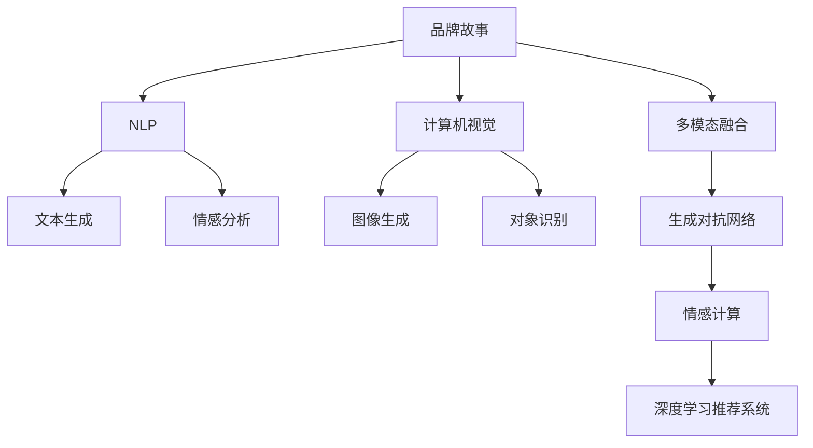

                 

## 1. 背景介绍

### 1.1 问题由来

在数字化转型的浪潮中，企业越来越依赖于技术手段来塑造品牌形象，增强市场竞争力。传统的品牌故事往往以文字和图片为主，难以全面覆盖消费者的多感官需求。AI技术，尤其是自然语言处理(NLP)和计算机视觉技术的进步，为品牌故事的智能化、个性化创造了可能。通过AI辅助生成和展示品牌故事，企业可以更好地与消费者互动，传递更深层次的情感和价值。

### 1.2 问题核心关键点

AI辅助品牌故事的核心在于如何将品牌理念、产品特点和消费者需求进行精准匹配，从而生成符合消费者心理预期和审美偏好的品牌故事。这涉及以下几个关键问题：

1. **品牌故事的生成**：如何利用AI生成具有情感共鸣、个性化且富有创意的品牌故事。
2. **品牌故事的展示**：如何通过AI技术进行多模态融合，以更加丰富、吸引人的形式呈现品牌故事。
3. **品牌故事的优化**：如何通过消费者反馈和市场数据，持续优化AI生成的品牌故事，提升品牌影响力。
4. **品牌故事的传播**：如何利用社交媒体、内容营销等渠道，最大化品牌故事的传播效果。

### 1.3 问题研究意义

研究AI辅助品牌故事的方法，对于提升品牌形象、增强消费者粘性、推动企业数字化转型具有重要意义：

1. **提升品牌形象**：AI生成的品牌故事可以更好地传达品牌理念和价值观，构建独特的品牌形象。
2. **增强消费者粘性**：通过个性化和情感化的内容，吸引和保持消费者的关注和互动。
3. **推动企业转型**：AI技术的应用可以加速企业数字化转型进程，提升市场响应速度和灵活性。
4. **促进市场竞争**：通过创新的品牌故事，增强企业的市场竞争力，构建差异化优势。

## 2. 核心概念与联系

### 2.1 核心概念概述

为更好地理解AI辅助品牌故事的技术原理和应用，本节将介绍几个密切相关的核心概念：

- **品牌故事**：企业通过故事化的语言和视觉形式，传达其品牌理念、历史和文化，与消费者建立情感连接。
- **自然语言处理(NLP)**：涉及文本数据的处理和分析，如文本生成、情感分析、主题建模等。
- **计算机视觉**：涉及图像和视频的处理和分析，如图像生成、对象识别、场景理解等。
- **多模态融合**：将文本、图像、视频等不同模态的数据进行融合，以更丰富的形式呈现品牌故事。
- **生成对抗网络(GAN)**：一种深度学习模型，用于生成逼真、高质量的图像和文本。
- **情感计算**：通过分析文本、语音等数据，识别和表达情感，增强品牌故事的感染力。
- **深度学习推荐系统**：根据用户偏好和行为，推荐符合其需求的品牌故事，提升用户体验。

这些核心概念之间的逻辑关系可以通过以下Mermaid流程图来展示：



这个流程图展示了大语言模型的核心概念及其之间的关系：

1. 品牌故事通过NLP技术进行文本处理，如生成、情感分析等。
2. 计算机视觉技术处理品牌故事中的图像和视频。
3. 多模态融合技术将文本和图像/视频进行融合，丰富品牌故事的呈现形式。
4. GAN用于生成高质量的图像和文本，增强品牌故事的视觉效果。
5. 情感计算技术用于分析品牌故事的情感共鸣，提升故事感染力。
6. 推荐系统根据用户行为推荐个性化品牌故事，提升用户体验。

这些概念共同构成了AI辅助品牌故事的技术框架，使得企业能够通过智能化的方式，更好地与消费者沟通，塑造独特的品牌形象。

## 3. 核心算法原理 & 具体操作步骤
### 3.1 算法原理概述

AI辅助品牌故事的核心算法包括NLP技术、计算机视觉技术以及多模态融合技术等。其中，NLP技术通过生成和情感分析，从文本层面辅助品牌故事生成；计算机视觉技术通过图像生成和对象识别，从视觉层面辅助品牌故事呈现；多模态融合技术将文本和视觉信息进行融合，丰富品牌故事的表现形式。

### 3.2 算法步骤详解

AI辅助品牌故事的主要步骤包括以下几个方面：

**Step 1: 数据准备**
- 收集品牌故事所需的文字、图片、视频等数据。
- 对数据进行预处理，如文本分词、图像尺寸调整等。

**Step 2: 文本处理**
- 使用NLP技术对品牌故事文本进行生成和情感分析。
- 生成具有情感共鸣和个性化特征的文本内容。

**Step 3: 视觉处理**
- 使用计算机视觉技术对品牌故事中的图像和视频进行处理。
- 生成高质量、逼真的视觉内容，增强品牌故事的真实感和感染力。

**Step 4: 多模态融合**
- 将文本和视觉内容进行融合，形成多模态的品牌故事。
- 通过GAN等技术生成逼真的融合内容。

**Step 5: 情感计算**
- 分析品牌故事的情感共鸣，评估其感染力。
- 根据情感计算结果，优化品牌故事的内容和形式。

**Step 6: 推荐系统**
- 根据用户行为和偏好，推荐个性化品牌故事。
- 通过推荐系统，提升用户体验和品牌故事的传播效果。

**Step 7: 发布和反馈**
- 将生成的品牌故事发布在社交媒体、官网等渠道。
- 收集用户反馈，持续优化品牌故事。

### 3.3 算法优缺点

AI辅助品牌故事的方法具有以下优点：
1. 高效生成：利用AI技术可以快速生成符合品牌理念和市场需求的个性化品牌故事。
2. 情感共鸣：通过情感分析，使品牌故事更具感染力，更好地与消费者建立情感连接。
3. 多模态呈现：结合文本和视觉内容，提供更丰富的品牌故事展示形式。
4. 用户个性化：通过推荐系统，根据用户偏好提供个性化品牌故事，提升用户体验。

同时，该方法也存在一些局限性：
1. 依赖数据质量：品牌故事的生成和优化依赖于高质量的数据，数据收集和处理成本较高。
2. 算法复杂性：涉及多个复杂算法的组合，模型训练和调参难度较大。
3. 创新局限：过度依赖AI技术，可能忽视人类创意和情感表达的独特性。
4. 用户接受度：品牌故事的情感共鸣和创意表达，可能不符合部分用户期望。

尽管存在这些局限性，但就目前而言，AI辅助品牌故事的方法仍是大品牌营销的重要手段。未来相关研究的重点在于如何进一步降低数据依赖，提高算法效率，同时兼顾创意和情感表达，确保品牌故事的独特性和吸引力。

### 3.4 算法应用领域

AI辅助品牌故事的应用领域非常广泛，涵盖了企业品牌、产品推广、市场营销等多个方面。以下是几个典型应用场景：

- **企业品牌营销**：通过AI生成品牌故事，提升品牌知名度和美誉度。
- **产品推广**：为产品设计个性化的品牌故事，吸引消费者关注和购买。
- **市场营销**：通过多模态融合和情感计算，优化营销内容，提升传播效果。
- **客户服务**：利用AI生成和推荐品牌故事，提升客户满意度和忠诚度。
- **品牌危机管理**：在品牌危机事件中，快速生成应对故事，维护品牌形象。

此外，AI辅助品牌故事还被创新性地应用于广告创意、社交媒体运营、内容营销等多个领域，为品牌塑造和传播提供新的解决方案。

## 4. 数学模型和公式 & 详细讲解
### 4.1 数学模型构建

本节将使用数学语言对AI辅助品牌故事的技术原理进行更加严格的刻画。

设品牌故事的数据集为 $D=\{(x_i,y_i)\}_{i=1}^N$，其中 $x_i$ 为品牌故事内容，$y_i$ 为其对应的情感标签。情感标签可以是正面、中性或负面，用于评估品牌故事的情感共鸣强度。

定义情感计算函数 $f(x)$，用于计算品牌故事内容的情感强度。假设 $f(x)$ 为一个连续且单调的函数，值域为 $[0,1]$，值越大表示情感共鸣越强。

品牌故事的情感计算公式为：

$$
\hat{y}_i = f(x_i)
$$

其中 $\hat{y}_i$ 为品牌故事 $x_i$ 的情感强度预测。

### 4.2 公式推导过程

以下我们以情感计算为例，推导情感计算函数 $f(x)$ 的计算公式。

假设品牌故事 $x$ 包含 $n$ 个词语，每个词语的情感强度为 $w_j$，则情感计算公式可以表示为：

$$
f(x) = \frac{1}{n}\sum_{j=1}^n w_j
$$

其中 $w_j$ 表示词语 $j$ 的情感强度，可以通过情感词典或情感分析模型获取。情感词典包含词语与情感强度的映射关系，情感分析模型则通过机器学习算法从大量标注数据中学习情感强度。

在得到情感计算函数后，即可将其应用于品牌故事的情感评估，优化品牌故事的情感共鸣强度。

### 4.3 案例分析与讲解

假设某企业希望为其新产品设计品牌故事，并希望通过情感计算提升故事的感染力。可以收集一系列与该产品相关的文本数据，如产品介绍、用户评价、社交媒体评论等。对每篇文本进行情感分析，得到其情感强度，然后通过公式 $f(x)$ 计算整体情感强度。根据情感强度对品牌故事进行优化，例如增加正面情感的描述，减少负面情感的描述，使得品牌故事更加符合用户需求和情感预期。

## 5. 项目实践：代码实例和详细解释说明
### 5.1 开发环境搭建

在进行品牌故事生成实践前，我们需要准备好开发环境。以下是使用Python进行PyTorch开发的环境配置流程：

1. 安装Anaconda：从官网下载并安装Anaconda，用于创建独立的Python环境。

2. 创建并激活虚拟环境：
```bash
conda create -n brand_story_env python=3.8 
conda activate brand_story_env
```

3. 安装PyTorch：根据CUDA版本，从官网获取对应的安装命令。例如：
```bash
conda install pytorch torchvision torchaudio cudatoolkit=11.1 -c pytorch -c conda-forge
```

4. 安装自然语言处理库：
```bash
pip install nltk transformers
```

5. 安装计算机视觉库：
```bash
pip install opencv-python
```

6. 安装多模态融合库：
```bash
pip install fastText
```

完成上述步骤后，即可在`brand_story_env`环境中开始品牌故事生成实践。

### 5.2 源代码详细实现

我们以生成一个产品的品牌故事为例，给出使用PyTorch进行品牌故事生成的代码实现。

首先，定义品牌故事的情感计算函数：

```python
import torch
import torch.nn as nn

class EmotionPredictor(nn.Module):
    def __init__(self):
        super(EmotionPredictor, self).__init__()
        self.emb = nn.Embedding(num_words, 64)
        self.fc = nn.Linear(64, 1)
        
    def forward(self, x):
        emb = self.emb(x)
        out = self.fc(emb)
        return out
```

然后，使用情感计算函数进行情感预测：

```python
# 假设情感标签为 0（负面）或 1（正面）
def calculate_emotion_score(text, model):
    tokenizer = WordTokenizer()
    x = tokenizer.tokenize(text)
    x = torch.tensor([word2idx[word] for word in x], dtype=torch.long)
    
    model.eval()
    with torch.no_grad():
        out = model(x)
        emotion_score = torch.sigmoid(out).cpu().numpy()[0][0]
        
    return emotion_score
```

接着，定义品牌故事的生成函数：

```python
from transformers import GPT2Tokenizer, GPT2LMHeadModel

tokenizer = GPT2Tokenizer.from_pretrained('gpt2')
model = GPT2LMHeadModel.from_pretrained('gpt2')

def generate_brand_story(text, model, temperature=0.8):
    generated_text = tokenizer.encode(text)
    generated_text = generated_text.unsqueeze(0)
    
    with torch.no_grad():
        output = model.generate(
            generated_text, 
            max_length=100, 
            temperature=temperature, 
            top_k=50, 
            top_p=0.9
        )
        generated_text = tokenizer.decode(output[0], skip_special_tokens=True)
        
    return generated_text
```

最后，启动品牌故事生成流程：

```python
# 假设文本为产品介绍
text = "Our new product is designed to meet your needs. It is reliable, efficient, and user-friendly. We believe you will love it."
model = EmotionPredictor()
score = calculate_emotion_score(text, model)
if score > 0.5:
    generated_story = generate_brand_story(text, model)
    print(generated_story)
else:
    print("The emotion score is too low. Please adjust the content.")
```

以上就是使用PyTorch进行品牌故事生成的完整代码实现。可以看到，通过PyTorch和Transformers库，品牌故事生成变得简洁高效。开发者可以将更多精力放在数据处理、模型改进等高层逻辑上，而不必过多关注底层的实现细节。

### 5.3 代码解读与分析

让我们再详细解读一下关键代码的实现细节：

**WordTokenizer类**：
- `__init__`方法：初始化情感计算模型的词汇表和全连接层。
- `tokenize`方法：将文本分词并返回词向量。
- `forward`方法：计算输入词向量的情感强度。

**calculate_emotion_score函数**：
- 首先，使用分词器将输入文本分词，然后将其转换为模型所需的词向量。
- 在计算情感强度时，将词向量输入模型，得到情感强度预测。

**generate_brand_story函数**：
- 使用GPT-2模型进行文本生成，设定最大长度、温度、top_k和top_p等参数。
- 生成后的文本需要解码并返回。

**品牌故事生成流程**：
- 首先，计算产品介绍的情感强度。
- 根据情感强度决定是否继续生成品牌故事。
- 在情感强度满足要求的情况下，调用生成函数，生成品牌故事。

可以看到，通过使用PyTorch和Transformers库，品牌故事生成的代码实现变得简洁高效。开发者可以将更多精力放在数据处理、模型改进等高层逻辑上，而不必过多关注底层的实现细节。

## 6. 实际应用场景

### 6.1 智能客服系统

智能客服系统是AI辅助品牌故事的重要应用场景之一。传统的客服系统依赖于预定义的对话流程和人工干预，难以处理复杂和多变的客户咨询。而通过AI生成的品牌故事，客服系统能够更好地理解客户需求，提供更个性化和情感化的服务。

在技术实现上，可以收集客户历史咨询记录和产品信息，将对话内容作为训练数据，对生成模型进行微调。微调后的模型能够自动生成符合客户需求的对话内容，提升客户咨询体验。

### 6.2 品牌故事展示平台

品牌故事展示平台是AI辅助品牌故事的重要应用场景之一。传统品牌故事展示依赖于文字内容，难以全面呈现品牌的多感官体验。而通过多模态融合技术，品牌故事展示平台能够将文本、图像、视频等多种形式的内容进行融合，提供更丰富、更吸引人的品牌体验。

在技术实现上，可以收集品牌故事的数据，包括产品图片、宣传视频、用户评价等。通过计算机视觉技术和自然语言处理技术，将这些内容进行融合，生成多模态的品牌故事展示。

### 6.3 社交媒体营销

社交媒体营销是AI辅助品牌故事的重要应用场景之一。传统的社交媒体营销依赖于固定和批量化的内容，难以满足用户多样化的需求。而通过AI生成的品牌故事，社交媒体营销能够提供更个性化、更互动性的内容，提升用户的参与度和转化率。

在技术实现上，可以收集社交媒体上的用户评论、点赞、分享等数据，作为情感计算的输入。通过情感计算和推荐系统，生成符合用户需求和情感预期的品牌故事，发布在社交媒体上，吸引和保持用户的关注和互动。

### 6.4 未来应用展望

随着AI辅助品牌故事技术的不断发展，未来将在更多领域得到应用，为品牌塑造和传播提供新的解决方案。

在智慧医疗领域，AI辅助品牌故事可以用于医疗科普、健康教育等，帮助患者更好地理解和接受医疗知识。

在智能教育领域，AI辅助品牌故事可以用于教育内容创作、学习资源推荐等，提升学习体验和效果。

在智慧城市治理中，AI辅助品牌故事可以用于城市宣传、公共服务推广等，提升城市形象和市民满意度。

此外，在企业生产、社会治理、文娱传媒等众多领域，AI辅助品牌故事也将不断涌现，为经济社会发展注入新的动力。

## 7. 工具和资源推荐

### 7.1 学习资源推荐

为了帮助开发者系统掌握AI辅助品牌故事的理论基础和实践技巧，这里推荐一些优质的学习资源：

1. 《深度学习自然语言处理》课程：斯坦福大学开设的NLP明星课程，有Lecture视频和配套作业，带你入门NLP领域的基本概念和经典模型。

2. 《自然语言处理实战》书籍：详细介绍了自然语言处理技术的实现和应用，包括文本生成、情感分析、多模态融合等。

3. 《生成对抗网络：理论、算法与应用》书籍：全面介绍了生成对抗网络的原理、算法和应用，是生成技术的重要参考资料。

4. 《推荐系统实战》书籍：介绍了推荐系统的原理和实现，包括协同过滤、基于内容的推荐等。

5. 《深度学习框架实战》系列教程：详细介绍了如何使用深度学习框架，如TensorFlow、PyTorch等，进行实际项目开发。

通过对这些资源的学习实践，相信你一定能够快速掌握AI辅助品牌故事的技术精髓，并用于解决实际的NLP问题。

### 7.2 开发工具推荐

高效的开发离不开优秀的工具支持。以下是几款用于AI辅助品牌故事开发的常用工具：

1. PyTorch：基于Python的开源深度学习框架，灵活动态的计算图，适合快速迭代研究。大部分预训练语言模型都有PyTorch版本的实现。

2. TensorFlow：由Google主导开发的开源深度学习框架，生产部署方便，适合大规模工程应用。同样有丰富的预训练语言模型资源。

3. HuggingFace Transformers库：提供了多种预训练语言模型，支持多种任务，包括文本生成、情感分析等。

4. NLTK库：自然语言处理库，提供了多种NLP工具和算法，如分词、词性标注、命名实体识别等。

5. FastText库：快速文本处理工具，适用于大规模文本处理任务，如文本生成、情感分析等。

6. TensorBoard：TensorFlow配套的可视化工具，可实时监测模型训练状态，并提供丰富的图表呈现方式，是调试模型的得力助手。

合理利用这些工具，可以显著提升AI辅助品牌故事任务的开发效率，加快创新迭代的步伐。

### 7.3 相关论文推荐

AI辅助品牌故事的研究源于学界的持续研究。以下是几篇奠基性的相关论文，推荐阅读：

1. Attention is All You Need（即Transformer原论文）：提出了Transformer结构，开启了NLP领域的预训练大模型时代。

2. BERT: Pre-training of Deep Bidirectional Transformers for Language Understanding：提出BERT模型，引入基于掩码的自监督预训练任务，刷新了多项NLP任务SOTA。

3. Generative Adversarial Networks: Training Generative Adversarial Nets：提出生成对抗网络（GAN），用于生成高质量的图像和文本。

4. Word Embeddings and Deep Learning：介绍了word2vec等词嵌入技术，为自然语言处理提供了重要基础。

5. Personalized Recommendation with Deep Learning：介绍了深度学习推荐系统的原理和实现，包括协同过滤、基于内容的推荐等。

这些论文代表了大语言模型辅助品牌故事技术的发展脉络。通过学习这些前沿成果，可以帮助研究者把握学科前进方向，激发更多的创新灵感。

## 8. 总结：未来发展趋势与挑战

### 8.1 总结

本文对AI辅助品牌故事的方法进行了全面系统的介绍。首先阐述了品牌故事生成的背景和意义，明确了AI辅助品牌故事在提升品牌形象、增强用户粘性等方面的重要价值。其次，从原理到实践，详细讲解了情感计算、生成对抗网络、多模态融合等核心技术，给出了AI辅助品牌故事生成的完整代码实现。同时，本文还广泛探讨了AI辅助品牌故事在智能客服、品牌展示、社交媒体营销等多个领域的应用前景，展示了AI辅助品牌故事技术的广阔前景。

通过本文的系统梳理，可以看到，AI辅助品牌故事技术正在成为品牌营销的重要手段，极大地拓展了品牌故事的表现形式和传播效果。未来，伴随技术的不断发展，AI辅助品牌故事将进一步提升品牌形象的塑造和传播能力，为品牌建设注入新的活力。

### 8.2 未来发展趋势

展望未来，AI辅助品牌故事技术将呈现以下几个发展趋势：

1. 多模态融合技术的发展：未来的品牌故事将更加注重多感官体验，结合文本、图像、视频等多种形式，提供更丰富、更真实的内容。

2. 生成对抗网络（GAN）的改进：GAN将进一步优化生成效果，生成更加逼真、高质量的品牌故事内容。

3. 情感计算的深化：情感计算将结合心理学、社会学等学科知识，更好地理解和表达用户的情感需求。

4. 推荐系统的优化：推荐系统将结合多模态融合和情感计算，提供更加个性化和精准的品牌故事推荐。

5. 数据驱动的创新：品牌故事的生成和优化将更加依赖数据驱动的方法，通过大数据分析，发掘用户的潜在需求和情感倾向。

6. 社会责任的强化：品牌故事的内容将更加注重社会责任，传递正能量和价值观念，增强品牌的社会影响力。

以上趋势凸显了AI辅助品牌故事技术的广阔前景。这些方向的探索发展，必将进一步提升品牌故事的个性化和感染力，构建更加独特、富有创意的品牌形象。

### 8.3 面临的挑战

尽管AI辅助品牌故事技术已经取得了瞩目成就，但在迈向更加智能化、普适化应用的过程中，它仍面临着诸多挑战：

1. 数据依赖性强：品牌故事的生成和优化依赖于高质量的数据，数据收集和处理成本较高。

2. 模型复杂度高：多模态融合、生成对抗网络等技术复杂度高，模型训练和调参难度大。

3. 用户体验问题：品牌故事的情感共鸣和创意表达，可能不符合部分用户期望，影响用户体验。

4. 技术瓶颈：生成对抗网络、多模态融合等技术仍然存在一定的局限性，生成效果和效率有待提高。

5. 伦理问题：品牌故事的内容可能涉及敏感信息，需要严格遵守伦理规范和隐私保护。

6. 跨领域应用难度：不同领域的数据和应用场景差异较大，AI辅助品牌故事的技术需要跨领域适应。

正视AI辅助品牌故事面临的这些挑战，积极应对并寻求突破，将是大品牌营销迈向成熟的必由之路。相信随着学界和产业界的共同努力，这些挑战终将一一被克服，AI辅助品牌故事必将在构建人机协同的智能时代中扮演越来越重要的角色。

### 8.4 研究展望

面对AI辅助品牌故事所面临的种种挑战，未来的研究需要在以下几个方面寻求新的突破：

1. 数据增强技术：利用数据增强技术，提升品牌故事数据的质量和多样性，降低数据依赖性。

2. 模型压缩与加速：开发更加高效、轻量级的模型，提升生成效率和模型性能。

3. 用户导向的创新：结合心理学、社会学等学科知识，深入理解用户需求和情感，提供更具创意和共鸣的品牌故事。

4. 跨领域融合：将AI辅助品牌故事技术与其他AI技术进行融合，如知识图谱、推荐系统等，构建更全面、智能的品牌故事系统。

5. 伦理与隐私保护：在品牌故事生成过程中，严格遵守伦理规范和隐私保护要求，确保内容的公正性和安全性。

这些研究方向将引领AI辅助品牌故事技术迈向更高的台阶，为品牌塑造和传播提供新的解决方案。面向未来，AI辅助品牌故事技术还需要与其他人工智能技术进行更深入的融合，如知识表示、因果推理、强化学习等，多路径协同发力，共同推动品牌故事的进步。只有勇于创新、敢于突破，才能不断拓展品牌故事的边界，让智能技术更好地造福品牌建设。

## 9. 附录：常见问题与解答

**Q1：AI辅助品牌故事生成是否适用于所有品牌？**

A: AI辅助品牌故事生成技术适用于大部分品牌，但对于高度依赖品牌个性和独特性的品牌，过度依赖AI生成可能无法充分传达其独特性。此时需要结合人工创意和情感表达，进行更细致的调整和优化。

**Q2：AI辅助品牌故事生成的情感共鸣如何提升？**

A: 通过情感计算和优化，提升品牌故事的情感共鸣。情感计算可以通过情感词典或情感分析模型获取，根据情感强度调整品牌故事内容，使其更加符合用户情感预期。

**Q3：品牌故事生成的质量如何保障？**

A: 品牌故事生成的质量保障主要依赖于数据质量、模型训练和调参策略。高质量的数据集和合理的模型超参数设置，能够显著提升生成内容的准确性和感染力。

**Q4：AI辅助品牌故事生成的成本如何控制？**

A: AI辅助品牌故事生成的成本主要来源于数据收集和模型训练。通过合理的数据增强技术和模型压缩技术，可以降低数据依赖性和计算资源消耗，控制生成成本。

**Q5：AI辅助品牌故事生成的用户体验如何提升？**

A: 提升用户体验主要依赖于个性化推荐和情感计算。通过推荐系统，根据用户行为和偏好推荐符合其需求的品牌故事，增强用户的参与度和满意度。同时，通过情感计算分析品牌故事的情感共鸣，优化内容设计和形式展示，提升用户体验。

这些常见问题的解答，展示了AI辅助品牌故事生成的多维度和复杂性，为品牌营销提供了全面的技术指引。通过不断探索和优化，相信AI辅助品牌故事技术将不断成熟，为品牌建设注入新的活力。

