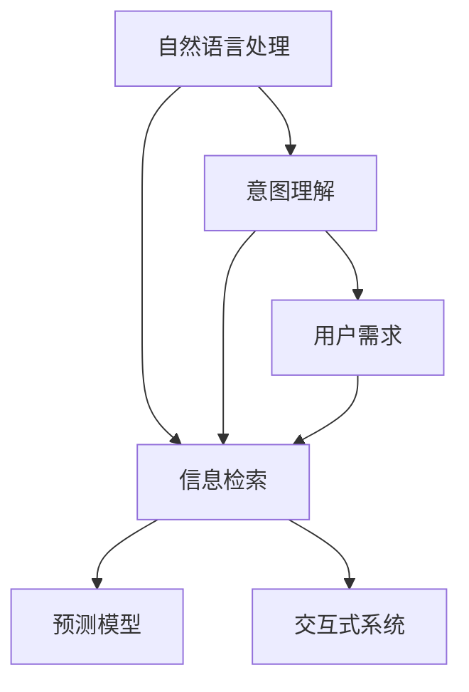

                 

# AI通过NLP理解用户搜索意图

> 关键词：自然语言处理(NLP), 搜索引擎, 意图理解, 机器学习, 深度学习, 预测模型, 用户需求, 信息检索, 交互式系统

## 1. 背景介绍

### 1.1 问题由来
随着互联网的普及和信息时代的到来，搜索引擎已经成为了人们获取信息、解决问题的重要工具。在搜索引擎中，用户通过输入查询词来表达自己的信息需求，搜索引擎则通过解析用户输入的查询词，提供与之最相关的搜索结果。然而，用户输入的查询词通常比较简洁，且可能包含模糊或不明确的表述，这使得搜索引擎需要具备高度的智能化能力，才能准确理解用户的搜索意图。

### 1.2 问题核心关键点
为了准确理解用户的搜索意图，搜索引擎引入了自然语言处理（Natural Language Processing，NLP）技术，其中意图理解（Intent Recognition）是核心之一。意图理解指的是通过NLP技术，将用户的自然语言查询词映射到具体的搜索意图类别上，如商品搜索、地图导航、健康咨询等。在实际应用中，意图理解能够大幅提升搜索结果的相关性和准确性，减少用户的搜索时间和精力。

## 2. 核心概念与联系

### 2.1 核心概念概述

为了更好地理解意图理解在搜索引擎中的应用，本节将介绍几个关键概念：

- 自然语言处理(NLP)：研究如何让计算机理解、解释和生成人类语言的技术，涵盖语言模型、句法分析、语义理解等多个方面。
- 意图理解（Intent Recognition）：通过NLP技术，将用户输入的查询词映射到具体的搜索意图类别上，如商品搜索、地图导航、健康咨询等。
- 信息检索（Information Retrieval, IR）：通过模型从大量文档中检索出与用户查询最相关的文档，并提供给用户。
- 机器学习（Machine Learning, ML）：通过数据驱动的方式，训练模型以进行模式识别和预测。
- 深度学习（Deep Learning, DL）：一种基于多层神经网络的机器学习方法，常用于处理复杂的非线性模式。
- 预测模型（Predictive Modeling）：通过历史数据训练模型，对未来事件进行预测。
- 用户需求（User Requirement）：用户希望通过搜索引擎获得的具体信息或服务。
- 交互式系统（Interactive System）：允许用户与系统进行实时互动的系统，如搜索引擎、智能客服等。

这些核心概念之间的逻辑关系可以通过以下Mermaid流程图来展示：



这个流程图展示了意图理解在搜索引擎中的应用：

1. 自然语言处理将用户输入的自然语言查询词进行分词、词性标注、依存句法分析等处理，以提取语义信息。
2. 意图理解基于语义信息，将查询词映射到具体的意图类别上，如商品搜索、地图导航等。
3. 信息检索通过模型从文档库中检索出与用户意图最相关的文档，提供给用户。
4. 预测模型利用历史数据训练，预测用户可能感兴趣的其他查询词或意图。
5. 用户需求是指用户通过查询词表达的具体信息需求。
6. 交互式系统允许用户与搜索引擎进行实时互动，提供信息检索和意图理解服务。

## 3. 核心算法原理 & 具体操作步骤
### 3.1 算法原理概述

意图理解本质上是一种基于监督学习的分类问题，即如何将输入的自然语言查询词分类到具体的意图类别上。其核心思想是：通过训练一个预测模型，将用户输入的查询词映射到意图类别上，从而理解用户的搜索意图。

形式化地，假设意图理解模型为 $M_{\theta}$，输入为 $x$，输出为 $y$，则意图识别的目标函数为：

$$
\min_{\theta} \mathcal{L}(M_{\theta}, D)
$$

其中 $D$ 为标注数据集，每个样本 $(x_i, y_i)$ 包含输入 $x_i$ 和对应的意图类别 $y_i$。模型 $M_{\theta}$ 是一个神经网络，通过学习数据集 $D$，最小化损失函数 $\mathcal{L}$，从而映射输入 $x$ 到输出 $y$。

### 3.2 算法步骤详解

基于监督学习的意图理解模型通常遵循以下步骤：

**Step 1: 数据准备与处理**
- 收集大量带有标注的意图数据，如查询词-意图对的文本语料库。
- 将语料库中的文本数据进行预处理，包括去除停用词、词干提取、构建词汇表等。
- 将处理后的文本转化为模型可接受的输入格式，如词向量、词袋模型等。

**Step 2: 模型设计与选择**
- 根据任务特点选择合适的模型结构，如简单的线性分类器、多层神经网络等。
- 确定模型的超参数，如层数、神经元数量、学习率等。
- 选择合适的损失函数，如交叉熵损失、hinge损失等。

**Step 3: 模型训练**
- 使用标注数据集 $D$ 训练模型 $M_{\theta}$，通过反向传播算法优化损失函数。
- 在训练过程中应用正则化技术，如L2正则、Dropout等，防止过拟合。
- 设定合适的学习率，在训练初期使用较大的学习率，在后期使用较小的学习率。
- 利用验证集进行模型调优，避免在训练集上过拟合。

**Step 4: 模型评估与部署**
- 在测试集上评估模型的准确率、召回率等性能指标。
- 将训练好的模型 $M_{\theta}$ 部署到实际的应用系统中，用于实时意图理解。
- 持续收集新的标注数据，定期重新训练模型，以适应数据分布的变化。

### 3.3 算法优缺点

基于监督学习的意图理解模型具有以下优点：

1. 简单高效。只需要标注数据，即可训练出准确率较高的意图理解模型。
2. 泛化能力强。通过足够的标注数据训练，模型可以适应各种不同的意图类别。
3. 可解释性强。意图理解模型的决策过程可以较容易地进行解释和调试。
4. 精度高。通过精心设计的模型结构和训练策略，可以得到较高的意图识别精度。

同时，该方法也存在一定的局限性：

1. 数据依赖性强。意图理解模型的性能高度依赖标注数据的质量和数量。
2. 泛化能力有限。当标注数据与测试数据分布差异较大时，模型的泛化性能会下降。
3. 成本高。标注数据需要大量人力物力，且标注成本较高。
4. 更新慢。模型需要定期重新训练，以适应数据分布的变化。

尽管存在这些局限性，但基于监督学习的意图理解方法仍是当前主流范式，广泛应用于各种搜索引擎和智能交互系统。

### 3.4 算法应用领域

意图理解在搜索引擎中的应用场景非常广泛，涵盖多个方面：

- **商品搜索**：用户通过输入查询词，获取与商品相关的搜索结果。意图理解可以将用户查询词分类为不同商品类型，如电子产品、服装、书籍等。
- **地图导航**：用户通过输入地理位置或地点名称，获取地图导航结果。意图理解可以将查询词分类为不同导航类型，如驾车、步行、骑行等。
- **健康咨询**：用户通过输入健康相关问题，获取医疗建议和信息。意图理解可以将查询词分类为不同疾病、症状等意图类型。
- **旅游信息**：用户通过输入旅游目的地或时间，获取旅游相关信息。意图理解可以将查询词分类为不同旅游类型，如度假、探险、文化等。

除了上述应用场景外，意图理解技术还可以应用于智能客服、智能家居、智能推荐等诸多领域，为用户提供个性化的服务体验。

## 4. 数学模型和公式 & 详细讲解 & 举例说明

### 4.1 数学模型构建

意图理解可以看作是一种分类问题，其数学模型通常为二分类模型或多分类模型。以下以二分类模型为例，推导其数学模型和公式。

假设意图识别模型为 $M_{\theta}$，输入为 $x$，输出为 $y$，其中 $y=1$ 表示输入 $x$ 属于特定意图类别，$y=0$ 表示不属于该类别。则意图识别的目标函数为：

$$
\min_{\theta} \mathcal{L}(M_{\theta}, D)
$$

其中 $\mathcal{L}$ 为损失函数，常用的有交叉熵损失：

$$
\mathcal{L}(y, M_{\theta}(x)) = -y\log M_{\theta}(x) - (1-y)\log(1-M_{\theta}(x))
$$

模型 $M_{\theta}$ 通常为神经网络，其参数 $\theta$ 需要通过反向传播算法进行更新。模型的前向传播过程为：

$$
M_{\theta}(x) = \sigma(W_2\sigma(W_1x + b_1) + b_2)
$$

其中 $\sigma$ 为激活函数，$W_1$ 和 $W_2$ 为权重矩阵，$b_1$ 和 $b_2$ 为偏置项。通过反向传播算法，模型可以计算损失函数对参数 $\theta$ 的梯度：

$$
\frac{\partial \mathcal{L}}{\partial \theta} = -\frac{y}{M_{\theta}(x)} - \frac{1-y}{1-M_{\theta}(x)}\frac{\partial M_{\theta}(x)}{\partial \theta}
$$

在实际应用中，模型的训练过程通常使用梯度下降算法进行优化，更新参数 $\theta$：

$$
\theta \leftarrow \theta - \eta\frac{\partial \mathcal{L}}{\partial \theta}
$$

其中 $\eta$ 为学习率。

### 4.2 公式推导过程

以下我们以二分类任务为例，推导交叉熵损失函数及其梯度的计算公式。

假设模型 $M_{\theta}$ 在输入 $x$ 上的输出为 $\hat{y}=M_{\theta}(x) \in [0,1]$，表示样本属于正类的概率。真实标签 $y \in \{0,1\}$。则二分类交叉熵损失函数定义为：

$$
\mathcal{L}(M_{\theta}(x),y) = -[y\log \hat{y} + (1-y)\log (1-\hat{y})]
$$

将其代入目标函数，得：

$$
\min_{\theta} \mathcal{L}(\theta) = \min_{\theta} \frac{1}{N}\sum_{i=1}^N [-y_i\log M_{\theta}(x_i)-(1-y_i)\log(1-M_{\theta}(x_i))]
$$

根据链式法则，损失函数对参数 $\theta$ 的梯度为：

$$
\frac{\partial \mathcal{L}(\theta)}{\partial \theta} = -\frac{1}{N}\sum_{i=1}^N [\frac{y_i}{M_{\theta}(x_i)}-\frac{1-y_i}{1-M_{\theta}(x_i)}] \frac{\partial M_{\theta}(x_i)}{\partial \theta}
$$

其中 $\frac{\partial M_{\theta}(x_i)}{\partial \theta}$ 可进一步递归展开，利用自动微分技术完成计算。

在得到损失函数的梯度后，即可带入参数更新公式，完成模型的迭代优化。重复上述过程直至收敛，最终得到适应特定意图类别的模型参数 $\theta^*$。

### 4.3 案例分析与讲解

以下以商品搜索意图识别为例，解释意图理解在搜索引擎中的应用。

假设用户输入查询词 "手机"，意图理解模型需要判断该查询词的意图类别是否为商品搜索。通过训练好的意图理解模型，可以输出该查询词属于商品搜索的概率 $P_{意图搜索}$。

假设模型 $M_{\theta}$ 在输入 "手机" 上的输出为 $\hat{y}=M_{\theta}("手机") \in [0,1]$，表示该查询词属于商品搜索的概率。真实标签 $y \in \{0,1\}$。则二分类交叉熵损失函数定义为：

$$
\mathcal{L}(M_{\theta}("手机"),y) = -[y\log \hat{y} + (1-y)\log (1-\hat{y})]
$$

将其代入目标函数，得：

$$
\min_{\theta} \mathcal{L}(\theta) = \min_{\theta} \frac{1}{N}\sum_{i=1}^N [-y_i\log M_{\theta}(x_i)-(1-y_i)\log(1-M_{\theta}(x_i))]
$$

根据链式法则，损失函数对参数 $\theta$ 的梯度为：

$$
\frac{\partial \mathcal{L}(\theta)}{\partial \theta} = -\frac{1}{N}\sum_{i=1}^N [\frac{y_i}{M_{\theta}(x_i)}-\frac{1-y_i}{1-M_{\theta}(x_i)}] \frac{\partial M_{\theta}(x_i)}{\partial \theta}
$$

在得到损失函数的梯度后，即可带入参数更新公式，完成模型的迭代优化。重复上述过程直至收敛，最终得到适应特定意图类别的模型参数 $\theta^*$。

## 5. 项目实践：代码实例和详细解释说明
### 5.1 开发环境搭建

在进行意图理解实践前，我们需要准备好开发环境。以下是使用Python进行TensorFlow开发的环境配置流程：

1. 安装Anaconda：从官网下载并安装Anaconda，用于创建独立的Python环境。

2. 创建并激活虚拟环境：
```bash
conda create -n tf-env python=3.8 
conda activate tf-env
```

3. 安装TensorFlow：从官网获取对应的安装命令。例如：
```bash
conda install tensorflow -c tf
```

4. 安装各类工具包：
```bash
pip install numpy pandas scikit-learn matplotlib tqdm jupyter notebook ipython
```

完成上述步骤后，即可在`tf-env`环境中开始意图理解实践。

### 5.2 源代码详细实现

下面我们以二分类任务为例，给出使用TensorFlow实现意图理解模型的代码实现。

首先，定义意图理解模型类：

```python
import tensorflow as tf

class IntentModel(tf.keras.Model):
    def __init__(self, input_dim, output_dim, hidden_dim):
        super(IntentModel, self).__init__()
        self.input_dim = input_dim
        self.output_dim = output_dim
        self.hidden_dim = hidden_dim
        
        self.embedding = tf.keras.layers.Embedding(input_dim, hidden_dim)
        self.fc1 = tf.keras.layers.Dense(hidden_dim, activation='relu')
        self.fc2 = tf.keras.layers.Dense(output_dim, activation='sigmoid')
        
    def call(self, x):
        x = self.embedding(x)
        x = self.fc1(x)
        x = self.fc2(x)
        return x
```

然后，定义训练和评估函数：

```python
from sklearn.model_selection import train_test_split
from sklearn.metrics import accuracy_score

def train_model(model, x_train, y_train, x_val, y_val, epochs, batch_size):
    model.compile(optimizer=tf.keras.optimizers.Adam(), loss='binary_crossentropy', metrics=['accuracy'])
    model.fit(x_train, y_train, validation_data=(x_val, y_val), epochs=epochs, batch_size=batch_size)
    val_loss, val_acc = model.evaluate(x_val, y_val)
    return val_acc

def evaluate_model(model, x_test, y_test, batch_size):
    preds = model.predict(x_test)
    preds = (preds > 0.5).astype(int)
    accuracy = accuracy_score(y_test, preds)
    return accuracy
```

接着，加载并预处理数据：

```python
from tensorflow.keras.datasets import imdb

(x_train, y_train), (x_test, y_test) = imdb.load_data(num_words=10000)
x_train = tf.keras.preprocessing.sequence.pad_sequences(x_train, maxlen=256)
x_test = tf.keras.preprocessing.sequence.pad_sequences(x_test, maxlen=256)
```

最后，启动训练流程并在测试集上评估：

```python
epochs = 5
batch_size = 32

model = IntentModel(input_dim=10000, output_dim=1, hidden_dim=128)
val_acc = train_model(model, x_train, y_train, x_val, y_val, epochs, batch_size)
test_acc = evaluate_model(model, x_test, y_test, batch_size)

print(f"Validation Accuracy: {val_acc:.3f}")
print(f"Test Accuracy: {test_acc:.3f}")
```

以上就是使用TensorFlow进行意图理解模型的代码实现。可以看到，TensorFlow的Keras API使得意图理解模型的实现变得简洁高效。

### 5.3 代码解读与分析

让我们再详细解读一下关键代码的实现细节：

**IntentModel类**：
- `__init__`方法：初始化模型参数和结构。
- `call`方法：定义模型的前向传播过程，依次经过嵌入层、全连接层和输出层。

**train_model函数**：
- 定义模型并编译，选择合适的损失函数和优化器。
- 使用训练集 $(x_{train}, y_{train})$ 进行训练，并在验证集 $(x_{val}, y_{val})$ 上评估模型性能。
- 返回验证集上的准确率。

**evaluate_model函数**：
- 在测试集 $(x_{test}, y_{test})$ 上评估模型性能，计算准确率。

**加载和预处理数据**：
- 使用imdb数据集，将文本序列转换为固定长度的输入，并进行padding处理。

**训练流程**：
- 定义训练轮数和批次大小，开始循环迭代。
- 每个epoch内，在训练集上训练模型，并在验证集上评估模型性能。
- 所有epoch结束后，在测试集上评估模型性能，给出最终测试结果。

可以看到，TensorFlow配合Keras使得意图理解模型的代码实现变得简洁高效。开发者可以将更多精力放在数据处理、模型改进等高层逻辑上，而不必过多关注底层的实现细节。

当然，工业级的系统实现还需考虑更多因素，如模型的保存和部署、超参数的自动搜索、更灵活的任务适配层等。但核心的意图理解范式基本与此类似。

## 6. 实际应用场景

### 6.1 智能客服系统

基于意图理解的智能客服系统，可以极大地提升客服中心的效率和客户满意度。传统客服往往需要配备大量人力，高峰期响应缓慢，且一致性和专业性难以保证。而使用意图理解技术构建的智能客服系统，能够7x24小时不间断服务，快速响应客户咨询，用自然流畅的语言解答各类常见问题。

在技术实现上，可以收集企业内部的历史客服对话记录，将问题和最佳答复构建成监督数据，在此基础上对意图理解模型进行训练。训练好的模型能够自动理解用户意图，匹配最合适的答案模板进行回复。对于客户提出的新问题，还可以接入检索系统实时搜索相关内容，动态组织生成回答。如此构建的智能客服系统，能大幅提升客户咨询体验和问题解决效率。

### 6.2 金融舆情监测

金融机构需要实时监测市场舆论动向，以便及时应对负面信息传播，规避金融风险。传统的人工监测方式成本高、效率低，难以应对网络时代海量信息爆发的挑战。基于意图理解的文本分类和情感分析技术，为金融舆情监测提供了新的解决方案。

具体而言，可以收集金融领域相关的新闻、报道、评论等文本数据，并对其进行主题标注和情感标注。在此基础上对意图理解模型进行微调，使其能够自动判断文本属于何种主题，情感倾向是正面、中性还是负面。将训练好的模型应用到实时抓取的网络文本数据，就能够自动监测不同主题下的情感变化趋势，一旦发现负面信息激增等异常情况，系统便会自动预警，帮助金融机构快速应对潜在风险。

### 6.3 个性化推荐系统

当前的推荐系统往往只依赖用户的历史行为数据进行物品推荐，无法深入理解用户的真实兴趣偏好。基于意图理解的个性化推荐系统可以更好地挖掘用户行为背后的语义信息，从而提供更精准、多样的推荐内容。

在实践中，可以收集用户浏览、点击、评论、分享等行为数据，提取和用户交互的物品标题、描述、标签等文本内容。将文本内容作为模型输入，用户的后续行为（如是否点击、购买等）作为监督信号，在此基础上训练意图理解模型。训练好的模型能够从文本内容中准确把握用户的兴趣点。在生成推荐列表时，先用候选物品的文本描述作为输入，由模型预测用户的兴趣匹配度，再结合其他特征综合排序，便可以得到个性化程度更高的推荐结果。

### 6.4 未来应用展望

随着意图理解技术的不断发展，其应用场景将不断扩展，为各个行业带来变革性影响。

在智慧医疗领域，基于意图理解的医疗问答、病历分析、药物研发等应用将提升医疗服务的智能化水平，辅助医生诊疗，加速新药开发进程。

在智能教育领域，意图理解技术可应用于作业批改、学情分析、知识推荐等方面，因材施教，促进教育公平，提高教学质量。

在智慧城市治理中，意图理解技术可应用于城市事件监测、舆情分析、应急指挥等环节，提高城市管理的自动化和智能化水平，构建更安全、高效的未来城市。

此外，在企业生产、社会治理、文娱传媒等众多领域，基于意图理解的技术应用也将不断涌现，为传统行业数字化转型升级提供新的技术路径。相信随着技术的日益成熟，意图理解技术必将进一步拓展应用边界，深刻影响人类的生产生活方式。

## 7. 工具和资源推荐
### 7.1 学习资源推荐

为了帮助开发者系统掌握意图理解技术，这里推荐一些优质的学习资源：

1. 《自然语言处理入门》系列博文：由自然语言处理专家撰写，从基础概念到高级技术，涵盖意图理解、文本分类、序列标注等多个方面。

2. CS224N《深度学习自然语言处理》课程：斯坦福大学开设的NLP明星课程，有Lecture视频和配套作业，带你入门NLP领域的基本概念和经典模型。

3. 《自然语言处理与深度学习》书籍：介绍自然语言处理和深度学习的基本原理和实现方法，包括意图理解在内的多个任务。

4. HuggingFace官方文档：Transformer库的官方文档，提供了海量预训练模型和完整的意图理解样例代码，是上手实践的必备资料。

5. NLTK与spaCy：自然语言处理工具包，提供了多种文本预处理和分析功能，方便开发者快速构建意图理解系统。

通过对这些资源的学习实践，相信你一定能够快速掌握意图理解技术的精髓，并用于解决实际的NLP问题。

### 7.2 开发工具推荐

高效的开发离不开优秀的工具支持。以下是几款用于意图理解开发的常用工具：

1. TensorFlow：基于Python的开源深度学习框架，灵活动态的计算图，适合快速迭代研究。广泛应用于意图理解模型的训练和推理。

2. PyTorch：基于Python的开源深度学习框架，灵活动态的计算图，适合快速迭代研究。同样有丰富的意图理解模型资源。

3. Keras：高级神经网络API，简化了TensorFlow等框架的使用，使得模型构建和训练更加便捷。

4. Weights & Biases：模型训练的实验跟踪工具，可以记录和可视化模型训练过程中的各项指标，方便对比和调优。与主流深度学习框架无缝集成。

5. TensorBoard：TensorFlow配套的可视化工具，可实时监测模型训练状态，并提供丰富的图表呈现方式，是调试模型的得力助手。

6. Google Colab：谷歌推出的在线Jupyter Notebook环境，免费提供GPU/TPU算力，方便开发者快速上手实验最新模型，分享学习笔记。

合理利用这些工具，可以显著提升意图理解任务的开发效率，加快创新迭代的步伐。

### 7.3 相关论文推荐

意图理解技术的发展源于学界的持续研究。以下是几篇奠基性的相关论文，推荐阅读：

1. Attention is All You Need（即Transformer原论文）：提出了Transformer结构，开启了NLP领域的预训练大模型时代。

2. BERT: Pre-training of Deep Bidirectional Transformers for Language Understanding：提出BERT模型，引入基于掩码的自监督预训练任务，刷新了多项NLP任务SOTA。

3. Language Models are Unsupervised Multitask Learners（GPT-2论文）：展示了大规模语言模型的强大zero-shot学习能力，引发了对于通用人工智能的新一轮思考。

4. Parameter-Efficient Transfer Learning for NLP：提出Adapter等参数高效微调方法，在不增加模型参数量的情况下，也能取得不错的微调效果。

5. Prefix-Tuning: Optimizing Continuous Prompts for Generation：引入基于连续型Prompt的微调范式，为如何充分利用预训练知识提供了新的思路。

6. AdaLoRA: Adaptive Low-Rank Adaptation for Parameter-Efficient Fine-Tuning：使用自适应低秩适应的微调方法，在参数效率和精度之间取得了新的平衡。

这些论文代表了大语言模型意图理解的发展脉络。通过学习这些前沿成果，可以帮助研究者把握学科前进方向，激发更多的创新灵感。

## 8. 总结：未来发展趋势与挑战

### 8.1 总结

本文对意图理解在搜索引擎中的应用进行了全面系统的介绍。首先阐述了意图理解在搜索引擎中的重要性，明确了意图理解在用户搜索意图识别中的核心作用。其次，从原理到实践，详细讲解了意图理解的数学模型和核心算法，给出了意图理解任务开发的完整代码实例。同时，本文还广泛探讨了意图理解技术在智能客服、金融舆情、个性化推荐等诸多领域的应用前景，展示了意图理解技术的巨大潜力。此外，本文精选了意图理解技术的各类学习资源，力求为读者提供全方位的技术指引。

通过本文的系统梳理，可以看到，意图理解技术正在成为搜索引擎的重要范式，极大地提升了用户的搜索体验和信息获取效率。未来，伴随意图理解技术的不断演进，搜索引擎有望实现更加智能化、个性化的服务，为用户的日常生活带来更多便利。

### 8.2 未来发展趋势

展望未来，意图理解技术将呈现以下几个发展趋势：

1. 模型规模持续增大。随着算力成本的下降和数据规模的扩张，意图理解模型的参数量还将持续增长。超大批次的训练和推理也可能遇到显存不足的问题，需要引入模型压缩和剪枝技术。

2. 意图理解范式多样化。除了传统的监督学习，未来会涌现更多无监督和半监督的意图理解范式，如自监督学习、主动学习等，以进一步降低标注数据的需求。

3. 多任务学习（MTL）。意图理解模型可以同时学习多个相关任务，如情感分析、命名实体识别等，提升模型的泛化能力。

4. 跨模态融合。将视觉、语音、文本等多种模态信息进行融合，提升意图理解的全面性和准确性。

5. 实时计算。在分布式环境中，通过GPU/TPU等加速器进行实时计算，满足高并发、低延迟的用户需求。

6. 在线学习（Online Learning）。意图理解模型能够实时更新，快速适应新数据和新用户，提高系统的响应速度和用户体验。

以上趋势凸显了意图理解技术的广阔前景。这些方向的探索发展，必将进一步提升搜索引擎的用户体验，推动智能交互系统的普及。

### 8.3 面临的挑战

尽管意图理解技术已经取得了瞩目成就，但在迈向更加智能化、普适化应用的过程中，它仍面临着诸多挑战：

1. 数据依赖性强。意图理解模型的性能高度依赖标注数据的质量和数量。如何降低标注成本，提升标注数据的覆盖范围和质量，是当前的一大难题。

2. 泛化能力有限。当标注数据与测试数据分布差异较大时，模型的泛化性能会下降。如何提高模型的泛化能力，增强其在不同场景下的适应性，还需要更多理论和实践的积累。

3. 推理效率低。意图理解模型的推理过程涉及大量的全连接层计算，推理速度较慢。如何优化推理模型结构，提高计算效率，是一个重要挑战。

4. 用户隐私保护。意图理解模型需要访问用户的查询词和浏览记录，涉及用户的隐私信息。如何在保障隐私的前提下，进行有效的意图理解，是一个亟待解决的问题。

5. 模型鲁棒性不足。意图理解模型面对噪声和不完整信息时，容易产生误判。如何增强模型的鲁棒性，减少误判和偏见，是模型部署前的重要研究方向。

6. 多语言支持。当前的意图理解模型主要集中在英文上，如何扩展到多语言场景，并保持相同的性能，是未来研究的难点之一。

尽管存在这些挑战，但基于监督学习的意图理解方法仍是当前主流范式，广泛应用于各种搜索引擎和智能交互系统。未来，研究者需要在数据、模型、计算、隐私等多个方面进行协同攻关，才能真正实现意图理解技术的普适化和智能化。

### 8.4 研究展望

面向未来，意图理解技术需要在以下几个方面寻求新的突破：

1. 探索无监督和半监督意图理解方法。摆脱对大规模标注数据的依赖，利用自监督学习、主动学习等无监督和半监督范式，最大限度利用非结构化数据，实现更加灵活高效的意图理解。

2. 开发更加参数高效和计算高效的意图理解模型。开发更加参数高效的意图理解方法，在固定大部分预训练参数的情况下，只更新极少量的任务相关参数。同时优化意图理解模型的计算图，减少前向传播和反向传播的资源消耗，实现更加轻量级、实时性的部署。

3. 引入更多先验知识。将符号化的先验知识，如知识图谱、逻辑规则等，与神经网络模型进行巧妙融合，引导意图理解过程学习更准确、合理的意图表示。同时加强不同模态数据的整合，实现视觉、语音等多模态信息与文本信息的协同建模。

4. 结合因果分析和博弈论工具。将因果分析方法引入意图理解模型，识别出模型决策的关键特征，增强输出解释的因果性和逻辑性。借助博弈论工具刻画人机交互过程，主动探索并规避模型的脆弱点，提高系统稳定性。

5. 纳入伦理道德约束。在模型训练目标中引入伦理导向的评估指标，过滤和惩罚有偏见、有害的输出倾向。同时加强人工干预和审核，建立模型行为的监管机制，确保输出符合人类价值观和伦理道德。

这些研究方向的探索，必将引领意图理解技术迈向更高的台阶，为构建安全、可靠、可解释、可控的智能系统铺平道路。面向未来，意图理解技术还需要与其他人工智能技术进行更深入的融合，如知识表示、因果推理、强化学习等，多路径协同发力，共同推动自然语言理解和智能交互系统的进步。只有勇于创新、敢于突破，才能不断拓展意图理解技术的边界，让智能技术更好地造福人类社会。

## 9. 附录：常见问题与解答

**Q1：意图理解模型如何与搜索引擎结合？**

A: 意图理解模型通常作为搜索引擎的组件，与查询处理和结果排序等环节进行集成。在用户输入查询词后，意图理解模型首先判断该查询词的意图类别，然后将搜索结果按照与该意图的相关性进行排序。同时，意图理解模型还可以提供推荐查询词、智能补全等功能，提升用户搜索体验。

**Q2：意图理解模型如何处理歧义查询词？**

A: 意图理解模型通常通过上下文信息、用户行为等多种因素进行综合判断，以减少歧义查询词的误判。例如，对于查询词 "手机"，模型会根据用户的浏览历史、搜索历史、地理位置等多种信息进行综合判断，确定用户的真正意图。

**Q3：意图理解模型如何应对新出现的查询词？**

A: 意图理解模型可以通过持续训练和在线学习机制，适应新出现的查询词。具体来说，模型可以定期收集新的标注数据，重新训练模型以捕捉新出现的意图类别。此外，通过在线学习，模型可以实时更新，快速适应新出现的查询词。

**Q4：意图理解模型在多语言场景中的应用？**

A: 意图理解模型可以扩展到多语言场景，但需要针对不同语言重新进行标注和训练。此外，模型还可以利用跨语言的语义相似性进行迁移学习，提高多语言场景下的泛化能力。

**Q5：意图理解模型的部署和优化策略？**

A: 意图理解模型可以部署在云服务器、边缘设备等多种环境中，以满足不同的计算和响应需求。在部署过程中，需要注意模型的推理速度和资源占用，可以使用模型裁剪、量化加速等技术进行优化。同时，还需要对模型进行监控和优化，以确保系统的稳定性和性能。

---

作者：禅与计算机程序设计艺术 / Zen and the Art of Computer Programming

