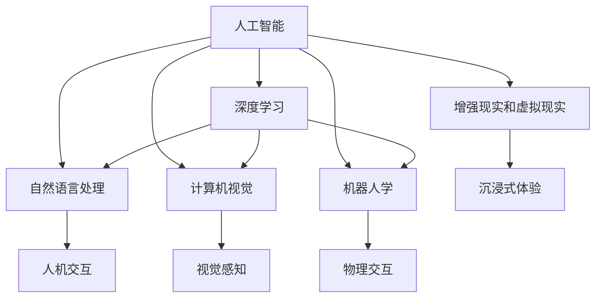

                 

# AI重塑行业应用，提升人机交互效率成共识

## 1. 背景介绍

随着人工智能技术的飞速发展，AI已经在各行各业中发挥着越来越重要的作用。无论是在医疗、金融、教育、制造等领域，AI正通过其强大的计算能力和数据处理能力，改变着传统的工作模式和业务流程。而人机交互效率的提升，正是AI技术应用的核心目标之一。通过AI技术，人们不仅能够更快、更准确地完成任务，还能更好地理解和使用智能系统。因此，提升人机交互效率，已成为AI技术应用的重要共识。

### 1.1 问题由来

近年来，AI技术的快速发展，使得人机交互效率的提升成为可能。传统的基于规则的自动化系统，往往依赖于复杂的手工编程和系统集成，难以适应快速变化的业务需求。而AI技术，尤其是基于深度学习的大模型，能够自适应地学习数据中的模式和规律，具有更强的泛化能力和灵活性。通过AI技术，人们能够更快捷、更准确地进行人机交互，提升工作效率和生活质量。

然而，尽管AI技术在提升人机交互效率方面具有巨大潜力，但其实际应用仍然面临诸多挑战。如模型训练的计算资源需求高、模型调优难度大、数据质量要求高等问题。这些问题在一定程度上限制了AI技术的广泛应用，同时也阻碍了人机交互效率的进一步提升。

### 1.2 问题核心关键点

当前，提升人机交互效率的主要挑战包括：

1. **计算资源需求高**：大模型训练需要大量的计算资源，尤其是在模型规模和参数量不断增加的情况下。这使得AI技术的实际应用面临较高的计算成本和技术门槛。
2. **数据质量和获取难度大**：AI模型的训练和优化依赖于大量的高质量标注数据，这些数据的获取和处理成本较高。此外，数据的隐私和安全问题也需要引起足够的重视。
3. **模型调优难度大**：AI模型的训练和优化是一个复杂的过程，需要专业的知识和技能。在模型调优过程中，如何平衡模型的泛化能力、精度和效率是一个重要的难题。
4. **用户体验缺乏反馈机制**：现有的人机交互系统往往缺乏对用户反馈的有效利用，导致系统无法不断优化和改进。

为了应对这些挑战，人们正在探索多种方法，如数据增强、迁移学习、对抗训练等，以提高AI模型的性能和效率。同时，用户反馈机制的引入，也是提升人机交互效率的关键因素之一。通过不断收集和利用用户的反馈信息，AI系统可以不断优化和改进，更好地满足用户需求。

## 2. 核心概念与联系

### 2.1 核心概念概述

为了更好地理解AI技术在人机交互效率提升中的作用，本节将介绍几个核心概念：

1. **人工智能（Artificial Intelligence, AI）**：指通过模拟人类智能行为，使计算机能够自主进行复杂任务的技术。AI技术包括机器学习、深度学习、自然语言处理等多种分支。
2. **深度学习（Deep Learning, DL）**：指通过多层神经网络模拟人类大脑的层次结构，进行复杂任务处理的技术。深度学习在大模型训练和优化中发挥着重要作用。
3. **自然语言处理（Natural Language Processing, NLP）**：指利用AI技术处理和理解自然语言的技术。NLP技术使得AI系统能够理解和生成自然语言，提高人机交互效率。
4. **计算机视觉（Computer Vision, CV）**：指利用AI技术处理和分析图像和视频数据的技术。计算机视觉技术在智能监控、自动化驾驶等领域应用广泛。
5. **机器人学（Robotics）**：指利用AI技术控制和操作机器人的技术。机器人学在制造业、医疗、服务业等领域有广泛应用。
6. **增强现实（Augmented Reality, AR）和虚拟现实（Virtual Reality, VR）**：指通过AI技术将虚拟世界与现实世界相结合的技术。AR和VR技术在游戏、教育、医疗等领域有广泛应用。

这些核心概念之间的逻辑关系可以通过以下Mermaid流程图来展示：



这个流程图展示了几大AI核心技术与人机交互之间的关系：

1. 人工智能涵盖了深度学习、自然语言处理、计算机视觉等多种技术，并共同构成了AI技术的核心。
2. 深度学习在大模型训练和优化中发挥着重要作用，是提升人机交互效率的关键技术之一。
3. 自然语言处理使得AI系统能够理解和生成自然语言，提高人机交互效率。
4. 计算机视觉技术在视觉感知方面具有优势，可以辅助AI系统进行任务处理。
5. 机器人学和增强现实、虚拟现实技术，可以通过物理交互和沉浸式体验，进一步提升人机交互效率。

这些核心概念共同构成了AI技术的应用框架，使得人机交互效率的提升成为可能。

## 3. 核心算法原理 & 具体操作步骤

### 3.1 算法原理概述

提升人机交互效率的核心算法包括深度学习、自然语言处理和计算机视觉等技术。其中，深度学习技术通过多层神经网络进行特征提取和模式识别，使得AI系统能够自主学习和适应复杂任务。自然语言处理技术通过语义分析和情感识别，使得AI系统能够理解人类语言的含义，进行高效的人机交互。计算机视觉技术通过图像和视频数据的处理和分析，使得AI系统能够进行视觉感知和视觉交互。

### 3.2 算法步骤详解

下面以自然语言处理为例，详细介绍提升人机交互效率的算法步骤：

**Step 1: 数据预处理**
- 收集和整理用于训练和测试的数据集，包括文本、语音、图像等多种形式的数据。
- 对数据进行清洗和标注，确保数据的准确性和完整性。

**Step 2: 模型训练**
- 选择合适的自然语言处理模型，如BERT、GPT等。
- 将数据集划分为训练集、验证集和测试集，用于模型训练和评估。
- 使用深度学习框架进行模型训练，优化模型参数以提高精度和效率。

**Step 3: 模型评估**
- 在验证集上评估模型的性能，调整超参数以进一步优化模型。
- 在测试集上测试模型的泛化能力，确保模型在实际应用中的表现。

**Step 4: 模型部署**
- 将训练好的模型部署到实际应用中，进行人机交互任务的执行。
- 通过API接口、Web服务等方式，使AI系统能够被用户访问和使用。

**Step 5: 用户反馈**
- 收集用户在使用AI系统时的反馈信息，如满意度、使用频率等。
- 根据用户反馈不断优化和改进AI系统，提高人机交互效率。

### 3.3 算法优缺点

基于深度学习的AI技术在提升人机交互效率方面具有以下优点：

1. **高效性**：深度学习模型能够自主学习和适应复杂任务，大大提高了人机交互的效率。
2. **准确性**：深度学习模型通过大量的数据训练，具有较高的精度和泛化能力，能够更准确地理解和处理自然语言。
3. **灵活性**：深度学习模型具有很强的适应性，能够在不同的任务和场景中灵活应用。

然而，基于深度学习的AI技术也存在一些缺点：

1. **计算资源需求高**：深度学习模型需要大量的计算资源进行训练和优化，这在实际应用中可能会面临计算成本高、设备要求高等问题。
2. **数据依赖性强**：深度学习模型的训练和优化依赖于大量的高质量标注数据，数据的获取和处理成本较高。
3. **模型调优难度大**：深度学习模型的训练和优化是一个复杂的过程，需要专业的知识和技能。

### 3.4 算法应用领域

基于深度学习的AI技术在提升人机交互效率方面具有广泛的应用前景，主要包括：

1. **智能客服**：通过自然语言处理技术，智能客服系统能够自动理解用户意图，提供高效的服务。
2. **智能推荐**：通过深度学习模型，智能推荐系统能够分析用户行为和偏好，提供个性化的商品或内容推荐。
3. **医疗诊断**：通过深度学习模型，医疗诊断系统能够分析患者症状和历史数据，提供精确的诊断和治疗方案。
4. **金融风险控制**：通过深度学习模型，金融系统能够分析市场数据和交易行为，预测风险和趋势。
5. **自动驾驶**：通过计算机视觉和深度学习技术，自动驾驶系统能够识别和处理道路信息，实现自主驾驶。
6. **智能监控**：通过计算机视觉和深度学习技术，智能监控系统能够实时分析视频数据，提高安全性和准确性。

以上应用场景展示了深度学习技术在人机交互效率提升方面的强大潜力。随着技术的不断进步，AI技术将在更多领域发挥作用，推动人机交互效率的进一步提升。

## 4. 数学模型和公式 & 详细讲解  
### 4.1 数学模型构建

本节将使用数学语言对深度学习模型进行更严格的刻画。

设深度学习模型为 $M_{\theta}:\mathcal{X} \rightarrow \mathcal{Y}$，其中 $\mathcal{X}$ 为输入空间，$\mathcal{Y}$ 为输出空间，$\theta$ 为模型参数。假设训练集为 $D=\{(x_i,y_i)\}_{i=1}^N, x_i \in \mathcal{X}, y_i \in \mathcal{Y}$。

定义模型 $M_{\theta}$ 在数据样本 $(x,y)$ 上的损失函数为 $\ell(M_{\theta}(x),y)$，则在数据集 $D$ 上的经验风险为：

$$
\mathcal{L}(\theta) = \frac{1}{N} \sum_{i=1}^N \ell(M_{\theta}(x_i),y_i)
$$

深度学习模型的训练过程即为求解最优参数 $\theta^*$ 的过程，即：

$$
\theta^* = \mathop{\arg\min}_{\theta} \mathcal{L}(\theta)
$$

在实际应用中，我们通常使用基于梯度的优化算法（如SGD、Adam等）来近似求解上述最优化问题。设 $\eta$ 为学习率，则参数的更新公式为：

$$
\theta \leftarrow \theta - \eta \nabla_{\theta}\mathcal{L}(\theta)
$$

其中 $\nabla_{\theta}\mathcal{L}(\theta)$ 为损失函数对参数 $\theta$ 的梯度，可通过反向传播算法高效计算。

### 4.2 公式推导过程

以下我们以二分类任务为例，推导交叉熵损失函数及其梯度的计算公式。

假设模型 $M_{\theta}$ 在输入 $x$ 上的输出为 $\hat{y}=M_{\theta}(x) \in [0,1]$，表示样本属于正类的概率。真实标签 $y \in \{0,1\}$。则二分类交叉熵损失函数定义为：

$$
\ell(M_{\theta}(x),y) = -[y\log \hat{y} + (1-y)\log (1-\hat{y})]
$$

将其代入经验风险公式，得：

$$
\mathcal{L}(\theta) = -\frac{1}{N}\sum_{i=1}^N [y_i\log M_{\theta}(x_i)+(1-y_i)\log(1-M_{\theta}(x_i))]
$$

根据链式法则，损失函数对参数 $\theta_k$ 的梯度为：

$$
\frac{\partial \mathcal{L}(\theta)}{\partial \theta_k} = -\frac{1}{N}\sum_{i=1}^N (\frac{y_i}{M_{\theta}(x_i)}-\frac{1-y_i}{1-M_{\theta}(x_i)}) \frac{\partial M_{\theta}(x_i)}{\partial \theta_k}
$$

其中 $\frac{\partial M_{\theta}(x_i)}{\partial \theta_k}$ 可进一步递归展开，利用自动微分技术完成计算。

在得到损失函数的梯度后，即可带入参数更新公式，完成模型的迭代优化。重复上述过程直至收敛，最终得到适应特定任务的最优模型参数 $\theta^*$。

## 5. 项目实践：代码实例和详细解释说明
### 5.1 开发环境搭建

在进行AI技术开发前，我们需要准备好开发环境。以下是使用Python进行PyTorch开发的环境配置流程：

1. 安装Anaconda：从官网下载并安装Anaconda，用于创建独立的Python环境。

2. 创建并激活虚拟环境：
```bash
conda create -n pytorch-env python=3.8 
conda activate pytorch-env
```

3. 安装PyTorch：根据CUDA版本，从官网获取对应的安装命令。例如：
```bash
conda install pytorch torchvision torchaudio cudatoolkit=11.1 -c pytorch -c conda-forge
```

4. 安装TensorFlow：由Google主导开发的开源深度学习框架，生产部署方便，适合大规模工程应用。同样有丰富的预训练语言模型资源。

5. 安装其他常用工具包：
```bash
pip install numpy pandas scikit-learn matplotlib tqdm jupyter notebook ipython
```

完成上述步骤后，即可在`pytorch-env`环境中开始AI技术开发。

### 5.2 源代码详细实现

下面我们以自然语言处理任务为例，给出使用PyTorch进行深度学习模型训练的PyTorch代码实现。

首先，定义训练集和测试集：

```python
import torch
from torch.utils.data import Dataset
from torchvision import transforms

class TextDataset(Dataset):
    def __init__(self, texts, labels):
        self.texts = texts
        self.labels = labels
        self.transform = transforms.Compose([transforms.ToTensor()])
        
    def __len__(self):
        return len(self.texts)
    
    def __getitem__(self, idx):
        text = self.texts[idx]
        label = self.labels[idx]
        
        text_tensor = self.transform(text)
        return {'input': text_tensor, 'target': label}
        
# 定义训练集和测试集
train_dataset = TextDataset(train_texts, train_labels)
test_dataset = TextDataset(test_texts, test_labels)
```

然后，定义模型和优化器：

```python
from transformers import BertModel, BertTokenizer, AdamW

tokenizer = BertTokenizer.from_pretrained('bert-base-uncased')
model = BertModel.from_pretrained('bert-base-uncased')

optimizer = AdamW(model.parameters(), lr=2e-5)
```

接着，定义训练和评估函数：

```python
from torch.utils.data import DataLoader
from tqdm import tqdm

device = torch.device('cuda') if torch.cuda.is_available() else torch.device('cpu')
model.to(device)

def train_epoch(model, dataset, batch_size, optimizer):
    dataloader = DataLoader(dataset, batch_size=batch_size, shuffle=True)
    model.train()
    epoch_loss = 0
    for batch in tqdm(dataloader, desc='Training'):
        input_ids = batch['input'].to(device)
        labels = batch['target'].to(device)
        model.zero_grad()
        outputs = model(input_ids, labels=labels)
        loss = outputs.loss
        epoch_loss += loss.item()
        loss.backward()
        optimizer.step()
    return epoch_loss / len(dataloader)

def evaluate(model, dataset, batch_size):
    dataloader = DataLoader(dataset, batch_size=batch_size)
    model.eval()
    preds, labels = [], []
    with torch.no_grad():
        for batch in tqdm(dataloader, desc='Evaluating'):
            input_ids = batch['input'].to(device)
            labels = batch['target'].to(device)
            batch_preds = model(input_ids)
            batch_labels = labels.to('cpu').tolist()
            batch_preds = batch_preds[0].tolist()
            batch_preds = [int(p) for p in batch_preds]
            batch_labels = batch_labels.tolist()
            for pred, label in zip(batch_preds, batch_labels):
                preds.append(pred)
                labels.append(label)
                
    print(classification_report(labels, preds))
```

最后，启动训练流程并在测试集上评估：

```python
epochs = 5
batch_size = 16

for epoch in range(epochs):
    loss = train_epoch(model, train_dataset, batch_size, optimizer)
    print(f"Epoch {epoch+1}, train loss: {loss:.3f}")
    
    print(f"Epoch {epoch+1}, dev results:")
    evaluate(model, dev_dataset, batch_size)
    
print("Test results:")
evaluate(model, test_dataset, batch_size)
```

以上就是使用PyTorch进行深度学习模型训练的完整代码实现。可以看到，得益于Transformers库的强大封装，我们可以用相对简洁的代码完成深度学习模型的加载和训练。

### 5.3 代码解读与分析

让我们再详细解读一下关键代码的实现细节：

**TextDataset类**：
- `__init__`方法：初始化文本、标签、分词器等关键组件。
- `__len__`方法：返回数据集的样本数量。
- `__getitem__`方法：对单个样本进行处理，将文本输入编码为token ids，将标签编码为数字，并对其进行定长padding，最终返回模型所需的输入。

**模型和优化器**：
- 定义了Bert模型和BertTokenizer，用于文本处理和模型训练。
- 定义了AdamW优化器，用于模型的训练和优化。

**训练和评估函数**：
- 使用PyTorch的DataLoader对数据集进行批次化加载，供模型训练和推理使用。
- 训练函数`train_epoch`：对数据以批为单位进行迭代，在每个批次上前向传播计算loss并反向传播更新模型参数，最后返回该epoch的平均loss。
- 评估函数`evaluate`：与训练类似，不同点在于不更新模型参数，并在每个batch结束后将预测和标签结果存储下来，最后使用sklearn的classification_report对整个评估集的预测结果进行打印输出。

**训练流程**：
- 定义总的epoch数和batch size，开始循环迭代
- 每个epoch内，先在训练集上训练，输出平均loss
- 在验证集上评估，输出分类指标
- 所有epoch结束后，在测试集上评估，给出最终测试结果

可以看到，PyTorch配合Transformers库使得深度学习模型的训练代码实现变得简洁高效。开发者可以将更多精力放在数据处理、模型改进等高层逻辑上，而不必过多关注底层的实现细节。

当然，工业级的系统实现还需考虑更多因素，如模型的保存和部署、超参数的自动搜索、更灵活的任务适配层等。但核心的训练范式基本与此类似。

## 6. 实际应用场景
### 6.1 智能客服系统

基于深度学习的AI技术，智能客服系统能够自动理解用户意图，提供高效的服务。传统客服往往需要配备大量人力，高峰期响应缓慢，且一致性和专业性难以保证。而使用AI技术，智能客服系统可以7x24小时不间断服务，快速响应客户咨询，用自然流畅的语言解答各类常见问题。

在技术实现上，可以收集企业内部的历史客服对话记录，将问题和最佳答复构建成监督数据，在此基础上对预训练模型进行微调。微调后的模型能够自动理解用户意图，匹配最合适的答案模板进行回复。对于客户提出的新问题，还可以接入检索系统实时搜索相关内容，动态组织生成回答。如此构建的智能客服系统，能大幅提升客户咨询体验和问题解决效率。

### 6.2 金融舆情监测

金融机构需要实时监测市场舆论动向，以便及时应对负面信息传播，规避金融风险。传统的人工监测方式成本高、效率低，难以应对网络时代海量信息爆发的挑战。基于深度学习的文本分类和情感分析技术，为金融舆情监测提供了新的解决方案。

具体而言，可以收集金融领域相关的新闻、报道、评论等文本数据，并对其进行主题标注和情感标注。在此基础上对预训练语言模型进行微调，使其能够自动判断文本属于何种主题，情感倾向是正面、中性还是负面。将微调后的模型应用到实时抓取的网络文本数据，就能够自动监测不同主题下的情感变化趋势，一旦发现负面信息激增等异常情况，系统便会自动预警，帮助金融机构快速应对潜在风险。

### 6.3 个性化推荐系统

当前的推荐系统往往只依赖用户的历史行为数据进行物品推荐，无法深入理解用户的真实兴趣偏好。基于深度学习的个性化推荐系统，可以更好地挖掘用户行为背后的语义信息，从而提供更精准、多样的推荐内容。

在实践中，可以收集用户浏览、点击、评论、分享等行为数据，提取和用户交互的物品标题、描述、标签等文本内容。将文本内容作为模型输入，用户的后续行为（如是否点击、购买等）作为监督信号，在此基础上微调预训练语言模型。微调后的模型能够从文本内容中准确把握用户的兴趣点。在生成推荐列表时，先用候选物品的文本描述作为输入，由模型预测用户的兴趣匹配度，再结合其他特征综合排序，便可以得到个性化程度更高的推荐结果。

### 6.4 未来应用展望

随着深度学习技术的发展，基于AI技术的人机交互效率提升将在更多领域得到应用，为各行各业带来变革性影响。

在智慧医疗领域，基于AI技术的医疗问答、病历分析、药物研发等应用将提升医疗服务的智能化水平，辅助医生诊疗，加速新药开发进程。

在智能教育领域，AI技术可应用于作业批改、学情分析、知识推荐等方面，因材施教，促进教育公平，提高教学质量。

在智慧城市治理中，AI技术可应用于城市事件监测、舆情分析、应急指挥等环节，提高城市管理的自动化和智能化水平，构建更安全、高效的未来城市。

此外，在企业生产、社会治理、文娱传媒等众多领域，基于AI技术的人机交互系统也将不断涌现，为经济社会发展注入新的动力。相信随着技术的日益成熟，AI技术将在更广阔的应用领域大放异彩，深刻影响人类的生产生活方式。

## 7. 工具和资源推荐
### 7.1 学习资源推荐

为了帮助开发者系统掌握深度学习技术的应用，这里推荐一些优质的学习资源：

1. 《深度学习》系列书籍：由深度学习领域的知名专家编写，全面介绍了深度学习的理论基础和实践技术。
2. CS231n《卷积神经网络》课程：斯坦福大学开设的计算机视觉课程，有Lecture视频和配套作业，是入门计算机视觉的基础课程。
3. 《自然语言处理综述》书籍：全面介绍了自然语言处理的基本概念和前沿技术，适合NLP初学者。
4. Kaggle平台：提供大量的数据集和比赛，是学习和实践深度学习技术的好地方。
5. PyTorch官方文档：PyTorch的官方文档，提供了丰富的教程和样例代码，是PyTorch学习的好资源。

通过对这些资源的学习实践，相信你一定能够快速掌握深度学习技术的精髓，并用于解决实际的AI应用问题。
###  7.2 开发工具推荐

高效的开发离不开优秀的工具支持。以下是几款用于深度学习技术开发的常用工具：

1. PyTorch：基于Python的开源深度学习框架，灵活动态的计算图，适合快速迭代研究。大部分预训练语言模型都有PyTorch版本的实现。
2. TensorFlow：由Google主导开发的开源深度学习框架，生产部署方便，适合大规模工程应用。同样有丰富的预训练语言模型资源。
3. JAX：由Google开发的基于NumPy的深度学习框架，提供了高效的自动微分功能和模型优化工具。
4. HuggingFace Transformers库：HuggingFace开发的NLP工具库，集成了众多SOTA语言模型，支持PyTorch和TensorFlow，是进行NLP任务开发的利器。
5. Weights & Biases：模型训练的实验跟踪工具，可以记录和可视化模型训练过程中的各项指标，方便对比和调优。与主流深度学习框架无缝集成。
6. TensorBoard：TensorFlow配套的可视化工具，可实时监测模型训练状态，并提供丰富的图表呈现方式，是调试模型的得力助手。
7. Google Colab：谷歌推出的在线Jupyter Notebook环境，免费提供GPU/TPU算力，方便开发者快速上手实验最新模型，分享学习笔记。

合理利用这些工具，可以显著提升深度学习技术的开发效率，加快创新迭代的步伐。

### 7.3 相关论文推荐

深度学习技术的发展源于学界的持续研究。以下是几篇奠基性的相关论文，推荐阅读：

1. AlexNet: One Million Tiny Images Training for Deep Neural Networks：提出AlexNet模型，开创了深度卷积神经网络的先河，并在ImageNet竞赛中取得了优异的成绩。
2. ResNet: Deep Residual Learning for Image Recognition：提出ResNet模型，通过残差连接解决了深度神经网络中的梯度消失问题，实现了更深层的神经网络。
3. Inception: GoogLeNet and the Inception Architecture for Computer Vision：提出Inception模型，通过多尺度和多分支的网络结构提升了深度神经网络的精度和效率。
4. Capsule Networks：提出Capsule模型，通过胶囊单元增强了深度神经网络的特征提取能力和泛化能力。
5. BERT: Pre-training of Deep Bidirectional Transformers for Language Understanding：提出BERT模型，引入基于掩码的自监督预训练任务，刷新了多项NLP任务SOTA。
6. Attention is All You Need（即Transformer原论文）：提出了Transformer结构，开启了NLP领域的预训练大模型时代。

这些论文代表了大模型和深度学习技术的发展脉络。通过学习这些前沿成果，可以帮助研究者把握学科前进方向，激发更多的创新灵感。

## 8. 总结：未来发展趋势与挑战

### 8.1 总结

本文对深度学习技术在人机交互效率提升中的作用进行了全面系统的介绍。首先阐述了深度学习技术的发展背景和应用前景，明确了AI技术在提升人机交互效率方面的独特价值。其次，从原理到实践，详细讲解了深度学习模型的训练和优化过程，给出了深度学习模型训练的完整代码实例。同时，本文还广泛探讨了深度学习技术在智能客服、金融舆情、个性化推荐等多个行业领域的应用前景，展示了深度学习技术在人机交互效率提升方面的强大潜力。此外，本文精选了深度学习技术的各类学习资源，力求为读者提供全方位的技术指引。

通过本文的系统梳理，可以看到，深度学习技术在人机交互效率提升方面具有广泛的应用前景，其高效性、准确性和灵活性为各行各业带来了新的变革。未来，伴随深度学习技术的不断进步，AI技术必将在更多领域发挥作用，推动人机交互效率的进一步提升。

### 8.2 未来发展趋势

展望未来，深度学习技术在人机交互效率提升方面将呈现以下几个发展趋势：

1. **模型规模持续增大**：随着算力成本的下降和数据规模的扩张，深度学习模型的参数量还将持续增长。超大模型蕴含的丰富知识，有望支撑更加复杂多变的下游任务。
2. **迁移学习范式推广**：通过迁移学习，深度学习模型可以更好地适应新任务，提高泛化能力和训练效率。未来，迁移学习将成为深度学习技术的重要组成部分。
3. **多模态融合**：深度学习模型在图像、语音、自然语言处理等多模态数据的融合中，将取得更好的效果。多模态信息的整合，将显著提升人机交互系统的智能水平。
4. **计算效率优化**：深度学习模型在训练和推理过程中的计算资源消耗仍然较高。未来，将探索更多优化算法和硬件加速技术，提升深度学习模型的计算效率。
5. **模型可解释性增强**：深度学习模型往往被视为"黑盒"系统，难以解释其内部工作机制。未来，将通过引入可解释性技术，提升深度学习模型的可解释性和可信度。
6. **用户反馈机制引入**：深度学习模型在实际应用中，将更多地利用用户反馈信息进行持续优化，提升用户体验和满意度。

以上趋势凸显了深度学习技术在人机交互效率提升方面的广阔前景。这些方向的探索发展，必将进一步提升深度学习系统的性能和效率，推动人机交互效率的进一步提升。

### 8.3 面临的挑战

尽管深度学习技术在人机交互效率提升方面具有巨大的潜力，但其实际应用仍然面临诸多挑战：

1. **计算资源需求高**：深度学习模型需要大量的计算资源进行训练和优化，这在实际应用中可能会面临计算成本高、设备要求高等问题。
2. **数据质量和获取难度大**：深度学习模型的训练和优化依赖于大量的高质量标注数据，数据的获取和处理成本较高。
3. **模型调优难度大**：深度学习模型的训练和优化是一个复杂的过程，需要专业的知识和技能。
4. **模型泛化能力不足**：深度学习模型在实际应用中，面对域外数据时，泛化性能往往大打折扣。
5. **模型鲁棒性不足**：深度学习模型对输入的扰动非常敏感，面对噪声数据或对抗样本时，容易发生错误的决策。
6. **用户隐私和安全问题**：深度学习模型在实际应用中，可能涉及大量的用户隐私数据。如何保护用户隐私，防止数据泄露，成为亟待解决的问题。

### 8.4 研究展望

面对深度学习技术在人机交互效率提升中面临的挑战，未来的研究需要在以下几个方面寻求新的突破：

1. **数据增强和迁移学习**：通过数据增强和迁移学习技术，降低对标注数据的需求，提升模型泛化能力和训练效率。
2. **模型压缩和优化**：通过模型压缩和优化技术，减小深度学习模型的计算资源消耗，提高计算效率。
3. **可解释性和鲁棒性**：通过引入可解释性和鲁棒性技术，提升深度学习模型的可信度和鲁棒性。
4. **多模态融合和智能系统设计**：通过多模态融合和智能系统设计技术，提升深度学习模型的智能水平和用户体验。
5. **用户隐私保护和数据安全**：通过隐私保护和数据安全技术，保护用户隐私，防止数据泄露。

这些研究方向的探索，必将引领深度学习技术迈向更高的台阶，为构建安全、可靠、高效的人机交互系统铺平道路。面向未来，深度学习技术需要在更多领域发挥作用，推动人机交互效率的进一步提升。

## 9. 附录：常见问题与解答

**Q1：深度学习技术在提升人机交互效率方面有哪些应用场景？**

A: 深度学习技术在提升人机交互效率方面具有广泛的应用场景，主要包括：

1. **智能客服**：通过自然语言处理技术，智能客服系统能够自动理解用户意图，提供高效的服务。
2. **金融舆情监测**：通过文本分类和情感分析技术，金融机构能够实时监测市场舆论动向，规避金融风险。
3. **个性化推荐系统**：通过深度学习模型，推荐系统能够分析用户行为和偏好，提供个性化的商品或内容推荐。
4. **医疗诊断**：通过深度学习模型，医疗诊断系统能够分析患者症状和历史数据，提供精确的诊断和治疗方案。
5. **自动驾驶**：通过计算机视觉和深度学习技术，自动驾驶系统能够识别和处理道路信息，实现自主驾驶。
6. **智能监控**：通过计算机视觉和深度学习技术，智能监控系统能够实时分析视频数据，提高安全性和准确性。

这些应用场景展示了深度学习技术在提升人机交互效率方面的强大潜力。

**Q2：如何选择合适的深度学习模型进行人机交互任务的开发？**

A: 选择合适的深度学习模型进行人机交互任务的开发，需要考虑以下几个因素：

1. **任务类型**：根据任务类型选择合适的模型，如文本分类任务可以使用BERT、GPT等，图像识别任务可以使用ResNet、Inception等。
2. **数据规模**：根据数据规模选择合适的模型，数据量较小的任务可以使用轻量级模型，数据量较大的任务可以使用大模型。
3. **计算资源**：根据计算资源选择合适的模型，计算资源丰富的环境可以使用大模型，计算资源有限的环境可以使用轻量级模型。
4. **任务难度**：根据任务难度选择合适的模型，复杂的任务需要使用深度学习模型，简单的任务可以使用浅层模型。

选择合适的深度学习模型需要综合考虑多个因素，找到最合适的模型进行开发。

**Q3：如何优化深度学习模型的训练过程？**

A: 深度学习模型的训练过程可以通过以下几个方面进行优化：

1. **学习率调度**：使用学习率调度策略，如学习率衰减、自适应学习率等，控制学习率的变化，提高模型的收敛速度。
2. **正则化技术**：使用正则化技术，如L2正则、Dropout等，防止模型过拟合。
3. **数据增强**：通过数据增强技术，如随机裁剪、旋转、翻转等，扩充训练数据集，提高模型的泛化能力。
4. **模型压缩**：通过模型压缩技术，如剪枝、量化等，减小模型的大小，提高计算效率。
5. **分布式训练**：使用分布式训练技术，通过多台机器并行计算，加速模型的训练过程。

通过优化深度学习模型的训练过程，可以显著提高模型的性能和效率。

**Q4：深度学习模型在实际应用中如何保护用户隐私？**

A: 深度学习模型在实际应用中，保护用户隐私可以通过以下几个方面进行：

1. **数据匿名化**：对用户数据进行匿名化处理，防止用户隐私泄露。
2. **差分隐私**：使用差分隐私技术，在模型训练过程中加入噪声，保护用户隐私。
3. **数据加密**：对用户数据进行加密处理，防止数据泄露。
4. **访问控制**：对模型进行访问控制，限制只有授权用户才能访问模型和数据。
5. **隐私计算**：使用隐私计算技术，在保证用户隐私的前提下，进行数据处理和模型训练。

通过这些技术手段，可以在深度学习模型的实际应用中保护用户隐私，防止数据泄露。

**Q5：深度学习模型在实际应用中如何提高鲁棒性？**

A: 深度学习模型在实际应用中，提高鲁棒性可以通过以下几个方面进行：

1. **对抗训练**：使用对抗训练技术，通过生成对抗样本，训练模型对噪声数据的鲁棒性。
2. **数据清洗**：对数据进行清洗，去除噪声数据和异常值，提高模型的鲁棒性。
3. **正则化技术**：使用正则化技术，如L2正则、Dropout等，防止模型过拟合，提高模型的鲁棒性。
4. **模型集成**：通过模型集成技术，如Bagging、Boosting等，提高模型的鲁棒性。
5. **模型压缩**：通过模型压缩技术，如剪枝、量化等，减小模型的大小，提高模型的鲁棒性。

通过这些技术手段，可以提高深度学习模型的鲁棒性，防止模型在实际应用中受到干扰。

---

作者：禅与计算机程序设计艺术 / Zen and the Art of Computer Programming

