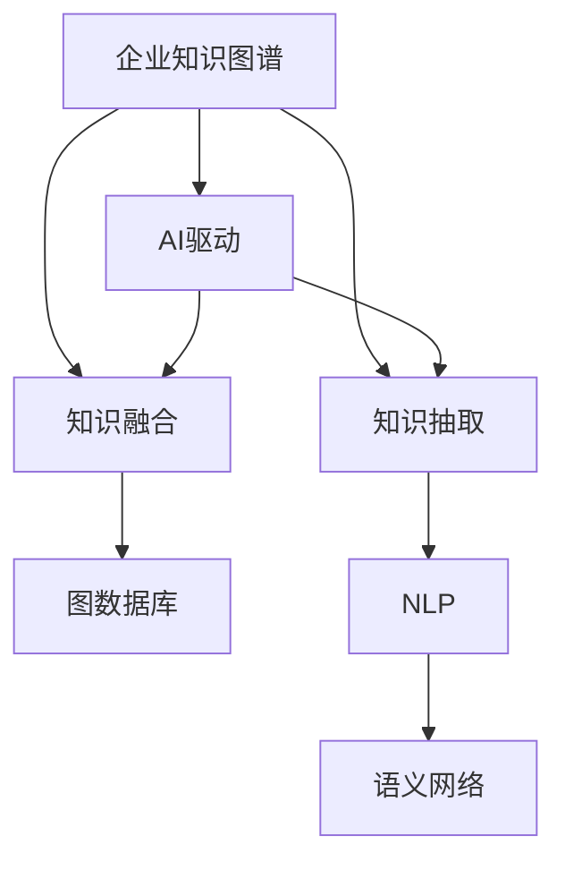

                 

# AI驱动的企业知识图谱构建

> 关键词：企业知识图谱, 知识抽取, 图数据库, 知识融合, AI驱动, 自然语言处理, 语义网络, 商业智能

## 1. 背景介绍

### 1.1 问题由来
在当今数字化时代，企业面对海量数据和信息，如何从中提炼有价值的知识，建立结构化的知识库，成为许多企业的重大挑战。传统的数据仓库和报表系统，往往只能提供静态的统计分析，难以满足企业快速、智能的决策需求。知识图谱作为一种结构化知识库，通过将实体、关系、属性等知识元素构造成语义网络，为企业提供了一种高效、智能的信息整合手段。然而，构建知识图谱的第一步，是进行大规模的知识抽取和融合工作，涉及多个数据源和异构数据类型，工作量大、难度高。

### 1.2 问题核心关键点
构建企业知识图谱的核心在于：
- 从异构数据源中提取实体和关系信息。
- 消除冗余和噪音，构建高质量的知识图谱。
- 融合多源异构知识，形成统一、完整的知识体系。
- 通过AI技术驱动图谱构建，提升构建效率和图谱质量。

本文将围绕这些问题，系统阐述基于AI的企业知识图谱构建方法，探讨其原理、步骤、技术和应用。

### 1.3 问题研究意义
构建企业知识图谱对于提升企业数据治理能力、支持智能决策、优化业务流程、提升商业智能等方面，具有重要意义：

1. **数据治理**：通过语义化数据组织，提高数据质量，消除数据孤岛。
2. **智能决策**：基于知识图谱的推理和推荐，提供更有依据的决策支持。
3. **流程优化**：通过图谱关联业务流程，发现瓶颈、优化流程。
4. **商业智能**：利用图谱进行深度挖掘和分析，发现商业洞察。

## 2. 核心概念与联系

### 2.1 核心概念概述

为了更好地理解基于AI的企业知识图谱构建方法，本节将介绍几个关键概念：

- **企业知识图谱**：用于描述企业内外部知识的语义网络，通过实体、关系和属性构成。知识图谱中的实体表示企业组织、产品、客户等，关系表示实体间的联系，属性表示实体的具体特征。
- **知识抽取**：从非结构化数据（如文本、网页、文档）中自动提取实体、关系和属性信息，生成知识图谱的基本元素。
- **知识融合**：将多个来源的知识进行统一和整合，消除冗余和冲突，构建高质量的知识图谱。
- **图数据库**：用于存储和管理知识图谱的数据库系统，支持高效的图遍历、查询和分析。
- **AI驱动**：利用机器学习和自然语言处理等AI技术，自动化知识抽取和融合过程，提高效率和精度。
- **自然语言处理(NLP)**：用于理解和生成自然语言的AI技术，在知识抽取和关系抽取中发挥关键作用。
- **语义网络**：表示实体和关系之间语义联系的计算机科学概念，是知识图谱的底层结构。

这些核心概念之间的逻辑关系可以通过以下Mermaid流程图来展示：



这个流程图展示了一系列概念之间的联系：

1. 企业知识图谱由知识抽取生成，并经过知识融合优化。
2. 知识抽取和融合过程中，AI驱动提高效率和精度。
3. 自然语言处理技术在知识抽取中发挥作用。
4. 语义网络是知识图谱的底层结构，支持图谱的构建和查询。

## 3. 核心算法原理 & 具体操作步骤
### 3.1 算法原理概述

基于AI的企业知识图谱构建，本质上是一种自动化的知识抽取和融合过程，旨在从非结构化数据中提取结构化的知识，并通过AI技术实现知识的自动整合。其核心思想是：

1. **知识抽取**：利用自然语言处理和机器学习技术，从非结构化文本数据中自动识别实体、关系和属性信息。
2. **知识融合**：将不同来源和格式的知识进行统一和整合，消除冗余和噪音，形成一致的知识图谱。
3. **图谱构建**：将抽取和融合后的知识元素构造成语义网络，存入图数据库，支持高效查询和分析。

### 3.2 算法步骤详解

基于AI的企业知识图谱构建，通常包括以下几个关键步骤：

**Step 1: 数据采集和预处理**
- 从企业内外部数据源（如数据库、文档、网页、ERP系统等）中采集相关数据。
- 对数据进行清洗和预处理，去除噪音和冗余信息。

**Step 2: 知识抽取**
- 利用自然语言处理技术（如命名实体识别、关系抽取等）从文本中自动提取实体、关系和属性信息。
- 对抽取结果进行验证和校正，确保抽取结果的准确性和完整性。

**Step 3: 知识融合**
- 对不同数据源抽取的知识进行统一和整合，消除冗余和冲突。
- 利用规则和算法进行知识冲突的解决，确保知识图谱的一致性。

**Step 4: 图谱构建**
- 将抽取和融合后的知识元素构造成语义网络，存入图数据库。
- 利用图数据库进行高效的图遍历、查询和分析。

**Step 5: 图谱应用**
- 将构建好的知识图谱应用于商业智能、决策支持、流程优化等场景，提升企业的数据治理和业务能力。

### 3.3 算法优缺点

基于AI的企业知识图谱构建方法具有以下优点：
1. **自动化和高效化**：利用AI技术自动化知识抽取和融合过程，提升构建效率。
2. **高精度和一致性**：AI技术能够自动识别和解决知识冲突，提高抽取和融合的精度和一致性。
3. **可扩展性强**：适用于大规模、多源异构数据的处理，具有较强的扩展性。

同时，该方法也存在一些局限性：
1. **数据质量依赖**：知识抽取和融合的质量很大程度上依赖于原始数据的质量，数据噪音和冗余可能影响结果。
2. **技术复杂度**：需要一定的技术和资源投入，特别是对于非结构化数据的处理和AI模型的训练。
3. **模型偏差**：由于知识抽取和融合过程依赖于模型，模型偏差可能导致抽取结果的偏差。

尽管存在这些局限性，但AI驱动的知识图谱构建方法依然是目前最主流和有效的解决方案，其高效率和准确性在许多企业中得到了验证。

### 3.4 算法应用领域

基于AI的企业知识图谱构建方法，在多个行业领域得到了广泛应用，包括：

- **金融行业**：构建客户关系图谱、交易图谱，提升风险管理和合规检测能力。
- **零售行业**：构建产品推荐图谱，提升个性化推荐和库存管理能力。
- **制造业**：构建供应链和物流图谱，优化供应链管理，提升生产效率。
- **医疗行业**：构建疾病诊疗图谱，提升诊疗效率和决策支持能力。
- **能源行业**：构建能源生产和消费图谱，提升能源管理和优化能力。

这些行业的应用实例展示了AI驱动的企业知识图谱构建方法的广泛适用性和巨大潜力。

## 4. 数学模型和公式 & 详细讲解  
### 4.1 数学模型构建

企业知识图谱的构建涉及到实体抽取、关系抽取、属性抽取等多方面的内容，下面以实体抽取为例，介绍其数学模型构建过程。

假设从非结构化文本中抽取实体，实体的抽取可以看作是从文本中识别出特定的词汇序列，表示为实体。设文本序列为 $T=\{x_1, x_2, \ldots, x_n\}$，其中 $x_i$ 表示文本中的一个单词或短语。

实体抽取的目标是找到文本中表示实体的词汇序列 $E=\{e_1, e_2, \ldots, e_m\}$，其中 $e_i$ 表示一个实体。数学上，可以将实体抽取转化为序列标注问题，即给定文本序列 $T$，在每个位置 $i$ 标注是否存在实体 $e_i$。

定义实体标签集合为 $S=\{0, 1\}$，其中 $0$ 表示不存在实体，$1$ 表示存在实体。则实体抽取可以表示为二分类问题，通过分类器 $f(T_i)$ 预测文本序列中每个位置的实体标签。

实体抽取的损失函数定义为：

$$
L = -\frac{1}{N} \sum_{i=1}^N \sum_{j=1}^m (y_j \log f(T_j) + (1-y_j) \log (1-f(T_j)))
$$

其中 $y_j$ 为标签 $e_j$ 的真实标签，$f(T_j)$ 为分类器在位置 $j$ 的预测结果。

### 4.2 公式推导过程

下面详细推导实体抽取的分类器 $f(T_j)$ 的计算公式。

首先，引入BERT等预训练语言模型的文本嵌入表示 $T_j \in \mathbb{R}^{d}$，其中 $d$ 为嵌入向量维度。

定义分类器的计算公式为：

$$
f(T_j) = \sigma(W_j^T T_j + b_j)
$$

其中 $W_j \in \mathbb{R}^{d \times 1}$ 为分类器的权重向量，$b_j \in \mathbb{R}$ 为偏置项，$\sigma$ 为激活函数（如sigmoid）。

将上述公式带入损失函数，得：

$$
L = -\frac{1}{N} \sum_{i=1}^N \sum_{j=1}^m [y_j f(T_j) + (1-y_j) (1-f(T_j))]
$$

为便于计算，可以通过引入softmax函数将二分类问题转化为多分类问题，即预测存在实体的概率 $p_j$ 和不存在实体的概率 $q_j$：

$$
p_j = \frac{\exp(\log f(T_j))}{\exp(\log f(T_j)) + \exp(\log (1-f(T_j)))}, \quad q_j = \frac{\exp(\log (1-f(T_j)))}{\exp(\log f(T_j)) + \exp(\log (1-f(T_j)))}
$$

则损失函数可表示为：

$$
L = -\frac{1}{N} \sum_{i=1}^N \sum_{j=1}^m (y_j p_j + (1-y_j) q_j)
$$

通过上述推导，我们可以看到，实体抽取的分类器通过预训练语言模型的文本嵌入表示，进行序列标注，预测每个位置的实体存在与否，并使用softmax函数将二分类问题转化为多分类问题，最小化损失函数，得到最优的分类器参数。

### 4.3 案例分析与讲解

以下是一个基于BERT的实体抽取案例。

假设需要从一段文本中抽取银行账户信息，文本为：

```
张三的卡号是：123456789，开户行是：中国工商银行
```

首先，使用BERT模型对文本进行编码，得到每个单词的向量表示。然后，通过定义的分类器 $f(T_j)$ 计算每个位置 $j$ 的预测结果 $p_j$ 和 $q_j$，其中 $j$ 表示文本中每个单词的位置。

接下来，对预测结果进行阈值筛选，设定阈值为 $0.5$，则 $p_j$ 大于 $0.5$ 的位置，预测存在银行账户信息。

最终，从文本中抽取到两个实体：

```
张三
123456789
中国工商银行
```

通过上述案例，我们可以看到，利用BERT等预训练语言模型，结合分类器进行序列标注，能够有效地从非结构化文本中抽取实体信息，从而构建企业知识图谱。

## 5. 项目实践：代码实例和详细解释说明
### 5.1 开发环境搭建

在进行企业知识图谱构建实践前，我们需要准备好开发环境。以下是使用Python进行HuggingFace的代码实现的环境配置流程：

1. 安装Anaconda：从官网下载并安装Anaconda，用于创建独立的Python环境。

2. 创建并激活虚拟环境：
```bash
conda create -n enterprise-kb python=3.8 
conda activate enterprise-kb
```

3. 安装HuggingFace：从官网下载并安装HuggingFace，支持BERT等预训练语言模型，方便模型调用和微调。

4. 安装各类工具包：
```bash
pip install numpy pandas scikit-learn matplotlib tqdm jupyter notebook ipython
```

完成上述步骤后，即可在`enterprise-kb`环境中开始知识图谱构建实践。

### 5.2 源代码详细实现

这里我们以银行账户信息抽取为例，给出使用HuggingFace对BERT模型进行实体抽取的PyTorch代码实现。

首先，定义实体抽取的数据处理函数：

```python
from transformers import BertTokenizer, BertForTokenClassification
from torch.utils.data import Dataset
import torch

class AccountDataset(Dataset):
    def __init__(self, texts, tags, tokenizer, max_len=128):
        self.texts = texts
        self.tags = tags
        self.tokenizer = tokenizer
        self.max_len = max_len
        
    def __len__(self):
        return len(self.texts)
    
    def __getitem__(self, item):
        text = self.texts[item]
        tags = self.tags[item]
        
        encoding = self.tokenizer(text, return_tensors='pt', max_length=self.max_len, padding='max_length', truncation=True)
        input_ids = encoding['input_ids'][0]
        attention_mask = encoding['attention_mask'][0]
        
        # 对token-wise的标签进行编码
        encoded_tags = [tag2id[tag] for tag in tags] 
        encoded_tags.extend([tag2id['O']] * (self.max_len - len(encoded_tags)))
        labels = torch.tensor(encoded_tags, dtype=torch.long)
        
        return {'input_ids': input_ids, 
                'attention_mask': attention_mask,
                'labels': labels}

# 标签与id的映射
tag2id = {'O': 0, 'B-BANK_ACCOUNT': 1, 'I-BANK_ACCOUNT': 2}
id2tag = {v: k for k, v in tag2id.items()}

# 创建dataset
tokenizer = BertTokenizer.from_pretrained('bert-base-cased')

train_dataset = AccountDataset(train_texts, train_tags, tokenizer)
dev_dataset = AccountDataset(dev_texts, dev_tags, tokenizer)
test_dataset = AccountDataset(test_texts, test_tags, tokenizer)
```

然后，定义模型和优化器：

```python
from transformers import BertForTokenClassification, AdamW

model = BertForTokenClassification.from_pretrained('bert-base-cased', num_labels=len(tag2id))

optimizer = AdamW(model.parameters(), lr=2e-5)
```

接着，定义训练和评估函数：

```python
from torch.utils.data import DataLoader
from tqdm import tqdm
from sklearn.metrics import classification_report

device = torch.device('cuda') if torch.cuda.is_available() else torch.device('cpu')
model.to(device)

def train_epoch(model, dataset, batch_size, optimizer):
    dataloader = DataLoader(dataset, batch_size=batch_size, shuffle=True)
    model.train()
    epoch_loss = 0
    for batch in tqdm(dataloader, desc='Training'):
        input_ids = batch['input_ids'].to(device)
        attention_mask = batch['attention_mask'].to(device)
        labels = batch['labels'].to(device)
        model.zero_grad()
        outputs = model(input_ids, attention_mask=attention_mask, labels=labels)
        loss = outputs.loss
        epoch_loss += loss.item()
        loss.backward()
        optimizer.step()
    return epoch_loss / len(dataloader)

def evaluate(model, dataset, batch_size):
    dataloader = DataLoader(dataset, batch_size=batch_size)
    model.eval()
    preds, labels = [], []
    with torch.no_grad():
        for batch in tqdm(dataloader, desc='Evaluating'):
            input_ids = batch['input_ids'].to(device)
            attention_mask = batch['attention_mask'].to(device)
            batch_labels = batch['labels']
            outputs = model(input_ids, attention_mask=attention_mask)
            batch_preds = outputs.logits.argmax(dim=2).to('cpu').tolist()
            batch_labels = batch_labels.to('cpu').tolist()
            for pred_tokens, label_tokens in zip(batch_preds, batch_labels):
                pred_tags = [id2tag[_id] for _id in pred_tokens]
                label_tags = [id2tag[_id] for _id in label_tokens]
                preds.append(pred_tags[:len(label_tags)])
                labels.append(label_tags)
                
    print(classification_report(labels, preds))
```

最后，启动训练流程并在测试集上评估：

```python
epochs = 5
batch_size = 16

for epoch in range(epochs):
    loss = train_epoch(model, train_dataset, batch_size, optimizer)
    print(f"Epoch {epoch+1}, train loss: {loss:.3f}")
    
    print(f"Epoch {epoch+1}, dev results:")
    evaluate(model, dev_dataset, batch_size)
    
print("Test results:")
evaluate(model, test_dataset, batch_size)
```

以上就是使用PyTorch对BERT进行银行账户信息抽取的完整代码实现。可以看到，通过HuggingFace封装，我们能够便捷地使用BERT模型进行实体抽取，并实现微调过程。

### 5.3 代码解读与分析

让我们再详细解读一下关键代码的实现细节：

**AccountDataset类**：
- `__init__`方法：初始化文本、标签、分词器等关键组件。
- `__len__`方法：返回数据集的样本数量。
- `__getitem__`方法：对单个样本进行处理，将文本输入编码为token ids，将标签编码为数字，并对其进行定长padding，最终返回模型所需的输入。

**tag2id和id2tag字典**：
- 定义了标签与数字id之间的映射关系，用于将token-wise的预测结果解码回真实的标签。

**训练和评估函数**：
- 使用PyTorch的DataLoader对数据集进行批次化加载，供模型训练和推理使用。
- 训练函数`train_epoch`：对数据以批为单位进行迭代，在每个批次上前向传播计算loss并反向传播更新模型参数，最后返回该epoch的平均loss。
- 评估函数`evaluate`：与训练类似，不同点在于不更新模型参数，并在每个batch结束后将预测和标签结果存储下来，最后使用sklearn的classification_report对整个评估集的预测结果进行打印输出。

**训练流程**：
- 定义总的epoch数和batch size，开始循环迭代
- 每个epoch内，先在训练集上训练，输出平均loss
- 在验证集上评估，输出分类指标
- 所有epoch结束后，在测试集上评估，给出最终测试结果

可以看到，HuggingFace封装使得BERT模型的微调代码实现变得简洁高效。开发者可以将更多精力放在数据处理、模型改进等高层逻辑上，而不必过多关注底层的实现细节。

当然，工业级的系统实现还需考虑更多因素，如模型的保存和部署、超参数的自动搜索、更灵活的任务适配层等。但核心的微调范式基本与此类似。

## 6. 实际应用场景
### 6.1 智能客服系统

基于企业知识图谱的智能客服系统，可以大大提升客服服务效率和质量。传统客服系统依赖人工服务，高峰期响应慢、处理效率低。而智能客服系统利用知识图谱，能够自动理解和处理用户查询，快速提供准确的回答，有效缓解人工客服的压力。

在技术实现上，可以构建客户关系图谱和常见问题图谱，将用户查询和图谱进行匹配，调用对应的业务逻辑进行处理。对于用户提出的新问题，还可以通过自然语言处理技术进行查询扩展和相关问题关联，提升系统的智能水平。

### 6.2 供应链管理

企业知识图谱在供应链管理中也有广泛应用。通过构建供应链图谱，可以清晰地展示供应链上下游关系，包括供应商、客户、合作伙伴、物流节点等，帮助企业进行需求预测、库存管理、物流优化等工作。

知识图谱中的实体和关系可以映射到供应链管理的各个环节，如供应商选择、订单管理、运输调度等，通过图数据库进行高效查询和分析，提升供应链的透明度和响应速度。

### 6.3 金融风控

金融行业需要实时监控市场风险，及时响应异常情况。通过构建金融知识图谱，可以自动抽取和融合交易数据、客户数据、市场数据等信息，构建全面的风险监控系统。

知识图谱中的实体和关系可以映射到风险事件、交易活动、客户信息等，利用图数据库进行实时分析和预测，及时发现异常交易、欺诈行为等，提升金融风险管理能力。

### 6.4 未来应用展望

随着企业知识图谱技术的发展，未来其在企业应用中还将呈现更多新的场景和应用：

1. **智能决策支持**：通过知识图谱构建决策图谱，自动化支持企业各项决策过程，提升决策速度和准确性。
2. **个性化推荐系统**：利用知识图谱进行深度挖掘和分析，构建用户画像，实现个性化推荐。
3. **大数据分析**：利用知识图谱进行数据关联和整合，提升大数据分析的效率和效果。
4. **智能监控系统**：构建安全知识图谱，实时监控企业网络安全状况，防范网络攻击和数据泄露。
5. **智能客服系统**：构建知识图谱驱动的智能客服系统，提升客户服务体验。

总之，企业知识图谱作为企业知识管理和智能决策的重要工具，将为企业带来全方位的智能化转型，助力企业数字化转型升级。

## 7. 工具和资源推荐
### 7.1 学习资源推荐

为了帮助开发者系统掌握企业知识图谱构建的理论基础和实践技巧，这里推荐一些优质的学习资源：

1. 《深入理解企业知识图谱》系列博文：由大模型技术专家撰写，深入浅出地介绍了企业知识图谱的基本概念、构建方法和应用场景。

2. 《企业知识图谱：构建与应用的实战指南》书籍：系统介绍了企业知识图谱的构建方法、技术实现和实际应用案例。

3. 《企业知识图谱构建与应用的深度学习方法》课程：由企业知识图谱领域的知名专家讲授，深入讲解了知识抽取、融合、可视化等核心技术。

4. 企业知识图谱官方文档：提供了企业知识图谱技术的详细介绍和实践样例，是学习企业知识图谱构建的必备资料。

5. 企业知识图谱开源项目：包含多个企业知识图谱构建和应用的案例，展示了企业知识图谱的实际应用效果。

通过对这些资源的学习实践，相信你一定能够快速掌握企业知识图谱构建的精髓，并用于解决实际的业务问题。

### 7.2 开发工具推荐

高效的开发离不开优秀的工具支持。以下是几款用于企业知识图谱构建开发的常用工具：

1. HuggingFace：提供预训练语言模型和模型库，方便知识抽取和融合。
2. TensorFlow和PyTorch：灵活的深度学习框架，支持多种模型的构建和训练。
3. Elasticsearch和Neo4j：高性能的图数据库，支持高效的图谱存储和查询。
4. Apache Flink：流式计算框架，支持图谱实时更新和维护。
5. Jupyter Notebook和Google Colab：便捷的开发环境，支持实时调试和展示。

合理利用这些工具，可以显著提升企业知识图谱构建的开发效率，加快创新迭代的步伐。

### 7.3 相关论文推荐

企业知识图谱的研究源于学界的持续研究。以下是几篇奠基性的相关论文，推荐阅读：

1. 《A Survey on Knowledge Graph Construction in Big Data Era》：综述了大数据环境下知识图谱的构建方法和应用研究。
2. 《Neo4j Graph Database: Towards Persistent High-Performance Graph Storage》：介绍了Neo4j图数据库的技术特点和应用案例。
3. 《Knowledge Graph Embedding》：系统介绍了知识图谱嵌入方法，通过将知识图谱映射到低维向量空间，进行高效的推理和搜索。
4. 《Graph Neural Networks: A Review of Methods and Applications》：综述了图神经网络的研究进展和应用方向，展示了图谱处理的新技术和新思路。
5. 《The Graph Neural Network: A Review of Methods and Applications》：介绍了图神经网络在企业知识图谱中的应用，展示了图谱处理的最新进展和方向。

这些论文代表了大规模企业知识图谱构建的研究方向，通过学习这些前沿成果，可以帮助研究者把握学科前进方向，激发更多的创新灵感。

## 8. 总结：未来发展趋势与挑战

### 8.1 总结

本文对基于AI的企业知识图谱构建方法进行了全面系统的介绍。首先阐述了企业知识图谱构建的背景和意义，明确了构建过程的技术流程和难点。其次，从原理到实践，详细讲解了企业知识图谱构建的数学模型和具体步骤，给出了知识抽取的代码实现和案例分析。同时，本文还探讨了企业知识图谱在多个行业领域的应用前景，展示了其广阔的应用潜力。最后，本文精选了知识图谱构建的学习资源、开发工具和相关论文，力求为读者提供全方位的技术指引。

通过本文的系统梳理，可以看到，基于AI的企业知识图谱构建方法正在成为企业数据治理和智能决策的重要手段，极大地提升了企业的数据治理能力、智能决策能力和业务能力。未来，伴随企业知识图谱技术的不断演进，必将为企业带来更深层次的智能化转型，推动企业数字化转型升级。

### 8.2 未来发展趋势

展望未来，企业知识图谱技术将呈现以下几个发展趋势：

1. **规模化应用**：随着知识图谱技术的成熟，越来越多的企业将采用知识图谱驱动的智能决策系统，提升决策速度和准确性。
2. **数据融合能力**：企业知识图谱将具备更强的跨源数据融合能力，能够整合多种数据源，形成全面的知识图谱。
3. **实时更新**：企业知识图谱将具备实时更新和维护能力，能够快速响应数据变化，保持知识的时效性。
4. **多模态融合**：企业知识图谱将支持多模态数据的融合，如文本、图像、视频等，形成更为丰富的知识体系。
5. **智能推理**：企业知识图谱将具备更强大的智能推理能力，能够进行更复杂的逻辑推断和决策支持。
6. **协同工作**：企业知识图谱将支持多部门协同工作，优化业务流程，提升企业运营效率。

以上趋势凸显了企业知识图谱技术的广阔前景。这些方向的探索发展，必将进一步提升企业的数据治理和业务能力，助力企业数字化转型升级。

### 8.3 面临的挑战

尽管企业知识图谱技术已经取得了一定的进展，但在迈向更加智能化、普适化应用的过程中，它仍面临着诸多挑战：

1. **数据质量依赖**：企业知识图谱的构建高度依赖于数据的质量，数据噪音和冗余可能影响构建结果。
2. **技术复杂度**：需要一定的技术和资源投入，特别是对于非结构化数据的处理和模型训练。
3. **模型偏差**：由于知识抽取和融合过程依赖于模型，模型偏差可能导致抽取结果的偏差。
4. **隐私和安全**：企业知识图谱涉及大量敏感信息，如何保护隐私和安全是重要的研究课题。
5. **维护成本**：企业知识图谱需要持续更新和维护，涉及大量的人力和物力资源投入。

尽管存在这些挑战，但企业知识图谱技术的持续演进和优化，必将逐步克服这些难题，实现其应有的价值和潜力。

### 8.4 研究展望

面对企业知识图谱所面临的诸多挑战，未来的研究需要在以下几个方面寻求新的突破：

1. **自动数据清洗**：开发自动化数据清洗技术，去除数据噪音和冗余，提高数据质量。
2. **知识自动融合**：开发自动化知识融合技术，减少人工干预，提高知识图谱构建效率。
3. **多模态融合**：探索多模态数据融合技术，提升知识图谱的丰富性和智能性。
4. **知识图谱演化**：研究知识图谱的演化机制，实现知识图谱的动态更新和维护。
5. **隐私保护技术**：开发隐私保护技术，确保知识图谱中的敏感信息安全。
6. **智能推理引擎**：开发智能推理引擎，提升知识图谱的推理能力，支持复杂的逻辑推断。

这些研究方向的探索，必将引领企业知识图谱技术迈向更高的台阶，为构建安全、可靠、可解释、可控的智能系统铺平道路。面向未来，企业知识图谱技术还需要与其他人工智能技术进行更深入的融合，如知识表示、因果推理、强化学习等，多路径协同发力，共同推动企业数据治理和智能决策系统的进步。只有勇于创新、敢于突破，才能不断拓展企业知识图谱的边界，让智能技术更好地造福企业和社会。

## 9. 附录：常见问题与解答

**Q1：企业知识图谱和传统的数据仓库有什么不同？**

A: 企业知识图谱和传统的数据仓库有显著的不同。数据仓库主要用于数据的存储和统计分析，其数据是结构化的，以表格形式呈现。而企业知识图谱则是以语义网络的形式呈现，通过实体、关系和属性描述企业内部和外部的知识。数据仓库侧重于事务处理，而企业知识图谱侧重于知识发现和智能决策。

**Q2：如何选择合适的实体和关系抽取算法？**

A: 实体和关系抽取是企业知识图谱构建的基础，选择合适的算法需要考虑多个因素：
1. 数据类型：不同类型的数据（如文本、图像、视频等）需要选择不同的抽取算法。
2. 数据量：大规模数据集需要选择高效的抽取算法，如分布式深度学习算法。
3. 实体类型：不同类型实体（如人名、地名、组织名等）需要选择适合的抽取算法。
4. 关系类型：不同类型关系（如因果、相似、类比等）需要选择适合的抽取算法。

**Q3：如何评估企业知识图谱的质量？**

A: 企业知识图谱的质量评估主要包括以下几个方面：
1. 完整性：抽取和融合的实体和关系是否全面覆盖了企业业务范围。
2. 一致性：实体和关系是否在语义上保持一致，没有冗余和冲突。
3. 精度：实体和关系抽取是否准确，与真实业务一致。
4. 实时性：知识图谱是否能够实时更新和维护，适应企业业务变化。
5. 可解释性：知识图谱的构建和推理过程是否可解释，能够被人工审核和调整。

通过以上指标的评估，可以全面衡量企业知识图谱的质量，发现和解决其中的问题。

**Q4：企业知识图谱在实际应用中需要注意哪些问题？**

A: 企业知识图谱在实际应用中需要注意以下问题：
1. 数据隐私和安全：企业知识图谱涉及大量敏感信息，需要采取措施保护数据隐私和安全。
2. 数据质量和更新：企业知识图谱的构建依赖于高质量的数据，需要定期更新和维护，保持数据的时效性。
3. 系统集成和接口：企业知识图谱需要与企业其他系统集成，提供统一的API接口，方便其他系统调用。
4. 模型可解释性：企业知识图谱中的推理和预测过程需要具备可解释性，能够被人工审核和调整。
5. 性能优化：企业知识图谱需要在高并发、大数据量的情况下保证性能，需要优化算法和硬件配置。

通过合理设计和优化，可以最大化企业知识图谱的应用价值，为企业智能化转型提供有力支撑。

---

作者：禅与计算机程序设计艺术 / Zen and the Art of Computer Programming

