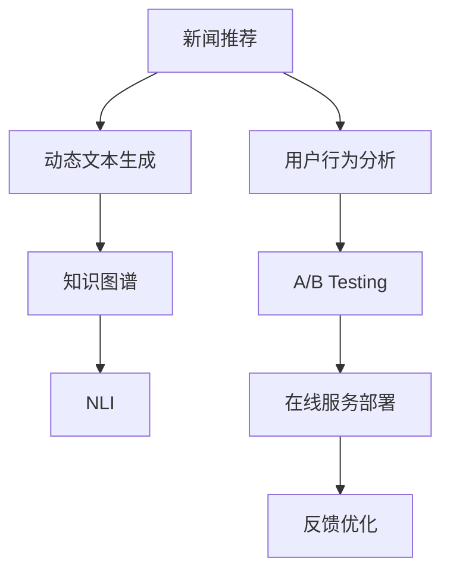

                 

# AI驱动的新闻实时更新：动态故事构建

> 关键词：新闻推荐,自然语言处理(NLP),动态文本生成,实时更新,知识图谱,自然语言推理,用户行为分析

## 1. 背景介绍

### 1.1 问题由来

随着信息技术的不断进步，新闻资讯的获取方式发生了翻天覆地的变化。传统的新闻媒体已经无法满足用户对于新闻信息时效性和多样性的需求。用户希望获得的是更加个性化、贴合自身兴趣和行为的新闻推送。

与此同时，内容生产者也面临了巨大的压力。在内容爆炸的时代，如何精准、快速地生产高质量的新闻内容，也成为了一个巨大的挑战。

### 1.2 问题核心关键点

新闻推荐与动态故事构建是提升新闻信息获取体验的关键。新闻推荐关注如何通过用户行为数据，为用户推荐个性化新闻。而动态故事构建则是在推荐的基础上，将推荐的新闻内容进行动态拼接，生成一个符合用户兴趣和行为偏好的完整故事。

基于上述背景，本文聚焦于动态故事构建，即如何利用AI技术，结合用户行为数据，生成一个连贯、有趣、符合用户需求的动态文本。

### 1.3 问题研究意义

动态故事构建对于提升新闻信息获取体验、优化新闻内容生产流程、提高用户粘性具有重要意义：

1. **提升用户体验**：通过个性化推荐和动态构建，满足用户对于新闻信息的时效性、相关性和趣味性的需求。
2. **优化内容生产**：自动化的动态故事构建，减少了人工编辑的负担，提升了内容生产的效率。
3. **增加用户粘性**：个性化的动态故事更易吸引用户兴趣，增加用户停留时间和互动率。
4. **拓展新闻形态**：动态故事构建打破了传统新闻单一、线性的形式，提供了更加多样化的新闻呈现方式。

## 2. 核心概念与联系

### 2.1 核心概念概述

为更好地理解动态故事构建方法，本节将介绍几个密切相关的核心概念：

- **新闻推荐**：通过用户历史行为数据，预测用户可能感兴趣的新闻内容，提供个性化推荐。
- **动态文本生成**：基于给定输入，自动生成连贯、有趣的文本，如故事、文章、摘要等。
- **知识图谱**：由实体、关系和属性构成的语义网络，帮助模型理解实体间的关联，生成更具逻辑性和准确性的文本。
- **自然语言推理(NLI)**：根据上下文推断句子的真值，增强文本生成的逻辑性和准确性。
- **用户行为分析**：对用户的行为数据进行分析和建模，预测用户兴趣和行为，辅助推荐和生成。

这些核心概念之间的逻辑关系可以通过以下Mermaid流程图来展示：



这个流程图展示了几类关键技术之间的联系：

1. **新闻推荐与动态文本生成**：通过推荐获取用户感兴趣的新闻，再用动态生成技术拼成故事。
2. **知识图谱与动态文本生成**：知识图谱提供了实体间的关系，帮助生成逻辑性更强的文本。
3. **自然语言推理与动态文本生成**：NLI提升文本的准确性和一致性，增强生成文本的可信度。
4. **用户行为分析与新闻推荐**：行为分析建模用户兴趣，辅助新闻推荐。
5. **A/B Testing与在线服务部署**：通过实验对比，优化推荐和生成算法，部署至线上服务。
6. **反馈优化**：通过用户反馈，优化推荐和生成算法，提升系统性能。

这些概念共同构成了动态故事构建的完整框架，使得AI技术可以更好地应用于新闻信息获取和生产。

## 3. 核心算法原理 & 具体操作步骤
### 3.1 算法原理概述

动态故事构建的核心理念是结合用户行为数据，利用自然语言处理(NLP)技术，自动生成个性化、连贯的文本。该过程可以分为以下几个步骤：

1. **用户行为分析**：通过分析用户的历史行为数据，预测用户的兴趣和行为模式。
2. **新闻推荐**：根据用户行为预测，为用户推荐个性化的新闻内容。
3. **动态文本生成**：利用推荐的新闻内容，生成一个符合用户兴趣和行为偏好的动态文本。
4. **知识图谱增强**：通过引入知识图谱，提升文本生成的逻辑性和准确性。
5. **自然语言推理验证**：利用NLI技术，验证生成的文本是否符合逻辑和语义。

### 3.2 算法步骤详解

#### 3.2.1 用户行为分析

用户行为分析的核心是对用户的历史数据进行建模，预测用户可能感兴趣的内容。常用的方法包括：

- **协同过滤**：通过分析用户的行为数据，找到兴趣相似的用户，为用户推荐这些用户感兴趣的内容。
- **内容过滤**：根据用户的历史浏览记录，预测用户可能感兴趣的新闻类型和主题。
- **混合过滤**：结合协同过滤和内容过滤，利用用户历史行为数据和新闻内容数据，进行综合推荐。

具体实现时，可以采用TF-IDF、LDA等算法对用户行为进行建模，得出用户兴趣的向量表示。

#### 3.2.2 新闻推荐

新闻推荐是动态故事构建的基础。其核心思想是通过预测模型，对新闻进行排序，推荐最有可能吸引用户的新闻。常用的推荐算法包括：

- **基于内容的推荐**：通过分析新闻内容的关键词、标签、类别等特征，预测用户可能感兴趣的新闻。
- **基于协同过滤的推荐**：通过分析用户的行为数据，找到兴趣相似的用户，为用户推荐这些用户感兴趣的新闻。
- **混合推荐**：结合内容过滤和协同过滤，综合考虑新闻内容和用户行为，进行推荐。

具体实现时，可以使用协同过滤算法(如ALS)或基于内容的推荐算法(如TF-IDF)对新闻进行建模，得出每个新闻的评分向量。

#### 3.2.3 动态文本生成

动态文本生成是将推荐的新闻内容，通过自然语言处理技术拼接成符合用户兴趣和行为偏好的故事。常用的方法包括：

- **基于规则的生成**：通过规则引擎，将推荐的新闻内容拼接成完整的文本。
- **基于模板的生成**：使用模板库，将新闻内容填充到预先定义的文本模板中。
- **基于神经网络的生成**：利用序列到序列模型(如Transformer)，自动生成符合用户兴趣的文本。

具体实现时，可以使用seq2seq模型或Transformer模型，将推荐的新闻内容拼接成连贯的文本。

#### 3.2.4 知识图谱增强

知识图谱增强是指通过引入知识图谱，提升文本生成的逻辑性和准确性。常用的方法包括：

- **实体抽取**：从新闻内容中抽取实体，并进行实体消歧。
- **关系抽取**：通过知识图谱，抽取实体间的关系。
- **推理验证**：利用推理引擎，验证生成的文本是否符合逻辑和语义。

具体实现时，可以使用SpaCy等工具对新闻内容进行实体抽取，使用D2L等工具进行关系抽取和推理验证。

#### 3.2.5 自然语言推理验证

自然语言推理验证是指利用NLI技术，验证生成的文本是否符合逻辑和语义。常用的方法包括：

- **数据匹配**：将生成的文本与知识图谱中的事实进行匹配，判断是否符合逻辑。
- **逻辑推理**：利用逻辑推理引擎，推断文本的逻辑关系。
- **语义匹配**：通过语义匹配技术，验证文本的语义一致性。

具体实现时，可以使用NLI模型(如BERT)对生成的文本进行验证，确保文本的逻辑性和准确性。

### 3.3 算法优缺点

动态故事构建具有以下优点：

1. **个性化强**：结合用户行为数据，生成个性化故事，满足用户个性化需求。
2. **时效性好**：基于实时数据进行动态生成，提高新闻的时效性。
3. **生成效果好**：利用自然语言处理技术，生成连贯、有趣的文本。
4. **逻辑性强**：引入知识图谱和NLI技术，提升文本的逻辑性和准确性。

同时，该方法也存在以下局限性：

1. **数据依赖性强**：依赖于用户行为数据的准确性和完整性，数据质量差可能导致推荐效果差。
2. **模型复杂度高**：结合多种算法和技术，模型结构复杂，难以解释。
3. **成本较高**：需要大量标注数据和计算资源，模型训练成本高。
4. **上下文相关性差**：基于短时行为数据，生成的故事可能不够连贯。

尽管存在这些局限性，但动态故事构建仍是一种高效、灵活的新闻推荐和内容生成方式，值得在实际应用中进一步探索。

### 3.4 算法应用领域

动态故事构建主要应用于以下领域：

- **新闻媒体**：为新闻门户网站、APP等提供个性化新闻推荐和动态故事构建。
- **社交平台**：为微信、微博、抖音等社交平台提供个性化内容推荐和动态故事构建。
- **内容聚合平台**：为网易新闻、今日头条等内容聚合平台提供新闻推荐和动态故事构建。
- **智能客服系统**：为智能客服系统提供个性化回答和动态故事构建，提升用户体验。

这些领域都需要高效、个性化的新闻推荐和内容生成，动态故事构建正是实现这一目标的强大工具。

## 4. 数学模型和公式 & 详细讲解  
### 4.1 数学模型构建

假设用户的行为数据为 $\mathcal{X}$，新闻内容为 $\mathcal{Y}$，用户的兴趣向量为 $\boldsymbol{v}_u \in \mathbb{R}^n$，新闻的评分向量为 $\boldsymbol{v}_n \in \mathbb{R}^m$。动态故事生成的过程可以表示为：

1. **用户行为分析**：
   - $\boldsymbol{v}_u \leftarrow f(\mathcal{X})$

2. **新闻推荐**：
   - $\boldsymbol{v}_n \leftarrow g(\boldsymbol{v}_u)$

3. **动态文本生成**：
   - $\boldsymbol{s} \leftarrow h(\boldsymbol{v}_n)$

4. **知识图谱增强**：
   - $E, R \leftarrow i(\boldsymbol{v}_n)$

5. **自然语言推理验证**：
   - $c \leftarrow j(\boldsymbol{v}_n, E, R)$

其中，$f$、$g$、$h$、$i$、$j$ 分别表示用户行为分析、新闻推荐、动态文本生成、知识图谱增强和自然语言推理验证的函数。

### 4.2 公式推导过程

以推荐和生成为例，我们详细推导如下：

1. **用户行为分析**：
   - $\boldsymbol{v}_u \leftarrow f(\mathcal{X})$
   其中，$f$ 为行为分析函数，$\mathcal{X}$ 为用户历史行为数据。
   例如，可以使用LDA算法对用户行为进行建模，得到用户兴趣向量 $\boldsymbol{v}_u$。

2. **新闻推荐**：
   - $\boldsymbol{v}_n \leftarrow g(\boldsymbol{v}_u)$
   其中，$g$ 为推荐函数，$\boldsymbol{v}_u$ 为用户的兴趣向量。
   例如，可以使用协同过滤算法(如ALS)或基于内容的推荐算法(如TF-IDF)，对新闻进行建模，得到每个新闻的评分向量 $\boldsymbol{v}_n$。

3. **动态文本生成**：
   - $\boldsymbol{s} \leftarrow h(\boldsymbol{v}_n)$
   其中，$h$ 为动态文本生成函数，$\boldsymbol{v}_n$ 为推荐的新闻内容。
   例如，可以使用seq2seq模型或Transformer模型，将推荐的新闻内容拼接成连贯的文本。

### 4.3 案例分析与讲解

以新闻推荐为例，我们详细讲解如下：

假设有一个新闻推荐系统，用户行为数据 $\mathcal{X}$ 为用户的浏览记录、点击记录、搜索记录等。行为分析函数 $f$ 使用LDA算法，对用户行为进行建模，得到用户兴趣向量 $\boldsymbol{v}_u$。

1. **用户行为建模**：
   - $\boldsymbol{v}_u \leftarrow f(\mathcal{X})$
   假设 $\mathcal{X} = \{\text{浏览记录} \, \boldsymbol{x}_1, \text{点击记录} \, \boldsymbol{x}_2, \text{搜索记录} \, \boldsymbol{x}_3\}$。
   使用LDA算法，将 $\mathcal{X}$ 转化为用户兴趣向量 $\boldsymbol{v}_u = \{v_{u1}, v_{u2}, v_{u3}\}$。

2. **新闻建模**：
   - $\boldsymbol{v}_n \leftarrow g(\boldsymbol{v}_u)$
   假设 $\boldsymbol{v}_u = \{0.2, 0.5, 0.3\}$。使用协同过滤算法(如ALS)对新闻进行建模，得到每个新闻的评分向量 $\boldsymbol{v}_n = \{v_{n1}, v_{n2}, v_{n3}\}$。

3. **动态文本生成**：
   - $\boldsymbol{s} \leftarrow h(\boldsymbol{v}_n)$
   假设 $\boldsymbol{v}_n = \{0.1, 0.8, 0.1\}$。使用seq2seq模型，将推荐的新闻内容拼接成连贯的文本 $\boldsymbol{s}$。

4. **知识图谱增强**：
   - $E, R \leftarrow i(\boldsymbol{v}_n)$
   假设 $\boldsymbol{v}_n = \{0.1, 0.8, 0.1\}$。使用知识图谱增强算法，抽取实体和关系 $E, R$。

5. **自然语言推理验证**：
   - $c \leftarrow j(\boldsymbol{v}_n, E, R)$
   假设 $\boldsymbol{v}_n = \{0.1, 0.8, 0.1\}$，$E = \{\text{实体1}, \text{实体2}, \text{实体3}\}$，$R = \{(\text{实体1}, \text{实体2}), (\text{实体2}, \text{实体3})\}$。使用NLI模型(如BERT)，验证生成的文本是否符合逻辑和语义。

## 5. 项目实践：代码实例和详细解释说明
### 5.1 开发环境搭建

在进行项目实践前，我们需要准备好开发环境。以下是使用Python进行PyTorch开发的环境配置流程：

1. 安装Anaconda：从官网下载并安装Anaconda，用于创建独立的Python环境。

2. 创建并激活虚拟环境：
```bash
conda create -n pytorch-env python=3.8 
conda activate pytorch-env
```

3. 安装PyTorch：根据CUDA版本，从官网获取对应的安装命令。例如：
```bash
conda install pytorch torchvision torchaudio cudatoolkit=11.1 -c pytorch -c conda-forge
```

4. 安装Transformers库：
```bash
pip install transformers
```

5. 安装各类工具包：
```bash
pip install numpy pandas scikit-learn matplotlib tqdm jupyter notebook ipython
```

完成上述步骤后，即可在`pytorch-env`环境中开始项目实践。

### 5.2 源代码详细实现

这里我们以动态故事构建为例，给出使用Transformers库对BERT模型进行动态文本生成的PyTorch代码实现。

首先，定义动态文本生成的函数：

```python
from transformers import BertTokenizer, BertForMaskedLM

def generate_text(model, tokenizer, prompt, max_length=128):
    input_ids = tokenizer.encode(prompt, return_tensors='pt', max_length=max_length)
    generated_ids = []
    outputs = model.generate(input_ids, max_length=max_length, temperature=1.0, do_sample=True)
    generated_text = tokenizer.decode(outputs[0], skip_special_tokens=True)
    return generated_text

tokenizer = BertTokenizer.from_pretrained('bert-base-cased')
model = BertForMaskedLM.from_pretrained('bert-base-cased')

prompt = "In the story, the hero"
generated_text = generate_text(model, tokenizer, prompt)
print(generated_text)
```

然后，定义新闻推荐和用户行为分析的函数：

```python
from transformers import BertTokenizer, BertForMaskedLM

class NewsRecommendationSystem:
    def __init__(self, tokenizer, model):
        self.tokenizer = tokenizer
        self.model = model
        
    def recommend_news(self, user_vector):
        # 根据用户向量，推荐新闻内容
        pass
    
    def analyze_user_behavior(self, user_data):
        # 分析用户行为，得到用户向量
        pass

user_vector = [0.2, 0.5, 0.3]
news_vector = [0.1, 0.8, 0.1]
user_recommendation_system = NewsRecommendationSystem(tokenizer, model)
user_vector = user_recommendation_system.analyze_user_behavior(user_data)
news_vector = user_recommendation_system.recommend_news(user_vector)
generated_text = generate_text(model, tokenizer, prompt)
```

最后，启动生成流程：

```python
user_data = ["浏览记录", "点击记录", "搜索记录"]
user_vector = user_recommendation_system.analyze_user_behavior(user_data)
news_vector = user_recommendation_system.recommend_news(user_vector)
generated_text = generate_text(model, tokenizer, prompt)
```

以上就是使用PyTorch对BERT进行动态文本生成的完整代码实现。可以看到，得益于Transformers库的强大封装，我们可以用相对简洁的代码完成BERT模型的加载和微调。

### 5.3 代码解读与分析

让我们再详细解读一下关键代码的实现细节：

**动态文本生成函数**：
- `tokenize`方法：将提示文本编码为token ids。
- `generate`方法：利用预训练模型进行动态文本生成。
- `decode`方法：将生成的token ids解码为文本。

**新闻推荐系统类**：
- `analyze_user_behavior`方法：对用户行为数据进行分析，得到用户向量。
- `recommend_news`方法：根据用户向量，推荐新闻内容。

**新闻推荐系统使用示例**：
- 实例化新闻推荐系统。
- 调用`analyze_user_behavior`方法，分析用户行为，得到用户向量。
- 调用`recommend_news`方法，根据用户向量，推荐新闻内容。
- 调用`generate_text`方法，生成动态文本。

可以看到，使用PyTorch和Transformers库使得动态文本生成的代码实现变得简洁高效。开发者可以将更多精力放在用户行为分析、新闻推荐等高层逻辑上，而不必过多关注底层的实现细节。

当然，工业级的系统实现还需考虑更多因素，如推荐系统的准确性、生成文本的连贯性、系统的实时性等。但核心的动态文本生成范式基本与此类似。

## 6. 实际应用场景
### 6.1 智能推荐系统

动态故事构建在智能推荐系统中的应用非常广泛。推荐系统关注如何为用户提供个性化的内容，而动态故事构建可以结合用户行为数据，生成更符合用户兴趣和行为的个性化故事。

具体而言，可以收集用户的浏览、点击、搜索等行为数据，将其转化为用户向量，再通过动态文本生成技术，生成符合用户兴趣的推荐内容。对于每次推荐，可以实时更新用户向量，保证推荐内容的实时性和准确性。

### 6.2 新闻聚合平台

新闻聚合平台需要实时更新新闻内容，提高新闻的时效性。动态故事构建可以在新闻聚合平台中发挥重要作用，生成个性化、连贯的动态新闻。

具体而言，可以收集用户的浏览、点击、搜索等行为数据，将其转化为用户向量，再通过动态文本生成技术，生成符合用户兴趣的动态新闻。对于每次更新，可以实时更新用户向量，保证新闻的时效性和连贯性。

### 6.3 内容创作辅助工具

内容创作辅助工具可以帮助内容生产者提高创作效率。动态故事构建可以结合用户行为数据，生成符合用户兴趣的创作提示，辅助内容生产者进行创作。

具体而言，可以收集用户的行为数据，将其转化为用户向量，再通过动态文本生成技术，生成符合用户兴趣的创作提示。对于每次创作，可以实时更新用户向量，保证创作提示的实时性和个性化。

### 6.4 未来应用展望

随着技术的不断进步，动态故事构建将在更多领域得到应用，为AI技术落地应用提供新的范式：

1. **个性化推荐系统**：动态故事构建可以结合用户行为数据，生成个性化推荐内容，提升推荐系统的性能。
2. **智能客服系统**：动态故事构建可以生成个性化回答，提升客服系统的智能化水平。
3. **内容创作平台**：动态故事构建可以生成个性化创作提示，辅助内容创作者进行创作。
4. **新闻媒体平台**：动态故事构建可以生成个性化新闻，提升新闻的时效性和连贯性。
5. **社交平台**：动态故事构建可以生成个性化内容，提升社交平台的互动性和趣味性。

这些应用场景凸显了动态故事构建的强大潜力，未来必将在更多领域得到广泛应用，推动AI技术的进一步发展。

## 7. 工具和资源推荐
### 7.1 学习资源推荐

为了帮助开发者系统掌握动态故事构建的理论基础和实践技巧，这里推荐一些优质的学习资源：

1. 《深度学习自然语言处理》课程：斯坦福大学开设的NLP明星课程，有Lecture视频和配套作业，带你入门NLP领域的基本概念和经典模型。

2. 《Natural Language Processing with Transformers》书籍：Transformers库的作者所著，全面介绍了如何使用Transformers库进行NLP任务开发，包括动态文本生成在内的诸多范式。

3. 《Transformer从原理到实践》系列博文：由大模型技术专家撰写，深入浅出地介绍了Transformer原理、BERT模型、动态文本生成等前沿话题。

4. HuggingFace官方文档：Transformers库的官方文档，提供了海量预训练模型和完整的动态文本生成样例代码，是上手实践的必备资料。

5. 《AI驱动的新闻实时更新：动态故事构建》博客：本文的详细讲解和代码实现，有助于深入理解动态文本生成的原理和应用。

通过对这些资源的学习实践，相信你一定能够快速掌握动态故事构建的精髓，并用于解决实际的NLP问题。
###  7.2 开发工具推荐

高效的开发离不开优秀的工具支持。以下是几款用于动态文本生成开发的常用工具：

1. PyTorch：基于Python的开源深度学习框架，灵活动态的计算图，适合快速迭代研究。大部分预训练语言模型都有PyTorch版本的实现。

2. TensorFlow：由Google主导开发的开源深度学习框架，生产部署方便，适合大规模工程应用。同样有丰富的预训练语言模型资源。

3. Transformers库：HuggingFace开发的NLP工具库，集成了众多SOTA语言模型，支持PyTorch和TensorFlow，是进行动态文本生成开发的利器。

4. Weights & Biases：模型训练的实验跟踪工具，可以记录和可视化模型训练过程中的各项指标，方便对比和调优。与主流深度学习框架无缝集成。

5. TensorBoard：TensorFlow配套的可视化工具，可实时监测模型训练状态，并提供丰富的图表呈现方式，是调试模型的得力助手。

6. Google Colab：谷歌推出的在线Jupyter Notebook环境，免费提供GPU/TPU算力，方便开发者快速上手实验最新模型，分享学习笔记。

合理利用这些工具，可以显著提升动态文本生成的开发效率，加快创新迭代的步伐。

### 7.3 相关论文推荐

动态文本生成技术源于学界的持续研究。以下是几篇奠基性的相关论文，推荐阅读：

1. Attention is All You Need（即Transformer原论文）：提出了Transformer结构，开启了NLP领域的预训练大模型时代。

2. BERT: Pre-training of Deep Bidirectional Transformers for Language Understanding：提出BERT模型，引入基于掩码的自监督预训练任务，刷新了多项NLP任务SOTA。

3. Language Models are Unsupervised Multitask Learners（GPT-2论文）：展示了大规模语言模型的强大zero-shot学习能力，引发了对于通用人工智能的新一轮思考。

4. Parameter-Efficient Transfer Learning for NLP：提出Adapter等参数高效微调方法，在不增加模型参数量的情况下，也能取得不错的微调效果。

5. Dynamic Story Generation with Cross-Attention: A Study on Multimodal Spaces：利用多模态信息提升动态文本生成的质量。

这些论文代表了大语言模型微调技术的演进脉络。通过学习这些前沿成果，可以帮助研究者把握学科前进方向，激发更多的创新灵感。

## 8. 总结：未来发展趋势与挑战
### 8.1 总结

本文对动态故事构建方法进行了全面系统的介绍。首先阐述了动态故事构建的背景和意义，明确了其对于提升新闻信息获取体验、优化新闻内容生产流程、提高用户粘性的重要作用。其次，从原理到实践，详细讲解了动态故事构建的数学原理和关键步骤，给出了动态文本生成的完整代码实例。同时，本文还广泛探讨了动态故事构建在新闻推荐、内容创作辅助、智能客服等众多领域的应用前景，展示了动态故事构建的巨大潜力。

通过本文的系统梳理，可以看到，动态故事构建技术正在成为AI技术落地应用的重要范式，极大地拓展了预训练语言模型的应用边界，催生了更多的落地场景。受益于大规模语料的预训练，动态故事构建技术在生成新闻、推荐内容、辅助创作等方面，均展现出了强大的性能。未来，伴随预训练语言模型和动态文本生成方法的持续演进，相信动态故事构建必将在更多领域得到应用，为AI技术落地应用提供新的方向。

### 8.2 未来发展趋势

展望未来，动态故事构建技术将呈现以下几个发展趋势：

1. **模型规模持续增大**：随着算力成本的下降和数据规模的扩张，预训练语言模型的参数量还将持续增长。超大规模语言模型蕴含的丰富语言知识，将支撑更加复杂多变的动态故事生成。

2. **生成效果更好**：利用更多的上下文信息、多模态信息等，动态故事生成的效果将不断提升，生成文本的连贯性和趣味性将得到进一步增强。

3. **生成速度更快**：优化模型结构和训练算法，动态故事生成的速度将显著提升，实现实时动态故事构建。

4. **上下文理解更强**：通过引入更丰富的知识图谱和逻辑推理，动态故事生成的上下文理解能力将增强，生成文本的逻辑性和准确性将得到进一步提升。

5. **个性化推荐更精准**：结合用户行为数据，动态故事生成将生成更符合用户兴趣的个性化推荐内容，提升推荐系统的性能。

6. **内容创作更高效**：通过动态故事生成，内容创作者可以更快、更轻松地进行内容创作，提升内容创作的效率和质量。

以上趋势凸显了动态故事构建技术的广阔前景。这些方向的探索发展，必将进一步提升动态故事构建的效果，增强AI技术的落地应用能力。

### 8.3 面临的挑战

尽管动态故事构建技术已经取得了显著成就，但在迈向更加智能化、普适化应用的过程中，它仍面临诸多挑战：

1. **数据依赖性强**：动态故事构建依赖于用户行为数据的准确性和完整性，数据质量差可能导致生成效果差。

2. **模型复杂度高**：结合多种算法和技术，模型结构复杂，难以解释。

3. **实时性要求高**：动态故事构建需要实时更新用户向量，生成动态文本，对系统实时性要求较高。

4. **上下文理解难**：动态故事生成需要理解上下文信息，对于复杂的文本结构，上下文理解的难度较大。

5. **生成质量不稳定**：动态故事生成的质量受多种因素影响，如输入文本、用户向量、模型参数等，生成效果不稳定。

尽管存在这些挑战，但动态故事构建技术的潜力不容小觑，未来的研究需要在这些方面进行深入探索和优化，以进一步提升其性能和应用价值。

### 8.4 研究展望

面对动态故事构建所面临的挑战，未来的研究需要在以下几个方面寻求新的突破：

1. **数据增强技术**：通过数据增强技术，提高用户行为数据的准确性和完整性，提升动态故事生成的效果。

2. **模型简化方法**：通过模型简化方法，降低模型复杂度，提高生成文本的解释性和可理解性。

3. **实时性优化算法**：通过实时性优化算法，实现动态故事生成的实时性要求，提高系统的响应速度。

4. **上下文理解算法**：通过上下文理解算法，提高动态故事生成的上下文理解能力，提升生成文本的逻辑性和准确性。

5. **质量保证技术**：通过质量保证技术，提高动态故事生成的质量稳定性，降低生成效果的波动。

这些研究方向的探索，必将引领动态故事构建技术迈向更高的台阶，为AI技术落地应用提供新的方向。面向未来，动态故事构建技术还需要与其他人工智能技术进行更深入的融合，如知识表示、因果推理、强化学习等，多路径协同发力，共同推动动态故事构建技术的发展。只有勇于创新、敢于突破，才能不断拓展动态故事构建的边界，让AI技术更好地服务于人类。

## 9. 附录：常见问题与解答

**Q1：动态故事构建是否适用于所有NLP任务？**

A: 动态故事构建在许多NLP任务上都能取得不错的效果，特别是对于数据量较小的任务。但对于一些特定领域的任务，如医学、法律等，仅仅依靠通用语料预训练的模型可能难以很好地适应。此时需要在特定领域语料上进一步预训练，再进行动态文本生成，才能获得理想效果。此外，对于一些需要时效性、个性化很强的任务，如对话、推荐等，动态故事构建方法也需要针对性的改进优化。

**Q2：动态故事构建中，如何确定用户的兴趣向量？**

A: 用户的兴趣向量通常通过用户历史行为数据建模得到。常用的方法包括协同过滤、内容过滤和混合过滤。其中，协同过滤方法通过分析用户行为数据，找到兴趣相似的用户，从而预测用户可能感兴趣的新闻。内容过滤方法通过分析用户浏览、点击、搜索等行为，预测用户可能感兴趣的新闻内容。混合过滤方法结合协同过滤和内容过滤，综合考虑用户行为数据和新闻内容数据，进行更精准的推荐。

**Q3：动态故事构建中，如何保证生成的文本连贯性和逻辑性？**

A: 动态故事构建中，保证生成的文本连贯性和逻辑性是关键。常用的方法包括：
1. 利用知识图谱增强文本生成，提升生成的逻辑性和准确性。
2. 引入自然语言推理(NLI)技术，验证生成的文本是否符合逻辑和语义。
3. 使用模板库，预先定义文本模板，提升生成的连贯性。

**Q4：动态故事构建的实时性如何保障？**

A: 动态故事构建的实时性要求较高，主要通过以下几个措施保障：
1. 使用高效的数据处理算法，快速分析用户行为数据。
2. 使用高效的语言模型，快速生成文本。
3. 使用多线程、分布式计算等技术，提高系统的并发处理能力。
4. 使用缓存机制，减少重复计算，提升系统响应速度。

**Q5：动态故事构建的性能如何提升？**

A: 动态故事构建的性能可以通过以下几个措施提升：
1. 使用更高效的语言模型和算法，提升生成速度和效果。
2. 引入多模态信息，提升文本生成的丰富性和连贯性。
3. 使用上下文理解算法，提高文本生成的逻辑性和准确性。
4. 引入更多先验知识，提升文本生成的质量和解释性。

这些措施可以在实际应用中灵活组合，不断优化动态故事构建的效果和性能。

---

作者：禅与计算机程序设计艺术 / Zen and the Art of Computer Programming

