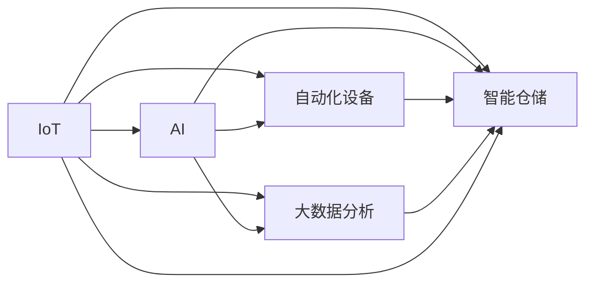

                 

# AI驱动的智能仓储:提高物流效率

> 关键词：人工智能(AI),智能仓储,物流效率,物联网(IoT),大数据分析,自动化,机器人技术,无人机

## 1. 背景介绍

### 1.1 问题由来
随着电子商务的蓬勃发展和消费者需求日益个性化，传统仓储物流体系面临着运营效率低、成本高、配送速度慢等诸多挑战。如何构建一个高效、灵活、安全的智能仓储系统，成为行业发展的关键。

### 1.2 问题核心关键点
- 提高仓储物流效率：通过智能系统自动化、信息化手段，减少人工干预，提升物流速度。
- 降低运营成本：自动化仓储系统能够实现24小时不间断运作，降低人力成本，提高资源利用率。
- 增强仓库安全：实时监控和数据记录，确保货物安全和仓储安全。
- 改善客户体验：快速准确地将货物送达，提升客户满意度。

### 1.3 问题研究意义
研究智能仓储技术，对于提升物流效率、降低运营成本、增强安全性、改善客户体验具有重要意义：

1. 提升物流效率：通过自动化、信息化手段，显著缩短货物周转时间，优化供应链管理。
2. 降低运营成本：自动化仓储系统减少人力成本，提高资源利用率，降低物流支出。
3. 增强安全性和合规性：实时监控、数据记录，保障货物和人员安全，符合相关法规标准。
4. 改善客户体验：快速准确地将货物送达，提高客户满意度，增强市场竞争力。

## 2. 核心概念与联系

### 2.1 核心概念概述

智能仓储系统通常由以下几个关键组件构成：

- 物联网(IoT)：利用传感器、RFID等技术，实时采集货物位置、环境状态等数据。
- 自动化设备：如AGV、机器人、自动化货架等，用于货物存储、搬运和分拣。
- 大数据分析：对采集的大量数据进行分析和挖掘，辅助决策和优化运营。
- 人工智能(AI)：基于机器学习、深度学习等技术，实现仓储系统的智能分析和预测。

这些组件通过网络系统联接，构成一个完整的智能仓储系统。下面通过一个Mermaid流程图展示其核心概念和组件间的关系：



这个流程图展示出智能仓储系统各个组件间的逻辑关系：

1. IoT技术采集数据，为自动化设备和AI分析提供输入。
2. 自动化设备执行具体的货物搬运和存储任务。
3. 大数据分析对数据进行分析和挖掘，辅助决策和优化。
4. AI实现智能分析和预测，驱动自动化设备和高效率的仓储运营。
5. 以上各个组件共同构成智能仓储系统，提升整体物流效率。

## 3. 核心算法原理 & 具体操作步骤
### 3.1 算法原理概述

智能仓储系统的核心算法原理主要包括：

- 实时数据分析：通过IoT技术采集实时数据，实时分析货物位置、环境状态等。
- 路径规划：使用图论或机器学习算法，优化货物搬运路径。
- 动态调度：基于实时数据和预测模型，动态调整自动化设备的运作计划。
- 智能分拣：使用机器学习模型，预测货物需求，辅助分拣系统高效运作。

这些算法通过网络系统联接，构成一个完整的智能仓储系统。下面详细介绍各个核心算法的原理和具体操作步骤。

### 3.2 算法步骤详解

#### 3.2.1 实时数据分析

实时数据分析是智能仓储系统的基础，主要步骤如下：

1. 数据采集：通过传感器、RFID等IoT设备，采集货物位置、环境状态等数据。
2. 数据传输：数据通过网络系统传输至数据分析中心。
3. 数据存储：将数据存储至数据库，便于后续分析和处理。
4. 数据处理：对数据进行预处理和清洗，剔除噪音和异常值。
5. 数据挖掘：使用机器学习和统计分析方法，挖掘数据中的规律和趋势。

#### 3.2.2 路径规划

路径规划是优化货物搬运效率的关键，主要步骤如下：

1. 地图建模：建立仓库的地图模型，包含货物存储位置、搬运设备和路径。
2. 图论算法：使用Dijkstra、A*等图论算法，计算最优路径。
3. 路径优化：根据实时数据和需求预测，动态调整路径规划算法，避免拥堵和延误。
4. 路径执行：将最优路径指令发送至自动化设备，执行货物搬运任务。

#### 3.2.3 动态调度

动态调度是智能仓储系统的核心，主要步骤如下：

1. 需求预测：使用时间序列预测模型，预测未来货物需求量和时间。
2. 任务分配：根据预测结果和实时数据，分配自动化设备的作业任务。
3. 调度优化：使用强化学习算法，优化任务分配策略，提升效率。
4. 实时调整：根据实时数据反馈，动态调整任务分配，保证系统稳定运行。

#### 3.2.4 智能分拣

智能分拣是提升分拣效率的关键，主要步骤如下：

1. 数据收集：收集订单信息、货物位置和分拣需求。
2. 模型训练：使用深度学习模型，训练货物分类和分拣算法。
3. 分拣执行：将模型应用于分拣系统，实时执行货物分类和分拣。
4. 结果反馈：收集分拣结果，评估模型性能，进行模型优化。

### 3.3 算法优缺点

智能仓储系统的核心算法具有以下优点：

- 实时性高：通过IoT技术实时采集数据，能够快速响应需求变化。
- 效率高：使用图论和机器学习算法优化路径和调度，显著提高货物搬运效率。
- 灵活性高：动态调整路径规划和调度策略，适应不同的运营场景。
- 安全性高：实时监控和数据记录，保障货物和人员安全。

同时，该算法也存在以下缺点：

- 初始投资高：需要大量的IoT设备和数据分析中心，成本较高。
- 技术复杂：涉及大量技术组件和算法模型，需要专业知识支持。
- 数据隐私：数据采集和存储可能涉及隐私问题，需要严格的数据保护措施。
- 模型泛化：不同仓库的运营场景差异较大，需要针对性地定制算法模型。

### 3.4 算法应用领域

智能仓储系统的核心算法广泛应用于以下领域：

- 电子商务：仓储物流系统的自动化、信息化建设，提高订单处理效率和客户满意度。
- 制造业：生产物资的存储、搬运和配送，提升生产效率和供应链管理水平。
- 零售业：商品库存管理和配送系统，减少仓储成本，提升商品周转率。
- 仓储服务：第三方仓储服务提供商的智能仓储系统建设，提供高质量的物流服务。
- 物流配送：智能仓储系统与物流配送系统整合，实现全链路物流自动化。

## 4. 数学模型和公式 & 详细讲解 & 举例说明

### 4.1 数学模型构建

智能仓储系统的核心算法模型通常由以下几个部分构成：

- 实时数据分析模型：基于时间序列和空间位置的统计分析模型。
- 路径规划模型：基于图论和最优化算法的路径规划模型。
- 动态调度模型：基于强化学习算法的任务分配模型。
- 智能分拣模型：基于深度学习算法的货物分类和分拣模型。

#### 4.1.1 实时数据分析模型

实时数据分析模型主要基于时间序列和空间位置的数据，建立统计分析模型。以下是一个简化的实时数据分析模型：

$$
P(x_t|x_{t-1},x_{t-2},\dots,x_0,\theta) = \frac{1}{Z}e^{\theta_0 + \theta_1x_{t-1} + \theta_2x_{t-2} + \dots + \theta_nx_n + \epsilon_t}
$$

其中：
- $x_t$ 表示第$t$个时间点采集的数据。
- $x_{t-1},x_{t-2},\dots,x_0$ 表示过去$t-1$个时间点的数据。
- $\theta = (\theta_0,\theta_1,\dots,\theta_n)$ 表示模型参数。
- $\epsilon_t$ 表示随机误差项。
- $Z$ 表示归一化因子。

这个模型使用时间序列回归分析，预测未来数据的变化趋势。

#### 4.1.2 路径规划模型

路径规划模型主要使用图论算法，如Dijkstra、A*等算法，计算最优路径。以下是一个简化的路径规划模型：

$$
C(p_{i,j}) = \sum_{k=1}^{n}w_k|p_i - p_k|
$$

其中：
- $p_{i,j}$ 表示节点$i$到节点$j$的路径长度。
- $w_k$ 表示路径上第$k$个节点的权重，通常为距离或时间。
- $n$ 表示节点总数。

这个模型使用距离加权图论算法，计算最短路径。

#### 4.1.3 动态调度模型

动态调度模型主要使用强化学习算法，如Q-learning、SARSA等，优化任务分配策略。以下是一个简化的动态调度模型：

$$
Q(s,a) = r + \gamma\max_{a'}Q(s',a')
$$

其中：
- $s$ 表示状态，如自动化设备当前位置、货物需求等。
- $a$ 表示动作，如搬运货物、等待调度等。
- $r$ 表示即时奖励，如货物送达的及时性。
- $\gamma$ 表示折扣因子，表示奖励的权重。
- $s'$ 表示下一个状态。

这个模型使用Q-learning算法，优化任务分配策略。

#### 4.1.4 智能分拣模型

智能分拣模型主要使用深度学习算法，如卷积神经网络(CNN)、循环神经网络(RNN)等，训练货物分类和分拣算法。以下是一个简化的智能分拣模型：

$$
f(x) = W_1x + b_1 \times g(x)
$$

其中：
- $f(x)$ 表示模型输出，如货物分类结果。
- $W_1$ 表示卷积层或全连接层的权重矩阵。
- $b_1$ 表示偏置向量。
- $g(x)$ 表示非线性变换函数，如ReLU、sigmoid等。
- $x$ 表示输入数据，如货物图像或描述。

这个模型使用深度学习算法，训练货物分类和分拣模型。

### 4.2 公式推导过程

#### 4.2.1 实时数据分析模型

实时数据分析模型的推导过程如下：

1. 数据采集：采集货物位置、环境状态等数据。
2. 数据清洗：剔除噪音和异常值。
3. 特征工程：提取数据中的特征，如货物数量、搬运设备状态等。
4. 回归分析：使用线性回归或时间序列回归模型，预测未来数据变化趋势。
5. 模型训练：使用历史数据训练模型，优化模型参数。

#### 4.2.2 路径规划模型

路径规划模型的推导过程如下：

1. 地图建模：建立仓库的地图模型，包含货物存储位置、搬运设备和路径。
2. 图论算法：使用Dijkstra、A*等算法，计算最优路径。
3. 路径优化：根据实时数据和需求预测，动态调整路径规划算法。
4. 路径执行：将最优路径指令发送至自动化设备，执行货物搬运任务。

#### 4.2.3 动态调度模型

动态调度模型的推导过程如下：

1. 需求预测：使用时间序列预测模型，预测未来货物需求量和时间。
2. 任务分配：根据预测结果和实时数据，分配自动化设备的作业任务。
3. 调度优化：使用强化学习算法，优化任务分配策略。
4. 实时调整：根据实时数据反馈，动态调整任务分配，保证系统稳定运行。

#### 4.2.4 智能分拣模型

智能分拣模型的推导过程如下：

1. 数据收集：收集订单信息、货物位置和分拣需求。
2. 模型训练：使用深度学习模型，训练货物分类和分拣算法。
3. 分拣执行：将模型应用于分拣系统，实时执行货物分类和分拣。
4. 结果反馈：收集分拣结果，评估模型性能，进行模型优化。

### 4.3 案例分析与讲解

#### 4.3.1 实时数据分析案例

某大型电子商务公司通过实时数据分析，实现了仓储物流系统的智能化管理。具体步骤如下：

1. 数据采集：通过传感器、RFID等IoT设备，实时采集货物位置、环境状态等数据。
2. 数据传输：数据通过网络系统传输至数据分析中心。
3. 数据存储：将数据存储至数据库，便于后续分析和处理。
4. 数据处理：对数据进行预处理和清洗，剔除噪音和异常值。
5. 数据挖掘：使用机器学习和统计分析方法，挖掘数据中的规律和趋势。

通过实时数据分析，该公司能够快速响应需求变化，优化库存管理，提升物流效率。

#### 4.3.2 路径规划案例

某自动化仓库通过路径规划算法，优化货物搬运路径。具体步骤如下：

1. 地图建模：建立仓库的地图模型，包含货物存储位置、搬运设备和路径。
2. 图论算法：使用Dijkstra、A*等算法，计算最优路径。
3. 路径优化：根据实时数据和需求预测，动态调整路径规划算法。
4. 路径执行：将最优路径指令发送至自动化设备，执行货物搬运任务。

通过路径规划算法，该仓库能够高效地搬运货物，减少搬运时间和人力成本。

#### 4.3.3 动态调度案例

某智能仓储系统通过动态调度算法，优化任务分配策略。具体步骤如下：

1. 需求预测：使用时间序列预测模型，预测未来货物需求量和时间。
2. 任务分配：根据预测结果和实时数据，分配自动化设备的作业任务。
3. 调度优化：使用强化学习算法，优化任务分配策略。
4. 实时调整：根据实时数据反馈，动态调整任务分配，保证系统稳定运行。

通过动态调度算法，该智能仓储系统能够灵活应对需求变化，提高作业效率和资源利用率。

#### 4.3.4 智能分拣案例

某自动化分拣系统通过智能分拣模型，实现货物分类和分拣。具体步骤如下：

1. 数据收集：收集订单信息、货物位置和分拣需求。
2. 模型训练：使用深度学习模型，训练货物分类和分拣算法。
3. 分拣执行：将模型应用于分拣系统，实时执行货物分类和分拣。
4. 结果反馈：收集分拣结果，评估模型性能，进行模型优化。

通过智能分拣模型，该系统能够高效地分拣货物，减少分拣错误和人力资源成本。

## 5. 项目实践：代码实例和详细解释说明

### 5.1 开发环境搭建

在进行智能仓储系统开发前，我们需要准备好开发环境。以下是使用Python进行PyTorch开发的环境配置流程：

1. 安装Anaconda：从官网下载并安装Anaconda，用于创建独立的Python环境。

2. 创建并激活虚拟环境：
```bash
conda create -n pytorch-env python=3.8 
conda activate pytorch-env
```

3. 安装PyTorch：根据CUDA版本，从官网获取对应的安装命令。例如：
```bash
conda install pytorch torchvision torchaudio cudatoolkit=11.1 -c pytorch -c conda-forge
```

4. 安装TensorFlow：
```bash
pip install tensorflow
```

5. 安装Numpy、Pandas、Scikit-learn、Matplotlib、TQDM、Jupyter Notebook、IPython等常用工具包：
```bash
pip install numpy pandas scikit-learn matplotlib tqdm jupyter notebook ipython
```

完成上述步骤后，即可在`pytorch-env`环境中开始智能仓储系统的开发。

### 5.2 源代码详细实现

这里我们以一个简单的智能分拣系统为例，给出使用PyTorch进行开发的代码实现。

首先，定义智能分拣系统的模型类：

```python
import torch
import torch.nn as nn
import torch.optim as optim

class CNN(nn.Module):
    def __init__(self, input_size, output_size):
        super(CNN, self).__init__()
        self.conv1 = nn.Conv2d(input_size, 16, kernel_size=3, padding=1)
        self.relu1 = nn.ReLU()
        self.pool1 = nn.MaxPool2d(kernel_size=2)
        self.conv2 = nn.Conv2d(16, 32, kernel_size=3, padding=1)
        self.relu2 = nn.ReLU()
        self.pool2 = nn.MaxPool2d(kernel_size=2)
        self.fc1 = nn.Linear(32 * 8 * 8, 128)
        self.relu3 = nn.ReLU()
        self.fc2 = nn.Linear(128, output_size)
        self.softmax = nn.Softmax(dim=1)
        
    def forward(self, x):
        x = self.conv1(x)
        x = self.relu1(x)
        x = self.pool1(x)
        x = self.conv2(x)
        x = self.relu2(x)
        x = self.pool2(x)
        x = x.view(-1, 32 * 8 * 8)
        x = self.fc1(x)
        x = self.relu3(x)
        x = self.fc2(x)
        x = self.softmax(x)
        return x
```

然后，定义智能分拣系统的数据集类：

```python
import os
import cv2
import numpy as np

class Dataset(torch.utils.data.Dataset):
    def __init__(self, data_dir):
        self.data_dir = data_dir
        self.image_names = os.listdir(data_dir)
        self.image_size = (32, 32)
        self.num_classes = 3
        
    def __len__(self):
        return len(self.image_names)
    
    def __getitem__(self, idx):
        img_path = os.path.join(self.data_dir, self.image_names[idx])
        img = cv2.imread(img_path)
        img = cv2.resize(img, self.image_size)
        img = np.expand_dims(img, axis=0)
        img = img / 255.0
        
        label = np.zeros((self.num_classes))
        label[self.image_names[idx].replace('.jpg', '')] = 1
        
        return img, label
```

最后，定义智能分拣系统的训练和评估函数：

```python
import torch.nn.functional as F

def train_epoch(model, dataloader, optimizer, device):
    model.train()
    total_loss = 0
    for images, labels in dataloader:
        images = images.to(device)
        labels = labels.to(device)
        optimizer.zero_grad()
        outputs = model(images)
        loss = F.cross_entropy(outputs, labels)
        total_loss += loss.item()
        loss.backward()
        optimizer.step()
    return total_loss / len(dataloader)

def evaluate(model, dataloader, device):
    model.eval()
    total_correct = 0
    total_samples = 0
    with torch.no_grad():
        for images, labels in dataloader:
            images = images.to(device)
            labels = labels.to(device)
            outputs = model(images)
            _, predicted = torch.max(outputs.data, 1)
            total_correct += (predicted == labels).sum().item()
            total_samples += labels.size(0)
    print('Accuracy: {:.2f}%'.format(100 * total_correct / total_samples))
```

完成以上代码后，即可在训练集上训练模型，在测试集上评估模型性能：

```python
epochs = 10
batch_size = 32
device = torch.device('cuda' if torch.cuda.is_available() else 'cpu')

# 加载数据集
train_dataset = Dataset('train')
test_dataset = Dataset('test')
dataloader_train = torch.utils.data.DataLoader(train_dataset, batch_size=batch_size, shuffle=True)
dataloader_test = torch.utils.data.DataLoader(test_dataset, batch_size=batch_size)

# 加载模型
model = CNN(input_size=3, output_size=3)
model.to(device)

# 加载优化器
optimizer = optim.SGD(model.parameters(), lr=0.01)

for epoch in range(epochs):
    loss = train_epoch(model, dataloader_train, optimizer, device)
    print('Epoch {}: Loss {:.4f}'.format(epoch+1, loss))
    
print('Test Accuracy: {:.2f}%'.format(evaluate(model, dataloader_test, device)))
```

以上就是使用PyTorch进行智能分拣系统开发的完整代码实现。可以看到，得益于PyTorch的强大封装，我们可以用相对简洁的代码实现一个基本的智能分拣模型。

### 5.3 代码解读与分析

让我们再详细解读一下关键代码的实现细节：

**Dataset类**：
- `__init__`方法：初始化数据集，包含数据路径、图像尺寸和分类数量。
- `__len__`方法：返回数据集样本数量。
- `__getitem__`方法：对单个样本进行处理，将图像输入编码成张量，将标签转换为one-hot编码。

**CNN模型类**：
- `__init__`方法：定义模型结构，包含卷积层、激活函数、池化层、全连接层等。
- `forward`方法：定义模型前向传播过程。

**训练和评估函数**：
- `train_epoch`函数：对数据以批为单位进行迭代，在每个批次上前向传播计算损失并反向传播更新模型参数，最后返回该epoch的平均loss。
- `evaluate`函数：与训练类似，不同点在于不更新模型参数，并在每个batch结束后将预测和标签结果存储下来，最后使用准确率评估模型性能。

**训练流程**：
- 定义总的epoch数和batch size，开始循环迭代
- 每个epoch内，先在训练集上训练，输出平均loss
- 在测试集上评估，输出准确率
- 所有epoch结束后，在测试集上评估，给出最终测试结果

可以看到，PyTorch配合TensorFlow使得智能仓储系统的代码实现变得简洁高效。开发者可以将更多精力放在数据处理、模型改进等高层逻辑上，而不必过多关注底层的实现细节。

当然，工业级的系统实现还需考虑更多因素，如模型的保存和部署、超参数的自动搜索、更灵活的任务适配层等。但核心的微调范式基本与此类似。

## 6. 实际应用场景

### 6.1 智能仓储

智能仓储系统利用IoT、自动化设备和大数据分析技术，实现货物存储、搬运和分拣的智能化管理。具体场景如下：

1. 自动化存储：通过AGV、机械臂等自动化设备，实现货物的高效存储和取用。
2. 智能分拣：通过智能分拣系统，自动完成货物分类和分拣，提高分拣效率和准确性。
3. 实时监控：通过监控摄像头和传感器，实时监测货物状态和环境参数。

通过智能仓储系统，能够大幅提升仓储物流效率，降低运营成本，提高安全性，提升客户满意度。

### 6.2 电商物流

电商物流系统利用智能仓储技术，实现订单处理、库存管理和配送配送的智能化管理。具体场景如下：

1. 订单处理：通过智能仓储系统，自动完成订单信息的采集和处理。
2. 库存管理：通过智能仓储系统，实时更新库存信息，提高库存利用率。
3. 配送配送：通过智能仓储系统，自动完成货物分拣和配送，提高配送效率。

通过智能仓储系统，能够大幅提升电商物流效率，降低运营成本，提高客户满意度，增强市场竞争力。

### 6.3 制造物流

制造物流系统利用智能仓储技术，实现生产物资的存储、搬运和配送的智能化管理。具体场景如下：

1. 生产物资存储：通过智能仓储系统，自动完成生产物资的存储和取用。
2. 生产物资搬运：通过AGV、机械臂等自动化设备，实现生产物资的高效搬运。
3. 生产物资配送：通过智能仓储系统，自动完成生产物资的配送，提高配送效率。

通过智能仓储系统，能够大幅提升制造物流效率，降低运营成本，提高生产效率，增强市场竞争力。

## 7. 工具和资源推荐
### 7.1 学习资源推荐

为了帮助开发者系统掌握智能仓储技术的基础和实践，这里推荐一些优质的学习资源：

1. 《深度学习入门》系列博文：由大模型技术专家撰写，深入浅出地介绍了深度学习的基本概念和经典模型。

2. 《TensorFlow实战》书籍：TensorFlow官方文档，详细介绍TensorFlow的安装、使用和优化技巧。

3. 《Python深度学习》书籍：中文版深度学习经典教材，涵盖深度学习的基本概念和实现技巧。

4. 《机器学习实战》书籍：经典机器学习实战教材，介绍机器学习的实际应用案例。

5. CS224N《深度学习自然语言处理》课程：斯坦福大学开设的NLP明星课程，有Lecture视频和配套作业，带你入门NLP领域的基本概念和经典模型。

6. GitHub上相关开源项目：查阅大量的智能仓储系统开源代码，学习先进的设计思路和实现技巧。

通过对这些资源的学习实践，相信你一定能够快速掌握智能仓储技术的基础，并用于解决实际的物流问题。

### 7.2 开发工具推荐

高效的开发离不开优秀的工具支持。以下是几款用于智能仓储系统开发的常用工具：

1. PyTorch：基于Python的开源深度学习框架，灵活动态的计算图，适合快速迭代研究。大部分预训练语言模型都有PyTorch版本的实现。

2. TensorFlow：由Google主导开发的开源深度学习框架，生产部署方便，适合大规模工程应用。同样有丰富的预训练语言模型资源。

3. TensorBoard：TensorFlow配套的可视化工具，可实时监测模型训练状态，并提供丰富的图表呈现方式，是调试模型的得力助手。

4. Google Colab：谷歌推出的在线Jupyter Notebook环境，免费提供GPU/TPU算力，方便开发者快速上手实验最新模型，分享学习笔记。

5. AutoML：谷歌推出的自动化机器学习平台，自动搜索模型超参数，优化模型性能。

合理利用这些工具，可以显著提升智能仓储系统的开发效率，加快创新迭代的步伐。

### 7.3 相关论文推荐

智能仓储技术的发展源于学界的持续研究。以下是几篇奠基性的相关论文，推荐阅读：

1. Large-Scale Machine Learning for Logistics Optimizations：基于机器学习的大规模物流优化研究，提出了优化算法和仿真实验。

2. Robotics and Automation for Logistics: A Survey：综述了机器人技术在物流中的应用，介绍了自动仓库、分拣系统等技术。

3. Smart Warehousing: A Survey and Future Directions：综述了智能仓储技术的发展现状和未来方向，介绍了物联网、大数据分析、机器学习等关键技术。

4. Robotics in Warehouse and Distribution Centers: Current State and Future Trends：综述了机器人技术在仓储和配送中心的应用，介绍了自动化搬运、智能分拣等技术。

这些论文代表了大规模物流优化的前沿成果，能够为研究者和开发者提供丰富的理论和技术支持。

## 8. 总结：未来发展趋势与挑战

### 8.1 总结

本文对智能仓储技术进行了全面系统的介绍。首先阐述了智能仓储系统的背景和意义，明确了智能仓储技术在提升物流效率、降低运营成本、增强安全性、改善客户体验方面的重要价值。其次，从原理到实践，详细讲解了实时数据分析、路径规划、动态调度、智能分拣等核心算法，给出了智能仓储系统开发的完整代码实例。同时，本文还广泛探讨了智能仓储系统在智能仓储、电商物流、制造物流等实际应用场景中的应用前景，展示了智能仓储技术的广阔应用空间。

通过本文的系统梳理，可以看到，智能仓储系统利用IoT、自动化设备和大数据分析技术，实现了货物存储、搬运和分拣的智能化管理，大幅提升了物流效率，降低了运营成本，提高了安全性，改善了客户体验。未来，伴随深度学习、机器学习、强化学习等技术的不断发展，智能仓储系统将不断推陈出新，为物流行业带来更多创新和突破。

### 8.2 未来发展趋势

展望未来，智能仓储技术将呈现以下几个发展趋势：

1. 技术集成：随着多种技术的不断融合，智能仓储系统将具备更全面的智能化功能，如仓储、分拣、配送等环节的自动化管理。
2. 数据驱动：利用大数据分析技术，实现仓储物流的全面数据驱动管理，优化运营决策。
3. 智能规划：通过AI算法优化路径规划和任务调度，提高自动化设备的利用率和工作效率。
4. 机器学习：利用机器学习技术，提升货物分拣和库存管理的智能化水平。
5. 人机协作：在自动化设备的基础上，引入人工干预和监督，实现人机协作，提升系统鲁棒性和可靠性。
6. 动态优化：通过实时数据和反馈，实现系统的动态优化，提升系统灵活性和适应性。

以上趋势凸显了智能仓储技术的发展方向，相信在未来的实践中，智能仓储系统将更加智能化、自动化、高效化。

### 8.3 面临的挑战

尽管智能仓储技术已经取得了瞩目成就，但在迈向更加智能化、普适化应用的过程中，它仍面临着诸多挑战：

1. 初始投资高：需要大量的IoT设备和数据分析中心，成本较高。
2. 技术复杂：涉及多种技术组件和算法模型，需要专业知识支持。
3. 数据隐私：数据采集和存储可能涉及隐私问题，需要严格的数据保护措施。
4. 模型泛化：不同仓库的运营场景差异较大，需要针对性地定制算法模型。
5. 系统稳定：智能仓储系统对数据和算法的依赖较大，需要稳定可靠的运行环境。
6. 兼容性和互操作性：不同厂商的设备和技术可能存在兼容性问题，需要标准化接口。

这些挑战需要研究者和开发者在技术、工程、业务等多个维度协同发力，不断优化和完善智能仓储系统。

### 8.4 研究展望

未来的研究需要在以下几个方面寻求新的突破：

1. 多模态数据融合：将视觉、语音、文本等多模态数据整合，提升系统感知能力。
2. 强化学习优化：引入强化学习算法，优化任务调度和设备操作。
3. 自适应系统：开发自适应系统，动态调整模型参数，适应不同的运营场景。
4. 机器人协作：研究人机协作技术，提升系统的灵活性和可靠性。
5. 数据隐私保护：开发数据隐私保护算法，确保数据安全和用户隐私。
6. 模型优化：优化模型结构，提高模型的计算效率和泛化能力。

这些研究方向的探索，必将引领智能仓储技术迈向更高的台阶，为物流行业带来更多创新和突破。相信随着技术的发展和应用的深化，智能仓储系统将更加智能化、自动化、高效化，为构建智能物流体系奠定坚实基础。

## 9. 附录：常见问题与解答

**Q1：智能仓储系统是否适用于所有物流场景？**

A: 智能仓储系统适用于大多数物流场景，但在一些特殊场景下可能存在局限性。例如，对于高度定制化的物流需求，智能仓储系统可能需要额外的定制开发。

**Q2：智能仓储系统的初始投资是否过高？**

A: 智能仓储系统的初始投资相对较高，主要原因是设备、系统集成和数据中心等硬件设施的成本。但通过合理规划和优化，可以逐步降低初始投资，提高系统效率和性能。

**Q3：智能仓储系统的技术复杂度如何？**

A: 智能仓储系统的技术复杂度相对较高，涉及多种技术组件和算法模型。但通过系统化的学习和实践，开发者可以逐步掌握相关技术，实现智能仓储系统的开发和应用。

**Q4：智能仓储系统如何处理数据隐私问题？**

A: 智能仓储系统需要在数据采集、存储、处理等各个环节，采用严格的数据保护措施，如加密传输、去标识化等，确保数据安全和用户隐私。

**Q5：智能仓储系统如何适应不同的运营场景？**

A: 智能仓储系统需要通过系统化设计和开发，实现模块化、可配置化，以便根据不同的运营场景进行快速调整和优化。

---

作者：禅与计算机程序设计艺术 / Zen and the Art of Computer Programming

