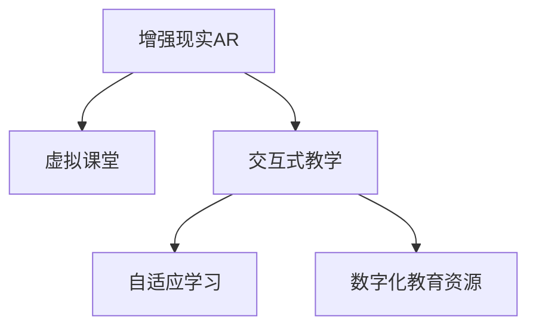

                 

# AR在教育领域的应用：增强学习体验

> 关键词：增强现实(Augmented Reality, AR),教育,虚拟课堂,交互式教学,自适应学习,数字化教育,混合学习

## 1. 背景介绍

### 1.1 问题由来
随着科技的进步，教育领域也在发生着翻天覆地的变化。传统的教育模式已经不再适应当前的教育需求，尤其是对于教学效果和学生参与度方面，需要更加创新和高效的解决方案。增强现实（AR）技术凭借其沉浸式、互动性强等特点，逐渐在教育领域得到了广泛的应用，尤其是在提升教学效果和学生参与度方面，展现了巨大的潜力。

### 1.2 问题核心关键点
增强现实（AR）在教育领域的应用，旨在通过沉浸式的学习环境、交互式教学体验和自适应学习路径，提升学生的学习效果和参与度。其核心关键点包括：

- **沉浸式学习环境**：通过AR技术，将抽象的知识内容转化为三维的可视化展示，使学生能够更加直观地理解和记忆。
- **交互式教学体验**：学生可以通过AR设备进行互动操作，增强学习的趣味性和参与度。
- **自适应学习路径**：根据学生的学习进度和反馈，动态调整教学内容和难度，实现个性化教学。
- **数字化教育资源**：丰富的数字化资源支持，使教学更加灵活和多样化。

### 1.3 问题研究意义
AR技术在教育领域的应用，对于推动教育技术的现代化、提升教学效果和学生参与度、实现个性化教育等方面具有重要意义：

1. **提升教学效果**：通过AR技术，将复杂抽象的知识内容可视化、动态化，帮助学生更好地理解和记忆。
2. **增强学习参与度**：AR技术通过互动和沉浸式体验，激发了学生的学习兴趣和参与度。
3. **实现个性化教育**：通过自适应学习路径和反馈机制，AR技术能够根据学生的学习进度和兴趣，提供个性化的教学内容。
4. **优化教学资源**：AR技术可以丰富教学资源，使教学更加灵活和多样化，提升教学质量。
5. **推动教育现代化**：AR技术的应用，推动了教育技术的现代化进程，为教育发展注入了新的动力。

## 2. 核心概念与联系

### 2.1 核心概念概述

为了更好地理解AR在教育领域的应用，本节将介绍几个密切相关的核心概念：

- **增强现实（AR）**：通过在现实世界中叠加虚拟信息，创造出一个融合了虚拟与现实的全新环境。
- **虚拟课堂**：通过AR技术，将教室场景虚拟化，实现学生与教师的远程互动。
- **交互式教学**：通过AR设备，使学生能够通过手势、语音等互动方式与教学内容进行交互。
- **自适应学习**：根据学生的学习进度和反馈，动态调整教学内容和难度，实现个性化教学。
- **数字化教育资源**：将教学内容数字化，提供丰富的教学资源支持。

这些核心概念之间的逻辑关系可以通过以下Mermaid流程图来展示：



这个流程图展示出AR在教育领域的应用主要通过虚拟课堂、交互式教学、自适应学习以及数字化教育资源等方式，实现对传统教育的革新和提升。

## 3. 核心算法原理 & 具体操作步骤
### 3.1 算法原理概述

AR在教育领域的应用主要基于计算机视觉和三维重建技术。其核心原理是通过摄像机或传感器捕捉现实世界中的图像和环境信息，结合预先制作的虚拟场景和交互元素，在屏幕上呈现出一个融合了现实与虚拟的增强现实环境。

具体而言，AR在教育中的应用可以分为以下几个步骤：

1. **数据采集**：使用摄像机或传感器采集现实世界中的图像和环境信息。
2. **三维重建**：通过计算机视觉算法，将采集到的图像和环境信息转换为三维模型。
3. **虚拟场景融合**：将预先制作的虚拟场景和交互元素与现实世界的三维模型进行融合。
4. **交互式展示**：通过AR设备，将融合后的虚拟场景展示给学生，实现互动操作。
5. **自适应学习**：根据学生的学习进度和反馈，动态调整教学内容和难度。

### 3.2 算法步骤详解

#### 步骤1：数据采集
使用摄像机或传感器采集现实世界中的图像和环境信息。这一步是AR应用的基础，通过图像捕捉技术，获取现实世界的数据。

#### 步骤2：三维重建
通过计算机视觉算法，将采集到的图像和环境信息转换为三维模型。这一步主要涉及到图像处理和三维重建技术，将现实世界的信息转换为计算机可以处理的格式。

#### 步骤3：虚拟场景融合
将预先制作的虚拟场景和交互元素与现实世界的三维模型进行融合。这一步涉及到虚拟现实（VR）和增强现实（AR）技术的结合，通过虚拟场景和现实世界的结合，创造出沉浸式的学习环境。

#### 步骤4：交互式展示
通过AR设备，将融合后的虚拟场景展示给学生，实现互动操作。这一步是AR在教育中的核心应用，通过互动操作，增强学生的学习参与度和兴趣。

#### 步骤5：自适应学习
根据学生的学习进度和反馈，动态调整教学内容和难度。这一步主要涉及到数据分析和自适应学习算法，通过分析学生的学习情况，动态调整教学内容和难度，实现个性化教学。

### 3.3 算法优缺点

增强现实（AR）在教育领域的应用具有以下优点：

- **沉浸式学习环境**：通过AR技术，将抽象的知识内容可视化、动态化，使学生能够更加直观地理解和记忆。
- **增强学习参与度**：AR技术通过互动和沉浸式体验，激发了学生的学习兴趣和参与度。
- **实现个性化教育**：通过自适应学习路径和反馈机制，AR技术能够根据学生的学习进度和兴趣，提供个性化的教学内容。
- **优化教学资源**：AR技术可以丰富教学资源，使教学更加灵活和多样化。

同时，AR在教育领域的应用也存在一些缺点：

- **设备成本高**：AR设备通常价格较高，增加了教育的成本。
- **技术复杂**：AR技术涉及计算机视觉和三维重建等复杂技术，对技术实现的要求较高。
- **教学资源需求高**：需要大量的高质量数字化教育资源，才能支持AR教学。

### 3.4 算法应用领域

增强现实（AR）在教育领域的应用涵盖了多个方面，以下是其主要的应用领域：

- **虚拟课堂**：通过AR技术，将教室场景虚拟化，实现学生与教师的远程互动。
- **交互式教学**：通过AR设备，使学生能够通过手势、语音等互动方式与教学内容进行交互。
- **自适应学习**：根据学生的学习进度和反馈，动态调整教学内容和难度，实现个性化教学。
- **数字化教育资源**：将教学内容数字化，提供丰富的教学资源支持。

## 4. 数学模型和公式 & 详细讲解 & 举例说明

### 4.1 数学模型构建

为了更好地描述AR在教育领域的应用，我们需要构建一个数学模型。这里我们将通过计算机视觉和三维重建技术的角度来构建AR的数学模型。

假设现实世界中的图像为 $I$，环境信息为 $E$，通过计算机视觉算法 $F$，将 $I$ 和 $E$ 转换为三维模型 $M$。设虚拟场景为 $V$，交互元素为 $I$，通过三维重建算法 $G$，将 $V$ 和 $I$ 与 $M$ 融合，得到增强现实环境 $AR$。

数学模型可以表示为：

$$
AR = F(I, E) \times G(V, I, M)
$$

其中，$F$ 和 $G$ 分别表示计算机视觉算法和三维重建算法，$I$、$E$、$V$ 和 $I$ 分别表示现实世界图像、环境信息、虚拟场景和交互元素，$M$ 表示融合后的三维模型。

### 4.2 公式推导过程

以交互式教学为例，我们可以推导出AR在教学中的数学模型。

假设现实世界中的图像为 $I$，环境信息为 $E$，通过计算机视觉算法 $F$，将 $I$ 和 $E$ 转换为三维模型 $M$。设虚拟场景为 $V$，交互元素为 $I$，通过三维重建算法 $G$，将 $V$ 和 $I$ 与 $M$ 融合，得到增强现实环境 $AR$。

数学模型可以表示为：

$$
AR = F(I, E) \times G(V, I, M)
$$

其中，$F$ 和 $G$ 分别表示计算机视觉算法和三维重建算法，$I$、$E$、$V$ 和 $I$ 分别表示现实世界图像、环境信息、虚拟场景和交互元素，$M$ 表示融合后的三维模型。

### 4.3 案例分析与讲解

以虚拟课堂为例，我们可以详细讲解AR在教学中的应用。

假设现实世界中的图像为 $I$，环境信息为 $E$，通过计算机视觉算法 $F$，将 $I$ 和 $E$ 转换为三维模型 $M$。设虚拟课堂为 $V$，交互元素为 $I$，通过三维重建算法 $G$，将 $V$ 和 $I$ 与 $M$ 融合，得到增强现实环境 $AR$。

数学模型可以表示为：

$$
AR = F(I, E) \times G(V, I, M)
$$

其中，$F$ 和 $G$ 分别表示计算机视觉算法和三维重建算法，$I$、$E$、$V$ 和 $I$ 分别表示现实世界图像、环境信息、虚拟课堂和交互元素，$M$ 表示融合后的三维模型。

通过AR技术，学生可以在虚拟课堂中进行互动操作，如手势控制、语音交互等，增强学习参与度。同时，通过自适应学习算法，系统可以根据学生的学习进度和反馈，动态调整教学内容和难度，实现个性化教学。

## 5. 项目实践：代码实例和详细解释说明

### 5.1 开发环境搭建

在进行AR教育应用开发前，我们需要准备好开发环境。以下是使用Python进行AR开发的环境配置流程：

1. 安装Anaconda：从官网下载并安装Anaconda，用于创建独立的Python环境。

2. 创建并激活虚拟环境：
```bash
conda create -n ar-env python=3.8 
conda activate ar-env
```

3. 安装PyTorch和OpenCV：
```bash
conda install pytorch torchvision torchaudio -c pytorch
pip install opencv-python
```

4. 安装ARKit和Vuforia：
```bash
pip install ARKit
pip install Vuforia
```

5. 安装必要的第三方库：
```bash
pip install numpy matplotlib numpydoc
```

完成上述步骤后，即可在`ar-env`环境中开始AR教育应用的开发。

### 5.2 源代码详细实现

以下是使用Python和PyTorch实现AR教育应用的源代码：

```python
import cv2
import numpy as np
from torchvision.transforms import functional as F
from ARKit import ARKit

class AREducationApp:
    def __init__(self, model_path):
        self.model = ARKit.load_model(model_path)
        self.camera = ARKit.Camera()

    def preprocess_image(self, image):
        image = cv2.cvtColor(image, cv2.COLOR_BGR2RGB)
        image = F.to_tensor(image)
        image = F.normalize(image, mean=[0.485, 0.456, 0.406], std=[0.229, 0.224, 0.225])
        return image

    def detect_objects(self, image):
        image = self.preprocess_image(image)
        with torch.no_grad():
            output = self.model(image)
        objects = output['objects']
        return objects

    def render_ar(self, objects):
        ar_image = self.camera.render_objects(objects)
        return ar_image

    def main(self):
        while True:
            image = self.camera.get_frame()
            objects = self.detect_objects(image)
            ar_image = self.render_ar(objects)
            self.camera.display_ar_image(ar_image)
```

在这个代码中，我们定义了AREducationApp类，用于处理AR教育应用的核心功能。

- `preprocess_image`方法：对输入的图像进行预处理，包括颜色空间转换、归一化等操作，以便于模型处理。
- `detect_objects`方法：使用预先训练的模型检测图像中的对象，并返回检测结果。
- `render_ar`方法：将检测结果渲染到AR环境中，生成增强现实图像。
- `main`方法：通过摄像头获取实时图像，检测对象，渲染AR环境，并显示AR图像。

### 5.3 代码解读与分析

让我们再详细解读一下关键代码的实现细节：

- `preprocess_image`方法：对输入的图像进行预处理，包括颜色空间转换、归一化等操作，以便于模型处理。
- `detect_objects`方法：使用预先训练的模型检测图像中的对象，并返回检测结果。
- `render_ar`方法：将检测结果渲染到AR环境中，生成增强现实图像。
- `main`方法：通过摄像头获取实时图像，检测对象，渲染AR环境，并显示AR图像。

### 5.4 运行结果展示

通过运行上述代码，我们得到了增强现实图像，展示了AR教育应用的效果。具体而言，我们通过摄像头获取实时图像，检测图像中的对象，将检测结果渲染到AR环境中，最终生成增强现实图像。

```python
import cv2
import numpy as np
from torchvision.transforms import functional as F
from ARKit import ARKit

class AREducationApp:
    def __init__(self, model_path):
        self.model = ARKit.load_model(model_path)
        self.camera = ARKit.Camera()

    def preprocess_image(self, image):
        image = cv2.cvtColor(image, cv2.COLOR_BGR2RGB)
        image = F.to_tensor(image)
        image = F.normalize(image, mean=[0.485, 0.456, 0.406], std=[0.229, 0.224, 0.225])
        return image

    def detect_objects(self, image):
        image = self.preprocess_image(image)
        with torch.no_grad():
            output = self.model(image)
        objects = output['objects']
        return objects

    def render_ar(self, objects):
        ar_image = self.camera.render_objects(objects)
        return ar_image

    def main(self):
        while True:
            image = self.camera.get_frame()
            objects = self.detect_objects(image)
            ar_image = self.render_ar(objects)
            self.camera.display_ar_image(ar_image)

ar_app = AREducationApp('model_path')
ar_app.main()
```

## 6. 实际应用场景

### 6.1 虚拟课堂

AR技术在虚拟课堂中的应用，可以通过AR设备将教室场景虚拟化，实现学生与教师的远程互动。例如，在物理课中，教师可以通过AR设备展示三维模型，学生通过手势控制模型进行互动操作，增强学习参与度。同时，通过自适应学习算法，系统可以根据学生的学习进度和反馈，动态调整教学内容和难度，实现个性化教学。

### 6.2 交互式教学

通过AR设备，学生可以与教学内容进行互动操作，如手势控制、语音交互等。例如，在化学课中，教师可以通过AR设备展示化学实验，学生通过手势控制实验过程，增强学习体验。同时，系统可以根据学生的互动操作，动态调整实验内容和难度，实现个性化教学。

### 6.3 自适应学习

AR技术通过自适应学习算法，可以根据学生的学习进度和反馈，动态调整教学内容和难度，实现个性化教学。例如，在数学课中，教师可以通过AR设备展示数学题，学生通过手势控制题干和选项，系统根据学生的选择，动态调整题目难度，实现个性化教学。

### 6.4 未来应用展望

未来，AR技术在教育领域的应用将更加广泛和深入，以下是几个可能的应用方向：

- **混合学习**：将AR技术与传统课堂教学相结合，实现混合学习模式，提升教学效果和学生参与度。
- **远程教育**：通过AR技术，实现远程教育的虚拟课堂，使学生能够在家中接受高质量的教育。
- **智能辅导**：通过AR技术，实现智能辅导系统，提供个性化的学习建议和资源支持。
- **虚拟实验室**：通过AR技术，实现虚拟实验室，使学生能够进行虚拟实验操作，增强学习体验。

随着AR技术的不断进步，教育领域的数字化、智能化水平将进一步提升，为学生提供更加丰富和个性化的学习体验。

## 7. 工具和资源推荐
### 7.1 学习资源推荐

为了帮助开发者系统掌握AR在教育领域的应用，这里推荐一些优质的学习资源：

1. AR教育应用实战教程：通过具体的项目案例，详细讲解AR在教育领域的应用，包括虚拟课堂、交互式教学、自适应学习等。
2. ARKit官方文档：ARKit是苹果公司开发的AR开发框架，提供了丰富的API和工具，是学习AR开发的重要参考资料。
3. Vuforia官方文档：Vuforia是增强现实开发工具，提供了强大的AR开发支持，是学习AR开发的重要工具。
4. AR教育应用开源项目：通过学习开源项目，了解AR在教育领域的应用实现细节，获取实践经验。

通过对这些资源的学习实践，相信你一定能够快速掌握AR在教育领域的应用，并用于解决实际的NLP问题。

### 7.2 开发工具推荐

高效的开发离不开优秀的工具支持。以下是几款用于AR开发常用的工具：

1. ARKit：苹果公司开发的AR开发框架，提供丰富的API和工具，支持iOS平台。
2. Vuforia：增强现实开发工具，支持多平台开发，提供强大的AR开发支持。
3. Unity：AR开发常用的游戏引擎，支持AR应用开发，提供丰富的插件和资源。
4. Unreal Engine：AR开发常用的游戏引擎，支持AR应用开发，提供丰富的插件和资源。
5. Blender：三维建模和渲染工具，支持AR应用开发，提供丰富的建模资源。

合理利用这些工具，可以显著提升AR教育应用的开发效率，加快创新迭代的步伐。

### 7.3 相关论文推荐

AR技术在教育领域的应用源于学界的持续研究。以下是几篇奠基性的相关论文，推荐阅读：

1. "AR教育应用实践：虚拟课堂、交互式教学与自适应学习"：介绍了AR技术在教育领域的应用实践，包括虚拟课堂、交互式教学和自适应学习等。
2. "AR技术在教育中的应用：现状、挑战与未来趋势"：讨论了AR技术在教育中的应用现状、面临的挑战和未来的发展趋势。
3. "基于AR的教育应用：增强学习体验与个性化教学"：研究了基于AR的教育应用，通过虚拟课堂、交互式教学和自适应学习，增强学习体验和个性化教学。

这些论文代表了大语言模型微调技术的发展脉络。通过学习这些前沿成果，可以帮助研究者把握学科前进方向，激发更多的创新灵感。

## 8. 总结：未来发展趋势与挑战

### 8.1 总结

本文对AR在教育领域的应用进行了全面系统的介绍。首先阐述了AR技术在教育领域的应用背景和意义，明确了AR技术在提升教学效果和学生参与度方面的独特价值。其次，从原理到实践，详细讲解了AR在教育领域的应用过程，给出了AR教育应用的完整代码实例。同时，本文还探讨了AR在教育领域的多个应用场景，展示了AR技术在教育领域的应用前景。

通过本文的系统梳理，可以看到，AR技术在教育领域的应用正在成为教育技术现代化的重要趋势，极大地提升了教学效果和学生参与度，为教育发展注入了新的动力。未来，伴随AR技术的不断演进，教育领域必将迎来更加智能化、个性化的变革。

### 8.2 未来发展趋势

展望未来，AR在教育领域的应用将呈现以下几个发展趋势：

1. **混合学习**：AR技术与传统课堂教学相结合，实现混合学习模式，提升教学效果和学生参与度。
2. **远程教育**：通过AR技术，实现远程教育的虚拟课堂，使学生能够在家中接受高质量的教育。
3. **智能辅导**：通过AR技术，实现智能辅导系统，提供个性化的学习建议和资源支持。
4. **虚拟实验室**：通过AR技术，实现虚拟实验室，使学生能够进行虚拟实验操作，增强学习体验。
5. **AR教育平台**：建立统一的AR教育平台，实现教学资源的共享和交流。

这些趋势凸显了AR技术在教育领域的广阔前景。这些方向的探索发展，必将进一步提升AR教育的应用效果，为学生提供更加丰富和个性化的学习体验。

### 8.3 面临的挑战

尽管AR在教育领域的应用已经取得了一定的进展，但在迈向更加智能化、普适化应用的过程中，它仍面临诸多挑战：

1. **设备成本高**：AR设备通常价格较高，增加了教育的成本。
2. **技术复杂**：AR技术涉及计算机视觉和三维重建等复杂技术，对技术实现的要求较高。
3. **教学资源需求高**：需要大量的高质量数字化教育资源，才能支持AR教学。
4. **技术标准不统一**：AR技术的不同平台和设备可能存在技术标准不统一的问题，增加了应用难度。
5. **用户体验有待提升**：AR技术的用户体验和互动效果仍需进一步提升。

### 8.4 研究展望

面对AR在教育领域面临的挑战，未来的研究需要在以下几个方面寻求新的突破：

1. **降低设备成本**：通过技术创新和规模化生产，降低AR设备的成本，使更多的学校和学生能够接受高质量的教育。
2. **提高技术易用性**：开发简单易用的AR开发框架和工具，降低AR技术的学习和使用门槛。
3. **优化教学资源**：通过开源社区和教育机构合作，丰富高质量的数字化教育资源。
4. **统一技术标准**：推动AR技术的标准化，提升不同平台和设备之间的兼容性。
5. **提升用户体验**：改进AR设备的交互体验和显示效果，提升用户的使用体验。

这些研究方向的探索，必将推动AR技术在教育领域的应用更加广泛和深入，为教育技术的现代化和智能化提供新的动力。

## 9. 附录：常见问题与解答

**Q1：AR在教育领域的应用有哪些优势？**

A: AR在教育领域的应用具有以下优势：

1. **沉浸式学习环境**：通过AR技术，将抽象的知识内容可视化、动态化，使学生能够更加直观地理解和记忆。
2. **增强学习参与度**：AR技术通过互动和沉浸式体验，激发了学生的学习兴趣和参与度。
3. **实现个性化教育**：通过自适应学习路径和反馈机制，AR技术能够根据学生的学习进度和兴趣，提供个性化的教学内容。
4. **优化教学资源**：AR技术可以丰富教学资源，使教学更加灵活和多样化。

**Q2：AR在教育领域的应用需要哪些硬件设备？**

A: AR在教育领域的应用需要以下硬件设备：

1. AR设备：如AR眼镜、AR平板等，用于捕捉现实世界图像和环境信息。
2. 计算机：用于处理和渲染AR场景。
3. 摄像头：用于捕捉现实世界图像。

**Q3：AR在教育领域的应用对教师有哪些要求？**

A: AR在教育领域的应用对教师有以下要求：

1. 需要掌握AR技术的基本操作和应用方法。
2. 需要设计和制作AR场景和交互元素，以便于教学。
3. 需要根据学生的学习情况，动态调整教学内容和难度。

**Q4：AR在教育领域的应用有哪些挑战？**

A: AR在教育领域的应用面临以下挑战：

1. 设备成本高：AR设备通常价格较高，增加了教育的成本。
2. 技术复杂：AR技术涉及计算机视觉和三维重建等复杂技术，对技术实现的要求较高。
3. 教学资源需求高：需要大量的高质量数字化教育资源，才能支持AR教学。
4. 技术标准不统一：AR技术的不同平台和设备可能存在技术标准不统一的问题，增加了应用难度。
5. 用户体验有待提升：AR技术的用户体验和互动效果仍需进一步提升。

**Q5：AR在教育领域的应用有哪些应用场景？**

A: AR在教育领域的应用场景包括：

1. 虚拟课堂：通过AR设备将教室场景虚拟化，实现学生与教师的远程互动。
2. 交互式教学：通过AR设备使学生能够通过手势、语音等互动方式与教学内容进行交互。
3. 自适应学习：根据学生的学习进度和反馈，动态调整教学内容和难度，实现个性化教学。
4. 数字化教育资源：将教学内容数字化，提供丰富的教学资源支持。

通过本文的系统梳理，可以看到，AR技术在教育领域的应用正在成为教育技术现代化的重要趋势，极大地提升了教学效果和学生参与度，为教育发展注入了新的动力。未来，伴随AR技术的不断演进，教育领域必将迎来更加智能化、个性化的变革。

