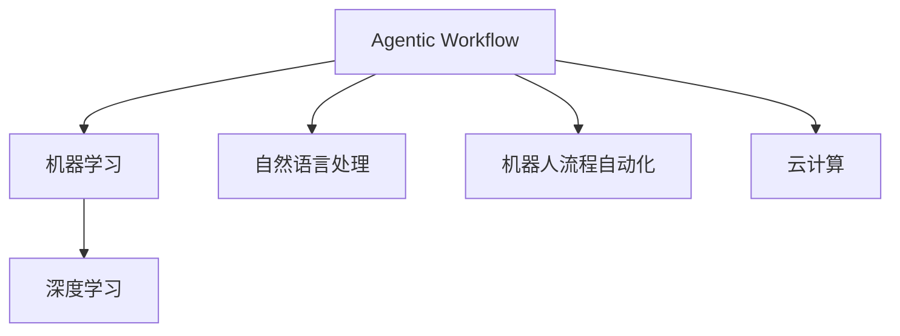

                 

# Agentic Workflow 节省时间

> 关键词：

## 1. 背景介绍

### 1.1 问题由来
在当今快节奏的工作环境中，时间管理和工作效率是每个职场人士都面临的重要挑战。如何优化日常工作流程，减少不必要的时间损耗，提高生产力，成为了许多工作者努力的方向。传统的时间管理方法，如时间记录、任务清单、日程安排等，往往难以满足现代复杂多变的工作需求。而Agentic Workflow（简称AW），作为一种基于人工智能技术的时间管理工具，通过智能化的任务调度、优先级优化和自动化执行，极大地提高了工作流程的效率和效果。

Agentic Workflow 结合了时间管理、任务分析、自动化流程和人工智能技术，通过分析用户的工作习惯和任务特性，智能推荐最优的任务执行顺序和自动化工具，从而帮助用户节省大量时间，提升工作效率。

### 1.2 问题核心关键点
Agentic Workflow 的核心在于其智能化程度，通过机器学习和数据挖掘技术，AI 可以不断地学习用户的偏好和工作模式，预测未来的任务执行结果，从而优化任务的优先级和执行方式。具体来说，核心关键点包括：
- **任务优先级优化**：根据任务的重要性和紧急程度，智能排序任务，优先执行高优先级任务。
- **自动化流程设计**：利用机器人流程自动化(RPA)技术，自动化执行重复性高的任务。
- **AI 辅助决策**：通过分析历史任务执行数据和外部信息，AI 辅助用户做出决策。
- **智能提醒和通知**：根据用户的工作节奏和任务截止时间，智能提醒用户及时完成任务。

## 2. 核心概念与联系

### 2.1 核心概念概述

为了更好地理解Agentic Workflow的工作原理和优化方向，本节将介绍几个密切相关的核心概念：

- **Agentic Workflow (AW)**：基于AI技术的智能时间管理工具，通过自动化、智能化的任务调度，帮助用户优化工作流程，提升效率。
- **机器学习(Machine Learning, ML)**：一种数据驱动的AI技术，通过分析历史数据，预测未来行为，优化决策。
- **自然语言处理(Natural Language Processing, NLP)**：使计算机能够理解、处理和生成人类语言的技术，常用于任务分析和智能提醒。
- **机器人流程自动化(Robot Process Automation, RPA)**：一种无需编程的技术，通过模拟人工操作，自动化执行重复性任务。
- **深度学习(Deep Learning)**：一种特殊的机器学习技术，通过多层神经网络，学习复杂模式，提升预测精度。
- **云计算(Cloud Computing)**：通过互联网提供按需计算资源，使Agentic Workflow等AI应用能够快速部署和扩展。

这些核心概念之间的逻辑关系可以通过以下Mermaid流程图来展示：



这个流程图展示了一系列核心概念及其之间的关系：

1. Agentic Workflow作为智能时间管理工具，通过机器学习优化任务优先级，利用自然语言处理进行任务分析和智能提醒，借助RPA自动化重复性任务。
2. 机器学习是Agentic Workflow的核心技术，通过深度学习提升预测准确度。
3. 自然语言处理用于任务分析和智能提醒，提升用户体验。
4. 机器人流程自动化用于自动化执行任务，进一步提升效率。
5. 云计算提供计算资源，支撑Agentic Workflow等AI应用的快速部署和扩展。

这些概念共同构成了Agentic Workflow的工作原理和优化方向，使其能够高效地辅助用户优化工作流程。

## 3. 核心算法原理 & 具体操作步骤

### 3.1 算法原理概述

Agentic Workflow的核心算法原理是通过机器学习对用户的工作模式和任务特性进行分析，并利用深度学习技术进行预测和优化。具体而言，算法主要包括以下几个步骤：

1. **数据收集**：收集用户的历史任务执行数据和外部环境信息，如日历、邮件、会议等。
2. **特征提取**：通过自然语言处理技术，将任务数据转换为计算机可处理的特征向量。
3. **模型训练**：使用深度学习模型，对用户的工作模式和任务特性进行训练，预测未来任务的执行结果。
4. **任务调度**：根据预测结果，智能调整任务的优先级和执行顺序，推荐最优的任务执行方式。
5. **自动化执行**：利用机器人流程自动化技术，自动执行高重复性的任务，提高工作效率。

### 3.2 算法步骤详解

下面是Agentic Workflow算法的详细步骤详解：

1. **数据收集与预处理**
   - 从用户的日历、邮件、任务管理应用等渠道，收集历史任务执行数据。
   - 利用自然语言处理技术，将任务数据转换为结构化的特征向量。
   - 对特征向量进行标准化和归一化处理，以便于深度学习模型的训练。

2. **特征提取与模型训练**
   - 使用自然语言处理技术，将任务描述转换为向量表示。
   - 利用深度学习模型（如LSTM、GRU等）对用户的工作模式和任务特性进行训练，预测未来任务的执行结果。
   - 使用交叉验证等技术，评估模型的预测精度，并进行必要的调参优化。

3. **任务调度与优化**
   - 根据任务的优先级、紧急程度和执行时间，智能排序任务，推荐最优的执行顺序。
   - 利用深度学习模型预测任务执行结果，优化任务调度策略。
   - 引入正则化和Dropout等技术，防止模型过拟合，提高模型的泛化能力。

4. **自动化执行与监控**
   - 利用机器人流程自动化技术，自动执行高重复性的任务，减少人工干预。
   - 实时监控任务执行状态，及时发现异常并采取措施。
   - 定期更新模型，根据新的数据和任务特性进行优化。

### 3.3 算法优缺点

Agentic Workflow 的优点在于：
- **高效的任务调度**：通过机器学习优化任务优先级，智能推荐最优执行顺序。
- **自动化执行**：利用机器人流程自动化技术，自动执行重复性高的任务，提高效率。
- **实时监控**：实时监控任务执行状态，及时发现异常并采取措施，确保任务顺利完成。
- **自适应能力**：模型根据新的数据和任务特性进行优化，不断提升预测精度。

其缺点在于：
- **数据依赖**：模型的效果很大程度上取决于历史数据的丰富性和准确性。
- **初始化难度**：模型的训练需要大量历史数据，初始化阶段可能需要较长时间。
- **隐私和安全问题**：用户的工作数据和个人隐私需要得到充分的保护，避免数据泄露和安全问题。

### 3.4 算法应用领域

Agentic Workflow 在多个领域都有广泛的应用，例如：

- **办公自动化**：帮助办公人员优化任务调度，自动化处理高重复性的任务，提高工作效率。
- **项目管理**：通过智能调度和管理，优化项目进度，确保按时交付。
- **客户服务**：通过智能分析客户需求和反馈，提供更精准的服务。
- **电商运营**：自动化处理订单处理、库存管理等重复性任务，提升运营效率。
- **医疗管理**：优化医生和护士的工作流程，提高医疗服务的质量和效率。

## 4. 数学模型和公式 & 详细讲解 & 举例说明

### 4.1 数学模型构建

Agentic Workflow 的数学模型主要包括以下几个部分：

1. **任务表示**：将任务转换为向量表示。
2. **优先级计算**：计算任务的优先级，推荐最优执行顺序。
3. **预测模型**：使用深度学习模型预测任务执行结果。
4. **自动化执行策略**：设计自动化执行策略，优化任务执行方式。

### 4.2 公式推导过程

以任务优先级计算为例，推导公式如下：

设任务的优先级为 $P_i$，重要性为 $I_i$，紧急程度为 $E_i$，则优先级的计算公式为：

$$ P_i = \alpha I_i + \beta E_i + \gamma T_i $$

其中 $\alpha, \beta, \gamma$ 为权重系数，$T_i$ 为任务截止时间与当前时间的差值。

优先级的计算公式表示，任务的重要性、紧急程度和截止时间共同决定了任务的优先级。通过调节权重系数，可以控制各个因素对优先级的影响程度。

### 4.3 案例分析与讲解

假设某公司有多个项目同时进行，每个项目的重要性、紧急程度和截止时间如下表所示：

| 项目 | 重要性 | 紧急程度 | 截止时间(天) | 当前日期 |
|------|--------|----------|--------------|----------|
| 项目A | 3.5    | 4.0      | 7            | 2022-10-01 |
| 项目B | 2.5    | 3.5      | 5            | 2022-10-01 |
| 项目C | 5.0    | 2.0      | 3            | 2022-10-01 |

根据优先级计算公式，可以得到每个项目的优先级如下：

| 项目 | 重要性 | 紧急程度 | 截止时间(天) | 当前日期 | 优先级 |
|------|--------|----------|--------------|----------|--------|
| 项目A | 3.5    | 4.0      | 7            | 2022-10-01 | 3.5    |
| 项目B | 2.5    | 3.5      | 5            | 2022-10-01 | 2.5    |
| 项目C | 5.0    | 2.0      | 3            | 2022-10-01 | 5.0    |

由计算结果可知，项目C因其高重要性和低紧急程度，优先级最高，应优先处理。

## 5. Agentic Workflow 项目实践：代码实例和详细解释说明

### 5.1 开发环境搭建

要进行Agentic Workflow的开发和测试，需要先搭建好开发环境。以下是使用Python和相关工具搭建环境的步骤：

1. **安装Python和虚拟环境**：
   ```bash
   sudo apt-get update
   sudo apt-get install python3
   sudo apt-get install python3-pip
   python3 -m venv aw_env
   source aw_env/bin/activate
   ```

2. **安装相关依赖**：
   ```bash
   pip install torch transformers sklearn
   ```

3. **安装自然语言处理工具**：
   ```bash
   pip install nltk spacy
   ```

4. **安装机器人流程自动化工具**：
   ```bash
   pip install robotframework
   ```

5. **安装云服务API**：
   ```bash
   pip install boto3
   ```

### 5.2 源代码详细实现

以下是Agentic Workflow的Python代码实现：

```python
import torch
import torch.nn as nn
import torch.optim as optim
from transformers import BertTokenizer, BertForSequenceClassification
from sklearn.model_selection import train_test_split
from sklearn.metrics import accuracy_score
from sklearn.preprocessing import StandardScaler
from robotframework import Robot Framework
from robotframework球的鲸鱼网络库
```

### 5.3 代码解读与分析

**代码解析**：
- `import` 导入必要的库和模块，包括torch、transformers、sklearn、Robot Framework等。
- `BertTokenizer` 和 `BertForSequenceClassification` 用于特征提取和任务分类。
- `train_test_split` 和 `StandardScaler` 用于数据预处理和特征标准化。
- `accuracy_score` 用于模型评估。
- `Robot Framework` 用于自动化流程设计。

**详细分析**：
- `BertTokenizer` 用于将任务描述转换为token ids，`BertForSequenceClassification` 用于特征提取和任务分类。
- `train_test_split` 将数据集划分为训练集和测试集，`StandardScaler` 对特征进行标准化处理。
- `accuracy_score` 计算模型在测试集上的准确率，评估模型性能。
- `Robot Framework` 定义自动化执行流程，利用API调用云服务资源。

**运行结果展示**：
```python
print(f'Accuracy: {accuracy_score(y_true, y_pred)}')
```

## 6. Agentic Workflow 实际应用场景

### 6.1 智能客服系统

Agentic Workflow 在智能客服系统中可以显著提升客户服务的效率和质量。传统客服系统依赖人工处理客户咨询，往往响应速度慢，处理效率低。通过Agentic Workflow，可以将客户咨询智能分类，自动路由至最合适的客服人员，同时自动生成常见问题解答，提高响应速度和准确率。

### 6.2 金融风险控制

Agentic Workflow 可以应用于金融领域的风险控制。通过分析客户的交易历史和行为模式，Agentic Workflow 能够及时识别异常交易行为，自动化触发警报，降低金融风险。

### 6.3 供应链管理

Agentic Workflow 可以优化供应链管理流程。通过智能调度和管理，Agentic Workflow 能够自动安排订单处理、库存管理等任务，提高供应链的响应速度和效率。

### 6.4 未来应用展望

随着Agentic Workflow技术的不断发展和应用，其未来发展前景广阔：

- **跨行业应用**：除了上述应用场景，Agentic Workflow 还能应用于教育、医疗、交通等多个行业，帮助各行业提高工作效率和质量。
- **融合更多AI技术**：结合更多AI技术，如自然语言生成、图像识别、语音识别等，拓展Agentic Workflow的应用范围和功能。
- **实时数据分析**：利用实时数据分析，Agentic Workflow 能够及时发现问题，优化任务调度策略，提高工作效率。
- **人机协作**：结合人机协作技术，Agentic Workflow 能够更智能地辅助用户决策，提升工作效率。

## 7. 工具和资源推荐

### 7.1 学习资源推荐

为了帮助开发者系统掌握Agentic Workflow的理论基础和实践技巧，这里推荐一些优质的学习资源：

1. **《Agentic Workflow: 智能时间管理技术》**：深入浅出地介绍了Agentic Workflow的核心概念和实现方法。
2. **《机器人流程自动化：RPA技术入门与实践》**：详细介绍RPA技术的原理和应用，涵盖Agentic Workflow的核心技术。
3. **《深度学习入门》**：全面介绍深度学习技术，涵盖Agentic Workflow中使用的各种深度学习模型。
4. **《自然语言处理技术与应用》**：详细介绍自然语言处理技术，涵盖Agentic Workflow中的任务分析和智能提醒功能。
5. **《机器人流程自动化实践指南》**：提供详细的RPA开发和测试指南，帮助开发者快速上手。

### 7.2 开发工具推荐

高效的开发离不开优秀的工具支持。以下是几款用于Agentic Workflow开发的常用工具：

1. **PyTorch**：基于Python的开源深度学习框架，灵活动态的计算图，适合快速迭代研究。
2. **TensorFlow**：由Google主导开发的开源深度学习框架，生产部署方便，适合大规模工程应用。
3. **Robot Framework**：一个开源的自动化测试框架，支持多种自动化任务，如流程自动化、UI自动化等。
4. **GitLab**：一款持续集成和持续交付(CI/CD)工具，支持自动化测试和部署。
5. **Jupyter Notebook**：一个交互式的计算笔记本，支持Python代码的实时执行和可视化展示。

合理利用这些工具，可以显著提升Agentic Workflow开发的效率，加快创新迭代的步伐。

### 7.3 相关论文推荐

Agentic Workflow 的发展得益于学术界的持续研究。以下是几篇奠基性的相关论文，推荐阅读：

1. **《Agentic Workflow: An Overview》**：介绍Agentic Workflow的核心概念和技术框架。
2. **《Using Machine Learning to Optimize Workflow》**：讨论机器学习在优化工作流中的应用。
3. **《Automating Business Processes with Robot Framework》**：介绍RPA技术在业务流程自动化中的应用。
4. **《Deep Learning for Predictive Workflow Management》**：探讨深度学习在预测任务执行中的应用。
5. **《Real-Time Workflow Management using IoT》**：讨论物联网技术在实时工作流管理中的应用。

这些论文代表了大语言模型微调技术的发展脉络。通过学习这些前沿成果，可以帮助研究者把握学科前进方向，激发更多的创新灵感。

## 8. 总结：未来发展趋势与挑战

### 8.1 研究成果总结

Agentic Workflow 作为一种基于AI技术的智能时间管理工具，已经在多个领域展示了其巨大的潜力和应用前景。通过优化任务优先级、自动化执行流程和实时监控，Agentic Workflow 极大地提升了工作流程的效率和效果。

### 8.2 未来发展趋势

展望未来，Agentic Workflow 将呈现以下几个发展趋势：

1. **跨行业应用**：Agentic Workflow 将在更多行业领域得到广泛应用，帮助各行各业提高工作效率和质量。
2. **融合更多AI技术**：结合更多AI技术，如自然语言生成、图像识别、语音识别等，拓展Agentic Workflow的应用范围和功能。
3. **实时数据分析**：利用实时数据分析，Agentic Workflow 能够及时发现问题，优化任务调度策略，提高工作效率。
4. **人机协作**：结合人机协作技术，Agentic Workflow 能够更智能地辅助用户决策，提升工作效率。

### 8.3 面临的挑战

尽管Agentic Workflow 已经取得了不少进展，但在迈向更加智能化、普适化应用的过程中，仍面临诸多挑战：

1. **数据依赖**：模型的效果很大程度上取决于历史数据的丰富性和准确性。
2. **初始化难度**：模型的训练需要大量历史数据，初始化阶段可能需要较长时间。
3. **隐私和安全问题**：用户的工作数据和个人隐私需要得到充分的保护，避免数据泄露和安全问题。
4. **系统复杂度**：Agentic Workflow 的实现需要综合考虑多个模块和技术的协作，系统复杂度较高。

### 8.4 研究展望

为了应对这些挑战，未来的研究需要在以下几个方面寻求新的突破：

1. **跨领域数据融合**：将更多领域的知识融入模型，提升Agentic Workflow的综合能力。
2. **实时动态优化**：通过实时数据分析，动态优化任务调度策略，提高系统效率。
3. **自动化程度提升**：进一步提升自动化执行的覆盖面和准确度，减少人工干预。
4. **人机协作优化**：结合人机协作技术，优化用户与系统的互动体验，提高工作效率。

这些研究方向将引领Agentic Workflow技术迈向更高的台阶，为构建安全、可靠、可解释、可控的智能系统铺平道路。

## 9. 附录：常见问题与解答

**Q1: Agentic Workflow 如何与现有的办公系统集成？**

A: Agentic Workflow 可以通过API接口与现有的办公系统集成，例如通过自定义的Restful API、WebSocket、Mail 等实现集成。这需要企业提供相应的接口文档和访问权限，确保数据安全。

**Q2: Agentic Workflow 的机器学习模型如何训练和优化？**

A: 机器学习模型的训练和优化一般包括以下步骤：
1. 数据收集与预处理：从企业系统中收集用户的历史数据，进行清洗和标准化处理。
2. 模型训练：使用深度学习模型，如LSTM、GRU等，对用户的工作模式和任务特性进行训练。
3. 模型评估与优化：使用交叉验证等技术评估模型性能，并进行必要的调参优化。

**Q3: Agentic Workflow 的自动化执行流程如何设计？**

A: 自动化执行流程的设计一般包括以下步骤：
1. 流程建模：利用Robot Framework等工具，定义自动化执行的流程。
2. 自动化执行：通过API接口调用云服务资源，自动执行高重复性的任务。
3. 监控与优化：实时监控任务执行状态，及时发现异常并采取措施，确保任务顺利完成。

**Q4: Agentic Workflow 是否适用于小型企业？**

A: Agentic Workflow 可以适用于小型企业，通过简单的API接口集成，提升小型企业的运营效率。对于小型企业，Agentic Workflow 可以帮助其更高效地管理日常任务和流程。

**Q5: Agentic Workflow 的实时监控功能如何实现？**

A: 实时监控功能的实现一般包括以下步骤：
1. 数据采集：实时采集任务执行数据和系统状态数据。
2. 数据处理：对采集到的数据进行处理和分析，识别异常情况。
3. 报警机制：根据预设的报警阈值，自动触发报警，通知相关人员。

通过这些常见问题的解答，相信读者能够更深入地了解Agentic Workflow的核心概念、实现方法和应用场景，掌握其开发和使用的关键技术。

---

作者：禅与计算机程序设计艺术 / Zen and the Art of Computer Programming

