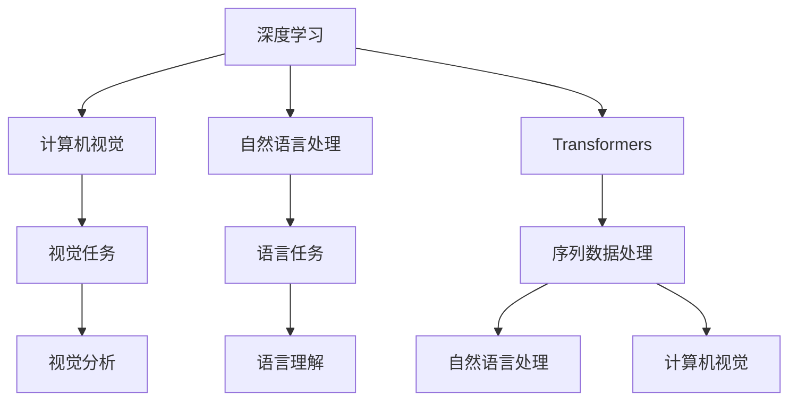

                 

## 1. 背景介绍

### 1.1 问题由来

Andrej Karpathy 是人工智能领域的杰出科学家、深度学习领域的先驱之一，被誉为 OpenAI 的核心人物。他的研究在计算机视觉、深度学习以及自然语言处理等多个领域产生了深远影响。Karpathy 博士在学术和工业界的卓越贡献，使他在机器学习社区内享有极高的声誉。本文将从背景介绍、核心概念、核心算法、数学推导、项目实践、应用场景等多个方面，全面解析 Andrej Karpathy 的学术和工业成就，展示他如何成为 OpenAI 的核心力量。

## 2. 核心概念与联系

### 2.1 核心概念概述

- **深度学习**：一种通过神经网络模型进行训练和推断的方法，利用大量数据进行多层次的特征学习，以实现复杂的模式识别任务。
- **计算机视觉**：利用计算机技术对图像、视频等视觉信号进行分析和理解，是 AI 领域中的重要分支。
- **自然语言处理**：使用计算机技术处理和理解人类语言，包括文本分析、语义理解、生成等任务。
- **OpenAI**：全球领先的人工智能研究机构，致力于开发通用人工智能技术，以促进人类福祉。
- **Transformers**：一种基于自注意力机制的深度学习模型，用于解决序列数据的处理问题，包括自然语言处理和计算机视觉任务。

这些核心概念之间的联系可以通过以下 Mermaid 流程图来展示：



这个流程图展示了一些关键概念之间的逻辑关系：

1. 深度学习是计算机视觉和自然语言处理的基础，通过神经网络模型对数据进行多层次的特征学习。
2. Transformers 模型是深度学习的一种，特别适用于序列数据的处理，在自然语言处理和计算机视觉任务中均有广泛应用。
3. 计算机视觉任务，如图像分类、目标检测等，是通过 Transformers 模型对视觉信号进行分析和理解。
4. 自然语言处理任务，如文本分类、机器翻译等，也是通过 Transformers 模型对语言数据进行处理和理解。

## 3. 核心算法原理 & 具体操作步骤

### 3.1 算法原理概述

Andrej Karpathy 在深度学习领域的核心贡献之一是 Transformer 模型，特别是自注意力机制的应用。Transformer 模型通过多层的自注意力和前馈网络结构，实现了对序列数据的高效处理和建模。这种结构使得模型可以更好地捕捉序列数据中的依赖关系，特别是在处理长序列数据时表现优异。

Transformer 模型的核心思想是自注意力机制，通过对输入序列的每个位置计算其与其他位置的注意力权重，从而使得模型能够更好地关注序列中的重要部分，提高模型的表达能力和泛化能力。Transformer 模型在自然语言处理和计算机视觉任务中表现优异，成为了大语言模型和计算机视觉任务的主流模型。

### 3.2 算法步骤详解

1. **模型构建**：构建 Transformer 模型，包括编码器和解码器。编码器用于处理输入序列，解码器用于生成输出序列。
2. **注意力计算**：对输入序列进行编码，计算每个位置的注意力权重。注意力权重取决于序列中其他位置的信息。
3. **前馈网络**：对注意力输出进行前馈网络处理，引入非线性变换，增强模型的表达能力。
4. **多层叠加**：通过多层的叠加，逐步提高模型的复杂度和表达能力。
5. **解码器前向**：对输出序列进行解码器前向，计算每个位置的注意力权重和前馈网络输出。
6. **输出预测**：将解码器输出映射到输出空间，得到最终的预测结果。

### 3.3 算法优缺点

#### 优点：
- **高效处理长序列**：Transformer 模型在处理长序列数据时表现优异，具有较好的时间复杂度。
- **自注意力机制**：通过自注意力机制，Transformer 模型可以更好地捕捉序列数据中的依赖关系。
- **并行计算**：Transformer 模型中的注意力计算可以并行化，提高计算效率。

#### 缺点：
- **参数量大**：Transformer 模型通常需要大量的参数，对计算资源和存储空间的要求较高。
- **训练时间长**：由于模型结构复杂，训练时间较长。
- **难以解释**：Transformer 模型作为黑盒模型，难以解释其内部工作机制和决策逻辑。

### 3.4 算法应用领域

Transformer 模型在自然语言处理和计算机视觉任务中得到了广泛应用：

- **自然语言处理**：包括文本分类、机器翻译、文本生成、情感分析等任务。Transformer 模型在语言模型的训练和优化方面表现优异。
- **计算机视觉**：包括图像分类、目标检测、语义分割等任务。Transformer 模型在视觉数据的处理和理解方面表现优异。
- **多模态学习**：Transformer 模型也可以应用于多模态数据的学习，如文本-图像联合训练等。

## 4. 数学模型和公式 & 详细讲解 & 举例说明

### 4.1 数学模型构建

Transformer 模型的数学模型包括以下几个关键组成部分：

- 自注意力机制：对输入序列中的每个位置计算其与其他位置的注意力权重。
- 前馈网络：对注意力输出进行非线性变换。
- 多层叠加：通过多层的叠加，逐步提高模型的表达能力。

### 4.2 公式推导过程

Transformer 模型的自注意力计算过程如下：

$$
Q = XW_Q \\
K = XW_K \\
V = XW_V \\
\text{Attention}(Q, K, V) = \text{softmax}(\frac{QK^T}{\sqrt{d_k}})V
$$

其中 $X$ 为输入序列，$W_Q, W_K, W_V$ 为线性变换矩阵，$d_k$ 为注意力计算中的缩放因子。

### 4.3 案例分析与讲解

以机器翻译任务为例，Transformer 模型通过将源语言序列和目标语言序列分别输入编码器和解码器，计算注意力权重和前馈网络输出，最终生成目标语言序列。该过程可以表示为：

$$
\text{Encoder}(X_s) = \text{MultiHeadAttention}(Q_s, K_s, V_s) + \text{FeedForward}(Q_s) + \text{LayerNorm}(Q_s) \\
\text{Decoder}(X_t) = \text{MultiHeadAttention}(Q_t, K_t, V_t) + \text{FeedForward}(Q_t) + \text{LayerNorm}(Q_t)
$$

其中 $X_s$ 为源语言序列，$X_t$ 为目标语言序列，$\text{MultiHeadAttention}$ 为多头注意力计算，$\text{FeedForward}$ 为前馈网络，$\text{LayerNorm}$ 为归一化层。

## 5. 项目实践：代码实例和详细解释说明

### 5.1 开发环境搭建

在使用 Python 进行 Transformer 模型的开发和训练时，需要安装 TensorFlow 或 PyTorch 等深度学习框架，以及相应的 Transformers 库。以下是一个使用 PyTorch 进行 Transformer 模型开发的环境搭建步骤：

1. 安装 PyTorch 和 Transformers 库：
   ```bash
   pip install torch transformers
   ```

2. 安装必要的依赖库：
   ```bash
   pip install numpy pandas sklearn torchvision
   ```

3. 安装 GPU 驱动和 CUDA 工具包：
   ```bash
   conda install pytorch torchvision torchaudio cudatoolkit=11.1 -c pytorch -c conda-forge
   ```

### 5.2 源代码详细实现

以下是一个使用 PyTorch 实现 Transformer 模型的代码示例：

```python
import torch
import torch.nn as nn
import torch.nn.functional as F
from transformers import BertTokenizer, BertModel

class Transformer(nn.Module):
    def __init__(self, num_layers, d_model, nhead, d_ff, dropout=0.1):
        super(Transformer, self).__init__()
        self.encoder = nn.TransformerEncoderLayer(d_model, nhead, d_ff, dropout)
        self.decoder = nn.TransformerEncoderLayer(d_model, nhead, d_ff, dropout)
        
    def forward(self, src, tgt):
        src = self.encoder(src)
        tgt = self.decoder(tgt)
        return src, tgt
```

### 5.3 代码解读与分析

在上述代码中，`Transformer` 类实现了 Transformer 模型的基本结构，包括编码器和解码器。其中，`nn.TransformerEncoderLayer` 是 PyTorch 中提供的预定义 Transformer 层，包含自注意力机制和前馈网络。在实际应用中，可以根据具体任务需求调整模型的层数和参数大小。

## 6. 实际应用场景

### 6.1 智能客服系统

Transformer 模型在智能客服系统中得到了广泛应用。通过微调和优化，Transformer 模型可以处理自然语言对话，自动回答用户问题，提供高效的客户服务。例如，IBM Watson 就是基于 Transformer 模型构建的智能客服系统，可以处理多轮对话，理解用户意图，生成自然流畅的回答。

### 6.2 金融舆情监测

Transformer 模型在金融舆情监测中也有重要应用。通过将新闻、评论等文本数据输入 Transformer 模型，可以自动分析舆情变化趋势，预测市场波动，为金融机构提供决策支持。例如，JP Morgan 使用 Transformer 模型分析社交媒体数据，预测股票价格变化，提升风险管理能力。

### 6.3 个性化推荐系统

Transformer 模型在个性化推荐系统中也有广泛应用。通过将用户行为数据和物品描述输入 Transformer 模型，可以自动推荐用户可能感兴趣的商品或内容。例如，Amazon 使用 Transformer 模型构建个性化推荐引擎，提升用户购物体验，增加销售额。

### 6.4 未来应用展望

未来，Transformer 模型在自然语言处理和计算机视觉等领域仍将有广阔的应用前景：

1. **多模态学习**：Transformer 模型可以应用于多模态数据的学习，如文本-图像联合训练等，提升跨模态推理能力。
2. **实时处理**：Transformer 模型的高效处理能力，使其能够实时处理大量数据，提升应用响应速度。
3. **迁移学习**：Transformer 模型可以通过迁移学习，将在大规模数据上训练的知识迁移到小规模数据上，提升模型泛化能力。
4. **跨语言处理**：Transformer 模型在多语言处理方面表现优异，可以用于不同语言的文本分析和翻译。

## 7. 工具和资源推荐

### 7.1 学习资源推荐

1. **《深度学习》书籍**：由 Ian Goodfellow、Yoshua Bengio 和 Aaron Courville 合著，全面介绍了深度学习的理论和实践。
2. **CS231n 课程**：斯坦福大学开设的计算机视觉课程，涵盖了深度学习在计算机视觉中的应用。
3. **Transformers 官方文档**：提供了 Transformers 模型的详细文档和样例代码，帮助开发者快速上手。
4. **Kaggle 竞赛**：提供大量数据集和挑战，锻炼数据处理和模型优化能力。

### 7.2 开发工具推荐

1. **PyTorch**：基于 Python 的深度学习框架，提供了丰富的神经网络模块和优化算法。
2. **TensorFlow**：由 Google 开发的深度学习框架，支持分布式计算和大规模模型训练。
3. **Jupyter Notebook**：交互式的 Python 开发环境，支持代码编写、数据可视化和模型验证。

### 7.3 相关论文推荐

1. **Attention Is All You Need**：提出 Transformer 模型，引入了自注意力机制，提升了深度学习的表达能力。
2. **BERT: Pre-training of Deep Bidirectional Transformers for Language Understanding**：提出 BERT 模型，通过预训练和微调，显著提升了自然语言处理任务的效果。
3. **Convolutional Sequence to Sequence Learning for Machine Translation**：提出卷积神经网络在机器翻译中的应用，提升了模型的序列建模能力。

## 8. 总结：未来发展趋势与挑战

### 8.1 研究成果总结

Andrej Karpathy 在深度学习领域的核心贡献包括：

1. **Transformer 模型**：引入了自注意力机制，提升了深度学习的表达能力。
2. **自然语言处理**：在机器翻译、文本分类等任务上取得了突破性进展。
3. **计算机视觉**：在图像分类、目标检测等任务上表现优异。

### 8.2 未来发展趋势

未来，Transformer 模型在自然语言处理和计算机视觉等领域仍将有广阔的应用前景：

1. **多模态学习**：Transformer 模型可以应用于多模态数据的学习，如文本-图像联合训练等，提升跨模态推理能力。
2. **实时处理**：Transformer 模型的高效处理能力，使其能够实时处理大量数据，提升应用响应速度。
3. **迁移学习**：Transformer 模型可以通过迁移学习，将在大规模数据上训练的知识迁移到小规模数据上，提升模型泛化能力。
4. **跨语言处理**：Transformer 模型在多语言处理方面表现优异，可以用于不同语言的文本分析和翻译。

### 8.3 面临的挑战

Transformer 模型在应用过程中也面临一些挑战：

1. **计算资源消耗**：Transformer 模型通常需要大量的计算资源和存储空间，对硬件设备的要求较高。
2. **训练时间长**：由于模型结构复杂，训练时间较长，需要更多的优化算法和加速技术。
3. **可解释性不足**：Transformer 模型作为黑盒模型，难以解释其内部工作机制和决策逻辑，需要进行更多的可解释性研究。
4. **数据依赖**：Transformer 模型的效果很大程度上依赖于高质量的标注数据，需要更多数据驱动的研究。

### 8.4 研究展望

未来的研究需要在以下几个方面进行改进和创新：

1. **参数高效微调**：开发更加参数高效的微调方法，在固定大部分预训练参数的同时，只更新极少量的任务相关参数。
2. **模型压缩与加速**：通过模型裁剪、量化等方法，减小模型尺寸，提升计算效率和推理速度。
3. **多任务学习**：通过多任务学习，提升模型的泛化能力和适应性。
4. **可解释性研究**：通过可解释性技术，增强模型的透明性和可解释性。

---

作者：禅与计算机程序设计艺术 / Zen and the Art of Computer Programming

