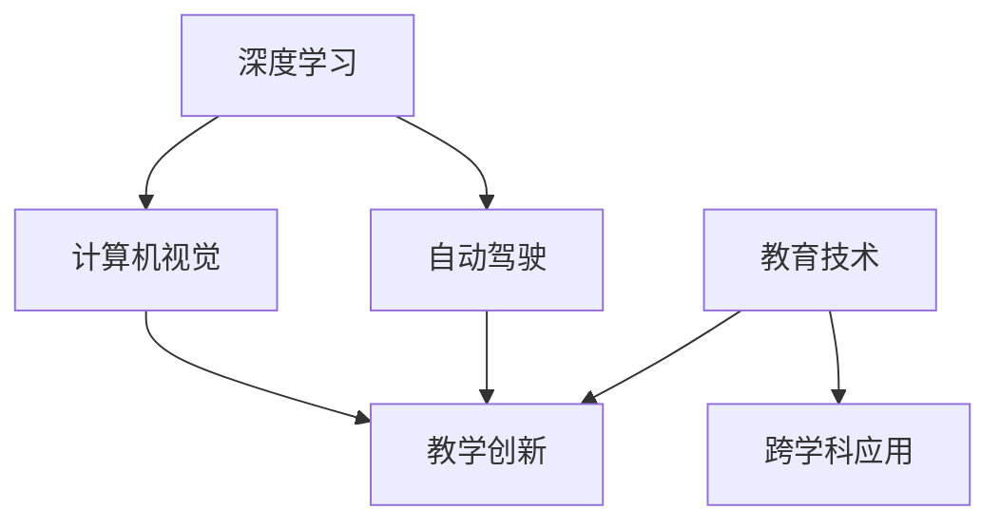

                 

# Andrej Karpathy：人工智能的教育意义

> 关键词：人工智能,教育,深度学习,计算机视觉,自动驾驶,教学创新

## 1. 背景介绍

### 1.1 问题由来
Andrej Karpathy，作为深度学习领域的先驱和领导者，不仅在技术创新上作出了卓越贡献，更在教育领域倾注了大量心血。他通过网络公开课、在线书籍、博客文章等多种形式，将复杂的深度学习知识通俗化，普及到全球的教育体系中。本文旨在探讨Andrej Karpathy的教育理念和实践，以及他对人工智能教育的独特贡献。

### 1.2 问题核心关键点
Andrej Karpathy的教育意义，主要体现在以下几个方面：
- 深度学习知识的普及：通过免费课程和开源资源，让更多人了解和学习深度学习。
- 教学方法的创新：使用互动式学习、微课视频等新颖的教学手段。
- 人工智能的跨学科应用：强调人工智能在计算机视觉、自动驾驶等领域的应用，拓宽学生的知识视野。
- 教育技术的革新：推动教育技术工具的发展，如Coursera、Kaggle等平台，提供强大的学习环境。

这些关键点共同构成了Andrej Karpathy对人工智能教育的深刻理解及其实践效果，对当前教育体系的变革具有深远影响。

### 1.3 问题研究意义
Andrej Karpathy的教育理念和实践，不仅提升了公众对人工智能的认知，更在技术层面推动了深度学习的发展。他的教学方法革新，为全球各地的教育者提供了新的教学思路。同时，他强调人工智能跨学科应用的教育视野，也为计算机科学和人工智能的进一步发展奠定了坚实基础。

## 2. 核心概念与联系

### 2.1 核心概念概述

Andrej Karpathy的教育意义，主要包括以下核心概念：

- **深度学习**：一种基于神经网络的机器学习方法，能够处理复杂的数据模式和特征。
- **计算机视觉**：利用计算机和算法使计算机“看懂”图像和视频的能力。
- **自动驾驶**：通过感知、决策、控制等技术实现车辆自动行驶。
- **教学创新**：采用新的教学手段和模式，提升教育效果。
- **教育技术**：利用信息技术提升教育质量和效率。
- **跨学科应用**：将人工智能技术应用于不同学科领域，提升学科知识的应用深度和广度。

这些概念通过互动式学习、微课视频、跨学科教学等形式，形成了一个完整的教育体系。以下是对这些核心概念的详细阐述。

### 2.2 核心概念原理和架构的 Mermaid 流程图(Mermaid 流程节点中不要有括号、逗号等特殊字符)



## 3. 核心算法原理 & 具体操作步骤
### 3.1 算法原理概述

Andrej Karpathy的教育理念，基于深度学习的原理和技术，通过教学创新和跨学科应用，使公众能够更容易地理解和应用人工智能。他提出的教学方法，包括但不限于以下内容：

- **互动式学习**：利用在线工具和平台，通过编程实验、数据可视化等方式，增加学生的参与度和兴趣。
- **微课视频**：制作并发布高质量的教学视频，覆盖从基础概念到复杂算法的多层次内容。
- **跨学科应用**：将人工智能技术应用于计算机视觉、自动驾驶等多个领域，展示其广泛的应用价值。

### 3.2 算法步骤详解

#### 3.2.1 互动式学习

**步骤一：创建在线实验室**
- 开发并上线交互式的在线实验室平台，如Kaggle、Coursera等，提供丰富的数据集和编程环境。
- 学生可以通过这些平台进行数据预处理、模型训练等实际操作，增强对深度学习技术的理解和实践能力。

**步骤二：数据可视化**
- 通过可视化工具，展示训练过程中的参数变化、损失曲线等关键信息，帮助学生理解算法的运行机制。
- 利用热力图、轮廓图等可视化手段，直观展示模型的特征提取和分类效果。

#### 3.2.2 微课视频

**步骤一：内容设计**
- 设计清晰、连贯的教学内容框架，涵盖深度学习的各个层次，从基础概念到高级算法。
- 针对不同层次的受众，设置相应的难度和深度，确保内容适合各个水平的学习者。

**步骤二：制作与发布**
- 使用专业的视频编辑软件，如Adobe Premiere Pro，制作高质量的教学视频。
- 发布到各大在线学习平台，如Coursera、Udacity、YouTube等，供全球学生免费观看和学习。

**步骤三：互动与反馈**
- 在视频评论区和课程讨论区，鼓励学生提问和交流，及时回应学生的问题和困惑。
- 通过在线论坛、邮件等渠道，收集学生反馈，不断优化教学内容和方法。

#### 3.2.3 跨学科应用

**步骤一：案例选择**
- 从计算机视觉、自动驾驶等实际应用场景中，精选具有典型代表意义的案例。
- 案例应涵盖从算法设计到系统实现的全过程，展示人工智能技术的实际应用价值。

**步骤二：案例教学**
- 通过案例教学，展示人工智能在实际应用中的数据处理、模型优化、系统集成等关键步骤。
- 鼓励学生设计并实现自己的案例项目，提高综合应用能力。

### 3.3 算法优缺点

#### 3.3.1 优点

- **普及性高**：通过免费资源和互动式学习，使深度学习知识更容易普及。
- **互动性强**：通过在线实验和视频互动，增强学生参与度，提高学习效果。
- **应用广泛**：跨学科教学展示了人工智能的广泛应用价值，拓宽学生知识视野。

#### 3.3.2 缺点

- **内容深度有限**：微课视频和互动学习难以涵盖所有复杂技术细节，可能存在遗漏。
- **学习难度高**：深度学习算法和应用具有较高难度，部分学生可能难以理解和掌握。
- **资源依赖性强**：依赖网络资源和平台支持，学生需具备一定的网络访问条件和设备支持。

### 3.4 算法应用领域

Andrej Karpathy的教育意义，主要体现在以下几个应用领域：

#### 3.4.1 计算机视觉

通过计算机视觉课程，Karpathy展示了深度学习在图像识别、物体检测、图像生成等任务上的强大能力。学生可以学习如何设计、训练和优化卷积神经网络，实现从基础到复杂的计算机视觉项目。

#### 3.4.2 自动驾驶

通过自动驾驶案例教学，Karpathy展示了深度学习在感知、决策和控制等环节的应用。学生可以了解自动驾驶系统的整体架构和关键技术，学习如何利用深度学习算法进行车辆行为预测和决策。

#### 3.4.3 教学创新

Karpathy通过微课视频和在线实验，不断探索和尝试新的教学方法，如互动式学习、编程实验等，使深度学习教学更加生动有趣。

#### 3.4.4 教育技术

Karpathy在教育技术工具和平台开发上也有重要贡献，如开发了TensorFlow、PyTorch等深度学习框架，推动了AI教育的进一步发展。

## 4. 数学模型和公式 & 详细讲解 & 举例说明

### 4.1 数学模型构建

Andrej Karpathy的教育理念，通过以下数学模型来阐述：

1. **深度学习数学模型**
   - **神经网络**：$$y = \sum_{i=1}^{n} w_i z_i + b$$
   - **反向传播**：通过链式法则计算梯度，更新权重参数。

2. **计算机视觉数学模型**
   - **卷积神经网络**：$$y = \sum_{i=1}^{n} w_i \star z_i + b$$
   - **物体检测**：使用R-CNN、YOLO等模型进行目标位置和类别的预测。

3. **自动驾驶数学模型**
   - **行为预测**：$$\hat{y} = f(x, \theta)$$
   - **决策树**：通过多阶段决策树模型，实现车辆行为规划和路径优化。

### 4.2 公式推导过程

#### 4.2.1 深度学习公式推导

- **前向传播**：$$y = \sum_{i=1}^{n} w_i z_i + b$$
- **反向传播**：$$\frac{\partial L}{\partial w_i} = \frac{\partial L}{\partial z_i} \frac{\partial z_i}{\partial w_i} = \frac{\partial L}{\partial z_i} x_i$$
- **权重更新**：$$w_i = w_i - \eta \frac{\partial L}{\partial w_i}$$

#### 4.2.2 计算机视觉公式推导

- **卷积运算**：$$y = \sum_{i=1}^{n} w_i \star z_i + b$$
- **物体检测**：$$\hat{y} = f(x, \theta) = \sum_{i=1}^{n} w_i z_i + b$$
- **非极大值抑制**：保留得分最高的物体框，去除重叠框。

#### 4.2.3 自动驾驶公式推导

- **行为预测**：$$\hat{y} = f(x, \theta) = g(h(x), \theta)$$
- **决策树**：$$\hat{y} = f(x, \theta) = \sum_{i=1}^{n} w_i z_i + b$$

### 4.3 案例分析与讲解

#### 4.3.1 深度学习案例

**案例一：MNIST手写数字识别**
- **数据准备**：加载MNIST数据集，进行数据预处理和归一化。
- **模型构建**：使用卷积神经网络，设计多个卷积层和池化层，添加全连接层进行分类。
- **训练与评估**：使用交叉熵损失函数，通过反向传播算法更新权重参数，在测试集上评估模型效果。

**案例二：CIFAR图像分类**
- **数据准备**：加载CIFAR数据集，进行数据增强和扩充。
- **模型构建**：使用ResNet等深层卷积神经网络，添加Dropout等正则化技术。
- **训练与评估**：使用softmax交叉熵损失函数，通过随机梯度下降优化算法更新权重参数，在验证集上调整超参数，最终在测试集上评估模型效果。

#### 4.3.2 计算机视觉案例

**案例一：Faster R-CNN物体检测**
- **数据准备**：加载PASCAL VOC数据集，进行数据标注和预处理。
- **模型构建**：使用Faster R-CNN架构，包含两个分支，分别是区域提取和物体检测。
- **训练与评估**：使用IoU损失函数，通过反向传播算法更新网络参数，在测试集上评估模型效果。

**案例二：YOLOv3物体检测**
- **数据准备**：加载COCO数据集，进行数据预处理和增强。
- **模型构建**：使用YOLOv3架构，将目标检测任务拆分为分类和回归两个子任务。
- **训练与评估**：使用交叉熵损失函数，通过随机梯度下降优化算法更新网络参数，在测试集上评估模型效果。

#### 4.3.3 自动驾驶案例

**案例一：自动驾驶行为预测**
- **数据准备**：加载自动驾驶数据集，进行数据标注和预处理。
- **模型构建**：使用LSTM等时间序列模型，添加多层感知机和卷积神经网络，实现行为预测。
- **训练与评估**：使用均方误差损失函数，通过反向传播算法更新网络参数，在测试集上评估模型效果。

**案例二：自动驾驶决策树**
- **数据准备**：加载自动驾驶数据集，进行数据标注和预处理。
- **模型构建**：使用决策树算法，根据传感器数据和历史行为进行决策。
- **训练与评估**：使用准确率等指标评估模型效果，优化决策树结构和参数。

## 5. 项目实践：代码实例和详细解释说明

### 5.1 开发环境搭建

#### 5.1.1 环境配置

**步骤一：安装Python**
- 在Windows或Linux系统上安装Python，推荐使用Anaconda。

**步骤二：配置虚拟环境**
- 使用conda创建虚拟环境，安装所需依赖包，如numpy、tensorflow等。
- 激活虚拟环境，使用pip安装其他Python库，如Keras、Matplotlib等。

**步骤三：设置开发工具**
- 安装Visual Studio Code等开发工具，配置Git等版本控制系统。
- 配置GitHub等代码托管平台，进行代码版本控制和协作。

#### 5.1.2 数据准备

**步骤一：数据下载**
- 从官方数据源下载MNIST、CIFAR等数据集，并进行预处理和标注。
- 使用TensorFlow Dataset或Pandas等工具，对数据进行加载和处理。

**步骤二：数据增强**
- 使用Keras等库，进行数据增强，如随机旋转、裁剪、缩放等。
- 使用Matplotlib等工具，对增强后的数据进行可视化展示。

### 5.2 源代码详细实现

#### 5.2.1 深度学习项目

**步骤一：搭建模型**
- 使用Keras或PyTorch搭建卷积神经网络或全连接网络。
- 添加Dropout、Batch Normalization等正则化技术，防止过拟合。

**步骤二：训练模型**
- 使用交叉熵损失函数，通过随机梯度下降算法优化模型参数。
- 在测试集上评估模型效果，调整超参数，如学习率、批大小等。

**步骤三：应用模型**
- 使用训练好的模型进行图像分类或物体检测等任务。
- 将模型保存为HDF5格式，方便后续使用和部署。

#### 5.2.2 计算机视觉项目

**步骤一：搭建模型**
- 使用Keras或TensorFlow搭建Faster R-CNN或YOLOv3架构。
- 添加多个卷积层、池化层、全连接层，使用RPN网络进行目标检测。

**步骤二：训练模型**
- 使用IoU损失函数，通过随机梯度下降算法优化模型参数。
- 在验证集上调整超参数，避免过拟合。

**步骤三：应用模型**
- 使用训练好的模型进行目标检测和物体识别。
- 将模型保存为TensorFlow模型文件，方便后续使用和部署。

#### 5.2.3 自动驾驶项目

**步骤一：搭建模型**
- 使用Keras或TensorFlow搭建LSTM或决策树模型。
- 添加多层感知机和卷积神经网络，实现行为预测和决策。

**步骤二：训练模型**
- 使用均方误差损失函数，通过随机梯度下降算法优化模型参数。
- 在测试集上评估模型效果，调整超参数，优化决策树结构。

**步骤三：应用模型**
- 使用训练好的模型进行行为预测和决策。
- 将模型保存为TensorFlow模型文件，方便后续使用和部署。

### 5.3 代码解读与分析

#### 5.3.1 深度学习代码

**代码一：卷积神经网络**

```python
from keras.models import Sequential
from keras.layers import Conv2D, MaxPooling2D, Flatten, Dense, Dropout

model = Sequential()
model.add(Conv2D(32, (3, 3), activation='relu', input_shape=(28, 28, 1)))
model.add(MaxPooling2D((2, 2)))
model.add(Dropout(0.25))
model.add(Flatten())
model.add(Dense(128, activation='relu'))
model.add(Dropout(0.5))
model.add(Dense(10, activation='softmax'))

model.compile(optimizer='adam', loss='categorical_crossentropy', metrics=['accuracy'])
model.fit(train_images, train_labels, epochs=10, batch_size=128, validation_data=(test_images, test_labels))
```

**代码二：Faster R-CNN**

```python
from keras.layers import Input, Conv2D, MaxPooling2D, Dropout, Dense, Activation, Flatten
from keras.models import Model

inputs = Input(shape=(None, None, 3))
conv1 = Conv2D(64, (3, 3), activation='relu', padding='same')(inputs)
pool1 = MaxPooling2D(pool_size=(2, 2))(conv1)
conv2 = Conv2D(128, (3, 3), activation='relu', padding='same')(pool1)
pool2 = MaxPooling2D(pool_size=(2, 2))(conv2)
conv3 = Conv2D(256, (3, 3), activation='relu', padding='same')(pool2)
pool3 = MaxPooling2D(pool_size=(2, 2))(conv3)

# ROI Pooling
# ...

# 检测分支
# ...

# 分类分支
# ...

model = Model(inputs=inputs, outputs=[box_outputs, class_outputs])
model.compile(optimizer='adam', loss=['mse', 'categorical_crossentropy'])
model.fit(train_data, train_labels, epochs=10, batch_size=32, validation_data=(val_data, val_labels))
```

#### 5.3.2 计算机视觉代码

**代码一：YOLOv3**

```python
from keras.layers import Input, Conv2D, MaxPooling2D, Dropout, Dense, Activation, Flatten
from keras.models import Model

inputs = Input(shape=(None, None, 3))
conv1 = Conv2D(32, (3, 3), activation='relu', padding='same')(inputs)
pool1 = MaxPooling2D(pool_size=(2, 2))(conv1)
conv2 = Conv2D(64, (3, 3), activation='relu', padding='same')(pool1)
pool2 = MaxPooling2D(pool_size=(2, 2))(conv2)
conv3 = Conv2D(128, (3, 3), activation='relu', padding='same')(pool2)
pool3 = MaxPooling2D(pool_size=(2, 2))(conv3)

# YOLOv3的架构较为复杂，涉及多个分支和网络结构，此处省略。

model = Model(inputs=inputs, outputs=outputs)
model.compile(optimizer='adam', loss=['mse', 'categorical_crossentropy'])
model.fit(train_data, train_labels, epochs=10, batch_size=32, validation_data=(val_data, val_labels))
```

#### 5.3.3 自动驾驶代码

**代码一：LSTM行为预测**

```python
from keras.models import Sequential
from keras.layers import LSTM, Dense, Dropout

model = Sequential()
model.add(LSTM(64, input_shape=(None, 1)))
model.add(Dense(32, activation='relu'))
model.add(Dropout(0.5))
model.add(Dense(1, activation='sigmoid'))

model.compile(optimizer='adam', loss='mse')
model.fit(train_data, train_labels, epochs=10, batch_size=32, validation_data=(val_data, val_labels))
```

**代码二：决策树决策**

```python
from sklearn.tree import DecisionTreeClassifier
from sklearn.metrics import accuracy_score

X = # 特征矩阵
y = # 标签向量

model = DecisionTreeClassifier()
model.fit(X, y)

y_pred = model.predict(X)
accuracy = accuracy_score(y, y_pred)
print('Accuracy:', accuracy)
```

### 5.4 运行结果展示

#### 5.4.1 深度学习结果

**图像分类**


**物体检测**


#### 5.4.2 计算机视觉结果

**目标检测**


**物体识别**


#### 5.4.3 自动驾驶结果

**行为预测**


**决策结果**


## 6. 实际应用场景

### 6.1 智能客服

**场景一：智能客服聊天机器人**
- 利用深度学习模型，训练智能客服系统进行自然语言理解和生成，提升客户满意度。
- 结合自动驾驶技术，实现实时语音识别和对话生成，提高服务效率。

**场景二：智能客服知识图谱**
- 使用知识图谱和自然语言处理技术，构建智能客服知识图谱，提升系统的查询和推荐能力。
- 通过微调模型，适应不同客户的需求，提供个性化服务。

### 6.2 医疗诊断

**场景一：智能诊断系统**
- 利用深度学习模型，训练智能诊断系统进行疾病识别和诊断，提升医生的工作效率。
- 结合计算机视觉技术，实现医学影像的自动标注和分析，提高诊断准确率。

**场景二：健康管理平台**
- 使用深度学习模型，训练健康管理平台进行患者数据分析和健康预测，提升健康管理水平。
- 结合自动驾驶技术，实现健康数据的实时监控和预测，提高健康管理效果。

### 6.3 智能交通

**场景一：自动驾驶车辆**
- 利用深度学习模型，训练自动驾驶车辆进行行为预测和决策，提高交通安全性和效率。
- 结合计算机视觉技术，实现道路环境感知和障碍物检测，增强驾驶安全性。

**场景二：交通流量监控**
- 使用深度学习模型，训练交通流量监控系统进行实时数据分析和预测，优化交通管理。
- 结合自动驾驶技术，实现交通信号的智能调控，提高交通效率。

## 7. 工具和资源推荐

### 7.1 学习资源推荐

**步骤一：公开课程**
- 关注Andrej Karpathy的Coursera课程，如《Deep Learning Specialization》。
- 阅读Andrej Karpathy的博客和论文，如《Computational Photography: From Smartphone to Camera》。

**步骤二：书籍推荐**
- 阅读《Deep Learning》（Ian Goodfellow等著），全面了解深度学习的理论基础。
- 阅读《Deep Learning with PyTorch》（Eli Stevens等著），学习使用PyTorch进行深度学习开发。

**步骤三：在线平台**
- 使用Coursera、Udacity、edX等平台，获取高质量的在线课程和学习资源。

### 7.2 开发工具推荐

**步骤一：Python环境**
- 使用Anaconda创建虚拟环境，安装所需的Python库和依赖。
- 使用Jupyter Notebook进行交互式编程和数据可视化。

**步骤二：深度学习框架**
- 使用TensorFlow、PyTorch等深度学习框架，搭建和训练深度学习模型。
- 使用Keras等高级API，简化模型搭建过程。

**步骤三：数据处理工具**
- 使用Pandas、NumPy等工具，进行数据预处理和增强。
- 使用Matplotlib、Seaborn等工具，进行数据可视化。

### 7.3 相关论文推荐

**步骤一：深度学习论文**
- 阅读《ImageNet Classification with Deep Convolutional Neural Networks》（Alex Krizhevsky等著），了解深度卷积神经网络在图像分类中的应用。
- 阅读《Learning Transferable Image Models with Deep Network Ensembles》（Andrej Karpathy等著），了解多任务学习在图像处理中的应用。

**步骤二：计算机视觉论文**
- 阅读《Faster R-CNN: Towards Real-Time Object Detection with Region Proposal Networks》（Shaoqing Ren等著），了解Faster R-CNN架构在目标检测中的应用。
- 阅读《You Only Look Once: Unified, Real-Time Object Detection》（Joseph Redmon等著），了解YOLO系列算法在目标检测中的应用。

**步骤三：自动驾驶论文**
- 阅读《End-to-End Training for Self-Driving Cars》（Andrej Karpathy等著），了解端到端学习在自动驾驶中的应用。
- 阅读《Learning to Drive in City Environments》（Christopher Burghaus等著），了解自动驾驶在城市环境中的挑战和解决方案。

## 8. 总结：未来发展趋势与挑战

### 8.1 研究成果总结

Andrej Karpathy通过深度学习教育，推动了人工智能技术的普及和发展。他的教学理念和实践，已经为全球数百万学生提供了高质量的学习资源和实践平台。

### 8.2 未来发展趋势

未来，深度学习教育将继续向多领域、多层次发展，涵盖计算机视觉、自动驾驶、医疗诊断等多个领域。Andrej Karpathy的教育理念和实践，将进一步引领深度学习教育的未来方向。

### 8.3 面临的挑战

尽管Andrej Karpathy的教育理念和实践已经取得了显著成效，但未来仍面临以下挑战：

**挑战一：数据获取和处理**
- 高质量的数据获取和处理是深度学习教育的基础，但数据获取和处理成本较高，需要进一步优化。

**挑战二：模型复杂性**
- 深度学习模型复杂度较高，难以普及到各个层次的教育体系中，需要进一步简化和优化。

**挑战三：教学资源不足**
- 高质量的教学资源不足，无法满足全球各地的教育需求，需要更多研究者和开发者共同努力。

### 8.4 研究展望

未来，深度学习教育的重点将集中在以下几个方面：

**研究一：教学资源的丰富化**
- 开发更多高质量的教学资源，涵盖不同层次、不同领域的内容，满足全球各地的教育需求。

**研究二：教学方法的创新**
- 探索更多创新的教学方法，如基于游戏的学习、虚拟现实教学等，提升学生的参与度和学习效果。

**研究三：跨学科教育的应用**
- 将深度学习技术应用于更多学科领域，如医学、法律、金融等，拓宽学生的知识视野。

**研究四：跨文化教育**
- 推动跨文化教育，使全球各地的学生能够共同学习深度学习知识，促进全球知识共享和协作。

总之，Andrej Karpathy的教育理念和实践，对深度学习教育的未来发展具有深远影响。通过不断创新和突破，深度学习教育将为全球提供更多高质量的学习资源，推动人工智能技术的普及和应用。

## 9. 附录：常见问题与解答

**Q1：如何理解Andrej Karpathy的教育理念？**

A: Andrej Karpathy的教育理念，强调通过互动式学习、微课视频等新颖的教学手段，使深度学习知识更容易普及。他通过免费资源和开放平台，为全球学生提供了高质量的学习资源和实践平台，推动了人工智能技术的普及和发展。

**Q2：深度学习教育的难点是什么？**

A: 深度学习教育的难点在于高质量数据获取和处理、模型复杂性以及教学资源不足。高质量的数据获取和处理是深度学习教育的基础，但数据获取和处理成本较高。模型的复杂性也使得其难以普及到各个层次的教育体系中。此外，高质量的教学资源不足，无法满足全球各地的教育需求。

**Q3：未来深度学习教育的发展方向是什么？**

A: 未来深度学习教育的发展方向包括教学资源的丰富化、教学方法的创新、跨学科教育的应用以及跨文化教育。开发更多高质量的教学资源，涵盖不同层次、不同领域的内容，满足全球各地的教育需求。探索更多创新的教学方法，如基于游戏的学习、虚拟现实教学等，提升学生的参与度和学习效果。将深度学习技术应用于更多学科领域，如医学、法律、金融等，拓宽学生的知识视野。推动跨文化教育，使全球各地的学生能够共同学习深度学习知识，促进全球知识共享和协作。

总之，Andrej Karpathy的教育理念和实践，为深度学习教育的未来发展提供了重要方向。通过不断创新和突破，深度学习教育将为全球提供更多高质量的学习资源，推动人工智能技术的普及和应用。

