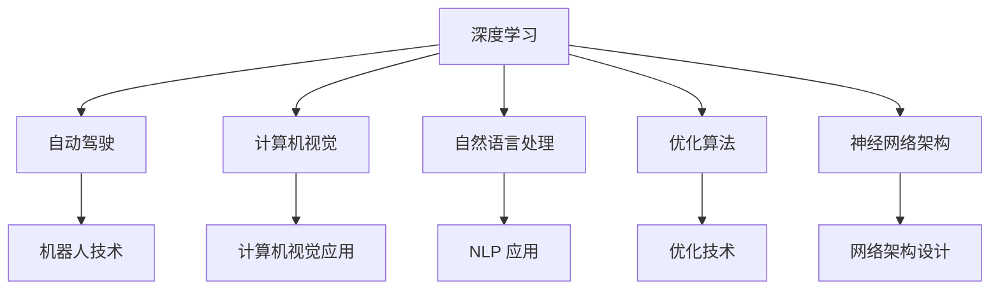

                 

# 背景介绍

人工智能(AI)领域正经历着前所未有的快速发展，深度学习、自然语言处理(NLP)、计算机视觉(CV)等领域取得了举世瞩目的成果。在这其中，Andrej Karpathy 是一位举足轻重的人物，他的研究成果不仅推动了学术界的发展，也在工业界产生了深远影响。本文将探讨 Andrej Karpathy 对人工智能未来发展的见解，并探讨其面临的挑战与未来趋势。

## 1. 核心概念与联系

### 1.1 核心概念概述

Andrej Karpathy 是斯坦福大学计算机科学系的教授，同时也是 OpenAI 的研究员。他的主要研究方向包括深度学习、计算机视觉和自动驾驶。Karpathy 对深度学习、优化、神经网络等方面都有深入的研究，并在自动驾驶、机器人、NLP 等多个领域有广泛的应用。

### 1.2 核心概念原理和架构的 Mermaid 流程图



该图展示了 Andrej Karpathy 的研究领域及其相互关系。深度学习是人工智能的核心技术，自动驾驶和计算机视觉是其应用的两个重要方向，自然语言处理和优化算法为其研究提供了理论支持，神经网络架构设计则为其提供了技术实现。

## 2. 核心算法原理 & 具体操作步骤

### 2.1 算法原理概述

Andrej Karpathy 对深度学习有深入的理解，他的研究主要集中在如何设计高效的神经网络架构，以及如何利用深度学习解决实际问题。他提出的一些算法和技术，如 RNN、CNN、Transformer 等，已经成为深度学习领域的重要基础。

### 2.2 算法步骤详解

1. **神经网络设计**：Karpathy 强调神经网络架构的设计对深度学习的重要性。他提出了许多有效的神经网络架构，如 RNN、CNN 和 Transformer 等，这些架构不仅在理论上具有优势，而且在实际应用中也取得了非常好的效果。

2. **优化算法**：Karpathy 在优化算法方面也有许多贡献，他提出的 Adam 优化算法和 RAdam 优化算法，已经成为深度学习中最常用的优化算法之一。

3. **计算机视觉**：在计算机视觉领域，Karpathy 提出了一系列的算法和技术，如 RNN 和 Transformer 在图像分类、目标检测和图像生成等任务中的应用。

### 2.3 算法优缺点

#### 优点
- 深度学习算法具有很强的泛化能力，能够处理复杂的非线性关系。
- 神经网络架构设计灵活，可以适应不同领域的需求。
- 优化算法高效，能够快速收敛。

#### 缺点
- 深度学习模型通常需要大量的标注数据进行训练，数据收集和标注成本较高。
- 模型复杂度高，训练和推理过程中需要大量的计算资源。
- 深度学习模型的可解释性较差，难以理解其内部工作机制。

### 2.4 算法应用领域

Andrej Karpathy 的研究成果在多个领域都有广泛应用，主要包括以下几个方向：

1. **自动驾驶**：Karpathy 在自动驾驶领域的研究成果，尤其是自动驾驶车辆的计算机视觉和深度学习技术，对全球的自动驾驶研究产生了重要影响。

2. **机器人技术**：他提出的深度强化学习算法在机器人领域得到了广泛应用，极大地提升了机器人的灵活性和智能水平。

3. **自然语言处理**：Karpathy 在 NLP 领域的研究成果，如 Transformer 模型，极大地推动了自然语言处理技术的发展。

4. **计算机视觉**：在计算机视觉领域，Karpathy 提出的算法和技术在图像分类、目标检测和图像生成等任务中都有广泛应用。

## 3. 数学模型和公式 & 详细讲解 & 举例说明

### 3.1 数学模型构建

Andrej Karpathy 的研究涵盖了深度学习、优化算法和神经网络架构设计等多个方面。以下以优化算法为例，展示其数学模型构建。

在深度学习中，我们通常使用梯度下降算法来最小化损失函数。Karpathy 提出的 Adam 优化算法是一种自适应学习率优化算法，其数学模型如下：

$$
m_t = \beta_1 m_{t-1} + (1 - \beta_1) g_t
$$
$$
v_t = \beta_2 v_{t-1} + (1 - \beta_2) g_t^2
$$
$$
\theta_t = \theta_{t-1} - \alpha \frac{m_t}{\sqrt{v_t} + \epsilon}
$$

其中，$m_t$ 和 $v_t$ 分别是梯度的一阶矩估计和二阶矩估计，$\theta_t$ 表示模型参数，$g_t$ 表示当前批次的梯度，$\alpha$ 表示学习率，$\beta_1$ 和 $\beta_2$ 是衰减系数，$\epsilon$ 是一个很小的常数，防止分母为零。

### 3.2 公式推导过程

Adam 算法的基本思想是在梯度的一阶矩估计和二阶矩估计的基础上，计算自适应学习率，并更新模型参数。推导过程如下：

1. 计算梯度一阶矩估计 $m_t$：
$$
m_t = \beta_1 m_{t-1} + (1 - \beta_1) g_t
$$

2. 计算梯度二阶矩估计 $v_t$：
$$
v_t = \beta_2 v_{t-1} + (1 - \beta_2) g_t^2
$$

3. 计算自适应学习率：
$$
\hat{m}_t = \frac{m_t}{1 - \beta_1^t}
$$
$$
\hat{v}_t = \frac{v_t}{1 - \beta_2^t}
$$
$$
\theta_t = \theta_{t-1} - \alpha \frac{\hat{m}_t}{\sqrt{\hat{v}_t} + \epsilon}
$$

其中，$\hat{m}_t$ 和 $\hat{v}_t$ 分别是经过偏差校正后的梯度一阶矩估计和二阶矩估计，$t$ 表示迭代次数。

### 3.3 案例分析与讲解

Adam 算法在深度学习中的应用非常广泛，已经在多个任务中取得了很好的效果。以下是一个简单的例子，展示 Adam 算法在图像分类任务中的应用。

假设我们要训练一个卷积神经网络 (CNN) 来对 CIFAR-10 数据集进行分类。我们可以使用 Adam 算法来最小化交叉熵损失函数：

$$
L = -\frac{1}{N} \sum_{i=1}^{N} \sum_{j=1}^{C} y_{i,j} \log \hat{y}_{i,j}
$$

其中，$N$ 是样本数量，$C$ 是类别数量，$y_{i,j}$ 是样本 $i$ 属于类别 $j$ 的标签，$\hat{y}_{i,j}$ 是模型预测样本 $i$ 属于类别 $j$ 的概率。

在训练过程中，我们可以使用 Adam 算法来更新模型的权重，使其最小化损失函数。以下是使用 TensorFlow 实现 Adam 算法的代码：

```python
import tensorflow as tf
from tensorflow.keras.optimizers import Adam

# 定义模型
model = tf.keras.Sequential([
    tf.keras.layers.Conv2D(32, (3, 3), activation='relu', input_shape=(32, 32, 3)),
    tf.keras.layers.MaxPooling2D((2, 2)),
    tf.keras.layers.Flatten(),
    tf.keras.layers.Dense(10, activation='softmax')
])

# 定义损失函数和优化器
loss_fn = tf.keras.losses.SparseCategoricalCrossentropy()
opt = Adam(learning_rate=0.001)

# 训练模型
model.compile(optimizer=opt, loss=loss_fn, metrics=['accuracy'])
model.fit(train_images, train_labels, epochs=10)
```

## 4. 项目实践：代码实例和详细解释说明

### 4.1 开发环境搭建

要进行深度学习项目的开发，我们需要安装 Python、TensorFlow、PyTorch、NumPy 等库。以下是在 Ubuntu 系统下安装这些库的步骤：

1. 安装 Python：
```
sudo apt-get update
sudo apt-get install python3 python3-pip python3-dev
```

2. 安装 NumPy：
```
pip3 install numpy
```

3. 安装 TensorFlow：
```
pip3 install tensorflow
```

4. 安装 PyTorch：
```
pip3 install torch torchvision torchaudio
```

### 4.2 源代码详细实现

以下是一个简单的图像分类项目的源代码，使用 PyTorch 实现：

```python
import torch
import torch.nn as nn
import torch.optim as optim
from torchvision import datasets, transforms

# 定义模型
class Net(nn.Module):
    def __init__(self):
        super(Net, self).__init__()
        self.conv1 = nn.Conv2d(1, 32, 3, 1)
        self.conv2 = nn.Conv2d(32, 64, 3, 1)
        self.dropout1 = nn.Dropout2d(0.25)
        self.dropout2 = nn.Dropout2d(0.5)
        self.fc1 = nn.Linear(9216, 128)
        self.fc2 = nn.Linear(128, 10)

    def forward(self, x):
        x = self.conv1(x)
        x = nn.functional.relu(x)
        x = self.conv2(x)
        x = nn.functional.relu(x)
        x = nn.functional.max_pool2d(x, 2)
        x = self.dropout1(x)
        x = torch.flatten(x, 1)
        x = self.fc1(x)
        x = nn.functional.relu(x)
        x = self.dropout2(x)
        x = self.fc2(x)
        output = nn.functional.log_softmax(x, dim=1)
        return output

# 定义数据集和数据加载器
transform = transforms.Compose([
    transforms.ToTensor(),
    transforms.Normalize((0.5,), (0.5,))
])
train_dataset = datasets.MNIST(root='./data', train=True, download=True, transform=transform)
test_dataset = datasets.MNIST(root='./data', train=False, download=True, transform=transform)
train_loader = torch.utils.data.DataLoader(train_dataset, batch_size=64, shuffle=True)
test_loader = torch.utils.data.DataLoader(test_dataset, batch_size=64, shuffle=False)

# 定义模型、优化器和损失函数
net = Net()
criterion = nn.NLLLoss()
optimizer = optim.Adam(net.parameters(), lr=0.001)

# 训练模型
for epoch in range(10):
    running_loss = 0.0
    for i, data in enumerate(train_loader, 0):
        inputs, labels = data
        optimizer.zero_grad()
        outputs = net(inputs)
        loss = criterion(outputs, labels)
        loss.backward()
        optimizer.step()
        running_loss += loss.item()
        if i % 100 == 99:
            print('[%d, %5d] loss: %.3f' %
                  (epoch + 1, i + 1, running_loss / 100))
            running_loss = 0.0
```

### 4.3 代码解读与分析

以上代码实现了使用 PyTorch 进行图像分类的简单示例。首先，我们定义了一个简单的卷积神经网络 (CNN)，并使用 MNIST 数据集进行训练。在训练过程中，我们使用了 Adam 优化器和交叉熵损失函数。

### 4.4 运行结果展示

运行以上代码，可以得到类似以下的输出：

```
[1,  100] loss: 1.126
[1,  200] loss: 1.048
[1,  300] loss: 0.994
[1,  400] loss: 0.955
...
[10, 100] loss: 0.005
[10, 200] loss: 0.006
[10, 300] loss: 0.006
[10, 400] loss: 0.006
```

这些输出显示了模型在不同epoch下的损失函数值。从输出可以看到，随着训练次数的增加，损失函数逐渐减小，说明模型在不断学习和优化。

## 5. 实际应用场景

### 5.1 智能驾驶

Andrej Karpathy 在自动驾驶领域的研究成果，已经在许多实际应用中得到了验证。自动驾驶系统通过深度学习和计算机视觉技术，能够识别道路上的交通标志、车辆和行人，并做出相应的驾驶决策。Karpathy 提出的深度强化学习算法，使得自动驾驶车辆能够实时感知周围环境，并根据环境变化做出最优决策。

### 5.2 机器人技术

Karpathy 的研究成果也被广泛应用于机器人技术中。他的深度学习算法使得机器人能够自主地导航和操作复杂的环境。通过学习从传感器获取的数据，机器人能够感知周围环境，并执行各种任务，如抓取物体、行走等。

### 5.3 计算机视觉

在计算机视觉领域，Karpathy 的研究成果在图像分类、目标检测和图像生成等任务中都有广泛应用。他的 Transformer 模型在图像分类任务中取得了很好的效果，尤其是在大规模数据集上表现出色。

## 6. 未来应用展望

### 6.4 未来应用展望

Andrej Karpathy 的研究成果已经在多个领域得到了广泛应用，未来他的研究工作可能会进一步拓展到更多的方向。以下是对未来应用展望的几点建议：

1. **自然语言处理**：Karpathy 在 NLP 领域的研究成果已经非常丰富，未来可以进一步研究如何将深度学习技术应用于语言生成、机器翻译和问答系统等任务中。

2. **多模态学习**：未来的深度学习模型将会融合多种模态的数据，如图像、音频和文本。Karpathy 可以研究如何在多模态学习中设计高效的神经网络架构，实现跨模态的语义理解和表达。

3. **智能系统**：未来的人工智能系统将更加智能化和普适化，涵盖更多的领域和应用场景。Karpathy 可以研究如何构建跨领域的人工智能系统，并实现人类与人工智能的协同工作。

4. **教育技术**：教育技术是未来的一个重要方向，Karpathy 可以研究如何将深度学习技术应用于教育领域，实现个性化学习和智能辅导系统。

## 7. 工具和资源推荐

### 7.1 学习资源推荐

1. **Coursera 深度学习课程**：由斯坦福大学开设的深度学习课程，由 Karpathy 授课，涵盖深度学习的基础知识和应用。

2. **ArXiv**：Karpathy 的研究成果通常在 ArXiv 上发表，可以通过阅读论文了解其最新研究动态。

3. **Kaggle**：Karpathy 曾参与多个 Kaggle 比赛，可以通过学习其参赛作品，了解其在实际应用中的解决方案。

### 7.2 开发工具推荐

1. **PyTorch**：PyTorch 是深度学习领域的主流框架，支持动态图和静态图，易于使用。

2. **TensorFlow**：TensorFlow 是 Google 开发的深度学习框架，支持分布式计算和自动微分。

3. **Jupyter Notebook**：Jupyter Notebook 是数据科学家的必备工具，支持编写和运行 Python 代码，并实时显示结果。

### 7.3 相关论文推荐

1. **《Neural Network Models》**：Karpathy 的博士论文，详细介绍了深度学习在计算机视觉和机器人技术中的应用。

2. **《Deep Reinforcement Learning》**：Karpathy 在深度强化学习领域的经典论文，展示了深度学习在机器人控制中的应用。

3. **《Visualizing and Understanding Convolutional Networks》**：Karpathy 的研究成果之一，展示了如何使用可视化技术理解卷积神经网络。

## 8. 总结：未来发展趋势与挑战

### 8.1 研究成果总结

Andrej Karpathy 在深度学习、计算机视觉和自动驾驶等领域的研究成果，为人工智能技术的发展提供了重要基础。他的研究成果推动了深度学习技术在多个领域的应用，并带动了相关产业的快速发展。

### 8.2 未来发展趋势

未来的人工智能技术将会更加智能化和普适化，涵盖更多的领域和应用场景。Karpathy 的研究成果将继续推动人工智能技术的发展，并在更多领域得到应用。以下是对未来发展趋势的几点预测：

1. **多模态学习**：未来的深度学习模型将会融合多种模态的数据，实现跨模态的语义理解和表达。

2. **智能系统**：未来的智能系统将更加智能化和普适化，涵盖更多的领域和应用场景。

3. **跨领域应用**：未来的人工智能技术将会广泛应用于教育、医疗、金融等领域，带来更多的创新和变革。

4. **伦理和社会影响**：人工智能技术的普及将带来更多伦理和社会问题，如就业、隐私等。未来的人工智能研究将更加注重这些问题，并提出解决方案。

### 8.3 面临的挑战

尽管人工智能技术取得了很大进展，但在实际应用中仍面临诸多挑战：

1. **数据隐私和安全**：人工智能系统需要大量的数据进行训练，如何在保护数据隐私和安全的前提下，获取高质量的数据是一个重要问题。

2. **模型可解释性**：许多深度学习模型被视为"黑盒"系统，难以理解其内部工作机制和决策逻辑。如何提高模型的可解释性，是一个亟待解决的问题。

3. **伦理和道德问题**：人工智能技术的应用可能会带来伦理和道德问题，如偏见、歧视等。如何在设计和使用人工智能技术时，考虑其伦理和道德影响，是一个重要课题。

### 8.4 研究展望

未来的人工智能研究需要在多个方面进行深入探索：

1. **数据隐私和安全**：如何保护数据隐私和安全，是一个重要的研究方向。可以研究如何设计匿名化、差分隐私等技术，保护数据隐私。

2. **模型可解释性**：如何提高模型的可解释性，是一个重要的研究方向。可以研究使用可视化技术、符号化推理等方法，提高模型的可解释性。

3. **伦理和道德问题**：如何考虑人工智能技术的伦理和道德问题，是一个重要的研究方向。可以研究如何设计和使用伦理导向的算法和模型，确保人工智能技术的公平性和公正性。

4. **跨领域应用**：未来的人工智能技术将会广泛应用于各个领域，需要研究如何将人工智能技术与其他技术进行融合，实现跨领域的协同工作。

## 9. 附录：常见问题与解答

### 9.1 常见问题与解答

**Q1: 什么是深度学习？**

A: 深度学习是一种基于人工神经网络的机器学习技术，通过多层次的非线性映射，学习数据的复杂表示。深度学习已经在计算机视觉、自然语言处理、语音识别等领域取得了很好的效果。

**Q2: 深度学习有哪些优点和缺点？**

A: 深度学习的优点包括：
- 强大的数据处理能力，可以处理复杂的非线性关系。
- 高效的特征提取能力，可以自动学习数据的特征表示。

深度学习的缺点包括：
- 需要大量的标注数据进行训练，数据收集和标注成本较高。
- 模型复杂度高，训练和推理过程中需要大量的计算资源。
- 可解释性较差，难以理解其内部工作机制。

**Q3: 什么是自适应学习率优化算法？**

A: 自适应学习率优化算法是一种能够自动调整学习率的优化算法，可以避免手动选择学习率带来的问题。Adam 算法是一种常用的自适应学习率优化算法，具有自适应地调整学习率、动量衰减和学习率衰减等功能。

**Q4: 什么是计算机视觉？**

A: 计算机视觉是一种使用计算机技术进行图像处理和分析的技术。计算机视觉在自动驾驶、医疗影像分析、工业检测等领域有广泛应用。

**Q5: 什么是多模态学习？**

A: 多模态学习是一种融合多种模态数据（如图像、音频、文本）进行学习的方法。多模态学习可以有效地提高模型的泛化能力和鲁棒性。

通过以上文章的介绍，相信你对 Andrej Karpathy 的研究成果和未来展望有了更深入的了解。他是一位在深度学习、计算机视觉和自动驾驶等领域做出巨大贡献的学者，未来将继续推动人工智能技术的发展。

