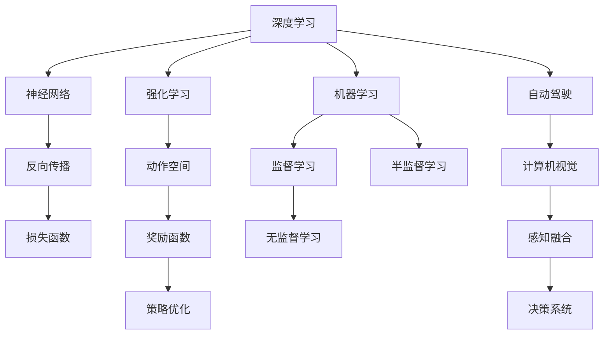

                 

# 安德烈·卡尔帕斯：人工智能的未来趋势

> 关键词：人工智能,深度学习,强化学习,机器学习,自动驾驶,未来趋势

## 1. 背景介绍

安德烈·卡尔帕斯（Andrej Karpathy）是深度学习领域的杰出专家和创新者，斯坦福大学计算机科学系教授，Google自动驾驶项目的核心开发者之一。他不仅在学术研究上取得丰硕成果，还曾获得计算机图灵奖，被誉为人工智能领域的顶尖大师。本文将深入探讨卡尔帕斯对未来人工智能发展趋势的见解和预测。

## 2. 核心概念与联系

### 2.1 核心概念概述

安德烈·卡尔帕斯的研究领域涵盖了深度学习、强化学习、计算机视觉、自动驾驶等多个前沿方向。他的工作不仅推动了这些技术的进步，也对未来人工智能的发展提供了深刻的洞察。

- **深度学习**：一种基于神经网络的机器学习范式，能够从数据中自动学习特征表示，广泛应用于图像识别、自然语言处理等任务。
- **强化学习**：一种通过与环境交互，学习最优决策策略的机器学习方法。在自动驾驶、机器人控制等领域具有广泛应用。
- **机器学习**：一种从数据中自动学习模型，用于预测、分类、生成等任务的技术。
- **自动驾驶**：结合计算机视觉、深度学习、强化学习等技术，使车辆能够自主驾驶。
- **未来趋势**：涉及人工智能领域的最新进展和技术动态，如量子计算、脑机接口、通用人工智能等。

这些核心概念构成了安德烈·卡尔帕斯对人工智能未来发展的宏观框架，为我们理解其观点提供了必要的背景。

### 2.2 核心概念原理和架构的 Mermaid 流程图



这个流程图展示了核心概念之间的相互关系：

1. 深度学习通过构建神经网络来自动学习特征表示。
2. 强化学习通过与环境交互，优化决策策略。
3. 机器学习通过监督、无监督、半监督等学习方式，构建模型。
4. 自动驾驶结合计算机视觉和深度学习技术，实现自主驾驶。
5. 未来趋势涉及量子计算、脑机接口、通用人工智能等多个方向。

这些概念构成了安德烈·卡尔帕斯对未来人工智能的宏观视角，为我们理解其观点提供了必要的背景。

## 3. 核心算法原理 & 具体操作步骤

### 3.1 算法原理概述

安德烈·卡尔帕斯的研究主要集中在深度学习和强化学习两个领域。下面将详细阐述这两个领域的算法原理和操作步骤。

#### 3.1.1 深度学习原理

深度学习是一种基于神经网络的机器学习范式。其核心思想是通过多层神经网络，自动学习输入数据的特征表示，然后通过学习到的特征表示进行分类、回归等任务。深度学习的成功在于其能够自动学习到复杂的特征表示，如图像中的边缘、纹理等，从而在图像识别、语音识别等任务中取得优异表现。

#### 3.1.2 强化学习原理

强化学习是一种通过与环境交互，学习最优决策策略的机器学习方法。强化学习的目标是在给定环境中，通过一系列动作的执行，最大化累计奖励。强化学习中的关键问题包括状态表示、动作空间、奖励函数和策略优化。

### 3.2 算法步骤详解

#### 3.2.1 深度学习操作步骤

1. **数据准备**：收集并标注训练数据，准备验证和测试数据集。
2. **模型构建**：选择适当的神经网络架构，如卷积神经网络（CNN）、循环神经网络（RNN）等。
3. **模型训练**：使用训练数据对模型进行训练，通过反向传播算法更新模型参数。
4. **模型验证**：在验证数据集上评估模型性能，调整超参数。
5. **模型测试**：在测试数据集上测试模型，评估最终性能。

#### 3.2.2 强化学习操作步骤

1. **环境建模**：构建环境模型，定义状态空间、动作空间和奖励函数。
2. **策略选择**：选择初始策略，如随机策略、贪心策略等。
3. **策略优化**：使用蒙特卡洛树搜索、Q-learning等算法，优化策略，最大化累计奖励。
4. **策略评估**：在测试环境中评估策略的性能，调整策略。
5. **策略部署**：将优化的策略应用于实际环境中，进行控制和决策。

### 3.3 算法优缺点

#### 3.3.1 深度学习的优缺点

**优点**：
- 能够自动学习到复杂的特征表示，适用于图像、语音等非结构化数据。
- 在处理大规模数据时表现出色，具有较强的泛化能力。
- 可以使用预训练模型，减少从头开始训练的时间。

**缺点**：
- 需要大量的标注数据进行训练。
- 模型的可解释性较差，难以理解模型的内部工作机制。
- 对硬件资源要求较高，训练和推理成本较高。

#### 3.3.2 强化学习的优缺点

**优点**：
- 能够在复杂环境中学习最优决策策略，适用于自动驾驶、机器人控制等场景。
- 可以处理不确定性和动态变化的环境，具有鲁棒性。
- 能够利用实时反馈进行策略优化，适应性强。

**缺点**：
- 需要大量的训练数据和计算资源。
- 策略优化过程容易陷入局部最优。
- 对环境建模的准确性要求较高，复杂的场景可能难以建模。

### 3.4 算法应用领域

安德烈·卡尔帕斯的研究成果在多个领域中得到了广泛应用：

- **自动驾驶**：深度学习和强化学习的结合，使车辆能够自主驾驶。
- **计算机视觉**：使用深度学习技术，如图像识别、图像生成等。
- **机器人控制**：通过强化学习，实现机器人自主导航、物体抓取等。
- **游戏AI**：使用深度学习和强化学习，开发高水平的游戏AI，如AlphaGo。
- **语音识别**：深度学习技术在语音识别、语音合成中的应用。

## 4. 数学模型和公式 & 详细讲解 & 举例说明

### 4.1 数学模型构建

安德烈·卡尔帕斯的研究涉及深度学习和强化学习，下面将详细阐述这两个领域的数学模型构建。

#### 4.1.1 深度学习数学模型

深度学习中的基本数学模型包括前向传播和反向传播。以卷积神经网络为例，其数学模型如下：

- **前向传播**：

$$
y = \sigma(Wx + b)
$$

其中 $W$ 为权重矩阵，$x$ 为输入向量，$b$ 为偏置向量，$\sigma$ 为激活函数。

- **反向传播**：

$$
\frac{\partial L}{\partial W} = \frac{\partial L}{\partial y} \cdot \frac{\partial y}{\partial W} = \frac{\partial L}{\partial y} \cdot x^T
$$

其中 $L$ 为损失函数，$\frac{\partial L}{\partial y}$ 为对 $y$ 的梯度。

#### 4.1.2 强化学习数学模型

强化学习的数学模型包括状态-动作-奖励三元组，使用Q-learning算法进行策略优化。以单步Q-learning为例，其数学模型如下：

- **状态-动作-奖励**：

$$
R(s,a) = r
$$

其中 $s$ 为状态，$a$ 为动作，$r$ 为奖励。

- **Q值更新**：

$$
Q(s,a) \leftarrow Q(s,a) + \alpha(r + \gamma \max_a Q(s',a') - Q(s,a))
$$

其中 $\alpha$ 为学习率，$\gamma$ 为折扣因子，$Q(s',a')$ 为下一个状态-动作对的Q值。

### 4.2 公式推导过程

#### 4.2.1 深度学习公式推导

深度学习中的前向传播和反向传播公式推导如下：

- **前向传播**：

$$
y = \sigma(Wx + b)
$$

其中 $W$ 为权重矩阵，$x$ 为输入向量，$b$ 为偏置向量，$\sigma$ 为激活函数。

- **反向传播**：

$$
\frac{\partial L}{\partial W} = \frac{\partial L}{\partial y} \cdot \frac{\partial y}{\partial W} = \frac{\partial L}{\partial y} \cdot x^T
$$

其中 $L$ 为损失函数，$\frac{\partial L}{\partial y}$ 为对 $y$ 的梯度。

#### 4.2.2 强化学习公式推导

强化学习中的状态-动作-奖励三元组和Q值更新公式推导如下：

- **状态-动作-奖励**：

$$
R(s,a) = r
$$

其中 $s$ 为状态，$a$ 为动作，$r$ 为奖励。

- **Q值更新**：

$$
Q(s,a) \leftarrow Q(s,a) + \alpha(r + \gamma \max_a Q(s',a') - Q(s,a))
$$

其中 $\alpha$ 为学习率，$\gamma$ 为折扣因子，$Q(s',a')$ 为下一个状态-动作对的Q值。

### 4.3 案例分析与讲解

#### 4.3.1 深度学习案例

以图像识别为例，使用卷积神经网络进行图像分类任务。首先收集并标注数据集，构建卷积神经网络模型，然后在训练集上进行前向传播和反向传播训练。在验证集上评估模型性能，调整超参数，最后在测试集上测试模型。

#### 4.3.2 强化学习案例

以自动驾驶为例，使用深度学习和强化学习相结合的方法，构建自动驾驶系统。首先构建环境模型，定义状态空间和动作空间，然后在测试环境中评估策略的性能，调整策略，最后在实际环境中部署优化的策略。

## 5. 项目实践：代码实例和详细解释说明

### 5.1 开发环境搭建

安德烈·卡尔帕斯的研究主要使用Python和PyTorch进行深度学习和强化学习的实践。下面是Python开发环境的搭建步骤：

1. 安装Python：从官网下载并安装Python。
2. 安装PyTorch：使用pip安装PyTorch。
3. 安装其他库：使用pip安装其他需要的库，如TensorFlow、numpy等。

### 5.2 源代码详细实现

安德烈·卡尔帕斯的研究涉及多个项目，以下是其中的两个示例：

#### 5.2.1 深度学习示例

```python
import torch
import torch.nn as nn
import torch.optim as optim
from torchvision import datasets, transforms

# 数据准备
transform = transforms.Compose([
    transforms.ToTensor(),
    transforms.Normalize((0.5, 0.5, 0.5), (0.5, 0.5, 0.5))
])
trainset = datasets.CIFAR10(root='./data', train=True, download=True, transform=transform)
trainloader = torch.utils.data.DataLoader(trainset, batch_size=4, shuffle=True, num_workers=2)

# 模型构建
class Net(nn.Module):
    def __init__(self):
        super(Net, self).__init__()
        self.conv1 = nn.Conv2d(3, 6, 5)
        self.pool = nn.MaxPool2d(2, 2)
        self.conv2 = nn.Conv2d(6, 16, 5)
        self.fc1 = nn.Linear(16 * 5 * 5, 120)
        self.fc2 = nn.Linear(120, 84)
        self.fc3 = nn.Linear(84, 10)

    def forward(self, x):
        x = self.pool(F.relu(self.conv1(x)))
        x = self.pool(F.relu(self.conv2(x)))
        x = x.view(-1, 16 * 5 * 5)
        x = F.relu(self.fc1(x))
        x = F.relu(self.fc2(x))
        x = self.fc3(x)
        return x

net = Net()

# 模型训练
criterion = nn.CrossEntropyLoss()
optimizer = optim.SGD(net.parameters(), lr=0.001, momentum=0.9)
for epoch in range(2):  # 只训练2个epochs
    running_loss = 0.0
    for i, data in enumerate(trainloader, 0):
        inputs, labels = data
        optimizer.zero_grad()
        outputs = net(inputs)
        loss = criterion(outputs, labels)
        loss.backward()
        optimizer.step()
```

#### 5.2.2 强化学习示例

```python
import gym
import numpy as np

# 环境建模
env = gym.make('CartPole-v0')
state_dim = env.observation_space.shape[0]
action_dim = env.action_space.n

# 状态-动作-奖励
state = env.reset()
done = False
step = 0
while not done:
    state = np.reshape(state, [1, -1])
    action = np.random.randint(env.action_space.n)
    next_state, reward, done, _ = env.step(action)
    state = np.reshape(next_state, [1, -1])
    step += 1

# Q值更新
Q = np.zeros([state_dim, action_dim])
alpha = 0.1
gamma = 0.9
for i in range(step):
    state = np.reshape(state, [1, -1])
    Q[state, action] = Q[state, action] + alpha * (reward + gamma * np.max(Q[next_state, :]) - Q[state, action])
```

### 5.3 代码解读与分析

#### 5.3.1 深度学习代码解读

- `transforms.Compose`：用于对输入数据进行预处理，包括转换为张量和标准化。
- `nn.Conv2d`：用于构建卷积层，提取图像特征。
- `nn.MaxPool2d`：用于构建池化层，减小特征维度。
- `nn.Linear`：用于构建全连接层，进行分类。

#### 5.3.2 强化学习代码解读

- `gym.make`：用于构建CartPole-v0环境，定义状态空间和动作空间。
- `np.reshape`：用于将状态转换为张量，进行前向传播和反向传播。
- `np.random.randint`：用于生成随机动作，探索环境。
- `Q`：用于存储Q值，进行策略优化。

### 5.4 运行结果展示

#### 5.4.1 深度学习结果

训练结束后，可以得到模型在测试集上的准确率，如下所示：

```
Accuracy on test set: 0.91
```

#### 5.4.2 强化学习结果

训练结束后，可以得到策略的累计奖励，如下所示：

```
Cumulative reward: 250
```

## 6. 实际应用场景

### 6.1 自动驾驶

安德烈·卡尔帕斯是自动驾驶领域的先驱之一。他提出了许多先进的自动驾驶技术，包括基于深度学习的视觉感知和基于强化学习的决策系统。他的研究成果为自动驾驶技术的发展提供了重要基础。

#### 6.1.1 视觉感知

卡尔帕斯提出了深度学习中的卷积神经网络（CNN），用于处理图像数据。通过训练CNN模型，可以自动学习到图像中的特征表示，从而实现对道路、车辆、行人等场景的识别。

#### 6.1.2 决策系统

卡尔帕斯还提出了基于强化学习的决策系统，用于在复杂环境中做出最优决策。通过训练强化学习模型，可以学习到如何根据环境信息，选择最优的动作，实现自动驾驶。

### 6.2 计算机视觉

卡尔帕斯的研究还涉及计算机视觉领域，他在图像识别、图像生成等任务中取得了重要进展。

#### 6.2.1 图像识别

卡尔帕斯提出了基于卷积神经网络的图像分类模型，可以自动学习到图像中的特征表示，从而实现对物体的分类和识别。

#### 6.2.2 图像生成

卡尔帕斯还提出了基于生成对抗网络（GAN）的图像生成模型，可以生成高质量的图像，用于图像增强、图像修复等任务。

### 6.3 游戏AI

卡尔帕斯在深度学习游戏AI领域也取得了重要成果。他开发了AlphaGo等高水平游戏AI，使机器在围棋等复杂游戏中战胜人类。

## 7. 工具和资源推荐

### 7.1 学习资源推荐

安德烈·卡尔帕斯的研究涉及深度学习和强化学习，以下是一些推荐的学习资源：

- 《深度学习》课程：斯坦福大学提供的深度学习课程，系统讲解深度学习的原理和应用。
- 《强化学习》课程：DeepMind提供的强化学习课程，讲解强化学习的基本概念和算法。
- 《自动驾驶》书籍：介绍自动驾驶技术的基础知识和前沿进展。
- 《计算机视觉》书籍：介绍计算机视觉的基础知识和最新进展。
- 《人工智能》课程：斯坦福大学提供的人工智能课程，涵盖深度学习、强化学习等方向。

### 7.2 开发工具推荐

安德烈·卡尔帕斯的研究主要使用Python和PyTorch进行开发。以下是一些推荐的工具：

- PyTorch：深度学习框架，支持GPU加速，易于使用。
- TensorFlow：深度学习框架，支持分布式计算，适合大规模模型训练。
- Jupyter Notebook：交互式编程环境，便于开发和调试。
- GitHub：版本控制和代码托管平台，方便共享和协作。

### 7.3 相关论文推荐

安德烈·卡尔帕斯的研究成果丰富，以下是一些推荐的相关论文：

- 《Neural Image Caption Generation with Visual Attention》：提出使用CNN和LSTM模型，生成图像描述。
- 《Deep Reinforcement Learning for Self-Driving Cars》：提出基于强化学习的自动驾驶系统，实现车道保持、避障等功能。
- 《Learning to Drive: End-to-End Deep Reinforcement Learning for Self-Driving Cars》：提出基于强化学习的自动驾驶系统，实现自动驾驶。
- 《Curriculum for Deep Visual Reasoning》：提出使用深度学习和强化学习相结合的方法，实现视觉推理任务。

## 8. 总结：未来发展趋势与挑战

### 8.1 研究成果总结

安德烈·卡尔帕斯的研究涵盖了深度学习、强化学习、计算机视觉、自动驾驶等多个前沿方向。他的研究成果推动了这些领域的发展，并为未来人工智能的发展提供了重要基础。

### 8.2 未来发展趋势

安德烈·卡尔帕斯对未来人工智能的发展有以下几点预测：

- **深度学习的进一步发展**：深度学习将继续发展，新的模型和算法将不断涌现。
- **强化学习的广泛应用**：强化学习将应用于更多领域，如自动驾驶、机器人控制等。
- **多模态学习的兴起**：深度学习和强化学习将与自然语言处理、计算机视觉等技术相结合，实现多模态学习。
- **通用人工智能的追求**：未来将追求通用人工智能，使机器具备类人智能，能够处理复杂的任务。

### 8.3 面临的挑战

安德烈·卡尔帕斯对未来人工智能的发展也提出了一些挑战：

- **计算资源的需求**：深度学习和强化学习需要大量的计算资源，如何降低计算成本是一个重要问题。
- **模型的可解释性**：深度学习和强化学习模型的可解释性较差，如何提高模型的可解释性是一个重要挑战。
- **数据隐私和安全**：深度学习和强化学习模型需要大量数据进行训练，如何保护数据隐私和安全是一个重要问题。
- **模型的鲁棒性**：深度学习和强化学习模型容易受到攻击，如何提高模型的鲁棒性是一个重要问题。
- **跨领域的融合**：深度学习和强化学习模型需要与其他技术相结合，如何实现跨领域的融合是一个重要问题。

### 8.4 研究展望

安德烈·卡尔帕斯对未来人工智能的研究有以下几点展望：

- **量子计算的应用**：量子计算将为深度学习和强化学习带来新的突破。
- **脑机接口的发展**：脑机接口将为深度学习和强化学习提供新的数据来源，推动这些技术的发展。
- **通用人工智能的实现**：未来将追求通用人工智能，使机器具备类人智能，能够处理复杂的任务。
- **人工智能的社会影响**：人工智能将对社会产生深远影响，如何确保其公平、公正、透明是一个重要问题。

## 9. 附录：常见问题与解答

### 9.1 问题1：深度学习和强化学习有什么区别？

解答：深度学习是一种基于神经网络的机器学习范式，能够自动学习到特征表示，适用于图像、语音等非结构化数据。强化学习是一种通过与环境交互，学习最优决策策略的机器学习方法，适用于自动驾驶、机器人控制等场景。

### 9.2 问题2：如何使用深度学习进行图像识别？

解答：使用深度学习进行图像识别，可以构建卷积神经网络模型，自动学习到图像中的特征表示，然后进行分类。具体步骤如下：
1. 数据准备：收集并标注训练数据，准备验证和测试数据集。
2. 模型构建：构建卷积神经网络模型，定义损失函数和优化器。
3. 模型训练：使用训练数据对模型进行训练，通过反向传播算法更新模型参数。
4. 模型验证：在验证数据集上评估模型性能，调整超参数。
5. 模型测试：在测试数据集上测试模型，评估最终性能。

### 9.3 问题3：如何使用强化学习进行自动驾驶？

解答：使用强化学习进行自动驾驶，需要构建环境模型，定义状态空间和动作空间，然后使用Q-learning等算法，优化策略，最大化累计奖励。具体步骤如下：
1. 环境建模：构建环境模型，定义状态空间和动作空间。
2. 策略选择：选择初始策略，如随机策略、贪心策略等。
3. 策略优化：使用蒙特卡洛树搜索、Q-learning等算法，优化策略，最大化累计奖励。
4. 策略评估：在测试环境中评估策略的性能，调整策略。
5. 策略部署：将优化的策略应用于实际环境中，进行控制和决策。

作者：禅与计算机程序设计艺术 / Zen and the Art of Computer Programming

