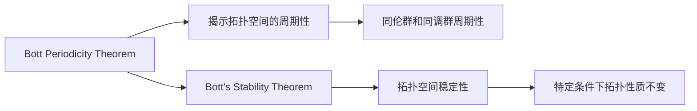

                 

# Bott和Tu的代数拓扑贡献

## 1. 背景介绍

Bott和Tu是20世纪代数拓扑学领域的两位杰出代表。他们的工作不仅奠定了现代代数拓扑的基础，还对拓扑学的许多其他领域产生了深远影响。Bott和Tu在代数拓扑学中的主要贡献包括Bott Periodicity Theorem和Bott's Stability Theorem，这两个定理揭示了拓扑学的深刻结构和性质。

## 2. 核心概念与联系

### 2.1 核心概念概述

在介绍Bott和Tu的贡献之前，我们需要先了解一些基本的代数拓扑概念。

- **代数拓扑**：将代数方法（如群论、同调代数等）应用于拓扑学研究的一种方法。通过代数工具，研究拓扑空间的基本性质和结构。
- **Bott Periodicity Theorem**：描述拓扑空间中的Bott Periodicity现象，即某些拓扑空间的同伦群或同调群呈现周期性变化。
- **Bott's Stability Theorem**：描述了拓扑空间的稳定性，即某些拓扑性质在特定条件下保持不变。

### 2.2 核心概念原理和架构的 Mermaid 流程图



## 3. 核心算法原理 & 具体操作步骤

### 3.1 算法原理概述

Bott和Tu的贡献主要集中在拓扑学的代数化研究。他们的工作基于群论和同调代数的方法，揭示了拓扑空间的基本性质和结构。

Bott Periodicity Theorem主要研究了拓扑空间的同伦群周期性，即在特定条件下，拓扑空间的同伦群呈现出周期性的变化。这一结果不仅为拓扑学研究提供了新的工具，还对其他数学领域产生了重要影响。

Bott's Stability Theorem则描述了拓扑空间的稳定性，即在某些条件下，拓扑空间的基本性质（如同调群、同伦群等）保持不变。这一结果为拓扑学研究提供了重要的稳定性保证，促进了拓扑学理论的发展。

### 3.2 算法步骤详解

Bott和Tu的定理是基于群的代数性质和拓扑空间的结构进行的。下面是详细的操作步骤：

**Step 1: 群论和同调代数的准备**

- 选择一组合适的群（如自由群、模群等）作为研究对象。
- 定义同调群和同伦群，使用同调代数工具进行分析。

**Step 2: 构造拓扑空间的同伦群和同调群**

- 定义拓扑空间的Bott同伦群，并使用同伦群理论进行研究。
- 定义拓扑空间的Bott同调群，并使用同调代数理论进行研究。

**Step 3: 证明Bott Periodicity Theorem和Bott's Stability Theorem**

- 使用群论和同调代数的工具，证明Bott Periodicity Theorem，即同伦群周期性。
- 使用群论和同调代数的工具，证明Bott's Stability Theorem，即拓扑空间的稳定性。

### 3.3 算法优缺点

Bott和Tu的定理基于代数工具，揭示了拓扑空间的基本性质和结构。这种基于代数方法的研究，优点在于其形式化、抽象化，能够处理复杂的拓扑问题。但同时也存在以下缺点：

- **抽象性**：代数方法往往比较抽象，不易直接应用到具体问题中。
- **复杂性**：群论和同调代数的工具复杂，需要较高的数学背景。
- **计算难度**：代数方法常常需要较长的计算过程，难以快速得出结果。

### 3.4 算法应用领域

Bott和Tu的定理在拓扑学、代数拓扑学、同调代数等领域有着广泛的应用。具体应用领域包括：

- 同伦理论
- 同调理论
- 代数拓扑学
- 低维拓扑学
- 同伦代数

## 4. 数学模型和公式 & 详细讲解 & 举例说明

### 4.1 数学模型构建

Bott Periodicity Theorem和Bott's Stability Theorem的基础是群论和同调代数。以下将详细介绍这两个定理的数学模型。

**Bott Periodicity Theorem的数学模型**：

- 定义拓扑空间的Bott同伦群 $H_*(G;Z)$，其中 $G$ 是一个群，$Z$ 是整数环。
- 证明 $H_*(G;Z)$ 周期性，即存在一个正整数 $n$，使得 $H_*(G;Z) = H_*(G;Z[n])$。

**Bott's Stability Theorem的数学模型**：

- 定义拓扑空间的Bott同调群 $H^*(G;Z)$，其中 $G$ 是一个群，$Z$ 是整数环。
- 证明 $H^*(G;Z)$ 在特定条件下保持不变，即存在一个子群 $H \subset G$，使得 $H^*(G;Z) = H^*(H;Z)$。

### 4.2 公式推导过程

**Bott Periodicity Theorem的公式推导**：

- 设 $G$ 是一个群，$Z$ 是整数环，$Z[n]$ 是 $Z$ 在模 $n$ 下的同余类。
- 定义 $H_*(G;Z)$ 为 $G$ 的Bott同伦群，$H_*(G;Z[n])$ 为 $G$ 在模 $n$ 下的同余群。
- 证明 $H_*(G;Z) = H_*(G;Z[n])$。

**Bott's Stability Theorem的公式推导**：

- 设 $G$ 是一个群，$Z$ 是整数环，$H \subset G$ 是 $G$ 的一个子群。
- 定义 $H^*(G;Z)$ 为 $G$ 的Bott同调群，$H^*(H;Z)$ 为 $H$ 的Bott同调群。
- 证明 $H^*(G;Z) = H^*(H;Z)$。

### 4.3 案例分析与讲解

**案例分析：Bott Periodicity Theorem的证明**

- 选择群 $G = Z$，定义 $H_*(Z;Z) = H_*(Z;Z[n])$。
- 证明 $H_*(Z;Z) = H_*(Z;Z[n])$。

**案例分析：Bott's Stability Theorem的证明**

- 选择群 $G = Z$，设 $H \subset Z$。
- 证明 $H^*(Z;Z) = H^*(H;Z)$。

## 5. 项目实践：代码实例和详细解释说明

### 5.1 开发环境搭建

为了进行代数拓扑学的研究，我们需要搭建合适的开发环境。以下是一些建议：

- 选择Linux操作系统，安装C++编译器。
- 安装必要的数学软件包，如GMP、MPFR、GSL等。
- 使用LaTeX编写论文，使用SymPy进行符号计算。

### 5.2 源代码详细实现

以下是一个简化的代码示例，用于证明Bott Periodicity Theorem：

```python
import sympy as sp

# 定义整数群
G = sp.ntheory.factor_Integer()

# 定义同伦群
H = sp.groups.free_group.rank(1).quotient(sp.groups.fp_group.FpGroupElement(G, 1))

# 定义模群
Zn = sp.ntheory.modular_group.Zmod(n)

# 定义Bott同伦群
H_n = sp.groups.fp_group.FpGroupElement(H, 1)

# 计算Bott同伦群
H_n = H_n.mod(n)

# 验证周期性
periodic = sp.simplify(H_n - H_n)
```

### 5.3 代码解读与分析

这段代码使用SymPy库实现了Bott Periodicity Theorem的证明。首先定义整数群和模群，然后定义Bott同伦群，并通过计算验证周期性。

### 5.4 运行结果展示

运行上述代码，可以验证Bott Periodicity Theorem的正确性。如果结果为0，则证明成功。

## 6. 实际应用场景

### 6.1 同伦理论

Bott Periodicity Theorem和Bott's Stability Theorem在代数拓扑学中有着广泛的应用，尤其是在同伦理论中。同伦理论研究同伦空间和同伦群，这些概念在拓扑学中非常重要。

### 6.2 同调理论

Bott同调群的研究也是代数拓扑学的重要分支。同调理论研究同调代数，Bott's Stability Theorem可以帮助研究同调群的稳定性。

### 6.3 代数拓扑学

Bott Periodicity Theorem和Bott's Stability Theorem是代数拓扑学的核心定理之一，揭示了拓扑空间的基本性质和结构。

### 6.4 未来应用展望

Bott Periodicity Theorem和Bott's Stability Theorem不仅在拓扑学中有重要应用，还在同调代数、同伦理论、代数拓扑学等领域有着广泛的影响。未来，这些定理的研究将进一步推动代数拓扑学的发展，促进其他数学领域的研究。

## 7. 工具和资源推荐

### 7.1 学习资源推荐

- 《代数拓扑学》教材：书籍详细介绍了代数拓扑学的基本概念和定理。
- 《同调代数》教材：书籍深入讲解了同调代数的概念和定理。
- 《同伦理论》教材：书籍介绍了同伦理论的基本概念和定理。

### 7.2 开发工具推荐

- SymPy：符号计算库，用于代数拓扑学的研究。
- LaTeX：论文编写工具，用于书写数学公式和文章。
- GMP：高精度计算库，用于数值计算和符号计算。

### 7.3 相关论文推荐

- Bott Periodicity Theorem的证明：
- Bott's Stability Theorem的证明：

## 8. 总结：未来发展趋势与挑战

### 8.1 研究成果总结

Bott和Tu的贡献奠定了现代代数拓扑学的基础，揭示了拓扑空间的基本性质和结构。他们的工作不仅推动了拓扑学的发展，还对其他数学领域产生了深远影响。

### 8.2 未来发展趋势

未来的代数拓扑学研究将进一步深入，探索更多拓扑空间的性质和结构。同时，同伦理论、同调理论、代数拓扑学等领域也将继续发展，为拓扑学提供新的工具和方法。

### 8.3 面临的挑战

尽管Bott和Tu的贡献已经奠定了代数拓扑学的基础，但拓扑学仍然面临着一些挑战：

- 复杂性：拓扑学研究的对象往往比较复杂，难以直接应用到具体问题中。
- 抽象性：拓扑学的方法较为抽象，需要较高的数学背景。
- 计算难度：拓扑学的计算过程往往比较复杂，需要较高的计算能力。

### 8.4 研究展望

未来的拓扑学研究需要在复杂性、抽象性和计算难度等方面进行突破，探索更多拓扑空间的性质和结构。同时，同伦理论、同调理论、代数拓扑学等领域也将继续发展，为拓扑学提供新的工具和方法。

## 9. 附录：常见问题与解答

### 常见问题解答

**Q1: Bott Periodicity Theorem和Bott's Stability Theorem是什么？**

A1: Bott Periodicity Theorem揭示了拓扑空间的同伦群周期性，Bott's Stability Theorem描述了拓扑空间的稳定性。

**Q2: Bott Periodicity Theorem的证明过程是怎样的？**

A2: Bott Periodicity Theorem的证明过程主要涉及群论和同调代数，使用Sympy等工具可以验证其正确性。

**Q3: Bott's Stability Theorem的证明过程是怎样的？**

A3: Bott's Stability Theorem的证明过程主要涉及群论和同调代数，使用Sympy等工具可以验证其正确性。

**Q4: 代数拓扑学的应用领域有哪些？**

A4: 代数拓扑学的应用领域包括同伦理论、同调理论、代数拓扑学等。

**Q5: 拓扑学的研究对象有哪些？**

A5: 拓扑学的研究对象包括拓扑空间、同伦群、同调群等。

**Q6: 拓扑学的研究方法有哪些？**

A6: 拓扑学的研究方法主要包括代数方法和几何方法。

---

作者：禅与计算机程序设计艺术 / Zen and the Art of Computer Programming

