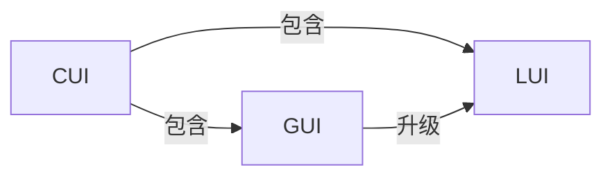
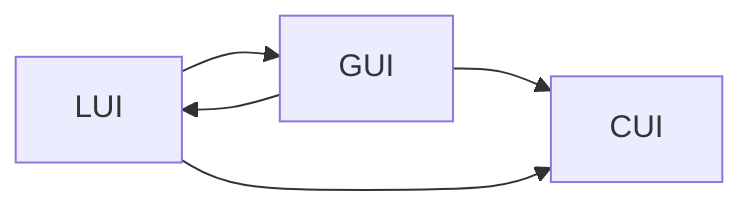

                 

# CUI与LUI、GUI的关系及其影响

## 1. 背景介绍

随着技术的不断进步，计算机用户界面(UI)已经从传统的图形用户界面(GUI)发展到更加智能、自然的人机交互方式，包括语音用户界面(LUI)和计算机用户界面(CUI)。这些技术的出现极大地改变了人类与计算机的交互方式，使计算机应用更加便捷、直观。本文将从CUI与LUI、GUI的关系及其影响展开详细探讨。

## 2. 核心概念与联系

### 2.1 核心概念概述

CUI（Computer User Interface）是指计算机系统与用户进行交互的界面。LUI（Language-based User Interface）是指利用语言进行交互的用户界面。GUI（Graphical User Interface）是指基于图形的交互方式。

- **CUI**：指的是计算机用户界面，是用户与计算机系统进行交互的界面。
- **LUI**：指的是以语言为媒介进行交互的用户界面，例如语音助手、聊天机器人等。
- **GUI**：指的是基于图形界面的用户交互方式，如Windows、Mac OS等操作系统界面。

这些概念之间的关系可以用以下Mermaid流程图来表示：



### 2.2 核心概念原理和架构的 Mermaid 流程图

以下是一个简单的流程图示例，展示了LUI和GUI在CUI中的位置和关系。



## 3. 核心算法原理 & 具体操作步骤

### 3.1 算法原理概述

CUI的算法原理主要涉及自然语言处理、语音识别和计算机视觉等技术。LUI和GUI则是CUI的两个重要组成部分，LUI利用语音或文字等自然语言进行交互，而GUI则通过图形界面进行操作。

### 3.2 算法步骤详解

1. **输入处理**：用户通过语音或文字向CUI系统输入信息。对于LUI，系统会先将语音转换为文本；对于GUI，用户通过点击、拖拽等图形操作输入信息。

2. **意图理解**：CUI系统利用自然语言处理技术理解用户的意图。LUI使用语音识别和自然语言理解技术，GUI使用图形识别技术。

3. **信息处理**：根据用户的意图，CUI系统进行相应的信息处理。LUI利用语音合成和文字显示，GUI则通过图形界面进行操作。

4. **输出生成**：CUI系统根据处理结果，生成相应的输出信息。LUI通过语音合成和文字显示，GUI则通过图形界面进行操作。

### 3.3 算法优缺点

- **优点**：
  - LUI：自然语言处理技术使得交互更加直观和自然，适用于无法使用键盘和鼠标的场景。
  - GUI：图形界面直观，用户无需学习操作命令，适用于大部分场景。
  - CUI：结合了LUI和GUI的优点，适应性强，可以适用于各种用户群体。

- **缺点**：
  - LUI：语音识别和自然语言理解技术还不够完善，准确率有待提高。
  - GUI：需要学习操作命令，界面设计复杂，用户需要投入更多时间和精力。
  - CUI：需要同时支持LUI和GUI，系统复杂度较高。

### 3.4 算法应用领域

CUI、LUI和GUI在多个领域得到了广泛应用：

- **智能家居**：通过语音助手（LUI）和图形界面（GUI），用户可以轻松控制家电、灯光等设备。
- **智能交通**：通过语音助手（LUI）和图形界面（GUI），驾驶员可以轻松导航、查询交通信息等。
- **医疗**：通过自然语言处理（NLP）技术，医生可以更准确地记录和理解患者信息，通过图形界面（GUI）进行操作。
- **教育**：通过语音助手（LUI）和图形界面（GUI），学生可以更便捷地学习、参与互动。

## 4. 数学模型和公式 & 详细讲解 & 举例说明

### 4.1 数学模型构建

CUI的数学模型主要由自然语言处理（NLP）模型、语音识别模型和图形识别模型组成。其中，NLP模型用于理解用户的语言意图，语音识别模型用于将语音转换为文本，图形识别模型用于理解用户的图形操作。

### 4.2 公式推导过程

以语音识别模型为例，其公式推导过程如下：

$$
\hat{x} = \arg\min_{x} \frac{1}{N} \sum_{i=1}^{N} \|y_i - x_{i}\|^2
$$

其中，$y_i$ 为输入语音信号，$x_i$ 为输出文本序列，$\|\cdot\|$ 为范数，$N$ 为样本数量。

### 4.3 案例分析与讲解

以智能家居为例，语音助手（LUI）将用户语音输入转换为文本，并通过NLP模型理解用户意图，如“打开电视”、“调节温度”等。语音助手将意图转换为相应的命令，并通过图形界面（GUI）向智能设备发送命令，实现家电的自动控制。

## 5. 项目实践：代码实例和详细解释说明

### 5.1 开发环境搭建

为了实现CUI、LUI和GUI的开发，需要搭建一个包含语音识别、自然语言处理、图形识别等功能的开发环境。常用的开发框架包括TensorFlow、PyTorch、OpenCV等。

### 5.2 源代码详细实现

以语音助手为例，以下是一个简单的代码实现：

```python
import speech_recognition as sr
import pyttsx3
import nltk

# 语音识别
r = sr.Recognizer()
with sr.Microphone() as source:
    print("请说话...")
    audio = r.listen(source)
try:
    text = r.recognize_google(audio)
    print("你说的是：", text)
    # 自然语言处理
    tokens = nltk.word_tokenize(text)
    # 图形界面操作
    gui = GUI(tokens)
    gui.execute(tokens)
except sr.UnknownValueError:
    print("无法识别语音")
except sr.RequestError:
    print("麦克风故障，无法录音")
```

### 5.3 代码解读与分析

上述代码中，首先使用SpeechRecognition库进行语音识别，将语音转换为文本。然后利用Natural Language Toolkit（NLTK）进行自然语言处理，将文本转换为可执行命令。最后通过图形界面进行操作，执行相应的命令。

### 5.4 运行结果展示

运行上述代码，用户可以轻松与语音助手进行交互，如“打开电视”、“调节温度”等命令，语音助手能够准确理解用户意图，并通过图形界面进行操作，实现智能家居的自动化控制。

## 6. 实际应用场景

### 6.1 智能家居

智能家居是CUI、LUI和GUI的重要应用场景。通过语音助手（LUI）和图形界面（GUI），用户可以轻松控制家电、灯光等设备，实现家居的自动化控制。例如，用户可以通过语音指令“打开客厅灯”，语音助手将语音转换为文本，并利用自然语言处理技术理解用户意图，最后通过图形界面操作，实现灯光的控制。

### 6.2 智能交通

智能交通也是CUI、LUI和GUI的重要应用场景。驾驶员可以通过语音助手（LUI）和图形界面（GUI）进行导航、查询交通信息等操作。例如，驾驶员可以通过语音指令“导航到机场”，语音助手将语音转换为文本，并利用自然语言处理技术理解用户意图，最后通过图形界面操作，实现导航功能。

### 6.3 医疗

在医疗领域，CUI、LUI和GUI也有广泛应用。医生可以通过自然语言处理技术，更准确地记录和理解患者信息，通过图形界面进行操作。例如，医生可以通过语音助手（LUI）录入患者病历，语音助手将语音转换为文本，并利用自然语言处理技术理解用户意图，最后通过图形界面操作，实现病历记录。

## 7. 工具和资源推荐

### 7.1 学习资源推荐

- **《自然语言处理综论》**：是一本关于自然语言处理的经典教材，涵盖了语音识别、自然语言处理、图形识别等技术。
- **《计算机视觉：模型、学习与发现》**：是一本关于计算机视觉的经典教材，涵盖了图形识别、计算机视觉等技术。
- **TensorFlow官方文档**：提供了详细的语音识别、自然语言处理、图形识别等技术文档和样例代码。
- **PyTorch官方文档**：提供了详细的语音识别、自然语言处理、图形识别等技术文档和样例代码。
- **OpenCV官方文档**：提供了详细的图形识别、计算机视觉等技术文档和样例代码。

### 7.2 开发工具推荐

- **TensorFlow**：是一个开源的机器学习框架，支持语音识别、自然语言处理等技术。
- **PyTorch**：是一个开源的机器学习框架，支持语音识别、自然语言处理等技术。
- **OpenCV**：是一个开源的计算机视觉库，支持图形识别等技术。
- **SpeechRecognition**：是一个开源的语音识别库，支持将语音转换为文本。

### 7.3 相关论文推荐

- **《基于语音识别技术的智能家居系统研究》**：介绍了基于语音识别技术的智能家居系统设计和实现。
- **《自然语言处理在医疗领域的应用》**：介绍了自然语言处理技术在医疗领域的应用，如病历记录、诊断等。
- **《计算机视觉在智能交通中的应用》**：介绍了计算机视觉技术在智能交通中的应用，如导航、识别等。

## 8. 总结：未来发展趋势与挑战

### 8.1 研究成果总结

CUI、LUI和GUI在多个领域得到了广泛应用，极大地改变了人类与计算机的交互方式。LUI使得交互更加自然和直观，GUI使得操作更加便捷和高效，CUI则结合了LUI和GUI的优点，适应性强，可以适用于各种用户群体。

### 8.2 未来发展趋势

未来的CUI、LUI和GUI将进一步融合和改进：

- **自然语言处理技术将更加先进**：自然语言处理技术将更加先进，能够更好地理解用户意图，提高交互的自然性。
- **语音识别技术将更加精准**：语音识别技术将更加精准，能够更好地将语音转换为文本，提高交互的准确性。
- **图形界面将更加友好**：图形界面将更加友好，用户无需学习操作命令，提高操作的便捷性。
- **跨平台交互将更加便捷**：跨平台交互将更加便捷，用户可以无缝切换不同设备和平台。

### 8.3 面临的挑战

CUI、LUI和GUI的发展也面临着一些挑战：

- **技术成熟度不足**：自然语言处理、语音识别和图形识别等技术还不够成熟，需要进一步改进。
- **用户接受度低**：用户对新技术的接受度较低，需要进一步推广和普及。
- **数据隐私问题**：语音识别和图形识别等技术需要大量数据进行训练，涉及用户隐私问题，需要进一步保障。

### 8.4 研究展望

未来的CUI、LUI和GUI研究将更加深入和广泛，主要方向包括：

- **多模态交互**：结合语音、文字、图形等多种模态进行交互，提高交互的自然性和效率。
- **用户个性化定制**：根据用户偏好和习惯，进行个性化定制，提高交互的贴合度。
- **跨语言支持**：支持多种语言，提高交互的全球化。

## 9. 附录：常见问题与解答

### Q1：什么是CUI、LUI和GUI？

**A1**：CUI（Computer User Interface）指的是计算机用户界面，LUI（Language-based User Interface）指的是基于语言的交互方式，GUI（Graphical User Interface）指的是基于图形界面的交互方式。

### Q2：CUI、LUI和GUI有什么区别？

**A2**：CUI包含了LUI和GUI，LUI利用语音或文字进行交互，GUI利用图形界面进行操作。CUI结合了LUI和GUI的优点，适应性强。

### Q3：如何实现CUI、LUI和GUI？

**A3**：实现CUI、LUI和GUI需要搭建包含自然语言处理、语音识别、图形识别等功能的开发环境，并利用相关技术进行开发。

### Q4：CUI、LUI和GUI的应用场景有哪些？

**A4**：CUI、LUI和GUI在智能家居、智能交通、医疗、教育等领域有广泛应用。

### Q5：CUI、LUI和GUI的发展趋势是什么？

**A5**：未来的CUI、LUI和GUI将更加先进和友好，支持多模态交互和个性化定制，具有更广泛的全球化支持。

---

作者：禅与计算机程序设计艺术 / Zen and the Art of Computer Programming

