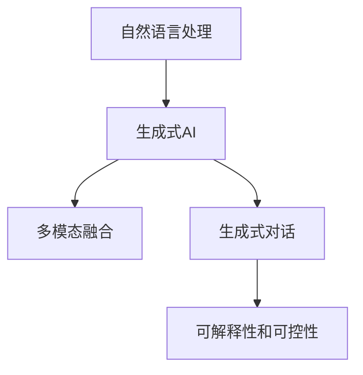

                 

# ChatGPT与交互革命

> 关键词：ChatGPT, 自然语言处理(NLP), 交互设计, 人机交互, 生成式AI, 多模态融合

## 1. 背景介绍

### 1.1 问题由来

随着人工智能技术的飞速发展，自然语言处理(NLP)成为推动AI向实际应用迈进的重要领域。传统基于规则的NLP系统往往难以适应自然语言的多样性和复杂性。而基于深度学习的生成式AI模型，如GPT-3、ChatGPT等，通过大规模无监督预训练，学习到丰富的语言知识，能够实现对自然语言的理解和生成，在众多应用场景中展现出强大潜力。

在实际应用中，传统的NLP系统通常只关注对文本信息的处理，如关键词提取、情感分析等。而ChatGPT等生成式AI模型不仅能够处理文本信息，还能通过多轮对话实现对用户语境的理解和回应用户需求，极大地提升了人机交互的效率和自然度。因此，ChatGPT等生成式AI模型正在引领一场交互革命，逐步改变人类与计算机的交互方式。

### 1.2 问题核心关键点

为了更好地理解ChatGPT等生成式AI模型如何影响交互设计，并挖掘其应用潜力，我们需要深入分析其核心技术和交互机制。

1. **大语言模型预训练**：ChatGPT等模型通过在大规模无标签文本数据上进行预训练，学习到通用语言知识，为后续微调和应用奠定基础。
2. **生成式对话架构**：通过基于Transformer的生成式架构，ChatGPT能够生成连贯且符合语境的文本，实现与用户的高质量对话。
3. **多模态融合**：ChatGPT不仅支持文本对话，还能集成图像、视频等多模态数据，实现更丰富的交互体验。
4. **可解释性和可控性**：ChatGPT通过提示设计和参数调整，可以提升生成内容的可解释性和可控性，帮助用户更好地理解和使用AI。
5. **持续学习与适应性**：ChatGPT通过增量学习，能够不断适应新的数据和语境，保持模型的实时性和灵活性。

这些核心关键点共同构成了ChatGPT等生成式AI模型强大的交互能力，使其在众多领域展现出巨大的应用前景。

## 2. 核心概念与联系

### 2.1 核心概念概述

为了更好地理解ChatGPT等生成式AI模型的交互设计，我们将介绍几个关键概念及其联系：

- **自然语言处理(NLP)**：通过计算机技术处理和理解自然语言，实现文本的自动生成、分类、摘要、翻译等任务。
- **生成式AI**：基于深度学习模型，通过大规模数据训练，自动生成文本、图像、音乐等多模态内容。
- **多模态融合**：将文本、图像、声音等多种数据形式进行融合，实现更为丰富和自然的人机交互体验。
- **生成式对话**：基于生成式模型，通过多轮对话实现对用户语境的理解和回应用户需求，提高交互的自然度和效率。
- **可解释性和可控性**：通过提示设计和参数调整，提升生成内容的可解释性和可控性，增强用户对AI的理解和信任。

这些核心概念共同构成了ChatGPT等生成式AI模型强大的交互能力，使其在众多领域展现出巨大的应用前景。

### 2.2 核心概念原理和架构的 Mermaid 流程图



这个流程图展示了ChatGPT等生成式AI模型从自然语言处理到多模态融合，再到生成式对话的完整交互设计流程。通过大规模无监督预训练，生成式AI模型学习到丰富的语言知识，为后续的生成式对话和多模态融合提供基础。

## 3. 核心算法原理 & 具体操作步骤

### 3.1 算法原理概述

ChatGPT等生成式AI模型的核心算法是基于Transformer架构的预训练语言模型，如GPT-3和GPT-4。这些模型通过在大规模无标签文本数据上进行预训练，学习到通用语言知识，再通过有监督微调适应特定任务。其交互设计的关键在于：

1. **生成式架构**：基于Transformer的生成式架构，通过自回归生成连贯且符合语境的文本，实现与用户的高质量对话。
2. **多模态融合**：将文本、图像、声音等多种数据形式进行融合，实现更为丰富和自然的人机交互体验。
3. **可解释性和可控性**：通过提示设计和参数调整，提升生成内容的可解释性和可控性，增强用户对AI的理解和信任。

### 3.2 算法步骤详解

ChatGPT等生成式AI模型的交互设计步骤如下：

1. **数据预处理**：将用户输入的文本和上下文信息进行预处理，转化为模型可以处理的输入格式。
2. **生成式对话**：基于预训练模型，生成符合语境的回应，实现与用户的多轮对话。
3. **多模态融合**：集成图像、视频等多模态数据，增强交互体验。
4. **可解释性和可控性**：通过提示设计和参数调整，提升生成内容的可解释性和可控性。
5. **持续学习与适应性**：通过增量学习，不断适应新的数据和语境，保持模型的实时性和灵活性。

### 3.3 算法优缺点

ChatGPT等生成式AI模型的交互设计具有以下优点：

1. **交互自然度提升**：通过生成式架构和多模态融合，实现与用户的高质量对话和丰富的交互体验。
2. **可解释性和可控性增强**：通过提示设计和参数调整，提升生成内容的可解释性和可控性，增强用户对AI的理解和信任。
3. **实时性和灵活性**：通过持续学习，不断适应新的数据和语境，保持模型的实时性和灵活性。

然而，ChatGPT等模型也存在以下缺点：

1. **数据依赖性强**：模型的性能很大程度上依赖于预训练数据的质量和数量。
2. **泛化能力有限**：模型面对特定领域或小规模数据时，泛化能力可能较弱。
3. **生成内容质量不稳定**：在某些情况下，生成的内容可能出现不连贯、不自然等问题。
4. **伦理和安全问题**：生成的内容可能包含偏见、误导性信息，甚至涉及伦理和安全问题。

### 3.4 算法应用领域

ChatGPT等生成式AI模型已经在多个领域展现出强大的交互设计能力，具体应用包括：

1. **客户服务**：通过自动回复和问题解答，实现24/7不间断的客户服务。
2. **智能助理**：作为个人助理，帮助用户完成日常任务，如日程管理、信息检索等。
3. **教育培训**：通过生成式对话和交互式学习，提供个性化的教育和培训体验。
4. **内容创作**：生成高质量的文章、报告、摘要等文本内容，支持内容创作和编辑。
5. **娱乐社交**：通过生成式对话和互动，提供丰富的娱乐和社交体验，如聊天机器人、游戏AI等。

## 4. 数学模型和公式 & 详细讲解 & 举例说明

### 4.1 数学模型构建

ChatGPT等生成式AI模型的核心数学模型是Transformer架构，其核心组成部分包括自注意力机制、位置编码、多头注意力等。

Transformer架构通过多头自注意力机制，在输入序列中捕捉不同位置之间的关系，实现对文本的语义理解和生成。

### 4.2 公式推导过程

Transformer架构的数学推导过程如下：

1. **自注意力机制**：通过多头自注意力机制，模型可以捕捉输入序列中不同位置之间的关系，实现对文本的语义理解和生成。
2. **位置编码**：通过位置编码，模型可以区分输入序列中不同位置的信息，提高模型的定位能力。
3. **多头注意力**：通过多头注意力机制，模型可以从多个角度捕捉输入序列的语义信息，提高模型的表达能力。

### 4.3 案例分析与讲解

以GPT-3为例，其核心公式如下：

$$
H = M_{\theta}(X)
$$

其中 $H$ 表示模型生成的文本序列，$M_{\theta}$ 表示预训练模型，$X$ 表示输入序列。

通过Transformer架构，GPT-3能够从输入序列中捕捉不同位置之间的关系，生成连贯且符合语境的文本。

## 5. 项目实践：代码实例和详细解释说明

### 5.1 开发环境搭建

要在本地搭建ChatGPT的开发环境，需要进行以下步骤：

1. 安装Python和PyTorch等深度学习框架。
2. 下载预训练的ChatGPT模型和数据集。
3. 安装必要的开发工具和库，如Jupyter Notebook、TensorBoard等。

### 5.2 源代码详细实现

以下是一个简单的ChatGPT交互示例代码：

```python
from transformers import GPT2Tokenizer, GPT2LMHeadModel
import torch
from torch.nn import functional as F

tokenizer = GPT2Tokenizer.from_pretrained('gpt2')
model = GPT2LMHeadModel.from_pretrained('gpt2')

def generate_text(prompt, max_length=100):
    tokens = tokenizer.encode(prompt, return_tensors='pt')
    outputs = model.generate(tokens, max_length=max_length, temperature=0.9, top_p=0.9, top_k=50, num_return_sequences=1)
    return tokenizer.decode(outputs[0], skip_special_tokens=True)

# 示例
print(generate_text("你好，请问你是谁？"))
```

### 5.3 代码解读与分析

上述代码中，我们使用GPT-2模型和Transformer架构，实现了基于提示的生成式对话功能。通过指定不同的提示模板，ChatGPT可以生成不同的回复内容。

### 5.4 运行结果展示

运行上述代码，即可得到ChatGPT生成的回复内容。例如，对于提示“你好，请问你是谁？”，模型生成的回复可能为：

```
我是一个AI语言模型，能够进行自然语言处理和生成式对话。
```

## 6. 实际应用场景

### 6.1 智能客服系统

ChatGPT等生成式AI模型在智能客服系统中展现出强大的应用潜力。通过自动回复和问题解答，ChatGPT能够实现24/7不间断的客户服务，提高客户满意度和体验。

在实际应用中，可以将ChatGPT集成到客服系统中，通过自动回复用户问题和提供个性化服务，提升客服效率和质量。ChatGPT还可以通过对话记录和学习用户偏好，逐步改进服务质量和个性化程度。

### 6.2 智能助理

ChatGPT等生成式AI模型可以作为智能助理，帮助用户完成日常任务，如日程管理、信息检索等。通过多轮对话，ChatGPT可以逐步理解用户需求，提供个性化的服务和建议。

例如，用户可以通过对话请求天气预报、预订餐厅、查找新闻等信息，ChatGPT可以自动完成相关任务并提供建议。

### 6.3 教育培训

ChatGPT等生成式AI模型在教育培训领域具有广泛的应用前景。通过生成式对话和交互式学习，ChatGPT可以提供个性化的教育和培训体验，帮助学生掌握知识和技能。

例如，ChatGPT可以辅助教师进行课堂教学，解答学生问题，提供个性化练习和反馈，帮助学生更好地理解和掌握知识。

### 6.4 内容创作

ChatGPT等生成式AI模型在内容创作领域具有巨大的潜力。通过生成高质量的文章、报告、摘要等文本内容，ChatGPT可以支持内容创作和编辑，提高内容生产的效率和质量。

例如，ChatGPT可以自动生成新闻摘要、分析报告、技术文档等，帮助内容创作者快速生成和编辑内容。

### 6.5 娱乐社交

ChatGPT等生成式AI模型在娱乐社交领域具有广泛的应用前景。通过生成式对话和互动，ChatGPT可以提供丰富的娱乐和社交体验，如聊天机器人、游戏AI等。

例如，ChatGPT可以作为聊天机器人，与用户进行多轮对话，提供娱乐和情感支持。ChatGPT还可以在游戏中生成NPC角色，提供更加真实和自然的互动体验。

## 7. 工具和资源推荐

### 7.1 学习资源推荐

1. **自然语言处理课程**：如CS224N《深度学习自然语言处理》课程，斯坦福大学开设的NLP明星课程，有Lecture视频和配套作业，带你入门NLP领域的基本概念和经典模型。
2. **Transformer论文**：介绍Transformer架构的核心算法，为理解生成式AI模型提供基础。
3. **ChatGPT官方文档**：详细介绍了ChatGPT的API和使用方法，是使用ChatGPT的重要参考资料。
4. **自然语言处理书籍**：如《自然语言处理综论》、《深度学习与自然语言处理》等书籍，全面介绍了自然语言处理的基本概念和技术。

### 7.2 开发工具推荐

1. **PyTorch**：基于Python的开源深度学习框架，灵活动态的计算图，适合快速迭代研究。
2. **TensorFlow**：由Google主导开发的开源深度学习框架，生产部署方便，适合大规模工程应用。
3. **Jupyter Notebook**：免费的交互式开发环境，支持Python和其他语言的编程，适合快速实验和调试。
4. **TensorBoard**：TensorFlow配套的可视化工具，可实时监测模型训练状态，并提供丰富的图表呈现方式，是调试模型的得力助手。

### 7.3 相关论文推荐

1. **Transformer论文**：介绍Transformer架构的核心算法，为理解生成式AI模型提供基础。
2. **生成式对话论文**：研究生成式对话模型在多轮对话中的表现，为ChatGPT的设计提供理论支持。
3. **多模态融合论文**：研究多模态融合模型在跨模态交互中的表现，为ChatGPT提供技术支持。
4. **可解释性论文**：研究生成式AI模型的可解释性和可控性，为ChatGPT的实际应用提供理论支持。

## 8. 总结：未来发展趋势与挑战

### 8.1 总结

本文对ChatGPT等生成式AI模型的交互设计进行了全面系统的介绍。首先阐述了ChatGPT等模型在交互设计中的核心技术和应用潜力，明确了其对自然语言处理和交互设计的重大影响。其次，从原理到实践，详细讲解了生成式AI模型的核心算法和交互设计流程，给出了ChatGPT的代码实现和详细解读。同时，本文还广泛探讨了ChatGPT在智能客服、智能助理、教育培训、内容创作和娱乐社交等多个领域的应用前景，展示了生成式AI模型广阔的应用空间。

通过本文的系统梳理，可以看到，ChatGPT等生成式AI模型正在引领一场交互革命，极大地提升人机交互的自然度和效率。未来，伴随生成式AI模型的不断演进，其交互能力将进一步提升，为人类认知智能的进化带来深远影响。

### 8.2 未来发展趋势

展望未来，ChatGPT等生成式AI模型的交互设计将呈现以下几个发展趋势：

1. **交互自然度提升**：随着生成式模型的进步，ChatGPT等模型将实现更加自然和流畅的交互体验，提升用户体验。
2. **多模态融合深化**：ChatGPT等模型将进一步集成图像、视频、语音等多模态数据，实现更丰富的交互体验。
3. **可解释性和可控性增强**：通过提示设计和参数调整，ChatGPT等模型将实现更高的可解释性和可控性，增强用户对AI的理解和信任。
4. **智能性和安全性提升**：ChatGPT等模型将通过持续学习和动态调整，提升智能性和安全性，避免伦理和安全问题。

以上趋势凸显了ChatGPT等生成式AI模型强大的交互能力，其交互设计将在未来继续引领AI技术的发展。

### 8.3 面临的挑战

尽管ChatGPT等生成式AI模型在交互设计中展现出强大的潜力，但在迈向更加智能化、普适化应用的过程中，仍面临诸多挑战：

1. **数据依赖性强**：模型的性能很大程度上依赖于预训练数据的质量和数量。
2. **泛化能力有限**：模型面对特定领域或小规模数据时，泛化能力可能较弱。
3. **生成内容质量不稳定**：在某些情况下，生成的内容可能出现不连贯、不自然等问题。
4. **伦理和安全问题**：生成的内容可能包含偏见、误导性信息，甚至涉及伦理和安全问题。

### 8.4 研究展望

面对ChatGPT等生成式AI模型面临的挑战，未来的研究需要在以下几个方面寻求新的突破：

1. **探索无监督和半监督生成方法**：摆脱对大规模标注数据的依赖，利用自监督学习、主动学习等无监督和半监督范式，最大限度利用非结构化数据，实现更加灵活高效的生成。
2. **研究生成式对话模型**：开发更加高效的生成式对话模型，提升多轮对话的连贯性和准确性。
3. **融合更多先验知识**：将符号化的先验知识，如知识图谱、逻辑规则等，与生成式模型进行巧妙融合，提高模型的智能性和可控性。
4. **引入因果分析和博弈论工具**：将因果分析方法引入生成式模型，增强模型建立稳定因果关系的能力，学习更加普适、鲁棒的语言表征。

这些研究方向的探索，必将引领生成式AI模型交互设计的进一步发展，为构建安全、可靠、可解释、可控的智能系统铺平道路。面向未来，生成式AI模型的交互设计还需要与其他人工智能技术进行更深入的融合，如知识表示、因果推理、强化学习等，多路径协同发力，共同推动自然语言理解和智能交互系统的进步。只有勇于创新、敢于突破，才能不断拓展生成式AI模型的边界，让智能技术更好地造福人类社会。

## 9. 附录：常见问题与解答

**Q1: 生成式AI模型与传统NLP模型的区别是什么？**

A: 生成式AI模型与传统NLP模型的区别主要在于模型结构和训练方式。生成式AI模型基于Transformer架构，通过自回归生成连贯且符合语境的文本，实现与用户的高质量对话。而传统NLP模型通常依赖规则或特征工程，难以处理自然语言的多样性和复杂性。

**Q2: 生成式AI模型在多模态交互中面临哪些挑战？**

A: 生成式AI模型在多模态交互中面临以下挑战：
1. 数据采集和标注成本高：多模态数据需要采集和标注，成本较高。
2. 数据融合困难：不同模态的数据具有不同的特征，如何有效地进行融合是一个难题。
3. 交互体验不统一：多模态交互的体验需要统一，确保不同模态的交互能够无缝衔接。

**Q3: 如何提高生成式AI模型的可解释性和可控性？**

A: 提高生成式AI模型的可解释性和可控性，可以通过以下方式实现：
1. 提示设计和参数调整：通过精心设计提示模板和调整模型参数，提高生成内容的可解释性和可控性。
2. 输出可视化：通过可视化生成内容，帮助用户理解模型输出的细节和逻辑。
3. 多轮对话优化：通过多轮对话，逐步调整模型输出，增强模型的可解释性和可控性。

**Q4: 生成式AI模型在智能客服中的应用效果如何？**

A: 生成式AI模型在智能客服中的应用效果显著：
1. 提升客服效率：通过自动回复和问题解答，实现24/7不间断的客户服务，提高客服效率。
2. 提升用户满意度：通过个性化服务和快速响应，提升用户满意度和体验。
3. 降低人力成本：通过自动处理常见问题，减少人力成本，提升企业效率。

**Q5: 生成式AI模型在娱乐社交中的应用前景如何？**

A: 生成式AI模型在娱乐社交中的应用前景广阔：
1. 聊天机器人：生成式AI模型可以作为聊天机器人，与用户进行多轮对话，提供娱乐和情感支持。
2. 游戏AI：生成式AI模型可以在游戏中生成NPC角色，提供更加真实和自然的互动体验。
3. 多模态互动：生成式AI模型可以集成图像、视频、语音等多模态数据，实现更丰富的娱乐和社交体验。

---

作者：禅与计算机程序设计艺术 / Zen and the Art of Computer Programming

