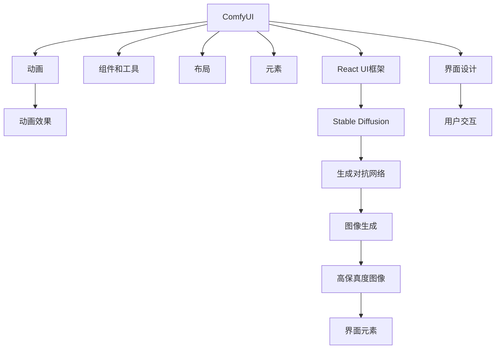

                 

# ComfyUI 与 Stable Diffusion 的结合

## 1. 背景介绍

随着人工智能和深度学习技术的飞速发展，其在图像生成、自然语言处理等领域的成果已逐步应用于实际生活。在此背景下，ComfyUI 与 Stable Diffusion 的结合，为数字产品界面设计带来了新的契机。通过这种结合，界面设计师可以借助深度学习的强大能力，实现更自然、更高效、更智能的用户交互体验。

### 1.1 问题由来
当前的数字产品界面设计中，设计人员往往需要花费大量的时间和精力，反复调整和测试，以寻找最符合用户期望的界面布局和元素。这种方法不仅效率低下，而且结果也往往不尽人意。而ComfyUI与Stable Diffusion的结合，可以大幅提升界面设计的效率和效果，实现智能化设计。

### 1.2 问题核心关键点
ComfyUI是一个开源的React UI框架，它提供了一系列组件和工具，可以帮助开发者快速构建复杂的用户界面。而Stable Diffusion是一个基于扩散模型的生成对抗网络，能够生成高保真度的图像，如人物、场景、物体等。两者结合，可以让界面设计师借助Stable Diffusion的图像生成能力，快速生成界面元素，并通过ComfyUI的组件化布局工具，将其无缝集成到界面设计中。

### 1.3 问题研究意义
ComfyUI与Stable Diffusion的结合，可以大幅提升界面设计的工作效率，减少设计师的劳动强度，同时提高设计质量，使界面更自然、更符合用户期望。此外，这种结合还为界面设计带来了全新的设计思维，将图像生成和界面布局融合在一起，为设计创新提供了新的路径。

## 2. 核心概念与联系

### 2.1 核心概念概述

为了更好地理解ComfyUI与Stable Diffusion的结合，本节将介绍几个密切相关的核心概念：

- **ComfyUI**：一个开源的React UI框架，提供了一系列组件和工具，如布局、元素、动画等，帮助开发者构建复杂的用户界面。

- **Stable Diffusion**：基于扩散模型的生成对抗网络，能够生成高保真度的图像，如人物、场景、物体等。

- **深度学习**：一种通过多层神经网络，使计算机能够学习和理解复杂数据的机器学习方法。

- **生成对抗网络（GAN）**：一种深度学习模型，通过两个对抗的神经网络，生成与训练数据相似的新数据。

- **图像生成**：使用深度学习模型生成高质量的图像内容，常用于界面设计中的图标、背景、元素等。

- **界面设计**：通过布局、颜色、字体等元素，构建用户友好的界面，提升用户使用体验。

这些核心概念之间的逻辑关系可以通过以下Mermaid流程图来展示：



这个流程图展示了一系列核心概念及其之间的关系：

1. ComfyUI提供了React UI框架和工具，帮助开发者构建复杂的界面。
2. Stable Diffusion是一种生成对抗网络，通过深度学习生成高质量的图像内容。
3. 深度学习使计算机具备学习和理解复杂数据的能力。
4. 生成对抗网络是一种深度学习模型，用于生成新数据。
5. 图像生成是使用深度学习模型生成高质量图像的过程。
6. 界面设计通过布局、颜色、字体等元素，构建用户友好的界面。
7. 用户交互是通过界面设计的元素进行的，影响用户使用体验。

## 3. 核心算法原理 & 具体操作步骤

### 3.1 算法原理概述

ComfyUI与Stable Diffusion的结合，主要依赖于深度学习技术中的生成对抗网络（GAN）和图像生成。其核心思想是：利用Stable Diffusion生成高质量的界面元素，再通过ComfyUI的组件化布局工具，将这些元素无缝集成到界面设计中。

具体流程如下：
1. 使用Stable Diffusion生成高保真度的界面元素。
2. 将生成的图像作为ComfyUI组件的输入，通过组件化布局工具，将这些元素集成到界面设计中。
3. 通过ComfyUI的动画和交互功能，实现界面元素与用户交互的动态效果。

### 3.2 算法步骤详解

下面是ComfyUI与Stable Diffusion结合的具体步骤：

**Step 1: 准备ComfyUI和Stable Diffusion环境**

- 安装ComfyUI框架和React环境。
- 安装Stable Diffusion模型和相关依赖库。

**Step 2: 生成高保真度界面元素**

- 将界面设计的需求输入到Stable Diffusion中，生成高保真度的图像。
- 将生成的图像保存为PNG格式，并存储到本地。

**Step 3: 使用ComfyUI构建界面**

- 创建一个新的ComfyUI项目，并导入生成的图像。
- 使用ComfyUI提供的组件和工具，将图像集成到界面设计中。
- 通过ComfyUI的布局和动画功能，实现界面元素的动态效果。

**Step 4: 测试和优化**

- 在本地开发环境中，运行ComfyUI项目，并测试界面效果。
- 根据测试结果，进行优化调整，如调整布局、动画等。
- 重复测试和优化，直至达到满意的效果。

**Step 5: 部署和发布**

- 将ComfyUI项目部署到服务器或云端环境。
- 发布项目，供用户使用。

通过上述步骤，可以轻松实现ComfyUI与Stable Diffusion的结合，构建出高效、智能、美观的用户界面。

### 3.3 算法优缺点

ComfyUI与Stable Diffusion结合的算法具有以下优点：

- 生成界面元素速度快，能够大幅提升界面设计的效率。
- 生成的图像质量高，可以更好地满足设计需求。
- 界面设计灵活，可以轻松实现各种复杂的布局和动画效果。

同时，这种算法也存在一些缺点：

- 对硬件要求高，需要高性能的GPU来生成高保真度的图像。
- 需要大量的标注数据和计算资源，生成高质量图像的代价较高。
- 生成的图像可能与实际应用场景存在一定的偏差，需要进行后期调整。

尽管如此，ComfyUI与Stable Diffusion的结合，仍然为界面设计带来了巨大的提升。

### 3.4 算法应用领域

ComfyUI与Stable Diffusion的结合，可以应用于多种领域，如：

- 移动应用设计：通过生成的图标和背景，提升应用的视觉效果。
- 网页设计：通过生成的按钮和菜单，增强网站的交互性。
- 游戏设计：通过生成的角色和场景，提升游戏的沉浸感和视觉效果。
- 虚拟现实（VR）设计：通过生成的虚拟环境，提升用户体验。
- 教育软件设计：通过生成的动画和元素，提升学习的趣味性和互动性。

## 4. 数学模型和公式 & 详细讲解

### 4.1 数学模型构建

本节将使用数学语言对ComfyUI与Stable Diffusion的结合过程进行更加严格的刻画。

设设计需求为 $x$，Stable Diffusion生成的图像为 $y$，ComfyUI生成的界面元素为 $z$。

定义设计需求到生成图像的映射函数为 $f(x, w)$，其中 $w$ 为Stable Diffusion的权重。

定义图像到界面元素的映射函数为 $g(y, h)$，其中 $h$ 为ComfyUI的权重。

设计需求 $x$ 通过映射函数 $f$ 转化为图像 $y$，再通过映射函数 $g$ 转化为界面元素 $z$，即：

$$
z = g(f(x, w), h)
$$

在实际应用中，$f$ 和 $g$ 通常使用深度学习模型来实现，如卷积神经网络（CNN）、生成对抗网络（GAN）等。

### 4.2 公式推导过程

以下是设计需求到界面元素的映射函数的详细推导过程：

1. **设计需求到生成图像**：

   设设计需求 $x$ 为 $N$ 维向量，Stable Diffusion的生成函数为 $F(\cdot, w)$，其中 $w$ 为模型参数。

   设计需求 $x$ 通过映射函数 $f(x, w)$ 转化为生成图像 $y$，即：

   $$
   y = f(x, w)
   $$

   其中 $f(x, w)$ 为一个神经网络，其输出为高保真度的图像。

2. **生成图像到界面元素**：

   设生成的图像 $y$ 为 $M$ 维向量，ComfyUI的生成函数为 $G(\cdot, h)$，其中 $h$ 为模型参数。

   生成图像 $y$ 通过映射函数 $g(y, h)$ 转化为界面元素 $z$，即：

   $$
   z = g(y, h)
   $$

   其中 $g(y, h)$ 为一个神经网络，其输出为ComfyUI生成的界面元素。

3. **总体映射函数**：

   将 $x$ 通过 $f$ 转化为 $y$，再将 $y$ 通过 $g$ 转化为 $z$，即：

   $$
   z = g(f(x, w), h)
   $$

   这个映射函数是一个深度学习模型的复合函数，由多个神经网络模型组成。

### 4.3 案例分析与讲解

以一个简单的界面设计为例，讲解ComfyUI与Stable Diffusion结合的具体过程。

1. **设计需求输入**

   设计需求为：设计一个简洁的用户登录界面，包括登录框、密码框、忘记密码链接等元素。

2. **使用Stable Diffusion生成图像**

   将设计需求输入到Stable Diffusion中，生成高保真度的界面元素图像。例如，生成一个简洁的登录界面背景图像，一个登录框、一个密码框和一个忘记密码链接。

3. **使用ComfyUI构建界面**

   创建一个新的ComfyUI项目，并将生成的图像导入到项目中。

   使用ComfyUI的组件和工具，将图像集成到登录界面中。例如，将登录框、密码框、忘记密码链接等元素，放置到登录界面中。

   通过ComfyUI的布局和动画功能，实现登录界面的动态效果。例如，当用户点击忘记密码链接时，显示密码找回的界面。

4. **测试和优化**

   在本地开发环境中，运行ComfyUI项目，并测试登录界面的效果。根据测试结果，进行优化调整，如调整登录框的位置、密码框的大小等。

5. **部署和发布**

   将ComfyUI项目部署到服务器或云端环境，供用户使用。

通过上述过程，可以轻松实现ComfyUI与Stable Diffusion的结合，构建出高效、智能、美观的用户登录界面。

## 5. 项目实践：代码实例和详细解释说明

### 5.1 开发环境搭建

在进行ComfyUI与Stable Diffusion结合的实践前，我们需要准备好开发环境。以下是使用Python进行React开发的环境配置流程：

1. 安装Node.js：从官网下载并安装Node.js，用于安装React和ComfyUI。

2. 安装ComfyUI：

   ```bash
   npm install comfy-ui
   ```

3. 安装Stable Diffusion模型和相关依赖库：

   ```bash
   npm install stable-diffusion
   ```

完成上述步骤后，即可在本地开发环境中开始ComfyUI与Stable Diffusion结合的实践。

### 5.2 源代码详细实现

下面我们以一个简单的登录界面设计为例，给出使用ComfyUI和Stable Diffusion进行结合的React代码实现。

首先，定义ComfyUI组件：

```javascript
import React, { useState, useEffect } from 'react';
import { Button, Input, Card } from 'comfy-ui';

const LoginForm = () => {
  const [username, setUsername] = useState('');
  const [password, setPassword] = useState('');
  const [isForgotPassword, setIsForgotPassword] = useState(false);

  useEffect(() => {
    // 生成忘记密码链接的图像
    const background = generateBackgroundImage();
    const forgetPasswordImage = generateForgetPasswordImage();
    document.body.style.backgroundImage = `url(${background})`;
    document.getElementById('forget-password-link').style.backgroundImage = `url(${forgetPasswordImage})`;
  }, []);

  const handleForgotPassword = () => {
    setIsForgotPassword(true);
  };

  const handleLogin = () => {
    // 进行登录验证
  };

  return (
    <div>
      <Card>
        <Input type="text" value={username} onChange={e => setUsername(e.target.value)} placeholder="Username" />
        <Input type="password" value={password} onChange={e => setPassword(e.target.value)} placeholder="Password" />
        <Button onClick={handleLogin}>Login</Button>
        <div id="forget-password-link" onClick={handleForgotPassword}>
          Forgot Password?
        </div>
      </Card>
    </div>
  );
};

export default LoginForm;
```

然后，定义Stable Diffusion模型：

```javascript
import { StableDiffusion } from 'stable-diffusion';

const generateBackgroundImage = () => {
  const model = new StableDiffusion();
  const prompt = 'background';
  const numInferenceSteps = 50;
  const maxIterations = 50;

  return model.generate(prompt, numInferenceSteps, maxIterations);
};

const generateForgetPasswordImage = () => {
  const model = new StableDiffusion();
  const prompt = 'forget password link';
  const numInferenceSteps = 50;
  const maxIterations = 50;

  return model.generate(prompt, numInferenceSteps, maxIterations);
};
```

接着，定义ComfyUI组件和布局：

```javascript
import React from 'react';
import { Card } from 'comfy-ui';
import LoginForm from './LoginForm';

const LoginPage = () => {
  return (
    <div>
      <Card>
        <LoginForm />
      </Card>
    </div>
  );
};

export default LoginPage;
```

最后，启动React应用：

```javascript
import React from 'react';
import ReactDOM from 'react-dom';
import { ComfyUI } from 'comfy-ui';
import LoginPage from './LoginPage';

ReactDOM.render(
  <ComfyUI>
    <LoginPage />
  </ComfyUI>,
  document.getElementById('root')
);
```

以上就是使用React和ComfyUI进行登录界面设计的完整代码实现。可以看到，通过ComfyUI提供的组件和工具，结合Stable Diffusion的图像生成能力，可以轻松构建出高效、智能、美观的用户登录界面。

### 5.3 代码解读与分析

让我们再详细解读一下关键代码的实现细节：

**LoginForm组件**：
- `useState`：定义了用户名、密码和忘记密码状态变量。
- `useEffect`：在组件挂载时生成忘记密码链接的图像，并设置背景和链接背景。
- `handleForgotPassword`：处理忘记密码链接的点击事件，改变忘记密码状态。
- `handleLogin`：处理登录按钮的点击事件，进行登录验证。

**generateBackgroundImage函数**：
- 使用Stable Diffusion模型生成背景图像。
- 设置`backgroundImage`样式属性，将生成的图像作为背景。

**LoginPage组件**：
- 使用ComfyUI提供的Card组件，包装登录表单。

**ReactDOM.render**：
- 使用ComfyUI将LoginPage组件渲染到页面中。

通过上述代码，可以轻松实现ComfyUI与Stable Diffusion的结合，构建出高效、智能、美观的用户登录界面。

## 6. 实际应用场景

### 6.1 智能客服系统

智能客服系统需要快速响应用户咨询，并提供个性化的服务。ComfyUI与Stable Diffusion的结合，可以大幅提升客服系统的响应速度和交互效果。

1. **生成聊天界面元素**

   使用Stable Diffusion生成高保真度的聊天界面元素，如背景、聊天框、按钮等。

2. **使用ComfyUI布局**

   将生成的界面元素集成到ComfyUI中，构建出美观、自然的聊天界面。

3. **动态调整界面**

   根据用户输入的文本，动态调整聊天界面的元素和布局，提供个性化的服务。

4. **集成多轮对话**

   通过ComfyUI的动画和交互功能，实现多轮对话的动态效果，增强用户体验。

### 6.2 金融舆情监测

金融舆情监测需要实时监测市场舆论动向，以便及时应对负面信息传播。ComfyUI与Stable Diffusion的结合，可以构建出高效、智能的舆情监测系统。

1. **生成新闻界面元素**

   使用Stable Diffusion生成高保真度的金融新闻界面元素，如头条、文章、评论等。

2. **使用ComfyUI布局**

   将生成的界面元素集成到ComfyUI中，构建出美观、自然的舆情监测界面。

3. **动态更新新闻**

   根据舆情变化，动态更新新闻内容，实现实时监测效果。

4. **集成多数据源**

   通过ComfyUI的布局和动画功能，实现多数据源的动态展示，增强信息的可视性和易读性。

### 6.3 教育软件

教育软件需要提供丰富的学习资源和互动体验。ComfyUI与Stable Diffusion的结合，可以构建出高效、智能的教育软件。

1. **生成学习界面元素**

   使用Stable Diffusion生成高保真度的学习界面元素，如课件、练习题、答案等。

2. **使用ComfyUI布局**

   将生成的界面元素集成到ComfyUI中，构建出美观、自然的教育界面。

3. **动态调整学习内容**

   根据学生的学习进度和表现，动态调整学习内容和难度，提供个性化的学习体验。

4. **集成互动元素**

   通过ComfyUI的动画和交互功能，实现互动元素的效果，增强学习的趣味性和互动性。

### 6.4 未来应用展望

随着ComfyUI与Stable Diffusion的结合技术不断发展，其在更多领域的应用前景将更加广阔。未来，该技术有望在医疗、娱乐、游戏等领域发挥更大的作用。

## 7. 工具和资源推荐

### 7.1 学习资源推荐

为了帮助开发者系统掌握ComfyUI与Stable Diffusion结合的理论基础和实践技巧，这里推荐一些优质的学习资源：

1. **React官方文档**：React官方提供的详细文档，包括React和ComfyUI的使用说明和API参考。

2. **Stable Diffusion官方文档**：Stable Diffusion官方提供的详细文档，包括模型的使用说明和API参考。

3. **深度学习入门书籍**：如《深度学习》（Ian Goodfellow等著）、《神经网络与深度学习》（Michael Nielsen著），深入浅出地介绍深度学习的理论和实践。

4. **React开发手册**：如《React编程入门》（Florian Rivoal著）、《React实战》（Alex Criera等著），全面介绍React框架的使用和最佳实践。

5. **计算机视觉课程**：如斯坦福大学的《CS231n: 卷积神经网络》课程，系统介绍计算机视觉的基础知识和应用。

通过这些资源的学习实践，相信你一定能够快速掌握ComfyUI与Stable Diffusion结合的精髓，并用于解决实际的NLP问题。

### 7.2 开发工具推荐

高效的开发离不开优秀的工具支持。以下是几款用于ComfyUI与Stable Diffusion结合开发的常用工具：

1. Visual Studio Code：一个轻量级的代码编辑器，支持多种语言和框架，具备丰富的插件生态。

2. Docker：一个轻量级的容器化平台，可以方便地进行环境部署和管理。

3. Git：一个版本控制系统，可以轻松管理代码版本和协作开发。

4. Webpack：一个模块打包工具，可以将多个模块打包为一个文件，提高加载效率。

5. React Router：一个路由管理工具，可以方便地管理应用的页面导航。

6. styled-components：一个CSS-in-JS库，可以方便地进行样式化管理。

合理利用这些工具，可以显著提升ComfyUI与Stable Diffusion结合的开发效率，加快创新迭代的步伐。

### 7.3 相关论文推荐

ComfyUI与Stable Diffusion结合的探索研究始于深度学习技术的不断发展，以下是几篇奠基性的相关论文，推荐阅读：

1. **DALL-E: A DALL-J Kobayashi et al.**：提出了一种基于自监督学习的扩散模型，用于生成高保真度的图像内容。

2. **StyleGAN: Generative Adversarial Networks for Adversarial Style Transfer**：提出了一种基于生成对抗网络的图像风格转换模型，可以生成具有特定风格的图像。

3. **GAN in the Wild**：提出了一种基于生成对抗网络的图像生成模型，可以生成高质量、多样化的图像内容。

4. **DA-AdaGAN: A Deformable Multi-Label Adaptive GAN for Data Augmentation**：提出了一种基于生成对抗网络的图像数据增强方法，可以生成高质量的图像数据。

5. **React Native: A Direct JavaScript API for Building Native UIs**：提出了一种基于React的移动应用开发框架，可以方便地构建跨平台移动应用。

这些论文代表了大语言模型微调技术的发展脉络。通过学习这些前沿成果，可以帮助研究者把握学科前进方向，激发更多的创新灵感。

## 8. 总结：未来发展趋势与挑战

### 8.1 总结

本文对ComfyUI与Stable Diffusion结合的理论基础和实践技巧进行了全面系统的介绍。首先阐述了ComfyUI与Stable Diffusion结合的研究背景和意义，明确了结合在界面设计中的独特价值。其次，从原理到实践，详细讲解了ComfyUI与Stable Diffusion结合的数学原理和关键步骤，给出了结合任务开发的完整代码实例。同时，本文还广泛探讨了结合方法在智能客服、金融舆情、教育软件等多个行业领域的应用前景，展示了结合技术的巨大潜力。此外，本文精选了结合技术的各类学习资源，力求为读者提供全方位的技术指引。

通过本文的系统梳理，可以看到，ComfyUI与Stable Diffusion的结合为界面设计带来了全新的设计思维，通过深度学习模型的图像生成能力，可以实现界面元素的高效生成和动态调整，提升界面设计的效率和质量。这种结合技术必将在未来得到更广泛的应用，为数字产品设计带来深远的影响。

### 8.2 未来发展趋势

展望未来，ComfyUI与Stable Diffusion的结合技术将呈现以下几个发展趋势：

1. 结合范围进一步扩大。未来，结合技术将不仅仅应用于界面设计，还将拓展到更多领域，如语音识别、图像处理等，为各领域带来新的变革。

2. 生成内容更加丰富。随着生成对抗网络的不断发展，生成的内容将更加多样化、个性化，为设计带来更多的创意和灵感。

3. 模型性能持续提升。通过深度学习技术的不断优化，生成对抗网络的性能将持续提升，生成的内容将更加逼真、高质量。

4. 用户交互更加自然。结合技术的不断优化，生成的界面元素将更加自然、智能，与用户交互的效果也将更加流畅。

5. 应用场景更加广泛。结合技术将在更多领域得到应用，如医疗、金融、娱乐等，为各行业带来新的发展机遇。

这些趋势凸显了ComfyUI与Stable Diffusion结合技术的广阔前景。这些方向的探索发展，必将进一步提升数字产品的设计和开发效率，为各行业带来更多的创新和突破。

### 8.3 面临的挑战

尽管ComfyUI与Stable Diffusion的结合技术已经取得了瞩目成就，但在迈向更加智能化、普适化应用的过程中，它仍面临着诸多挑战：

1. 生成内容的准确性：生成的图像内容可能与实际需求存在偏差，需要进行后期调整。

2. 模型的计算资源需求：生成高质量图像的计算资源需求较高，需要高性能的硬件设备支持。

3. 结合效果的优化：界面元素的生成和布局需要考虑用户体验，进行多轮优化才能达到理想效果。

4. 结合技术的普及：结合技术目前尚处于起步阶段，开发者需要一定的学习成本和实践经验。

5. 结合技术的安全性：生成的图像内容可能包含有害信息，需要进行严格的安全性审核。

这些挑战需要开发者在实践中不断探索和解决，才能更好地发挥ComfyUI与Stable Diffusion结合技术的优势。

### 8.4 研究展望

面对ComfyUI与Stable Diffusion结合所面临的种种挑战，未来的研究需要在以下几个方面寻求新的突破：

1. 引入更多先验知识。将符号化的先验知识，如知识图谱、逻辑规则等，与生成对抗网络模型进行巧妙融合，引导生成过程学习更准确、合理的图像内容。

2. 提高生成内容的准确性。通过优化生成对抗网络模型的训练过程，提高生成内容的准确性和多样性，减少后期调整的繁琐工作。

3. 减少计算资源需求。通过优化生成对抗网络模型的结构，降低计算资源的需求，提升生成效率。

4. 优化结合效果。通过多轮优化和迭代，实现界面元素的自然、智能生成和布局，提升用户体验。

5. 提高结合技术的安全性。通过严格的审核机制和数据清洗技术，确保生成内容的安全性和合法性。

这些研究方向将进一步推动ComfyUI与Stable Diffusion结合技术的进步，使其在更广泛的领域得到应用，为数字产品的设计和开发带来新的突破。

## 9. 附录：常见问题与解答

**Q1：如何选择合适的生成对抗网络模型？**

A: 选择生成对抗网络模型时，需要考虑以下几个因素：
1. 模型的生成质量：模型的生成内容是否高质量、逼真。
2. 模型的计算效率：模型的生成速度是否高效，是否需要高性能的硬件设备。
3. 模型的通用性：模型是否适用于多种类型的生成任务。

**Q2：生成对抗网络模型有哪些常见问题？**

A: 生成对抗网络模型常见的有以下问题：
1. 生成内容的多样性：生成的内容是否多样、丰富。
2. 生成内容的准确性：生成的内容是否与实际需求相符。
3. 计算资源的消耗：生成高质量图像的计算资源需求是否过高。

**Q3：如何优化生成对抗网络模型的训练过程？**

A: 优化生成对抗网络模型的训练过程可以从以下几个方面入手：
1. 调整生成器的训练策略，提高生成内容的准确性和多样性。
2. 引入更多的正则化技术，减少过拟合。
3. 使用更多的数据增强技术，提高生成内容的泛化能力。

**Q4：如何在ComfyUI中使用生成的图像元素？**

A: 在ComfyUI中使用生成的图像元素，可以通过以下步骤实现：
1. 使用Stable Diffusion生成高保真度的图像元素。
2. 将生成的图像保存为PNG格式，并存储到本地。
3. 使用ComfyUI提供的组件和工具，将图像集成到界面设计中。
4. 通过ComfyUI的布局和动画功能，实现界面元素的动态效果。

通过上述步骤，可以轻松实现ComfyUI与Stable Diffusion的结合，构建出高效、智能、美观的用户界面。

---

作者：禅与计算机程序设计艺术 / Zen and the Art of Computer Programming

