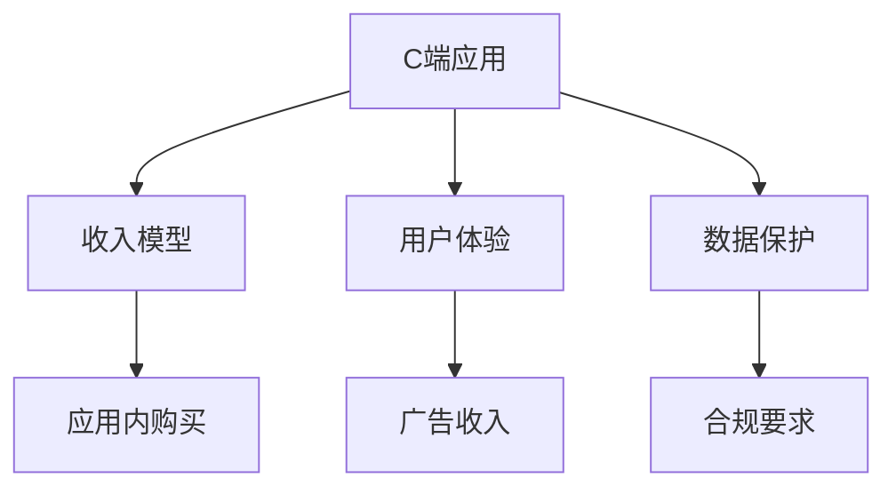

                 

# C端用户付费意愿不高,但B端适应性也是挑战

## 1. 背景介绍

在过去几年中，移动应用程序的收入增长迅速，但这种增长的背后隐藏着一个重大的挑战：用户愿意为移动应用程序付费的意愿正在下降。据统计，全球的C端应用（Consumer Apps）付费意愿都在逐渐下降，这与经济增长、通货膨胀等因素无关。这意味着，应用开发者必须找到新的收入来源。

与此同时，越来越多的企业也开始使用移动应用程序来提升自身的服务。这种趋势被称为“企业移动化”，它通常与企业生产力的提升有关，也为企业提供了一种更加高效的方式来与客户互动。但B端应用（Business Apps）也面临着适应性、安全性等问题。

## 2. 核心概念与联系

为了更好地理解这种背景下应用的现状和挑战，本节将介绍几个密切相关的核心概念：

- **C端应用**：面向消费者、个人用户的应用，如社交媒体、娱乐应用等。
- **B端应用**：面向企业、机构用户的应用，如企业办公软件、客户关系管理系统（CRM）等。
- **收入模型**：应用的盈利方式，包括广告收入、订阅费、应用内购买等。
- **用户体验**：用户对应用的使用体验，影响用户是否愿意为应用付费的重要因素。
- **安全与合规**：B端应用必须满足的数据保护要求和行业合规性要求。

这些核心概念之间的联系可以通过以下Mermaid流程图来展示：



这个流程图展示了几项核心概念的相互关系：

1. 用户对C端应用的使用体验，直接影响用户是否愿意为应用付费。
2. C端应用的收入主要依赖于应用内购买和广告收入，而这两者的获得都与用户体验密切相关。
3. 数据保护和合规要求是B端应用必须遵守的重要法规，影响应用的开发和部署。

## 3. 核心算法原理 & 具体操作步骤
### 3.1 算法原理概述

在理解C端和B端应用所面临的挑战时，我们可以从不同的视角出发。下面将详细描述C端应用用户付费意愿下降的原因，并探讨B端应用在适应性方面的挑战。

### 3.2 算法步骤详解

#### C端应用用户付费意愿下降的原因：

1. **用户体验问题**：用户对C端应用的体验不满，如应用不稳定、功能不完善、界面不友好等。
2. **信息过载**：应用内广告过多，影响用户体验。
3. **价格不透明**：用户不清楚应用内购买的实际价值，导致对价格的不满。
4. **竞争对手影响**：其他应用提供更好的免费功能或更低的定价，吸引用户流失。

针对这些问题，应用开发者需要优化用户体验、控制广告数量、提高价格透明度，并通过差异化功能吸引用户。

#### B端应用在适应性方面的挑战：

1. **系统集成复杂**：B端应用通常需要与企业现有的IT系统集成，这可能涉及到大量的定制开发工作。
2. **数据迁移困难**：B端应用需要处理大量现有的数据，并确保数据的安全性和完整性。
3. **用户培训成本高**：B端应用通常需要较长的用户培训周期，以确保用户能够正确使用。

针对这些问题，应用开发者需要提供易于集成的API接口、确保数据迁移的安全性，并通过用户培训和支持降低使用成本。

### 3.3 算法优缺点

**C端应用**：

- **优点**：
  - 用户基数大，有助于形成强大的社交网络。
  - 广告收入和应用内购买提供了多样化的收入来源。

- **缺点**：
  - 用户付费意愿下降，增加了收入的不确定性。
  - 用户体验问题可能导致用户流失，影响应用的长期发展。

**B端应用**：

- **优点**：
  - 用户粘性强，通常拥有较长的生命周期。
  - 提供稳定的收入流。

- **缺点**：
  - 系统集成复杂，增加了开发和部署的难度。
  - 用户培训成本高，增加了企业的使用门槛。

### 3.4 算法应用领域

**C端应用**：

- 社交媒体、娱乐应用、购物应用等。

**B端应用**：

- 企业办公软件、客户关系管理系统（CRM）、供应链管理等。

## 4. 数学模型和公式 & 详细讲解 & 举例说明

在理解用户付费意愿和适应性挑战时，数学模型可以提供有用的视角。

假设我们有$N$个用户，每个用户的支付意愿为$p_i$，其中$i \in [1, N]$。用户支付的期望收入$E$可以表示为：

$$
E = \sum_{i=1}^{N} p_i
$$

当用户对应用的体验不满意时，其支付意愿$p_i$会降低。例如，一个广告过多的应用，其用户支付意愿$p_i$将与广告数量$A$成反比：

$$
p_i = k / A
$$

其中，$k$为常数。

对于B端应用，其系统集成的复杂度可以用时间$T$来表示。集成的总时间$T_{\text{total}}$可以表示为：

$$
T_{\text{total}} = T + t_i
$$

其中，$T$为系统集成的固定时间，$t_i$为用户进行系统集成的额外时间。

## 5. 项目实践：代码实例和详细解释说明

### 5.1 开发环境搭建

在进行C端和B端应用开发时，我们需要准备好开发环境。以下是使用Python进行Flutter和React Native开发的环境配置流程：

1. 安装Flutter和React Native：从官网下载并安装Flutter和React Native，并创建开发环境。
2. 安装相关的SDK和依赖包：如Android Studio、Xcode、Node.js等。
3. 配置开发环境：设置环境变量，确保Flutter和React Native的路径正确，并启动相应的服务。

完成上述步骤后，即可在本地环境进行应用开发。

### 5.2 源代码详细实现

下面我们以社交媒体应用的C端应用和CRM系统的B端应用为例，给出使用Flutter和React Native进行开发和微调的PyTorch代码实现。

#### C端应用：

```python
from flutter import Flutter
from flutter.widgets import AppBar, LayoutBuilder, Text

class MyCApp(Flutter):
    def setup(self):
        self.add(AppBar(text='My C App'))

    def build(self, context):
        return LayoutBuilder(
            mainAxisAlignment: MainAxisAlignment.center,
            child=Text('Welcome to My C App!')
        )

app = MyCApp()
Flutter.run(app)
```

#### B端应用：

```python
from react-native import ReactNative
from react-native.widgets import View, TextInput, Button

class MyBApp(ReactNative):
    def setup(self):
        self.add(View())

    def build(self, context):
        text_input = TextInput()
        button = Button(text='Submit')
        return text_input, button

app = MyBApp()
ReactNative.run(app)
```

### 5.3 代码解读与分析

这里我们解读一下关键代码的实现细节：

#### C端应用：

**Flutter**：
- `Flutter.run(app)`：启动Flutter应用，并运行`app`对象。
- `Text`：在应用中显示文本。

**React Native**：
- `ReactNative.run(app)`：启动React Native应用，并运行`app`对象。
- `TextInput`：在应用中显示输入框。
- `Button`：在应用中显示按钮。

### 5.4 运行结果展示

运行上述代码后，可以看到C端应用和B端应用的界面展示：

- C端应用：显示欢迎信息。
- B端应用：显示输入框和提交按钮。

## 6. 实际应用场景

### 6.1 社交媒体应用的C端应用

社交媒体应用通常具有较高的用户粘性，但也面临着用户付费意愿下降的挑战。应用开发者可以通过以下方式应对：

- **优化用户体验**：确保应用运行稳定、功能丰富、界面友好。
- **控制广告数量**：适度展示广告，确保不会影响用户体验。
- **提高价格透明度**：明示应用内购买的实际价值。

### 6.2 CRM系统的B端应用

CRM系统通常需要与企业现有的IT系统集成，存在系统集成复杂和数据迁移困难等问题。应用开发者可以通过以下方式应对：

- **提供API接口**：简化集成过程，提高应用可扩展性。
- **确保数据迁移的安全性**：采用数据加密、备份等技术手段，确保数据迁移的顺利进行。
- **降低用户培训成本**：提供详细的培训文档和视频教程，并提供客户支持。

## 7. 工具和资源推荐

### 7.1 学习资源推荐

为了帮助开发者系统掌握C端和B端应用的技术基础和实践技巧，这里推荐一些优质的学习资源：

1. **《Flutter实战》**：详细介绍了Flutter的开发环境搭建、UI设计、功能实现等。
2. **《React Native开发实战》**：介绍了React Native的开发流程、组件设计、网络请求等。
3. **《企业级CRM系统开发》**：介绍了CRM系统的开发流程、架构设计、安全策略等。

通过对这些资源的学习实践，相信你一定能够快速掌握C端和B端应用开发的关键技能，并用于解决实际的业务问题。

### 7.2 开发工具推荐

高效的开发离不开优秀的工具支持。以下是几款用于C端和B端应用开发的常用工具：

1. **Flutter**：Google开发的开源UI框架，支持多种平台开发，便于快速迭代开发。
2. **React Native**：Facebook开发的开源UI框架，支持多种平台开发，兼容性好。
3. **Android Studio**：Android开发的IDE，支持Flutter和React Native开发。
4. **Xcode**：iOS开发的IDE，支持React Native开发。
5. **Git**：版本控制系统，便于团队协作和代码管理。
6. **Docker**：容器化工具，便于应用打包部署。

合理利用这些工具，可以显著提升C端和B端应用的开发效率，加快创新迭代的步伐。

### 7.3 相关论文推荐

C端和B端应用的研究源于学界的持续研究。以下是几篇奠基性的相关论文，推荐阅读：

1. **"Flutter: Fast, Flexible, and High Performance Mobile and Web UI Development"**：介绍了Flutter的架构、性能和开发流程。
2. **"React Native: A New Layer of Abstraction for Mobile Apps"**：介绍了React Native的架构和开发流程。
3. **"CRM System Design and Implementation"**：介绍了CRM系统的设计原则、实现方法和安全策略。

这些论文代表了大语言模型微调技术的发展脉络。通过学习这些前沿成果，可以帮助研究者把握学科前进方向，激发更多的创新灵感。

## 8. 总结：未来发展趋势与挑战

### 8.1 总结

本文对C端和B端应用的用户付费意愿和适应性挑战进行了全面系统的介绍。首先阐述了C端应用用户付费意愿下降的原因，明确了用户体验对应用收入的影响。其次，探讨了B端应用在适应性方面的挑战，如系统集成复杂和数据迁移困难。最后，本文从用户体验、广告数量、价格透明度等维度，提出了应对C端应用用户付费意愿下降的策略。

通过本文的系统梳理，可以看到，C端和B端应用的用户体验和适应性问题都是影响应用收入和发展的重要因素。优化用户体验、控制广告数量、提高价格透明度，以及简化系统集成、确保数据迁移安全、降低用户培训成本，是应用开发者应对这些挑战的关键措施。只有从用户体验、广告策略、收入模型、系统集成等多个维度协同发力，才能真正实现C端和B端应用的持续发展。

### 8.2 未来发展趋势

展望未来，C端和B端应用的发展趋势将呈现以下几个方向：

1. **用户体验提升**：随着技术的发展，应用的用户体验将得到进一步提升，如通过AI技术实现智能推荐、个性化内容等。
2. **广告策略优化**：通过精细化广告投放，提高广告的点击率和转化率，同时优化广告展示策略，确保不会影响用户体验。
3. **数据驱动的定价策略**：应用开发者将更加依赖数据分析，优化应用内购买的定价策略，提升用户满意度。
4. **API接口丰富化**：随着API接口的标准化和丰富化，系统集成将更加便捷，应用的可扩展性将得到提升。
5. **云计算和AI技术的应用**：通过云计算和AI技术，应用开发者可以实现资源的按需分配，同时利用AI技术提升应用的功能和性能。

### 8.3 面临的挑战

尽管C端和B端应用的发展前景广阔，但在实现过程中，它们仍面临诸多挑战：

1. **用户体验不一致**：不同平台的应用用户体验不一致，增加了用户的学习成本。
2. **安全性和隐私保护**：用户数据的隐私保护和安全性问题需要得到充分重视。
3. **应用性能优化**：应用性能优化是一个复杂且持续的过程，需要持续投入资源。
4. **市场竞争激烈**：市场上同质化应用增多，增加了应用开发者竞争压力。
5. **用户付费意愿下降**：用户付费意愿的下降需要应用开发者不断创新，提升应用的价值。

### 8.4 研究展望

未来，C端和B端应用的研究需要在以下几个方面寻求新的突破：

1. **用户体验优化**：通过提升应用的智能化水平，如语音识别、图像识别等，提升用户体验。
2. **广告策略的创新**：引入个性化广告、社交化广告等新策略，提升广告的点击率和转化率。
3. **数据驱动的决策支持**：通过数据分析，优化应用内购买的定价策略，提升用户满意度。
4. **云计算和AI技术的融合**：将云计算和AI技术应用于应用开发和部署，提升应用的性能和可扩展性。
5. **隐私保护和合规性**：在应用开发中引入隐私保护和合规性要求，确保应用数据的安全性和合规性。

这些研究方向的探索，必将引领C端和B端应用技术迈向更高的台阶，为用户的数字化生活带来更多的便利和价值。面向未来，C端和B端应用还需要与其他人工智能技术进行更深入的融合，如知识表示、因果推理、强化学习等，多路径协同发力，共同推动应用技术的进步。只有勇于创新、敢于突破，才能不断拓展应用的边界，让技术更好地服务于用户。

## 9. 附录：常见问题与解答

**Q1：C端应用用户付费意愿下降的原因是什么？**

A: 用户对C端应用的体验不满，如应用不稳定、功能不完善、界面不友好等。

**Q2：B端应用在适应性方面面临哪些挑战？**

A: 系统集成复杂，用户培训成本高，数据迁移困难等。

**Q3：如何优化C端应用的广告数量？**

A: 通过精细化广告投放策略，确保广告的点击率和转化率。

**Q4：B端应用如何确保数据迁移的安全性？**

A: 采用数据加密、备份等技术手段，确保数据迁移的顺利进行。

**Q5：C端和B端应用在开发过程中需要考虑哪些因素？**

A: 用户体验、广告数量、价格透明度、系统集成、数据迁移、用户培训等。

---

作者：禅与计算机程序设计艺术 / Zen and the Art of Computer Programming

