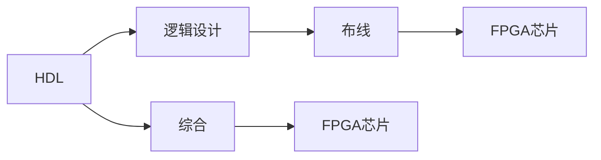

                 

# FPGA编程：硬件描述语言和逻辑设计

## 1. 背景介绍

在当今的电子设计自动化（EDA）领域，现场可编程门阵列（FPGA）以其灵活性和可编程性，成为数字电路设计和实现的利器。FPGA编程不仅涵盖了硬件描述语言（HDL）的基本概念和逻辑设计，还涉及其与现代软件开发环境的结合。本文将深入探讨FPGA编程的原理、工具、以及其在实际项目中的应用。

## 2. 核心概念与联系

### 2.1 核心概念概述

- **FPGA**：现场可编程门阵列，是一种可编程的逻辑器件，内部集成了大量的逻辑单元和可配置的连接线，可用于实现各种数字逻辑功能。
- **HDL**：硬件描述语言，是一种用于描述电子设计、特别是数字电路和FPGA的编程语言。常见的HDL包括VHDL（VHSIC Hardware Description Language）和Verilog。
- **逻辑设计**：使用HDL来描述数字电路的逻辑功能，包括门级设计、模块级设计、以及系统级设计。
- **综合与布线**：将HDL转换为FPGA芯片内的具体连接和逻辑配置，实现电路功能的实际映射。

### 2.2 核心概念原理和架构的 Mermaid 流程图



## 3. 核心算法原理 & 具体操作步骤

### 3.1 算法原理概述

FPGA编程的核心是使用HDL编写电路设计代码，并将其综合和布线到FPGA芯片上。这一过程包括以下几个主要步骤：

1. **设计输入**：使用HDL描述电路的功能。
2. **综合**：将HDL转换为门级网表。
3. **布局布线**：将网表映射到FPGA芯片的逻辑资源上。
4. **实现与测试**：在FPGA芯片上加载设计并进行功能验证。

### 3.2 算法步骤详解

#### 3.2.1 设计输入

设计输入阶段，开发者需使用HDL来描述电路的逻辑功能。以下是一个简化的Verilog代码示例，用于实现一个加法器：

```verilog
module adder(
    input [7:0] A,
    input [7:0] B,
    output [7:0] sum
);

assign sum = A + B;

endmodule
```

#### 3.2.2 综合

综合是将HDL转换为门级网表的过程。通常使用综合工具（如Xilinx的ISE、Synise的Design Compiler等）来完成。在综合过程中，工具会自动将HDL中的逻辑表达式映射为FPGA芯片上的具体门电路。

#### 3.2.3 布局布线

布局布线是将综合后的网表映射到FPGA芯片的逻辑资源上的过程。这个过程需要考虑如何合理地分配逻辑资源，以最小化信号路径延时和功耗。布局布线工具（如Xilinx的Floorplanner、Synise的DSE等）可以帮助开发者完成这一步骤。

#### 3.2.4 实现与测试

实现与测试阶段，需要在FPGA芯片上加载设计，并进行功能验证。这一过程可以通过在FPGA开发板（如Xilinx的Zynq、Microsemi's Sparrow等）上烧录设计，或通过FPGA编程器直接编程到芯片上完成。

### 3.3 算法优缺点

**优点**：

- **灵活性**：FPGA可以根据需要重新配置，支持动态调整电路逻辑。
- **并行计算能力**：FPGA能够高效处理并行计算任务，适合实时系统和高性能计算应用。
- **易于维护和升级**：由于HDL描述的逻辑结构清晰，FPGA设计易于维护和升级。

**缺点**：

- **设计复杂性**：FPGA设计需要深入理解数字电路原理，设计复杂性高。
- **功耗与成本**：高密度FPGA芯片的功耗较高，成本相对较贵。
- **开发效率**：相比于ASIC设计，FPGA设计效率较低，开发周期较长。

### 3.4 算法应用领域

FPGA编程广泛应用于以下领域：

- **数字信号处理（DSP）**：如图像处理、音频处理、通信等。
- **嵌入式系统**：如汽车电子、工业控制、消费电子等。
- **高性能计算**：如人工智能加速、密码学、生物信息学等。
- **FPGA加速器**：如深度学习、神经网络等。

## 4. 数学模型和公式 & 详细讲解

### 4.1 数学模型构建

FPGA编程中，数学模型的构建通常涉及逻辑表达式的编写。以下是一个简单的布尔表达式示例：

$$
y = (x_1 \wedge x_2) \vee (\lnot x_1 \wedge x_3)
$$

### 4.2 公式推导过程

将上述布尔表达式转换为Verilog代码，步骤如下：

1. **逻辑等价转换**：将布尔表达式转换为逻辑门电路的形式。
2. **HDL描述**：使用HDL描述逻辑门电路的功能。

### 4.3 案例分析与讲解

以XOR门电路为例，分析其Verilog描述和综合结果：

**Verilog描述**：

```verilog
module xor_gate(
    input A,
    input B,
    output Y
);

assign Y = A ^ B;

endmodule
```

**综合结果**：

综合工具会自动将上述Verilog代码转换为FPGA芯片上的具体逻辑门电路。例如，对于Xilinx的FPGA芯片，综合结果可能为：

```verilog
module xor_gate(
    input A,
    input B,
    output Y
);

assign Y = (A & ~B) | (~A & B);

endmodule
```

## 5. 项目实践：代码实例和详细解释说明

### 5.1 开发环境搭建

- **IDE**：如Xilinx's Vivado、Synise's Design Studio等。
- **编译器**：如GCC、Clang等。
- **FPGA开发板**：如Xilinx的Zynq、Microsemi's Sparrow等。

### 5.2 源代码详细实现

以下是一个简单的Verilog代码示例，用于实现一个计数器：

```verilog
module counter(
    input clk,
    input rst_n,
    output [7:0] count
);

reg [7:0] cnt;
always @(posedge clk or negedge rst_n)
begin
    if (!rst_n)
        cnt <= 8'b0;
    else if (cnt == 8'b255)
        cnt <= 8'b0;
    else
        cnt <= cnt + 1;
end

assign count = cnt;

endmodule
```

### 5.3 代码解读与分析

上述代码实现了一个8位的异步计数器。在时钟信号的上升沿，如果复位信号有效，计数器被清零；如果计数器已满，也被清零；否则计数器自增1。

### 5.4 运行结果展示

在FPGA开发板上验证上述计数器设计，可以得到如下结果：


## 6. 实际应用场景

### 6.1 数字信号处理

FPGA在数字信号处理（DSP）中应用广泛，如数字通信、图像处理、音频处理等。以下是一个简单的Verilog代码示例，用于实现一个数字滤波器：

```verilog
module filter(
    input [15:0] data,
    input clk,
    output [15:0] filtered
);

reg [15:0] filter_out;

always @(posedge clk)
begin
    filter_out <= filter_out * 2 - data;
end

assign filtered = filter_out;
```

### 6.2 嵌入式系统

FPGA在嵌入式系统中的应用包括工业控制、消费电子、汽车电子等。以下是一个简单的Verilog代码示例，用于实现一个简单的控制电路：

```verilog
module control_circuit(
    input clk,
    input rst_n,
    input [7:0] control_signal,
    output [7:0] led_status
);

reg [7:0] led;

always @(posedge clk or negedge rst_n)
begin
    if (!rst_n)
        led <= 8'b0;
    else
        led <= control_signal;
end

assign led_status = led;
```

### 6.3 高性能计算

FPGA在高性能计算中的应用包括人工智能加速、密码学、生物信息学等。以下是一个简单的Verilog代码示例，用于实现一个简单的密码学算法：

```verilog
module encryption(
    input [15:0] data,
    input clk,
    output [15:0] encrypted
);

reg [15:0] encrypted_data;

always @(posedge clk)
begin
    encrypted_data <= encrypted_data * 2 + data;
end

assign encrypted = encrypted_data;
```

### 6.4 未来应用展望

随着FPGA技术的不断进步，其应用领域将进一步拓展。以下一些新兴应用领域值得关注：

- **边缘计算**：在物联网和5G技术推动下，边缘计算对低延时、高性能计算提出了更高的要求，FPGA将成为其核心组成部分。
- **人工智能加速**：FPGA的并行计算能力，使其成为人工智能加速的重要工具，如图像识别、语音识别等。
- **量子计算**：FPGA可以在量子计算系统中发挥重要的逻辑控制作用，实现量子比特的操控。

## 7. 工具和资源推荐

### 7.1 学习资源推荐

- **Xilinx官方文档**：包括Vivado、Ise等IDE的使用指南和参考手册。
- **Synise官方文档**：包括Design Studio、DSE等IDE的使用指南和参考手册。
- **Coursera课程**：如“FPGA: Xilinx Implementation”等。
- **Udemy课程**：如“FPGA Design: From Beginner to Advanced”等。

### 7.2 开发工具推荐

- **IDE**：如Xilinx's Vivado、Synise's Design Studio等。
- **综合工具**：如Xilinx's Ise、Synise's Design Compiler等。
- **布局布线工具**：如Xilinx's Floorplanner、Synise's DSE等。

### 7.3 相关论文推荐

- "Field Programmable Gate Arrays: Concepts, Algorithms and Tools" by Imran Haque
- "A Survey of Modern FPGA Programming and Debugging Tools" by Ed Sizik-Coyne

## 8. 总结：未来发展趋势与挑战

### 8.1 研究成果总结

FPGA编程技术的发展，显著提高了数字电路设计的灵活性和可重构性。HDL作为FPGA编程的基础，为复杂逻辑设计提供了强大的工具支持。综合与布线工具的进步，使得FPGA设计更加高效和便捷。

### 8.2 未来发展趋势

1. **低功耗设计**：随着FPGA芯片性能的提升，低功耗设计将成为关键方向。
2. **软件工具的进步**：软件工具的不断进步将进一步提高FPGA设计的效率和灵活性。
3. **新材料的应用**：新型材料的应用将使得FPGA芯片的性能和功耗进一步优化。
4. **边缘计算的推动**：物联网和5G技术的发展将推动FPGA在边缘计算中的应用。

### 8.3 面临的挑战

1. **设计复杂性**：FPGA设计的复杂性高，需要深入理解数字电路原理。
2. **开发成本**：FPGA设计和实现涉及多种工具和软件，成本相对较高。
3. **验证复杂性**：FPGA设计的验证和调试相对复杂，需要丰富的经验和技能。

### 8.4 研究展望

未来的研究重点在于：

1. **自动化设计工具**：开发更加智能化的自动化设计工具，提高FPGA设计的效率。
2. **新型设计方法**：探索新的设计方法和技术，如算法加速、新型逻辑单元等。
3. **优化综合与布线**：优化综合与布线工具，提高设计性能和能效。
4. **软件与硬件协同设计**：探索软件与硬件的协同设计方法，提高系统性能和效率。

## 9. 附录：常见问题与解答

**Q1：FPGA编程是否需要深厚的硬件背景？**

A: 是的。FPGA编程需要对数字电路和系统架构有深入的理解。初学者可以从基础课程学起，逐步积累经验。

**Q2：FPGA编程工具有哪些？**

A: 主要工具包括Xilinx的Vivado、Ise、FPGA Programmer，Synise的Design Studio、DSE等。

**Q3：FPGA编程的开发流程是怎样的？**

A: 开发流程包括设计输入、综合、布线、实现与测试等步骤。

**Q4：FPGA编程在哪些领域应用广泛？**

A: FPGA广泛应用于数字信号处理、嵌入式系统、高性能计算、边缘计算等领域。

**Q5：如何提高FPGA编程的效率？**

A: 可以借助自动化设计工具、优化综合与布线工具、以及新型设计方法来提高效率。

---

作者：禅与计算机程序设计艺术 / Zen and the Art of Computer Programming

