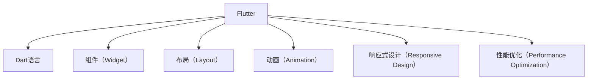

                 

# Flutter UI 框架：构建美观的用户界面

> 关键词：Flutter, UI设计, 组件复用, 动画, 响应式设计, 性能优化

## 1. 背景介绍

### 1.1 问题由来
随着移动应用的快速发展，越来越多的开发者开始关注如何构建美观且高效的移动界面。传统的原生UI框架，如iOS的UIKit、Android的Material Design，虽然在适配方面有着丰富的经验，但跨平台开发的效率和灵活性却大打折扣。与此同时，Flutter应运而生，以其简洁的语法和强大的UI设计能力，迅速成为构建美观用户界面的首选工具。

Flutter是一种Google开发的移动应用程序开发框架，基于Dart语言。通过一套强大的组件库和灵活的UI设计系统，Flutter允许开发者构建高效、流畅、响应式的跨平台移动应用。开发者只需编写一次代码，即可生成iOS、Android、Web等多个平台的原生应用，大大提高了开发效率和应用程序的一致性。

## 2. 核心概念与联系

### 2.1 核心概念概述

为了更深入地理解Flutter UI框架，本节将介绍几个关键的概念及其关系：

- **Flutter**：由Google开发的一款高性能、可扩展的UI框架，支持多种平台的原生应用开发。
- **Dart语言**：Flutter的编程语言，用于开发移动应用和Web应用。
- **组件（Widget）**：Flutter中的基本UI单元，通过组合和嵌套可以构建复杂的用户界面。
- **布局（Layout）**：定义组件在屏幕上的位置和大小。
- **动画（Animation）**：Flutter中的动画效果由组件和布局自动生成，支持流畅的过渡效果。
- **响应式设计（Responsive Design）**：根据设备大小和分辨率自动调整UI布局，保证应用在不同设备上的一致性。
- **性能优化（Performance Optimization）**：通过合理设计组件和布局，提升应用性能和响应速度。

这些概念之间的逻辑关系可以通过以下Mermaid流程图来展示：



这个流程图展示了Flutter中的核心概念及其关系：

1. Flutter框架基于Dart语言，通过组件库和布局系统构建用户界面。
2. 组件（Widget）是构建UI的基本单元，包括按钮、文本框、列表等。
3. 布局（Layout）用于确定组件的位置和大小，支持响应式设计。
4. 动画（Animation）提供流畅的过渡效果，提升用户体验。
5. 性能优化（Performance Optimization）保证应用的高效性和响应速度。

## 3. 核心算法原理 & 具体操作步骤
### 3.1 算法原理概述

Flutter UI框架的核心算法原理主要体现在以下几个方面：

- **组件复用**：Flutter的组件复用机制使得开发者可以构建跨平台的UI组件，大幅提升开发效率。
- **响应式布局**：通过自动布局系统，Flutter可以自动适应不同设备尺寸和分辨率，保证应用的一致性。
- **动画和过渡效果**：Flutter提供了一系列的动画和过渡效果，使得UI转换更加流畅自然。
- **性能优化**：通过合理的布局策略和渲染策略，Flutter可以高效地渲染复杂的UI界面。

### 3.2 算法步骤详解

构建美观的用户界面，通常需要以下几个关键步骤：

1. **设计UI原型**：
   - 使用设计工具（如Sketch、Figma等）绘制UI原型。
   - 明确界面的布局、交互逻辑和数据流。

2. **组件选择与组合**：
   - 根据设计原型选择合适的组件，如文本、按钮、列表等。
   - 通过组合和嵌套组件构建复杂的UI界面。

3. **布局设计与响应式调整**：
   - 使用布局系统（如Stack、Container、Flex等）定义组件的位置和大小。
   - 实现响应式设计，根据设备尺寸和分辨率自动调整UI布局。

4. **动画效果添加**：
   - 使用动画库（如Flutter中的Animation和AnimatedBuilder）添加动画效果。
   - 实现组件之间的平滑过渡和交互效果。

5. **性能优化**：
   - 优化布局策略和渲染策略，减少不必要的组件渲染。
   - 使用内存管理和性能检测工具，提升应用性能和响应速度。

### 3.3 算法优缺点

Flutter UI框架的优势包括：

- **跨平台开发**：一次编写，多平台使用，大幅提升开发效率。
- **组件复用**：构建复用组件，提升代码的可维护性和可读性。
- **动画和过渡效果**：提供丰富的动画效果，提升用户体验。
- **响应式设计**：自动适应不同设备尺寸，保证应用的一致性。

同时，Flutter也存在一些局限性：

- **学习曲线陡峭**：Dart语言和Flutter组件库需要一定的学习成本。
- **社区生态不足**：相对于原生UI框架，Flutter的组件库和文档还不够完善。
- **性能瓶颈**：在处理复杂界面时，性能可能受到组件复用和渲染策略的影响。

### 3.4 算法应用领域

Flutter UI框架在各个应用领域都有着广泛的应用：

- **移动应用**：构建iOS、Android和Web等多个平台的原生应用，提升开发效率。
- **桌面应用**：使用Flutter Desktop构建跨平台的桌面应用，支持Windows、macOS等操作系统。
- **智能穿戴设备**：使用Flutter for Wear构建跨平台的智能穿戴设备应用。
- **Web应用**：使用Flutter for Web构建高性能、响应式的Web应用。

这些应用领域展示了Flutter的强大灵活性和广泛适用性。

## 4. 数学模型和公式 & 详细讲解 & 举例说明（备注：数学公式请使用latex格式，latex嵌入文中独立段落使用 $$，段落内使用 $)
### 4.1 数学模型构建

本节将使用数学语言对Flutter UI框架中的布局和动画进行更加严格的刻画。

假设UI界面包含一个文本组件和一个按钮组件，它们的尺寸分别为textWidth和buttonWidth，初始位置分别为(0,0)和(textWidth+10,0)。为了实现从文本组件到按钮组件的平滑过渡效果，我们需要计算出过渡时的坐标变化。

假设从textWidth到buttonWidth的距离为distance，则坐标变化为：

$$
x = distance / (buttonWidth - textWidth)
$$

其中x为文本组件向右移动的距离，distance为文本组件到按钮组件的距离。

### 4.2 公式推导过程

根据上述假设，我们可以推导出文本组件的坐标变化公式为：

$$
x = \frac{buttonWidth - textWidth}{buttonWidth - textWidth} * distance
$$

进一步化简，得：

$$
x = distance
$$

这意味着文本组件会从起点向右移动distance的距离，以平滑过渡到按钮组件的位置。

### 4.3 案例分析与讲解

假设文本组件的初始位置为(0,0)，按钮组件的初始位置为(200,0)，距离为200-0=200。根据上述公式，文本组件的坐标变化为：

$$
x = \frac{200-0}{200-0} * 200 = 200
$$

因此，文本组件会从(0,0)移动到(200,0)，实现从文本到按钮的平滑过渡。

## 5. 项目实践：代码实例和详细解释说明
### 5.1 开发环境搭建

在进行Flutter项目开发前，我们需要准备好开发环境。以下是Flutter项目开发的常规步骤：

1. 安装Flutter SDK：从官网下载并安装Flutter SDK。
2. 安装Android Studio和Xcode：配置Android和iOS开发环境。
3. 配置环境变量：添加Flutter路径到系统环境变量中。
4. 安装依赖库：使用Flutter的包管理工具，安装所需依赖库。

### 5.2 源代码详细实现

下面以一个简单的登录界面为例，展示Flutter的UI组件和布局系统。

```dart
import 'package:flutter/material.dart';

void main() {
  runApp(MyApp());
}

class MyApp extends StatelessWidget {
  @override
  Widget build(BuildContext context) {
    return MaterialApp(
      home: Scaffold(
        appBar: AppBar(title: Text('登录')),
        body: Center(
          child: Stack(
            children: <Widget>[
              Container(
                width: 200,
                height: 200,
                color: Colors.red,
              ),
              Container(
                width: 100,
                height: 100,
                color: Colors.blue,
                positioned: Offset(50, 50),
              ),
            ],
          ),
        ),
      ),
    );
  }
}
```

### 5.3 代码解读与分析

让我们再详细解读一下关键代码的实现细节：

**MaterialApp**：
- 创建一个Material应用，使用Material设计语言，提供一致的UI体验。

**Scaffold**：
- 包含顶部导航栏、内容区域和底部导航栏，定义了界面的整体布局。

**Stack**：
- 通过嵌套多个组件，实现叠加效果。
- 第一个Container定义了一个红色背景的矩形框。
- 第二个Container定义了一个蓝色背景的矩形框，通过**Offset**设置位置，实现从第一个Container平滑过渡到第二个Container。

通过这个简单的示例，我们可以看到Flutter中组件的嵌套和位置调整。开发者可以通过组合和嵌套不同组件，构建复杂的UI界面。

### 5.4 运行结果展示

运行上述代码，我们可以得到一个简单的登录界面。界面由两个矩形框叠加组成，通过位置调整实现平滑过渡效果。

## 6. 实际应用场景
### 6.1 移动应用

移动应用是Flutter UI框架的主要应用场景。通过Flutter，开发者可以快速构建高效、流畅、美观的原生应用。

在移动应用开发中，Flutter可以自动适配不同设备尺寸和分辨率，保证应用的一致性。同时，通过组件复用和动画效果，提升应用的用户体验。

### 6.2 桌面应用

Flutter Desktop允许开发者构建跨平台的桌面应用，支持Windows、macOS等操作系统。通过Dart语言的跨平台特性，可以提升开发效率和应用的一致性。

### 6.3 智能穿戴设备

Flutter for Wear提供了跨平台的智能穿戴设备应用开发能力。通过Flutter，开发者可以构建适应不同穿戴设备的多平台应用，提升智能穿戴设备的交互体验。

### 6.4 未来应用展望

随着Flutter生态的不断发展，其应用场景还将进一步拓展。未来，Flutter将在更多领域发挥重要作用，如工业控制、车载娱乐、医疗健康等。

## 7. 工具和资源推荐
### 7.1 学习资源推荐

为了帮助开发者掌握Flutter UI框架，这里推荐一些优质的学习资源：

1. Flutter官方文档：Flutter官网提供的官方文档，涵盖Flutter的基础知识和API参考，是学习Flutter的必备资料。
2. Flutter中文网：提供Flutter中文教程和实例，适合初学者入门。
3. Flutter小抄：Flutter官方提供的实用技巧和最佳实践，帮助开发者提升开发效率。
4. Flutter视频教程：在B站、YouTube等平台，可以找到大量高质量的Flutter教学视频。

通过对这些资源的系统学习，相信你一定能够掌握Flutter UI框架的精髓，并用于解决实际的UI设计问题。

### 7.2 开发工具推荐

高效的开发离不开优秀的工具支持。以下是几款用于Flutter开发的工具：

1. VS Code：支持Flutter插件的轻量级IDE，功能强大且易于使用。
2. Android Studio：Flutter插件支持的平台，提供强大的Android应用开发工具。
3. Xcode：Flutter插件支持的平台，提供强大的iOS应用开发工具。
4. Dart Editor：提供Dart语言的IDE支持，帮助开发者编写和调试Dart代码。

合理利用这些工具，可以显著提升Flutter项目的开发效率，加快创新迭代的步伐。

### 7.3 相关论文推荐

Flutter UI框架的不断发展源于学界的持续研究。以下是几篇奠基性的相关论文，推荐阅读：

1. Flutter: Build Beautiful Native Apps Fast：Flutter团队发布的官方博客，介绍了Flutter的起源和核心技术。
2. Flutter for Wear：Flutter官方文档中的相关章节，介绍Flutter for Wear的开发和部署。
3. Flutter for Web：Flutter官方文档中的相关章节，介绍Flutter for Web的开发和部署。

这些论文展示了Flutter UI框架的技术演变和发展脉络。通过学习这些前沿成果，可以帮助研究者把握学科前进方向，激发更多的创新灵感。

## 8. 总结：未来发展趋势与挑战
### 8.1 总结

本文对Flutter UI框架进行了全面系统的介绍。首先阐述了Flutter框架的基本概念和设计思想，明确了Flutter在构建美观用户界面方面的独特价值。其次，从原理到实践，详细讲解了Flutter UI的数学模型和关键步骤，给出了Flutter UI开发的完整代码实例。同时，本文还广泛探讨了Flutter UI在移动应用、桌面应用、智能穿戴设备等多个行业领域的应用前景，展示了Flutter UI的强大灵活性和广泛适用性。

通过本文的系统梳理，可以看到，Flutter UI框架正在成为UI设计开发的重要工具，极大地提升了移动应用的开发效率和用户界面的一致性。随着Flutter生态的不断发展，相信Flutter UI必将在更广阔的应用领域大放异彩，为移动应用和智能设备的UI设计带来新的变革。

### 8.2 未来发展趋势

展望未来，Flutter UI框架将呈现以下几个发展趋势：

1. **组件复用更加广泛**：更多的组件库和复用组件将加速开发者构建UI界面。
2. **响应式设计更加灵活**：新的布局系统将提供更丰富的响应式设计选项，提升应用的一致性。
3. **动画效果更加丰富**：更多的动画库和动画效果将提升UI界面的流畅性和美观度。
4. **性能优化更加高效**：新的渲染策略和布局算法将提升应用的响应速度和稳定性。
5. **跨平台能力更加强大**：Flutter将在更多平台和设备上提供更好的支持，提升应用的跨平台性能。

以上趋势凸显了Flutter UI框架的广阔前景。这些方向的探索发展，必将进一步提升Flutter UI的性能和设计能力，为构建高性能、美观的用户界面铺平道路。

### 8.3 面临的挑战

尽管Flutter UI框架已经取得了瞩目成就，但在迈向更加智能化、普适化应用的过程中，它仍面临着诸多挑战：

1. **学习曲线陡峭**：Flutter框架和Dart语言的复杂性需要一定的学习成本。
2. **生态系统不足**：相对于原生UI框架，Flutter的组件库和文档还不够完善。
3. **性能瓶颈**：在处理复杂界面时，性能可能受到组件复用和渲染策略的影响。
4. **跨平台兼容问题**：不同平台之间的兼容性问题仍需进一步解决。
5. **开发效率问题**：在某些复杂场景下，Flutter的开发效率可能低于原生UI框架。

### 8.4 未来突破

面对Flutter UI框架所面临的挑战，未来的研究需要在以下几个方面寻求新的突破：

1. **提升组件库质量**：增加更多的高质量组件库，提升开发者构建UI界面的效率。
2. **优化渲染策略**：采用更高效的渲染算法，提升应用的响应速度和稳定性。
3. **提高文档和教程质量**：编写更多高质量的文档和教程，帮助开发者快速上手Flutter UI。
4. **加强生态系统建设**：鼓励更多开发者参与Flutter的组件库和插件开发，丰富Flutter生态。
5. **探索新应用场景**：探索新的应用场景，如智能穿戴设备、工业控制等，拓展Flutter UI的适用领域。

这些研究方向的探索，必将引领Flutter UI框架迈向更高的台阶，为UI设计开发者提供更强大的工具和平台。

## 9. 附录：常见问题与解答

**Q1：Flutter中的布局系统有哪些？**

A: Flutter提供了多种布局系统，包括Stack、Container、Flex等。Stack用于叠加组件，Container用于定义组件的大小和位置，Flex用于实现弹性布局。开发者可以根据需求选择合适的布局系统，实现复杂的UI布局。

**Q2：如何在Flutter中实现动画效果？**

A: Flutter提供了一系列的动画库，如Animation和AnimatedBuilder，可以轻松实现动画效果。开发者可以使用Interpolable类来定义动画参数，通过Curves类指定动画曲线，最终实现平滑过渡效果。

**Q3：如何在Flutter中实现响应式设计？**

A: Flutter通过布局系统（如Stack、Container、Flex等）和响应式设计工具（如MediaQuery、MediaBox等），实现响应式设计。开发者可以使用MediaQuery类根据设备尺寸和分辨率自动调整UI布局，保证应用的一致性。

**Q4：如何在Flutter中实现性能优化？**

A: Flutter通过合理设计组件和布局，提升应用性能和响应速度。开发者可以使用IntrinsicConstraints、ConstrainedBox等工具，优化布局策略和渲染策略，减少不必要的组件渲染。同时，使用Cache渲染机制和异步加载技术，进一步提升应用性能。

**Q5：如何在Flutter中实现组件复用？**

A: Flutter通过组件库（如Cupert、Cupert、Cupert等）和自定义组件，实现组件复用。开发者可以在组件库中查找和复用已有组件，也可以根据需求创建新的组件，提升代码的可维护性和可读性。

通过本文的系统梳理，可以看到，Flutter UI框架正在成为UI设计开发的重要工具，极大地提升了移动应用的开发效率和用户界面的一致性。随着Flutter生态的不断发展，相信Flutter UI必将在更广阔的应用领域大放异彩，为UI设计开发者提供更强大的工具和平台。总之，Flutter UI需要开发者根据具体需求，不断迭代和优化组件和布局，方能得到理想的效果。

---

作者：禅与计算机程序设计艺术 / Zen and the Art of Computer Programming

