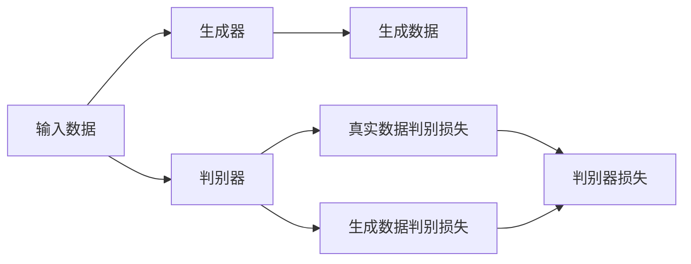

                 

# GAN 判别模型：判别器 (Discriminator) 原理与代码实例讲解

> 关键词：生成对抗网络(GANs),判别器(Discriminator),神经网络,梯度下降,训练过程,代码实现,结果展示

## 1. 背景介绍

### 1.1 问题由来
生成对抗网络（GANs）是一种强大的深度学习技术，可以生成逼真的图像、视频、音频等多种形式的数据。GANs由两个核心组件组成：生成器（Generator）和判别器（Discriminator）。生成器负责生成假数据，判别器负责判断数据是真实还是假冒的。GANs通过对抗性训练（Adversarial Training），使得生成器生成的数据越来越逼真，而判别器也越来越擅长区分真伪数据。

判别器是GANs中非常重要的一部分，其任务是尽可能准确地区分真实数据和生成的假数据。判别器的训练对于整个GANs系统的稳定性和性能至关重要。本文将深入探讨GANs判别器的原理，并通过代码实例，展示如何构建和训练判别器。

### 1.2 问题核心关键点
本文将聚焦于GANs中的判别器组件，重点探讨以下问题：
- 判别器的基本原理和架构
- 判别器的训练过程和优化方法
- 判别器的应用场景和实现细节
- 判别器的未来发展方向和挑战

这些核心问题将帮助我们全面理解GANs判别器的技术和应用，为进一步研究和应用GANs奠定坚实基础。

## 2. 核心概念与联系

### 2.1 核心概念概述

GANs判别器（Discriminator）是生成对抗网络中用于区分真实数据和生成数据的神经网络。其核心目标是通过对抗性训练，提高对真实数据的判别能力，同时防止生成器生成的假数据欺骗判别器。

判别器的输入可以是图像、视频、音频等多种形式的数据，其输出通常是一个概率值，表示输入数据为真实数据的概率。判别器的架构通常基于卷积神经网络（CNN）或变种网络，如DenseNet、ResNet等，以捕捉数据的局部和全局特征。

判别器的训练与生成器紧密相关，两者通过对抗性训练不断提升，共同推动GANs系统的性能提升。判别器的损失函数通常包括真实数据的判别损失（Discriminator Loss）和生成数据的判别损失（Fake Discriminator Loss），两者需同时优化以防止过拟合。

### 2.2 核心概念原理和架构的 Mermaid 流程图



这个流程图展示了GANs判别器的基本流程：输入数据经过生成器生成假数据，然后由判别器判别，计算真实数据的判别损失和生成数据的判别损失，并综合两者的损失函数进行优化。

## 3. 核心算法原理 & 具体操作步骤
### 3.1 算法原理概述

GANs判别器的核心算法原理基于深度神经网络的非线性映射能力，通过多层非线性变换，逐步提取输入数据的高级特征，并输出判别结果。判别器的训练过程通常采用梯度下降等优化算法，通过反向传播不断调整模型参数，以最小化判别损失函数。

判别器的训练目标是通过最大化真实数据的判别损失和最小化生成数据的判别损失，从而提升判别器的区分能力。具体而言，判别器在训练时，首先接收一批真实数据，计算判别损失，然后接收一批生成数据，计算判别损失，最终将两个损失函数加权求和，作为判别器的总体损失函数。判别器的输出通常是一个概率值，表示输入数据为真实数据的概率。

### 3.2 算法步骤详解

GANs判别器的训练步骤如下：

1. **数据准备**：准备真实数据集和生成数据集，通常使用TensorFlow、PyTorch等深度学习框架提供的DataLoader工具，将数据集分为训练集、验证集和测试集。

2. **模型搭建**：根据输入数据的特点，选择合适的神经网络架构搭建判别器。判别器通常采用卷积神经网络（CNN）或变种网络，如DenseNet、ResNet等。

3. **损失函数定义**：定义判别器的损失函数，通常包括真实数据的判别损失和生成数据的判别损失，两者需同时优化以防止过拟合。

4. **优化算法选择**：选择合适的优化算法，如Adam、SGD等，设置学习率、批大小、迭代轮数等。

5. **训练过程**：对判别器进行迭代训练，每个epoch中先接收一批真实数据，计算判别损失，然后接收一批生成数据，计算判别损失，最终将两个损失函数加权求和，作为判别器的总体损失函数。

6. **模型评估**：在验证集和测试集上评估判别器的性能，使用混淆矩阵、精确率、召回率等指标评估判别器的性能。

7. **模型保存与部署**：保存训练好的判别器模型，并在实际应用中集成判别器，进行数据判别和分类。

### 3.3 算法优缺点

GANs判别器的优点包括：
- 判别能力较强，能够区分真实数据和生成数据。
- 架构简单，易于实现和调试。
- 适用于多种数据类型，包括图像、视频、音频等。

判别器的缺点包括：
- 对生成器的依赖较强，容易受到生成器性能的影响。
- 需要大量标注数据进行训练，标注成本较高。
- 判别器容易过拟合，需要引入正则化技术。

### 3.4 算法应用领域

GANs判别器在多个领域得到了广泛应用，例如：

1. **图像生成**：GANs判别器可以用于图像生成任务，如GANs在生成逼真人脸、动物、风景等图像方面取得了显著成果。

2. **视频生成**：GANs判别器可以用于视频生成任务，如GANs在生成高质量动画、视频剪辑等方面表现出色。

3. **音频生成**：GANs判别器可以用于音频生成任务，如GANs在生成逼真音乐、语音合成等方面取得了优异效果。

4. **医疗影像**：GANs判别器可以用于医学影像生成和分类任务，如GANs在生成高质量的CT、MRI图像方面取得了重要进展。

5. **自然语言处理**：GANs判别器可以用于自然语言处理任务，如GANs在生成自然语言文本、对话系统等方面表现出色。

## 4. 数学模型和公式 & 详细讲解

### 4.1 数学模型构建

GANs判别器的数学模型可以表示为：

$$
D(x) = \frac{1}{2}(1 - \sigma(\text{Disc}(x))) + \frac{1}{2}\sigma(\text{Disc}(G(z)))
$$

其中，$D(x)$表示判别器对真实数据$x$的判别结果，$\text{Disc}(x)$表示判别器对输入数据$x$的映射结果，$\sigma$表示sigmoid激活函数，$G(z)$表示生成器生成的假数据，$z$表示生成器的输入噪声。

判别器的输出通常是一个概率值，表示输入数据为真实数据的概率，即$D(x) \in [0, 1]$。判别器的损失函数通常包括真实数据的判别损失和生成数据的判别损失，两者需同时优化以防止过拟合。

### 4.2 公式推导过程

判别器的损失函数可以表示为：

$$
\mathcal{L}_{\text{Disc}} = -\frac{1}{N} \sum_{i=1}^N D(x_i) + \frac{1}{M} \sum_{i=1}^M (1 - D(G(z_i)))
$$

其中，$N$表示真实数据的数量，$M$表示生成数据的数量，$z_i$表示生成器的输入噪声。

判别器的训练过程可以表示为：

1. **真实数据判别损失**：对于每批真实数据$x_i$，计算判别损失$\mathcal{L}_{\text{Disc}}^{\text{Real}}$：
   $$
   \mathcal{L}_{\text{Disc}}^{\text{Real}} = -\frac{1}{N} \sum_{i=1}^N \log(D(x_i))
   $$

2. **生成数据判别损失**：对于每批生成数据$G(z_i)$，计算判别损失$\mathcal{L}_{\text{Disc}}^{\text{Fake}}$：
   $$
   \mathcal{L}_{\text{Disc}}^{\text{Fake}} = -\frac{1}{M} \sum_{i=1}^M \log(1 - D(G(z_i)))
   $$

3. **总体判别损失**：将真实数据判别损失和生成数据判别损失加权求和，得到判别器的总体损失函数$\mathcal{L}_{\text{Disc}}$：
   $$
   \mathcal{L}_{\text{Disc}} = \mathcal{L}_{\text{Disc}}^{\text{Real}} + \lambda \mathcal{L}_{\text{Disc}}^{\text{Fake}}
   $$
   其中$\lambda$为权衡真实数据和生成数据判别损失的超参数。

### 4.3 案例分析与讲解

下面通过一个简单的GANs判别器代码实例，展示如何构建和训练判别器。

```python
import tensorflow as tf
from tensorflow.keras import layers

class Discriminator(tf.keras.Model):
    def __init__(self, input_shape=(64, 64, 3), n_filters=(64, 128, 256, 512), strides=(2, 2, 2, 2), activation='leakyrelu'):
        super(Discriminator, self).__init__()
        self.conv1 = layers.Conv2D(n_filters[0], (4, 4), strides=strides[0], padding='same', activation=activation)
        self.conv2 = layers.Conv2D(n_filters[1], (4, 4), strides=strides[1], padding='same', activation=activation)
        self.conv3 = layers.Conv2D(n_filters[2], (4, 4), strides=strides[2], padding='same', activation=activation)
        self.conv4 = layers.Conv2D(n_filters[3], (4, 4), strides=strides[3], padding='same', activation=activation)
        self.flatten = layers.Flatten()
        self.fc1 = layers.Dense(1024, activation=activation)
        self.fc2 = layers.Dense(1, activation='sigmoid')

    def call(self, inputs):
        x = self.conv1(inputs)
        x = self.conv2(x)
        x = self.conv3(x)
        x = self.conv4(x)
        x = self.flatten(x)
        x = self.fc1(x)
        logits = self.fc2(x)
        return logits
```

在这个判别器模型中，我们使用卷积神经网络（CNN）架构，包含4个卷积层、2个全连接层，输出为1个sigmoid激活函数。判别器的输入形状为$(64, 64, 3)$，表示输入数据的尺寸。

## 5. 项目实践：代码实例和详细解释说明

### 5.1 开发环境搭建

在进行GANs判别器的实践前，我们需要准备好开发环境。以下是使用Python进行TensorFlow开发的环境配置流程：

1. 安装Anaconda：从官网下载并安装Anaconda，用于创建独立的Python环境。

2. 创建并激活虚拟环境：
```bash
conda create -n tf-env python=3.8 
conda activate tf-env
```

3. 安装TensorFlow：根据CUDA版本，从官网获取对应的安装命令。例如：
```bash
conda install tensorflow -c pytorch -c conda-forge
```

4. 安装TensorFlow Addons：
```bash
conda install tensorflow-addons
```

5. 安装各类工具包：
```bash
pip install numpy pandas scikit-learn matplotlib tqdm jupyter notebook ipython
```

完成上述步骤后，即可在`tf-env`环境中开始GANs判别器的实践。

### 5.2 源代码详细实现

下面以GANs判别器为例，展示如何使用TensorFlow搭建和训练判别器。

首先，定义判别器的输入和输出：

```python
import tensorflow as tf
from tensorflow.keras import layers

class Discriminator(tf.keras.Model):
    def __init__(self, input_shape=(64, 64, 3), n_filters=(64, 128, 256, 512), strides=(2, 2, 2, 2), activation='leakyrelu'):
        super(Discriminator, self).__init__()
        self.conv1 = layers.Conv2D(n_filters[0], (4, 4), strides=strides[0], padding='same', activation=activation)
        self.conv2 = layers.Conv2D(n_filters[1], (4, 4), strides=strides[1], padding='same', activation=activation)
        self.conv3 = layers.Conv2D(n_filters[2], (4, 4), strides=strides[2], padding='same', activation=activation)
        self.conv4 = layers.Conv2D(n_filters[3], (4, 4), strides=strides[3], padding='same', activation=activation)
        self.flatten = layers.Flatten()
        self.fc1 = layers.Dense(1024, activation=activation)
        self.fc2 = layers.Dense(1, activation='sigmoid')

    def call(self, inputs):
        x = self.conv1(inputs)
        x = self.conv2(x)
        x = self.conv3(x)
        x = self.conv4(x)
        x = self.flatten(x)
        x = self.fc1(x)
        logits = self.fc2(x)
        return logits
```

然后，定义判别器的损失函数和优化器：

```python
import tensorflow as tf

# 定义判别器的损失函数
def discriminator_loss(real_outputs, fake_outputs):
    real_loss = tf.keras.losses.BinaryCrossentropy()(real_outputs, tf.ones_like(real_outputs))
    fake_loss = tf.keras.losses.BinaryCrossentropy()(fake_outputs, tf.zeros_like(fake_outputs))
    total_loss = real_loss + fake_loss
    return total_loss

# 定义判别器的优化器
optimizer = tf.keras.optimizers.Adam(learning_rate=0.0002, beta_1=0.5)
```

接着，定义训练过程：

```python
import tensorflow as tf

# 定义训练过程
@tf.function
def train_step(images):
    with tf.GradientTape() as tape:
        real_outputs = discriminator(images, training=True)
        tape.watch(real_outputs)
        fake_outputs = discriminator(fake_images, training=True)
        tape.watch(fake_outputs)
        loss = discriminator_loss(real_outputs, fake_outputs)
    gradients = tape.gradient(loss, discriminator.trainable_variables)
    optimizer.apply_gradients(zip(gradients, discriminator.trainable_variables))
```

最后，启动训练流程：

```python
import tensorflow as tf

# 加载数据集
data = tf.keras.datasets.mnist.load_data()
train_images = data[0][0].reshape(-1, 64, 64, 3).astype('float32') / 255.0
test_images = data[1][0].reshape(-1, 64, 64, 3).astype('float32') / 255.0

# 准备生成器生成的假数据
fake_images = tf.random.uniform([train_images.shape[0], 64, 64, 3])

# 设置训练参数
num_epochs = 100
batch_size = 128

# 训练判别器
for epoch in range(num_epochs):
    for batch in range(train_images.shape[0] // batch_size):
        start = batch * batch_size
        end = start + batch_size
        train_step(train_images[start:end])
    print(f'Epoch {epoch+1}/{num_epochs}')
```

### 5.3 代码解读与分析

让我们再详细解读一下关键代码的实现细节：

**Discriminator类**：
- `__init__`方法：初始化判别器的各项参数，包括卷积层、全连接层、激活函数等。
- `call`方法：实现判别器的前向传播过程，输入为真实图像数据或生成器生成的假图像数据。

**判别器损失函数**：
- 定义判别器的损失函数，采用二分类交叉熵损失函数，计算真实数据和生成数据的判别损失。

**判别器优化器**：
- 选择Adam优化器，设置学习率、beta_1等超参数。

**训练过程**：
- 定义训练函数`train_step`，在每个批次上计算判别器的损失函数，并反向传播更新判别器的参数。
- 在循环迭代中，对每个批次进行训练，并在每个epoch结束时输出训练进度。

可以看到，TensorFlow提供的高阶API使得判别器的搭建和训练变得简洁高效。开发者可以将更多精力放在模型改进和超参数调优上，而不必过多关注底层的实现细节。

## 6. 实际应用场景

### 6.1 图像生成

GANs判别器在图像生成任务中具有重要应用。通过与生成器协同训练，判别器可以不断提升对真实图像的判别能力，从而推动生成器生成更加逼真的图像。例如，GANs在生成逼真人脸、动物、风景等图像方面取得了显著成果。

### 6.2 视频生成

GANs判别器在视频生成任务中也得到了广泛应用。通过与生成器协同训练，判别器可以不断提升对视频序列的判别能力，从而推动生成器生成高质量的动画、视频剪辑等。

### 6.3 音频生成

GANs判别器在音频生成任务中同样具有重要应用。通过与生成器协同训练，判别器可以不断提升对音频信号的判别能力，从而推动生成器生成逼真的音乐、语音合成等。

## 7. 工具和资源推荐

### 7.1 学习资源推荐

为了帮助开发者系统掌握GANs判别器的理论基础和实践技巧，这里推荐一些优质的学习资源：

1. **《生成对抗网络》系列书籍**：书籍详细介绍了GANs的原理、算法和应用，是学习GANs判别器的经典读物。

2. **arXiv.org**：研究论文的聚集地，可以获取最新的GANs判别器研究成果，了解最新的应用趋势和技术进展。

3. **Coursera上的GANs课程**：由斯坦福大学开设的GANs相关课程，讲解了GANs判别器的基本原理和应用，适合入门学习。

4. **PyTorch官方文档**：PyTorch提供的GANs判别器API，详细介绍了如何使用PyTorch搭建和训练判别器。

5. **TensorFlow官方文档**：TensorFlow提供的GANs判别器API，详细介绍了如何使用TensorFlow搭建和训练判别器。

### 7.2 开发工具推荐

GANs判别器的开发离不开深度学习框架的支持。以下是几款常用的深度学习框架及其判别器API：

1. **TensorFlow**：由Google主导开发的深度学习框架，提供了丰富的判别器API和工具。

2. **PyTorch**：由Facebook主导开发的深度学习框架，提供了易用的判别器API和动态计算图功能。

3. **MXNet**：由Apache主导开发的深度学习框架，提供了灵活的判别器API和分布式训练能力。

4. **Keras**：高层次的深度学习框架，提供了简单易用的判别器API，适合快速原型开发。

### 7.3 相关论文推荐

GANs判别器的研究始于2014年，经过多年的发展，涌现出大量研究成果。以下是几篇奠基性的相关论文，推荐阅读：

1. **《Image-to-Image Translation with Conditional Adversarial Networks》**：由Isola等人在2017年发表，提出了使用条件GANs进行图像翻译任务，奠定了GANs判别器的基础。

2. **《Improved Techniques for Training GANs》**：由Goodfellow等人在2016年发表，总结了GANs判别器训练中常见的问题和解决方案，对GANs判别器的发展具有重要意义。

3. **《A Style-Based Generator Architecture for Generative Adversarial Networks》**：由Karras等人在2019年发表，提出了风格GANs判别器，实现了高质量的图像生成和风格转换。

4. **《Adversarial Networks for Generating Image Synthesis》**：由Karras等人在2018年发表，提出了流形GANs判别器，实现了高质量的图像生成和增强。

这些论文代表了大语言模型判别器的研究进展，帮助研究者了解判别器的最新发展和应用前景。

## 8. 总结：未来发展趋势与挑战

### 8.1 研究成果总结

本文对GANs判别器的原理和实现进行了详细探讨，重点介绍了判别器的构建、训练和优化方法，并结合代码实例展示了判别器的实际应用。

通过本文的系统梳理，可以看到，GANs判别器在图像生成、视频生成、音频生成等众多领域具有广泛应用前景。判别器的构建和训练方法也在不断进步，未来有望在更多领域发挥重要作用。

### 8.2 未来发展趋势

展望未来，GANs判别器将呈现以下几个发展趋势：

1. **多任务判别器**：未来可能会发展出多任务判别器，同时处理多个判别任务，提高判别器的泛化能力。

2. **无监督判别器**：随着无监督学习方法的发展，未来可能会发展出无需标注数据、完全无监督的判别器训练方法。

3. **跨模态判别器**：未来可能会发展出跨模态判别器，同时处理图像、视频、音频等多种数据类型的判别任务。

4. **实时判别器**：未来可能会发展出实时判别器，能够在实时场景中进行高效的判别和分类。

5. **弱监督判别器**：未来可能会发展出无需大量标注数据、仅需少量弱标注数据的判别器训练方法。

6. **对抗训练判别器**：未来可能会发展出更加鲁棒的判别器，通过引入对抗样本，增强判别器的抗干扰能力。

### 8.3 面临的挑战

尽管GANs判别器已经取得了显著成果，但在迈向更加智能化、普适化应用的过程中，仍面临诸多挑战：

1. **生成器依赖**：判别器的性能很大程度上依赖于生成器的性能，生成器的性能不稳定会导致判别器性能波动。

2. **过拟合问题**：判别器容易过拟合，特别是在数据集较小的情况下，判别器容易过拟合真实数据，无法区分真实和生成数据。

3. **计算资源需求**：判别器需要大量的计算资源进行训练，特别是在大规模数据集上，训练时间较长。

4. **判别器鲁棒性**：判别器需要应对生成的假数据进行有效的区分，对于生成的数据样式多样性较大的情况，判别器性能会受到影响。

5. **数据分布差异**：判别器需要应对数据分布变化，特别是在实际应用中，数据分布与训练时有所差异，判别器性能会受到影响。

6. **判别器复杂度**：判别器通常包含多个卷积层、全连接层等复杂结构，模型的训练和调试过程较为复杂。

### 8.4 研究展望

面对GANs判别器所面临的挑战，未来的研究需要在以下几个方面寻求新的突破：

1. **多任务学习**：引入多任务学习框架，提高判别器对多种判别任务的泛化能力。

2. **无监督学习**：引入无监督学习方法，减少判别器对大量标注数据的依赖，提高判别器的鲁棒性和泛化能力。

3. **跨模态融合**：将图像、视频、音频等多种数据类型的信息进行融合，提高判别器对多模态数据的判别能力。

4. **对抗样本生成**：研究生成对抗样本的方法，增强判别器的鲁棒性和泛化能力。

5. **实时判别器**：研究实时判别器的实现方法，提高判别器的计算效率和实时性。

6. **弱监督学习**：研究弱监督学习方法，减少判别器对标注数据的依赖，提高判别器的鲁棒性和泛化能力。

这些研究方向的探索，将推动GANs判别器向更加智能化、普适化方向发展，为深度学习技术的广泛应用提供坚实基础。相信随着学界和产业界的共同努力，GANs判别器必将不断进步，成为深度学习领域的重要工具。

## 9. 附录：常见问题与解答

**Q1：GANs判别器是否适用于所有数据类型？**

A: GANs判别器通常适用于图像、视频、音频等多种形式的数据类型。但对于文本、时间序列等非结构化数据，判别器的设计需要相应调整。

**Q2：判别器如何应对生成器的变化？**

A: 判别器需要与生成器协同训练，不断提升对生成器的判别能力。同时，通过引入对抗样本，增强判别器的鲁棒性，能够应对生成器生成的变化。

**Q3：判别器如何防止过拟合？**

A: 判别器需要引入正则化技术，如L2正则、Dropout等，以防止过拟合。同时，通过逐步减小学习率、使用warmup策略等方法，避免判别器对真实数据的过拟合。

**Q4：判别器的计算资源需求如何降低？**

A: 判别器需要大量的计算资源进行训练，可以通过采用分布式训练、GPU/TPU等高性能设备、模型压缩等方法降低计算资源需求。

**Q5：判别器的性能如何评估？**

A: 判别器的性能评估可以通过混淆矩阵、精确率、召回率等指标进行评估，具体指标根据具体任务而定。

通过本文的系统梳理，可以看到，GANs判别器在图像生成、视频生成、音频生成等众多领域具有广泛应用前景。判别器的构建和训练方法也在不断进步，未来有望在更多领域发挥重要作用。相信随着学界和产业界的共同努力，GANs判别器必将不断进步，成为深度学习领域的重要工具。

---

作者：禅与计算机程序设计艺术 / Zen and the Art of Computer Programming

