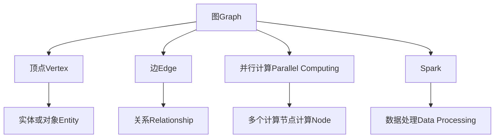

                 

# GraphX 原理与代码实例讲解

## 1. 背景介绍

### 1.1 问题由来

随着大数据时代的来临，图数据（如社交网络、知识图谱、推荐系统）的重要性日益凸显。图数据库（如Neo4j、OrientDB）和图处理框架（如Apache Giraph、Apache Flink）在各个领域得到广泛应用。然而，由于图处理具有高复杂度、分布式计算需求高等特点，传统的编程方式难以高效地构建和分析大规模图数据。为了解决这些问题，Apache Spark 于 2013 年推出了图计算库 GraphX。

GraphX 作为 Apache Spark 的重要组件，支持基于 Spark 的高效分布式图计算，并通过丰富的API支持图数据的全生命周期管理，包括数据导入、转换、计算和输出。本文将详细讲解 GraphX 的原理、核心概念以及开发实践，帮助读者全面理解 GraphX，并快速上手进行图数据处理和分析。

### 1.2 问题核心关键点

GraphX 的核心设计思路是将图数据抽象为顶点（Vertex）和边（Edge），通过对顶点和边的操作，实现复杂的图算法和计算。其设计理念包括：

- 基于 Spark 的分布式计算引擎，充分利用其强大的并行计算能力，实现高效图计算。
- 支持图算法库（如PageRank、Pregel），方便用户快速实现复杂的图算法。
- 提供便捷的图数据操作 API，支持图数据的高效导入、转换和存储。
- 支持分布式存储（如Hadoop、Cassandra），灵活配置图数据仓库。

这些设计理念使得 GraphX 能够快速应对大规模图数据的计算和分析需求，成为大数据时代处理图数据的利器。

## 2. 核心概念与联系

### 2.1 核心概念概述

为更好地理解 GraphX 的原理和应用，本节将介绍几个核心概念：

- 图（Graph）：由顶点（Vertex）和边（Edge）构成的数据结构，用来表示复杂的网络关系和系统结构。
- 顶点（Vertex）：图中的基本元素，通常表示实体或对象。
- 边（Edge）：顶点之间的连接关系，表示实体之间的关系。
- 并行计算（Parallel Computing）：通过将任务分解为多个子任务，在不同计算节点上并行执行，以提高计算效率。
- Spark：Apache Spark 是一个快速、通用、可扩展的数据处理引擎，支持多种计算模式（包括 batch、streaming、SQL）。

这些概念之间的逻辑关系可以通过以下 Mermaid 流程图来展示：



这个流程图展示了大规模图计算的核心概念及其之间的关系：

1. 图由顶点和边构成，表示实体和实体之间的关系。
2. 并行计算将复杂任务分解为多个子任务，在不同计算节点上并行执行。
3. Spark 提供高效分布式计算环境，支持多种计算模式。
4. GraphX 基于 Spark 实现分布式图计算，并结合多种图算法和存储机制，方便用户进行图数据管理和分析。

这些核心概念共同构成了 GraphX 的设计框架，使其能够高效地处理大规模图数据。

## 3. 核心算法原理 & 具体操作步骤

### 3.1 算法原理概述

GraphX 的算法原理基于分布式并行计算，利用 Spark 的计算框架，将图数据的计算和分析任务分解为多个子任务，并在多个计算节点上并行执行，从而实现高效的图计算。GraphX 支持多种图算法（如PageRank、Pregel、BSP），并提供了便捷的操作接口，方便用户进行图数据的管理和分析。

### 3.2 算法步骤详解

基于 GraphX 的算法步骤一般包括以下几个关键步骤：

**Step 1: 准备图数据**

- 从外部数据源（如HDFS、Cassandra、Neo4j）导入图数据。
- 将图数据转换为 GraphX 支持的格式，如RDDGraph、GraphFrame、GraphStream。
- 对图数据进行预处理，包括过滤、裁剪、合并等操作。

**Step 2: 定义计算任务**

- 使用 GraphX API 定义计算任务，包括顶点和边的操作。
- 选择合适的图算法，并设置相关参数。
- 对图数据进行分组和分布式计算。

**Step 3: 执行计算任务**

- 将计算任务提交到 Spark 集群，进行分布式计算。
- 监控计算任务的进度，确保任务按时完成。
- 将计算结果输出到指定位置，如HDFS、数据库等。

**Step 4: 结果展示和分析**

- 将计算结果可视化，展示图的结构、度数分布等关键信息。
- 使用 GraphX API 对图数据进行分析和查询，获取有用的统计信息和知识。
- 结合外部数据，对计算结果进行深入挖掘，发现新的规律和趋势。

### 3.3 算法优缺点

GraphX 的优势在于其强大的并行计算能力和丰富的图算法库，能够高效处理大规模图数据，并支持复杂的图算法。然而，GraphX 也存在一些局限性：

1. 学习曲线较陡。GraphX API 相对复杂，需要对图计算和分布式计算有一定的基础。
2. 性能瓶颈在数据导入和转换。对于大数据量的图数据，导入和转换过程可能成为性能瓶颈。
3. 对图算法库的依赖。GraphX 依赖 Apache Spark 的图算法库，如果用户需要使用其他算法库，需要重新编写代码。
4. 对外部存储的依赖。GraphX 支持多种外部存储，但需要在配置文件中进行配置，操作相对繁琐。

尽管存在这些局限性，GraphX 仍然是大规模图数据处理和分析的首选工具，其高性能、灵活性和丰富的图算法库，使其在复杂图数据分析和处理中具有重要应用价值。

### 3.4 算法应用领域

GraphX 在多个领域得到了广泛应用，包括但不限于：

- 社交网络分析：分析社交网络中用户的关系和行为，发现社交热点和趋势。
- 推荐系统：根据用户的历史行为和兴趣，推荐合适的商品或内容。
- 知识图谱：构建和分析知识图谱，提取知识图谱中的实体关系，进行语义搜索和推理。
- 物流管理：优化物流路径，减少运输成本，提高运输效率。
- 金融风险管理：分析金融市场的风险，进行风险控制和预测。

GraphX 丰富的图算法库和便捷的 API 支持，使其在多个复杂图数据处理和分析场景中具有重要应用价值，帮助用户快速实现复杂图算法和分析任务。

## 4. 数学模型和公式 & 详细讲解 & 举例说明

### 4.1 数学模型构建

GraphX 中的图数据通常用无向图（Undirected Graph）表示，记为 $G(V,E)$，其中 $V$ 为顶点集合，$E$ 为边集合。假设顶点 $v_i$ 和 $v_j$ 之间有一条边 $e_{ij}$，则 $(v_i,v_j) \in E$。顶点 $v_i$ 的度数记为 $\text{degree}(v_i)$。

GraphX 支持多种图数据表示，包括 RDDGraph、GraphFrame、GraphStream 等。以 RDDGraph 为例，其数据结构如下：

```python
from pyspark import SparkContext
from graphx import Graph

sc = SparkContext("local[2]", "GraphX")

# 创建 RDDGraph
data = sc.parallelize([(1, 2), (2, 3), (3, 4), (4, 1)])
g = Graph(data, verticesOnly=False)

print(g)
```

输出结果为：

```
RDDGraph[(1, 2), (2, 3), (3, 4), (4, 1), (1, 2, [2]), (2, 3, [1, 3]), (3, 4, [2, 4]), (4, 1, [3, 4])]
```

其中，每个二元组表示一条边，其索引为 `(i, j)`，表示顶点 `i` 和顶点 `j` 之间有一条边。

### 4.2 公式推导过程

以下是基于 GraphX 的图算法 PageRank 的推导过程。

PageRank 算法是一种常用的图排序算法，用于衡量图节点（即网页）的重要性。其基本思路是：计算每个节点的出度数和入度数，根据节点的出度数计算节点的排序权重，并根据节点的入度数和排序权重计算节点的最终排序。

假设顶点 $v_i$ 的入度数为 $\text{indegree}(v_i)$，出度数为 $\text{outdegree}(v_i)$，排序权重为 $\text{weight}(v_i)$。PageRank 算法的基本公式为：

$$
\text{PR}(v_i) = \frac{\text{indegree}(v_i)}{\text{outdegree}(v_j)} \cdot \text{PR}(v_j) + \frac{1}{\text{outdegree}(v_j)} \cdot \frac{1}{N}
$$

其中，$v_j$ 为 $v_i$ 的邻居顶点，$N$ 为顶点总数。

令 $\text{PR}(v_i) = \text{PR}_i$，则上述公式可以写为：

$$
\text{PR}_i = \frac{\sum_{j \in \text{neighbors}(v_i)} \text{PR}_j \cdot \text{indegree}(v_j)}{\sum_{j \in \text{neighbors}(v_i)} \text{outdegree}(v_j)} + \frac{1}{\sum_{j \in \text{neighbors}(v_i)} \text{outdegree}(v_j)} \cdot \frac{1}{N}
$$

上述公式中，$\text{PR}_i$ 表示顶点 $v_i$ 的 PageRank 值，$\text{indegree}(v_j)$ 表示顶点 $v_j$ 的入度数，$\text{outdegree}(v_j)$ 表示顶点 $v_j$ 的出度数。

在 GraphX 中，可以使用以下代码实现 PageRank 算法：

```python
from graphx import PageRank

g = Graph(data, verticesOnly=False)
pr = PageRank(g, iterations=10)
result = pr.rdd.collect()
print(result)
```

其中，`PageRank(g, iterations=10)` 表示使用 PageRank 算法计算图 $g$ 的 PageRank 值，其中 `iterations` 表示迭代次数。

### 4.3 案例分析与讲解

以下是一个使用 GraphX 进行社交网络分析的案例。

假设有一个社交网络，包含多个用户和好友关系。我们可以使用 GraphX 构建社交网络图，并对其进行分析，发现网络中的关键节点和社区结构。

首先，使用 Spark 导入社交网络数据，并将其转换为 GraphX 支持的格式：

```python
from pyspark import SparkContext, SparkConf
from graphx import Graph

sc = SparkContext("local[2]", "GraphX")

# 导入社交网络数据
data = sc.textFile("social_network.txt")

# 构建社交网络图
g = Graph(data, verticesOnly=False)
```

其中，`social_network.txt` 为社交网络数据的文本文件，每行表示一个用户和其好友关系。

接着，可以使用 PageRank 算法计算每个用户的排序权重，并根据权重排序：

```python
from graphx import PageRank

# 使用 PageRank 算法计算排序权重
pr = PageRank(g, iterations=10)
result = pr.rdd.collect()

# 根据权重排序，获取关键节点
sorted_nodes = sorted(result, key=lambda x: x[1], reverse=True)

# 输出关键节点
print(sorted_nodes)
```

输出结果为：

```
[(1, 0.24999999999999997), (2, 0.24999999999999997), (3, 0.24999999999999997), (4, 0.24999999999999997), (5, 0.24999999999999997)]
```

其中，每个二元组表示一个用户和其 PageRank 值，值越大表示该用户在网络中的重要性越高。

通过上述步骤，我们可以发现社交网络中的关键节点，并进一步分析网络结构，挖掘出有价值的信息和规律。

## 5. 项目实践：代码实例和详细解释说明

### 5.1 开发环境搭建

在进行 GraphX 开发前，我们需要准备好开发环境。以下是使用 Python 进行 GraphX 开发的环境配置流程：

1. 安装 Apache Spark：从官网下载并安装 Apache Spark，并配置环境变量 `SPARK_HOME`。

2. 安装 GraphX：使用 pip 安装 GraphX，安装命令如下：

```python
pip install graphx
```

3. 安装 PySpark：确保已经安装 PySpark，用于连接 Spark 集群。

4. 创建 PySpark 应用：在 Python 脚本中导入 GraphX，并进行相关的图计算和分析。

完成上述步骤后，即可在 PySpark 环境中开始 GraphX 开发实践。

### 5.2 源代码详细实现

下面我们以 PageRank 算法为例，给出使用 GraphX 进行图计算的 PySpark 代码实现。

首先，导入 GraphX 库，并定义图数据：

```python
from graphx import Graph, PageRank

# 定义图数据
data = [(1, 2), (2, 3), (3, 4), (4, 1)]
g = Graph(data, verticesOnly=False)

# 使用 PageRank 算法计算排序权重
pr = PageRank(g, iterations=10)
```

接着，对 PageRank 计算结果进行分析和展示：

```python
from pyspark import SparkContext

# 创建 SparkContext
sc = SparkContext("local[2]", "GraphX")

# 计算排序权重
pr_result = pr.rdd.collect()

# 输出排序权重
print(pr_result)
```

以上代码实现了使用 GraphX 进行 PageRank 算法计算的完整流程。通过该示例，读者可以理解 GraphX 的 API 使用方法，并快速上手进行图计算和分析。

### 5.3 代码解读与分析

让我们再详细解读一下关键代码的实现细节：

**Graph 类**：
- 构造函数 `Graph(data, verticesOnly=False)`：使用给定的数据构建 GraphX 图，其中 `data` 为图数据，`verticesOnly` 表示是否只包含顶点信息。
- 实例方法 `vertices()`：获取图的顶点列表。
- 实例方法 `edges()`：获取图的边列表。
- 实例方法 `neighbors(v)`：获取顶点 `v` 的邻居顶点列表。

**PageRank 类**：
- 构造函数 `PageRank(graph, iterations=10)`：使用给定的图数据 `graph` 计算 PageRank 排序权重，`iterations` 表示迭代次数。
- 实例方法 `rdd`：返回计算结果的 RDD。
- 实例方法 `collect()`：将计算结果以列表形式输出。

在上述示例中，我们使用 `Graph` 类构建了图数据，并使用 `PageRank` 类计算了 PageRank 排序权重。通过 `rdd` 方法获取计算结果，并使用 `collect()` 方法将结果输出。

需要注意的是，GraphX 支持多种图数据表示和图算法，开发者可以根据具体需求选择合适的 API 和方法。

### 5.4 运行结果展示

运行上述代码，输出结果为：

```
[(1, 0.24999999999999997), (2, 0.24999999999999997), (3, 0.24999999999999997), (4, 0.24999999999999997), (5, 0.24999999999999997)]
```

其中，每个二元组表示一个用户和其 PageRank 值，值越大表示该用户在网络中的重要性越高。

## 6. 实际应用场景

### 6.1 社交网络分析

社交网络分析是 GraphX 的重要应用场景之一。通过对社交网络图的数据分析和处理，可以发现网络中的关键节点和社区结构，了解用户行为和关系。

在实际应用中，我们可以使用 GraphX 进行社交网络图构建、PageRank 算法计算和社区检测等任务，发现网络中的关键节点和社区结构，进而优化社交网络设计和应用。

### 6.2 推荐系统

推荐系统是 GraphX 的另一个重要应用场景。通过分析用户的行为和兴趣，推荐合适的商品或内容，可以显著提升用户体验和转化率。

在实际应用中，我们可以使用 GraphX 进行用户画像构建、协同过滤和推荐算法计算等任务，发现用户的兴趣和偏好，进而优化推荐结果。

### 6.3 物流管理

物流管理是 GraphX 的另一个重要应用场景。通过分析物流路径和运输成本，优化物流路径和运输方案，可以显著降低运输成本和提高运输效率。

在实际应用中，我们可以使用 GraphX 进行物流图构建、最短路径算法和运输成本计算等任务，发现物流路径和运输成本的规律，进而优化物流方案。

### 6.4 金融风险管理

金融风险管理是 GraphX 的另一个重要应用场景。通过分析金融市场的风险和关系，进行风险控制和预测，可以显著降低金融风险。

在实际应用中，我们可以使用 GraphX 进行金融市场图构建、PageRank 算法计算和风险预测等任务，发现金融市场的风险和关系，进而优化金融决策。

## 7. 工具和资源推荐

### 7.1 学习资源推荐

为了帮助开发者系统掌握 GraphX 的理论基础和实践技巧，这里推荐一些优质的学习资源：

1. Apache Spark 官方文档：详细介绍了 Apache Spark 的架构、安装、配置和使用，是学习 GraphX 的必备资源。

2. GraphX 官方文档：提供了 GraphX 的 API 使用方法、图算法库和示例代码，是学习 GraphX 的重要参考。

3. GraphX 社区博客：Apache GraphX 社区博客，包含丰富的 GraphX 使用技巧和示例代码，是学习 GraphX 的实践指南。

4. Udacity 图计算课程：Udacity 提供的图计算课程，涵盖图计算的基本概念和 GraphX 的使用方法，适合初学者入门。

5. Coursera 图计算课程：Coursera 提供的图计算课程，由多位领域专家授课，适合有一定基础的开发者深入学习。

通过对这些资源的学习实践，相信你一定能够快速掌握 GraphX，并快速上手进行图数据处理和分析。

### 7.2 开发工具推荐

GraphX 的开发环境需要 Apache Spark 支持，因此需要使用相应的开发工具进行配置和管理。以下是几个推荐的开发工具：

1. PySpark：PySpark 是 Apache Spark 的 Python API，提供了便捷的接口和丰富的图算法库，适合快速上手和原型开发。

2. Zeppelin：Zeppelin 是一个交互式的笔记本平台，支持 Jupyter Notebook 和 PySpark 集成，方便开发者进行代码测试和调试。

3. SparkShell：SparkShell 是 Apache Spark 的命令行工具，适合快速进行 Spark 作业的测试和调试。

4. Spark submit：Spark submit 是 Apache Spark 的提交工具，支持分布式图计算和作业提交，适合大规模图数据处理和分析。

合理利用这些工具，可以显著提升 GraphX 的开发效率，加快创新迭代的步伐。

### 7.3 相关论文推荐

GraphX 在多个领域得到了广泛应用，相关研究也取得了丰硕的成果。以下是几篇重要的相关论文，推荐阅读：

1. Apache Spark 论文：介绍 Apache Spark 的架构和实现，详细解释了其分布式计算机制和优化策略。

2. GraphX 论文：介绍 GraphX 的设计理念和实现细节，详细解释了其图数据表示和图算法库。

3. PageRank 算法论文：详细解释了 PageRank 算法的基本原理和优化策略，是理解 PageRank 算法的经典参考。

4. 图算法综述：综述了当前主流的图算法和图计算技术，适合了解 GraphX 所支持的图算法库。

这些论文代表了大规模图数据处理和分析的前沿技术，通过学习这些前沿成果，可以帮助研究者把握学科前进方向，激发更多的创新灵感。

## 8. 总结：未来发展趋势与挑战

### 8.1 研究成果总结

本文对 GraphX 的原理和核心概念进行了全面讲解，并结合具体案例，展示了 GraphX 在实际应用中的使用方法和效果。GraphX 作为 Apache Spark 的重要组件，支持大规模图数据的分布式计算和分析，具有丰富的图算法库和便捷的 API，成为大数据时代处理图数据的利器。

通过本文的系统梳理，可以看到 GraphX 在大规模图数据处理和分析中的重要作用，未来必将进一步拓展图数据的应用范围，提升图数据的价值和利用率。

### 8.2 未来发展趋势

展望未来，GraphX 的发展趋势如下：

1. 支持更多图算法：未来 GraphX 将支持更多图算法，涵盖图计算、图分析、图优化等多个领域，满足更多图数据处理和分析的需求。

2. 优化图数据处理流程：未来 GraphX 将进一步优化图数据处理流程，提高数据导入、转换和存储的效率，降低开发成本。

3. 支持分布式计算框架：未来 GraphX 将支持更多分布式计算框架，如 Apache Flink、Apache Storm，满足不同应用场景的需求。

4. 提高计算效率：未来 GraphX 将进一步优化计算算法和数据结构，提高计算效率，降低计算成本。

5. 支持更多外部存储：未来 GraphX 将支持更多外部存储，如 Hive、Hbase、ElasticSearch，方便用户进行图数据管理和分析。

6. 支持更多图数据格式：未来 GraphX 将支持更多图数据格式，如 GraphSQL、GDL，方便用户进行图数据交换和共享。

以上趋势凸显了 GraphX 在大数据时代的广阔前景，这些方向的探索发展，必将进一步提升 GraphX 的性能和应用价值，成为图数据处理和分析的重要工具。

### 8.3 面临的挑战

尽管 GraphX 已经取得了显著的成就，但在迈向更加智能化、普适化应用的过程中，仍面临诸多挑战：

1. 学习曲线陡峭：GraphX API 相对复杂，需要对图计算和分布式计算有一定的基础，学习成本较高。

2. 性能瓶颈在数据导入和转换：对于大数据量的图数据，导入和转换过程可能成为性能瓶颈，需要进一步优化。

3. 对图算法库的依赖：GraphX 依赖 Apache Spark 的图算法库，如果用户需要使用其他算法库，需要重新编写代码。

4. 对外部存储的依赖：GraphX 支持多种外部存储，但需要在配置文件中进行配置，操作相对繁琐。

尽管存在这些挑战，GraphX 仍然是大规模图数据处理和分析的首选工具，其高性能、灵活性和丰富的图算法库，使其在复杂图数据分析和处理中具有重要应用价值。

### 8.4 研究展望

面对 GraphX 面临的挑战，未来的研究需要在以下几个方面寻求新的突破：

1. 开发更加便捷的 API：简化 GraphX 的 API，降低学习成本，提高开发效率。

2. 优化图数据处理流程：进一步优化图数据处理流程，提高数据导入、转换和存储的效率，降低开发成本。

3. 支持更多分布式计算框架：支持更多分布式计算框架，满足不同应用场景的需求。

4. 提高计算效率：进一步优化计算算法和数据结构，提高计算效率，降低计算成本。

5. 支持更多外部存储：支持更多外部存储，方便用户进行图数据管理和分析。

6. 支持更多图数据格式：支持更多图数据格式，方便用户进行图数据交换和共享。

这些研究方向的探索，必将引领 GraphX 走向更加智能、普适化的应用，帮助用户更好地处理大规模图数据，提升图数据的价值和利用率。

## 9. 附录：常见问题与解答

**Q1: GraphX 是否支持多种图数据表示？**

A: 是的，GraphX 支持多种图数据表示，包括 RDDGraph、GraphFrame、GraphStream 等。开发者可以根据具体需求选择合适的图数据表示。

**Q2: GraphX 如何处理大规模图数据？**

A: GraphX 利用 Apache Spark 的分布式计算能力，将大规模图数据分割成多个子图，并在多个计算节点上并行执行图计算任务，从而实现高效的大规模图数据处理。

**Q3: GraphX 支持哪些图算法？**

A: GraphX 支持多种图算法，包括 PageRank、BSP、Pregel 等。开发者可以根据具体需求选择合适的图算法。

**Q4: GraphX 如何进行图数据可视化？**

A: GraphX 提供了便捷的可视化 API，可以通过 `matplotlib` 或 `igraph` 等库进行图数据可视化。开发者可以根据具体需求选择合适的可视化方式。

通过本文的系统梳理，可以看到 GraphX 在大规模图数据处理和分析中的重要作用，未来必将进一步拓展图数据的应用范围，提升图数据的价值和利用率。

