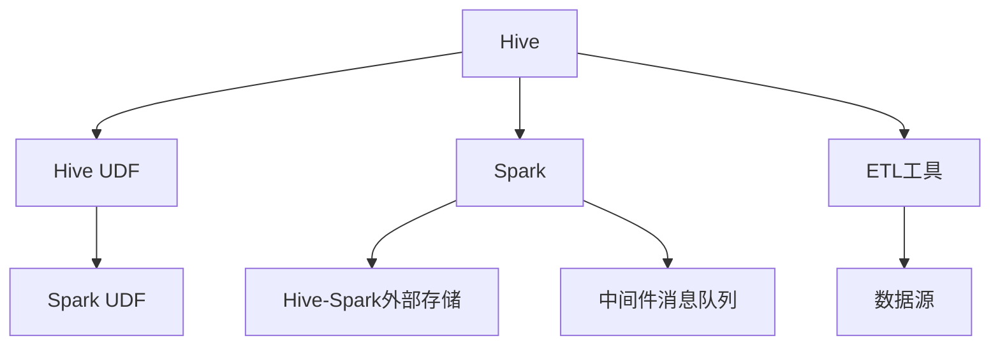

                 

# Hive-Spark整合原理与代码实例讲解

> 关键词：Hive, Spark, 大数据, ETL, 分布式计算

## 1. 背景介绍

在大数据时代，数据处理和分析的规模不断扩大，传统的数据库和数据仓库已无法满足需求。Hive和Spark作为两种流行的分布式数据处理框架，各自有其独特的优势和应用场景。Hive通过SQL语言对Hadoop进行封装，提供了更高的抽象层，适合数据仓库和OLAP分析任务；而Spark则通过内存计算优化了迭代计算的效率，支持流式数据处理和机器学习任务。为了充分发挥两者的优势，通常需要将它们进行整合，构建出高效、灵活、可扩展的数据处理和分析系统。

## 2. 核心概念与联系

### 2.1 核心概念概述

为了更好地理解Hive-Spark的整合原理，我们需要先介绍几个核心概念：

- Hive：一个基于Hadoop的分布式SQL数据库管理系统，用于处理大规模结构化数据。Hive通过将SQL查询转换为Hadoop MapReduce作业，使得用户可以使用熟悉的SQL语言进行数据操作。
- Spark：一个快速、通用、可扩展的分布式计算系统，支持内存计算和流式计算。Spark提供了包括Hadoop分布式文件系统(HDFS)、Hive等在内的多种数据源支持，可以无缝地与Hadoop生态系统集成。
- ETL（Extract, Transform, Load）：一种数据处理流程，用于从不同数据源抽取数据、转换数据格式、加载到目标数据仓库中，是数据集成和清洗的重要环节。
- ETL流程：通常由ETL工具（如Apache Nifi、Talend等）自动化实现，可以高效地执行大规模数据集成任务。

Hive-Spark的整合主要通过以下几种方式实现：

- Hive UDF（User Defined Function）：Hive的UDF可以将Spark计算逻辑嵌入到Hive查询中，实现从Spark到Hive的数据流。
- Spark UDF：Spark的UDF可以将Hive的计算逻辑嵌入到Spark作业中，实现从Hive到Spark的数据流。
- HiveSrark外部存储：通过将Hive表映射到Hadoop文件系统，Spark可以直接读取和写入数据，避免数据转换。
- 中间件消息队列：如Apache Kafka、Apache Flume等，可以高效地支持Hive和Spark之间的数据交换，提供高吞吐量的数据流。

### 2.2 核心概念原理和架构的 Mermaid 流程图



该流程图展示了Hive-Spark整合的几种主要方式：

- 通过Hive UDF和Spark UDF，实现Spark和Hive之间的数据交互。
- 使用外部存储和中间件消息队列，实现Spark和Hive的高效数据交换。
- 结合ETL工具，实现从不同数据源到Hive或Spark的数据抽取和加载。

这些方式可以灵活组合，构建出适用于不同业务场景的数据处理和分析系统。

## 3. 核心算法原理 & 具体操作步骤

### 3.1 算法原理概述

Hive-Spark的整合过程基于分布式计算原理，通过Hadoop的MapReduce和Spark的RDD（弹性分布式数据集）模型，实现高效的数据处理和分析。其主要算法原理包括：

- 分布式并行计算：将数据集切分为多个分区，并行计算每个分区，最后合并结果。
- 内存计算：Spark使用内存存储和计算，可以高效地处理迭代计算和实时数据流。
- 数据流操作：Hive和Spark都支持数据流操作，可以实现复杂的数据处理逻辑。
- 异构计算：Hive和Spark可以与多种数据源集成，支持异构计算和数据融合。

### 3.2 算法步骤详解

以下是Hive-Spark整合的详细步骤：

**Step 1: 数据抽取（Extract）**

数据抽取通常由ETL工具完成，如Apache Nifi、Talend等。ETL工具可以从各种数据源中提取数据，如Hive表、Spark表、HDFS、MySQL、Kafka等。

**Step 2: 数据转换（Transform）**

数据转换包括数据清洗、格式化、合并、拆分等操作。Hive和Spark都支持UDF，可以在查询中嵌入自定义的计算逻辑，实现灵活的数据转换。

**Step 3: 数据加载（Load）**

数据加载是将转换后的数据加载到目标数据仓库中。Hive支持将Spark的数据流写入Hive表，而Spark也可以将Hive表的数据加载到Spark中。

**Step 4: 数据查询和分析**

数据查询和分析通常通过SQL语言进行，可以使用Hive或Spark的SQL查询接口。Hive可以将Spark的计算逻辑嵌入到查询中，而Spark也可以将Hive的查询转换为RDD操作，实现高效的数据分析。

### 3.3 算法优缺点

Hive-Spark整合有以下优点：

- 灵活性高：支持多种数据源和计算模型，可以根据业务需求进行灵活选择。
- 高效性高：使用内存计算和分布式并行计算，可以高效处理大规模数据。
- 可扩展性好：支持水平扩展，可以动态增加计算资源，提升处理能力。

同时，该方法也存在一定的局限性：

- 学习曲线陡峭：需要同时掌握Hive和Spark的知识，有一定的学习成本。
- 部署复杂：需要搭建Hadoop和Spark集群，部署和维护成本较高。
- 数据源限制：目前主要支持Hadoop生态系统中的数据源，跨生态系统的数据集成需要额外工具支持。

### 3.4 算法应用领域

Hive-Spark整合主要应用于以下几个领域：

- 数据仓库和OLAP分析：使用Hive进行数据仓库的构建和OLAP分析，使用Spark进行大规模数据处理和实时计算。
- 流式数据处理：使用Spark Streaming进行实时数据流处理，将实时数据流加载到Hive中，进行离线分析。
- 大规模机器学习：使用Spark MLlib进行大规模机器学习任务，将中间结果加载到Hive中，进行模型训练和优化。
- 异构数据集成：将不同数据源的数据集成到Hive或Spark中，进行统一的数据管理和分析。

## 4. 数学模型和公式 & 详细讲解

### 4.1 数学模型构建

Hive-Spark的整合过程可以通过以下数学模型进行描述：

设数据集为 $D=\{(x_i,y_i)\}_{i=1}^N$，其中 $x_i$ 表示数据记录，$y_i$ 表示标签。

假设将数据集 $D$ 切分为 $m$ 个分区 $D_1,D_2,\cdots,D_m$，每个分区的数据量为 $n_i$。则数据集的总数据量为：

$$
\sum_{i=1}^m n_i = N
$$

使用Hadoop MapReduce进行分布式并行计算时，将数据集切分为 $m$ 个分区，每个分区 $D_i$ 分别计算，最后将结果合并。则数据查询操作可以表示为：

$$
\bigcup_{i=1}^m \pi(D_i)
$$

其中 $\pi(D_i)$ 表示对分区 $D_i$ 的查询结果。

### 4.2 公式推导过程

使用Spark进行数据处理时，将数据集 $D$ 切分为 $m$ 个分区 $D_1,D_2,\cdots,D_m$，每个分区 $D_i$ 分别计算，最后将结果合并。则数据查询操作可以表示为：

$$
\bigcup_{i=1}^m \sigma(D_i)
$$

其中 $\sigma(D_i)$ 表示对分区 $D_i$ 的数据流操作。

### 4.3 案例分析与讲解

以一个简单的数据清洗和转换为例，使用Hive和Spark进行整合：

假设原始数据集为 Hive 表 `orders`，包含订单信息。使用Spark UDF进行数据清洗和转换，得到 cleaned_orders 数据集。最后，将 cleaned_orders 数据集加载到Hive中，生成 cleaned_orders 表。

具体步骤如下：

1. 使用Hive SQL查询，提取原始订单数据：

   ```sql
   SELECT order_id, customer_id, order_date, order_amount FROM orders;
   ```

2. 使用Spark UDF，清洗和转换数据：

   ```python
   from pyspark.sql.functions import col, udf
   from pyspark.sql.types import StructType, StructField, StringType
   
   # 定义清洗函数
   def clean_order(order):
       # 去除空白和特殊字符
       cleaned = order.replace(' ', '').replace(',', '')
       # 去除异常值
       if cleaned.isdigit():
           return cleaned
       else:
           return None
   
   # 创建UDF
   clean_order_udf = udf(clean_order, StringType())

   # 使用UDF清洗数据
   cleaned_orders = orders.select('order_id', 'customer_id', 'order_date', 'order_amount').select(
       col('order_id').alias('cleaned_order_id'),
       clean_order_udf(col('customer_id')).alias('cleaned_customer_id'),
       col('order_date').alias('cleaned_order_date'),
       col('order_amount').alias('cleaned_order_amount')
   )
   ```

3. 将 cleaned_orders 数据集加载到Hive中，生成 cleaned_orders 表：

   ```sql
   INSERT INTO TABLE cleaned_orders
   SELECT cleaned_order_id, cleaned_customer_id, cleaned_order_date, cleaned_order_amount
   FROM values('order_id', 'customer_id', 'order_date', 'order_amount')
   WHERE cleaned_customer_id IS NOT NULL;
   ```

这样， just through Hive SQL和Spark UDF的整合，我们实现了数据的清洗和转换，高效地处理了原始数据集。

## 5. 项目实践：代码实例和详细解释说明

### 5.1 开发环境搭建

在进行Hive-Spark整合实践前，我们需要准备好开发环境。以下是使用Python进行PySpark开发的环境配置流程：

1. 安装Anaconda：从官网下载并安装Anaconda，用于创建独立的Python环境。

2. 创建并激活虚拟环境：
```bash
conda create -n spark-env python=3.8 
conda activate spark-env
```

3. 安装PySpark：
```bash
pip install pyspark
```

4. 安装Hive：
```bash
pip install hive
```

5. 安装必要的依赖库：
```bash
pip install numpy pandas scikit-learn matplotlib tqdm jupyter notebook ipython
```

完成上述步骤后，即可在`spark-env`环境中开始Hive-Spark整合实践。

### 5.2 源代码详细实现

以下是一个简单的Hive-Spark数据清洗和转换的Python代码实现：

```python
from pyspark.sql import SparkSession
from pyspark.sql.functions import col, udf
from pyspark.sql.types import StructType, StructField, StringType
import hive

# 创建Spark会话
spark = SparkSession.builder.appName("Hive-SparkIntegration").getOrCreate()

# 定义Hive元数据连接器
hive_connector = hive.HiveConnection(host="hive-hostname", port=10000, database="default")
hive_table = hive_connector.get_table("orders")

# 定义UDF
def clean_order(order):
    cleaned = order.replace(' ', '').replace(',', '')
    if cleaned.isdigit():
        return cleaned
    else:
        return None

clean_order_udf = udf(clean_order, StringType())

# 使用UDF清洗数据
cleaned_orders = hive_table.select(
    col("order_id").alias("cleaned_order_id"),
    clean_order_udf(col("customer_id")).alias("cleaned_customer_id"),
    col("order_date").alias("cleaned_order_date"),
    col("order_amount").alias("cleaned_order_amount")
)

# 将 cleaned_orders 数据集加载到Hive中
hive_connector.write_table(cleaned_orders, "cleaned_orders")
```

### 5.3 代码解读与分析

让我们再详细解读一下关键代码的实现细节：

**Hive元数据连接器**：
- 使用HiveConnection类连接Hive元数据服务器，并获取指定表的信息。
- 通过get_table方法获取表的信息，包括列名、数据类型等。

**UDF定义**：
- 使用udf函数定义自定义函数，用于清洗和转换数据。
- 使用StringType定义函数返回的数据类型。

**数据清洗**：
- 使用UDF对原始数据进行清洗，去除空白和特殊字符，去除异常值。
- 使用select方法选择需要清洗的列，并使用别名进行命名。

**数据加载**：
- 使用HiveConnection类将清洗后的数据集加载到Hive表中，生成 cleaned_orders 表。

可以看到，PySpark提供了丰富的函数和API，可以高效地实现Hive-Spark整合。开发者可以将更多精力放在数据处理和逻辑实现上，而不必过多关注底层实现细节。

当然，工业级的系统实现还需考虑更多因素，如数据迁移、表创建、性能优化等。但核心的整合逻辑基本与此类似。

## 6. 实际应用场景

### 6.1 智能广告推荐

智能广告推荐系统需要实时处理和分析海量用户数据，从而精准推送广告。Hive-Spark的整合可以有效处理大规模数据，同时提供高效的数据查询和分析能力。

具体而言，可以收集用户的行为数据（如浏览记录、购买记录等），并将其加载到Hive中进行离线分析和模型训练。使用Spark进行实时数据流处理，计算用户兴趣模型，实时推送个性化广告。这样，通过Hive-Spark的整合，可以实现高效的离线和在线数据处理，提升广告推荐的精准度和用户满意度。

### 6.2 金融数据分析

金融行业需要实时监测和分析大量交易数据，以便及时发现异常和风险。Hive-Spark的整合可以高效处理大规模数据，并提供灵活的数据查询和分析能力。

具体而言，可以收集金融市场交易数据，并将其加载到Hive中进行离线分析和数据清洗。使用Spark进行实时数据流处理，计算市场动态指标，实时监测交易异常。这样，通过Hive-Spark的整合，可以实现高效的离线和在线数据处理，提升市场监测和风险控制的能力。

### 6.3 电商库存管理

电商企业需要实时管理库存数据，以便精准预测和调度库存。Hive-Spark的整合可以有效处理大规模库存数据，同时提供高效的数据查询和分析能力。

具体而言，可以收集电商平台的库存数据，并将其加载到Hive中进行离线分析和数据清洗。使用Spark进行实时数据流处理，计算库存动态指标，实时预测和调度库存。这样，通过Hive-Spark的整合，可以实现高效的离线和在线数据处理，提升库存管理效率和准确性。

### 6.4 未来应用展望

随着Hive-Spark技术的不断发展，其在更多领域的应用前景将愈发广阔。

在智慧医疗领域，Hive-Spark可以用于患者数据的整合和分析，实时监测和预测健康风险。在智能制造领域，Hive-Spark可以用于设备和生产数据的实时处理和分析，提升生产效率和质量。在智能交通领域，Hive-Spark可以用于交通数据的整合和分析，优化交通流和提升安全水平。

未来，Hive-Spark的整合技术将进一步提升数据处理的效率和灵活性，推动更多行业的数字化转型升级。相信在不久的将来，Hive-Spark将逐渐成为各行各业数据处理和分析的重要工具，带来新的业务价值和发展机遇。

## 7. 工具和资源推荐

### 7.1 学习资源推荐

为了帮助开发者系统掌握Hive-Spark的整合原理和实践技巧，这里推荐一些优质的学习资源：

1. Apache Spark官方文档：提供全面的Spark API和示例代码，是入门和深入学习Spark的最佳资料。
2. Apache Hive官方文档：提供完整的Hive SQL语法和API，帮助用户快速上手Hive的使用。
3. Hive-Spark整合实战指南：介绍Hive-Spark整合的案例和实践技巧，适合工程实践的开发者。
4. PySpark官方文档：提供丰富的PySpark示例代码和教程，方便开发者快速上手使用PySpark。
5. Hive-Spark数据处理实战：通过真实的案例，演示Hive-Spark的整合过程和优化策略，适合系统设计开发者。

通过对这些资源的学习实践，相信你一定能够快速掌握Hive-Spark的整合精髓，并用于解决实际的业务问题。

### 7.2 开发工具推荐

高效的开发离不开优秀的工具支持。以下是几款用于Hive-Spark开发的常用工具：

1. PySpark：基于Python的Spark API，方便用户快速编写Spark作业。
2. Hive：用于数据仓库和OLAP分析的SQL数据库管理系统，方便用户进行数据查询和分析。
3. Apache Spark Shell：Spark交互式命令行界面，方便用户进行实验和调试。
4. Apache Zeppelin：Spark的可视化界面，支持交互式笔记本，方便用户编写和调试Spark作业。
5. Apache Flink：支持流式数据处理的分布式计算框架，可以与Hive进行高效的数据交换。
6. Apache Kafka：高效的消息队列，支持Hive和Spark之间的数据流。

合理利用这些工具，可以显著提升Hive-Spark整合任务的开发效率，加快创新迭代的步伐。

### 7.3 相关论文推荐

Hive-Spark的整合技术源于学界的持续研究。以下是几篇奠基性的相关论文，推荐阅读：

1. "Hadoop MapReduce and Spark: Towards a Unified Framework"：提出将Hadoop MapReduce和Spark进行整合，构建统一的数据处理框架。
2. "An Introduction to Spark: Cluster Computing with Hadoop's Data Framework"：介绍Spark的基本概念和核心特性，帮助用户快速上手Spark的使用。
3. "Hive Integration with Hadoop Ecosystem"：介绍Hive与Hadoop生态系统的整合，展示Hive在数据仓库和OLAP分析中的应用。
4. "Hive-Spark Integration for Data Warehousing and Real-Time Data Processing"：介绍Hive-Spark的整合方法，演示如何在离线和实时场景中进行高效的数据处理。
5. "Data Processing with Hive and Spark: A Comparative Study"：对比Hive和Spark的数据处理性能和特点，帮助用户选择合适的工具。

这些论文代表了大数据技术的发展脉络。通过学习这些前沿成果，可以帮助研究者把握学科前进方向，激发更多的创新灵感。

## 8. 总结：未来发展趋势与挑战

### 8.1 总结

本文对Hive-Spark的整合原理进行了全面系统的介绍。首先阐述了Hive和Spark的基本概念和特点，明确了Hive-Spark整合在数据处理和分析中的重要作用。其次，从原理到实践，详细讲解了Hive-Spark的整合过程，给出了完整的代码实现。同时，本文还广泛探讨了Hive-Spark在多个行业领域的应用前景，展示了其在实际业务中的潜力。此外，本文精选了Hive-Spark的各类学习资源，力求为读者提供全方位的技术指引。

通过本文的系统梳理，可以看到，Hive-Spark的整合技术在大数据处理和分析中发挥着不可替代的作用，大大提升了数据处理的效率和灵活性。未来，伴随Hive-Spark技术的持续演进，相信将有更多智能应用场景得以落地实现，带来新的业务价值和发展机遇。

### 8.2 未来发展趋势

展望未来，Hive-Spark的整合技术将呈现以下几个发展趋势：

1. 数据流与离线处理的统一：Spark Streaming和Hive的整合，可以实现流式数据处理与离线数据处理的统一，提升数据处理的实时性和灵活性。
2. 异构数据的融合：Hive-Spark可以与多种数据源集成，支持异构数据的融合和分析，提供全面的数据管理和处理能力。
3. 高效的数据清洗和转换：Hive-Spark的整合过程包括数据清洗和转换，可以高效地处理数据质量问题，提升数据处理的准确性和一致性。
4. 实时数据流分析：使用Spark Streaming进行实时数据流分析，可以实时监测和预测业务指标，提升数据驱动的决策能力。
5. 智能数据管道：构建智能化的数据管道，自动进行数据抽取、转换、加载和分析，提升数据处理的自动化水平。

以上趋势凸显了Hive-Spark整合技术的广阔前景。这些方向的探索发展，必将进一步提升数据处理的效率和准确性，推动更多行业的数字化转型升级。

### 8.3 面临的挑战

尽管Hive-Spark整合技术已经取得了显著成就，但在迈向更加智能化、普适化应用的过程中，仍面临诸多挑战：

1. 学习成本高：Hive-Spark的整合需要掌握Hive和Spark两套知识体系，有一定的学习成本。
2. 部署复杂：需要搭建Hadoop和Spark集群，部署和维护成本较高。
3. 数据源限制：目前主要支持Hadoop生态系统中的数据源，跨生态系统的数据集成需要额外工具支持。
4. 性能优化：在处理大规模数据时，如何优化数据流和查询性能，提升数据处理的效率。
5. 安全性保障：如何保证数据和计算的安全性，防止数据泄露和计算错误。
6. 兼容性问题：不同版本的Hive和Spark之间的兼容性问题，可能导致数据流和作业的错误。

这些挑战都需要开发者在实际应用中不断优化和改进，才能充分发挥Hive-Spark的整合优势，实现高效的业务处理和分析。

### 8.4 研究展望

为了解决Hive-Spark整合技术面临的挑战，未来的研究需要在以下几个方面寻求新的突破：

1. 简化学习曲线：通过提供更加易于使用的API和工具，降低Hive-Spark整合的学习成本。
2. 优化部署流程：通过自动化部署工具，简化集群搭建和维护流程，降低部署成本。
3. 扩展数据源支持：拓展Hive-Spark对跨生态系统数据源的支持，提升数据处理的灵活性。
4. 优化性能表现：通过改进数据流和查询性能，提升Hive-Spark的计算效率。
5. 加强安全性：通过访问控制、数据加密等手段，提升数据和计算的安全性。
6. 增强兼容性：通过兼容策略和版本管理，提升不同版本的Hive和Spark之间的兼容性。

这些研究方向的探索，必将引领Hive-Spark整合技术迈向更高的台阶，为构建智能化的数据处理和分析系统铺平道路。面向未来，Hive-Spark的整合技术将不断拓展应用边界，带来新的业务价值和发展机遇。

## 9. 附录：常见问题与解答

**Q1：Hive-Spark整合是否适用于所有数据处理场景？**

A: Hive-Spark整合主要适用于需要大规模数据处理和分析的场景，如大数据仓库、流式数据处理、实时计算等。对于小规模数据处理任务，直接使用Spark进行计算即可。

**Q2：如何选择Hive-Spark的部署方式？**

A: Hive-Spark的部署方式主要分为单机部署和集群部署。单机部署适用于小规模数据处理，可以快速上手实验和调试。集群部署适用于大规模数据处理，可以提升计算效率和稳定性。

**Q3：Hive-Spark整合的性能瓶颈在哪里？**

A: Hive-Spark整合的性能瓶颈主要在于数据流的操作和查询。在进行大规模数据流操作时，需要合理设计数据流的切分和并行度，避免数据丢失和性能瓶颈。在进行复杂查询时，需要优化查询语句，提升查询效率。

**Q4：Hive-Spark在实时数据处理中的应用场景？**

A: Hive-Spark适用于实时数据处理的任务，如流式数据处理、实时计算、实时推荐等。通过Spark Streaming进行实时数据流处理，可以实时监测和分析业务指标，提升决策能力。

**Q5：Hive-Spark在离线数据处理中的应用场景？**

A: Hive-Spark适用于离线数据处理的任务，如数据仓库构建、历史数据分析、模型训练等。通过Hive进行离线数据处理，可以高效地进行大规模数据存储和分析。

---

作者：禅与计算机程序设计艺术 / Zen and the Art of Computer Programming

