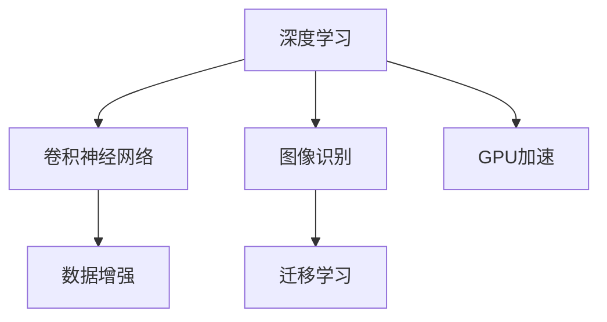

                 

## 1. 背景介绍

### 1.1 问题由来
人工智能(AI)领域在过去十年里取得了飞速发展，其中深度学习模型在图像识别、自然语言处理、语音识别等任务上取得了突破性进展。然而，深度学习模型的成功离不开大规模标注数据集的驱动，特别是在图像识别领域，ImageNet这一数据集起了关键性的推动作用。

ImageNet是一个庞大的图像数据库，涵盖了1000个不同类别的图像，数据量超过120万张。这个数据集不仅提供海量的数据，还采取了严格的标注标准，对每个图像进行了精确定义。ImageNet的成功基于其开创性的挑战和竞赛——ImageNet Large Scale Visual Recognition Challenge (ILSVRC)，这个竞赛推动了大规模视觉识别模型的研究和发展。

### 1.2 问题核心关键点
ImageNet对AI图像识别的推动主要体现在以下几个方面：

- **数据丰富性**：ImageNet提供了超过100万张标注图像和1000个类别，极大地丰富了训练数据，为深度学习模型的训练提供了充足的资源。
- **挑战性**：ILSVRC竞赛设立的高难度和评判标准，推动了视觉识别模型的研究和进步。
- **开源精神**：ImageNet数据集和竞赛结果公开透明，鼓励全球研究人员共享研究成果，促进了人工智能技术的交流和合作。
- **催生经典模型**：ImageNet激发了多项重要视觉识别模型的诞生，如AlexNet、VGGNet、ResNet等，这些模型奠定了深度学习在视觉识别领域的统治地位。
- **跨领域影响**：ImageNet的影响不仅限于图像识别，还推动了计算机视觉、模式识别、深度学习等多个领域的技术发展。

## 2. 核心概念与联系

### 2.1 核心概念概述

在深入探讨ImageNet对AI图像识别的推动之前，让我们首先理解几个核心概念：

- **深度学习**：一种基于神经网络的机器学习技术，通过多层次的特征提取和抽象，实现对复杂数据的建模和预测。
- **卷积神经网络(CNN)**：一种特殊的深度学习网络，擅长处理图像、视频等多维数据，具有空间局部连接和参数共享的特性。
- **图像识别**：通过深度学习模型，识别图像中的物体、场景、动作等，是计算机视觉领域的重要应用。
- **迁移学习**：利用在特定任务上训练好的模型，在新任务上进行微调或直接应用，提升模型在新任务上的性能。
- **数据增强**：通过对训练数据进行旋转、翻转、裁剪等变换，增加数据样本数量，提升模型的泛化能力。
- **GPU加速**：通过图形处理单元(GPU)的并行计算能力，加速深度学习模型的训练和推理。

这些概念紧密相连，共同构成了AI图像识别的基础框架。通过理解这些概念，我们可以更深刻地把握ImageNet对AI图像识别推动的机制。

### 2.2 核心概念原理和架构的 Mermaid 流程图



## 3. 核心算法原理 & 具体操作步骤

### 3.1 算法原理概述

ImageNet对AI图像识别的推动，主要体现在以下几个算法原理上：

1. **数据驱动的深度学习**：ImageNet提供了大量高质量的标注图像，为深度学习模型的训练提供了丰富的数据资源。大规模数据集的训练使得模型能够更好地学习数据分布，提升泛化性能。

2. **卷积神经网络的创新**：ImageNet竞赛激发了对卷积神经网络(CNN)结构的创新，如AlexNet、VGGNet、ResNet等模型，这些模型通过增加网络深度、引入残差连接等技术，显著提升了图像识别的准确率。

3. **迁移学习的普及**：ImageNet的数据和模型被广泛用于其他视觉识别任务，如医学图像、自动驾驶、安防监控等，推动了迁移学习技术的应用和发展。

4. **数据增强技术的应用**：ImageNet竞赛的挑战性促使研究者探索更多的数据增强方法，如随机裁剪、翻转、旋转等，这些方法显著提升了模型的鲁棒性和泛化能力。

5. **GPU加速的引入**：ImageNet数据集和竞赛的成功推动了GPU在深度学习训练中的广泛应用，极大地提高了模型训练的速度和效率。

### 3.2 算法步骤详解

基于ImageNet的AI图像识别过程可以分为以下几个步骤：

1. **数据预处理**：对ImageNet数据集进行预处理，包括图像裁剪、归一化、标准化等，准备训练数据。

2. **模型构建**：选择卷积神经网络(CNN)模型作为基础架构，并根据图像识别任务需求进行网络结构的设计和调整。

3. **模型训练**：使用ImageNet数据集进行模型的训练，优化网络参数以最小化损失函数。

4. **模型评估**：在验证集上评估模型的性能，调整模型参数以优化模型性能。

5. **模型微调**：将训练好的模型应用于其他图像识别任务，通过迁移学习进行微调，进一步提升模型在该任务上的性能。

6. **数据增强**：对训练数据进行增强，如随机裁剪、翻转等，增加数据多样性，提升模型泛化能力。

7. **GPU加速训练**：使用GPU加速深度学习模型的训练，提高训练效率和模型性能。

### 3.3 算法优缺点

ImageNet对AI图像识别的推动具有以下优点：

1. **高质量数据资源**：ImageNet提供了大规模、高精度的标注图像，极大地丰富了深度学习模型的训练数据。

2. **促进技术创新**：ImageNet竞赛的挑战性和高标准推动了深度学习模型的创新和进步，催生了多项重要算法和模型。

3. **推动工业应用**：ImageNet的成果被广泛应用于计算机视觉、安防监控、自动驾驶等多个领域，推动了AI技术在实际应用中的落地。

4. **促进开源合作**：ImageNet数据集和模型公开透明，鼓励了全球研究者共享研究成果，促进了AI技术的交流和合作。

但同时，ImageNet也存在一些局限性：

1. **数据偏见**：ImageNet数据集存在一定的偏见，如性别、种族、动物种类等，这些偏见可能在模型中得到加强，影响模型的公平性和公正性。

2. **数据稀疏性**：ImageNet数据集虽然丰富，但在某些特定领域或类别上的样本数量仍显不足，可能导致模型在这些领域的表现不佳。

3. **计算资源需求高**：ImageNet数据集和模型训练对计算资源的要求较高，限制了中小规模研究团队的应用。

### 3.4 算法应用领域

ImageNet的推动不仅仅局限于图像识别领域，还在以下几个方面产生了深远影响：

- **医学影像分析**：ImageNet的数据和模型被广泛应用于医学影像分析，如肿瘤检测、病理切片分类等，提升了医疗诊断的准确性和效率。

- **自动驾驶**：ImageNet的成果被用于自动驾驶中的目标检测和图像分类，提高了自动驾驶系统的感知能力和决策性能。

- **安防监控**：ImageNet的图像识别技术被应用于安防监控，如人脸识别、行为分析等，提升了公共安全管理的智能化水平。

- **工业检测**：ImageNet的模型被用于工业检测，如缺陷检测、质量控制等，提升了工业生产的自动化水平。

## 4. 数学模型和公式 & 详细讲解

### 4.1 数学模型构建

在AI图像识别的过程中，常用的数学模型包括卷积神经网络(CNN)和损失函数。

CNN模型的数学表示如下：

$$
\mathcal{F}(X; \theta) = \mathcal{F}_{conv}(\mathcal{F}_{pool}(\mathcal{F}_{conv}(\mathcal{F}_{conv}(X; \theta))),
$$

其中 $\theta$ 为模型参数，$\mathcal{F}_{conv}$ 和 $\mathcal{F}_{pool}$ 分别表示卷积和池化操作。

常用的损失函数包括交叉熵损失函数和均方误差损失函数，分别表示为：

$$
\ell(\mathcal{F}(X; \theta), Y) = -\sum_{i=1}^N [y_i\log \mathcal{F}(X_i; \theta) + (1-y_i)\log (1-\mathcal{F}(X_i; \theta))),
$$

$$
\ell(\mathcal{F}(X; \theta), Y) = \frac{1}{N} \sum_{i=1}^N (\mathcal{F}(X_i; \theta) - Y_i)^2,
$$

其中 $Y$ 为标签，$N$ 为样本数量。

### 4.2 公式推导过程

以交叉熵损失函数为例，其推导过程如下：

1. 定义交叉熵损失函数：

$$
\ell(\mathcal{F}(X; \theta), Y) = -\sum_{i=1}^N [y_i\log \mathcal{F}(X_i; \theta) + (1-y_i)\log (1-\mathcal{F}(X_i; \theta))],
$$

其中 $y_i$ 为样本 $i$ 的标签，$\mathcal{F}(X_i; \theta)$ 为模型对样本 $i$ 的预测结果。

2. 对损失函数求导，得到梯度：

$$
\frac{\partial \ell}{\partial \theta_k} = -\sum_{i=1}^N (\frac{y_i}{\mathcal{F}(X_i; \theta)} - \frac{1-y_i}{1-\mathcal{F}(X_i; \theta)} \frac{\partial \mathcal{F}(X_i; \theta)}{\partial \theta_k},
$$

其中 $\theta_k$ 为模型参数，$\frac{\partial \mathcal{F}(X_i; \theta)}{\partial \theta_k}$ 为模型对参数 $\theta_k$ 的偏导数。

3. 将梯度带入参数更新公式，完成模型的迭代优化：

$$
\theta \leftarrow \theta - \eta \frac{\partial \ell}{\partial \theta},
$$

其中 $\eta$ 为学习率，$\frac{\partial \ell}{\partial \theta}$ 为损失函数对参数 $\theta$ 的梯度。

### 4.3 案例分析与讲解

以图像分类任务为例，假设有一个包含 $N$ 个样本的数据集，每个样本 $X_i$ 和其标签 $y_i$ 都已知。使用CNN模型对图像进行分类，步骤如下：

1. 对图像 $X_i$ 进行预处理，如裁剪、归一化等，得到输入 $X_i'$。

2. 将输入 $X_i'$ 送入CNN模型，得到输出 $\mathcal{F}(X_i'; \theta)$。

3. 使用交叉熵损失函数计算模型对样本 $i$ 的损失 $\ell_i(\mathcal{F}(X_i'; \theta), y_i)$。

4. 对所有样本的损失求和，得到总损失 $\ell(\mathcal{F}, Y)$。

5. 对总损失求导，得到模型参数的梯度。

6. 使用梯度下降等优化算法，更新模型参数 $\theta$，最小化损失函数。

通过这个过程，模型逐渐学习到图像的特征表示，并在验证集上进行评估，进一步优化参数，最终得到用于图像分类的模型。

## 5. 项目实践：代码实例和详细解释说明

### 5.1 开发环境搭建

在深度学习项目中，开发环境搭建是非常重要的步骤。以下是使用PyTorch进行图像识别项目开发的流程：

1. 安装Anaconda：从官网下载并安装Anaconda，用于创建独立的Python环境。

2. 创建并激活虚拟环境：
```bash
conda create -n pytorch-env python=3.8 
conda activate pytorch-env
```

3. 安装PyTorch：根据CUDA版本，从官网获取对应的安装命令。例如：
```bash
conda install pytorch torchvision torchaudio cudatoolkit=11.1 -c pytorch -c conda-forge
```

4. 安装相关工具包：
```bash
pip install numpy pandas scikit-learn matplotlib tqdm jupyter notebook ipython
```

完成上述步骤后，即可在`pytorch-env`环境中开始图像识别项目开发。

### 5.2 源代码详细实现

下面以ImageNet图像分类任务为例，给出使用PyTorch进行CNN模型微调的代码实现。

首先，定义数据集：

```python
import torch
from torch.utils.data import Dataset
from torchvision import transforms
from torchvision.datasets import ImageNet

class ImageNetDataset(Dataset):
    def __init__(self, root, transforms=None):
        self.trainset = ImageNet(root, split='train', download=True, transform=transforms)
        self.testset = ImageNet(root, split='test', download=True, transform=transforms)
        
    def __len__(self):
        return len(self.trainset) + len(self.testset)
    
    def __getitem__(self, idx):
        if idx < len(self.trainset):
            sample = self.trainset[idx]
        else:
            sample = self.testset[idx - len(self.trainset)]
        
        img, target = sample[0], sample[1]
        img = transforms.transform(img)
        return img, target
```

然后，定义模型和优化器：

```python
import torch.nn as nn
import torch.nn.functional as F
from torchvision import models

model = models.resnet18(pretrained=False)

criterion = nn.CrossEntropyLoss()
optimizer = torch.optim.SGD(model.parameters(), lr=0.001, momentum=0.9)
```

接着，定义训练和评估函数：

```python
def train(epoch, device, model, train_loader, criterion, optimizer, num_classes):
    model.train()
    train_loss = 0.0
    correct = 0
    total = 0
    for batch_idx, (data, target) in enumerate(train_loader):
        data, target = data.to(device), target.to(device)
        optimizer.zero_grad()
        output = model(data)
        loss = criterion(output, target)
        loss.backward()
        optimizer.step()
        train_loss += loss.item()
        pred = output.argmax(dim=1, keepdim=True)
        correct += pred.eq(target.view_as(pred)).sum().item()
        total += target.size(0)
        if batch_idx % 10 == 0:
            print('Train Epoch: {} [{}/{} ({:.0f}%)]\tLoss: {:.6f}\tAccuracy: {:.0f}%\t'.
                  format(epoch, batch_idx * len(data), len(train_loader.dataset),
                         (batch_idx / len(train_loader) * 100.0), loss / len(data)))

def test(model, test_loader, device, criterion, num_classes):
    model.eval()
    test_loss = 0.0
    correct = 0
    total = 0
    with torch.no_grad():
        for data, target in test_loader:
            data, target = data.to(device), target.to(device)
            output = model(data)
            test_loss += criterion(output, target).item()
            pred = output.argmax(dim=1, keepdim=True)
            correct += pred.eq(target.view_as(pred)).sum().item()
            total += target.size(0)
    
    print('\nTest set: Average loss: {:.4f}, Accuracy: {}/{} ({:.0f}%)\n'.
          format(test_loss / len(test_loader.dataset), correct, total, (correct / total) * 100.0))
```

最后，启动训练流程并在测试集上评估：

```python
device = torch.device('cuda' if torch.cuda.is_available() else 'cpu')

train_loader = torch.utils.data.DataLoader(trainset, batch_size=32, shuffle=True)
test_loader = torch.utils.data.DataLoader(testset, batch_size=32, shuffle=False)

for epoch in range(10):
    train(train_loader, device, model, criterion, optimizer, num_classes)
    test(model, test_loader, device, criterion, num_classes)
```

以上就是使用PyTorch对ResNet模型进行ImageNet图像分类任务微调的完整代码实现。可以看到，PyTorch提供了丰富的深度学习模型和工具，使得图像识别任务的开发和实验变得便捷高效。

### 5.3 代码解读与分析

让我们再详细解读一下关键代码的实现细节：

**ImageNetDataset类**：
- `__init__`方法：初始化训练集和测试集，并对图像进行预处理。
- `__len__`方法：返回数据集的大小。
- `__getitem__`方法：返回数据集中的样本和标签，并进行预处理。

**模型和优化器**：
- `resnet18`：预训练的ResNet模型，通过设置`pretrained=False`可以防止使用预训练权重。
- `CrossEntropyLoss`：交叉熵损失函数，用于分类任务的损失计算。
- `SGD`：随机梯度下降优化器，通过设置`momentum`参数以提高收敛速度。

**训练和评估函数**：
- `train`函数：对模型进行训练，更新模型参数，并在每个epoch输出训练集的损失和准确率。
- `test`函数：对模型进行测试，计算模型在测试集上的损失和准确率。

**训练流程**：
- 定义设备（GPU或CPU）。
- 定义训练集和测试集的DataLoader。
- 循环训练10个epoch，每个epoch内进行一次训练和一次测试。

可以看到，PyTorch使得图像识别任务的开发变得简洁高效，研究者可以快速上手并实现各类模型。

## 6. 实际应用场景

### 6.1 智能安防监控

基于ImageNet的深度学习模型，智能安防监控系统能够高效识别和追踪各种异常行为，如非法入侵、可疑物品等。通过部署摄像头并结合图像识别技术，可以实现全天候的监控和报警，提升公共安全管理水平。

在技术实现上，可以收集大量监控视频，将其标注为各类异常行为和正常行为，对预训练模型进行微调。微调后的模型能够实时分析监控视频，并自动标记异常事件，提供实时的安全告警。

### 6.2 医学影像分析

ImageNet的成果在医学影像分析领域也得到了广泛应用。利用ImageNet的图像识别技术，医学影像分析系统可以自动识别和分类各种病灶，提高诊断的准确性和效率。

例如，在肺结节识别任务中，可以将肺部CT扫描图像作为输入，使用ImageNet微调后的模型进行特征提取和分类。通过优化损失函数和模型结构，模型能够更准确地检测和分类肺结节，为早期肺癌筛查提供有力支持。

### 6.3 自动驾驶

自动驾驶系统需要实时识别和理解路标、行人、车辆等道路元素。ImageNet的成果被广泛应用于自动驾驶中的目标检测和分类任务，提高了自动驾驶系统的感知能力和决策性能。

在技术实现上，可以收集自动驾驶相关的道路图像，对预训练模型进行微调。微调后的模型能够更准确地识别和分类道路元素，提供实时的驾驶辅助信息，保障行车安全。

### 6.4 未来应用展望

随着ImageNet的成功，大模型在计算机视觉领域的优势越来越明显，未来将在更多场景中得到应用。

- **实时视频分析**：基于大模型的实时视频分析技术，将广泛应用于智能家居、零售业等场景，提升用户体验和效率。

- **三维图像重建**：大模型在三维图像重建中的应用，如高分辨率三维重建、虚拟现实等，将为游戏、影视等领域带来新的创意和体验。

- **跨模态学习**：将图像识别技术与语音识别、自然语言处理等技术结合，实现跨模态的学习和推理，提升人机交互的智能化水平。

- **增强现实**：大模型在增强现实中的应用，如场景识别、虚拟试穿等，将改变用户的交互方式，提升用户体验。

## 7. 工具和资源推荐

### 7.1 学习资源推荐

为了帮助开发者系统掌握ImageNet对AI图像识别的推动，这里推荐一些优质的学习资源：

1. **《深度学习》（Ian Goodfellow等著）**：这是一本深度学习领域的经典教材，涵盖了深度学习的基础理论和技术细节，对理解ImageNet的推动作用有很大帮助。

2. **CS231n《卷积神经网络和视觉识别》课程**：斯坦福大学开设的计算机视觉课程，详细讲解了卷积神经网络的结构和应用，是学习ImageNet成果的重要途径。

3. **《ImageNet Classification with Deep Convolutional Neural Networks》论文**：这篇论文介绍了ImageNet竞赛的挑战和结果，是理解ImageNet推动的重要资料。

4. **DeepLearning.ai的深度学习专项课程**：由Andrew Ng教授主持的深度学习专项课程，涵盖深度学习的基础理论和实践应用，对理解大模型的应用有很大帮助。

5. **PyTorch官方文档**：PyTorch官方文档提供了丰富的API和工具，是进行图像识别项目开发的重要参考资料。

通过对这些资源的学习实践，相信你一定能够系统掌握ImageNet对AI图像识别的推动作用，并用于解决实际的图像识别问题。

### 7.2 开发工具推荐

高效的开发离不开优秀的工具支持。以下是几款用于图像识别开发的常用工具：

1. **PyTorch**：基于Python的开源深度学习框架，灵活动态的计算图，适合快速迭代研究。

2. **TensorFlow**：由Google主导开发的开源深度学习框架，生产部署方便，适合大规模工程应用。

3. **Transformers库**：HuggingFace开发的NLP工具库，集成了多种预训练模型，支持图像识别任务。

4. **Weights & Biases**：模型训练的实验跟踪工具，可以记录和可视化模型训练过程中的各项指标，方便对比和调优。

5. **TensorBoard**：TensorFlow配套的可视化工具，可实时监测模型训练状态，并提供丰富的图表呈现方式。

6. **Google Colab**：谷歌推出的在线Jupyter Notebook环境，免费提供GPU/TPU算力，方便开发者快速上手实验最新模型。

合理利用这些工具，可以显著提升图像识别项目的开发效率，加快创新迭代的步伐。

### 7.3 相关论文推荐

ImageNet的成果激发了多项重要视觉识别模型的诞生，以下是几篇奠基性的相关论文，推荐阅读：

1. **ImageNet Classification with Deep Convolutional Neural Networks**：Alex Krizhevsky等人提出的AlexNet模型，基于ImageNet数据集和竞赛，开创了深度学习在图像分类领域的先河。

2. **Very Deep Convolutional Networks for Large-Scale Image Recognition**：Kaiming He等人提出的VGGNet模型，通过增加网络深度，显著提升了图像分类的准确率。

3. **Deep Residual Learning for Image Recognition**：Kaiming He等人提出的ResNet模型，通过引入残差连接，解决了深度网络训练中的退化问题，极大地提升了模型性能。

4. **Faster R-CNN: Towards Real-Time Object Detection with Region Proposal Networks**：Shaoqing Ren等人提出的Faster R-CNN模型，在目标检测任务上取得了突破性进展。

5. **Mask R-CNN**：Kaiming He等人提出的Mask R-CNN模型，将目标检测与分割任务结合，提高了视觉任务的综合能力。

这些论文代表了ImageNet推动的多个重要方向，对理解深度学习在图像识别领域的应用具有重要意义。

## 8. 总结：未来发展趋势与挑战

### 8.1 总结

本文对ImageNet对AI图像识别的推动进行了全面系统的介绍。首先阐述了ImageNet的挑战性竞赛和丰富的数据资源对深度学习模型的推动作用，明确了ImageNet竞赛对计算机视觉技术的推动效果。其次，从原理到实践，详细讲解了图像识别任务的深度学习模型构建和训练过程，给出了微调任务的完整代码实例。同时，本文还探讨了ImageNet在智能安防、医学影像分析、自动驾驶等多个领域的应用前景，展示了其推动作用。最后，本文精选了ImageNet相关的学习资源、开发工具和研究论文，力求为读者提供全方位的技术指引。

通过本文的系统梳理，可以看到，ImageNet通过其丰富的数据资源和挑战性竞赛，极大地推动了深度学习在图像识别领域的突破性进展，引领了计算机视觉技术的发展方向。未来，随着ImageNet的不断更新和扩展，其对AI图像识别的推动作用将进一步增强。

### 8.2 未来发展趋势

展望未来，ImageNet对AI图像识别的推动将呈现以下几个发展趋势：

1. **大规模数据集的发展**：ImageNet将持续扩展其数据集规模，涵盖更多类别和场景，提升深度学习模型的泛化能力和鲁棒性。

2. **多模态数据融合**：ImageNet将推动多模态数据融合技术的发展，将视觉、语音、文本等多模态数据结合，提升综合推理能力。

3. **边缘计算的应用**：ImageNet的应用将从中心化的云计算转向边缘计算，提升图像识别的实时性和响应速度。

4. **跨领域应用的拓展**：ImageNet的成果将被应用于更多领域，如医疗、安防、自动驾驶等，推动AI技术在垂直行业的落地。

5. **联邦学习的应用**：ImageNet将推动联邦学习技术的发展，通过模型在多个设备上的分布式训练，提升模型性能和隐私保护。

### 8.3 面临的挑战

尽管ImageNet对AI图像识别的推动作用显著，但在实际应用中仍面临诸多挑战：

1. **数据资源获取**：ImageNet数据集的开源获取和扩展需要大量人力和资金投入，对中小规模研究团队存在一定的门槛。

2. **计算资源需求高**：ImageNet数据集和模型训练对计算资源的要求较高，限制了部分研究团队的应用。

3. **模型泛化能力不足**：尽管ImageNet提供了丰富的数据资源，但模型在特定场景下仍可能表现不佳，需要进一步优化。

4. **数据隐私和安全**：ImageNet的应用过程中需要处理大量敏感数据，如何确保数据隐私和安全是重要的研究课题。

5. **跨领域应用复杂**：ImageNet在跨领域应用中的泛化能力仍需进一步提升，以应对不同领域的具体需求。

### 8.4 研究展望

为了应对这些挑战，未来的研究需要在以下几个方面寻求新的突破：

1. **分布式训练技术**：探索分布式训练技术，通过模型在多个设备上的分布式训练，提升训练效率和模型性能。

2. **跨领域迁移学习**：研究跨领域迁移学习技术，提升模型在特定场景下的泛化能力。

3. **多模态数据融合**：推动多模态数据融合技术的发展，将视觉、语音、文本等多模态数据结合，提升综合推理能力。

4. **联邦学习技术**：探索联邦学习技术，通过模型在多个设备上的分布式训练，提升模型性能和隐私保护。

5. **数据隐私和安全**：研究数据隐私和安全技术，确保数据在处理和存储过程中的安全性和隐私保护。

这些研究方向的探索，必将引领ImageNet的应用进入新的阶段，推动AI技术在图像识别领域的进一步突破。

## 9. 附录：常见问题与解答

**Q1: ImageNet是如何对AI图像识别的推动起到关键作用的？**

A: ImageNet对AI图像识别的推动主要体现在以下几个方面：

1. **数据资源丰富**：ImageNet提供了超过100万张标注图像和1000个类别，极大地丰富了深度学习模型的训练数据。

2. **竞赛挑战高**：ImageNet的竞赛设立了高难度和评判标准，推动了深度学习模型的研究和进步。

3. **开源精神**：ImageNet数据集和竞赛结果公开透明，鼓励全球研究者共享研究成果，促进了AI技术的交流和合作。

4. **经典模型诞生**：ImageNet激发了多项重要视觉识别模型的诞生，如AlexNet、VGGNet、ResNet等，这些模型奠定了深度学习在视觉识别领域的统治地位。

5. **跨领域应用广泛**：ImageNet的成果被广泛应用于计算机视觉、安防监控、自动驾驶等多个领域，推动了AI技术在实际应用中的落地。

**Q2: 在基于ImageNet的数据集进行图像识别时，如何选择合适的学习率？**

A: 基于ImageNet的数据集进行图像识别时，选择合适的学习率非常重要。一般来说，学习率应该设置为较小的值，以避免破坏预训练权重。具体的学习率设置通常需要进行实验调试，一般可以从1e-4开始尝试，逐步减小学习率。同时，可以考虑使用warmup策略，即在开始阶段使用较小的学习率，再逐渐过渡到预设值。

**Q3: 在基于ImageNet的数据集进行图像识别时，如何缓解过拟合问题？**

A: 过拟合是深度学习模型训练中常见的问题。在基于ImageNet的数据集进行图像识别时，可以通过以下方法缓解过拟合：

1. **数据增强**：通过回译、旋转、翻转等方法，增加训练数据的多样性，提升模型的泛化能力。

2. **正则化**：使用L2正则、Dropout等方法，减少模型的过拟合风险。

3. **早期停止**：在验证集上监控模型性能，一旦性能不再提升，立即停止训练，防止过拟合。

4. **参数高效微调**：只更新少量参数，保留大部分预训练权重，减少过拟合风险。

5. **模型裁剪和量化**：通过裁剪和量化操作，减少模型参数量，提升模型的实时性。

**Q4: 在基于ImageNet的数据集进行图像识别时，如何确保模型泛化能力？**

A: 确保模型泛化能力的方法如下：

1. **数据增强**：通过随机裁剪、旋转、翻转等方法，增加训练数据的多样性，提升模型的泛化能力。

2. **正则化**：使用L2正则、Dropout等方法，减少模型的过拟合风险。

3. **数据扩充**：在训练过程中，对图像进行旋转、平移、缩放等操作，增加数据的多样性。

4. **模型裁剪**：对模型进行裁剪，去除不必要的参数，减少模型的复杂度，提升泛化能力。

5. **验证集监控**：在训练过程中，通过验证集监控模型的泛化能力，及时调整模型参数。

6. **多模型集成**：通过集成多个模型的预测结果，提升模型的泛化能力。

**Q5: 在基于ImageNet的数据集进行图像识别时，如何确保模型性能稳定？**

A: 确保模型性能稳定的主要方法如下：

1. **模型裁剪和量化**：通过裁剪和量化操作，减少模型参数量，提升模型的实时性。

2. **多模型集成**：通过集成多个模型的预测结果，提升模型的性能稳定性。

3. **对抗训练**：在训练过程中加入对抗样本，提高模型的鲁棒性和泛化能力。

4. **模型权重共享**：通过共享模型的权重，减少模型的复杂度，提升性能稳定性。

5. **模型裁剪**：对模型进行裁剪，去除不必要的参数，减少模型的复杂度，提升性能稳定性。

**Q6: 在基于ImageNet的数据集进行图像识别时，如何提升模型的实时性？**

A: 提升模型的实时性的主要方法如下：

1. **模型裁剪和量化**：通过裁剪和量化操作，减少模型参数量，提升模型的实时性。

2. **多模型集成**：通过集成多个模型的预测结果，提升模型的实时性。

3. **模型压缩**：通过剪枝、量化等方法，减少模型参数量，提升模型的实时性。

4. **分布式训练**：通过分布式训练技术，在多个设备上同时训练模型，提升模型的实时性。

5. **边缘计算**：将模型的训练和推理放在边缘设备上，减少数据传输，提升模型的实时性。

**Q7: 在基于ImageNet的数据集进行图像识别时，如何确保模型的高效性？**

A: 确保模型的高效性的主要方法如下：

1. **模型裁剪和量化**：通过裁剪和量化操作，减少模型参数量，提升模型的实时性和资源占用率。

2. **分布式训练**：通过分布式训练技术，在多个设备上同时训练模型，提升模型的训练效率。

3. **多模型集成**：通过集成多个模型的预测结果，提升模型的实时性和资源占用率。

4. **模型压缩**：通过剪枝、量化等方法，减少模型参数量，提升模型的实时性和资源占用率。

5. **GPU加速**：通过GPU加速技术，提升模型的训练和推理效率。

**Q8: 在基于ImageNet的数据集进行图像识别时，如何确保模型的可解释性？**

A: 确保模型的可解释性的主要方法如下：

1. **可视化技术**：通过可视化技术，展示模型的决策过程，提高模型的可解释性。

2. **注意力机制**：引入注意力机制，让模型在处理图像时关注关键的视觉特征，提高模型的可解释性。

3. **决策树**：通过决策树方法，将模型转化为一系列的决策步骤，提高模型的可解释性。

4. **特征可视化**：通过特征可视化技术，展示模型在不同输入下的特征提取结果，提高模型的可解释性。

5. **可解释模型架构**：选择可解释性较强的模型架构，如线性模型、决策树等，提高模型的可解释性。

**Q9: 在基于ImageNet的数据集进行图像识别时，如何确保模型的安全性？**

A: 确保模型的安全性主要方法如下：

1. **对抗样本防御**：在训练过程中加入对抗样本，提高模型的鲁棒性和安全性。

2. **模型权重保护**：通过加密和保护模型权重，防止模型被恶意攻击或篡改。

3. **数据隐私保护**：在处理敏感数据时，采用数据隐私保护技术，确保数据的安全性和隐私性。

4. **模型监控**：通过监控模型的运行状态，及时发现和修复安全漏洞。

5. **多模型集成**：通过集成多个模型的预测结果，提高模型的鲁棒性和安全性。

**Q10: 在基于ImageNet的数据集进行图像识别时，如何确保模型的公平性和公正性？**

A: 确保模型的公平性和公正性的主要方法如下：

1. **数据均衡性**：在训练过程中，确保不同类别的数据样本数量均衡，避免数据偏差。

2. **对抗样本防御**：在训练过程中加入对抗样本，提高模型的鲁棒性和公平性。

3. **可解释性**：通过可解释性技术，展示模型在处理不同类别数据时的表现，提高模型的公平性和公正性。

4. **多模型集成**：通过集成多个模型的预测结果，提高模型的公平性和公正性。

5. **公平性评估**：通过公平性评估指标，监控模型的公平性和公正性。

---

作者：禅与计算机程序设计艺术 / Zen and the Art of Computer Programming

