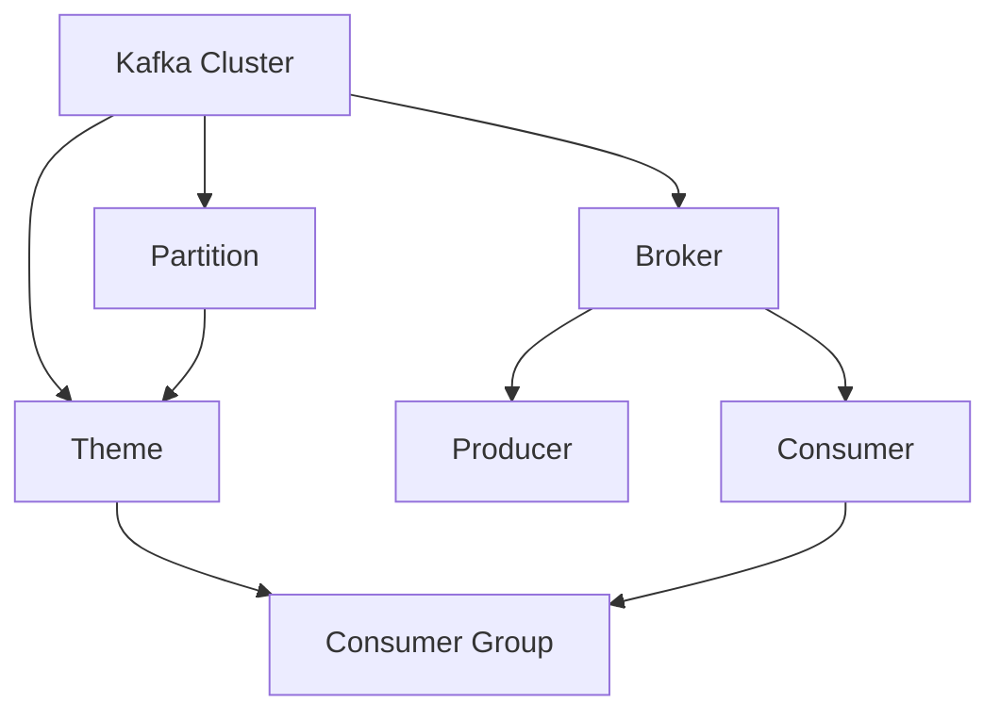

                 

# Kafka原理与代码实例讲解

> 关键词：Kafka,分布式流处理,实时数据流,Apache Kafka,消息队列,数据流处理

## 1. 背景介绍

### 1.1 问题由来
随着互联网和物联网的迅猛发展，数据量呈指数级增长，数据处理已成为信息时代的重要议题。如何在保证数据高效传输和可靠存储的同时，进行高吞吐量的数据流处理，是众多企业面临的共同挑战。传统的消息队列系统虽能满足基本的消息传输需求，但难以支持高并发、低延迟的大数据流处理场景。此时，分布式流处理平台Kafka（Apache Kafka）以其高性能、可扩展性、容错性等优势脱颖而出，成为现代企业数据流处理的首选解决方案。

### 1.2 问题核心关键点
Kafka是一个开源的分布式流处理平台，能够支持实时数据流的生产与消费。Kafka的核心概念包括消息队列、分布式事务、流处理等，这些核心技术构建了其高可用、高吞吐、低延迟、高扩展性的数据流处理能力。了解Kafka的原理和核心概念，对于使用其进行数据流处理至关重要。

### 1.3 问题研究意义
Kafka凭借其优秀的性能和可扩展性，广泛应用于金融、电商、物联网、社交网络等诸多领域。通过对Kafka的深入研究，可以更好地理解其工作原理和核心技术，为构建高性能、高可靠性的数据流处理系统提供理论支撑。此外，Kafka的学习和应用过程，也是深入理解分布式系统和流处理技术的绝佳机会。

## 2. 核心概念与联系

### 2.1 核心概念概述

为了更好地理解Kafka的原理和应用，我们需要首先了解一些关键的概念：

- **Kafka集群**：Kafka集群由多个Broker（数据节点）组成，负责存储和传输数据。每个Broker可以存储多个分区(Partition)，分区是Kafka中最小的数据单位。
- **主题（Topic）**：主题是Kafka中发布和订阅数据的容器，多个分区可共同构成一个主题。
- **生产者（Producer）**：生产者负责将消息发布到主题中，是数据流的源头。
- **消费者（Consumer）**：消费者从主题中订阅并消费消息，是数据流的目的地。
- **分区（Partition）**：分区是主题的一部分，用于实现水平扩展和负载均衡。
- **消费者组（Consumer Group）**：消费者组是一组订阅同一主题的消费者实例，共同消费同一个分区的消息。

这些核心概念通过下图的Mermaid流程图，进一步展示了它们之间的联系：



### 2.2 核心概念原理和架构的 Mermaid 流程图

通过以下Mermaid流程图，更加清晰地展示了Kafka集群中各组件的架构和工作原理：

```mermaid
graph LR
    B1[Broker 1] -- 数据传输 -> A[生产者 Producer]
    F1[Consumer 1] -- 数据消费 -> B1
    B2[Broker 2] -- 数据传输 -> A
    F2[Consumer 2] -- 数据消费 -> B2
    D1[主题 Theme 1] --> C1[分区 Partition 1]
    D1 --> C2[分区 Partition 2]
    C1 -- 数据写入 -> B1
    C2 -- 数据写入 -> B2
    C1 --> F1
    C2 --> F2
```

## 3. 核心算法原理 & 具体操作步骤

### 3.1 算法原理概述

Kafka的核心算法原理主要包括以下几个方面：

- **分布式数据存储**：Kafka通过分区和复制机制，实现数据的分布式存储和容错。
- **流式数据处理**：Kafka基于先进先出（FIFO）的消息队列，支持流式数据的可靠传输和处理。
- **数据压缩与优化**：Kafka对消息进行批量压缩和分段传输，提高了数据传输效率和存储性能。
- **消费者组管理**：Kafka通过消费者组机制，实现对同一主题消息的并行消费。

### 3.2 算法步骤详解

Kafka的运行流程通常包括以下几个步骤：

1. **创建Kafka集群**：初始化多个Broker节点，并配置集群参数，如日志目录、分区数量、消费者组等。
2. **创建主题和分区**：创建主题，并在其中创建多个分区。
3. **配置生产者和消费者**：配置生产者和消费者，指定连接参数、主题名称、分区等。
4. **发送和接收消息**：生产者向主题中的分区发送消息，消费者从主题中订阅并接收消息。

### 3.3 算法优缺点

Kafka作为高性能、高可靠性的分布式流处理平台，具有以下优点：

- **高吞吐量**：Kafka通过分区和批处理机制，实现了高吞吐量的数据传输。
- **低延迟**：Kafka基于先进先出（FIFO）的消息队列，保证了数据传输的低延迟。
- **高扩展性**：Kafka支持水平扩展，可以通过增加Broker节点和分区数量来提升集群性能。
- **高可用性**：Kafka通过数据复制和故障转移机制，实现了数据的高可用性和可靠性。

然而，Kafka也存在一些缺点：

- **配置复杂**：Kafka集群配置参数较多，需要仔细调优。
- **开发门槛高**：使用Kafka需要一定的开发经验，需要掌握生产者、消费者和集群配置等技术。
- **性能瓶颈**：Kafka在处理大文件时，可能会遇到性能瓶颈。

### 3.4 算法应用领域

Kafka在多个领域得到广泛应用，包括但不限于以下几个方面：

- **大数据处理**：Kafka被用于处理大规模数据流，支持实时数据采集和处理。
- **实时流处理**：Kafka作为Spark Streaming、Apache Storm等流处理框架的数据源，实现了实时数据的流处理。
- **消息传输**：Kafka被用于构建高可靠的消息传输系统，支持异步消息传递。
- **日志存储与分析**：Kafka被用于日志的集中存储与分析，支持对日志数据的实时查询和处理。

## 4. 数学模型和公式 & 详细讲解 & 举例说明

### 4.1 数学模型构建

Kafka的数学模型主要涉及消息的传输与存储，以下是一个简单的数学模型构建示例：

假设每个消息的大小为 $M$，Kafka的消息队列长度为 $N$，消息的发送频率为 $R$，每个消息的处理时间为 $T$。

设 $K$ 为每个分区的消息数量，$S$ 为分区的消息总量。则一个分区的消息传输时间 $T_s$ 可以表示为：

$$
T_s = \frac{S}{K}T
$$

设 $P$ 为Kafka分区的数量，则整个集群的传输时间 $T_c$ 可以表示为：

$$
T_c = \frac{S}{P}T
$$

设 $R_c$ 为集群的平均吞吐量，则有：

$$
R_c = \frac{S}{T_c}
$$

在实际应用中，可以通过调整分区的数量和大小，优化消息的传输效率和存储性能。

### 4.2 公式推导过程

Kafka的消息传输和存储过程如图2所示。


在推导过程中，我们可以考虑以下因素：

- **消息大小 $M$**：表示每个消息的实际大小，单位为字节。
- **消息队列长度 $N$**：表示消息队列中消息的总数。
- **消息发送频率 $R$**：表示单位时间内发送的消息数量。
- **消息处理时间 $T$**：表示每个消息的处理时间，单位为秒。

基于上述参数，我们可以推导出消息传输时间和集群吞吐量的公式：

$$
T_s = \frac{S}{K}T
$$

$$
T_c = \frac{S}{P}T
$$

$$
R_c = \frac{S}{T_c}
$$

其中 $S$ 表示一个分区的消息总量，$K$ 表示分区的消息数量，$P$ 表示分区的数量。

### 4.3 案例分析与讲解

假设在一个Kafka集群中，每个分区的消息大小为 $M=1$ KB，队列长度为 $N=1024$，发送频率为 $R=10000$ 条/秒，每个消息的处理时间为 $T=0.1$ 秒，分区的数量为 $P=16$。

首先，计算一个分区的消息传输时间 $T_s$：

$$
T_s = \frac{S}{K}T = \frac{1024 * 1024}{1024} * 0.1 = 1024
$$

然后，计算整个集群的传输时间 $T_c$：

$$
T_c = \frac{S}{P}T = \frac{1024 * 1024}{16} * 0.1 = 65536
$$

最后，计算集群吞吐量 $R_c$：

$$
R_c = \frac{S}{T_c} = \frac{1024 * 1024}{65536} = 16
$$

因此，该集群的吞吐量约为16条/秒。

## 5. 项目实践：代码实例和详细解释说明

### 5.1 开发环境搭建

在进行Kafka开发实践前，需要先搭建好开发环境。以下是一个简单的搭建流程：

1. **安装JDK**：确保JDK 8或更高版本已经安装，并进行环境变量配置。
2. **安装Zookeeper**：下载并安装Zookeeper，配置启动脚本，确保其能够正常运行。
3. **安装Kafka**：下载并安装Kafka，配置启动脚本，确保其能够正常运行。
4. **启动Zookeeper和Kafka**：依次启动Zookeeper和Kafka的各个节点，确保集群正常运行。

### 5.2 源代码详细实现

以下是一个简单的Kafka消费者和生产者示例代码：

**Kafka生产者（Producer）：**

```java
Properties properties = new Properties();
properties.put("bootstrap.servers", "localhost:9092");
properties.put("acks", "all");
properties.put("retries", 0);
properties.put("batch.size", 16384);
properties.put("linger.ms", 1);
properties.put("buffer.memory", 33554432);
properties.put("key.serializer", "org.apache.kafka.common.serialization.StringSerializer");
properties.put("value.serializer", "org.apache.kafka.common.serialization.StringSerializer");

KafkaProducer<String, String> producer = new KafkaProducer<>(properties);

for (int i = 0; i < 10; i++) {
    producer.send(new ProducerRecord<String, String>("topic", "key" + i, "value" + i));
}

producer.close();
```

**Kafka消费者（Consumer）：**

```java
Properties properties = new Properties();
properties.put("bootstrap.servers", "localhost:9092");
properties.put("group.id", "test");
properties.put("key.deserializer", "org.apache.kafka.common.serialization.StringDeserializer");
properties.put("value.deserializer", "org.apache.kafka.common.serialization.StringDeserializer");

KafkaConsumer<String, String> consumer = new KafkaConsumer<>(properties);

consumer.subscribe(Arrays.asList("topic"));

while (true) {
    ConsumerRecords<String, String> records = consumer.poll(100);
    for (ConsumerRecord<String, String> record : records) {
        System.out.printf("offset = %d, key = %s, value = %s%n", record.offset(), record.key(), record.value());
    }
}

consumer.close();
```

### 5.3 代码解读与分析

以上代码中，Kafka生产者负责将消息发布到指定主题中，Kafka消费者负责从指定主题中订阅并消费消息。

**生产者配置**：

- `bootstrap.servers`：指定Kafka集群的地址。
- `acks`：指定生产者确认消息传输的机制，取值为"0"或"1"或"all"。
- `retries`：指定生产者重试次数。
- `batch.size`：指定批量发送消息的大小。
- `linger.ms`：指定批量消息等待时间。
- `buffer.memory`：指定缓冲区大小。

**消费者配置**：

- `bootstrap.servers`：指定Kafka集群的地址。
- `group.id`：指定消费者组的ID。
- `key.deserializer`：指定键的序列化器。
- `value.deserializer`：指定值的序列化器。

### 5.4 运行结果展示

在运行以上代码后，生产者会将10条消息发布到指定主题中，消费者会订阅该主题并消费消息，输出消息的偏移量、键和值。

## 6. 实际应用场景

### 6.1 日志存储与分析

Kafka在日志存储与分析方面有广泛应用。企业可以利用Kafka将日志数据进行集中存储，然后使用Spark Streaming等流处理框架进行实时分析。例如，监控系统可以将日志数据实时存储到Kafka中，然后使用Spark Streaming进行实时监控告警。

### 6.2 实时流处理

Kafka支持实时流数据的传输和处理，被广泛应用于各种实时流处理系统。例如，股票交易系统可以利用Kafka进行订单数据的实时处理和分析，从而及时发现异常交易行为。

### 6.3 大数据处理

Kafka能够处理大规模数据流，被广泛应用于大数据处理领域。例如，电商企业可以利用Kafka进行订单数据的实时处理和分析，从而提升用户体验和运营效率。

### 6.4 未来应用展望

未来，Kafka将在更多领域得到应用，为数据流处理带来新的突破。例如：

- **边缘计算**：Kafka可以与边缘计算技术结合，实现数据的本地处理和存储，提高数据处理效率。
- **区块链**：Kafka可以与区块链技术结合，实现分布式数据存储和传输，提升数据的安全性和可靠性。
- **人工智能**：Kafka可以与人工智能技术结合，实现实时数据的分析和处理，提升AI系统的性能和效率。

## 7. 工具和资源推荐

### 7.1 学习资源推荐

为了深入理解Kafka的原理和应用，推荐以下学习资源：

1. **《Kafka：分布式流平台》**：由Kafka的创始人之一托德·贝纳特（Todd Bennett）所著，全面介绍了Kafka的核心概念和应用场景。
2. **Kafka官方文档**：Kafka的官方文档提供了丰富的教程和示例代码，是学习和使用Kafka的重要参考资料。
3. **《Kafka入门与实战》**：由陈切的著作，介绍了Kafka的基本原理和应用案例，适合初学者入门。

### 7.2 开发工具推荐

为了更方便地进行Kafka开发，推荐以下开发工具：

1. **IntelliJ IDEA**：支持Kafka的插件，能够轻松创建生产者、消费者和主题。
2. **Kafdrop**：一个开源的Kafka可视化管理工具，提供了图形化的Kafka集群管理和监控功能。
3. **JConsole**：JDK自带的工具，用于监控JVM进程和堆内存情况。

### 7.3 相关论文推荐

为了深入了解Kafka的理论基础和技术细节，推荐以下相关论文：

1. **《Kafka：一个分布式流平台》**：由Kafka的创始人之一托德·贝纳特（Todd Bennett）和乔·里德（Joe Reed）所撰写，介绍了Kafka的架构和设计思想。
2. **《Kafka流处理》**：由约翰·A·波特（John A. Porter）所著，介绍了Kafka在流处理中的应用。
3. **《Kafka分布式事务》**：介绍了Kafka的分布式事务机制和应用场景。

## 8. 总结：未来发展趋势与挑战

### 8.1 总结

本文详细介绍了Kafka的核心概念、原理和应用。Kafka作为一个高性能、高可靠性的分布式流处理平台，已经在多个领域得到广泛应用。通过理解Kafka的原理和应用，可以更好地构建高性能、高可靠性的数据流处理系统，提升数据处理效率和实时性。

### 8.2 未来发展趋势

Kafka的未来发展趋势包括以下几个方面：

1. **高扩展性**：Kafka将继续提升其高扩展性，支持更多的分区和节点，以适应更大规模的数据流处理需求。
2. **低延迟**：Kafka将进一步优化数据传输机制，实现更低延迟的数据处理。
3. **高可用性**：Kafka将进一步提升其高可用性和容错能力，确保数据传输和处理的可靠性。
4. **智能优化**：Kafka将引入智能优化机制，自动调整数据传输和存储策略，提高数据处理效率。

### 8.3 面临的挑战

尽管Kafka在众多领域得到了广泛应用，但仍面临以下挑战：

1. **配置复杂**：Kafka的配置参数较多，需要仔细调优。
2. **开发门槛高**：Kafka的使用需要一定的开发经验，需要掌握生产者、消费者和集群配置等技术。
3. **性能瓶颈**：Kafka在处理大文件时，可能会遇到性能瓶颈。

### 8.4 研究展望

未来，Kafka的研究方向包括：

1. **分布式事务**：进一步提升Kafka的分布式事务处理能力，支持跨分区的分布式事务。
2. **流式处理**：进一步优化Kafka的流处理能力，支持更多的流处理场景。
3. **实时分析**：引入更多的实时分析技术，提升Kafka的实时数据分析能力。

总之，Kafka作为高性能、高可靠性的分布式流处理平台，未来将在更多领域得到应用，为数据流处理带来新的突破。

## 9. 附录：常见问题与解答

**Q1: Kafka和RabbitMQ的区别是什么？**

A: Kafka和RabbitMQ都是消息队列系统，但Kafka更适用于处理大规模数据流，支持高吞吐量、低延迟的数据传输。RabbitMQ则更适合处理中小型系统，支持复杂的消息队列管理。

**Q2: Kafka消息大小如何影响性能？**

A: Kafka的消息大小是影响性能的重要因素。过小的消息会增加传输次数和延迟，过大的消息会占用更多的网络带宽和存储资源。因此，选择合适的消息大小对于Kafka性能的优化非常重要。

**Q3: Kafka如何处理大数据流？**

A: Kafka通过分区和批处理机制，支持大规模数据流的处理。每个分区可以独立处理数据流，多个分区可以并行处理，从而实现高吞吐量的数据传输。

**Q4: Kafka如何保证数据传输的可靠性？**

A: Kafka通过数据复制和故障转移机制，实现数据传输的可靠性。每个分区有多个副本，通过数据复制保证数据不丢失。同时，Kafka还支持自动故障转移，保证数据的高可用性。

**Q5: Kafka如何进行数据压缩？**

A: Kafka对消息进行批量压缩和分段传输，提高数据传输效率和存储性能。压缩算法可以使用Gzip、Snappy等，具体选择应根据数据特点和压缩比进行优化。

总之，通过深入理解Kafka的原理和应用，可以更好地构建高性能、高可靠性的数据流处理系统，提升数据处理效率和实时性。

---

作者：禅与计算机程序设计艺术 / Zen and the Art of Computer Programming

