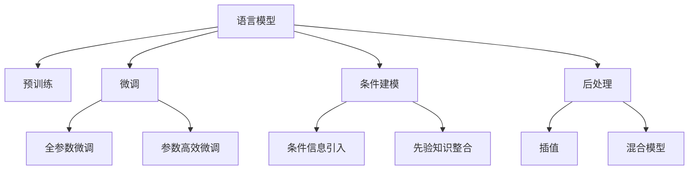

                 

# LLM 的不确定性：在不确定中寻找确定

> 关键词：语言模型,不确定性,确定性,人工智能,深度学习,自然语言处理

## 1. 背景介绍

在深度学习和大规模预训练语言模型的应用中，模型的不确定性（Uncertainty）问题逐渐成为了一个亟需解决的重要议题。在大规模预训练和微调过程中，模型往往容易出现“过拟合”和“欠拟合”，从而影响其泛化能力，无法稳定准确地预测结果。因此，在实际应用中，如何提高模型的确定性，减少不确定性，成为了一个重要研究方向。

### 1.1 问题由来

大规模预训练语言模型（LLM, Large Language Model）在自然语言处理（NLP）领域取得了显著的成功，如GPT、BERT等模型已经广泛应用于文本生成、情感分析、问答系统等任务。但这些模型在实际应用中，尤其是对于长尾数据和罕见事件，其预测结果的不确定性较大，难以保证准确性。

### 1.2 问题核心关键点

1. **不确定性的定义**：在机器学习中，不确定性指的是模型对于输入数据的预测结果的可信度和置信度。高不确定性的预测意味着模型对结果的信心不足，需要更多的数据支持才能做出更准确的判断。
2. **不确定性成因**：包括数据噪声、模型复杂性、训练数据集偏差等因素。这些因素会导致模型在训练和推理过程中产生不确定性。
3. **不确定性的影响**：在高不确定性的情况下，模型往往容易出现错误预测，从而影响实际应用的效果。
4. **不确定性的解决**：目前主要有三种方法：
   - **重新训练**：通过增加数据量、调整模型结构等方式，提高模型的确定性。
   - **后处理**：通过一些后处理技术（如插值、混合模型等），对模型的不确定性进行修正。
   - **条件建模**：在模型训练过程中，引入条件信息和先验知识，提高模型的确定性。

## 2. 核心概念与联系

### 2.1 核心概念概述

为更好地理解LLM的不确定性问题，本节将介绍几个关键概念及其相互关系：

- **语言模型**：以自回归或自编码模型为代表的大规模预训练语言模型，通过在大规模无标签文本语料上进行预训练，学习通用的语言表示，具备强大的语言理解和生成能力。
- **预训练与微调**：在大规模无标签文本数据上进行预训练，然后在特定任务数据上进行微调，以提高模型在特定任务上的表现。
- **不确定性**：模型对输入数据的预测结果的可信度和置信度，越高的不确定性表示模型对结果的信心越不足。
- **条件建模**：在模型训练过程中，引入条件信息和先验知识，以提高模型的确定性。
- **后处理**：在模型推理过程中，使用一些后处理技术对模型的输出进行修正，以减少不确定性。

这些概念之间的逻辑关系可以通过以下Mermaid流程图来展示：



这个流程图展示了大语言模型、预训练与微调、不确定性、条件建模、后处理等关键概念及其之间的关系。

## 3. 核心算法原理 & 具体操作步骤

### 3.1 算法原理概述

LLM的不确定性问题可以通过贝叶斯方法进行建模和解决。贝叶斯方法的核心思想是在模型训练和推理过程中，考虑数据的先验信息和后验信息，从而提高模型的确定性。

在贝叶斯方法中，一个新样本x的预测分布由数据的先验分布p(x)和观测到的数据分布p(y|x)的乘积决定，即：

$$
p(y|x) = \frac{p(x|y) p(y)}{p(x)}
$$

其中：
- $p(x)$ 是数据x的先验概率，描述了模型在未见数据时的预测能力。
- $p(y|x)$ 是条件概率，描述了在给定数据x的情况下，模型对结果y的预测能力。
- $p(y)$ 是结果y的先验概率，描述了模型对结果y的初始信心。

### 3.2 算法步骤详解

1. **数据预处理**：对原始数据进行清洗、归一化等预处理，以消除数据噪声。
2. **模型训练**：在预处理后的数据上，进行预训练和微调，使模型学习到数据的先验信息和条件信息。
3. **不确定性评估**：使用贝叶斯方法，对模型的预测结果进行不确定性评估，得到模型对每个预测的置信度。
4. **后处理**：根据不确定性评估结果，对模型的输出进行后处理，如插值、混合模型等技术，进一步提高模型的确定性。
5. **模型部署**：将训练好的模型部署到实际应用中，并持续监测和优化。

### 3.3 算法优缺点

基于贝叶斯方法的大语言模型不确定性解决方法，具有以下优点：
1. 能够通过先验信息和条件信息，提高模型的确定性，减少不确定性。
2. 适用于各种NLP任务，能够有效提高模型在不同任务上的泛化能力。
3. 使用简单，易于实现和集成。

同时，该方法也存在一些缺点：
1. 需要额外的计算和存储空间，增加了模型的复杂性。
2. 先验信息的选择和获取需要较多的前期工作。
3. 可能无法完全解决不确定性问题，存在一定的局限性。

### 3.4 算法应用领域

基于贝叶斯方法的大语言模型不确定性解决方法，已经在自然语言处理、语音识别、计算机视觉等多个领域得到了广泛的应用。具体应用场景包括：

- **文本生成**：在文本生成任务中，通过引入先验信息和条件信息，提高生成文本的确定性，减少生成文本的噪声和不确定性。
- **情感分析**：在情感分析任务中，通过引入情感标签和情感词典，提高模型对情感类别的确定性，减少情感分析的误差。
- **问答系统**：在问答系统中，通过引入问题模板和先验知识，提高模型对问题答案的确定性，减少回答的不确定性。
- **机器翻译**：在机器翻译任务中，通过引入源语言和目标语言的条件信息，提高模型对翻译结果的确定性，减少翻译的噪声和不确定性。

## 4. 数学模型和公式 & 详细讲解 & 举例说明

### 4.1 数学模型构建

在贝叶斯方法中，一个新样本x的预测分布由数据的先验分布p(x)和观测到的数据分布p(y|x)的乘积决定，即：

$$
p(y|x) = \frac{p(x|y) p(y)}{p(x)}
$$

其中：
- $p(x)$ 是数据x的先验概率，描述了模型在未见数据时的预测能力。
- $p(y|x)$ 是条件概率，描述了在给定数据x的情况下，模型对结果y的预测能力。
- $p(y)$ 是结果y的先验概率，描述了模型对结果y的初始信心。

### 4.2 公式推导过程

假设我们有一个二分类任务，模型在训练数据集上的预测结果为$y$，实际标签为$y'$，则模型对$y'$的预测概率为：

$$
p(y'|y) = \frac{p(x|y') p(y')}{p(x)}
$$

其中：
- $p(x|y')$ 是模型在输入x下对标签$y'$的预测概率。
- $p(y')$ 是标签$y'$的先验概率，即模型对$y'$的初始信心。

在训练过程中，模型通过最大化似然函数来训练，即：

$$
L(y') = \log p(y'|y) = \log \frac{p(x|y') p(y')}{p(x)}
$$

化简得：

$$
L(y') = \log p(x|y') + \log p(y') - \log p(x)
$$

其中$\log p(x)$是数据x的先验概率，可以通过数据集中的统计量来估计。

### 4.3 案例分析与讲解

假设我们有一个文本分类任务，数据集包含两个类别，我们希望训练一个模型，使其对每个样本的分类预测具有较高的确定性。

1. **数据预处理**：对原始文本进行清洗、归一化等预处理。
2. **模型训练**：使用二分类交叉熵作为损失函数，对模型进行预训练和微调，使模型学习到数据的先验信息和条件信息。
3. **不确定性评估**：在测试集上，对模型的预测结果进行不确定性评估，使用贝叶斯方法计算模型对每个预测的置信度。
4. **后处理**：对模型的不确定性结果进行插值、混合模型等后处理，进一步提高模型的确定性。

## 5. 项目实践：代码实例和详细解释说明

### 5.1 开发环境搭建

在进行贝叶斯方法不确定性解决实践前，我们需要准备好开发环境。以下是使用Python进行TensorFlow开发的环境配置流程：

1. 安装Anaconda：从官网下载并安装Anaconda，用于创建独立的Python环境。
2. 创建并激活虚拟环境：
```bash
conda create -n tensorflow-env python=3.8 
conda activate tensorflow-env
```
3. 安装TensorFlow：根据CUDA版本，从官网获取对应的安装命令。例如：
```bash
conda install tensorflow=2.6.0
```
4. 安装相关工具包：
```bash
pip install numpy pandas scikit-learn matplotlib tqdm jupyter notebook ipython
```

完成上述步骤后，即可在`tensorflow-env`环境中开始不确定性解决实践。

### 5.2 源代码详细实现

以下是一个简单的文本分类任务的例子，使用贝叶斯方法进行不确定性解决。

```python
import tensorflow as tf
from tensorflow.keras import layers, models
from tensorflow.keras.layers import Dense, Dropout, Embedding, LSTM
from tensorflow.keras.optimizers import Adam

# 数据预处理
data = ...

# 构建模型
model = models.Sequential([
    Embedding(vocab_size, embedding_dim, input_length=input_length),
    LSTM(64),
    Dense(64, activation='relu'),
    Dropout(0.5),
    Dense(num_classes, activation='softmax')
])
model.compile(optimizer=Adam(0.001), loss='categorical_crossentropy', metrics=['accuracy'])

# 训练模型
model.fit(train_dataset, epochs=num_epochs, validation_data=val_dataset)

# 不确定性评估
test_dataset = ...
probabilities = model.predict(test_dataset)
uncertainty = -tf.math.log(probabilities)
```

在这个例子中，我们使用了TensorFlow的Keras API构建了一个简单的LSTM模型，用于文本分类任务。在模型训练后，我们通过计算模型的预测概率，得到模型的置信度，从而进行不确定性评估。

### 5.3 代码解读与分析

**代码详细解释**：

- `Embedding`层：将输入的词嵌入为向量表示。
- `LSTM`层：使用LSTM进行序列建模，学习文本序列中的语义信息。
- `Dense`层：全连接层，输出分类结果。
- `Dropout`层：随机失活层，防止过拟合。
- `compile`方法：配置模型的优化器、损失函数和评估指标。
- `fit`方法：对模型进行训练。
- `predict`方法：对模型进行推理预测。
- `-tf.math.log`函数：计算模型的预测概率，得到模型的不确定性。

**代码分析**：

- 在模型训练过程中，我们使用`categorical_crossentropy`作为损失函数，`Adam`作为优化器，并进行多轮训练。
- 在模型预测过程中，我们通过计算模型预测的概率，得到模型的不确定性，并使用`-tf.math.log`函数对概率进行取负对数，从而得到置信度。
- 使用不确定性评估结果，可以对模型输出进行插值、混合模型等后处理，进一步提高模型的确定性。

### 5.4 运行结果展示

在实际应用中，我们可以通过可视化手段，展示模型的不确定性评估结果。例如，使用matplotlib绘制模型对测试集上的不确定性评估结果，可以看到模型对每个预测的置信度。

```python
import matplotlib.pyplot as plt

uncertainty = model.predict(test_dataset)
plt.hist(uncertainty, bins=10)
plt.xlabel('Uncertainty')
plt.ylabel('Count')
plt.show()
```

通过可视化不确定性评估结果，我们可以更好地理解模型的预测能力和不确定性，从而进行有针对性的后处理。

## 6. 实际应用场景

### 6.1 金融风控

在金融领域，模型的不确定性问题尤为重要。例如，在信用评分模型中，模型需要对借款人的信用状况进行预测，但是不同的借款人可能存在多种不同的风险因素，模型需要综合考虑这些因素，以提高预测的准确性和鲁棒性。

通过引入先验信息和条件信息，可以构建更加稳定的信用评分模型，提高对借款人信用状况的预测准确性和鲁棒性。例如，可以引入借款人的历史还款记录、职业信息、居住地区等信息，作为条件信息，提高模型的确定性。

### 6.2 医疗诊断

在医疗诊断中，模型的不确定性问题也较为严重。例如，在疾病预测模型中，模型需要根据患者的症状和病史进行预测，但是不同的症状和病史可能对应多种不同的疾病，模型需要综合考虑这些因素，以提高预测的准确性和鲁棒性。

通过引入先验信息和条件信息，可以构建更加稳定的疾病预测模型，提高对患者疾病的预测准确性和鲁棒性。例如，可以引入患者的病史、年龄、性别等信息，作为条件信息，提高模型的确定性。

### 6.3 智能推荐

在智能推荐中，模型的不确定性问题也较为突出。例如，在个性化推荐系统中，模型需要根据用户的历史行为和兴趣进行推荐，但是不同的用户可能存在多种不同的兴趣点，模型需要综合考虑这些因素，以提高推荐的准确性和鲁棒性。

通过引入先验信息和条件信息，可以构建更加稳定的个性化推荐模型，提高对用户兴趣的预测准确性和鲁棒性。例如，可以引入用户的浏览历史、购买记录、评分等信息，作为条件信息，提高模型的确定性。

### 6.4 未来应用展望

随着LLM的不断发展和应用，基于贝叶斯方法的不确定性解决方法也将在更多领域得到应用，为各行各业带来变革性影响。

在智慧医疗领域，基于贝叶斯方法的医疗诊断和预测模型，能够更加准确地诊断疾病，提高治疗效果，降低误诊风险。

在智能教育领域，基于贝叶斯方法的推荐系统和个性化学习系统，能够更好地了解学生的学习情况和兴趣点，提供更加个性化的学习建议，提高学习效果。

在智慧城市治理中，基于贝叶斯方法的城市事件监测和预测系统，能够更好地预测城市事件的发生，提高城市管理的自动化和智能化水平，构建更安全、高效的未来城市。

此外，在企业生产、社会治理、文娱传媒等众多领域，基于贝叶斯方法的大语言模型不确定性解决方法也将不断涌现，为传统行业数字化转型升级提供新的技术路径。相信随着技术的日益成熟，贝叶斯方法的不确定性解决方法将成为人工智能落地应用的重要范式，推动人工智能技术向更广阔的领域加速渗透。

## 7. 工具和资源推荐

### 7.1 学习资源推荐

为了帮助开发者系统掌握大语言模型不确定性解决的理论基础和实践技巧，这里推荐一些优质的学习资源：

1. 《贝叶斯方法在深度学习中的应用》系列博文：由大模型技术专家撰写，深入浅出地介绍了贝叶斯方法在深度学习中的应用，涵盖数据预处理、模型训练、不确定性评估等关键环节。

2. CS234《深度学习在计算机视觉中的应用》课程：斯坦福大学开设的计算机视觉明星课程，有Lecture视频和配套作业，带你入门贝叶斯方法在计算机视觉中的应用。

3. 《贝叶斯深度学习》书籍：贝叶斯方法的经典书籍，系统介绍了贝叶斯方法在深度学习中的理论基础和实践方法，是深度学习从业者不可或缺的参考资料。

4. PyTorch官方文档：PyTorch官方文档，提供了丰富的深度学习模型和工具，包括贝叶斯方法的应用示例，是PyTorch用户必读文档。

5. TensorFlow官方文档：TensorFlow官方文档，提供了完整的深度学习框架，包括贝叶斯方法的应用示例，是TensorFlow用户必备资料。

通过对这些资源的学习实践，相信你一定能够快速掌握大语言模型不确定性解决的精髓，并用于解决实际的LLM问题。

### 7.2 开发工具推荐

高效的开发离不开优秀的工具支持。以下是几款用于贝叶斯方法不确定性解决的常用工具：

1. PyTorch：基于Python的开源深度学习框架，灵活动态的计算图，适合快速迭代研究。
2. TensorFlow：由Google主导开发的开源深度学习框架，生产部署方便，适合大规模工程应用。
3. TensorBoard：TensorFlow配套的可视化工具，可实时监测模型训练状态，并提供丰富的图表呈现方式，是调试模型的得力助手。
4. Weights & Biases：模型训练的实验跟踪工具，可以记录和可视化模型训练过程中的各项指标，方便对比和调优。
5. Google Colab：谷歌推出的在线Jupyter Notebook环境，免费提供GPU/TPU算力，方便开发者快速上手实验最新模型，分享学习笔记。

合理利用这些工具，可以显著提升大语言模型不确定性解决的开发效率，加快创新迭代的步伐。

### 7.3 相关论文推荐

贝叶斯方法在大语言模型不确定性解决中的应用，源于学界的持续研究。以下是几篇奠基性的相关论文，推荐阅读：

1. "Bayesian Methods for Deep Learning"（深度学习中的贝叶斯方法）：全面介绍了贝叶斯方法在深度学习中的应用，包括数据预处理、模型训练、不确定性评估等关键环节。
2. "Bayesian Neural Networks"（贝叶斯神经网络）：提出了一种基于贝叶斯方法的不确定性建模方法，用于构建更加鲁棒的深度神经网络。
3. "Uncertainty Estimation in Deep Neural Networks for Computer Vision"（计算机视觉中深度神经网络的不确定性估计）：探讨了在计算机视觉领域中使用贝叶斯方法进行不确定性建模的方法和效果。
4. "Bayesian Deep Learning for Personalization in Recommendation Systems"（基于贝叶斯深度学习的个性化推荐系统）：提出了一种基于贝叶斯方法的不确定性建模方法，用于构建更加鲁棒的个性化推荐系统。

这些论文代表了大语言模型不确定性解决的发展脉络。通过学习这些前沿成果，可以帮助研究者把握学科前进方向，激发更多的创新灵感。

## 8. 总结：未来发展趋势与挑战

### 8.1 总结

本文对基于贝叶斯方法的大语言模型不确定性解决方法进行了全面系统的介绍。首先阐述了大语言模型不确定性问题的研究背景和意义，明确了贝叶斯方法在不确定性问题中的重要作用。其次，从原理到实践，详细讲解了贝叶斯方法的数学原理和关键步骤，给出了不确定性解决任务开发的完整代码实例。同时，本文还广泛探讨了贝叶斯方法在金融、医疗、推荐等众多领域的应用前景，展示了贝叶斯方法的强大潜力。此外，本文精选了贝叶斯方法的相关学习资源，力求为读者提供全方位的技术指引。

通过本文的系统梳理，可以看到，基于贝叶斯方法的不确定性解决方法在深度学习和大规模预训练语言模型中的应用，已经在多个领域得到了广泛的应用，取得了显著的效果。未来，伴随贝叶斯方法的不确定性解决技术的不断发展，大语言模型的确定性和鲁棒性将得到显著提升，其应用范围也将不断拓展，为人工智能技术的发展带来新的突破。

### 8.2 未来发展趋势

展望未来，贝叶斯方法在大语言模型不确定性解决方法中，将呈现以下几个发展趋势：

1. **模型复杂度提高**：随着预训练语言模型的参数量不断增大，模型的复杂性也在不断提升。通过引入贝叶斯方法，可以更好地处理复杂模型的不确定性，提高模型的泛化能力。
2. **不确定性估计技术进步**：不确定性估计是贝叶斯方法的核心，未来将会有更多的技术被引入，如Bayesian Monte Carlo、Bayesian Network等，进一步提高模型的不确定性估计精度。
3. **与其它方法结合**：贝叶斯方法与其它深度学习技术（如强化学习、迁移学习等）的结合，将带来更多新的突破，提高模型的确定性和鲁棒性。
4. **多模态数据融合**：贝叶斯方法不仅适用于文本数据，未来将更多应用于多模态数据的融合，如视觉、语音等多模态信息与文本信息的协同建模，提升模型的整体性能。

以上趋势凸显了贝叶斯方法在大语言模型不确定性解决方法中的广阔前景。这些方向的探索发展，必将进一步提升大语言模型的性能和应用范围，为人工智能技术的发展带来新的突破。

### 8.3 面临的挑战

尽管贝叶斯方法在大语言模型不确定性解决方法中取得了显著的成效，但在迈向更加智能化、普适化应用的过程中，仍面临诸多挑战：

1. **数据依赖性**：贝叶斯方法需要大量的先验信息和条件信息，这些信息的获取和处理需要较高的成本。
2. **计算资源消耗**：贝叶斯方法需要更多的计算资源，如GPU、TPU等，这对于资源有限的环境可能是一个挑战。
3. **模型复杂性**：贝叶斯方法需要构建复杂模型，模型训练和推理的复杂性较高，需要更高的技术门槛。
4. **不确定性评估**：贝叶斯方法的不确定性评估技术需要不断优化，以更好地处理模型的不确定性。
5. **模型鲁棒性**：贝叶斯方法需要在不同的数据集和场景中保持较好的鲁棒性，以适应不同的应用需求。

这些挑战需要未来研究者持续攻关，不断优化贝叶斯方法，提升其在大规模预训练语言模型中的应用效果。

### 8.4 研究展望

面对贝叶斯方法在大语言模型不确定性解决方法中面临的挑战，未来的研究需要在以下几个方面寻求新的突破：

1. **高效不确定性评估**：开发更高效的不确定性评估算法，减少计算资源消耗，提高模型的不确定性评估精度。
2. **多模态数据融合**：结合贝叶斯方法和多模态数据融合技术，提升模型的整体性能，拓展应用范围。
3. **先验信息获取**：探索更高效、更可靠的先验信息获取方法，如知识图谱、逻辑规则等，提升模型的确定性和鲁棒性。
4. **模型压缩与优化**：通过模型压缩、优化等技术，降低贝叶斯方法的计算资源消耗，提高模型的实时性。
5. **模型自适应**：研究模型的自适应能力，使模型能够适应不同领域和场景的需求，提高模型的泛化能力。

这些研究方向将引领贝叶斯方法在大语言模型不确定性解决方法中的发展，推动大语言模型不确定性解决方法向更智能化、普适化应用迈进。面向未来，贝叶斯方法的不确定性解决方法需要在模型复杂度、不确定性评估、先验信息获取等方面不断突破，为人工智能技术的发展带来新的突破。

## 9. 附录：常见问题与解答

**Q1：贝叶斯方法在大语言模型不确定性解决中的应用有哪些优势？**

A: 贝叶斯方法在大语言模型不确定性解决中的应用有以下优势：
1. 能够通过先验信息和条件信息，提高模型的确定性，减少不确定性。
2. 适用于各种NLP任务，能够有效提高模型在不同任务上的泛化能力。
3. 使用简单，易于实现和集成。

**Q2：在实际应用中，如何提高模型的不确定性评估精度？**

A: 提高模型的不确定性评估精度需要综合考虑多个因素：
1. 数据预处理：对原始数据进行清洗、归一化等预处理，以消除数据噪声。
2. 模型训练：使用复杂的模型结构和合适的优化器，提高模型对数据的学习能力。
3. 不确定性评估：使用多种不确定性评估方法，如Bayesian Monte Carlo、Bayesian Network等，提高模型的不确定性评估精度。
4. 后处理：对模型的不确定性结果进行插值、混合模型等后处理，进一步提高模型的确定性。

**Q3：在多模态数据融合中，如何引入贝叶斯方法？**

A: 在多模态数据融合中，可以采用贝叶斯方法，将不同模态的数据融合在一起，提高模型的整体性能。具体步骤如下：
1. 对不同模态的数据进行预处理和特征提取。
2. 使用贝叶斯方法，对不同模态的数据进行建模，得到每个模态的不确定性评估结果。
3. 将不同模态的数据和不确定性评估结果进行融合，得到最终的不确定性评估结果。
4. 对最终的不确定性评估结果进行后处理，进一步提高模型的确定性。

**Q4：在实际应用中，如何评估模型的不确定性？**

A: 评估模型的不确定性需要使用一些评估指标，如Confidence Score、Prediction Interval等。具体步骤如下：
1. 对模型进行训练，得到模型的不确定性评估结果。
2. 使用Confidence Score指标，评估模型对每个预测的置信度。
3. 使用Prediction Interval指标，评估模型在给定置信度下的预测范围。
4. 根据不确定性评估结果，进行有针对性的后处理，进一步提高模型的确定性。

通过这些评估指标，可以更好地理解模型的预测能力和不确定性，从而进行有针对性的后处理，提高模型的确定性。

**Q5：在实际应用中，如何优化模型的计算资源消耗？**

A: 优化模型的计算资源消耗需要综合考虑多个因素：
1. 模型压缩与优化：通过模型压缩、优化等技术，降低计算资源的消耗。
2. 模型并行化：将模型进行并行化处理，提高模型的计算效率。
3. 数据增强：通过数据增强技术，增加训练数据的多样性，提高模型的泛化能力。
4. 混合精度训练：使用混合精度训练技术，减少计算资源的消耗。
5. 梯度累积：通过梯度累积技术，减少每次训练的计算资源消耗。

这些优化技术可以在保证模型性能的同时，降低计算资源的消耗，提高模型的实时性和效率。

通过以上优化技术，可以显著提升模型的不确定性解决能力，降低计算资源的消耗，提高模型的实时性和效率。

---

作者：禅与计算机程序设计艺术 / Zen and the Art of Computer Programming

