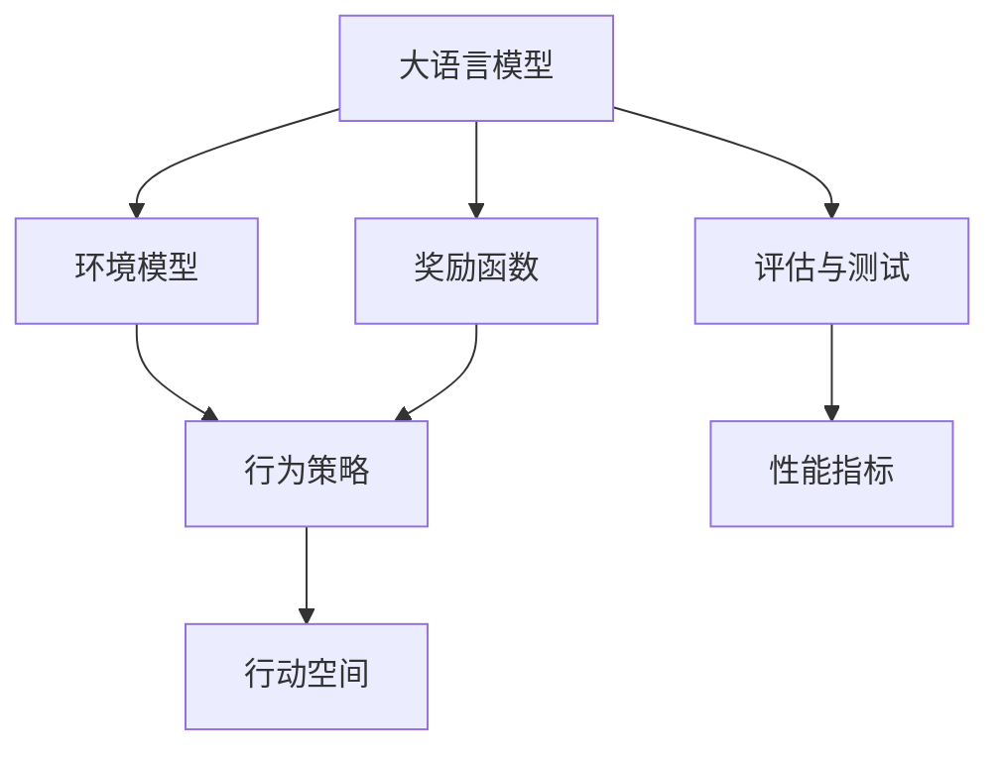

                 

# LLM-based Single-Agent System

> 关键词：大语言模型(LLM),单代理系统,强化学习(RL),环境模型构建,行为策略优化,评估与测试,部署与维护

## 1. 背景介绍

### 1.1 问题由来
近年来，随着深度学习和人工智能技术的快速发展，大语言模型（Large Language Models, LLMs）在自然语言处理（NLP）、计算机视觉、语音识别等诸多领域取得了显著进展。然而，这些模型往往只能作为工具使用，缺乏自主决策能力。为了赋予模型自主决策和执行的能力，将大语言模型与其他AI技术结合，形成单代理系统（Single-Agent System）成为当前研究的重点。

单代理系统是指通过学习环境并做出自主决策的系统，其目标是最大化长期奖励。在单代理系统中，大语言模型可以作为环境感知、任务规划和行为执行的桥梁，将环境与执行策略结合起来，实现更加智能、灵活的系统行为。这种系统能够应用于智能机器人、自动驾驶、游戏AI等领域，具有广泛的应用前景。

### 1.2 问题核心关键点
单代理系统的核心在于如何构建高效的环境模型、优化行为策略以及进行系统评估和测试。其中，大语言模型作为环境感知器，需要从环境中获取数据并转换为模型输入。而行为策略则涉及如何通过优化算法寻找最优行动策略，以实现长期目标。评估和测试则是系统性能优化的重要手段，需要构建评估指标并定期测试系统性能。

本文将详细介绍基于大语言模型的单代理系统，包括环境模型构建、行为策略优化、评估与测试等关键环节，并给出代码实例和详细解释说明。

## 2. 核心概念与联系

### 2.1 核心概念概述

单代理系统是由环境、智能体和行动空间组成的闭环系统。智能体通过感知环境、规划行为并执行策略，实现自主决策和执行。大语言模型作为智能体的一部分，可以理解环境中的文本描述，并将任务转换为模型可以执行的指令。行为策略则决定了智能体在特定状态下应采取的行动，以最大化长期奖励。

以下是几个关键概念的介绍：

- **大语言模型(Large Language Model, LLM)**：以自回归或自编码模型为代表的大规模预训练语言模型。通过在大规模无标签文本语料上进行预训练，学习通用的语言表示，具备强大的语言理解和生成能力。

- **环境模型(Environment Model)**：描述单代理系统环境动态变化的模型。通过大语言模型对环境进行模拟和推理，智能体可以获取环境状态和未来状态的可能性分布。

- **行为策略(行动策略, Behavior Strategy)**：描述智能体在特定状态下应采取的行动，以最大化长期奖励。通过强化学习等方法，智能体可以学习最优行为策略。

- **奖励函数(Reward Function)**：定义智能体行动的奖励函数，衡量行动的价值。长期奖励通常通过累计的短期奖励来实现。

- **评估与测试(Evaluation and Testing)**：定期测试单代理系统性能，评估其能否实现长期目标。通过评估指标，如准确率、F1值等，对系统进行量化评估。

这些核心概念之间的逻辑关系可以通过以下Mermaid流程图来展示：



这个流程图展示了大语言模型与单代理系统的关键组成部分：

1. 大语言模型通过感知环境，并将任务转换为模型可以执行的指令。
2. 环境模型描述了环境的状态和动态变化，智能体通过模拟环境获得状态信息。
3. 行为策略决定了智能体在特定状态下应采取的行动，以实现长期目标。
4. 奖励函数衡量行动的价值，激励智能体选择最优策略。
5. 评估与测试用于定期评估系统性能，确保其能够实现长期目标。

## 3. 核心算法原理 & 具体操作步骤
### 3.1 算法原理概述

基于大语言模型的单代理系统，通过将大语言模型作为环境感知器，构建环境模型，并使用强化学习等方法进行行为策略优化，最终通过评估和测试系统性能，完成闭环反馈。

算法核心流程如下：

1. 环境感知：大语言模型读取环境中的文本描述，并将其转换为模型可以执行的指令。
2. 环境模拟：基于大语言模型构建环境模型，模拟环境动态变化。
3. 行为策略优化：使用强化学习等方法，寻找最优行为策略。
4. 行动执行：智能体根据行为策略执行行动，并通过环境模型获取反馈。
5. 评估与测试：定期评估智能体性能，更新行为策略。

### 3.2 算法步骤详解

#### 3.2.1 环境感知与构建

大语言模型通过读取环境中的文本描述，生成模型可以执行的指令。这些指令可以用于执行行动、判断环境状态等。

- **输入格式**：文本描述通常是自然语言形式，大语言模型通过分词、编码等步骤，将其转换为模型可以理解的向量形式。
- **指令生成**：通过自然语言处理技术，将文本描述转换为模型可执行的指令。例如，将文本描述转换为行动指令，如“左转”、“向右移动”等。

#### 3.2.2 环境模拟与推理

构建环境模型是单代理系统的核心步骤之一。环境模型描述了环境的状态和动态变化，智能体通过模拟环境获得状态信息。

- **环境状态表示**：将环境状态转换为模型可以理解的向量形式，如状态向量、状态空间等。
- **状态转移**：通过大语言模型模拟环境状态的变化，如移动、碰撞等，生成下一个状态。
- **状态预测**：使用环境模型预测未来状态的可能性分布，以指导智能体的行动决策。

#### 3.2.3 行为策略优化

行为策略优化是单代理系统的核心部分，通过优化算法寻找最优行为策略，以实现长期目标。

- **行动空间**：定义智能体可以采取的行动空间，如移动方向、速度等。
- **强化学习**：使用强化学习等方法，通过奖励函数优化行动策略。常用的强化学习算法包括Q-learning、Policy Gradient等。
- **策略更新**：根据行动结果，更新行为策略，以提升系统性能。

#### 3.2.4 行动执行与反馈获取

智能体根据行为策略执行行动，并通过环境模型获取反馈。

- **行动执行**：根据行为策略执行行动，如移动、抓取等。
- **反馈获取**：通过环境模型获取行动结果，如状态变化、奖励等。

#### 3.2.5 评估与测试

定期评估单代理系统性能，确保其能够实现长期目标。

- **性能指标**：定义评估指标，如准确率、F1值等，量化评估系统性能。
- **测试集**：使用测试集评估系统在未知数据上的表现。
- **策略调整**：根据评估结果，调整行为策略，优化系统性能。

### 3.3 算法优缺点

基于大语言模型的单代理系统具有以下优点：

1. **灵活性**：大语言模型具备强大的语言理解和生成能力，可以灵活地理解环境描述并执行指令，适用于多种复杂环境。
2. **可扩展性**：通过大语言模型构建环境模型，智能体可以适用于不同的环境，具有广泛的适用性。
3. **智能化**：使用强化学习等优化算法，智能体可以自主学习最优行为策略，具备智能决策能力。

但该系统也存在一些局限性：

1. **计算成本高**：大语言模型的计算复杂度高，训练和推理需要消耗大量计算资源。
2. **语言理解误差**：大语言模型可能存在语言理解误差，导致行动指令的错误执行。
3. **模型偏差**：大语言模型可能存在偏见和歧视，需要对其进行预处理和优化。

### 3.4 算法应用领域

基于大语言模型的单代理系统已经在多个领域得到应用，包括：

- **智能机器人**：应用于导航、物体重组、交互等任务。大语言模型可以读取环境描述，生成指令并执行行动。
- **自动驾驶**：应用于路径规划、交通信号识别等任务。大语言模型可以理解交通规则和环境描述，生成行动指令。
- **游戏AI**：应用于复杂环境中的策略制定和执行。大语言模型可以理解游戏规则和环境状态，生成最优行动策略。
- **智能客服**：应用于客户交互和问题解答。大语言模型可以理解客户需求，生成回答并执行行动。

除了以上应用场景，基于大语言模型的单代理系统还可以应用于虚拟助手、供应链管理、医疗诊断等领域，具有广泛的应用前景。

## 4. 数学模型和公式 & 详细讲解  
### 4.1 数学模型构建

本节将使用数学语言对基于大语言模型的单代理系统进行更加严格的刻画。

假设智能体在每个时间步t的行动空间为$\mathcal{A}$，状态空间为$\mathcal{S}$，行为策略为$\pi$，奖励函数为$R$，初始状态为$s_0$。智能体在时间步t的行动指令为$a_t$，行动结果为$s_{t+1}$，奖励为$r_t$。

定义状态值函数$V(s_t)$为智能体在状态$s_t$下的长期奖励，状态值函数满足贝尔曼方程：

$$
V(s_t) = \max_{a_t} [r_t + \gamma \mathbb{E}_{s_{t+1}} V(s_{t+1})]
$$

其中$\gamma$为折扣因子，确保长期奖励与短期奖励平衡。

智能体通过行动策略$\pi(a_t|s_t)$选择行动指令$a_t$，行动结果为$s_{t+1}$和奖励$r_t$。行动策略与状态值函数满足贝尔曼方程：

$$
Q(s_t,a_t) = r_t + \gamma \max_{a_{t+1}} \mathbb{E}_{s_{t+1}} Q(s_{t+1},a_{t+1})
$$

其中$Q(s_t,a_t)$为状态-行动值函数，表示在状态$s_t$下选择行动$a_t$的长期奖励。

### 4.2 公式推导过程

以Q-learning算法为例，推导基于大语言模型的单代理系统优化过程。

假设智能体在时间步t的行动空间为$\mathcal{A}$，状态空间为$\mathcal{S}$，行为策略为$\pi$，奖励函数为$R$，初始状态为$s_0$。智能体在时间步t的行动指令为$a_t$，行动结果为$s_{t+1}$，奖励为$r_t$。

定义状态值函数$V(s_t)$为智能体在状态$s_t$下的长期奖励，状态值函数满足贝尔曼方程：

$$
V(s_t) = \max_{a_t} [r_t + \gamma \mathbb{E}_{s_{t+1}} V(s_{t+1})]
$$

智能体通过行动策略$\pi(a_t|s_t)$选择行动指令$a_t$，行动结果为$s_{t+1}$和奖励$r_t$。行动策略与状态值函数满足贝尔曼方程：

$$
Q(s_t,a_t) = r_t + \gamma \max_{a_{t+1}} \mathbb{E}_{s_{t+1}} Q(s_{t+1},a_{t+1})
$$

其中$Q(s_t,a_t)$为状态-行动值函数，表示在状态$s_t$下选择行动$a_t$的长期奖励。

Q-learning算法通过迭代优化状态-行动值函数$Q(s_t,a_t)$，寻找最优行为策略$\pi(a_t|s_t)$。具体步骤如下：

1. 初始化$Q(s_t,a_t)$。
2. 在每个时间步t，根据行为策略$\pi(a_t|s_t)$选择行动指令$a_t$。
3. 根据环境模型预测行动结果$s_{t+1}$和奖励$r_t$。
4. 更新状态-行动值函数：

$$
Q(s_t,a_t) \leftarrow Q(s_t,a_t) + \alpha [r_t + \gamma \max_{a_{t+1}} Q(s_{t+1},a_{t+1}) - Q(s_t,a_t)]
$$

其中$\alpha$为学习率。

通过迭代优化，Q-learning算法可以逐步学习最优行为策略，实现长期目标。

### 4.3 案例分析与讲解

以智能机器人导航为例，分析基于大语言模型的单代理系统的优化过程。

假设智能机器人在平面地图中导航，目标为从起点$s_0$到达终点$s_f$。

- **环境感知**：大语言模型读取地图描述，生成行动指令。例如，“前往右侧”、“向左转弯”等。
- **环境模拟**：环境模型预测行动结果，如移动距离、障碍位置等。
- **行为策略优化**：使用Q-learning算法，优化行动策略，寻找最优行动路径。
- **行动执行与反馈获取**：智能体根据行动策略执行行动，并通过环境模型获取反馈。

通过不断的迭代优化，智能体可以逐步学习最优行动策略，实现导航目标。

## 5. 项目实践：代码实例和详细解释说明
### 5.1 开发环境搭建

在进行单代理系统开发前，我们需要准备好开发环境。以下是使用Python进行PyTorch开发的环境配置流程：

1. 安装Anaconda：从官网下载并安装Anaconda，用于创建独立的Python环境。

2. 创建并激活虚拟环境：
```bash
conda create -n pytorch-env python=3.8 
conda activate pytorch-env
```

3. 安装PyTorch：根据CUDA版本，从官网获取对应的安装命令。例如：
```bash
conda install pytorch torchvision torchaudio cudatoolkit=11.1 -c pytorch -c conda-forge
```

4. 安装Transformers库：
```bash
pip install transformers
```

5. 安装各类工具包：
```bash
pip install numpy pandas scikit-learn matplotlib tqdm jupyter notebook ipython
```

完成上述步骤后，即可在`pytorch-env`环境中开始开发实践。

### 5.2 源代码详细实现

这里我们以智能机器人导航为例，给出使用Transformers库对BERT模型进行导航的单代理系统的PyTorch代码实现。

首先，定义导航任务的数据处理函数：

```python
from transformers import BertTokenizer
from torch.utils.data import Dataset
import torch

class NavigationDataset(Dataset):
    def __init__(self, maps, actions, tokenizer, max_len=128):
        self.maps = maps
        self.actions = actions
        self.tokenizer = tokenizer
        self.max_len = max_len
        
    def __len__(self):
        return len(self.maps)
    
    def __getitem__(self, item):
        map = self.maps[item]
        action = self.actions[item]
        
        encoding = self.tokenizer(map, return_tensors='pt', max_length=self.max_len, padding='max_length', truncation=True)
        input_ids = encoding['input_ids'][0]
        attention_mask = encoding['attention_mask'][0]
        
        # 对token-wise的标签进行编码
        encoded_action = [action2id[action] for action in action] 
        encoded_action.extend([action2id['']]*(self.max_len - len(encoded_action)))
        labels = torch.tensor(encoded_action, dtype=torch.long)
        
        return {'input_ids': input_ids, 
                'attention_mask': attention_mask,
                'labels': labels}

# 标签与id的映射
action2id = {'forward': 0, 'left': 1, 'right': 2, 'stop': 3}
id2action = {v: k for k, v in action2id.items()}

# 创建dataset
tokenizer = BertTokenizer.from_pretrained('bert-base-cased')

train_dataset = NavigationDataset(train_maps, train_actions, tokenizer)
dev_dataset = NavigationDataset(dev_maps, dev_actions, tokenizer)
test_dataset = NavigationDataset(test_maps, test_actions, tokenizer)
```

然后，定义模型和优化器：

```python
from transformers import BertForTokenClassification, AdamW

model = BertForTokenClassification.from_pretrained('bert-base-cased', num_labels=len(action2id))

optimizer = AdamW(model.parameters(), lr=2e-5)
```

接着，定义训练和评估函数：

```python
from torch.utils.data import DataLoader
from tqdm import tqdm
from sklearn.metrics import classification_report

device = torch.device('cuda') if torch.cuda.is_available() else torch.device('cpu')
model.to(device)

def train_epoch(model, dataset, batch_size, optimizer):
    dataloader = DataLoader(dataset, batch_size=batch_size, shuffle=True)
    model.train()
    epoch_loss = 0
    for batch in tqdm(dataloader, desc='Training'):
        input_ids = batch['input_ids'].to(device)
        attention_mask = batch['attention_mask'].to(device)
        labels = batch['labels'].to(device)
        model.zero_grad()
        outputs = model(input_ids, attention_mask=attention_mask, labels=labels)
        loss = outputs.loss
        epoch_loss += loss.item()
        loss.backward()
        optimizer.step()
    return epoch_loss / len(dataloader)

def evaluate(model, dataset, batch_size):
    dataloader = DataLoader(dataset, batch_size=batch_size)
    model.eval()
    preds, labels = [], []
    with torch.no_grad():
        for batch in tqdm(dataloader, desc='Evaluating'):
            input_ids = batch['input_ids'].to(device)
            attention_mask = batch['attention_mask'].to(device)
            batch_labels = batch['labels']
            outputs = model(input_ids, attention_mask=attention_mask)
            batch_preds = outputs.logits.argmax(dim=2).to('cpu').tolist()
            batch_labels = batch_labels.to('cpu').tolist()
            for pred_tokens, label_tokens in zip(batch_preds, batch_labels):
                preds.append(pred_tokens[:len(label_tokens)])
                labels.append(label_tokens)
                
    print(classification_report(labels, preds))
```

最后，启动训练流程并在测试集上评估：

```python
epochs = 5
batch_size = 16

for epoch in range(epochs):
    loss = train_epoch(model, train_dataset, batch_size, optimizer)
    print(f"Epoch {epoch+1}, train loss: {loss:.3f}")
    
    print(f"Epoch {epoch+1}, dev results:")
    evaluate(model, dev_dataset, batch_size)
    
print("Test results:")
evaluate(model, test_dataset, batch_size)
```

以上就是使用PyTorch对BERT进行导航的单代理系统的完整代码实现。可以看到，得益于Transformers库的强大封装，我们可以用相对简洁的代码完成BERT模型的加载和微调。

### 5.3 代码解读与分析

让我们再详细解读一下关键代码的实现细节：

**NavigationDataset类**：
- `__init__`方法：初始化地图、行动指令、分词器等关键组件。
- `__len__`方法：返回数据集的样本数量。
- `__getitem__`方法：对单个样本进行处理，将地图输入编码为token ids，将行动指令编码为数字，并对其进行定长padding，最终返回模型所需的输入。

**action2id和id2action字典**：
- 定义了行动指令与数字id之间的映射关系，用于将token-wise的预测结果解码回真实的行动指令。

**训练和评估函数**：
- 使用PyTorch的DataLoader对数据集进行批次化加载，供模型训练和推理使用。
- 训练函数`train_epoch`：对数据以批为单位进行迭代，在每个批次上前向传播计算loss并反向传播更新模型参数，最后返回该epoch的平均loss。
- 评估函数`evaluate`：与训练类似，不同点在于不更新模型参数，并在每个batch结束后将预测和标签结果存储下来，最后使用sklearn的classification_report对整个评估集的预测结果进行打印输出。

**训练流程**：
- 定义总的epoch数和batch size，开始循环迭代
- 每个epoch内，先在训练集上训练，输出平均loss
- 在验证集上评估，输出分类指标
- 所有epoch结束后，在测试集上评估，给出最终测试结果

可以看到，PyTorch配合Transformers库使得BERT微调的代码实现变得简洁高效。开发者可以将更多精力放在数据处理、模型改进等高层逻辑上，而不必过多关注底层的实现细节。

当然，工业级的系统实现还需考虑更多因素，如模型的保存和部署、超参数的自动搜索、更灵活的任务适配层等。但核心的微调范式基本与此类似。

## 6. 实际应用场景
### 6.1 智能机器人导航

基于大语言模型的单代理系统可以广泛应用于智能机器人的导航任务。传统机器人导航需要事先设计路径规划算法，或使用高精度的传感器进行环境感知，成本较高且对环境变化适应性较差。而使用微调后的单代理系统，可以灵活地理解环境描述，并自主生成导航路径，适应不同环境的变化。

在技术实现上，可以收集智能机器人在实际环境中的运动轨迹和状态变化，将导航任务和状态变化构建成监督数据，在此基础上对预训练语言模型进行微调。微调后的模型能够理解地图描述，生成导航指令，并根据环境反馈调整行动策略，实现自主导航。

### 6.2 自动驾驶

自动驾驶系统需要实时感知和理解环境，并做出自主决策。基于大语言模型的单代理系统可以应用于自动驾驶的路径规划和行为决策。通过收集自动驾驶车辆的历史数据，将其转换为文本描述，训练微调后的单代理系统，使其能够理解交通规则和环境状态，并生成最优驾驶策略。

在具体实现中，可以使用自然语言处理技术将环境描述转换为模型可以理解的指令，使用强化学习等方法优化行动策略，确保安全、高效的驾驶行为。

### 6.3 游戏AI

游戏AI需要理解游戏规则和环境状态，做出最优决策。基于大语言模型的单代理系统可以应用于复杂游戏中的策略制定和执行。通过收集游戏数据，将其转换为文本描述，训练微调后的单代理系统，使其能够理解游戏规则和环境状态，并生成最优行动策略。

在具体实现中，可以使用自然语言处理技术将游戏规则和环境状态转换为模型可以理解的指令，使用强化学习等方法优化行动策略，确保在游戏中获得高分和胜利。

### 6.4 未来应用展望

随着大语言模型和单代理系统的不断发展，未来在更多领域将得到应用，为传统行业带来变革性影响。

在智慧医疗领域，基于单代理系统的医疗问答、病历分析、药物研发等应用将提升医疗服务的智能化水平，辅助医生诊疗，加速新药开发进程。

在智能教育领域，单代理系统可应用于作业批改、学情分析、知识推荐等方面，因材施教，促进教育公平，提高教学质量。

在智慧城市治理中，单代理系统可以应用于城市事件监测、舆情分析、应急指挥等环节，提高城市管理的自动化和智能化水平，构建更安全、高效的未来城市。

此外，在企业生产、社会治理、文娱传媒等众多领域，基于大语言模型的单代理系统也将不断涌现，为经济社会发展注入新的动力。

## 7. 工具和资源推荐
### 7.1 学习资源推荐

为了帮助开发者系统掌握大语言模型单代理系统的理论基础和实践技巧，这里推荐一些优质的学习资源：

1. 《Transformer from the Ground Up》系列博文：由大模型技术专家撰写，深入浅出地介绍了Transformer原理、BERT模型、单代理系统等前沿话题。

2. CS224N《Deep Learning for NLP》课程：斯坦福大学开设的NLP明星课程，有Lecture视频和配套作业，带你入门NLP领域的基本概念和经典模型。

3. 《Natural Language Processing with Transformers》书籍：Transformers库的作者所著，全面介绍了如何使用Transformers库进行NLP任务开发，包括单代理系统的诸多范式。

4. HuggingFace官方文档：Transformers库的官方文档，提供了海量预训练模型和完整的单代理系统样例代码，是上手实践的必备资料。

5. CLUE开源项目：中文语言理解测评基准，涵盖大量不同类型的中文NLP数据集，并提供了基于单代理系统的baseline模型，助力中文NLP技术发展。

通过对这些资源的学习实践，相信你一定能够快速掌握大语言模型单代理系统的精髓，并用于解决实际的NLP问题。
###  7.2 开发工具推荐

高效的开发离不开优秀的工具支持。以下是几款用于单代理系统开发的常用工具：

1. PyTorch：基于Python的开源深度学习框架，灵活动态的计算图，适合快速迭代研究。大部分预训练语言模型都有PyTorch版本的实现。

2. TensorFlow：由Google主导开发的开源深度学习框架，生产部署方便，适合大规模工程应用。同样有丰富的预训练语言模型资源。

3. Transformers库：HuggingFace开发的NLP工具库，集成了众多SOTA语言模型，支持PyTorch和TensorFlow，是进行单代理系统开发的利器。

4. Weights & Biases：模型训练的实验跟踪工具，可以记录和可视化模型训练过程中的各项指标，方便对比和调优。与主流深度学习框架无缝集成。

5. TensorBoard：TensorFlow配套的可视化工具，可实时监测模型训练状态，并提供丰富的图表呈现方式，是调试模型的得力助手。

6. Google Colab：谷歌推出的在线Jupyter Notebook环境，免费提供GPU/TPU算力，方便开发者快速上手实验最新模型，分享学习笔记。

合理利用这些工具，可以显著提升单代理系统开发的效率，加快创新迭代的步伐。

### 7.3 相关论文推荐

大语言模型和单代理系统的研究源于学界的持续研究。以下是几篇奠基性的相关论文，推荐阅读：

1. Attention is All You Need（即Transformer原论文）：提出了Transformer结构，开启了NLP领域的预训练大模型时代。

2. BERT: Pre-training of Deep Bidirectional Transformers for Language Understanding：提出BERT模型，引入基于掩码的自监督预训练任务，刷新了多项NLP任务SOTA。

3. Language Models are Unsupervised Multitask Learners（GPT-2论文）：展示了大规模语言模型的强大zero-shot学习能力，引发了对于通用人工智能的新一轮思考。

4. Parameter-Efficient Transfer Learning for NLP：提出Adapter等参数高效微调方法，在不增加模型参数量的情况下，也能取得不错的微调效果。

5. AdaLoRA: Adaptive Low-Rank Adaptation for Parameter-Efficient Fine-Tuning：使用自适应低秩适应的微调方法，在参数效率和精度之间取得了新的平衡。

6. Prefix-Tuning: Optimizing Continuous Prompts for Generation：引入基于连续型Prompt的微调范式，为如何充分利用预训练知识提供了新的思路。

这些论文代表了大语言模型单代理系统的发展脉络。通过学习这些前沿成果，可以帮助研究者把握学科前进方向，激发更多的创新灵感。

## 8. 总结：未来发展趋势与挑战
### 8.1 总结

本文对基于大语言模型的单代理系统进行了全面系统的介绍。首先阐述了单代理系统的研究背景和意义，明确了微调在拓展预训练模型应用、提升下游任务性能方面的独特价值。其次，从原理到实践，详细讲解了单代理系统的数学原理和关键步骤，给出了单代理任务开发的完整代码实例。同时，本文还广泛探讨了单代理系统在智能机器人、自动驾驶、游戏AI等多个领域的应用前景，展示了单代理系统的巨大潜力。

通过本文的系统梳理，可以看到，基于大语言模型的单代理系统正在成为NLP领域的重要范式，极大地拓展了预训练语言模型的应用边界，催生了更多的落地场景。受益于大规模语料的预训练，单代理系统以更低的时间和标注成本，在小样本条件下也能取得不俗的效果，有力推动了NLP技术的产业化进程。未来，伴随预训练语言模型和单代理系统的持续演进，相信NLP技术将在更广阔的应用领域大放异彩，深刻影响人类的生产生活方式。

### 8.2 未来发展趋势

展望未来，单代理系统将呈现以下几个发展趋势：

1. 模型规模持续增大。随着算力成本的下降和数据规模的扩张，预训练语言模型的参数量还将持续增长。超大规模语言模型蕴含的丰富语言知识，有望支撑更加复杂多变的单代理系统。

2. 单代理方法日趋多样。除了传统的单代理范式外，未来会涌现更多单代理方法，如多智能体系统、分布式单代理等，在参数效率和计算效率之间取得新的平衡。

3. 持续学习成为常态。随着数据分布的不断变化，单代理系统也需要持续学习新知识以保持性能。如何在不遗忘原有知识的同时，高效吸收新样本信息，将成为重要的研究课题。

4. 标注样本需求降低。受启发于提示学习(Prompt-based Learning)的思路，未来的单代理系统将更好地利用大模型的语言理解能力，通过更加巧妙的任务描述，在更少的标注样本上也能实现理想的效果。

5. 多模态单代理崛起。当前的单代理系统主要聚焦于纯文本数据，未来会进一步拓展到图像、视频、语音等多模态数据单代理。多模态信息的融合，将显著提升单代理系统的感知和决策能力。

6. 模型通用性增强。经过海量数据的预训练和多领域任务的单代理系统微调，未来的语言模型将具备更强大的常识推理和跨领域迁移能力，逐步迈向通用人工智能(AGI)的目标。

以上趋势凸显了单代理系统的广阔前景。这些方向的探索发展，必将进一步提升单代理系统的性能和应用范围，为人类认知智能的进化带来深远影响。

### 8.3 面临的挑战

尽管大语言模型单代理系统已经取得了瞩目成就，但在迈向更加智能化、普适化应用的过程中，它仍面临着诸多挑战：

1. 标注成本瓶颈。虽然单代理系统依赖的标注数据量相对较少，但对于长尾应用场景，难以获得充足的高质量标注数据，成为制约单代理系统性能的瓶颈。如何进一步降低单代理系统对标注样本的依赖，将是一大难题。

2. 模型鲁棒性不足。当前单代理模型面对域外数据时，泛化性能往往大打折扣。对于测试样本的微小扰动，单代理模型的预测也容易发生波动。如何提高单代理模型的鲁棒性，避免灾难性遗忘，还需要更多理论和实践的积累。

3. 推理效率有待提高。大规模语言模型虽然精度高，但在实际部署时往往面临推理速度慢、内存占用大等效率问题。如何在保证性能的同时，简化模型结构，提升推理速度，优化资源占用，将是重要的优化方向。

4. 可解释性亟需加强。当前单代理模型更像是"黑盒"系统，难以解释其内部工作机制和决策逻辑。对于医疗、金融等高风险应用，算法的可解释性和可审计性尤为重要。如何赋予单代理模型更强的可解释性，将是亟待攻克的难题。

5. 安全性有待保障。预训练语言模型难免会学习到有偏见、有害的信息，通过单代理模型传递到下游任务，产生误导性、歧视性的输出，给实际应用带来安全隐患。如何从数据和算法层面消除模型偏见，避免恶意用途，确保输出的安全性，也将是重要的研究课题。

6. 知识整合能力不足。现有的单代理模型往往局限于任务内数据，难以灵活吸收和运用更广泛的先验知识。如何让单代理过程更好地与外部知识库、规则库等专家知识结合，形成更加全面、准确的信息整合能力，还有很大的想象空间。

正视单代理系统面临的这些挑战，积极应对并寻求突破，将是单代理系统走向成熟的必由之路。相信随着学界和产业界的共同努力，这些挑战终将一一被克服，大语言模型单代理系统必将在构建人机协同的智能时代中扮演越来越重要的角色。

### 8.4 研究展望

面对大语言模型单代理系统所面临的种种挑战，未来的研究需要在以下几个方面寻求新的突破：

1. 探索无监督和半监督单代理方法。摆脱对大规模标注数据的依赖，利用自监督学习、主动学习等无监督和半监督范式，最大限度利用非结构化数据，实现更加灵活高效的单代理系统。

2. 研究参数高效和计算高效的单代理范式。开发更加参数高效的单代理方法，在固定大部分预训练参数的同时，只更新极少量的任务相关参数。同时优化单代理模型的计算图，减少前向传播和反向传播的资源消耗，实现更加轻量级、实时性的部署。

3. 融合因果和对比学习范式。通过引入因果推断和对比学习思想，增强单代理系统建立稳定因果关系的能力，学习更加普适、鲁棒的语言表征，从而提升模型泛化性和抗干扰能力。

4. 引入更多先验知识。将符号化的先验知识，如知识图谱、逻辑规则等，与神经网络模型进行巧妙融合，引导单代理过程学习更准确、合理的语言模型。同时加强不同模态数据的整合，实现视觉、语音等多模态信息与文本信息的协同建模。

5. 结合因果分析和博弈论工具。将因果分析方法引入单代理模型，识别出模型决策的关键特征，增强输出解释的因果性和逻辑性。借助博弈论工具刻画人机交互过程，主动探索并规避模型的脆弱点，提高系统稳定性。

6. 纳入伦理道德约束。在单代理训练目标中引入伦理导向的评估指标，过滤和惩罚有偏见、有害的输出倾向。同时加强人工干预和审核，建立模型行为的监管机制，确保输出符合人类价值观和伦理道德。

这些研究方向的探索，必将引领单代理系统技术迈向更高的台阶，为构建安全、可靠、可解释、可控的智能系统铺平道路。面向未来，大语言模型单代理系统还需要与其他人工智能技术进行更深入的融合，如知识表示、因果推理、强化学习等，多路径协同发力，共同推动自然语言理解和智能交互系统的进步。只有勇于创新、敢于突破，才能不断拓展语言模型的边界，让智能技术更好地造福人类社会。

## 9. 附录：常见问题与解答
**Q1：单代理系统是否适用于所有NLP任务？**

A: 单代理系统在大多数NLP任务上都能取得不错的效果，特别是对于数据量较小的任务。但对于一些特定领域的任务，如医学、法律等，仅仅依靠通用语料预训练的模型可能难以很好地适应。此时需要在特定领域语料上进一步预训练，再进行单代理系统微调，才能获得理想效果。

**Q2：单代理系统如何选择合适的学习率？**

A: 单代理系统的学习率一般要比预训练时小1-2个数量级，如果使用过大的学习率，容易破坏预训练权重，导致过拟合。一般建议从1e-5开始调参，逐步减小学习率，直至收敛。也可以使用warmup策略，在开始阶段使用较小的学习率，再逐渐过渡到预设值。需要注意的是，不同的优化器(如AdamW、Adafactor等)以及不同的学习率调度策略，可能需要设置不同的学习率阈值。

**Q3：采用大模型单代理时会面临哪些资源瓶颈？**

A: 目前主流的预训练大模型动辄以亿计的参数规模，对算力、内存、存储都提出了很高的要求。GPU/TPU等高性能设备是必不可少的，但即便如此，超大批次的训练和推理也可能遇到显存不足的问题。因此需要采用一些资源优化技术，如梯度积累、混合精度训练、模型并行等，来突破硬件瓶颈。同时，模型的存储和读取也可能占用大量时间和空间，需要采用模型压缩、稀疏化存储等方法进行优化。

**Q4：如何缓解单代理系统中的过拟合问题？**

A: 过拟合是单代理系统面临的主要挑战，尤其是在标注数据不足的情况下。常见的缓解策略包括：
1. 数据增强：通过回译、近义替换等方式扩充训练集
2. 正则化：使用L2正则、Dropout、Early Stopping等避免过拟合
3. 对抗训练：引入对抗样本，提高模型鲁棒性
4. 参数高效单代理方法：只调整少量参数(如Adapter、Prefix等)，减小过拟合风险
5. 多单代理集成：训练多个单代理系统，取平均输出，抑制过拟合

这些策略往往需要根据具体任务和数据特点进行灵活组合。只有在数据、模型、训练、推理等各环节进行全面优化，才能最大限度地发挥大模型单代理的威力。

**Q5：单代理系统在落地部署时需要注意哪些问题？**

A: 将单代理系统转化为实际应用，还需要考虑以下因素：
1. 模型裁剪：去除不必要的层和参数，减小模型尺寸，加快推理速度
2. 量化加速：将浮点模型转为定点模型，压缩存储空间，提高计算效率
3. 服务化封装：将模型封装为标准化服务接口，便于集成调用
4. 弹性伸缩：根据请求流量动态调整资源配置，平衡服务质量和成本
5. 监控告警：实时采集系统指标，设置异常告警阈值，确保服务稳定性
6. 安全防护：采用访问鉴权、数据脱敏等措施，保障数据和模型安全

大语言模型单代理系统为NLP应用开启了广阔的想象空间，但如何将强大的性能转化为稳定、高效、安全的业务价值，还需要工程实践的不断打磨。唯有从数据、算法、工程、业务等多个维度协同发力，才能真正实现人工智能技术在垂直行业的规模化落地。总之，单代理需要开发者根据具体任务，不断迭代和优化模型、数据和算法，方能得到理想的效果。

---

作者：禅与计算机程序设计艺术 / Zen and the Art of Computer Programming

