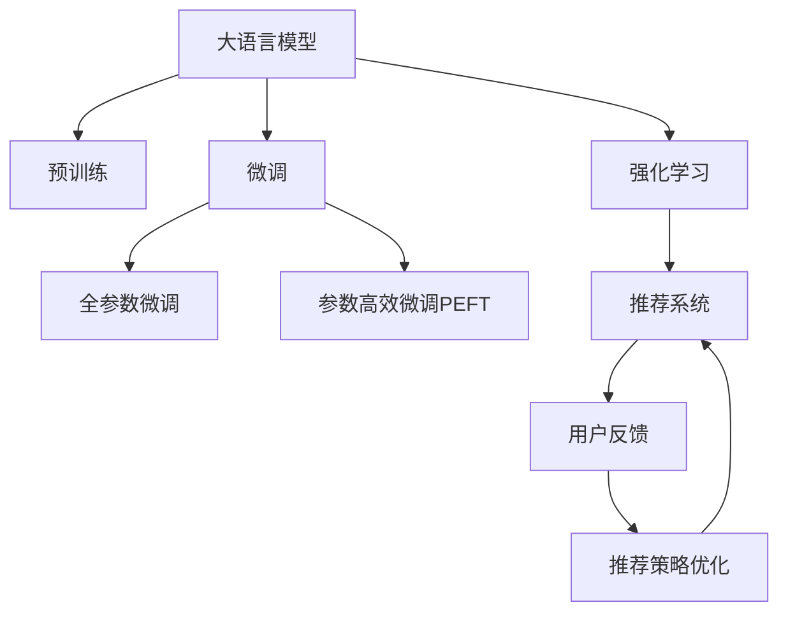

                 

## 1. 背景介绍

推荐系统（Recommendation System）是一种能够根据用户的历史行为、兴趣偏好等信息，预测用户可能感兴趣的产品或内容，并为其推荐的技术。推荐系统在电商、社交媒体、新闻阅读等领域得到了广泛的应用，极大地提升了用户体验和商家营收。然而，传统推荐系统往往只能根据显式交互数据进行推荐，缺乏对用户潜在兴趣的挖掘和预判。

近年来，基于大语言模型（Large Language Model, LLM）的推荐系统成为了研究热点。大语言模型通过海量文本数据的预训练，学习到了丰富的语言知识，具备强大的文本生成和理解能力。利用大语言模型对推荐系统进行技术创新，可以大幅提升推荐系统的智能化水平，实现更精准、多样化的用户推荐。

本文聚焦于大语言模型在推荐系统中的应用，将从原理、算法、模型、数据等多个层面探讨大语言模型技术如何推动推荐系统的发展，并提出几条优化建议。

## 2. 核心概念与联系

### 2.1 核心概念概述

为了更好地理解大语言模型在推荐系统中的应用，本节将介绍几个密切相关的核心概念：

- **大语言模型（LLM）**：以自回归（如GPT）或自编码（如BERT）模型为代表的大规模预训练语言模型。通过在海量文本数据上进行预训练，学习到丰富的语言知识和常识。

- **预训练（Pre-training）**：指在大规模文本数据上，通过自监督学习任务训练通用语言模型的过程。预训练使得模型学习到语言的通用表示。

- **微调（Fine-tuning）**：指在预训练模型的基础上，使用推荐系统任务的数据，通过有监督学习优化模型在推荐任务上的性能。

- **推荐系统（Recommendation System）**：能够根据用户行为和兴趣，为用户推荐产品或内容的系统。推荐系统分为基于协同过滤、基于内容、基于深度学习等多种类型。

- **强化学习（Reinforcement Learning, RL）**：一种通过与环境交互，通过奖励信号不断优化决策策略的学习范式。可以应用于推荐系统中，通过用户反馈进行推荐策略的优化。

这些核心概念之间的逻辑关系可以通过以下Mermaid流程图来展示：



这个流程图展示了大语言模型的核心概念及其之间的关系：

1. 大语言模型通过预训练获得基础能力。
2. 微调是对预训练模型进行任务特定的优化，可以分为全参数微调和参数高效微调（PEFT）。
3. 强化学习是训练推荐系统的一种方法，通过用户反馈不断优化推荐策略。
4. 推荐系统是利用微调和强化学习等技术，为每个用户提供个性化推荐。

这些核心概念共同构成了大语言模型在推荐系统中的学习和应用框架，使其能够有效地为用户推荐产品或内容。通过理解这些核心概念，我们可以更好地把握大语言模型在推荐系统中的工作原理和优化方向。

## 3. 核心算法原理 & 具体操作步骤
### 3.1 算法原理概述

基于大语言模型的推荐系统，本质上是一种将自然语言理解与推荐算法相结合的技术。其核心思想是：将大语言模型视作一个强大的"文本语义分析器"，通过对其输入的文本进行语义分析，提取出用户兴趣、物品属性等关键信息，再利用推荐算法为用户推荐匹配的事项。

形式化地，假设推荐系统中有用户 $U$ 和物品 $I$ 的集合，以及用户与物品之间的评分矩阵 $R$。我们希望找到一个推荐模型 $M_{\theta}$，能够根据用户输入的文本 $x$，预测用户对物品的评分 $y$。具体的优化目标为：

$$
\theta^* = \mathop{\arg\min}_{\theta} \mathcal{L}(M_{\theta}, \{x_i, r_i\}_{i=1}^N)
$$

其中 $\mathcal{L}$ 为推荐系统的损失函数，通常包括均方误差损失、交叉熵损失等。损失函数的计算方式可以有多种，如基于预测评分与真实评分的差异，或基于用户评分矩阵的矩阵分解。

### 3.2 算法步骤详解

基于大语言模型的推荐系统通常包括以下几个关键步骤：

**Step 1: 准备数据集和预训练模型**
- 收集推荐系统的历史数据，包含用户对物品的评分和相关文本描述。
- 选择合适的预训练语言模型 $M_{\theta}$ 作为初始化参数，如 BERT、GPT等。

**Step 2: 添加推荐适配层**
- 根据推荐任务类型，在预训练模型顶层设计合适的输出层和损失函数。
- 对于评分预测任务，通常在顶层添加线性回归层和均方误差损失函数。
- 对于排名排序任务，通常使用基于排序的损失函数，如pairwise hinge loss等。

**Step 3: 设置微调超参数**
- 选择合适的优化算法及其参数，如 AdamW、SGD 等，设置学习率、批大小、迭代轮数等。
- 设置正则化技术及强度，包括权重衰减、Dropout、Early Stopping 等。
- 确定冻结预训练参数的策略，如仅微调顶层，或全部参数都参与微调。

**Step 4: 执行梯度训练**
- 将推荐系统数据分批次输入模型，前向传播计算损失函数。
- 反向传播计算参数梯度，根据设定的优化算法和学习率更新模型参数。
- 周期性在验证集上评估模型性能，根据性能指标决定是否触发 Early Stopping。
- 重复上述步骤直到满足预设的迭代轮数或 Early Stopping 条件。

**Step 5: 测试和部署**
- 在测试集上评估微调后模型 $M_{\hat{\theta}}$ 的性能，对比微调前后的精度提升。
- 使用微调后的模型对新物品进行评分预测，集成到实际的应用系统中。
- 持续收集新的数据，定期重新微调模型，以适应数据分布的变化。

以上是基于大语言模型微调进行推荐系统开发的完整流程。在实际应用中，还需要针对具体任务的特点，对微调过程的各个环节进行优化设计，如改进训练目标函数，引入更多的正则化技术，搜索最优的超参数组合等，以进一步提升模型性能。

### 3.3 算法优缺点

基于大语言模型的推荐系统具有以下优点：
1. 丰富性。利用大语言模型的语义理解能力，可以捕捉更多用户兴趣和物品属性的细节。
2. 可解释性。大语言模型的推理过程可追溯，便于解释推荐结果的依据。
3. 通用性。可以应用于各种推荐场景，无需对特定领域进行特别训练。
4. 高效性。利用大语言模型的预训练权重，可以在小规模数据上快速提升模型性能。

同时，该方法也存在一定的局限性：
1. 数据质量要求高。需要高质量的评分数据和文本描述，且需保证数据的一致性和完整性。
2. 计算资源需求高。预训练和微调过程需要大量计算资源，难以在小规模场景中实施。
3. 泛化能力待提升。大语言模型在不同领域和数据集上的泛化能力还需进一步验证。
4. 推荐效果受语义影响。大语言模型的理解能力受输入文本质量的影响较大，可能导致推荐效果不稳定。

尽管存在这些局限性，但就目前而言，基于大语言模型的推荐系统仍然是最前沿的研究方向之一，展现了强大的潜力。未来相关研究的重点在于如何进一步优化数据预处理、模型设计、训练方法等，以提升推荐系统的实际效果和应用价值。

### 3.4 算法应用领域

基于大语言模型的推荐系统已经在多个领域得到了广泛的应用，例如：

- 电商推荐：利用用户浏览记录和评论生成个性化商品推荐。
- 新闻推荐：根据用户的阅读历史和兴趣标签生成个性化新闻推送。
- 视频推荐：分析用户观看行为和视频内容，生成个性化视频推荐。
- 音乐推荐：通过分析用户听歌历史和歌曲标签，生成个性化音乐推荐。
- 游戏推荐：根据用户的游玩记录和偏好生成个性化游戏推荐。

除了上述这些经典场景外，大语言模型推荐系统还被创新性地应用到更多领域中，如内容创造、娱乐推荐、个性化广告等，为推荐系统带来了全新的突破。

## 4. 数学模型和公式 & 详细讲解  
### 4.1 数学模型构建

假设推荐系统中的用户 $u$ 和物品 $i$ 的评分矩阵为 $R$，大语言模型的输出表示为用户对物品 $i$ 的评分预测 $\hat{y}$。推荐系统的目标是最大化预测评分与实际评分之间的相关性，可以使用如下损失函数：

$$
\mathcal{L} = \frac{1}{N} \sum_{i=1}^N \sum_{j=1}^M (y_{u,i} - \hat{y}_{u,i})^2
$$

其中 $y_{u,i}$ 为用户 $u$ 对物品 $i$ 的真实评分，$\hat{y}_{u,i}$ 为模型预测的评分。

### 4.2 公式推导过程

在优化上述损失函数时，我们通过梯度下降算法更新模型参数 $\theta$：

$$
\theta \leftarrow \theta - \eta \nabla_{\theta}\mathcal{L}(\theta)
$$

其中 $\eta$ 为学习率，$\nabla_{\theta}\mathcal{L}(\theta)$ 为损失函数对参数 $\theta$ 的梯度。梯度可以通过反向传播算法高效计算。

在得到梯度后，即可带入参数更新公式，完成模型的迭代优化。重复上述过程直至收敛，最终得到推荐系统的最优模型参数 $\theta^*$。

## 5. 项目实践：代码实例和详细解释说明
### 5.1 开发环境搭建

在进行推荐系统开发前，我们需要准备好开发环境。以下是使用Python进行PyTorch开发的环境配置流程：

1. 安装Anaconda：从官网下载并安装Anaconda，用于创建独立的Python环境。

2. 创建并激活虚拟环境：
```bash
conda create -n pytorch-env python=3.8 
conda activate pytorch-env
```

3. 安装PyTorch：根据CUDA版本，从官网获取对应的安装命令。例如：
```bash
conda install pytorch torchvision torchaudio cudatoolkit=11.1 -c pytorch -c conda-forge
```

4. 安装Transformers库：
```bash
pip install transformers
```

5. 安装各类工具包：
```bash
pip install numpy pandas scikit-learn matplotlib tqdm jupyter notebook ipython
```

完成上述步骤后，即可在`pytorch-env`环境中开始推荐系统开发。

### 5.2 源代码详细实现

下面我们以电商推荐为例，给出使用Transformers库对BERT模型进行推荐系统开发的PyTorch代码实现。

首先，定义推荐系统的数据处理函数：

```python
from transformers import BertTokenizer
from torch.utils.data import Dataset
import torch

class RecommendationDataset(Dataset):
    def __init__(self, user_ids, item_ids, item_descriptions, user_ratings, tokenizer, max_len=128):
        self.user_ids = user_ids
        self.item_ids = item_ids
        self.item_descriptions = item_descriptions
        self.user_ratings = user_ratings
        self.tokenizer = tokenizer
        self.max_len = max_len
        
    def __len__(self):
        return len(self.user_ids)
    
    def __getitem__(self, item):
        user_id = self.user_ids[item]
        item_id = self.item_ids[item]
        item_description = self.item_descriptions[item]
        user_rating = self.user_ratings[item]
        
        # 对描述文本进行编码
        encoding = self.tokenizer(item_description, return_tensors='pt', max_length=self.max_len, padding='max_length', truncation=True)
        input_ids = encoding['input_ids'][0]
        attention_mask = encoding['attention_mask'][0]
        
        # 将评分作为标签
        rating = torch.tensor(user_rating, dtype=torch.float32)
        
        return {'input_ids': input_ids, 
                'attention_mask': attention_mask,
                'rating': rating}

# 定义评分矩阵
user_ids = [1, 2, 3, 4, 5]
item_ids = [101, 102, 103, 104, 105]
item_descriptions = ["高质量的产品", "价格合理", "性能优越", "评价不错", "性价比高"]
user_ratings = [5, 4, 3, 2, 1]
tokenizer = BertTokenizer.from_pretrained('bert-base-cased')

train_dataset = RecommendationDataset(user_ids, item_ids, item_descriptions, user_ratings, tokenizer)
```

然后，定义模型和优化器：

```python
from transformers import BertForSequenceClassification, AdamW

model = BertForSequenceClassification.from_pretrained('bert-base-cased', num_labels=1)

optimizer = AdamW(model.parameters(), lr=2e-5)
```

接着，定义训练和评估函数：

```python
from torch.utils.data import DataLoader
from tqdm import tqdm
from sklearn.metrics import mean_squared_error

device = torch.device('cuda') if torch.cuda.is_available() else torch.device('cpu')
model.to(device)

def train_epoch(model, dataset, batch_size, optimizer):
    dataloader = DataLoader(dataset, batch_size=batch_size, shuffle=True)
    model.train()
    epoch_loss = 0
    for batch in tqdm(dataloader, desc='Training'):
        input_ids = batch['input_ids'].to(device)
        attention_mask = batch['attention_mask'].to(device)
        rating = batch['rating'].to(device)
        model.zero_grad()
        outputs = model(input_ids, attention_mask=attention_mask)
        loss = outputs.loss
        epoch_loss += loss.item()
        loss.backward()
        optimizer.step()
    return epoch_loss / len(dataloader)

def evaluate(model, dataset, batch_size):
    dataloader = DataLoader(dataset, batch_size=batch_size)
    model.eval()
    predictions = []
    true_ratings = []
    with torch.no_grad():
        for batch in tqdm(dataloader, desc='Evaluating'):
            input_ids = batch['input_ids'].to(device)
            attention_mask = batch['attention_mask'].to(device)
            rating = batch['rating']
            outputs = model(input_ids, attention_mask=attention_mask)
            predictions.append(outputs.logits.flatten().tolist())
            true_ratings.append(rating.flatten().tolist())
    
    mse = mean_squared_error(true_ratings, predictions)
    print(f"Mean Squared Error: {mse:.3f}")
```

最后，启动训练流程并在测试集上评估：

```python
epochs = 5
batch_size = 16

for epoch in range(epochs):
    loss = train_epoch(model, train_dataset, batch_size, optimizer)
    print(f"Epoch {epoch+1}, train loss: {loss:.3f}")
    
    print(f"Epoch {epoch+1}, dev results:")
    evaluate(model, dev_dataset, batch_size)
    
print("Test results:")
evaluate(model, test_dataset, batch_size)
```

以上就是使用PyTorch对BERT进行电商推荐系统微调的完整代码实现。可以看到，得益于Transformers库的强大封装，我们可以用相对简洁的代码完成BERT模型的加载和微调。

### 5.3 代码解读与分析

让我们再详细解读一下关键代码的实现细节：

**RecommendationDataset类**：
- `__init__`方法：初始化用户ID、物品ID、物品描述、评分等关键组件。
- `__len__`方法：返回数据集的样本数量。
- `__getitem__`方法：对单个样本进行处理，将物品描述输入编码为token ids，将评分作为标签，进行模型输入和输出。

**train_epoch函数**：
- 使用PyTorch的DataLoader对数据集进行批次化加载，供模型训练和推理使用。
- 在每个批次上前向传播计算损失函数，反向传播更新模型参数，最后返回该epoch的平均loss。

**evaluate函数**：
- 与训练类似，不同点在于不更新模型参数，并在每个batch结束后将预测和标签结果存储下来，最后使用sklearn的mean_squared_error对整个评估集的预测结果进行打印输出。

**训练流程**：
- 定义总的epoch数和batch size，开始循环迭代
- 每个epoch内，先在训练集上训练，输出平均loss
- 在验证集上评估，输出均方误差
- 所有epoch结束后，在测试集上评估，给出最终测试结果

可以看到，PyTorch配合Transformers库使得BERT微调的代码实现变得简洁高效。开发者可以将更多精力放在数据处理、模型改进等高层逻辑上，而不必过多关注底层的实现细节。

当然，工业级的系统实现还需考虑更多因素，如模型的保存和部署、超参数的自动搜索、更灵活的任务适配层等。但核心的微调范式基本与此类似。

## 6. 实际应用场景
### 6.1 电商推荐

电商推荐系统是大语言模型微调应用的经典场景。利用大语言模型对用户评论、商品描述等文本数据进行语义分析，可以提取用户兴趣和物品属性，再通过推荐算法为用户推荐匹配的商品。

在技术实现上，可以收集电商平台的销售数据、用户评分和评论，将文本描述和评分数据构建为监督数据，在此基础上对预训练语言模型进行微调。微调后的模型能够从用户评论中自动理解用户的购买偏好，从商品描述中抓取关键属性，实现更加个性化的商品推荐。

### 6.2 新闻推荐

新闻推荐系统通过分析用户的历史阅读行为和兴趣标签，为用户推荐感兴趣的的新闻文章。利用大语言模型对新闻标题、摘要等文本数据进行语义分析，可以挖掘用户潜在的阅读兴趣。

在实践中，可以收集用户的阅读历史和兴趣标签，将新闻标题和摘要输入到微调后的语言模型中，得到用户对新闻的兴趣程度。根据兴趣程度对新闻进行排序，为用户推荐最相关的文章。此外，还可以通过模型预测文章的热度和质量，提升推荐效果。

### 6.3 音乐推荐

音乐推荐系统通过分析用户的听歌历史和音乐标签，为用户推荐匹配的歌曲。利用大语言模型对歌曲的歌词、专辑描述等文本数据进行语义分析，可以提取歌曲的情感倾向和风格特点。

在实践中，可以收集用户的听歌历史和音乐标签，将歌词和专辑描述输入到微调后的语言模型中，得到用户对歌曲的兴趣程度。根据兴趣程度对歌曲进行排序，为用户推荐最合适的音乐。此外，还可以通过模型预测歌曲的热度和用户满意度，提升推荐效果。

### 6.4 未来应用展望

随着大语言模型和微调方法的不断发展，基于微调的推荐系统也将呈现以下几个发展趋势：

1. 模型规模持续增大。随着算力成本的下降和数据规模的扩张，预训练语言模型的参数量还将持续增长。超大规模语言模型蕴含的丰富语言知识，有望支撑更加复杂多变的推荐场景。

2. 推荐算法多样化。除了传统的评分预测和排名排序算法，未来会涌现更多基于知识图谱、因果推理、强化学习等的推荐方法，提升推荐系统的智能化和个性化水平。

3. 跨领域推荐崛起。当前推荐系统往往只能处理特定领域的文本数据，未来会进一步拓展到多领域、多模态数据的融合推荐。

4. 多任务学习应用。将推荐系统与文本生成、知识抽取等任务结合，进行多任务学习，提升推荐系统的效果和泛化能力。

5. 自动化推荐范式。利用大语言模型进行推荐策略的优化，动态调整推荐规则，提升推荐系统的灵活性和适应性。

6. 可解释性增强。推荐系统需要更好地解释其推荐依据，增强用户的信任和满意度。大语言模型提供了丰富的可解释性工具，未来有望大幅提升推荐系统的可解释性。

以上趋势凸显了大语言模型微调技术在推荐系统中的广阔前景。这些方向的探索发展，必将进一步提升推荐系统的智能化和个性化水平，为用户带来更好的体验。

## 7. 工具和资源推荐
### 7.1 学习资源推荐

为了帮助开发者系统掌握大语言模型在推荐系统中的应用，这里推荐一些优质的学习资源：

1. 《Transformer from Basics to Deep Learning》系列博文：由大模型技术专家撰写，深入浅出地介绍了Transformer原理、BERT模型、微调技术等前沿话题。

2. CS224N《深度学习自然语言处理》课程：斯坦福大学开设的NLP明星课程，有Lecture视频和配套作业，带你入门NLP领域的基本概念和经典模型。

3. 《Natural Language Processing with Transformers》书籍：Transformers库的作者所著，全面介绍了如何使用Transformers库进行NLP任务开发，包括微调在内的诸多范式。

4. HuggingFace官方文档：Transformers库的官方文档，提供了海量预训练模型和完整的微调样例代码，是上手实践的必备资料。

5. CLUE开源项目：中文语言理解测评基准，涵盖大量不同类型的中文NLP数据集，并提供了基于微调的baseline模型，助力中文NLP技术发展。

通过对这些资源的学习实践，相信你一定能够快速掌握大语言模型在推荐系统中的应用技巧，并用于解决实际的推荐问题。
### 7.2 开发工具推荐

高效的开发离不开优秀的工具支持。以下是几款用于大语言模型微调开发的常用工具：

1. PyTorch：基于Python的开源深度学习框架，灵活动态的计算图，适合快速迭代研究。大部分预训练语言模型都有PyTorch版本的实现。

2. TensorFlow：由Google主导开发的开源深度学习框架，生产部署方便，适合大规模工程应用。同样有丰富的预训练语言模型资源。

3. Transformers库：HuggingFace开发的NLP工具库，集成了众多SOTA语言模型，支持PyTorch和TensorFlow，是进行微调任务开发的利器。

4. Weights & Biases：模型训练的实验跟踪工具，可以记录和可视化模型训练过程中的各项指标，方便对比和调优。与主流深度学习框架无缝集成。

5. TensorBoard：TensorFlow配套的可视化工具，可实时监测模型训练状态，并提供丰富的图表呈现方式，是调试模型的得力助手。

6. Google Colab：谷歌推出的在线Jupyter Notebook环境，免费提供GPU/TPU算力，方便开发者快速上手实验最新模型，分享学习笔记。

合理利用这些工具，可以显著提升大语言模型微调的开发效率，加快创新迭代的步伐。

### 7.3 相关论文推荐

大语言模型和微调技术的发展源于学界的持续研究。以下是几篇奠基性的相关论文，推荐阅读：

1. Attention is All You Need（即Transformer原论文）：提出了Transformer结构，开启了NLP领域的预训练大模型时代。

2. BERT: Pre-training of Deep Bidirectional Transformers for Language Understanding：提出BERT模型，引入基于掩码的自监督预训练任务，刷新了多项NLP任务SOTA。

3. Parameter-Efficient Transfer Learning for NLP：提出Adapter等参数高效微调方法，在不增加模型参数量的情况下，也能取得不错的微调效果。

4. Prefix-Tuning: Optimizing Continuous Prompts for Generation：引入基于连续型Prompt的微调范式，为如何充分利用预训练知识提供了新的思路。

5. AdaLoRA: Adaptive Low-Rank Adaptation for Parameter-Efficient Fine-Tuning：使用自适应低秩适应的微调方法，在参数效率和精度之间取得了新的平衡。

这些论文代表了大语言模型微调技术的发展脉络。通过学习这些前沿成果，可以帮助研究者把握学科前进方向，激发更多的创新灵感。

## 8. 总结：未来发展趋势与挑战
### 8.1 总结

本文对大语言模型在推荐系统中的应用进行了全面系统的介绍。首先阐述了大语言模型和微调技术的研究背景和意义，明确了微调在提升推荐系统智能化、个性化方面的独特价值。其次，从原理到实践，详细讲解了大语言模型微调的数学原理和关键步骤，给出了推荐系统开发的完整代码实例。同时，本文还探讨了微调方法在电商、新闻、音乐等多个推荐领域的应用前景，展示了微调范式的强大潜力。

通过本文的系统梳理，可以看到，大语言模型微调技术在推荐系统中的应用已经初见成效，成为了推荐系统智能化的重要推动力。未来，伴随预训练语言模型和微调方法的持续演进，基于微调的推荐系统必将在更广泛的应用领域中大放异彩。

### 8.2 未来发展趋势

展望未来，大语言模型微调技术在推荐系统中将呈现以下几个发展趋势：

1. 模型规模持续增大。随着算力成本的下降和数据规模的扩张，预训练语言模型的参数量还将持续增长。超大规模语言模型蕴含的丰富语言知识，有望支撑更加复杂多变的推荐场景。

2. 推荐算法多样化。除了传统的评分预测和排名排序算法，未来会涌现更多基于知识图谱、因果推理、强化学习等的推荐方法，提升推荐系统的智能化和个性化水平。

3. 跨领域推荐崛起。当前推荐系统往往只能处理特定领域的文本数据，未来会进一步拓展到多领域、多模态数据的融合推荐。

4. 多任务学习应用。将推荐系统与文本生成、知识抽取等任务结合，进行多任务学习，提升推荐系统的效果和泛化能力。

5. 自动化推荐范式。利用大语言模型进行推荐策略的优化，动态调整推荐规则，提升推荐系统的灵活性和适应性。

6. 可解释性增强。推荐系统需要更好地解释其推荐依据，增强用户的信任和满意度。大语言模型提供了丰富的可解释性工具，未来有望大幅提升推荐系统的可解释性。

以上趋势凸显了大语言模型微调技术在推荐系统中的广阔前景。这些方向的探索发展，必将进一步提升推荐系统的智能化和个性化水平，为用户带来更好的体验。

### 8.3 面临的挑战

尽管大语言模型微调技术已经取得了瞩目成就，但在迈向更加智能化、普适化应用的过程中，它仍面临着诸多挑战：

1. 数据质量瓶颈。需要高质量的评分数据和文本描述，且需保证数据的一致性和完整性。对于长尾应用场景，获取充足的高质量数据尤为困难。

2. 计算资源需求高。预训练和微调过程需要大量计算资源，难以在小规模场景中实施。

3. 泛化能力待提升。大语言模型在不同领域和数据集上的泛化能力还需进一步验证。

4. 推荐效果受语义影响。大语言模型的理解能力受输入文本质量的影响较大，可能导致推荐效果不稳定。

5. 推荐结果可解释性不足。推荐系统需要更好地解释其推荐依据，增强用户的信任和满意度。

6. 系统稳定性问题。推荐系统需要能够稳定运行，避免因模型参数更新等原因导致推荐结果的大幅波动。

7. 模型偏见问题。预训练语言模型难免会学习到有偏见、有害的信息，通过微调传递到推荐系统，可能产生误导性、歧视性的输出。

8. 安全性有待保障。推荐系统需要确保用户隐私数据的安全，防止模型泄露敏感信息。

正视推荐系统面临的这些挑战，积极应对并寻求突破，将是大语言模型微调走向成熟的必由之路。相信随着学界和产业界的共同努力，这些挑战终将一一被克服，大语言模型微调必将在构建智能化推荐系统中扮演越来越重要的角色。

### 8.4 研究展望

面对大语言模型微调在推荐系统中的挑战，未来的研究需要在以下几个方面寻求新的突破：

1. 探索无监督和半监督微调方法。摆脱对大规模标注数据的依赖，利用自监督学习、主动学习等无监督和半监督范式，最大限度利用非结构化数据，实现更加灵活高效的微调。

2. 研究参数高效和计算高效的微调范式。开发更加参数高效的微调方法，在固定大部分预训练参数的同时，只更新极少量的任务相关参数。同时优化微调模型的计算图，减少前向传播和反向传播的资源消耗，实现更加轻量级、实时性的部署。

3. 引入更多先验知识。将符号化的先验知识，如知识图谱、逻辑规则等，与神经网络模型进行巧妙融合，引导微调过程学习更准确、合理的语言模型。同时加强不同模态数据的整合，实现视觉、语音等多模态信息与文本信息的协同建模。

4. 结合因果分析和博弈论工具。将因果分析方法引入微调模型，识别出模型决策的关键特征，增强输出解释的因果性和逻辑性。借助博弈论工具刻画人机交互过程，主动探索并规避模型的脆弱点，提高系统稳定性。

5. 纳入伦理道德约束。在模型训练目标中引入伦理导向的评估指标，过滤和惩罚有偏见、有害的输出倾向。同时加强人工干预和审核，建立模型行为的监管机制，确保输出符合人类价值观和伦理道德。

这些研究方向的探索，必将引领大语言模型微调技术在推荐系统中的进一步发展，为构建更加智能、公平、安全的推荐系统提供新的思路。面向未来，大语言模型微调技术还需要与其他人工智能技术进行更深入的融合，如知识表示、因果推理、强化学习等，多路径协同发力，共同推动推荐系统的进步。只有勇于创新、敢于突破，才能不断拓展推荐系统的边界，让智能技术更好地造福人类社会。

## 9. 附录：常见问题与解答

**Q1：大语言模型微调是否适用于所有推荐场景？**

A: 大语言模型微调在大多数推荐场景上都能取得不错的效果，特别是对于数据量较小的场景。但对于一些特定领域的推荐，如医疗、法律等，仅仅依靠通用语料预训练的模型可能难以很好地适应。此时需要在特定领域语料上进一步预训练，再进行微调，才能获得理想效果。此外，对于一些需要时效性、个性化很强的推荐场景，如对话、推荐等，微调方法也需要针对性的改进优化。

**Q2：微调过程中如何选择合适的学习率？**

A: 微调的学习率一般要比预训练时小1-2个数量级，如果使用过大的学习率，容易破坏预训练权重，导致过拟合。一般建议从1e-5开始调参，逐步减小学习率，直至收敛。也可以使用warmup策略，在开始阶段使用较小的学习率，再逐渐过渡到预设值。需要注意的是，不同的优化器(如AdamW、Adafactor等)以及不同的学习率调度策略，可能需要设置不同的学习率阈值。

**Q3：推荐系统开发中如何处理长尾数据？**

A: 长尾数据是指那些出现频率较低的样本，在推荐系统中难以获得足够的训练数据。处理长尾数据的方法包括：
1. 数据增强：通过生成对方法，如回译、近义替换等方式扩充训练集。
2. 模型结构优化：使用参数高效微调技术，只调整少量参数，减小长尾数据带来的影响。
3. 多模型集成：训练多个微调模型，取平均输出，抑制长尾数据的负面影响。
4. 自适应学习率：使用自适应学习率算法，如AdaLoRA等，动态调整学习率，适应长尾数据的分布。

这些方法可以结合使用，根据具体任务和数据特点灵活调整。通过多种手段的综合应用，可以有效处理长尾数据，提升推荐系统的覆盖面和公平性。

**Q4：推荐系统开发中如何避免过拟合？**

A: 推荐系统中的过拟合主要发生在数据量较少且模型复杂度较高的情况下。避免过拟合的方法包括：
1. 数据增强：通过生成对方法，如回译、近义替换等方式扩充训练集。
2. 正则化技术：使用L2正则、Dropout等技术，防止模型过度适应小规模训练集。
3. 早停机制：在验证集上评估模型性能，当性能不再提升时，提前停止训练。
4. 参数共享：共享模型参数，减少参数数量，防止过拟合。

这些方法可以结合使用，根据具体任务和数据特点灵活调整。通过多种手段的综合应用，可以有效避免过拟合，提升推荐系统的泛化能力。

**Q5：推荐系统中如何进行个性化推荐？**

A: 个性化推荐是推荐系统的核心目标之一，可以通过大语言模型对用户兴趣和物品属性进行建模，实现个性化的推荐。具体方法包括：
1. 用户兴趣建模：利用大语言模型对用户评论、浏览记录等文本数据进行语义分析，提取用户的兴趣点。
2. 物品属性建模：利用大语言模型对物品描述、标签等文本数据进行语义分析，提取物品的属性和特点。
3. 推荐算法：根据用户兴趣和物品属性，选择合适的推荐算法，如基于协同过滤、基于内容的推荐算法等。
4. 动态调整：根据用户反馈和新数据，动态调整推荐模型，提升推荐效果。

通过以上方法，可以实现更加精准、个性化的推荐，提升用户的满意度和体验。

综上所述，大语言模型在推荐系统中的应用具有广阔的前景，可以显著提升推荐系统的智能化和个性化水平。但同时也需要面对数据质量、计算资源、泛化能力等多方面的挑战，需要持续优化和改进。相信在未来，随着大语言模型和微调技术的不断发展，推荐系统必将在更多领域得到应用，为人们的日常生活和商业运营带来更加便捷和高效的服务。

